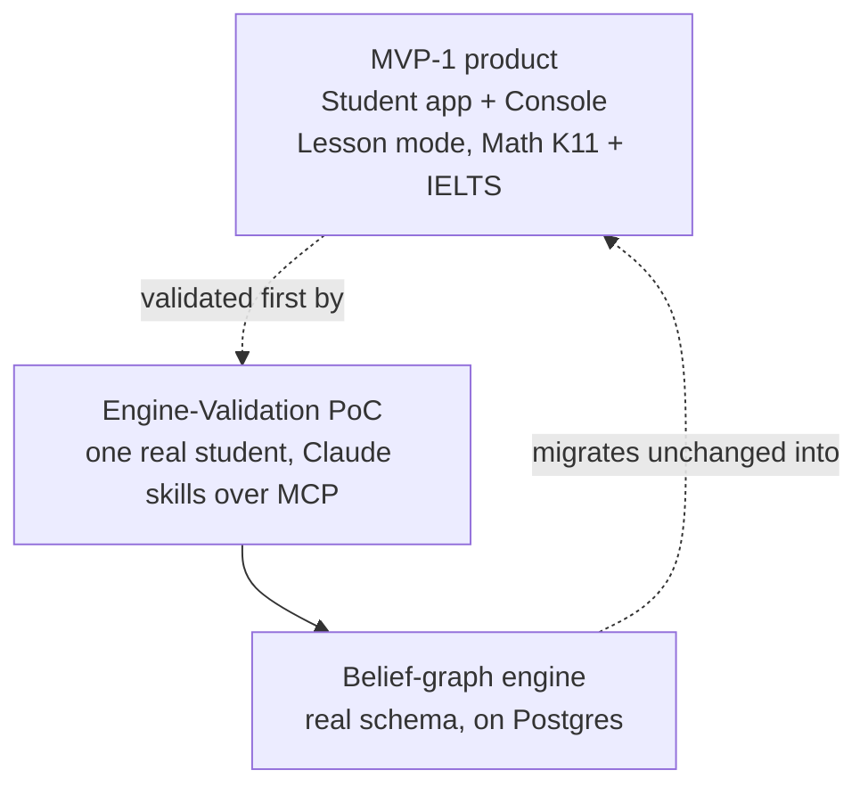

Stemolly's MVP-1 has two layers. One is the actual product: a Student app and a Console, one study mode, two subjects. The other is a shortcut the team takes to de-risk it: before building that full app, one real student uses a much smaller setup — Claude talking to the engine directly — to prove the engine actually works. This page gives the map; the three pages below go deep on each part.

The whole plan rests on one bet: a single belief-graph engine can track a student's mental model across very different subjects. What ships, what is deferred, and how the PoC is built all flow from proving that bet cheaply before spending on the app shell.

The engine is the only durable part of the PoC. Everything around it — the Claude skills, the MCP glue, the single-user setup — is disposable scaffolding, built to be thrown away once the app exists.

## Pages in this topic

- **[MVP-1 Product Scope](/product/mvp-poc/mvp-scope/)** — what actually ships: the Student app and Console, the Lesson-only study mode and its curriculum picker, and why Math (deep) and Language (thin) are the two launch subjects.
- **[Engine-Validation PoC: Design & Boundaries](/product/mvp-poc/poc-design/)** — why the PoC runs before the app, how Claude plays both tutor roles, and the rules (append-only writes, real schema, operator-only seeding) that keep its data trustworthy and migratable.
- **[Running & Deploying the PoC](/product/mvp-poc/poc-ops/)** — the local runbook for driving the MCP over HTTP, the transport bugs the team found and fixed while hardening it, and how the PoC repo is hosted and deployed.
