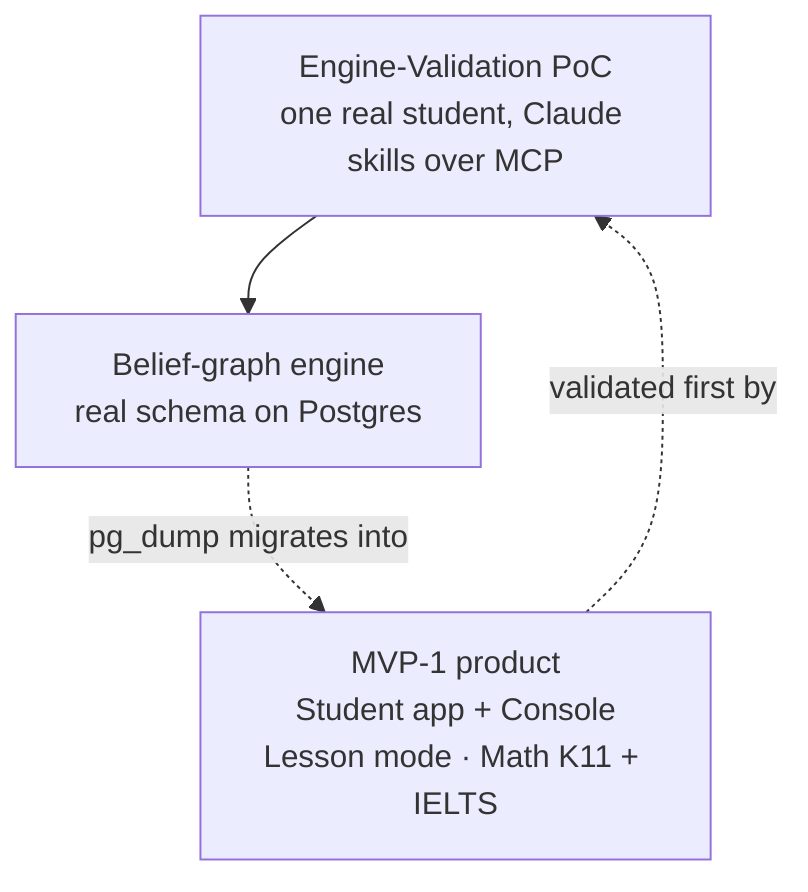

Stemolly's MVP-1 has two layers. One is the actual product: a Student app and a Console, one study mode, two subjects. The other is a shortcut the team takes to de-risk it: before building that full app, one real student uses a much smaller setup — Claude talking to the engine directly — to prove the engine actually works. This page gives the map; the three pages below go deep on each part.

The whole plan rests on one bet: a single belief-graph engine can track a student's mental model across very different subjects. What ships, what is deferred, and how the PoC is built all flow from proving that bet cheaply before spending on the app shell.

The engine is the only durable part of the PoC. Everything around it — the Claude skills, the MCP glue, the single-user setup — is disposable scaffolding built to be thrown away once the app exists. The Claude skills are not scheduled deliverables; they are improved continuously across real sessions, and the work the team plans and ships is the engine surface those skills call.

**Sprint 13 milestone:** after the PoC proved the engine, the `engine-poc` repository was retired. The engine module and its MCP driving adapter moved wholesale into `app/` as first-class workspace members, and the VPS deployment was rebuilt inside `app/` as well. The archived `engine-poc` repo still exists as a read-only record.

## Pages in this topic

- **[MVP-1 Product Scope](./mvp-scope/)** — what actually ships: the Student app (and a Console that is currently a placeholder shell), the Lesson-only study mode and its curriculum picker, the two launch subjects (Math deep, Language thin), and the first-release board scope as a measurement strategy.
- **[Engine-Validation PoC: Design & Boundaries](./poc-design/)** — why the PoC runs before the app, how Claude plays both tutor roles, the rules that keep its data trustworthy and migratable, the assignment-brief workflow (CAS key verification, checkpoint split, slug validation), and the known boundary where the engine is absorbing PoC application concerns.
- **[Running & Deploying the PoC](./poc-ops/)** — the local runbook for the MCP over HTTP, the wire bugs the team fixed, the VPS deployment (hostnames, SSH-tunnel migrations), and the backup-and-restore-verification cycle. Also covers the Sprint 13 migration into `app/`.
