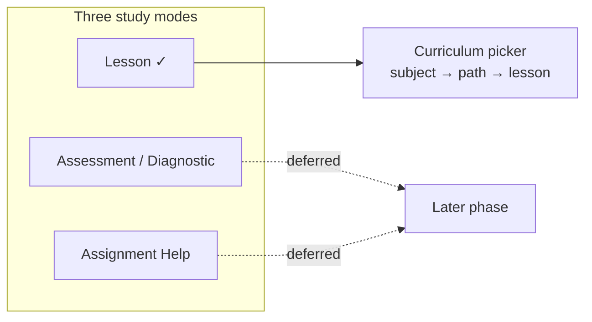
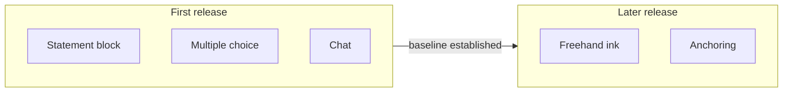

MVP-1 is deliberately narrow. It ships two applications, one study mode, and two subjects — each choice made to give the belief-graph engine the cleanest possible test, not to build the whole product at once.

## Two apps: Student app and Console

MVP-1 ships both the **Student app** (the learning surface where students take lessons) and the **Console** (the educator/operator app, with an **Author** area for building curriculum and an **Observe** area for reviewing engine metrics). An earlier plan would have shipped the student app alone, but the Stemolly team itself is an active MVP-1 Console user — building curriculum in Author and checking whether the engine's signals are real in Observe.

Teachers and schools, as a managed self-serve user tier, are explicitly deferred to a later phase. The Console is designed with that future teacher use in mind, but MVP-1 exposes no teacher or school management features.

:::caution[Console is not yet built]
As of late September 2026, the Console application renders only a design-system placeholder: a header bar with a logo and theme switch, and a centred card that says "Console" with placeholder text. There are no routes, data fetches, forms, or domain-specific operator screens. The full Author and Observe areas described above are the plan, not the current implementation.
:::

## One study mode: Lesson, entered through a curriculum picker

Stemolly has three study modes — Lesson, Assessment/Diagnostic, and Assignment Help. MVP-1 ships only **Lesson**; the other two are deferred.

A Lesson session starts with a **structured curriculum path picker**: the student picks a subject, then a path, then a lesson from curriculum the team has already authored — rather than typing a free-text topic or letting the AI decide. This single decision settles two questions at once: which mode ships first, and how a session begins.

A picked path resolves directly to an authored lesson brief that the tutor conducts Socratically — leading the student to the answer through questions. Because the curriculum maps onto the concept graph's prerequisite structure, the picker also gives the engine a stable anchor for evidence from the very first turn.

Free-text topic entry was deferred for the opposite reason: it would force the AI to invent structure on the fly, leaving the engine with no stable concept to hang evidence on. That would undercut the very thing MVP-1 exists to prove.

## Two subjects, two different jobs

| Subject | Depth | Role |
|---|---|---|
| Math — Vietnam K11 | Full depth, real prerequisite graph | Deep validation vehicle |
| Language — IELTS Writing + Reading | Thin launch | Generalization proof |

Math is the deep vehicle because its misconceptions are crisp and easy to ground in evidence, its concept graph is a genuine prerequisite structure, and it gives the strongest demo of the engine beating a naive baseline.

Language ships thin to prove something harder: that *one* engine produces a real, useful mental model across two very different domains and two different teaching styles — Socratic questioning for math, versus Correct-and-Reinforce for language. That is a bigger claim than "it works for algebra." Within Language, Reading is the easiest fit for Lesson mode and easiest to ground; Writing carries the richest signal, because grammar and writing patterns are highly predictable for Vietnamese-first-language learners.

SAT Math is only anticipated by the shared-node design, not necessarily built in MVP-1.

## First-release board scope: building a clean measurement baseline

The Student app's board ships in two stages. The first release includes only **static** input kinds — statement blocks, multiple choice, and chat. Freehand ink (handwriting on a drawing surface) is deferred to a later release. Anchoring (where a student marks part of their own working to link it to evidence) is also not built in the first release.

The obvious reason to defer freehand is delivery: it adds segmentation, transcription, a decline path, and receipts — all of which can slip. But the stronger reason is **measurement**.

With only operator-delivered content and button-tap responses, the student's input in the first release is exactly known — no vision model reads it, no transcription step interprets it. A groundedness miss in that window is therefore attributable to exactly two sources: the Analyst's reasoning, or a catalog entry. Freehand would add a third possibility (a misread by the transcription model). By deferring it, the team gets a clean two-source baseline first, and can then measure the real cost of handwriting against a number already trusted.

One design condition keeps the deferral honest: the board's plugin mechanism is **specified against the hardest kind — freehand — while only the easy ones are built**. A contract designed only around statement and multiple choice would break the moment the first capture kind arrived. Anchoring is also excluded from the first release for a structural reason: marking only makes sense against a student's own working, and anchoring a statement block would mean circling the entire problem.

