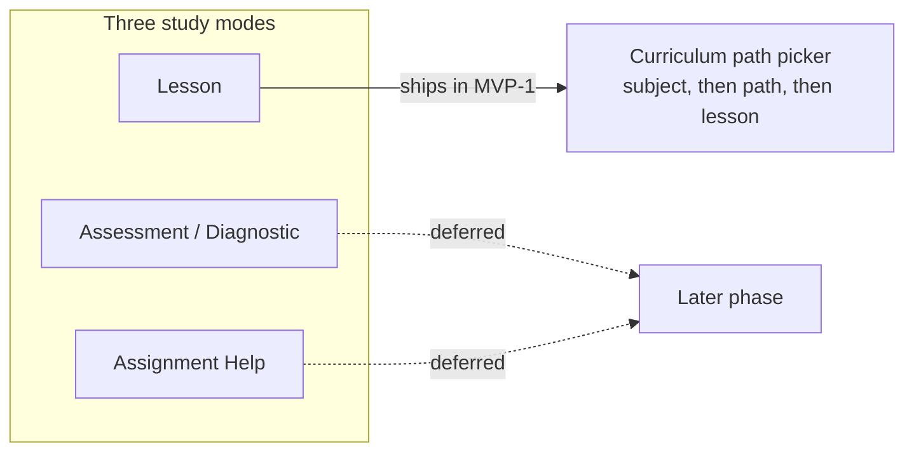

MVP-1 is deliberately narrow. It ships two applications, one study mode, and two subjects — each choice made to give the belief-graph engine the cleanest possible test, not to build the whole product at once.

## Two apps ship: Student and Console

MVP-1 ships both the **Student app** (the learning surface where students take lessons) and the **Console** (the educator/operator app, with an **Author** area for building curriculum and an **Observe** area for reviewing engine metrics). This updates an earlier plan where the student app shipped alone — the Stemolly team itself is an active MVP-1 user of the Console, using Author to build the curriculum and Observe to check whether the engine's signals are real.

Teachers and schools, as a managed, self-serve user tier, are explicitly deferred to a later phase. The Console is designed with that future teacher use in mind, but MVP-1 exposes no teacher or school management features.

## One study mode: Lesson, entered through a curriculum picker

Stemolly has three study modes — Lesson, Assessment/Diagnostic, and Assignment Help. MVP-1 ships only **Lesson**; the other two are deferred.

A Lesson session starts with a **structured curriculum path picker**: the student picks a subject, then a path, then a lesson from curriculum the team has already authored — rather than typing a free-text topic or letting the AI run a diagnostic. This single decision settles two questions at once: which mode ships first, and how a session begins.

The reasoning is practical. A picked path resolves directly to an authored lesson brief that the tutor conducts Socratically (leading the student to the answer through questions, rather than lecturing). And because the curriculum maps onto the concept graph's nodes and prerequisite links, the picker gives the engine a stable anchor to attach evidence to from the very first turn.

Free-text topic entry — where a student types whatever they want to study — was deferred for the opposite reason: it would force the AI to invent structure on the fly, leaving the engine with no stable concept to hang evidence on. That would undercut the very thing MVP-1 exists to prove. Free-text or mixed entry can be added later, once the engine is proven on structured paths.

## Two subjects, two different jobs

MVP-1 launches two subjects, and they are not doing the same job:

| Subject | Depth | Role |
|---|---|---|
| Math — Vietnam K11 | Full depth, real prerequisite graph | The deep validation vehicle |
| Language — IELTS Writing + Reading | Thin launch | A generalization proof |

Math is the deep vehicle because its misconceptions are crisp and easy to ground in evidence, its concept graph is a genuine prerequisite structure, and it gives the strongest demo of the engine beating a naive baseline.

Language ships thin to prove something harder: that *one* engine produces a real, useful mental model across two very different domains and two different teaching styles — Socratic questioning for math, versus a Correct-and-Reinforce style for language. That is a bigger claim than "it works for algebra." Within Language, Reading is the easiest fit for Lesson mode and the easiest to ground; Writing carries the richest signal, because grammar and writing patterns are highly predictable for Vietnamese-first-language learners.

SAT Math is anticipated by the underlying shared-node design of the concept graph, but it is not necessarily built as part of MVP-1.
