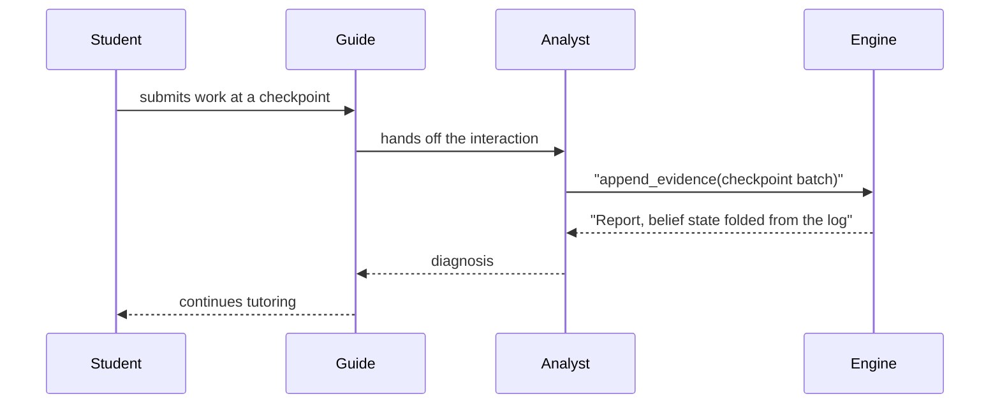
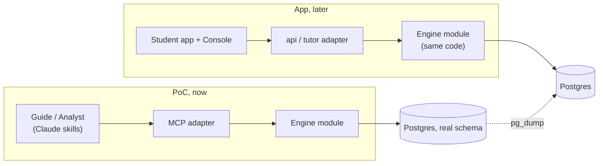
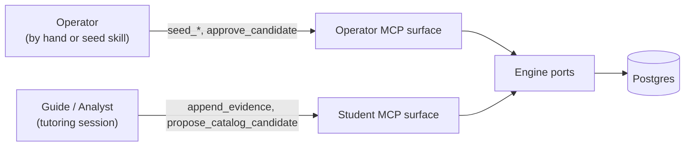

Before building the MVP-1 app, Stemolly is running an **Engine-Validation PoC**: one real student gets help with assignments (math first, then physics), and the whole conversational side is played by Claude — no Student app, no login, no Console. Every design choice inside the PoC follows from one goal: prove the belief-graph engine works, as cheaply as possible, without risking the student's data.

## Why the PoC runs before the app

The only part of MVP-1 that really matters to prove is the engine — the part that turns a student's answers into a picture of what they understand and misunderstand. Building the full Student app, login system, and Console before knowing whether the engine produces trustworthy signals would be an expensive way to find out it doesn't.

So the PoC replaces the whole front end with Claude. Claude reads the student's assignment materials directly, coaches them through it, and talks to the engine over an **MCP** — a protocol that lets an AI call a defined set of tools against a service, the same way a person calls a defined set of functions in an API. The PoC is deliberately named a PoC, not "MVP-0", to keep one fact visible at all times: **the shell around the engine is disposable, but the engine's data is not.** The original plan to build the Student app and Console is only postponed behind the PoC, not cancelled.

## Two AI roles, one synchronous loop

Inside the PoC, Claude plays both tutoring roles that the real product design calls for:

- The **Guide** runs the conversation turn by turn — talking with the student and reading their materials (Claude reads PDFs and images directly; converting them to text first would only lose information).
- The **Analyst** fires at checkpoints, as a separate Claude subagent. It reasons over what just happened and writes evidence back to the engine.

Because there is only one student, the Analyst does not need to run in the background — it runs **synchronously**, right in the middle of the conversation:



The full app will need an asynchronous job runner for this Analyst step, plus a fallback for when it lags — because many students will be doing this at once. The PoC drops all of that; it is only reintroduced once real concurrency (many students at once) actually shows up. What the PoC does keep is the real shape of the two-agent design — Guide converses, Analyst diagnoses — just with Claude filling in for the in-house tutoring engine that the app will eventually run instead.

### How the skills are developed

The Guide session skill, the Analyst checkpoint subagent, the seed skill, and the assignment-ingestion skill are all improved by trial across real sessions — not built once to a definition of done. They are iterated continuously, by hand, gated on nothing, and belong to no planned sprint.

The team rejected treating them as sprint deliverables: a tutoring prompt is only judged by how sessions actually go, and you cannot assess that before the sessions exist. What planned work *does* owe the skills is the **engine surface they call** — the anchor store, the concept-gap channel, the identifier handoff, and the evidence trail. Those are the things a skill invokes but cannot supply for itself, and that reframing is what turns skill-centered sprint scope into engine-surface sprint scope.

The practical consequence: skill quality is never a gate on shipping engine work, and engine work is never blocked waiting for a prompt to be finished.

## Rules the engine enforces on the AI

The MCP that Claude calls is **append-only**: its write tools can only add new evidence or propose a new catalog entry (a known misconception or reasoning pattern) — nothing lets Claude directly set a student's belief state.

:::caution[No shortcut writes]
There is deliberately no tool that lets Claude write something like "this student is fragile on quadratics" straight into the engine. Misconceptions, fragility, and reasoning patterns are always *computed* by engine code from the evidence log — never set by the AI. If a "set belief" tool ever existed, the beliefs would stop being grounded in replayable evidence, and the whole point of the PoC would be undermined.
:::

That also shapes how evidence is timed. `append_evidence` takes one checkpoint's worth of events as a single batch and just appends it — there's no per-event recompute, and no separate "close checkpoint" step. Reading belief state (`get_belief_state`) simply folds the whole evidence log at the moment you ask. This is deliberate: a student who self-corrects produces two events in the same checkpoint (a wrong answer, then a correct one) that need to net out together. Recomputing after just the first event would report a wrong intermediate signal. Nothing is pre-computed and stored either — at one-student scale, folding the log fresh on every read is fast enough that there is no need to.

The tool list itself is kept deliberately short: an engine operation only gets an MCP tool if some Claude skill in the PoC actually needs to call it. Operations like merging two duplicate concepts, or walking a full prerequisite chain, have no tool — no skill in the PoC journey needs to do either of those itself, and merging concepts is treated as a human judgment call anyway. A missing tool is a sign the operation doesn't belong to an AI actor, not a gap to fill in.

## Built on the real schema, so it migrates for free

Losing a student's history when they move from the PoC into the real app is not acceptable — that's a hard requirement. So the PoC does not use a throwaway data store. It builds the **real** engine module, on its real database schema (concept nodes and edges, an append-only evidence log, and belief state computed from that log), inside the same monorepo the app will eventually use.

That makes migration a plain data copy (`pg_dump`) rather than a rewrite. It also means the code, not just the data, carries over: the MCP is a thin adapter that sits over the engine's existing interface — the same slot the app's own API layer will occupy later. When the app is built, the engine code doesn't change; only the adapter in front of it swaps out.



## What crosses the boundary: a thin anchor, not the document

The engine never sees a student's actual assignment — no equations, tables, or diagrams. All it needs is a stable way to say "this evidence is about that concept." Claude reads the raw material and coaches from it directly (its chat *is* the interface in the PoC — there's no renderer to feed a structured format to), and hands the engine only a small object called a **`StudyAnchor`**:

```json
{
  "id": "anchor-quad-factoring",
  "label": "Factoring quadratics practice set",
  "nodeRefs": [
    { "slug": "quad-factor", "displayName": "Factoring quadratics" }
  ]
}
```

One `StudyAnchor` covers one prepared unit of study — an assignment in the PoC, a lesson brief once the Console exists. The same node identifiers then flow through the anchor, every evidence event, and the derived beliefs — that shared thread is all the engine needs. A richer content format for diagrams and tables might be worth building someday, but only once the app has an actual renderer to consume it; it is out of scope for the PoC.

`StudyAnchor`'s shape lives as a JSON Schema in the shared contracts package, alongside the engine's other cross-boundary contracts, and it carries no version field. A version field only earns its place once two independently-deployed programs can disagree about a format — here, the code that produces the anchor and the code that reads it are the same process, so there is nothing to disagree.

## Keeping "AI drafts, human approves": seeding and the operator/student split

Before a student ever touches a topic, its concept graph (nodes and prerequisite links) and catalogs (known misconceptions, reasoning patterns) must already be seeded. Seeding is **operator-only**. The operator does it by hand or through a dedicated seed skill: Claude reads the study materials, drafts nodes, edges, and catalog entries as *candidates*, and none of it is trusted until the operator approves it — the same "AI drafts, human approves" rule used everywhere else content gets authored.

Note that the approval gate works differently depending on what's being approved. Catalog entries (misconceptions, patterns) are written to the database with a `candidate` status and approved afterward. Concept nodes and edges have no status column, so for the graph the gate sits **before** the write — the operator reviews the drafted list in the seed-skill transcript first, then the skill calls `seed_node`/`seed_edge`, and what lands is trusted immediately.

The student's own session gets a narrower set of tools — it can read nodes and append evidence, but it can never seed or approve anything. This is enforced by **configuration, not login**: the MCP process reads which role it's running as (`MCP_ROLE`) once, when it starts, and only registers that role's tools. The other role's tools aren't refused when called — they simply don't exist for that process; a client connected to the student surface cannot even see that a `seed_node` tool exists.

| Surface | Tools it exposes |
|---|---|
| student | `append_evidence`, `propose_catalog_candidate`, `get_belief_state`, `match_catalog` |
| operator | `seed_node`, `seed_edge`, `seed_catalog`, `approve_candidate`, `get_belief_state`, `match_catalog` |



If a missing or unrecognized role were passed in, the process refuses to start rather than guessing — so there is no way to accidentally end up running with the wrong tools exposed.

:::note[Where the trust actually sits]
Both surfaces talk to the same database over the same connection type, so the split does not come from database permissions. It comes from which binary a client can reach. Because the role is just configuration and the connection is a direct process pipe (stdio), the real boundary is *whoever can start the process* — fine for the PoC, where the tutoring skill starts its own student-surface process, but not something that would hold up if this MCP were ever opened to many clients over a shared network connection. That would need real login, and nothing here blocks adding it later.
:::

This split matters even though the PoC has no other security concerns, because a Claude session that *could* approve its own drafts eventually *would* — and once a draft is promoted to trusted, there's no way to undo that by replaying history, since promotion is a decision, not a logged event.

### How the tool surfaces are actually composed

The operator/student split is enforced in `mcp/src/server.ts`'s `resolveToolSet` function — and reading the individual tool files `operator.ts` and `student.ts` does **not** tell you what each surface exposes. A third file, `shared-reads.ts`, holds `get_belief_state` and `match_catalog` so they can be available on both surfaces. The function spreads `shared-reads.ts` into both the student map and the operator map, so anything placed there lands on both surfaces.

The consequence is that surface membership is a **placement** decision:

- `operator.ts` → operator surface only
- `student.ts` → student surface only
- `shared-reads.ts` → **both** surfaces, regardless of intent

A tool that must be operator-only or student-only cannot go in `shared-reads.ts`. Nothing in the type system signals a leak — the tool works, tests pass, and the only symptom is a capability appearing where the design said it should not. The cheap check is a test asserting that a given tool name is absent from the student map; catching any such mistake is a single assertion.

### The student's identity is configuration, not a tool argument

In the student MCP process, `STUDENT_ID` and `DISPLAY_LANG` are read at startup alongside `MCP_ROLE`. The tools themselves drop those fields from their inputs — the process injects the configured value before delegating to the engine. There is no field left for a model to supply, wrong or otherwise.

The reason is the failure mode: a wrong anchor ID throws, the session stops, and the error is visible. A wrong student ID succeeds silently — evidence accumulates under a student who does not exist, a returning student's belief model reads back empty, and the append-only log means the misfiled records cannot be corrected. Removing the model from that path entirely is the only fix that eliminates the failure mode rather than just detecting it after the fact.

### One more case: what happens when a concept is not seeded

If a session runs into a concept that was never seeded, it records nothing for that concept, writes a structured note for the operator to review between sessions, and carries on with whatever it *can* record. It never invents a new concept node on the spot.

Two reasons: how often this happens is itself a measurement of how good the seeding was — patching gaps mid-session would hide that signal. And it is not technically possible to record a half-approved node: only catalog entries (misconceptions, patterns) have an approval status in the schema; concept nodes do not.

## A known boundary: the engine is absorbing PoC application concerns

A single design session added several tables to the engine's schema — study anchors, anchor membership, concept gaps — plus operator reads over them. Each was justified individually by the PoC's constraints, and each is defensible on its own.

The aggregate matters more than the individual items. In the app's module boundaries, these artifacts would not belong to the engine at all. A prepared unit of study is content's concern, and an operator work queue belongs to something Console-shaped. The engine is quietly becoming the PoC's application database.

The cost is deferred rather than avoided. It comes due at the migration rehearsal, when someone has to decide per table whether each row becomes an app entity, is rewritten into a different module's schema, or is dropped. The decisions that were spread across several sessions will all land at once, and the ones that looked incidental when added are the easiest to get wrong.

The mitigating property is that none of these tables is referenced by the evidence log — each remains independently droppable at the cost of one migration. That reversibility is what makes the accumulation acceptable today. It would be lost if any future decision let an evidence row point at one of them.
