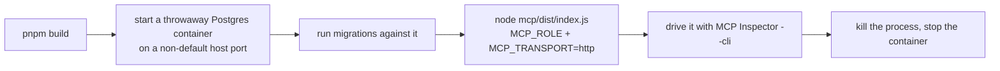

The PoC's engine is only useful if Claude can actually reach it. This page covers the practical side: how to run and exercise the MCP server yourself, the bugs the team found (and had to fix) while making its HTTP transport solid, and how the whole thing is hosted and deployed.

## Running the MCP server over HTTP, end to end

The `mcp` package normally talks to Claude over stdio (a direct process pipe), but it can also serve **Streamable HTTP** — a real network transport — when started with `MCP_TRANSPORT=http`. To try this locally:



A real database is required at every step here — nothing in this path can be faked or mocked. The server always opens on a fixed internal port, `3000` (this is not configurable). Once it's up, the **MCP Inspector**'s scriptable CLI mode is the tool for exercising it without a browser:

```
npx @modelcontextprotocol/inspector --cli \
  --server-url <url> --transport http \
  --method tools/list
```

The `--transport http` flag has to be explicit — a bare root-path server URL doesn't give the Inspector anything to detect the transport from automatically. For calling a tool with structured arguments (for example, a localized display name), use `--method tools/call --tool-name <name> --tool-args-json <json>`; the flatter `--tool-arg key=value` form only supports simple flat pairs, with no nesting. The Inspector also has `--web` (a browser GUI, the default) and `--tui` modes, and a `--format json|text` flag for output shape — but for scripting, `--cli` with `--tool-args-json` is what to reach for.

## Two bugs the HTTP transport needed fixed

Getting this runbook to actually work in practice surfaced two separate bugs while the team hardened the same HTTP-transport wiring — both invisible until the real transport was actually driven end to end, rather than mocked.

**The entrypoint silently did nothing.** A common Node pattern lets a file be both imported and run directly, by guarding its own startup code with a check like `import.meta.url === file://${process.argv[1]}`. That check silently never passes when the actual entrypoint file only *imports* the guarded module rather than being it — here, `index.ts` did `import './main.js'` as a side effect, so `process.argv[1]` pointed at `index.js` while `import.meta.url` inside `main.ts` always pointed at `main.js`. The two paths could never match. The process exited cleanly with no output, looking like it worked while never actually starting the server. The fix: drop the self-invocation guard, export the function plainly, and have the entrypoint call it explicitly —

```ts
import { main } from './main.js';
await main();
```

This fix is what makes the runbook's "start the entrypoint" step actually start anything.

**A single server instance couldn't survive a real handshake.** The MCP SDK's stateless HTTP transport is single-use: calling it a second time on the same instance throws, and a real client handshake is never just one request — it sends an `initialize` call followed by a separate `notifications/initialized` call. Sharing one transport across an entire HTTP listener meant every session failed on its second request. Worse, because the SDK's transport hands off to its underlying HTTP library with no configured error handler, that failure surfaced only as an unlogged, bare HTTP 500 — nothing explained why. The fix is to build a fresh server and transport pair for every incoming HTTP request; this is cheap, since it just wraps an engine instance that is already built. This fix is what makes the runbook's list-then-call sequence succeed instead of failing on the second call.

## A quieter bug in the same neighborhood: serializing tool results

While hardening the same wire boundary, the team also found a subtler defect in how tool results get serialized before going over the wire. `JSON.stringify` returns the *value* `undefined` — not a string — for `undefined` itself, for a bare function, and for a `Symbol`, and it never throws for any of them. Code that assumes a string always comes back will emit a broken reply and the error will look like it came from somewhere else.

Guarding the *input* (`JSON.stringify(result ?? null)`) only catches the "handler returned nothing" case and leaves the rest of the problem open. The fix guards the *output* instead: `JSON.stringify(result) ?? 'null'`, falling back to the literal string `'null'` — a value the client can actually parse, and one that honestly means "no value" instead of inventing something else. This check now sits in the one shared wrapper that every tool result passes through, so it protects any tool added later, not just the ones that exposed the bug originally. The general lesson: a serializer that signals failure by quietly returning a value, instead of throwing, defeats any error handling built around catching exceptions — the check has to live on what comes *out*, because nothing on the way in warns you.

## Hosting and deployment

`engine-poc` started life with no GitHub remote at all — pushing it and wiring up VPS deployment were both planned for a later sprint. That meant its CI workflow could only be checked by running the same commands locally, in order, as a stand-in for a real pipeline — there was nowhere to push to and no way to watch an actual run. At review, the team created the private `stemolly/engine-poc` repository and pushed the existing local history as `origin`, specifically to close that gap: both CI jobs were then watched turning green on a real push, and a throwaway pull request with a deliberate lint mistake was watched turning the `Lint` job red — confirming the workflow live instead of by proxy. VPS deployment work builds on this existing repository rather than creating it fresh.

On the deployed VPS stack, every service sits behind a reverse-proxy edge and is reachable only on the loopback address (`127.0.0.1`) — nothing but the edge's port is visible from outside. Postgres carves out one narrow, deliberate exception to that rule: it also publishes on loopback, even though nothing ever proxies it. The reason is a tooling limitation, not a design preference — the migration tool needs a loader that is unsafe to run inside a long-lived container process, so no container in the stack is able to run migrations on itself. Instead, migrations run once, from an operator's own machine, reaching the VPS database through an SSH tunnel:

```
ssh -L 5432:127.0.0.1:5432 <vps-host>
# then, from the operator's machine:
DATABASE_URL=postgres://...@127.0.0.1:5432/...
```

:::caution[A deliberate, narrow exception]
SSH is the only process on the VPS host itself — not a container — able to reach that loopback port, so publishing Postgres this way only ever serves someone who already holds SSH access to the box, never an outside caller. A port scan of the VPS from the outside still shows nothing but the edge's public port; this loopback publish is treated as part of that same guarantee, not a break in it.
:::
