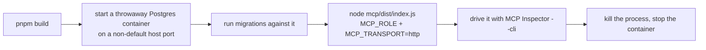

The PoC's engine is only useful if Claude can actually reach it. This page covers the practical side: how to run and exercise the MCP server yourself, the bugs the team found (and had to fix) while making its HTTP transport solid, and how the whole thing is hosted and deployed — including public hostnames, running migrations over an SSH tunnel, and proving that backups actually work.

## Running the MCP server over HTTP, end to end

The `mcp` package normally talks to Claude over stdio (a direct process pipe), but it can also serve **Streamable HTTP** — a real network transport — when started with `MCP_TRANSPORT=http`. To try this locally:



A real database is required at every step here — nothing in this path can be faked or mocked. The server always opens on a fixed internal port, `3000` (this is not configurable). Once it's up, the **MCP Inspector**'s scriptable CLI mode is the tool for exercising it without a browser:

```
npx @modelcontextprotocol/inspector --cli \
  --server-url <url> --transport http \
  --method tools/list
```

The `--transport http` flag has to be explicit — a bare root-path server URL doesn't give the Inspector anything to detect the transport from automatically. For calling a tool with structured arguments (for example, a localized display name), use `--method tools/call --tool-name <name> --tool-args-json <json>`; the flatter `--tool-arg key=value` form only supports simple flat pairs, with no nesting. The Inspector also has `--web` (a browser GUI, the default) and `--tui` modes, and a `--format json|text` flag for output shape — but for scripting, `--cli` with `--tool-args-json` is what to reach for.

## Two bugs the HTTP transport needed fixed

Getting this runbook to actually work in practice surfaced two separate bugs while the team hardened the same HTTP-transport wiring — both invisible until the real transport was actually driven end to end, rather than mocked.

**The entrypoint silently did nothing.** A common Node pattern lets a file be both imported and run directly, by guarding its own startup code with a check like `import.meta.url === file://${process.argv[1]}`. That check silently never passes when the actual entrypoint file only *imports* the guarded module rather than being it — here, `index.ts` did `import './main.js'` as a side effect, so `process.argv[1]` pointed at `index.js` while `import.meta.url` inside `main.ts` always pointed at `main.js`. The two paths could never match. The process exited cleanly with no output, looking like it worked while never actually starting the server. The fix: drop the self-invocation guard, export the function plainly, and have the entrypoint call it explicitly —

```ts
import { main } from './main.js';
await main();
```

This fix is what makes the runbook's "start the entrypoint" step actually start anything.

**A single server instance couldn't survive a real handshake.** The MCP SDK's stateless HTTP transport is single-use: calling it a second time on the same instance throws, and a real client handshake is never just one request — it sends an `initialize` call followed by a separate `notifications/initialized` call. Sharing one transport across an entire HTTP listener meant every session failed on its second request. Worse, because the SDK's transport hands off to its underlying HTTP library with no configured error handler, that failure surfaced only as an unlogged, bare HTTP 500 — nothing explained why. The fix is to build a fresh server and transport pair for every incoming HTTP request; this is cheap, since it just wraps an engine instance that is already built. This fix is what makes the runbook's list-then-call sequence succeed instead of failing on the second call.

## A quieter bug in the same neighborhood: serializing tool results

While hardening the same wire boundary, the team also found a subtler defect in how tool results get serialized before going over the wire. `JSON.stringify` returns the *value* `undefined` — not a string — for `undefined` itself, for a bare function, and for a `Symbol`, and it never throws for any of them. Code that assumes a string always comes back will emit a broken reply and the error will look like it came from somewhere else.

Guarding the *input* (`JSON.stringify(result ?? null)`) only catches the "handler returned nothing" case and leaves the rest of the problem open. The fix guards the *output* instead: `JSON.stringify(result) ?? 'null'`, falling back to the literal string `'null'` — a value the client can actually parse, and one that honestly means "no value" instead of inventing something else. This check now sits in the one shared wrapper that every tool result passes through, so it protects any tool added later, not just the ones that exposed the bug originally. The general lesson: a serializer that signals failure by quietly returning a value, instead of throwing, defeats any error handling built around catching exceptions — the check has to live on what comes *out*, because nothing on the way in warns you.

## Hosting the PoC repository

`engine-poc` started life with no GitHub remote at all — pushing it and wiring up VPS deployment were both planned for a later sprint. That meant its CI workflow could only be checked by running the same commands locally, in order, as a stand-in for a real pipeline — there was nowhere to push to and no way to watch an actual run. At review, the team created the private `stemolly/engine-poc` repository and pushed the existing local history as `origin`, specifically to close that gap: both CI jobs were then watched turning green on a real push, and a throwaway pull request with a deliberate lint mistake was watched turning the `Lint` job red — confirming the workflow live instead of by proxy. VPS deployment work builds on this existing repository rather than creating it fresh.

## VPS deployment: the edge, Postgres, and public hostnames

On the deployed VPS, every service sits behind a **reverse-proxy edge** (Caddy) and is reachable only on the loopback address (`127.0.0.1`) — the only port visible from outside is the edge's TLS port. The two MCP role surfaces each get their own public hostname. These are nested under a shared `poc.` parent on `stemolly.com`, specifically to avoid squatting the short subdomains that the real app will need later:

| Environment | Operator hostname | Student hostname |
|---|---|---|
| Production PoC | `operator.poc.stemolly.com` | `student.poc.stemolly.com` |
| Rehearsal droplet | `operator.rehearsal.poc.stemolly.com` | `student.rehearsal.poc.stemolly.com` |

Using bare `operator.stemolly.com` / `student.stemolly.com` was explicitly rejected — those names are reserved for the real Student and Console apps that ship later, and reusing them for the PoC would force a rename right when real links might already be in use. The rehearsal droplet gets its own one-level-deeper names so a rehearsal's DNS records, TLS certificates, and Caddy state can never contaminate the production PoC hostnames.

### Migrations over SSH tunnel

Postgres carves out one narrow, deliberate exception to the loopback rule: it also publishes on loopback (`127.0.0.1:5432`), even though nothing ever proxies it. The reason is a tooling limitation — the migration tool needs a `tsx` loader that installs process-global hooks, which are unsafe to run inside a long-lived container. So no container in the stack can run migrations on itself. Instead, migrations run once, from an operator's own machine, reaching the VPS database through an SSH tunnel:

```bash
# on the operator's machine, open the tunnel:
ssh -L 5432:127.0.0.1:5432 <vps-host>

# then, in a separate terminal, run migrations:
DATABASE_URL=postgres://...@127.0.0.1:5432/... pnpm migrate
```

:::caution[A deliberate, narrow exception]
SSH is the only process on the VPS host itself — not a container — that can reach that loopback port, so this setup only ever serves someone who already holds SSH access to the box, never an outside caller. A port scan of the VPS from outside still shows nothing but the edge's public port; the loopback-published `5432` is a deliberate, named exception to the "all services loopback-only" rule, not a break in it.
:::

### Operator-facing deployment guides

Two guides live in `docs/deploy/`, alongside the existing `docs/design/` and `docs/prd/` directories:

- **`01-verify-on-vps.md`** — the disposable **rehearsal droplet**: proves the deploy step-by-step before anything real is at stake, and runs one full backup → restore → verify cycle. Nothing on a rehearsal droplet is irreplaceable.
- **`02-production-deploy.md`** — the **durable droplet** that serves the actual student. Written as a diff against the rehearsal guide (real DNS, real secrets, DigitalOcean snapshots as a second recovery layer alongside `pg_dump`, an installed crontab for scheduled backups, a recurring restore fire drill). It does not repeat the mechanics from the rehearsal guide.

The split was deliberate: both steps look almost identical, but differ sharply in what is at stake. Collapsing them into one document risked burying that distinction.

## Backup and restore verification

A `pg_dump` file existing on disk proves the dump ran — not that it can be restored, and not that its contents are correct. The tooling the PoC ships treats those as separate questions, each requiring its own check.

`server/scripts/backup.ts` writes the dump and handles dump-file retention (a pure `pruneDumps` function invoked by the crontab, not baked into any container). A cron entry on the VPS runs this on a schedule.

`server/scripts/verify-restore.ts` is what actually proves a restore. It connects to both a source database and a freshly restored scratch database, and checks them on two axes:

1. **`engine.evidence_events` row counts** — a mismatch means evidence was lost in the dump-restore cycle.
2. **Replayed belief state** — it calls the real `getBeliefState()` for every student in either database and compares the output. This works because belief state is a deterministic replay over the evidence log: two databases with the same log produce exactly the same belief state.

If anything diverges, the function returns a non-empty `divergences[]` that names exactly what — a row-count delta, or which student's belief output differs. It does not return a bare pass/fail. It also rejects outright if given the same connection string for both source and scratch, guarding the operator mistake of accidentally comparing a database to itself (which would trivially match and prove nothing).

Neither script has an application caller. Both are operator-only tools — `backup.ts` via cron, `verify-restore.ts` via a manual invocation (`tsx -e ...`). That is the right shape for tooling whose caller is a human under pressure, not another module.

:::tip[Why this level of rigor?]
The evidence log is append-only by design — once written, it cannot be corrected. The student's belief history is exactly what the PoC exists to produce, and it is irreplaceable. A backup nobody has verified restored correctly is a hypothesis, not a guarantee.
:::
