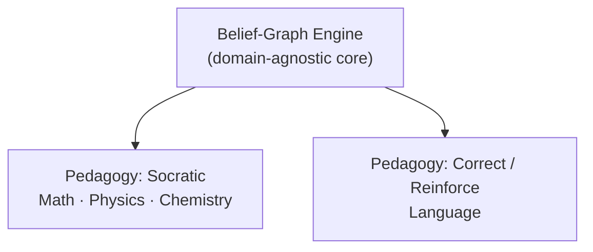
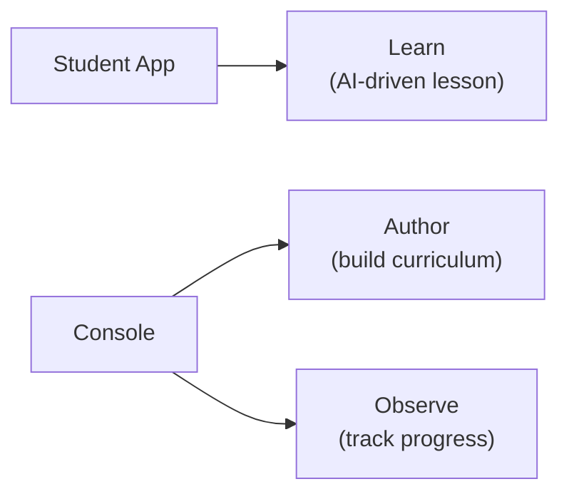

Stemolly is an AI-first web application that helps students learn any subject — K-12 math and science, languages, exam preparation (SAT, IELTS), and beyond. There is no subject boundary by design. The frontend is built with Vite + React; the backend runs on Fastify. No meta-framework (no Next.js, no Remix) — the architecture stays explicit and minimal.

## The Belief Graph: Stemolly's Core Idea

Most learning platforms track whether a student *completed* a topic. Stemolly tracks what a student *believes* — and whether those beliefs are correct, shaky, or not yet tested.

The student's knowledge is stored as a **belief graph**: a graph of concept nodes connected by prerequisite edges. Each node holds:

- **Misconceptions** — wrong beliefs the student holds about this concept.
- **Fragility state** — one of three values: *unprobed*, *fragile*, or *robust* (not a numeric score).
- **Reasoning pattern data** — how the student reaches conclusions, not just what answer they gave.

Every belief state must be backed by real interaction evidence, never inferred from aggregate test scores.

```
  [Negative numbers]     ← wrong belief here …
        |
        ↓
  [Integer arithmetic]   ← … causes errors here …
        |
        ↓
  [Algebra basics]       ← … and here
```

Because beliefs propagate along edges, a single root misconception — say, a wrong idea about negative numbers — can be traced as the cause of errors in every downstream concept. The AI can fix the root cause instead of patching each symptom separately. This is the core differentiator from platforms that only track topic completion.

## Pedagogy Is a Pluggable Layer

The belief-graph engine is **domain-agnostic**. It knows about concepts, misconceptions, fragility, and evidence — but it does not know how to *talk* to a student. That job belongs to a separate, swappable **pedagogy layer**.

Think of it like a navigation app: the map (belief graph) and the turn-by-turn voice (pedagogy) are separate. You can swap the voice without rebuilding the map.

An earlier version of the design treated the Socratic method as a foundational constraint baked into everything. That was revised: Socratic is now one pedagogy among several, and the engine must never hardcode it.



MVP-1 ships two pedagogies:

| Pedagogy | Used for | Approach |
|---|---|---|
| **Socratic** | Math, Physics, Chemistry | Guide the student to construct the target insight through questions |
| **Correct / Reinforce** | Language | Diagnose the error → correct → reinforce → re-check |

One structural consequence: the engine must not assume concepts always form a strict prerequisite chain. Math is a DAG (directed acyclic graph — each concept depends on earlier ones in order); Language is a looser taxonomy of errors and skills. Both must work with the same engine.

## Two Apps, Three Jobs

The MVP ships as two separate frontend applications.



**Student App** — the learning experience. Students work through AI-driven lessons here (the "Learn" job).

**Console** — the educator and operator tool. It has two areas:
- **Author**: build curriculum, lessons, and concept graphs.
- **Observe**: monitor student progress and verify that the belief-graph engine is diagnosing correctly.

The Console was previously called "Studio" when it only did authoring. It was renamed once Observe was added, because a two-job tool needed a name that did not imply a single purpose.

A standalone third app just for progress visualization was considered and rejected for MVP. Splitting Observe into its own app only makes sense if its audience (parents, school admins who never author) later diverges from the Author audience. The backend still keeps content and student-state as separate service boundaries regardless of frontend shape.

## Access and Roles

MVP-1 has no public sign-up. An Admin invites a user by email and assigns a role. The invitee follows an invite link, sets a password, and is routed to the app their role allows.

| Role | What they can access |
|---|---|
| **Admin** | Full access; onboards all other users |
| **Console** | Author + Observe areas in the Console |
| **Student** | Student app only |

Email and password authentication was chosen to reduce complexity and avoid a third-party auth dependency. Because some students are minors, a full parental-consent workflow is deferred to a later milestone; only a lightweight acknowledgment is required at MVP. Role is fixed at invite time — there is no in-app role-change UI, and password reset is handled by an Admin re-invite.

## Dual-Language Support

The language the tutor uses to *talk* with the student is independent of the language of the *content material*. A Vietnamese student can receive explanations in Vietnamese while the SAT material and the student's own written answers stay in English — the same way a Vietnamese teacher might explain an English text in Vietnamese.

- **Communication language** — set per student and per session; this is how the AI addresses the student.
- **Content language** — a property of the lesson material itself.

For language-learning subjects (e.g. IELTS writing), the tutor coaches in the communication language, but the student's produced text and all corrections remain in the target content language.

## Evolvability Comes First

MVP-1 is a **validation instrument** — its job is to test whether the belief-graph engine actually works. The team should expect to be wrong about specifics and to change course based on what the data shows.

This is why evolvability is the primary non-functional requirement (NFR):

- Adding a new subject or curriculum should not require touching the engine core.
- Swapping or adding a pedagogy is a per-session configuration, not a rebuild.
- Graph-structure and node-identity decisions are made so that new content slots in without rewiring existing code.

The technology stack is deliberately left as an architecture-phase decision — it is not fixed at the product requirements level, because locking it there would be the wrong altitude for that choice.

:::tip
If you are deciding where to make a change — new subject, new pedagogy, new curriculum — the goal is always to touch the pluggable layer, not the engine core.
:::

## Quick Reference

| Dimension | Detail |
|---|---|
| **Subject scope** | Any — K-12, languages, certifications |
| **Knowledge model** | Belief graph — nodes, misconceptions, fragility state, evidence |
| **Pedagogy** | Pluggable layer; Socratic and Correct/Reinforce ship in MVP-1 |
| **Apps** | Student App (Learn) + Console (Author + Observe) |
| **Access** | Invite-only; three roles: Admin, Console, Student |
| **Languages** | Communication language and content language are independent |
| **Primary NFR** | Evolvability — cheap to extend and pivot |
| **Stack** | Vite + React / Fastify, no meta-framework |
