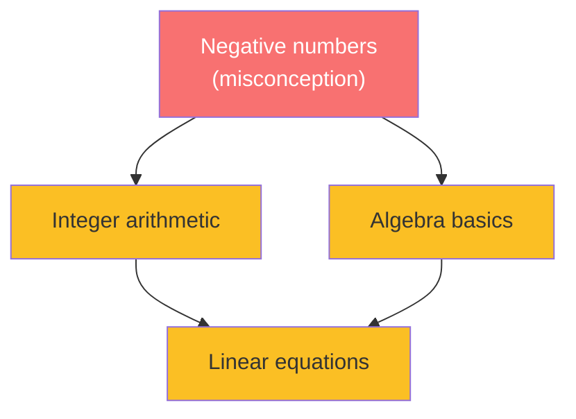
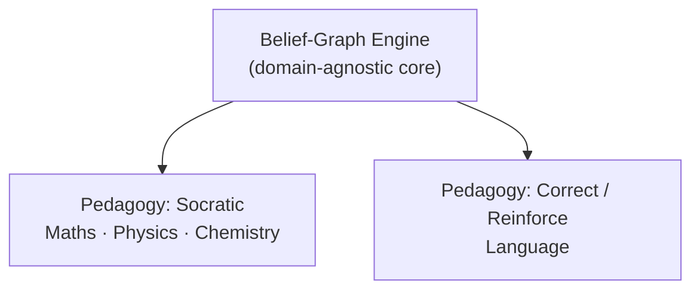
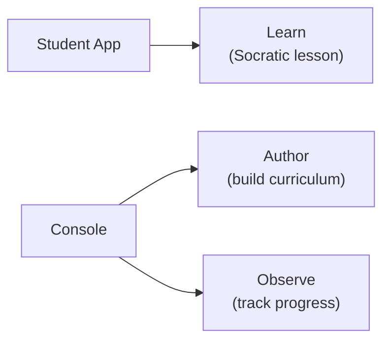
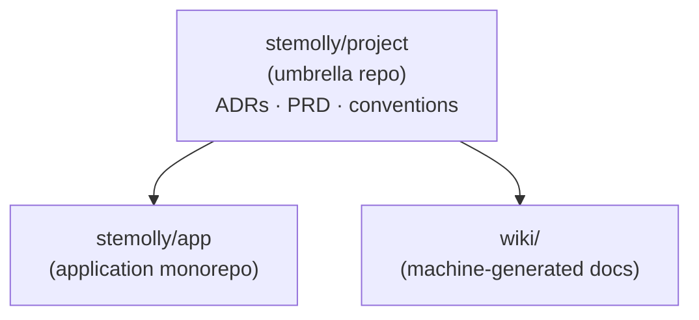

Stemolly is an AI-first web application that helps students learn any subject — from school maths and science to languages and standardised tests such as SAT or IELTS. There is no subject boundary by design. The frontend runs on Vite + React; the backend runs on Fastify. The project deliberately avoids meta-frameworks such as Next.js or Remix to keep the architecture explicit and easy to reason about.

## The Core USP: a Belief Graph, Not a Checklist

Most learning platforms track whether a student has *completed* a topic. Stemolly tracks what the student *believes* about each concept — and whether those beliefs are correct.

The student's knowledge is stored as a **belief graph**: concepts are nodes, prerequisite relationships are edges, and each node carries misconceptions, a fragility state, and reasoning-pattern data. Fragility for a (student, concept) pair is a three-state property — **unprobed**, **fragile**, or **robust** — not a numeric percentage.

The key advantage is propagation. A wrong belief at one node colours every node that depends on it. The AI can find the root cause rather than treating each downstream symptom separately. Every belief state must be backed by specific interaction evidence; aggregate scores are not enough.

*A misconception at one node propagates to all downstream nodes — the AI investigates the root, not each symptom.*

## Pedagogy Is a Pluggable Layer

The belief-graph engine is the **domain-agnostic core**. It tracks concepts, misconceptions, fragility, and evidence — but it does not define *how* the tutor talks to a student. That job belongs to a separate, swappable **pedagogy layer**.

An earlier design treated the Socratic method as a foundational constraint baked everywhere. That has been retired: Socratic is now one pedagogy among several, and the engine must never hardcode it.

MVP-1 ships two pedagogies:

| Pedagogy | Used for | Approach |
|---|---|---|
| **Socratic** | Maths, Physics, Chemistry | Guide the student to construct the target insight |
| **Correct / Reinforce** | Language | Diagnose → correct → reinforce → re-check |

Two hard constraints follow: the engine must not hardcode Socratic behaviour, and it must not assume every subject is a strict prerequisite DAG (directed acyclic graph). Maths is a DAG; Language is a looser error/skill taxonomy. Both must work with the same engine.

## Two Apps, Three Jobs

The MVP ships two separate frontend applications.

**Student App** serves the *Learn* job — the AI-driven lesson experience for the student.

**Console** serves educators and operators across two areas:

- **Author** — build curriculum and lessons (this was the whole job when the app was called "Studio").
- **Observe** — track student progress and check whether the belief-graph engine is diagnosing correctly.

The rename from Studio to Console reflects the addition of Observe: the app now covers two jobs, and "Studio" implied only one.

A standalone third app just for progress visualisation was considered and rejected for MVP. Splitting Observe into its own shell is only justified if its audience (parents, school admins who never author) later diverges clearly from the Author audience. Content and student-state remain separate backend service boundaries regardless of how many frontends exist.

## Evolvability Is the Primary NFR

MVP-1 is a **validation instrument** — its purpose is to prove whether the belief-graph engine actually works. The team should expect to be wrong about specifics and to change course based on what the data reveals.

This is why **evolvability** is the primary non-functional requirement (NFR — a quality the system must have, independent of any feature):

- New subjects and curricula slot in without touching the engine core.
- New pedagogies are per-session strategies, not rebuilds of core logic.
- Node-identity and graph-structure choices are made so that future content fits without rewiring existing code.

:::note
The technology stack is not fixed at the requirements level. Stack choices belong to architecture — locking them in the product brief is the wrong altitude for that decision.
:::

The architecture pages cover how evolvability is achieved in practice.

## How the Code Is Organised

Stemolly is spread across two code repositories plus an umbrella coordination repo, all managed together as a workspace.

**`stemolly/project` (umbrella)** — holds no runnable code. It is the home for architecture decision records, the PRD, sprint plans, and engineering conventions (`CLAUDE.md`). It is the canonical source for architectural decisions.

**`stemolly/app` (application monorepo)** — everything that runs. It is a pnpm workspace with the following packages:

| Package | What it is |
|---|---|
| `server/` | Fastify + TypeScript backend |
| `apps/student/` | React + Vite student-facing frontend |
| `apps/console/` | React + Vite Console frontend |
| `packages/contracts/` | Shared TypeScript types consumed by all packages |
| `packages/ui/` | Shared React component library |
| `mcp/` | MCP server exposing operator tools |

Inside `server/`, the primary subsystems are `engine/` (the belief-graph engine), `tutor/` (conversation-turn management), `llm/` (vendor-agnostic LLM adapters via `@noetaris/harness`), `identity/` (auth), `api/` (route handlers), `content/` (content management), and `metering/` (observability). The composition root is `server/src/composition.ts` — the dependency-injection entry point and the highest-churn file in the repo.

:::tip
When reading the server code, start at `composition.ts`. It wires together every subsystem and tells you which concrete implementations are in use.
:::

**Issues** are tracked in `stemolly/project`. Code commits land in `stemolly/app`. Because they are separate repositories, `Closes #N` in a commit message does not auto-close issues — they must be closed manually after the pull request merges.
