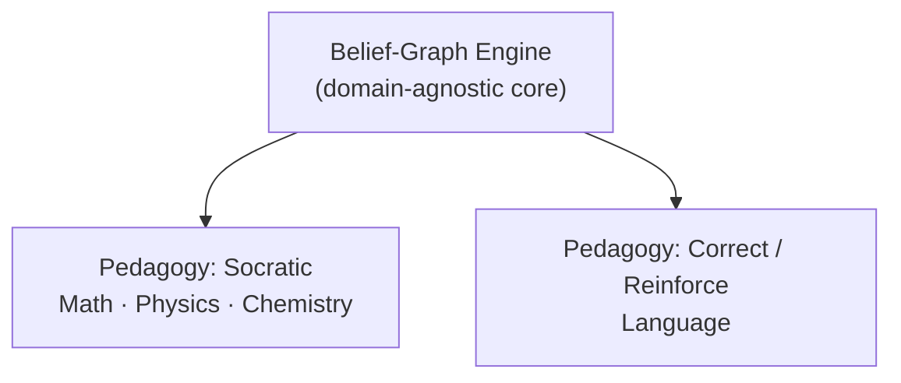
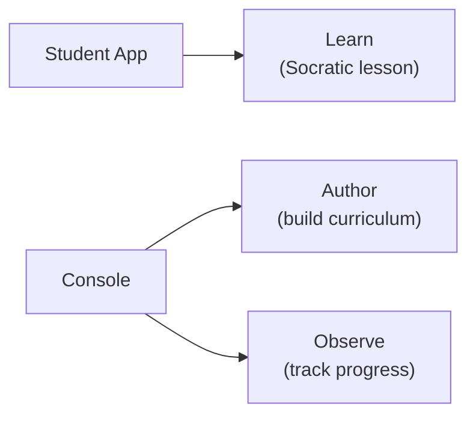

# Stemolly Overview

Stemolly is an AI-first web application that tutors students in any subject — K-12 math and science, languages, or exam prep like SAT and IELTS. The "any subject" scope is intentional: there is no hard subject boundary in the design. What makes Stemolly different from other learning tools is not the AI itself, but *how it models what a student knows* — and what it does with that model.

---

## The Belief Graph: Stemolly's Core Idea

Most learning platforms track whether a student has completed a topic. Stemolly tracks something different: what the student *believes*, and how solid that belief is.

Every concept is a **node** in a graph. Each node connects to the concepts it depends on (its prerequisites). A node does not carry a simple "done / not done" flag. Instead, it carries:

- **Misconceptions** — wrong beliefs the student holds about this concept.
- **Fragility state** — whether this belief is *unprobed*, *fragile*, or *robust*.
- **Reasoning pattern data** — how the student reaches conclusions, not just what answer they gave.

Every piece of data in the graph must be backed by specific interaction evidence — not inferred from aggregate quiz scores.

```
         [ Arithmetic ] ← unprobed
               │
               ▼
      [ Negative Numbers ] ← fragile  ←── misconception: "–3 > –1"
               │
               ▼
      [ Algebra Basics ]  ← fragile   ←── diagnosis: root is Negative Numbers
```

This graph structure is what lets the AI find **root causes**. If a student has a wrong belief about negative numbers, that misconception propagates to every downstream concept that depends on it — algebra, inequalities, and beyond. A completion checklist would flag several topics as incomplete; the belief graph shows one root to fix.

---

## Pedagogy Is a Pluggable Layer

The belief-graph engine is the product's core, and it is **domain-agnostic**. It knows nothing about which teaching style to use. That is handled by a separate, pluggable **pedagogy layer** that sits on top.

An earlier version of the design treated the Socratic method as a foundational constraint — all tutoring, in all subjects, would follow Socratic questioning. That stance was retired. Socratic is now *one* pedagogy among several, chosen when it fits the subject.



MVP-1 ships two pedagogies:

| Pedagogy | Subjects | What it does |
|---|---|---|
| **Socratic** | Math, Physics, Chemistry | Guides the student to construct the insight through questions |
| **Correct / Reinforce** | Language | Diagnose error → correct → reinforce → re-check |

Two rules follow from this design. First, the engine must never hardcode Socratic behavior. Second, the engine must not assume every subject has a strict dependency order — Math has a clean prerequisite tree, but Language has a looser error-and-skill taxonomy. Both must work.

Adding a new pedagogy in the future should not require touching the engine.

---

## Two Apps, Three Jobs

The product ships as two separate frontend applications.



**Student app** — the tutoring experience. Students interact with the AI tutor here; this is the "Learn" job.

**Console** — the educator and operator tool. It has two areas:
- *Author*: build and edit curriculum, lessons, and content.
- *Observe*: monitor student progress and verify that the belief-graph engine is diagnosing correctly.

The Console was originally called "Studio" when it only did authoring. The name changed when Observe was added, because a two-job tool needed a name that did not imply a single purpose.

A third standalone app just for progress visualization was considered and rejected for MVP. Splitting Observe into its own app is only worth doing if its users — say, parents or school admins — diverge from the educators who also author. That is not true at MVP stage.

The backend keeps content data and student-state data in separate service boundaries, regardless of how many frontends exist.

---

## Evolvability: Why the Architecture Is Built This Way

MVP-1 exists to **validate** the belief-graph engine. The team expects to be wrong on specifics — wrong about which pedagogies land well, which subjects to prioritize, how the graph structure should work. The architecture is built to make those corrections cheap.

Concretely this means:

- Changing or adding a **pedagogy** does not touch the engine core.
- Adding a new **subject** slots in without a rebuild, because node-identity and graph-structure choices are made to be open.
- **Pivoting direction** mid-validation should cost a sprint, not a rewrite.

Evolvability is the primary non-functional requirement — not performance, not zero-downtime deployment. Those matter, but they are secondary to staying cheap to change while the team learns what actually works.

This principle also explains some technology choices: the stack uses Vite + React on the frontend and Fastify on the backend, with no framework magic (no Next.js or Remix). Keeping the architecture explicit means there is no hidden plumbing to fight when the team needs to rewire something.

---

## Quick-Reference Summary

| Dimension | What Stemolly does |
|---|---|
| **Subject scope** | Any — K-12, languages, certifications |
| **Knowledge model** | Belief graph (nodes, misconceptions, fragility, evidence) |
| **Pedagogy** | Pluggable layer; Socratic and Correct/Reinforce ship in MVP-1 |
| **Apps** | Student app (Learn) + Console (Author + Observe) |
| **Primary NFR** | Evolvability — cheap to extend and pivot |
| **Stack** | Vite + React / Fastify, no meta-framework |
