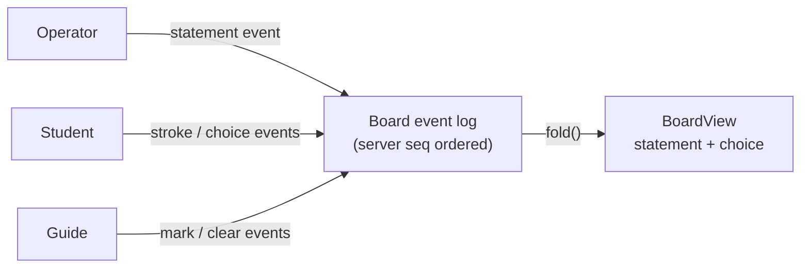
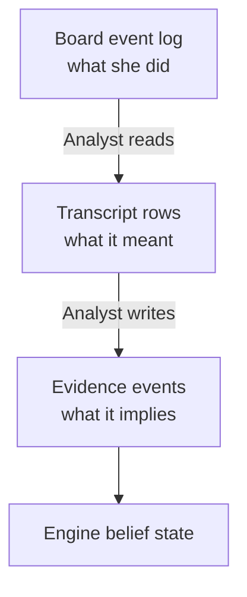
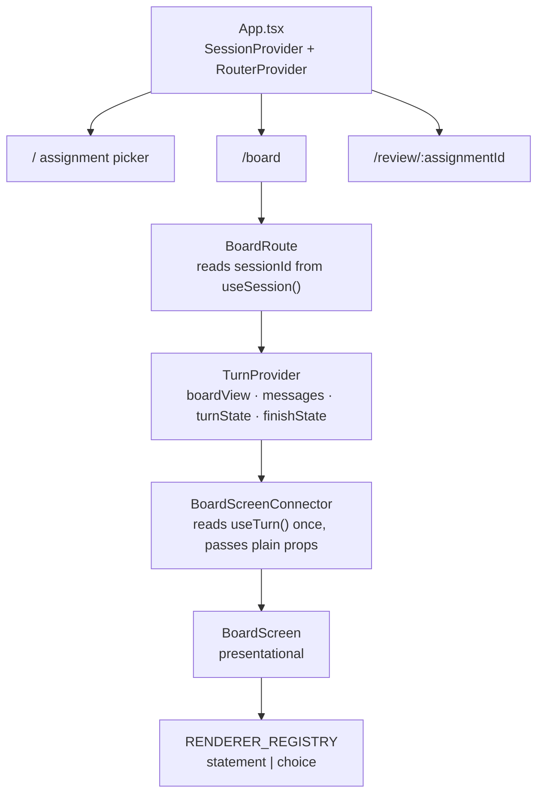

The student's freehand board is the place where all the interaction happens. The student draws and writes on it, the operator delivers the problem statement onto it, and the AI Guide marks it with anchored annotations. Everything the student produces on the board flows through an append-only event log into a transcript and ultimately into the engine's belief about what the student knows. This page explains how those layers fit together, from raw stylus strokes to the React components that render them.

## One Log, Three Authors

The board is written by three parties during a session: the **operator** delivers the problem statement, the **student** writes strokes and makes choices, and the **Guide** places marks and clears them. All three write to a single append-only board event log, keyed to the session.

The reason everything shares one log is ordering, not storage convenience. A Guide annotation must resolve against the strokes as they existed at the moment the mark was made. If strokes and annotations lived in separate stores, the global order would have to be reconstructed from wall-clock timestamps — one of them written by a browser — which is where "the underline landed on the wrong thing, sometimes" bugs come from. Instead, every append is given a **server-assigned sequence number** (`seq`). That number is the only ordering authority. Client-side timestamps survive only inside a stroke payload, where they measure pen movement speed, not event order.

Concurrent writers are serialized under a session-scoped Postgres advisory lock so that two simultaneous appends cannot both compute `MAX(seq) + 1` and produce a collision.

At query time, `fold()` sorts the log by `seq` and derives a `BoardView`. In v1, `BoardView` has exactly two derived slots: **`statement`** (the operator-delivered problem) and **`choice`** (the authored options plus the student's current selection). The fold is last-selection-wins for the student's choice, but the raw log keeps every intermediate selection, so the hesitation signal (picking A, then C, then back to A) is never lost.

## The Board Kind System

Every type of block that can appear on the board is a **board kind**, and the v1 kind set is closed to exactly two values: `statement` and `choice`. The `AssignmentStatus` vocabulary is equally fixed: `new | working | completed`. These are not soft conventions — they are enforced at three points simultaneously.

A board kind is a **three-part contract**:

| Layer | What it contributes |
|---|---|
| `contracts` package | Shared data shapes and the `BoardBlockKind` enum |
| Student app | A renderer in `RENDERER_REGISTRY` |
| `tutor` server module | An `interpret` function and `guideTools` definition |

Both the client and server use exhaustive `Record<BoardBlockKind, …>` maps. Adding a new kind member to the enum breaks both builds until every registry has a matching entry. A capability that does not exist yet is spelled `'none'`, not silently absent.

**Who may write which kind** is centralized in `BOARD_AUTHORS` and `BOARD_AUTHORSHIP`. Only `operator` may write a `statement`. A `choice` accepts `operator` (for the options) and `student` (for the selection), but not `guide`. The accompanying contract tests pin the rejection of kinds like `ink` or `archived`, and they reject guide-authored v1 board writes, so unshipped names fail at the contract edge rather than leaking into server or UI code.

A subtlety on `choice`: the student's answer is stored as a **separate event** rather than a mutable field on the block. A mutable field would make the choice block the first block ever written by two parties (the operator writes the options, the student selects), which would break the one-block-one-author rule that keeps authorship answerable throughout the evidence chain. The event design also preserves the hesitation signal described above.

:::note[Statement text goes directly to the model]
The `statement` kind carries two things: a **visual** that composites into the board image, and an authoritative **source text** that is handed to the Guide model directly. The model never reads the statement from pixels. This decouples the statement's rendering technology from the model contract — switching from a cropped PDF image to SVG-rendered markdown is a pure client-side change that touches nothing in the transcription step.
:::

## How the Guide Annotates Without Drawing

A human tutor sharing a whiteboard can underline a wrong step or circle a figure. The apparent obstacle for an AI tutor is that a language model cannot produce coordinates that reliably land on handwriting — an arrow two centimetres off the mistake teaches worse than silence.

The solution is to **separate naming from drawing**. The Guide never emits coordinates. Instead, it calls a tool that takes an **anchor id** from a closed set that the client publishes for that turn. The client resolves the anchor to the strokes behind it, computes the geometry, and routes the visual connector around an occupancy map built from the existing stroke bounding boxes and the statement's bounds. Arrow routing that avoids existing writing is arithmetic over known rectangles, not an inference.

**Anchors are computed from strokes, not assumed from lines.** On a tablet, a student writes like on paper: formulas here, a sketch in the corner, a question squeezed above another. There are no reliable text lines. The client groups strokes by proximity in time and space into pause-bounded, spatially coherent **chunks**, each with an id, its constituent stroke ids, and a bounding box. The Guide reads small numbered tags drawn on its copy of the board image and names the tag back — it never invents an identifier or a coordinate.

Chunks are stable only within a turn (a student who returns to an earlier spot causes them to split and merge), so placed marks resolve back to stroke ids rather than holding a chunk id directly. If the grouping is poor on a genuinely messy page, transcription falls back to the whole board and marks land on coarse regions — it **degrades rather than breaks**.

**Why freeform Guide strokes were rejected:** a freeform stroke written by the Guide could not be kept separate from the student's own working without destroying authorship, and the evidence chain depends entirely on authorship being answerable.

### Two Rasters

Because the Guide can mark the board, the surface carries ink from two authors. If a single composited image were sent to the transcription step, the Guide's own underlines and margin notes would be read back as things the student produced — the tutor's words folded into an append-only evidence log that has no retraction.

The rasterizer therefore produces **two images**:

- **Student layers only** — sent to the transcription step. This is the evidence of what the student did.
- **Full composited board** — sent to the Guide's model context, so it can see its own marks in relation to the student's work.

Filtering is cheap: the rasterizer already composites kind by kind, and the authorship table that governs appends supplies the author for each stroke. Transcription is also scoped to the bounding region of the student's own strokes, so the printed problem statement composited beneath her working is not read as her working.

## Board Affordances Are Fixed at Session Assembly

Which input kinds the student is offered, and whether the Guide may mark at all, are **declarative fields of the pedagogy strategy bundle**, set when the session is assembled. The Guide never enables or disables a kind mid-session, and its own tool set is derived at assembly as the intersection of the kinds present and what the bundle permits.

This is not a constraint on the Guide's intelligence — it is one level up. The pedagogy bundle declares a **scaffolding ladder** of rungs; offering a declared rung is the Guide's job, while inventing a new modality is not. The ladder is declared; the Guide climbs it.

Two practical reasons drove this: a per-turn decision would make the student's ability to write flicker between sessions on the same problem, and it would move scaffold level from something code derives to something the model reports — crossing the line that separates engine-derived state from LLM-appended observations.

## The Evidence Chain

The board event log is the first of three append-only records, each serving a different role:

| Record | Owner | Holds | Written by | Written when |
|---|---|---|---|---|
| Board event log | `tutor` module | Strokes, selections, marks, clears | Client or Guide | Every turn |
| Transcript rows | `tutor` module | Semantic text + receipt reference | Guide (via `takeTurn`) | Per board change |
| Evidence events | Engine | Beliefs about the student | Analyst only | At checkpoints |

The engine never sees a stroke or a button tap. The tutor module writes evidence only through the engine's API. This keeps intact the rule that belief state is always engine-derived, never tutor-derived.

**Scaffold stamp** (`scaffold_stamp: 'unassisted'`) is a per-checkpoint, per-knowledge-node outcome: it reflects whether the Guide said anything bearing on the node before the checkpoint's commitment event. The Guide's reactive-by-default behavior (quiet unless the student engages) already supplies this signal with no extra mechanism. There is no deliberate "unaided first pass" phase that would withhold the Guide during an opening window — that was rejected because it would refuse to answer a student who asks directly.

## The Turn Loop

`takeTurn` is the server-side function that executes one full student turn. It runs **synchronously in-process**:

1. Resolve the session and fold the board event log into a `BoardView`.
2. Load a capped transcript window and the answer key.
3. Call the Guide model.
4. Persist transcript side effects.
5. Project the response back to the client.
6. Optionally run the Analyst checkpoint inline.

A plain-text student message becomes an atomic student+guide transcript append. A `{ kind: 'submit' }` input writes no student row and treats the folded board selection as the committed answer.

The checkpoint step (`runScheduledCheckpoint`) is called inline on commitment turns, but it **never throws**: repository, engine, parse, or provider failures are logged and swallowed so the HTTP-facing turn result is returned unchanged regardless. The same synchronous path is reused by `completeSession`, which runs a close-mid-problem checkpoint before marking the session completed.

**Answer-key guardrail:** `checkAnswerKeyDisclosure()` fires on the Guide's reply before it leaves the server — it is an output filter, not an input sanitizer. It triggers on full normalized containment of a key at least five characters long, or on a token-boundary-aligned shared run of at least five characters. On a hit, the reply is replaced with a fixed safe deflection and a `guardrail_hit` transcript row is appended; the raw disclosing text never leaves the function. Paraphrase-robust detection is documented as out of scope.

## The React Frontend

The Student app (`app/apps/student`) is one of two React SPAs in the monorepo — the other is the Console shell. The Student app is the live product surface; it owns all board, chat, and review flows and talks exclusively to `/api/student/*`.

**Session identity** is held in `SessionContext`, which stores only `sessionId` and `briefSnapshotId` — both initialized to `null` and always server-issued. The provider never generates IDs locally. `useSession()` throws outside a `SessionProvider`, making the boundary explicit.

**Turn state** lives in `TurnProvider`, which owns `boardView`, `messages`, `turnState`, `finishState`, and UI-only error fields for the mounted session. On mount it fetches `/api/student/board` once. `select()` optimistically posts `/api/student/board-event` and suppresses stale success/failure responses with a `selectionRef`. Both `submit()` and `sendMessage()` call through `runTurn()`, which POSTs to `/api/student/turn` with a 210-second abort backstop before replacing `messages` from the server response. `finish()` is intentionally separate — it POSTs `/api/student/session/close` and navigates to `/` on success rather than folding a turn response.

**Renderer registry:** `RENDERER_REGISTRY` is a total `Record<BoardBlockKind, BoardRenderer>`, so adding a new board kind breaks the Student build until a renderer entry exists. Each renderer receives only `{ payload: unknown }` and narrows its own payload internally — callbacks and shared state props are not allowed through this contract. The `statement` renderer is read-only text plus an optional image. The `choice` renderer calls `useTurn().select()` and reads `turnState` and `selectError` directly, showing that per-kind behavior plugs in without bypassing the shared turn context.

**API client:** `apps/student/src/api-client/client.ts` is the sole network helper. It accepts only relative `/api/…` paths, defaults to `credentials: 'same-origin'`, and converts every non-2xx response into an `ApiClientError`. When the body matches the shared `ErrorEnvelopeSchema`, the client preserves `code`, `message`, `details`, and `traceId`; otherwise it falls back to a synthetic `INTERNAL_ERROR`. The wrapper has no auth-expiry redirect or 403-specific behavior — callers receive errors and decide the UI reaction themselves.

## Known Risks and Open Issues

### Unguarded `/board` route

`BoardRoute` always mounts `TurnProvider` with whatever `sessionId` is in `SessionContext`. When `sessionId` is `null`, `TurnProvider` no-ops, so a direct navigation to `/board` without a prior session start produces no redirect — the student sees an empty board with no recovery affordance. Separately, if the initial board fetch fails, `BoardScreenConnector` only passes `turnError` into `BoardScreen`; the `choice` renderer is the only surveyed component that surfaces `selectError`. A board-load failure before any `choice` block exists leaves the app on an effectively blank surface.

### Outbound board shapes lack runtime validation

The `contracts` package validates the authored board *input* with Zod, but the resolved outbound shapes (`StatementBlockPayload`, `ChoiceBlockPayload`, `DeliveredBoard`) are exported only as TypeScript type aliases, with no corresponding runtime schema. Outbound board-shape drift would be caught only by downstream tests or live failures, not by a shared validator. The highest-risk fields are `visual` and the presence-or-absence rules for resolved `statement` and `choice` blocks.

### Operator-plugin contract mirror

The operator plugin does not import `@stemolly/contracts`, so `skills/deliver-assignment/scripts/brief.ts` re-implements the delivered board validation in plain TypeScript. A cross-package parity test (`delivered-parity.test.ts`) catches divergence in CI, but any edit to the delivered board contract is still a two-site change: update the `contracts` package and manually update the plugin mirror.

:::caution[Two-site edits for board contract changes]
Until the operator plugin imports `DeliveredBoardInputSchema` directly, every change to the delivered board contract requires a matching manual update in `skills/deliver-assignment/scripts/brief.ts`. The parity test will catch the divergence in CI, but it won't write the fix.
:::
