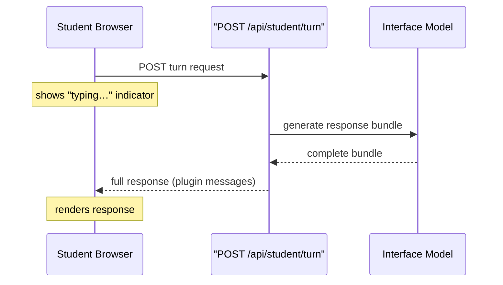
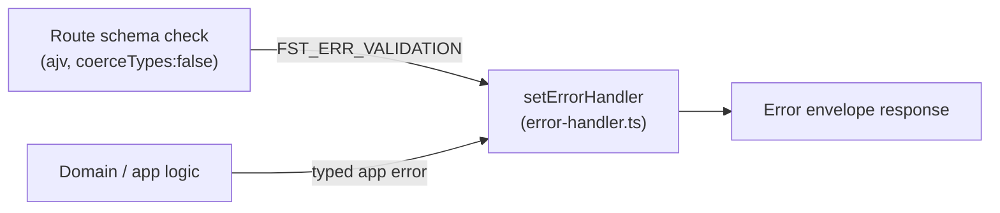

Bề mặt HTTP của server ở giai đoạn MVP được cố ý giữ thật nhỏ: chỉ một endpoint điều khiển toàn bộ vòng lặp student–tutor. Mọi lựa chọn thiết kế — hình dạng route, mô hình transport (cơ chế truyền tải), quy tắc validation (xác thực) — đều đi từ một nguyên tắc duy nhất: một hợp đồng được xác thực bằng schema, không có bất ngờ âm thầm nào.

## Một route phẳng, một hợp đồng đầy đủ

Đầu vào của student được gửi tới `POST /api/student/turn` với phần thân JSON:

```json
{
  "schemaVersion": "1",
  "sessionId": "<server-issued session id>",
  "message": "What does osmosis mean?"
}
```

Một thiết kế trước đó dùng `POST /api/student/session/:id/turn`, đặt session ID trong URL path. Cách này bị bỏ vì path parameter và request body là hai schema tách biệt — bạn không thể biểu đạt toàn bộ `TurnRequest` như một kiểu duy nhất trong gói shared contracts. Fastify được chọn chính là vì khả năng validation JSON Schema theo từng route; tách một request logic thành hai schema đi ngược lại lựa chọn đó.

Một lượt cũng là một **command** (lệnh), không phải một sub-resource (tài nguyên con). Không tồn tại bộ sưu tập turn nào, và cũng không có turn riêng lẻ nào từng được truy cập bằng ID, nên việc lồng path theo kiểu REST không đem lại lợi ích cấu trúc nào. Route phẳng mới là hình dạng trung thực.

`sessionId` trong phần thân phải tham chiếu đến một dòng session thật do server cấp ra. Phương án để client tự bịa ra một giá trị mà server rồi sẽ bỏ qua cũng đã bị bác bỏ: một định danh không ánh xạ tới gì cả còn tệ hơn không có định danh nào, nhất là khi schema đang bận kiểm tra hình dạng của nó.

## Request/response đơn giản — không streaming

Một lượt tutor đi theo chu trình HTTP request/response thông thường. Student gửi POST chứa tin nhắn của mình; server trả về **toàn bộ gói phản hồi** (danh sách plugin message) khi việc sinh nội dung hoàn tất; frontend hiển thị chỉ báo "typing…" trong lúc chờ.

Streaming theo từng token từng được cân nhắc rồi loại bỏ vì là một cam kết vượt quá nhu cầu. Lượt tương tác phía student chạy trên Interface model nhanh (vài giây), nên chỉ báo đang gõ là đủ để tạo cảm giác phản hồi. Expert model chậm hơn chạy ngoài vòng lặp của turn và không bao giờ chặn student.



Vì trong MVP server không bao giờ cần chủ động đẩy một tin nhắn mà student chưa yêu cầu (cập nhật checkpoint sẽ tới ở lượt tiếp theo; tính năng nhắc khi im lặng là bộ đếm giờ phía client), nên SSE, WebSocket và mọi kết nối duy trì lâu đều không cần thiết. Nhờ đó, logic kết nối lại, cấu hình proxy buffering, và câu hỏi nên quản lý registry kết nối hay Redis đều được loại khỏi phạm vi MVP.

:::note[Điều kiện để xem xét lại]
Nếu một tính năng tương lai cần một tin nhắn server → student không do yêu cầu khởi phát — như một lời nhắc trực tiếp hoặc một plugin thời gian thực — thì chỉ transport là cần thay đổi. Hình dạng phản hồi thì đã sẵn sàng rồi, vì nó vốn đã là một danh sách message.
:::

## Validation nghiêm ngặt: ajv coercion bị tắt

Fastify dùng **ajv** (trình xác thực JSON Schema) để kiểm tra mọi request body trước khi route handler chạy. Theo mặc định, ajv sẽ *coerce* (ép kiểu ngầm) các kiểu vô hướng: nếu một trường được khai báo là `{ type: 'string' }` nhưng client gửi số `123`, ajv sẽ âm thầm chuyển nó thành `"123"` rồi cho qua là hợp lệ. Route handler nhìn thấy một body sạch và trả về `200` — việc lệch kiểu trở nên vô hình.

Điều này âm thầm phá hỏng hợp đồng error-envelope (bao lỗi). Một trường sai kiểu đáng ra phải trả về `400` có cấu trúc. Khi bật coercion, sẽ không có lỗi validation nào được phát ra, nên error handler không bao giờ được gọi.

Cách sửa là một cấu hình duy nhất tại nơi khởi tạo Fastify trong `server/src/app.ts`:

```ts
const app = fastify({
  loggerInstance: ctx.logger as never,
  ajv: { customOptions: { coerceTypes: false } },
});
```

Khi coercion bị tắt, mọi route đều xác thực *đúng kiểu thực tế* mà client đã gửi. Cấu hình này nằm ở composition root (gốc lắp ghép) để áp dụng cho mọi route mà không cần từng route tự phòng thủ. Phương án còn lại — để coercion bật — đã bị bác bỏ: sự tiện lợi của coercion ở đây chẳng có giá trị gì (không route nào muốn nhận `"123"` từ `123`), trong khi kiểu lỗi của nó là âm thầm và sẽ tự động ảnh hưởng tới mọi route tương lai.

:::caution[Test instance]
Một bài test tự dựng `fastify()` trần của riêng nó sẽ **không** kế thừa cấu hình này — Fastify sẽ dùng mặc định của framework. Mọi instance test dựng tay đều phải tự áp dụng lại `coerceTypes: false`, nếu không một assertion cho body sai định dạng có thể vẫn pass nhưng vì lý do sai.
:::

Lớp bảo vệ này được chứng minh bằng một test lệch kiểu chuyên biệt trong `server/test/error-handler.test.ts`, độc lập với mọi route của ứng dụng. Nó đã được kiểm chứng theo cách rất thực tế: tạm thời bỏ `coerceTypes: false` khỏi `app.ts` làm test thất bại với `expected 200 to be 400`; khôi phục cấu hình đó thì test xanh trở lại. Route tạm `echo-turn` có thể bị xóa ở một sprint sau mà không làm mất đi bằng chứng duy nhất của lớp bảo vệ này.

## Lỗi validation và error envelope

Validation schema của Fastify tạo ra mã lỗi riêng của nó — `FST_ERR_VALIDATION` — nằm ngoài hệ phân cấp typed-error (lỗi phân loại bằng kiểu) của ứng dụng. Nếu không xử lý tường minh, một request trượt validation schema của route (trước cả khi chạm tới mã domain) sẽ đi vòng qua error envelope tiêu chuẩn và trả về phản hồi thô, không có cấu trúc, của Fastify.

Một `setErrorHandler` duy nhất trong `server/src/api/error-handler.ts` sẽ chặn mọi lỗi và ánh xạ chúng về hình dạng envelope:



Mọi lỗi HTTP mà client nhận được đều có cùng một cấu trúc, bất kể lỗi đó đến từ bước kiểm tra schema của chính framework hay từ logic ứng dụng sâu hơn trong stack. Hai mảnh này phối hợp với nhau: việc tắt coercion đảm bảo lệch kiểu thật sự phát sinh `FST_ERR_VALIDATION`, còn error handler đảm bảo lỗi đó xuất hiện dưới dạng envelope có cấu trúc thay vì đầu ra Fastify thô.

## Bao phủ test cho bảng route

Vì bất kỳ route mới nào cũng có thể vô tình làm rộng bề mặt API, bảng route được kiểm soát bằng một kiểm tra allowlist trong CI. Fastify đăng ký plugin theo kiểu **lazy** (trì hoãn) — `app.register(...)` chỉ xếp plugin vào hàng đợi; các route bên trong nó chưa tồn tại cho tới khi `app.ready()` chạy. Điều này tạo ra một cửa sổ rất hẹp để introspect (thanh tra) route:

```
app.register(routes)          // queues the plugin
app.addHook('onRoute', collect)  // ← attach here
await app.ready()             // routes register; hook fires
```

Nếu gắn `onRoute` sau `app.ready()`, hook sẽ không nhận được gì — tập kết quả rỗng. Nếu không bao giờ gọi `app.ready()`, các route vẫn chưa tồn tại — cũng rỗng. Một tập rỗng có thể pass theo kiểu vacuous khi kiểm tra chỉ đi tìm “không có route cấm nào xuất hiện”, trông thì xanh nhưng thực ra không quan sát được gì.

Hook `onRoute` cung cấp một cấu trúc `{ method, url }` cho từng route ngay lúc nó được đăng ký, từ đó cho phép so sánh `Set` chính xác với allowlist đã được ghim. `printRoutes()` từng được cân nhắc rồi bác bỏ — nó trả về một chuỗi cây đã định dạng, không phải một hợp đồng ổn định, và sẽ còn cần bị parse. Assertion so sánh tập hợp này sẽ nổ cả khi có thêm một route chưa khai báo lẫn khi một route bị xóa nhưng mục tương ứng vẫn còn sót lại trong allowlist.
