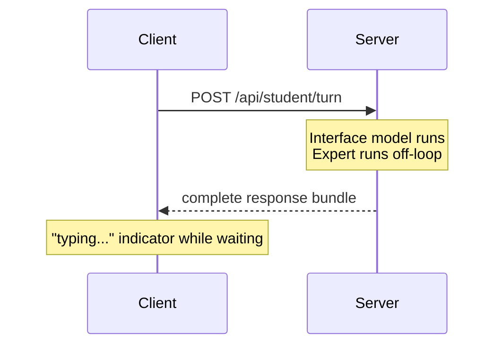
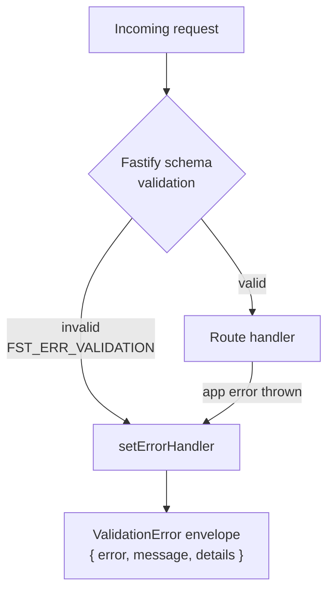
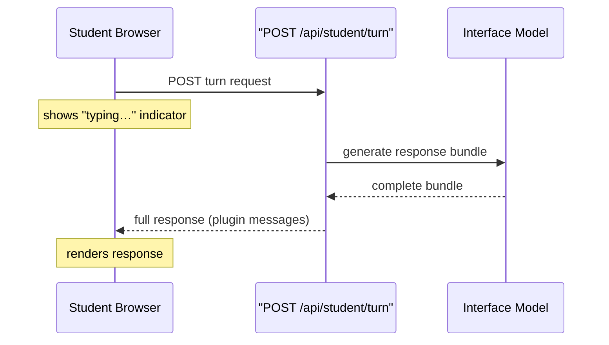
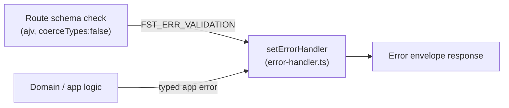

API phía student chỉ có một route POST phẳng, và chỉ trả về trọn bộ response bundle (gói phản hồi) khi việc sinh nội dung kết thúc. Không có streaming, không có kết nối duy trì lâu. Cách này giữ cho lớp transport (truyền tải) đơn giản và loại bỏ hẳn cả một nhóm bận tâm về hạ tầng khỏi MVP.

## Route (đường dẫn xử lý) duy nhất: `POST /api/student/turn`

Một tutor turn là một command (lệnh), không phải REST resource (tài nguyên REST). Client gửi:

```json
{
  "schemaVersion": "1",
  "sessionId": "<server-issued session id>",
  "message": "Can you explain this again?"
}
```

Cả ba trường đều nằm trong **request body**, không nằm trên URL path. Một thiết kế trước đó dùng URL lồng nhau — `POST /api/student/session/:id/turn` — nhưng đã bị loại vì nó tách turn request thành hai schema khác nhau (`params` + `body`). Gói shared contracts không thể mô hình hóa `TurnRequest` thành một type duy nhất khi một phần của nó nằm trong path parameter, mà đó lại chính là bảo đảm cốt lõi bộ thiết lập này được tạo ra để cung cấp.

`sessionId` phải trỏ tới một bản ghi session thật do server cấp. Phương án để client tự nghĩ ra một giá trị rồi server lờ đi cũng đã bị bác bỏ — một định danh không trỏ tới đâu còn nguy hiểm hơn là không có định danh nào, nhất là khi schema validation (xác thực schema) đang bận xác nhận hình dạng của nó.

## Không có streaming trong MVP

Server trả về **complete response bundle** (danh sách plugin messages) khi việc sinh nội dung hoàn tất. Trong lúc server đang xử lý, client hiển thị chỉ báo "typing…" — đúng kiểu tín hiệu quen thuộc của các ứng dụng nhắn tin.

Streaming theo từng token từng được cân nhắc rồi bị loại vì là một cam kết quá tay. Turn phía student chạy trên Interface model nhanh, mất vài giây. Expert model chậm hơn thì chạy ngoài turn loop và không bao giờ chặn student. Vì trong MVP không có thông điệp nào từ server gửi sang student mà không được yêu cầu trước — cập nhật checkpoint đi kèm turn tiếp theo, còn lời nhắc khi im lặng là bộ hẹn giờ phía client — nên không có gì thực sự đòi hỏi một kết nối duy trì lâu.



Loại bỏ streaming cũng đồng nghĩa loại bỏ luôn: phần thiết lập SSE/WebSocket, logic reconnect, cấu hình proxy buffering, và câu hỏi nên dùng connection registry hay Redis. Dấu hiệu để xem xét lại: bất kỳ nhu cầu tương lai nào về một thông điệp server → student không cần student chủ động hỏi trước (live nudge, real-time plugin).

## Lỗi validation và error envelope

Mọi lỗi API trả về — dù do mã ứng dụng ném ra hay do schema validation tích hợp sẵn của Fastify tạo ra — đều dùng chung một envelope shape (dạng bao lỗi). Khi request body không khớp với JSON Schema của route, schema validation của Fastify sẽ phát sinh `FST_ERR_VALIDATION`. Nếu không xử lý tường minh, lỗi này sẽ thoát ra dưới dạng phản hồi thô của riêng Fastify, không đi qua envelope, và vì thế phá vỡ contract (hợp đồng).

`setErrorHandler` duy nhất trong `server/src/api/error-handler.ts` sẽ bắt `FST_ERR_VALIDATION` và ánh xạ nó sang envelope shape của `ValidationError` — cũng chính là shape dùng cho mọi application error khác. Vì vậy, một request trượt route-level schema validation (trước cả khi chạm vào domain module) vẫn tạo ra cùng một structured error body như một lỗi phát sinh sâu hơn trong stack.



## Vì sao ajv coercion phải bị tắt

Cơ chế ánh xạ này có một phụ thuộc ngầm: **ajv type coercion phải bị tắt**.

Theo mặc định, trình biên dịch ajv của Fastify sẽ ép kiểu các giá trị scalar *trước khi* phần validation của `schema.body` chạy. Nếu gửi số `123` vào nơi đang mong đợi `{ type: 'string' }`, nó sẽ bị đổi thành chuỗi `"123"` rồi vượt qua validation. Route nhận được một body hợp lệ và trả về `200`. `FST_ERR_VALIDATION` không bao giờ được phát sinh, nên `setErrorHandler` cũng không bao giờ được gọi, và việc ánh xạ sang envelope trở nên vô hiệu.

Coercion được tắt trên toàn ứng dụng ngay tại điểm khởi tạo `fastify()` duy nhất trong `server/src/app.ts`:

```ts
const app = fastify({
  loggerInstance: ctx.logger as never,
  ajv: { customOptions: { coerceTypes: false } },
});
```

Phương án để coercion tiếp tục bật rồi từng route tự phòng thủ riêng đã bị bác bỏ. Sự tiện lợi của coercion ở đây không đáng giá gì — không route nào muốn nhận `"123"` từ `123` — trong khi kiểu hỏng của nó lại âm thầm và sẽ áp lên mọi route được thêm trong tương lai. Một cấu hình duy nhất tại composition root (gốc lắp ghép) là nơi duy nhất ràng buộc này được đảm bảo ở phạm vi toàn cục.

:::caution
Một test tự dựng `fastify()` trần sẽ **không** kế thừa cấu hình này. Mọi test instance dựng tay đều phải áp dụng lại `coerceTypes: false` một cách tường minh, nếu không một assertion về malformed body có thể vẫn pass nhưng vì sai lý do.
:::

Tính đúng đắn của lớp bảo vệ này đã được kiểm chứng bằng cách tạm thời bỏ `coerceTypes: false`, chạy test lệch kiểu, rồi quan sát nó thất bại với `AssertionError: expected 200 to be 400`. Trường bị gõ sai kiểu đã bị ép kiểu âm thầm và đi qua validation — đúng chính xác kiểu hỏng mà cấu hình này được tạo ra để ngăn chặn. Test đó hiện nằm trong `server/test/error-handler.test.ts` và độc lập với bất kỳ route cụ thể nào.

## Introspection bảng route và thời điểm boot của Fastify

Một hệ quả từ cách Fastify vận hành là: gọi `app.register(...)` **không** gắn route ngay lập tức. Fastify sẽ xếp các plugin lồng nhau theo prefix vào hàng đợi; callback của chúng chỉ chạy — và route chỉ thực sự được đăng ký — trong giai đoạn boot, do `app.ready()` kích hoạt.

Bất kỳ test nào cần introspect (kiểm tra cấu trúc) bảng route — ví dụ để áp một allowlist (danh sách cho phép) các route được phép — đều phải gắn hook `onRoute` trong một khoảng rất hẹp: **sau** lời gọi đăng ký, nhưng **trước khi** `ready()` được `await`.

```
app.register(routes)          ← plugins queued, no routes yet
hook: app.addHook('onRoute')  ← collector attached here
await app.ready()             ← plugins execute, onRoute fires per route
compare collected set against allowlist
```

Nếu lỡ khoảng này, bạn sẽ gặp một kiểu hỏng âm thầm. Gắn `onRoute` sau `ready()` thì nó không bắt được gì; đọc bảng route trước `ready()` thì route vẫn chưa tồn tại. Dù theo cách nào, tập thu được cũng rỗng. Một tập rỗng mà đem so với logic kiểu “không tìm thấy route bị cấm” sẽ đỗ một cách rỗng nghĩa — trông thì xanh nhưng thực ra không quan sát được gì.

`onRoute` là công cụ đúng (không phải `printRoutes()`) vì nó cung cấp dữ liệu có cấu trúc `{ method, url }` cho từng route, nhờ đó có thể so sánh chính xác bằng set-equality với một allowlist đã được ghim sẵn. Assertion này kiểm tra cả hai chiều: nó sẽ báo đỏ nếu có thêm route mới, và cũng báo đỏ nếu một route đã bị xóa nhưng mục tương ứng trong allowlist vẫn còn sót lại.

Bề mặt HTTP của server cho MVP được cố ý giữ thật nhỏ: một endpoint điều khiển toàn bộ vòng lặp student–tutor. Mọi lựa chọn thiết kế — từ hình dạng route, mô hình transport, cho tới các quy tắc validation — đều đi theo một nguyên tắc duy nhất: một contract được xác thực bằng schema, không có bất ngờ âm thầm.

## Một route phẳng, một contract trọn vẹn

Đầu vào từ student được gửi tới `POST /api/student/turn` bằng JSON body:

```json
{
  "schemaVersion": "1",
  "sessionId": "<server-issued session id>",
  "message": "What does osmosis mean?"
}
```

Một thiết kế trước đó dùng `POST /api/student/session/:id/turn`, đặt session ID trên URL path. Cách này bị bỏ vì path parameter và request body là hai schema tách biệt — bạn không thể biểu đạt toàn bộ `TurnRequest` thành một type duy nhất trong gói shared contracts. Fastify được chọn chính xác là vì khả năng JSON Schema validation theo từng route; tách một request logic thành hai schema đi ngược lại lựa chọn đó.

Một turn cũng là một **command**, không phải sub-resource (tài nguyên con). Không có turn collection nào tồn tại, và cũng không có turn đơn lẻ nào từng được truy cập bằng ID, nên việc lồng path theo kiểu REST không mang lại gì. Route phẳng mới là hình dạng trung thực.

`sessionId` trong body phải trỏ tới một bản ghi session thật do server cấp. Phương án để client tự bịa ra một giá trị mà server bỏ qua cũng đã bị loại: một định danh không ánh xạ tới đâu còn tệ hơn không có định danh nào, nhất là khi schema đã đang kiểm tra hình dạng của nó.

## Request/response thuần — không streaming

Một tutor turn đi theo chu trình HTTP request/response thông thường. Student gửi POST với thông điệp của mình; server trả về **complete response bundle** (danh sách plugin messages) khi việc sinh nội dung xong; frontend hiển thị chỉ báo "typing…" trong lúc chờ.

Streaming từng token từng được cân nhắc rồi loại bỏ vì là một cam kết quá tay. Turn phía student chạy trên Interface model nhanh (vài giây), nên chỉ báo đang gõ là đủ để tạo cảm giác phản hồi. Expert model chậm hơn chạy ngoài turn loop và không bao giờ chặn student.



Vì trong MVP server không bao giờ cần đẩy một thông điệp mà student chưa yêu cầu trước (cập nhật checkpoint sẽ tới ở turn tiếp theo; lời nhắc khi im lặng là bộ hẹn giờ phía client), nên SSE, WebSocket và mọi kết nối duy trì lâu đều không cần thiết. Nhờ đó, logic reconnect, cấu hình proxy buffering và bài toán connection registry được loại hoàn toàn khỏi phạm vi MVP.

:::note[Khi nào cần xem xét lại]
Nếu một tính năng tương lai cần một thông điệp server → student không do yêu cầu khởi phát — như live nudge hoặc real-time plugin — thì chỉ transport là thứ cần thay đổi. Hình dạng response đã sẵn sàng rồi, vì bản thân nó vốn là một danh sách messages.
:::

## Validation nghiêm ngặt: ajv coercion bị tắt

Fastify dùng **ajv** (trình kiểm tra JSON Schema) để kiểm tra mọi request body trước khi route handler chạy. Theo mặc định, ajv sẽ *coerce* các kiểu scalar: nếu một trường được khai báo là `{ type: 'string' }` nhưng client gửi số `123`, ajv sẽ âm thầm đổi nó thành `"123"` rồi cho qua như hợp lệ. Route handler nhìn thấy một body sạch và trả về `200` — lệch kiểu hoàn toàn vô hình.

Điều này âm thầm phá vỡ contract của error envelope. Một trường sai kiểu lẽ ra phải trả về `400` có cấu trúc. Khi coercion bật, sẽ không có validation failure nào được phát sinh, nên error handler cũng không bao giờ được gọi.

Cách sửa là một cấu hình duy nhất tại điểm khởi tạo Fastify trong `server/src/app.ts`:

```ts
const app = fastify({
  loggerInstance: ctx.logger as never,
  ajv: { customOptions: { coerceTypes: false } },
});
```

Khi coercion bị tắt, mọi route sẽ kiểm tra *đúng kiểu thực tế* mà client đã gửi. Cấu hình này nằm ở composition root để áp vào mọi route mà không cần từng route tự phòng thủ. Phương án còn lại — để coercion bật — đã bị bác bỏ: sự tiện lợi của coercion ở đây không có giá trị gì (không route nào muốn `"123"` từ `123`), trong khi kiểu hỏng của nó lại âm thầm và tự động ảnh hưởng tới mọi route tương lai.

:::caution[Test instance phải áp lại cấu hình này]
Một test tự dựng `fastify()` trần của riêng nó sẽ **không** kế thừa cấu hình này — Fastify sẽ dùng mặc định của framework. Mọi test instance dựng tay đều phải tự áp lại `coerceTypes: false`, nếu không một assertion cho malformed body có thể vẫn pass nhưng vì sai lý do.
:::

Lớp bảo vệ này được chứng minh bằng một test lệch kiểu chuyên biệt trong `server/test/error-handler.test.ts`, độc lập với mọi route của ứng dụng. Nó đã được kiểm chứng theo cách trực tiếp nhất: tạm thời bỏ `coerceTypes: false` khỏi `app.ts` làm test thất bại với `expected 200 to be 400`; khôi phục cấu hình đó thì test lại pass. Kiểu hỏng này là thứ đã được quan sát thật, chứ không chỉ suy luận trên lý thuyết.

## Lỗi validation và error envelope

Schema validation của Fastify tạo ra mã lỗi riêng — `FST_ERR_VALIDATION` — nằm ngoài hệ phân cấp typed error của ứng dụng. Nếu không xử lý tường minh, một request trượt route-schema validation (trước khi chạm tới bất kỳ domain code nào) sẽ đi vòng qua error envelope chuẩn và trả về phản hồi thô, không có cấu trúc, của Fastify.

Một `setErrorHandler` duy nhất trong `server/src/api/error-handler.ts` chặn mọi lỗi và ánh xạ chúng về envelope shape:



Mọi lỗi HTTP mà client nhận được đều có cùng một cấu trúc, bất kể lỗi đó đến từ bước kiểm tra schema của framework hay từ logic ứng dụng sâu hơn trong stack. Hai mảnh này hoạt động cùng nhau: tắt coercion để bảo đảm lệch kiểu thật sự sinh ra `FST_ERR_VALIDATION`, và error handler để bảo đảm lỗi đó hiện ra dưới dạng envelope có cấu trúc thay vì đầu ra Fastify thô.

## Kiểm tra allowlist của bảng route

Vì bất kỳ route mới nào cũng có thể vô tình làm rộng bề mặt API, bảng route được bao phủ bằng một kiểm tra allowlist trong CI. Fastify đăng ký plugin theo kiểu **lazy** — `app.register(...)` chỉ đưa plugin vào hàng đợi; các route bên trong nó chưa tồn tại cho tới khi `app.ready()` chạy. Điều này tạo ra một cửa sổ hẹp cho việc introspect route:

```
app.register(routes)             // queues the plugin
app.addHook('onRoute', collect)  // ← attach here
await app.ready()                // routes register; hook fires
```

Nếu gắn `onRoute` sau `app.ready()`, hook sẽ không bắt được gì — tập kết quả rỗng. Nếu không bao giờ gọi `app.ready()`, route vẫn chưa tồn tại — cũng rỗng. Một tập rỗng có thể đỗ một cách rỗng nghĩa khi bài kiểm tra chỉ tìm “không có forbidden route nào xuất hiện”, trông xanh nhưng thực ra không quan sát được gì.

Hook `onRoute` cung cấp một cấu trúc `{ method, url }` cho từng route ngay lúc nó được đăng ký, nhờ đó có thể so sánh `Set` chính xác với allowlist đã được ghim. `printRoutes()` từng được cân nhắc rồi bị loại — nó trả về một chuỗi cây đã định dạng, không phải một contract ổn định, và còn phải bị parse thêm. Assertion so sánh tập hợp này sẽ phát nổ cả khi có một route thừa chưa khai báo lẫn khi một route đã bị xóa nhưng mục tương ứng trong allowlist vẫn còn sót lại.
