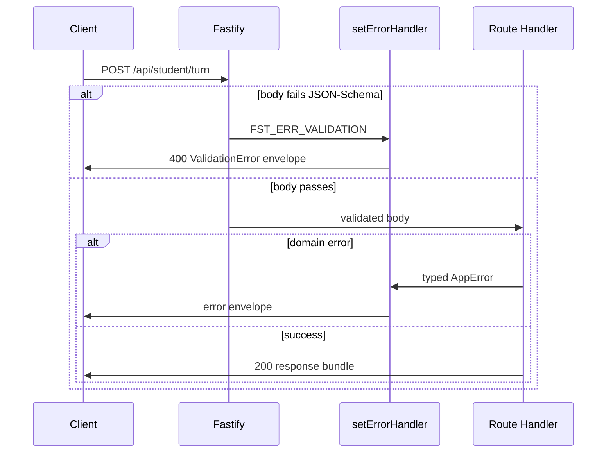

Phần backend của Stemolly cung cấp một HTTP API nhỏ được xây dựng trên **Fastify**. Mọi lần tương tác của học sinh đều đi qua một route (đường dẫn xử lý) duy nhất. Phản hồi luôn là các JSON bundle (gói JSON) hoàn chỉnh — không dùng streaming (truyền luồng). Một validation contract (hợp đồng kiểm tra hợp lệ) chặt chẽ bảo đảm rằng mọi request sai, dù bị framework hay ứng dụng từ chối, đều trả về cùng một dạng lỗi.

---

## Route của Turn

Một turn (lượt trao đổi) của học sinh được gửi như sau:

```
POST /api/student/turn
```

```json
{
  "schemaVersion": "1",
  "sessionId": "srv-issued-id",
  "message": "Can you explain this again?"
}
```

Toàn bộ request — định danh session và nội dung tin nhắn — đều nằm trong **body**, không nằm trên URL.

### Vì sao không dùng route lồng nhau?

Một thiết kế trước đó dùng `POST /api/student/session/:id/turn`, tức đặt session ID trên URL path. Phương án này bị bác bỏ vì một lý do rất cụ thể: khi đó session ID sẽ nằm trong một schema `params`, còn phần còn lại của request lại nằm trong một schema `body`, khiến không thể biểu diễn `TurnRequest` thành một kiểu duy nhất trong shared contracts package.

Quy tắc của dự án là mọi artifact đi qua service boundary (ranh giới dịch vụ) đều phải được kiểm tra như một contract duy nhất có schema validation. Tách một request logic thành hai schema sẽ phá vỡ quy tắc đó — và khi type coercion (ép kiểu tự động) đã bị tắt trên toàn ứng dụng (xem bên dưới), một bề mặt `params` lại càng thêm vụng về.

Một turn cũng là một **command**, không phải sub-resource (tài nguyên con). Không hề có tập hợp turn nào tồn tại, và cũng không có turn riêng lẻ nào từng được truy cập bằng ID, nên cách lồng path theo kiểu REST không đem lại lợi ích cấu trúc nào. Route phẳng mới là hình dạng trung thực nhất.

`sessionId` trong body phải phân giải được tới một bản ghi session thật do server cấp. Phương án để client tự bịa một giá trị rồi server âm thầm bỏ qua cũng đã bị bác bỏ: khi schema đang kiểm tra hình dạng dữ liệu, một định danh không trỏ tới đâu còn tệ hơn là không có định danh nào.

---

## Transport: Request/Response với chỉ báo đang nhập

Một turn của tutor dùng mô hình plain HTTP request/response (yêu cầu/phản hồi HTTP thuần). Học sinh gửi POST; server trả về trọn bộ phản hồi (một danh sách plugin messages) khi quá trình sinh hoàn tất; frontend hiển thị chỉ báo "đang nhập…" trong lúc chờ.

Streaming theo từng token đã được cân nhắc rồi loại bỏ. Turn phía học sinh chạy trên model **Interface** rất nhanh, thường xong trong vài giây — chỉ báo đang nhập là đủ về mặt cảm nhận phản hồi. Model **Expert** chậm hơn chạy ngoài vòng lặp turn nên không bao giờ chặn học sinh.

Trong MVP không có message nào từ server gửi sang học sinh mà không được yêu cầu trước:

- Cập nhật checkpoint sẽ đi kèm phản hồi của turn *tiếp theo*.
- Lời nhắc khi im lặng quá lâu là một client-side timer (bộ đếm thời gian phía client), không phải server push.

Vì server không bao giờ cần chủ động đẩy một message mà học sinh chưa yêu cầu, SSE, WebSockets và mọi push channel đều không cần thiết. Bỏ chúng đi cũng đồng nghĩa loại bỏ kết nối sống lâu, logic reconnect, cấu hình proxy buffering, và cả câu hỏi nên dùng connection registry hay Redis.

**Khi nào nên xem xét lại:** nếu một tính năng trong tương lai cần message server→student không cần yêu cầu trước (một lời nhắc trực tiếp, một plugin thời gian thực), thì chỉ lớp transport cần đổi — phần phản hồi vốn đã là một danh sách message, nên hình dạng dữ liệu vẫn giữ nguyên.

---

## Validation: Một Envelope cho mọi lỗi



### Một error handler cho mọi lỗi

Fastify kiểm tra request body của từng route theo JSON Schema trước khi route handler chạy. Khi validation thất bại, Fastify phát sinh `FST_ERR_VALIDATION` — kiểu lỗi riêng của framework, nằm ngoài hệ thống typed error của ứng dụng.

Dự án ánh xạ lỗi ở cấp framework này về cùng dạng envelope được dùng ở mọi nơi khác. Một `setErrorHandler` duy nhất trong `server/src/api/error-handler.ts` xử lý cả hai trường hợp:

- `FST_ERR_VALIDATION` từ Fastify → được tuần tự hóa thành một envelope `ValidationError`.
- Bất kỳ `AppError` có kiểu nào do một domain module ném ra → được tuần tự hóa thành biến thể envelope tương ứng của chính nó.

Client luôn nhận cùng một cấu trúc, bất kể lỗi phát sinh từ đâu.

### Vì sao phải tắt coercion

Ánh xạ này có một điều kiện tiên quyết ít lộ diện. Với cấu hình ajv **mặc định** của Fastify, các kiểu scalar sẽ bị coercion **trước khi** schema validation chạy. Nếu client gửi `{ "message": 123 }` còn schema khai báo `{ type: "string" }`, Fastify sẽ âm thầm đổi `123` thành `"123"` và validation vẫn qua. Route sẽ nhìn thấy một body hợp lệ và trả về `200`. `FST_ERR_VALIDATION` không bao giờ được phát sinh, nên error handler cũng không bao giờ được gọi — hợp đồng envelope bị phá vỡ mà không có dấu hiệu cảnh báo rõ ràng nào.

Cách sửa là tắt coercion **một lần duy nhất** tại điểm khởi tạo `fastify()` trong `server/src/app.ts`:

```ts
const app = fastify({
  loggerInstance: ctx.logger as never,
  ajv: { customOptions: { coerceTypes: false } },
});
```

Khi coercion bị tắt, schema của mọi route sẽ kiểm tra kiểu *thực tế* của request. Một trường sai kiểu lúc này sẽ phát sinh `FST_ERR_VALIDATION`, và error handler sẽ bắt lỗi đó rồi bọc lại vào envelope.

Phương án còn lại — giữ coercion ở trạng thái bật rồi để từng route tự phòng thủ — đã bị bác bỏ. Sự tiện lợi của coercion không có giá trị gì ở đây (không route nào muốn nhận chuỗi `"123"` thay cho số `123`), trong khi kiểu hỏng này lại âm thầm và ảnh hưởng tới mọi route được thêm về sau. Tắt nó một lần tại composition site (điểm hợp thành) là nơi duy nhất giúp ràng buộc này có hiệu lực trên toàn cục.

> **Test instance không kế thừa gì cả.** Một bài test tự dựng `fastify()` trần sẽ **không** kế thừa cấu hình này. Các test instance được tạo thủ công phải áp dụng lại `coerceTypes: false` một cách tường minh, nếu không một kiểm tra với body lỗi định dạng có thể vẫn "đúng", nhưng vì sai lý do.

### Chốt chặn coercion không phụ thuộc route

Ban đầu, bài test duy nhất cho quy tắc này bị gắn chặt với route tạm thời `echo-turn`. Nếu route đó bị xóa, bài test cũng biến mất theo — và chốt chặn coercion sẽ không còn bằng chứng nào bảo vệ nó.

Giờ đây chốt chặn đó đã được cố định độc lập: `server/test/error-handler.test.ts` có một trường hợp riêng cho lỗi lệch kiểu (một giá trị số cho trường `{ type: "string" }`) không phụ thuộc vào bất kỳ route ứng dụng nào. Bản sửa đã được kiểm chứng theo cách trực diện nhất — tạm thời gỡ `coerceTypes: false` khỏi `app.ts`, chạy lại bài test mới và thấy nó thất bại với `expected 200 to be 400`, rồi khôi phục `app.ts` và bài test lại vượt qua. Route `echo-turn` có thể bị xóa ở sprint sau mà không làm mất phạm vi bảo vệ của chốt chặn này.

---

## Fastify Plugin Registration: Thời điểm rất quan trọng

Hệ thống plugin của Fastify là **lazy** (trì hoãn). Gọi `app.register(...)` không gắn route ngay lập tức — nó chỉ xếp plugin vào hàng chờ. Các route chỉ thực sự được đăng ký khi `app.ready()` được `await` trong lúc khởi động.

Điều này rất quan trọng với mọi bài test hoặc fitness function cần soi bảng route. Chỉ có một khoảng thời gian rất hẹp để gắn collector:

```
app.register(routes)   ← queues the plugin
app.addHook('onRoute', collect)   ← ✓ attach here
await app.ready()   ← routes register, hook fires
```

Nếu `onRoute` hook được gắn sau `app.ready()`, nó sẽ không bắt được gì và tập thu thập sẽ rỗng. Nếu `app.ready()` không bao giờ được gọi, các route vẫn chưa tồn tại — kết quả cũng rỗng.

Một tập rỗng có thể khiến phép kiểm tra hỏng mà không bị phát hiện: nếu phép kiểm tra chỉ tìm xem "không có route cấm nào được tìm thấy", thì một tập rỗng sẽ mặc nhiên vượt qua, trông như màu xanh nhưng thực ra chẳng quan sát được gì cả.

`onRoute` hook là công cụ phù hợp để soi bảng route vì nó cung cấp một đối tượng có cấu trúc `{ method, url }` cho từng route ngay khi route đó được đăng ký. Nhờ vậy có thể so sánh chính xác một `Set` với allowlist (danh sách cho phép) đã được chốt sẵn. `printRoutes()` trả về một chuỗi cây đã được định dạng, mà hình dạng của nó không phải một contract ổn định — muốn dùng thì phải tự phân tích. Phép so sánh đẳng thức tập hợp sẽ phát hiện cả route thừa lẫn route bị thiếu nhưng mục tương ứng vẫn còn nằm trong allowlist.
