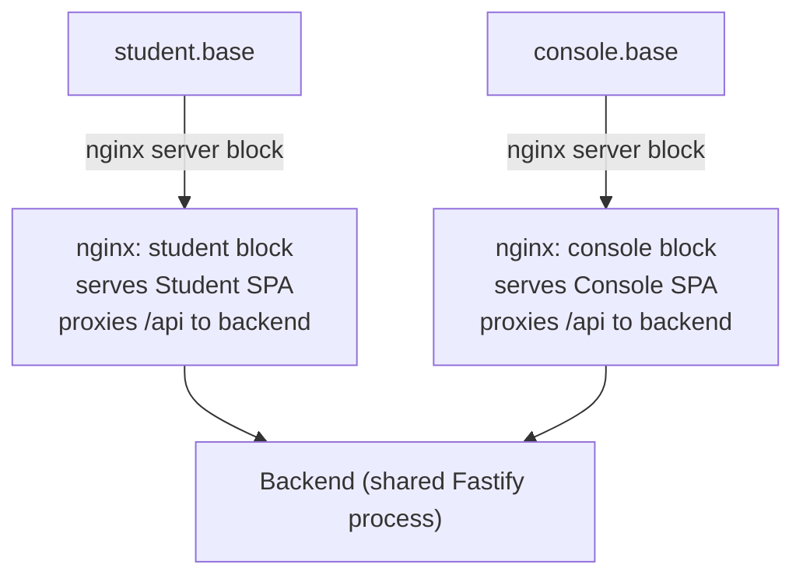
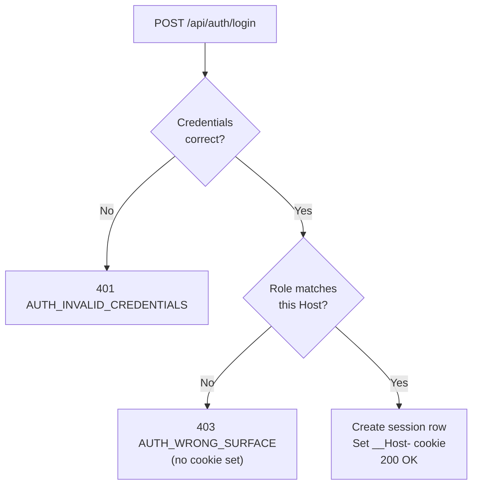

# Xác thực & Bảo mật

Stemolly dùng một mô hình bảo mật được cố ý giữ nhỏ gọn: xác thực email và mật khẩu theo mô hình invite-only (chỉ theo lời mời), server-side sessions (phiên phía máy chủ), và ba vai trò cố định được thực thi ngay tại API boundary (ranh giới API). Mỗi lựa chọn thiết kế trong phần này đều được đưa ra để khớp với threat surface (bề mặt rủi ro) thực tế — một nền tảng dành cho học sinh từ mẫu giáo đến lớp 11 — đồng thời tránh những phụ thuộc sẽ khiến việc xử lý dữ liệu của trẻ vị thành niên trở nên phức tạp hơn. Trang này giải thích cách các lựa chọn đó ăn khớp với nhau và vì sao chúng được đưa ra.

---

## Ai Có Thể Đăng Nhập, và Bằng Cách Nào

Không có cơ chế tự đăng ký công khai. Một Admin mời người dùng qua email và gán vai trò cho họ. Người được mời nhận liên kết, đặt mật khẩu, rồi tài khoản của họ được kích hoạt trên ứng dụng mà vai trò đó cho phép truy cập. Đó là cách duy nhất để tạo một tài khoản.

**Mật khẩu** được băm bằng `argon2id`. Đây là best practice (thực hành tốt nhất) hiện nay cho việc băm mật khẩu — chậm một cách có chủ đích và có khả năng chống lại tấn công bằng GPU lẫn side-channel attacks (tấn công kênh kề).

**Session** là các bản ghi phía máy chủ trong Postgres. Trình duyệt nhận một cookie `httpOnly + Secure + SameSite` trỏ tới bản ghi session đó. Vì session nằm trên máy chủ, nó có thể bị thu hồi ngay lập tức — đăng xuất hoạt động đúng, và khi Admin gửi lại lời mời cho người dùng thì đó cũng chính là đường đặt lại mật khẩu.

### Vì sao không dùng JWT?

JSON Web Tokens (JWTs) là stateless (phi trạng thái): máy chủ không lưu chúng, nên không có cách nào thu hồi một token trước khi nó hết hạn. Tính phi trạng thái giải quyết một bài toán scale (mở rộng quy mô) — tránh phải dùng kho session dùng chung giữa nhiều máy chủ — nhưng Stemolly không có bài toán đó. Cái giá phải trả — mất khả năng thu hồi — là không đáng.

### Vì sao không dùng nhà cung cấp xác thực bên thứ ba?

Auth0, Clerk, Supabase Auth và các dịch vụ tương tự sẽ thêm một vendor dependency (phụ thuộc nhà cung cấp) xử lý dữ liệu cá nhân của trẻ vị thành niên. Luồng mời đủ đơn giản để tự xây trực tiếp, nên phụ thuộc đó bị loại bỏ.

### Vì sao không dùng framework RBAC?

"RBAC" (Role-Based Access Control, kiểm soát truy cập dựa trên vai trò) được thiết kế cho nhiều vai trò và các quyền chi tiết. Stemolly chỉ có đúng ba vai trò cố định. Một bảng RBAC đầy đủ sẽ là độ phức tạp mang tính suy đoán cho thứ vốn chỉ cần gói trong một enum duy nhất.

---

## Ba Vai Trò, Cố Định Ngay Khi Mời

| Vai trò | Truy cập được gì |
|---|---|
| `admin` | Toàn quyền — quản lý người dùng và lời mời |
| `console` | Ứng dụng Console — sản phẩm hướng tới giảng viên/người hướng dẫn (gộp Author và Observer) |
| `student` | Chỉ ứng dụng Student |

Vai trò được đặt khi Admin tạo lời mời. Không có giao diện đổi vai trò trong ứng dụng. Nếu cần đổi vai trò, Admin sẽ mời lại người dùng. Cách này giúp mô hình phân quyền có thể kiểm toán được: chỉ cần đọc bản ghi lời mời là biết toàn bộ tài khoản đó làm được gì.

---

## Cấu Trúc Subdomain: Vì Sao Chỉ Dùng Port Là Không Đủ

Phản xạ tự nhiên đầu tiên khi tách hai ứng dụng trong môi trường phát triển là chạy chúng trên các port khác nhau — chẳng hạn `localhost:3000` cho ứng dụng Student và `localhost:4000` cho Console. Cách này đã được thử rồi loại bỏ vì cách trình duyệt xử lý cookie.

**Cookie được ràng buộc theo hostname, không bao giờ theo port.** Điều này được quy định trong RFC 6265 và không phải là một điểm bất thường — đó là lựa chọn có chủ đích trong đặc tả cookie. Một cookie được đặt trên `localhost:7777` sẽ được gửi tới `localhost:7778`. Điều này đã được kiểm chứng bằng một thử nghiệm nhanh với Playwright trên cả Chromium lẫn Firefox. Hệ quả là: các port riêng biệt không thể cô lập hai session cookie. Cơ chế cô lập sẽ hoạt động ở production nhưng âm thầm thất bại trong môi trường phát triển — chính là nơi tệ nhất để một cơ chế bảo mật bị hỏng.

Các hostname riêng biệt thì cô lập được vùng lưu cookie, kể cả các subdomain `*.localhost`. Vì vậy Stemolly dùng subdomain.

### Cấu Trúc



Một tiến trình nginx chạy hai server block — mỗi hostname một block. Mỗi block phục vụ bundle tĩnh của ứng dụng tương ứng và proxy `/api` tới cùng một backend dùng chung. Cả hai ứng dụng cùng nằm dưới một biến môi trường `STEMOLLY_PUBLIC_BASE_DOMAIN`: `localhost` trong môi trường phát triển và domain thật ở production. Giữa các môi trường chỉ thay đổi biến đó; không có nhánh mã nào khác đi.

Vì mỗi SPA gọi `/api` trên chính origin (miền gốc) của mình, nên không có request cross-origin (khác nguồn). Cookie `SameSite` vẫn đủ để bảo vệ chống CSRF — không cần thêm CSRF token.

### Tiền Tố Cookie `__Host-`

Cookie session mang tiền tố `__Host-`. Đây là quy tắc do trình duyệt tự thực thi: một cookie `__Host-` không được có thuộc tính `Domain`, nên nó bị ràng buộc đúng với hostname đã đặt nó. Nếu sau này có một cấu hình sai thêm `Domain=.stemolly.com`, trình duyệt sẽ đơn giản từ chối. Thuộc tính "không bao giờ được chia sẻ giữa các subdomain" là một bất biến do trình duyệt cưỡng chế, không phải một quy ước mà ai đó có thể vô tình phá vỡ.

> **Quan trọng:** Subdomain không phải là ranh giới bảo mật cho dữ liệu. Một request tới `student.<base>/api/console/*` vẫn đi tới đúng cùng backend đó và bị role guard (bộ chặn vai trò) từ chối — chứ không phải bị chặn bởi hostname. Subdomain đem lại sự tách biệt giao diện và cô lập cookie; chính role guard mới là thứ thực sự bảo vệ dữ liệu.

---

## Đăng Nhập Theo Bề Mặt: Một Session, Một Host

Chỉ tách origin thôi thì chưa đủ. Một học viên gõ địa chỉ của Console vẫn sẽ tới được trang đăng nhập của nó — không thể giấu một trang đăng nhập công khai khỏi người biết URL của nó. Nếu đăng nhập chỉ kiểm tra mật khẩu, thông tin đăng nhập hợp lệ của học viên vẫn sẽ tạo ra một session Console, dẫn tới một cái vỏ ứng dụng nơi mọi lời gọi dữ liệu đều trả về 403. Đó chính là "vùng 403" mà toàn bộ việc tách origin được thiết kế để tránh.

Giải pháp là **surface-aware login (đăng nhập theo đúng bề mặt ứng dụng)**: endpoint đăng nhập suy ra surface (bề mặt đang được truy cập) từ header `Host` của request. Sau đó nó kiểm tra xem vai trò của người dùng có thuộc về surface đó hay không.



Port được bỏ khỏi header `Host` trước khi kiểm tra, vì môi trường phát triển có port còn production thì không — bỏ nó đi giúp logic giữ nguyên ở cả hai môi trường.

**Vì sao dùng `Host` chứ không dùng URL path?** Header `Host` và đích đến của cookie đều được suy ra từ cùng một URL, nên chúng không thể mâu thuẫn với nhau. Còn path thì client tự do chọn — nó có thể gọi một endpoint đăng nhập của Student từ trang Console — nhưng cookie vẫn sẽ được đặt trên host Console.

**`accept-invite` bịt luôn cánh cửa còn lại ngay từ thiết kế.** Endpoint accept-invite đặt mật khẩu rồi chuyển hướng người dùng tới trang đăng nhập trên đúng host ứng với vai trò của họ. Bản thân nó không bao giờ tự tạo session. Vì thế trong toàn hệ thống chỉ có đúng một endpoint có thể tạo session: endpoint đăng nhập theo bề mặt. Bất biến này là thuộc tính của thiết kế, không phải một quy tắc mà hai endpoint cùng phải nhớ tuân theo.

---

## 401 so với 403: Một Hợp Đồng Mà Frontend Dựa Vào

Trên mọi route bị chặn theo vai trò, `401` và `403` có ý nghĩa tách bạch, chặt chẽ:

| Mã | Ý nghĩa |
|---|---|
| `401` | Không có session hợp lệ — thiếu hoặc đã hết hạn. Hãy đăng nhập lại. |
| `403` | Session hợp lệ nhưng sai vai trò hoặc sai bề mặt. Thử lại cũng không giúp gì. |

Đây không chỉ là quy ước. API client dùng một quy tắc chung: bất kỳ `401` nào nhận được ngoài `/api/auth/*` đều kích hoạt bộ xử lý session hết hạn và chuyển hướng người dùng về trang đăng nhập. Nếu một lỗi phân quyền lại trả về `401`, SPA sẽ hất một người dùng đang đăng nhập sang trang đăng nhập mà không có lời giải thích nào — một vòng lặp khó hiểu trông giống hệt lỗi session.

Lưu ý rằng bản thân endpoint đăng nhập dùng một hợp đồng khác (nó trả `401` cho thông tin đăng nhập sai và `403` cho thông tin đăng nhập đúng nhưng sai bề mặt). Đây là các phản hồi thuộc `/api/auth/*`, và api-client cố ý loại trừ prefix đó khỏi quy tắc chung về session hết hạn.

---

## Bài Toán Namespace Công Khai

`login` và `accept-invite` phải chạy trước khi bên gọi có session hay vai trò nào. Chúng không thể nằm trong các namespace bị chặn theo vai trò (`/api/student/*`, `/api/console/*`, `/api/admin/*`) mà không phá vỡ thuộc tính deny-by-default (mặc định từ chối) vốn làm cho các namespace đó có thể kiểm toán được.

Thay vào đó, chúng nằm trong prefix thứ tư: `/api/auth/*`. Prefix này không mang role guard nào — nó được cố ý để ở trạng thái công khai.

Vấn đề là điều này đảo ngược kiểu thất bại. Trong một namespace bị chặn, quên gắn guard sẽ lộ rõ ngay: route trả về 403 lập tức. Còn trong `/api/auth/*`, không có guard nào để mà quên. Một route được thêm vào một cách bất cẩn sẽ trở thành công khai, hoạt động hoàn hảo, qua được kiểm thử của nó và không tạo ra triệu chứng gì.

Tên gọi còn làm mọi thứ tệ hơn: `/api/auth/*` tự nhiên thu hút các route xử lý thông tin xác thực — đặt lại mật khẩu, kiểm tra session, xác minh email — đổ dồn vào đúng namespace không có khóa.

**Biện pháp giảm thiểu là một CI-checked allowlist (danh sách cho phép được CI kiểm tra).** Một bước trong CI khẳng định rằng bảng route thực tế của `/api/auth/*` khớp với một danh sách route đã được phê duyệt rõ ràng. Nếu thêm route công khai mới mà không cập nhật allowlist, bản build sẽ fail. Allowlist không ngăn việc một route bị công khai hóa, nhưng nó ngăn điều đó xảy ra *một cách vô tình*. Chỉnh sửa allowlist chính là cổng kiểm tra của con người, nơi ai đó buộc phải hỏi: "Route này có thật sự nên công khai không?"

---

## Role Guard Đóng Mặc Định

Ba namespace theo vai trò được tạo ra với role guard được gắn sẵn **trước cả khi bất kỳ logic session nào xuất hiện ở đâu trong codebase**. Guard đó (`roleGuard` trong `server/src/api/plugins/auth.ts`) ban đầu chỉ là một placeholder, với phần thân hàm luôn ném `403`.

Đây là chủ ý. Hai thuộc tính dưới đây khiến cách làm này an toàn:

1. **Gắn ở phạm vi plugin.** Hook được đăng ký trên plugin (`studentApp.addHook('onRequest', roleGuard)`), không phải trên từng route. Cơ chế encapsulation (đóng gói phạm vi) của Fastify đồng nghĩa mọi route được thêm vào namespace đó về sau đều tự động được bao phủ — ổ khóa nằm ở cả căn phòng, không phải trên từng cánh cửa.
2. **Chữ ký export ổn định.** Khi logic session thật sự được đưa vào, chỉ phần thân hàm thay đổi. Không cần đụng tới bất kỳ nơi nào đăng ký nó.

Phương án ngược lại — chờ tới khi session tồn tại rồi mới tạo các namespace — sẽ khiến mọi route được thêm trong thời gian đó mặc định không được bảo vệ và buộc phải vá lại về sau. Xây cánh cổng trước sẽ đảo chiều mặc định: mọi thứ đều bị từ chối cho tới khi có thứ gì đó được mở ra một cách tường minh.

---

## Bảo Mật Invite Token

### Chỉ Dùng Một Lần Theo Cách Nguyên Tử

Một invite token chỉ có thể được dùng đúng một lần. Tính single-use (chỉ dùng một lần) được thực thi bằng một câu lệnh SQL nguyên tử duy nhất, chứ không phải một cặp đọc-rồi-ghi:

```sql
UPDATE identity.invite_tokens
SET    redeemed_at = $now
WHERE  token_hash  = $1
  AND  redeemed_at IS NULL
  AND  expires_at  > $now
RETURNING *
```

Postgres lấy row-level lock (khóa ở mức dòng) trong lúc quét cập nhật, khiến bước kiểm tra "chưa dùng và chưa hết hạn" và bước ghi trở thành một khối không thể tách rời. Nếu có hai lần redeem đồng thời, chỉ đúng một lần khớp với mệnh đề `WHERE` và lấy được dòng; lần còn lại sẽ không nhận được gì. Một chuỗi đọc-rồi-ghi sẽ mở lại cửa sổ TOCTOU (Time-Of-Check to Time-Of-Use — tình huống đua khi trạng thái thay đổi giữa lúc đọc và lúc hành động).

### Chỉ Lưu Hash

Chỉ hash SHA-256 của token được lưu lại. Raw token 256-bit (32 byte ngẫu nhiên) chỉ tồn tại trong liên kết gửi qua email. Một bản dump cơ sở dữ liệu sẽ không cho ra thứ gì có thể dùng để redeem.

Raw token là dữ liệu ngẫu nhiên entropy cao, không phải mật khẩu. Với mật khẩu, slow hashing (băm chậm) như argon2id là cần thiết vì không gian đầu vào nhỏ và dễ đoán. Còn với token ngẫu nhiên 256-bit, không gian đầu vào là khổng lồ — một fast hash (hàm băm nhanh) như SHA-256 là lựa chọn đúng ở đây, và phép non-constant-time comparison (so sánh không thời gian hằng) trên luồng redeem cũng tương tự, không thể bị khai thác ở mức entropy này.

### Rủi Ro Account Takeover (Chiếm Quyền Tài Khoản) — và Cách Sửa

Một phiên bản trước của hàm redeem invite chỉ trả về vai trò của người dùng — nó bỏ đi địa chỉ email mà cùng truy vấn cơ sở dữ liệu đó đã lấy ra. Endpoint accept-invite cần biết phải đặt mật khẩu cho *ai*, và khi chỉ có vai trò, đường tắt hiển nhiên là đọc email từ phần thân request.

Đó chính là account takeover: kẻ tấn công đang giữ một invite hợp lệ cho địa chỉ của chính mình có thể gửi email của một quản trị viên trong phần thân request và đặt mật khẩu cho tài khoản đó.

Cách sửa là để hàm redeem trả về `{ email, role }`. Khi đó bên gọi có thể xác định tài khoản từ địa chỉ email đã được máy chủ xác minh, mà không cần tin bất kỳ dữ liệu nào từ client. Bài học ở đây là: khi thiết kế một interface liên quan tới bảo mật, hãy suy ra hình dạng dữ liệu trả về từ những gì *bên gọi* cần để hành động an toàn — chứ không phải từ mức tối thiểu mà tác vụ hiện tại đòi hỏi.

---

## Seed so với Migration

Một migration chạy trong **mọi** môi trường theo đúng thiết kế. Nếu đặt fixture data (dữ liệu mẫu cố định) — chẳng hạn một tài khoản admin demo với mật khẩu đã biết — vào migration, nó sẽ tự động đi tới production. Đó là lý do seed không bao giờ là migration.

Thay vào đó, seed data được áp bằng application code idempotent (chạy lặp lại vẫn cho cùng kết quả), dựa trên một natural key (khóa tự nhiên) có tính xác định. Chạy lại luôn là no-op (không phát sinh thay đổi).

Có hai lớp seed data riêng biệt, và chúng khác nhau ở một điểm quan trọng:

| Loại | Ví dụ | Phải tới production? | Cổng cấu hình |
|---|---|---|---|
| Fixture cho dev/demo | Tài khoản admin demo | **Không** — phải vắng mặt | Bắt buộc có cờ cấu hình |
| Nội dung sản phẩm | Chương trình học, brief, catalog | **Có** | Không có cổng |

Một quy tắc kiểu "tắt toàn bộ seed ở production" sẽ sai với nội dung sản phẩm vốn cần phải hiện diện ở đó. Hai lớp này chỉ có chung tính idempotent và quy tắc "không nằm trong migration"; mọi thứ khác đều được quyết định theo từng lớp.

Việc production không có fixture demo được kiểm tra ở mức hành vi: khi cờ demo không được bật, thao tác migrate rồi khởi động hệ thống phải không để lại bất kỳ dòng fixture nào. Cách này bắt được cả các fixture bị giấu trong migration vì migration vẫn luôn chạy bất kể cờ đó có bật hay không.
