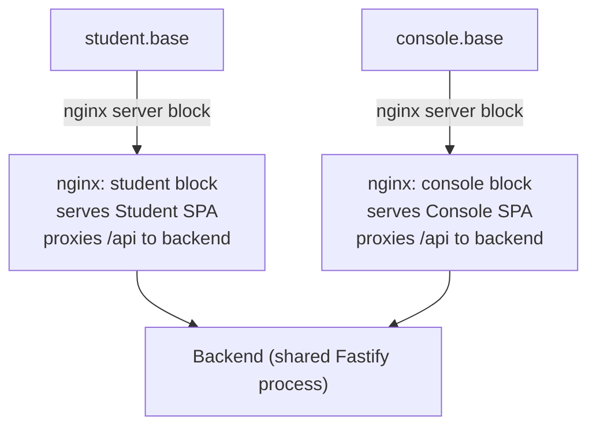
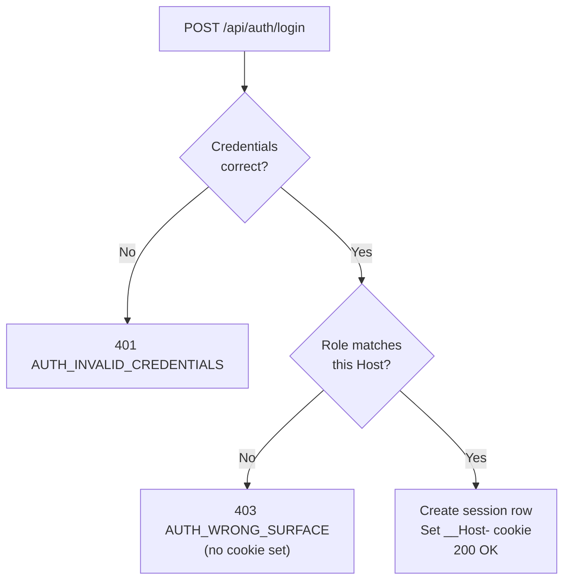

Stemolly dùng một auth model (mô hình xác thực) được chủ ý giữ đơn giản: đăng nhập email+mật khẩu chỉ qua lời mời, session (phiên đăng nhập) ở phía máy chủ, và ba role (vai trò) cố định. Mọi phần của thiết kế — tách subdomain (miền con), tiền tố cookie, login theo surface (bề mặt ứng dụng), namespace (không gian tên) public được CI kiểm tra — đều nhằm bảo đảm một số rất ít thuộc tính bảo mật bằng chính cấu trúc hệ thống, thay vì trông chờ vào quy ước.

## Ba role, không có tự đăng ký

Không có đăng ký công khai. Một Admin tạo tài khoản bằng cách gửi lời mời tới một địa chỉ email cụ thể và gán một trong ba role:

| Role | Có thể truy cập gì |
|---|---|
| **Admin** | Toàn quyền; quản lý người dùng |
| **Console** | Ứng dụng Console (soạn nội dung + quan sát) |
| **Student** | Chỉ ứng dụng Student |

Người được mời nhận liên kết, đặt mật khẩu, rồi được chuyển hướng đến ứng dụng mà role của họ được phép dùng. Đặt lại mật khẩu cũng đi theo đúng cách đó — Admin mời lại người dùng, hệ thống sẽ tạo một liên kết mới. Role được cố định ngay lúc gửi lời mời; không có UI đổi role trong ứng dụng.

Luồng này được chọn để giữ hệ thống đơn giản và tránh đưa dữ liệu có liên quan tới trẻ vị thành niên cho một auth provider (nhà cung cấp xác thực) bên thứ ba như Auth0, Clerk hay Supabase. Nó cũng tránh được độ phức tạp của các quy trình xin đồng ý từ phụ huynh — với mô hình này chỉ cần một bước xác nhận nhẹ.

## Session phía máy chủ, không dùng JWT

Session là các dòng dữ liệu trong Postgres. Trình duyệt chỉ giữ một cookie `httpOnly + Secure + SameSite` tham chiếu tới dòng đó. JWT bị loại bỏ có chủ đích.

Lý do là: token phi trạng thái giải quyết một bài toán mở rộng ngang mà Stemolly không có, nhưng đổi lại bạn mất khả năng thu hồi ngay lập tức. Với session trong Postgres, đăng xuất (hoặc mời lại để đặt lại mật khẩu) sẽ làm session mất hiệu lực ngay. Kiến trúc SPA cùng nguồn gốc khiến cookie trở thành lựa chọn tự nhiên, và `SameSite` xử lý CSRF mà không cần thêm token nào khác.

Authorization (phân quyền) chỉ là một enum role duy nhất được middleware (lớp chặn trung gian) kiểm tra ở cấp namespace — không có bảng permission, không có framework RBAC. Ba role cố định không cần đến mức đó.

## Cô lập subdomain và tiền tố cookie `__Host-`

Ứng dụng Student và Console chạy trên các subdomain riêng: `student.<base>` và `console.<base>`. Trong môi trường phát triển, `<base>` là `localhost`; trên production, đó là tên miền thật. Chỉ có đúng một biến môi trường khác nhau giữa các môi trường.

Điều này quan trọng vì cách trình duyệt xử lý cookie. **Cookie được ràng buộc theo host và path, không bao giờ theo port.** Một cookie được đặt trên `localhost:7777` sẽ được gửi sang `localhost:7778` — điều này đã được xác minh bằng một thử nghiệm Playwright trên Chromium và Firefox. Tách theo port trông có vẻ an toàn trong code nhưng thực tế lại âm thầm thất bại.

Tách theo hostname mới thật sự cô lập được kho cookie. Session cookie dùng tiền tố `__Host-`, và trình duyệt sẽ cưỡng chế các quy tắc sau: không bao giờ có thuộc tính `Domain=`, luôn `Secure`, luôn `Path=/`. Nghĩa là cookie được đặt trên `console.<base>` sẽ không bao giờ được gửi sang `student.<base>` — không phải do thói quen lập trình, mà do chính hành vi của trình duyệt, kể cả khi sau này ai đó lỡ thêm `Domain=`.

```
student.example.com  ──┐
                        ├── nginx (two server blocks) ──→  shared backend
console.example.com  ──┘
```

Một instance nginx, hai server block, một tiến trình backend. Mỗi SPA gọi `/api` trên chính origin của mình nên không có CORS, và `SameSite` vẫn là đủ.

:::caution[Subdomain không phải là ranh giới bảo mật]
`student.example.com/api/console/*` đi tới cùng backend với `console.example.com/api/console/*`. Hostname chỉ mang lại cô lập cookie và tách biệt UI. Role guard ở backend mới là thứ thực sự chặn truy cập dữ liệu trái phép.
:::

## Đăng nhập theo surface

Chỉ tách origin thôi vẫn chưa đủ. Một học sinh nếu gõ URL của Console vẫn sẽ tới trang đăng nhập của nó — bạn không thể giấu một trang đăng nhập công khai khỏi người đã biết địa chỉ. Nếu bước login chỉ kiểm tra mật khẩu, thông tin hợp lệ của em đó sẽ tạo ra một session Console, rồi tải lên một shell đầy lỗi 403. Đó chính là "vùng 403" mà toàn bộ thiết kế này đang cố tránh.

Vì vậy login phải **nhận biết surface**. Máy chủ đọc header `Host`, bỏ phần port (để development và production hành xử giống hệt nhau), rồi suy ra yêu cầu đang đến từ surface nào. Nếu role của người dùng đã xác thực không thuộc surface đó, máy chủ trả về `403 AUTH_WRONG_SURFACE` và không đặt cookie. Nếu sai thông tin đăng nhập, hệ thống trả về `401 AUTH_INVALID_CREDENTIALS`.

`Host` là chìa khóa chứ không phải URL path, vì `Host` và nơi cookie được gửi tới đều bắt nguồn từ cùng một URL nên không thể mâu thuẫn nhau. Một client gọi endpoint đăng nhập của Student từ trang Console thì cookie vẫn sẽ được đặt trên host của Console.

Accept-invite chặn nốt cánh cửa còn lại ngay từ thiết kế: nó đặt mật khẩu rồi chuyển hướng tới trang login trên **đúng** host dành cho role đó. Bản thân nó hoàn toàn không tạo session. Trong toàn hệ thống chỉ có đúng một endpoint có thể tạo session, và endpoint đó sẽ từ chối nếu đang ở sai surface.

## Mã trạng thái HTTP trên các route được bảo vệ

`api-client` ở frontend dùng một quy tắc đơn giản: bất kỳ `401` nào nhận được ngoài `/api/auth/*` đều có nghĩa là không có session hoặc session đã hết hạn, và nó sẽ chuyển người dùng về trang login. Quy tắc này phải luôn nhất quán.

| Tình huống | Mã trạng thái |
|---|---|
| Không có session / session hết hạn | `401` |
| Session hợp lệ nhưng sai role cho namespace này | `403` |
| Đúng thông tin đăng nhập nhưng sai surface (khi login) | `403 AUTH_WRONG_SURFACE` |
| Sai thông tin đăng nhập (khi login) | `401 AUTH_INVALID_CREDENTIALS` |

Nếu một lần kiểm tra role trả về `401`, người dùng đã đăng nhập sẽ bị đưa về trang login trong một vòng lặp trông như lỗi session. Mã trạng thái của chính endpoint login được loại trừ có chủ đích khỏi quy tắc `401` của `api-client` — đừng áp cùng một trực giác cho cả hai đường đi.

## Allowlist của `/api/auth/*`

Ba namespace — `/api/student`, `/api/console`, `/api/admin` — được khóa theo role bằng middleware gắn ở phạm vi plugin. Bất kỳ route mới nào trong các namespace đó đều tự động được bảo vệ, không cần làm gì thêm cho từng route. Mặc định là fail-closed (đóng an toàn).

Login và accept-invite không thể nằm trong các namespace có khóa, nên chúng được đặt trong tiền tố thứ tư: `/api/auth/*`, nơi không có role guard. Điều này đảo ngược kiểu thất bại: trong namespace có khóa, quên guard sẽ lộ ra ngay dưới dạng 403; còn trong `/api/auth/*`, một route được thêm cẩu thả sẽ là public, chạy hoàn hảo, và không phát ra triệu chứng nào.

Namespace này cũng tự nhiên hút các route xử lý thông tin xác thực (password reset, email verification, MFA).

Biện pháp giảm thiểu là một kiểm tra CI khẳng định bảng route của `/api/auth/*` khớp với một allowlist (danh sách cho phép) tường minh. Bạn vẫn có thể thêm một route public, nhưng không thể thêm nhầm — việc sửa allowlist chính là cổng kiểm tra của con người, nơi ai đó buộc phải tự hỏi liệu route này có thực sự nên là public hay không.

## Guard fail-closed trước cả khi session tồn tại

Role guard cho ba namespace có khóa đã được gắn vào như một cấu trúc giữ chỗ *trước cả khi* tồn tại bất kỳ logic session nào. Ở thời điểm đó, guard luôn ném ra 403 cho mọi yêu cầu. Đây là quyết định có chủ đích.

Vì guard được gắn ở **plugin scope**, mọi route được thêm vào namespace sau đó đều mặc nhiên được bảo vệ mà tác giả không phải làm gì thêm — khóa nằm trên cả căn phòng, không phải từng cánh cửa. Nếu làm ngược lại — dựng các cổng chặn sau khi đã có route — thì về sau sẽ phải vá lại từng route, và trong quãng thời gian chờ đợi chúng đều không có bảo vệ.

Khi logic session thật được đưa vào, chỉ có phần thân hàm guard thay đổi. Các nơi đăng ký guard hoàn toàn không phải sửa.

## Bảo mật invite token

Hai thuộc tính ở đây được đảm bảo ngay từ cấu trúc, chứ không dựa vào các bước kiểm tra bên ngoài.

**Cưỡng chế một lần dùng là atomic (nguyên tử).** Bước redeem dùng đúng một câu lệnh `UPDATE … WHERE redeemed_at IS NULL AND expires_at > $now RETURNING *`. Cơ chế khóa theo dòng của Postgres khiến việc kiểm tra "chưa được dùng?" và việc ghi "đã dùng" trở thành một thao tác không thể tách rời. Nếu có hai lần redeem đồng thời, chỉ đúng một lần khớp với mệnh đề `WHERE` và trả về một dòng. Cách đọc-rồi-ghi sẽ để hở một cửa sổ mà cả hai phía đều thấy token chưa được dùng.

**Chỉ lưu hash của token.** Raw 256-bit token chỉ tồn tại trong liên kết gửi qua email. Một bản dump cơ sở dữ liệu sẽ không cho ra thứ gì có thể redeem được. Vì đầu vào là ngẫu nhiên entropy cao (không phải mật khẩu), dùng SHA-256 không salt là đúng — lập luận phải dùng slow hash cho mật khẩu không áp dụng ở đây.

### Dạng trả về của `redeemInvite`

Có một ràng buộc bảo mật không hiển nhiên với lời gọi `redeemInvite`: nó phải trả về cả `email` lẫn `role`, chứ không chỉ `role`.

Endpoint accept-invite phải đặt mật khẩu cho một tài khoản cụ thể. Nếu module chỉ trả về role, endpoint đó sẽ không có cách nào được máy chủ xác minh để biết *đang đặt mật khẩu cho ai*. Lối tắt dễ nghĩ tới — đọc email từ request body — sẽ dẫn tới chiếm quyền tài khoản: kẻ tấn công có một lời mời hợp lệ cho chính địa chỉ của mình chỉ cần gửi email của quản trị viên và đặt mật khẩu cho tài khoản đó.

Nguyên tắc tổng quát là: khi thiết kế một interface liên quan tới bảo mật, hãy suy ra dạng dữ liệu trả về từ nhu cầu để *caller* có thể hành động an toàn, chứ không phải từ mức tối thiểu mà phần triển khai hiện tại cần.

## Seed không bao giờ là migration

Một fixture được đặt trong migration sẽ đi tới mọi môi trường, bao gồm cả production. Ví dụ rủi ro cụ thể là một tài khoản admin demo với mật khẩu đã biết.

Dữ liệu seed được áp dụng bằng code ứng dụng có tính idempotent, chứ không phải bằng migration. Có hai loại seed và chúng khác nhau:

- **Fixture cho demo/dev** — có cổng cấu hình, bắt buộc không được xuất hiện trên production.
- **Nội dung sản phẩm** (curricula, briefs, catalogs) — độc lập với môi trường, bắt buộc phải tới production.

Một quy tắc kiểu "tắt mọi seed trên prod" sẽ sai với nhóm thứ hai. Quy tắc được kiểm tra theo hành vi: khi cờ demo không được bật, migrate + boot phải không để lại bất kỳ dòng fixture nào. Cách này bắt được cả fixture bị giấu trong migration vì migration vẫn chạy bất kể cờ đó.

**Mật khẩu** được băm bằng `argon2id`. Đây là thực hành tốt nhất hiện nay cho password hashing — chậm có chủ đích và có khả năng chống lại tấn công GPU cũng như side-channel.

**Session** là các dòng dữ liệu phía máy chủ trong Postgres. Trình duyệt nhận một cookie `httpOnly + Secure + SameSite` trỏ tới dòng session đó. Vì session nằm trên máy chủ, nó có thể bị thu hồi ngay lập tức — đăng xuất hoạt động đúng, và việc Admin mời lại người dùng cũng chính là đường đặt lại mật khẩu.

### Vì sao không dùng JWT?

JSON Web Tokens (JWT) là token phi trạng thái: máy chủ không lưu chúng, nên không có cách nào thu hồi trước khi hết hạn. Tính phi trạng thái giải quyết một bài toán mở rộng (khỏi cần kho session dùng chung giữa nhiều máy chủ), nhưng Stemolly không có bài toán đó. Cái giá phải trả — mất khả năng thu hồi — là không đáng.

### Vì sao không dùng auth provider bên thứ ba?

Auth0, Clerk, Supabase Auth và các dịch vụ tương tự sẽ thêm vào một phụ thuộc nhà cung cấp có xử lý dữ liệu cá nhân của trẻ vị thành niên. Luồng lời mời đủ đơn giản để tự xây trực tiếp, nên phụ thuộc đó đã bị loại bỏ.

### Vì sao không dùng framework RBAC?

Các framework "RBAC" (Role-Based Access Control — kiểm soát truy cập theo vai trò) được thiết kế cho rất nhiều role và permission chi tiết. Stemolly chỉ có đúng ba role cố định. Một bảng RBAC đầy đủ sẽ là độ phức tạp mang tính suy đoán cho thứ vốn chỉ cần một enum duy nhất.

---

## Ba Role, Cố Định Ngay Khi Mời

| Role | Truy cập gì |
|---|---|
| `admin` | Toàn quyền — quản lý người dùng và lời mời |
| `console` | Ứng dụng Console — sản phẩm dành cho giảng viên (gộp Author và Observer) |
| `student` | Chỉ ứng dụng Student |

Role được đặt khi Admin tạo lời mời. Không có UI đổi role trong ứng dụng. Nếu cần đổi role, Admin sẽ mời lại người dùng. Cách này giúp mô hình phân quyền dễ kiểm toán: chỉ cần đọc bản ghi lời mời là biết toàn bộ tài khoản đó có thể làm gì.

---

## Topology Subdomain: Vì Sao Port Là Chưa Đủ

Bản năng đầu tiên khi muốn tách hai ứng dụng trong môi trường phát triển là cho chúng chạy ở các port khác nhau — ví dụ `localhost:3000` cho Student và `localhost:4000` cho Console. Cách đó đã được thử rồi bị loại vì cách trình duyệt xử lý cookie.

**Cookie được ràng buộc theo hostname, không bao giờ theo port.** Đây là điều được quy định trong RFC 6265, không phải một sự tình cờ — đó là lựa chọn có chủ đích trong đặc tả cookie. Một cookie được đặt trên `localhost:7777` sẽ được gửi sang `localhost:7778`. Điều này đã được xác minh bằng một thử nghiệm Playwright trên cả Chromium lẫn Firefox. Hệ quả là: các port khác nhau không thể cô lập hai session cookie. Sự cô lập sẽ hoạt động trên production nhưng âm thầm hỏng trong development — chính là nơi một cơ chế bảo mật không được phép vỡ.

Các hostname khác nhau *thì* cô lập được kho cookie, kể cả các subdomain `*.localhost`. Đó là lý do Stemolly dùng subdomain.

### Topology



Một tiến trình nginx chạy hai server block — một cho mỗi hostname. Mỗi block phục vụ bundle tĩnh của ứng dụng tương ứng và proxy `/api` tới cùng một backend dùng chung. Cả hai ứng dụng cùng nằm dưới một biến môi trường `STEMOLLY_PUBLIC_BASE_DOMAIN`: `localhost` trong development, tên miền thật trên production. Giữa các môi trường chỉ thay đổi biến đó; không có nhánh code nào khác nhau.

Vì mỗi SPA gọi `/api` trên **chính** origin của mình nên không có request cross-origin. Cookie `SameSite` vẫn đủ để chống CSRF — không cần thêm CSRF token.

### Tiền tố cookie `__Host-`

Session cookie mang tiền tố `__Host-`. Đây là quy tắc do trình duyệt cưỡng chế: một cookie `__Host-` không được có thuộc tính `Domain`, nên nó bị ràng buộc đúng với hostname đã đặt ra nó. Nếu sau này có lỗi cấu hình thêm `Domain=.stemolly.com`, trình duyệt sẽ đơn giản từ chối. Thuộc tính "không bao giờ chia sẻ giữa các subdomain" là một bất biến do trình duyệt bảo vệ, chứ không phải quy ước mà ai đó có thể vô tình phá vỡ.

> **Quan trọng:** Subdomain không phải ranh giới bảo mật của dữ liệu. Một request tới `student.<base>/api/console/*` vẫn đi vào đúng backend đó và bị role guard từ chối — chứ không phải bị hostname chặn. Subdomain chỉ đem lại tách biệt UI và cô lập cookie; role guard mới là thứ thật sự bảo vệ dữ liệu.

---

## Đăng Nhập Nhận Biết Surface: Một Session, Một Host

Chỉ tách origin vẫn chưa đủ. Một học sinh gõ địa chỉ của Console vẫn sẽ đến được trang login của nó — bạn không thể giấu một trang login công khai khỏi người đã biết URL. Nếu login chỉ kiểm tra mật khẩu, thông tin hợp lệ của học sinh sẽ tạo ra một session Console, dẫn tới một shell mà mọi lệnh gọi dữ liệu đều trả về 403. Đó chính là "vùng 403" mà toàn bộ việc tách origin này được thiết kế để ngăn chặn.

Giải pháp là **surface-aware login**: endpoint login suy ra *surface* — ứng dụng nào đang được truy cập — từ header `Host` của request. Sau đó nó kiểm tra xem role của người dùng có thuộc về surface đó hay không.



Port được loại ra khỏi header `Host` trước khi kiểm tra, vì trong development có port còn production thì không — loại nó đi giúp logic giống hệt nhau ở cả hai môi trường.

**Vì sao dùng `Host` thay vì URL path?** Header `Host` và nơi đích đến của cookie đều được suy ra từ cùng một URL, nên chúng không thể mâu thuẫn nhau. Còn path thì client *tự chọn* được — nó có thể gọi endpoint login của Student từ một trang Console — nhưng cookie vẫn sẽ rơi vào host của Console.

**Accept-invite đóng nốt cánh cửa kia ngay từ thiết kế.** Endpoint accept-invite đặt mật khẩu rồi chuyển hướng người dùng tới trang login trên đúng host tương ứng với role của họ. Bản thân nó không tạo session. Vì vậy, trong hệ thống chỉ có đúng một endpoint có thể tạo session: endpoint login nhận biết surface. Bất biến này là thuộc tính của thiết kế, không phải một quy tắc mà hai endpoint đều phải nhớ làm theo.

---

## 401 và 403: Một Hợp Đồng Mà Frontend Phụ Thuộc

Trên mọi route có khóa role, `401` và `403` mang ý nghĩa tách bạch, nghiêm ngặt:

| Code | Ý nghĩa |
|---|---|
| `401` | Không có session hợp lệ — vắng mặt hoặc hết hạn. Cần đăng nhập lại. |
| `403` | Session hợp lệ nhưng sai role hoặc sai surface. Thử lại cũng không giúp gì. |

Đây không chỉ là quy ước. API client dùng một quy tắc chung: bất kỳ `401` nào nhận được ngoài `/api/auth/*` đều kích hoạt bộ xử lý hết hạn session và chuyển người dùng về trang login. Nếu một lỗi quyền hạn trả về `401`, SPA sẽ đẩy một người dùng đang đăng nhập sang trang login mà không giải thích gì — một vòng lặp khó hiểu trông như lỗi session.

Lưu ý rằng chính endpoint login lại dùng một hợp đồng khác (`401` cho thông tin đăng nhập sai và `403` cho trường hợp đúng thông tin nhưng sai surface). Đó là các phản hồi thuộc `/api/auth/*`, và `api-client` cố ý loại trừ tiền tố này khỏi quy tắc hết hạn session chung.

---

## Bài Toán Namespace Public

Login và accept-invite phải chạy trước khi bên gọi có bất kỳ session hay role nào. Chúng không thể nằm bên trong các namespace bị khóa theo role (`/api/student/*`, `/api/console/*`, `/api/admin/*`) nếu muốn giữ thuộc tính deny-by-default khiến các namespace đó dễ kiểm toán.

Thay vào đó, chúng nằm trong tiền tố thứ tư: `/api/auth/*`. Tiền tố này không có role guard — nó được chủ đích để public.

Vấn đề là điều này đảo ngược kiểu thất bại. Trong namespace có khóa, quên guard sẽ lộ rõ: route lập tức trả về 403. Còn trong `/api/auth/*`, không có guard nào để mà quên. Một route được thêm cẩu thả sẽ là public, chạy hoàn hảo, vượt qua test của nó, và không tạo ra bất kỳ triệu chứng nào.

Tên gọi này còn khiến rủi ro tăng lên: `/api/auth/*` tự nhiên thu hút các route xử lý thông tin xác thực — password reset, session check, email verification — vào đúng namespace không có khóa.

**Biện pháp giảm thiểu là allowlist được CI kiểm tra.** Một bước CI khẳng định bảng route thực tế của `/api/auth/*` khớp với danh sách tường minh các route đã được phê duyệt. Nếu thêm một route public mới mà không cập nhật allowlist, bản build sẽ thất bại. Allowlist không ngăn việc một route trở thành public, nhưng nó ngăn việc đó xảy ra *do vô tình*. Việc sửa allowlist chính là cổng kiểm tra của con người, nơi ai đó phải tự hỏi: "Route này có thực sự nên là public không?"

---

## Role Guard Fail-Closed

Ba namespace được phân theo role đã được tạo ra với role guard gắn sẵn **trước cả khi** tồn tại bất kỳ logic session nào trong codebase. Guard này (`roleGuard` trong `server/src/api/plugins/auth.ts`) ban đầu chỉ là một placeholder với phần thân luôn ném `403`.

Đây là lựa chọn có chủ đích. Có hai thuộc tính khiến cách làm này an toàn:

1. **Gắn ở plugin scope.** Hook được đăng ký trên plugin (`studentApp.addHook('onRequest', roleGuard)`), không phải trên từng route riêng lẻ. Cơ chế encapsulation của Fastify khiến mọi route được thêm vào namespace đó sau này đều tự động nằm trong phạm vi bảo vệ — khóa đặt trên cả căn phòng, không phải từng cánh cửa.
2. **Chữ ký export ổn định.** Khi logic session thật sự xuất hiện, chỉ phần thân hàm thay đổi. Không nơi nào đăng ký guard phải sửa lại.

Phương án ngược lại — đợi đến khi có session rồi mới tạo namespace — sẽ khiến mọi route được thêm trong giai đoạn đó mặc nhiên không được bảo vệ và buộc phải vá lại về sau. Dựng cổng chặn trước sẽ đảo chiều mặc định: mọi thứ đều bị từ chối cho đến khi có thứ gì đó được mở ra rõ ràng.

---

## Bảo Mật Invite Token

### Tính Một-Lần-Dùng Ở Mức Atomic

Một invite token chỉ có thể được redeem đúng một lần. Thuộc tính một-lần-dùng được cưỡng chế bằng một câu SQL atomic duy nhất, chứ không phải cặp thao tác đọc-rồi-ghi:

```sql
UPDATE identity.invite_tokens
SET    redeemed_at = $now
WHERE  token_hash  = $1
  AND  redeemed_at IS NULL
  AND  expires_at  > $now
RETURNING *
```

Postgres lấy khóa cấp dòng trong lúc quét cập nhật, khiến việc kiểm tra "chưa dùng và chưa hết hạn" cùng thao tác ghi trở thành một khối không thể tách rời. Nếu có hai lần redeem đồng thời, chỉ một lần khớp với mệnh đề `WHERE` và nhận được dòng dữ liệu; lần kia sẽ không nhận gì. Chuỗi đọc-rồi-ghi sẽ mở lại cửa sổ TOCTOU (Time-Of-Check to Time-Of-Use — tình huống tranh chấp khi trạng thái thay đổi giữa lúc đọc và lúc hành động).

### Chỉ Lưu Hash

Hệ thống chỉ lưu SHA-256 hash của token. Raw 256-bit token (32 byte ngẫu nhiên) chỉ tồn tại trong liên kết gửi qua email. Một bản dump cơ sở dữ liệu sẽ không để lộ ra thứ gì có thể redeem được.

Raw token là dữ liệu ngẫu nhiên entropy cao, không phải mật khẩu. Với mật khẩu, slow hashing như `argon2id` là bắt buộc vì không gian đầu vào nhỏ và dễ đoán. Nhưng với một token ngẫu nhiên 256 bit, không gian đầu vào lớn tới mức khổng lồ — dùng fast hash như SHA-256 là đúng ở đây, và phép so sánh không constant-time trên đường redeem cũng không thể bị khai thác ở mức entropy này.

### Rủi Ro Chiếm Quyền Tài Khoản (Và Cách Sửa)

Một phiên bản trước của hàm redeem lời mời chỉ trả về role của người dùng — nó bỏ mất địa chỉ email dù cùng truy vấn cơ sở dữ liệu đó đã lấy được email. Endpoint accept-invite cần biết *đang đặt mật khẩu cho ai*, và khi chỉ có role, lối tắt dễ thấy nhất là đọc email từ request body.

Đó chính là chiếm quyền tài khoản: kẻ tấn công cầm một lời mời hợp lệ cho địa chỉ của chính mình có thể gửi email của quản trị viên trong request body rồi đặt mật khẩu cho tài khoản đó.

Cách sửa là để hàm redeem trả về `{ email, role }`. Khi đó bên gọi có thể xác định tài khoản dựa trên email đã được máy chủ xác minh mà không cần tin vào bất kỳ dữ liệu nào từ client. Bài học là: khi thiết kế một interface liên quan tới bảo mật, hãy quyết định dạng dữ liệu trả về từ những gì *caller* cần để hành động an toàn — không phải từ mức tối thiểu mà tác vụ hiện tại đòi hỏi.

---

## Seed và Migration

Migration, theo thiết kế, chạy trong **mọi** môi trường. Nếu đặt dữ liệu fixture — chẳng hạn một tài khoản admin demo với mật khẩu đã biết — vào migration, nó sẽ tự động đi thẳng tới production. Đó là lý do seed không bao giờ là migration.

Thay vào đó, dữ liệu seed được áp dụng bằng code ứng dụng có tính idempotent, dựa trên một natural key có tính xác định. Chạy lại bao nhiêu lần cũng luôn là no-op.

Có hai nhóm dữ liệu seed khác nhau, và chúng khác nhau ở một điểm quan trọng:

| Type | Ví dụ | Bắt buộc có trên production? | Cổng cấu hình |
|---|---|---|---|
| Fixture dev/demo | Tài khoản admin demo | **Không** — bắt buộc vắng mặt | Cần cờ cấu hình |
| Nội dung sản phẩm | Curricula, briefs, catalogs | **Có** | Không có cổng |

Một quy tắc kiểu "tắt seed trên production" sẽ sai với nội dung sản phẩm vốn bắt buộc phải có ở đó. Điểm chung duy nhất của hai nhóm là tính idempotent và quy tắc "không nằm trong migration"; mọi thứ khác đều được quyết định theo từng nhóm.

Việc bảo đảm không có fixture demo trên production được kiểm tra theo hành vi: khi cờ demo không bật, migrate và boot phải không để lại bất kỳ dòng fixture nào. Cách này bắt được cả fixture bị giấu trong migration, vì migration vẫn chạy bất kể cờ đó.
