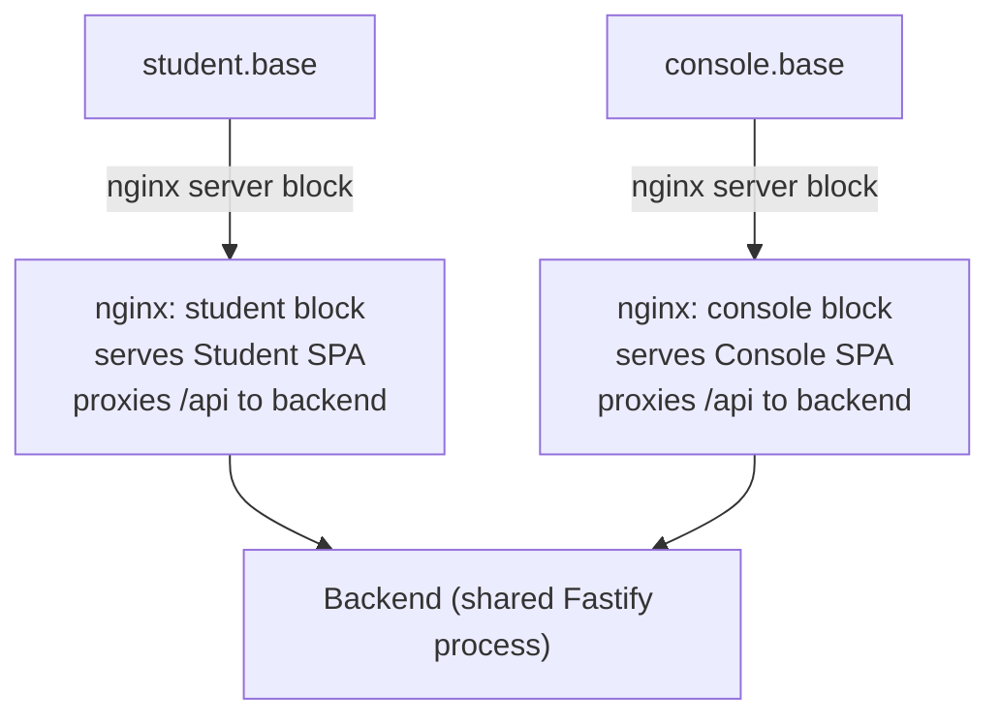
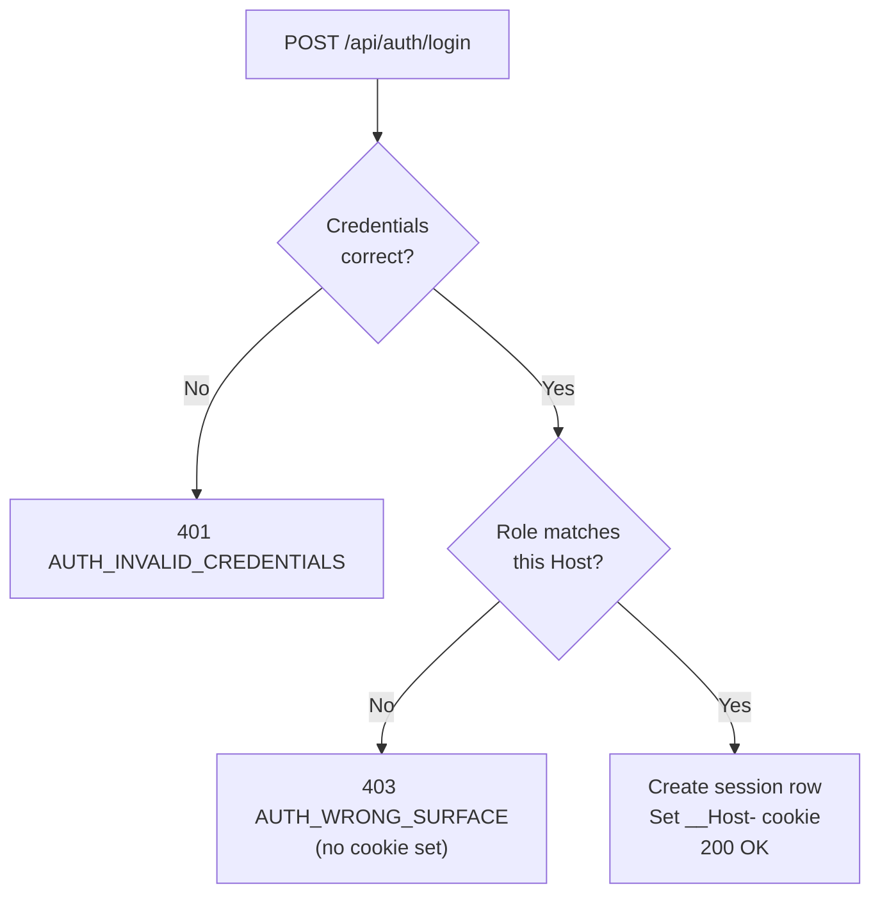

Mô hình bảo mật của Stemolly được cố ý giữ gọn: không đăng ký công khai, không nhà cung cấp auth (xác thực) bên thứ ba, không JWT. Mọi quyết định thiết kế đều xuất phát từ một ràng buộc: số lượng vai trò ít, cố định, và điểm vào chỉ qua lời mời. Mục tiêu là để mọi cơ chế đều có thể kiểm toán được chỉ bằng cách đọc một đoạn mã ngắn.

## Ai có thể đăng nhập, và bằng cách nào

Không có đăng ký công khai. Một Admin mời người dùng qua email và gán vai trò cho họ. Người được mời nhận một liên kết, đặt mật khẩu, rồi tài khoản của họ được kích hoạt trên ứng dụng mà vai trò đó mở ra. Đó là con đường duy nhất để tạo tài khoản.

**Passwords** được băm bằng `argon2id`. Đây là thực hành tốt nhất hiện nay cho password hashing (băm mật khẩu) — nó được thiết kế để chạy chậm và có khả năng chống lại tấn công GPU lẫn side-channel attacks (tấn công kênh kề).

**Sessions** là các bản ghi phía máy chủ trong Postgres. Trình duyệt nhận một cookie `httpOnly + Secure + SameSite` tham chiếu tới bản ghi session đó. Vì session nằm trên máy chủ nên có thể thu hồi ngay lập tức — logout hoạt động đúng, và việc Admin mời lại người dùng cũng chính là đường đặt lại mật khẩu.

### Vì sao không dùng JWT?

JSON Web Tokens (JWTs) là stateless (không lưu trạng thái): máy chủ không lưu chúng, nên không có cách nào thu hồi trước khi hết hạn. Tính stateless giải quyết một bài toán mở rộng quy mô (tránh phải có kho session dùng chung giữa nhiều máy chủ), nhưng Stemolly không gặp bài toán đó. Đánh đổi — mất khả năng thu hồi — là cái giá không đáng trả.

### Vì sao không dùng nhà cung cấp auth bên thứ ba?

Auth0, Clerk, Supabase Auth và các dịch vụ tương tự sẽ thêm một phụ thuộc vào nhà cung cấp để xử lý dữ liệu cá nhân của trẻ vị thành niên. Luồng lời mời đủ đơn giản để tự xây trực tiếp, nên phụ thuộc đó bị loại bỏ.

### Vì sao không dùng framework RBAC?

Các framework "RBAC" (Role-Based Access Control — kiểm soát truy cập theo vai trò) được thiết kế cho nhiều vai trò và quyền hạn chi tiết. Stemolly chỉ có đúng ba vai trò cố định. Một bảng RBAC đầy đủ sẽ là độ phức tạp mang tính suy đoán cho thứ vốn chỉ cần nằm trong một enum duy nhất.

---

## Ba vai trò, cố định ngay lúc mời

| Vai trò | Quyền truy cập |
|---|---|
| `admin` | Toàn quyền — quản lý người dùng và lời mời |
| `console` | Ứng dụng Console — sản phẩm dành cho giảng viên (gộp Author và Observer) |
| `student` | Chỉ ứng dụng Student |

Vai trò được đặt khi Admin tạo lời mời. Không có giao diện đổi vai trò trong ứng dụng. Nếu cần đổi vai trò, Admin sẽ mời lại người dùng. Cách này giữ cho mô hình phân quyền có thể kiểm toán được: chỉ cần đọc bản ghi lời mời là biết đầy đủ một tài khoản được làm gì.

---

## Topology subdomain: Vì sao chỉ tách bằng port là không đủ

Bản năng đầu tiên rất tự nhiên khi muốn tách hai ứng dụng trong môi trường phát triển là chạy chúng trên các port khác nhau — ví dụ `localhost:3000` cho ứng dụng Student và `localhost:4000` cho Console. Cách đó đã được thử rồi bị loại bỏ vì cách trình duyệt xử lý cookie.

**Cookie được ràng buộc theo hostname, không bao giờ theo port.** Đây là điều được quy định trong RFC 6265 và không phải một quirk (hành vi lạ) — đó là lựa chọn có chủ ý trong đặc tả cookie. Một cookie được đặt trên `localhost:7777` sẽ được gửi tới `localhost:7778`. Điều này đã được xác minh bằng một Playwright spike (thử nghiệm nhanh với Playwright) trên cả Chromium lẫn Firefox. Hệ quả là: các port tách biệt không thể cô lập hai session cookie. Sự cô lập sẽ đúng trong production nhưng âm thầm hỏng trong development — đúng vào nơi tệ nhất để một cơ chế bảo mật bị vỡ.

Các hostname riêng biệt *thì* cô lập được từng cookie jar (kho cookie), kể cả các subdomain `*.localhost`. Vì thế Stemolly dùng subdomain.

### Topology



Một tiến trình nginx chạy hai server block — một cho mỗi hostname. Mỗi block phục vụ static bundle của ứng dụng đó và proxy `/api` về cùng một backend dùng chung. Cả hai ứng dụng cùng nằm dưới một biến môi trường `STEMOLLY_PUBLIC_BASE_DOMAIN`: `localhost` trong development, tên miền thật trong production. Chỉ biến đó thay đổi giữa các môi trường; không có luồng mã nào khác đi.

Vì mỗi SPA gọi `/api` trên **chính** origin của nó nên không có yêu cầu cross-origin (khác nguồn). Cookie `SameSite` vẫn đủ để chống CSRF — không cần thêm CSRF token.

### Tiền tố cookie `__Host-`

Session cookie mang tiền tố `__Host-`. Đây là một quy tắc do trình duyệt cưỡng chế: cookie `__Host-` không được có thuộc tính `Domain`, nên nó bị buộc chặt vào đúng hostname đã đặt nó. Một lỗi cấu hình về sau kiểu thêm `Domain=.stemolly.com` sẽ đơn giản bị trình duyệt từ chối. Tính chất "không bao giờ chia sẻ qua các subdomain" là một bất biến do trình duyệt đảm bảo, không phải một quy ước mà ai đó có thể vô tình phá vỡ.

> **Quan trọng:** Subdomain không phải ranh giới bảo mật cho dữ liệu. Một yêu cầu tới `student.<base>/api/console/*` vẫn chạm đúng cùng backend đó và bị từ chối bởi role guard (chốt chặn vai trò) — không phải bởi hostname. Subdomain đem lại sự tách biệt giao diện và cô lập cookie; thứ thực sự bảo vệ dữ liệu là role guard.

---

## Đăng nhập theo surface: một session, một host

Chỉ tách origin thôi vẫn chưa đủ. Một học sinh gõ địa chỉ của Console vẫn sẽ đến được trang đăng nhập của nó — không thể giấu một trang đăng nhập công khai khỏi người biết URL của nó. Nếu đăng nhập chỉ kiểm tra mật khẩu thì thông tin hợp lệ của học sinh vẫn sẽ tạo ra một Console session, dẫn đến một cái vỏ giao diện mà mọi lời gọi dữ liệu đều trả về 403. Đó chính là "403 zone" mà việc tách origin từ đầu được tạo ra để tránh.

Giải pháp là **surface-aware login** (đăng nhập nhận biết surface): endpoint đăng nhập suy ra *surface* — tức ứng dụng nào đang được truy cập — từ `Host` header của yêu cầu. Sau đó nó kiểm tra xem vai trò của người dùng có thuộc về surface đó hay không.



Port sẽ bị bỏ khỏi `Host` header trước khi kiểm tra, vì development có port còn production thì không — bỏ nó đi giúp logic giống hệt giữa hai môi trường.

**Vì sao dùng `Host` chứ không dùng URL path?** `Host` header và đích đến của cookie đều cùng được suy ra từ một URL, nên chúng không thể mâu thuẫn nhau. Còn path thì client có thể tự do chọn — nó có thể gọi endpoint đăng nhập của student từ một trang Console — nhưng cookie vẫn sẽ rơi vào host của Console.

**Accept-invite cũng khép nốt cánh cửa còn lại ngay từ thiết kế.** Endpoint accept-invite đặt mật khẩu xong rồi chuyển hướng người dùng tới trang đăng nhập trên đúng host ứng với vai trò của họ. Nó không bao giờ tự tạo session. Vì vậy trong toàn hệ thống chỉ có đúng một endpoint có thể tạo session: endpoint đăng nhập nhận biết surface. Bất biến này là thuộc tính của thiết kế, chứ không phải quy tắc mà hai endpoint cùng phải nhớ tuân theo.

---

## 401 và 403: Một hợp đồng mà frontend dựa vào

Trên mọi route có chặn theo vai trò, `401` và `403` mang hai nghĩa khác nhau, chặt chẽ:

| Code | Ý nghĩa |
|---|---|
| `401` | Không có session hợp lệ — thiếu hoặc đã hết hạn. Hãy đăng nhập lại. |
| `403` | Có session hợp lệ nhưng sai vai trò hoặc sai surface. Thử lại cũng không giúp được gì. |

Đây không chỉ là quy ước. API client dùng một quy tắc tổng quát: bất kỳ `401` nào nhận được bên ngoài `/api/auth/*` đều kích hoạt trình xử lý hết hạn session và chuyển người dùng về trang đăng nhập. Nếu một lỗi phân quyền lại trả về `401`, SPA sẽ đá một người đang đăng nhập sang trang đăng nhập mà không có lời giải thích nào — một vòng lặp khó hiểu trông như lỗi session.

Lưu ý rằng chính endpoint đăng nhập lại dùng một hợp đồng khác (`401` cho thông tin đăng nhập sai và `403` cho thông tin đúng nhưng sai surface). Đó là các phản hồi thuộc `/api/auth/*`, và `api-client` cố ý miễn trừ tiền tố này khỏi quy tắc tổng quát về hết hạn session.

---

## Bài toán namespace công khai

Login và accept-invite phải chạy trước khi phía gọi có bất kỳ session hay vai trò nào. Chúng không thể nằm trong các namespace có chặn theo vai trò (`/api/student/*`, `/api/console/*`, `/api/admin/*`) mà không phá vỡ tính chất mặc định từ chối vốn khiến các namespace đó dễ kiểm toán.

Vì vậy chúng nằm trong tiền tố thứ tư: `/api/auth/*`. Tiền tố này không có role guard — nó được cố ý để ở trạng thái công khai.

Vấn đề là điều này đảo ngược kiểu thất bại. Trong một namespace có chặn, quên gắn guard sẽ lộ ngay: route lập tức trả về 403. Còn trong `/api/auth/*` thì không có guard để mà quên. Một route được thêm vào cẩu thả sẽ công khai, chạy hoàn hảo, vượt qua kiểm thử và không tạo ra triệu chứng nào.

Cái tên còn làm vấn đề nặng hơn: `/api/auth/*` tự nhiên hút các route xử lý thông tin xác thực — đặt lại mật khẩu, kiểm tra session, xác minh email — vào đúng namespace duy nhất không có khóa.

**Cách giảm thiểu là allowlist (danh sách cho phép) được kiểm tra trong CI.** Một bước CI sẽ khẳng định bảng route thực tế của `/api/auth/*` khớp với một danh sách tường minh các route đã được phê duyệt. Thêm một route công khai mới mà không cập nhật allowlist sẽ làm build thất bại. Allowlist không ngăn việc một route bị công khai hóa, nhưng nó ngăn điều đó xảy ra *vô tình*. Chỉnh sửa allowlist là cổng chặn bằng con người, nơi ai đó phải hỏi: "Route này có thực sự nên công khai không?"

---

## Role guard đóng theo mặc định

Ba namespace theo vai trò được tạo ra với role guard đã được gắn sẵn **trước cả khi** bất kỳ logic session nào tồn tại trong codebase. Guard đó (`roleGuard` trong `server/src/api/plugins/auth.ts`) ban đầu chỉ là một placeholder (chỗ giữ chỗ) với phần thân luôn ném `403`.

Đây là chủ ý. Có hai thuộc tính khiến cách xây này an toàn:

1. **Gắn ở phạm vi plugin.** Hook được đăng ký trên plugin (`studentApp.addHook('onRequest', roleGuard)`), không phải trên từng route riêng lẻ. Cơ chế encapsulation (đóng gói phạm vi) của Fastify khiến mọi route được thêm vào namespace đó về sau đều tự động được bao phủ — khóa nằm ở cả căn phòng, không phải ở từng cánh cửa.
2. **Chữ ký xuất ra ổn định.** Khi logic session thật sự xuất hiện, chỉ phần thân hàm thay đổi. Không cần đụng tới bất kỳ chỗ gọi đăng ký nào.

Phương án ngược lại — đợi đến khi có session rồi mới tạo các namespace — sẽ khiến mọi route được thêm trong thời gian đó mặc định là không được bảo vệ và sau này phải vá lại. Xây cổng chặn trước sẽ đảo chiều mặc định: mọi thứ đều bị từ chối cho tới khi có thứ gì đó chủ động mở ra.

---

## Bảo mật invite token

### Dùng một lần theo cách nguyên tử

Một invite token chỉ có thể được đổi đúng một lần. Tính một-lần được thực thi bằng một câu lệnh SQL nguyên tử duy nhất, chứ không phải cặp đọc-rồi-ghi:

```sql
UPDATE identity.invite_tokens
SET    redeemed_at = $now
WHERE  token_hash  = $1
  AND  redeemed_at IS NULL
  AND  expires_at  > $now
RETURNING *
```

Postgres lấy row-level lock (khóa cấp dòng) trong lúc quét cập nhật, khiến việc kiểm tra "chưa dùng và chưa hết hạn" cùng thao tác ghi trở thành không thể tách rời. Trong hai lần đổi đồng thời, đúng một lần khớp với mệnh đề `WHERE` và lấy được dòng; lần còn lại không nhận được gì. Một chuỗi đọc-rồi-ghi sẽ mở lại cửa sổ TOCTOU (Time-Of-Check to Time-Of-Use — tình huống tranh chấp khi trạng thái thay đổi giữa lúc đọc và lúc hành động).

### Chỉ lưu bản băm

Chỉ có bản băm SHA-256 của token được lưu. Token thô 256 bit (32 byte ngẫu nhiên) chỉ tồn tại trong liên kết gửi qua email. Một bản dump cơ sở dữ liệu sẽ không cho ra thứ gì có thể đem đi đổi.

Token thô là giá trị ngẫu nhiên entropy cao, không phải mật khẩu. Với mật khẩu, slow hashing (băm chậm) như argon2id là cần thiết vì không gian đầu vào nhỏ và dễ đoán. Còn với token ngẫu nhiên 256 bit, không gian đầu vào lớn đến mức khổng lồ — dùng fast hash (băm nhanh) như SHA-256 là đúng trong trường hợp này, và việc so sánh không constant-time (thời gian hằng) trên đường đổi token cũng tương tự, không thể khai thác được ở mức entropy này.

### Rủi ro chiếm đoạt tài khoản (và cách sửa)

Một phiên bản trước của hàm đổi invite chỉ trả về vai trò của người dùng — nó bỏ đi địa chỉ email mà chính truy vấn cơ sở dữ liệu đó vừa lấy được. Endpoint accept-invite cần biết *đặt mật khẩu cho ai*, và khi chỉ có vai trò thì lối tắt hiển nhiên là đọc email từ request body.

Đó là account takeover (chiếm đoạt tài khoản): kẻ tấn công có invite hợp lệ cho chính địa chỉ của mình có thể gửi email của một quản trị viên trong request body rồi đặt mật khẩu cho tài khoản đó.

Cách sửa là để hàm đổi trả về `{ email, role }`. Khi đó phía gọi có thể xác định tài khoản dựa trên email đã được máy chủ xác minh, thay vì tin vào bất kỳ đầu vào nào từ client. Bài học ở đây là: khi đặc tả một giao diện liên quan đến bảo mật, hãy suy ra hình dạng giá trị trả về từ những gì *phía gọi* cần để hành động an toàn — chứ không phải từ mức tối thiểu mà tác vụ hiện tại cần.

---

## Seeding và migrations

Một migration chạy trong **mọi** môi trường theo thiết kế. Nếu đặt fixture data (dữ liệu mẫu cố định) — chẳng hạn một tài khoản admin demo với mật khẩu đã biết — vào migration, thì nó sẽ tự động đi vào production. Vì vậy seed không bao giờ là migration.

Thay vào đó, seed data được áp dụng bằng mã ứng dụng có tính idempotent (chạy lặp vẫn không đổi kết quả) dựa trên một natural key (khóa tự nhiên) có tính xác định. Chạy lại luôn là một no-op.

Có hai nhóm seed data khác nhau, và chúng khác nhau ở một điểm quan trọng:

| Loại | Ví dụ | Có phải lên production không? | Cổng cấu hình |
|---|---|---|---|
| Fixture cho dev/demo | Tài khoản admin demo | **Không** — bắt buộc không được có | Phải có cờ cấu hình |
| Nội dung sản phẩm | Giáo trình, brief, catalog | **Có** | Không có cổng |

Một quy tắc kiểu "tắt seed trong production" duy nhất sẽ là sai đối với nội dung sản phẩm vốn cần có ở đó. Hai nhóm này chỉ dùng chung tính idempotent và quy tắc "không nằm trong migration"; mọi thứ còn lại đều được quyết định theo từng nhóm.

Việc production không có fixture demo được kiểm tra ở cấp hành vi: khi cờ demo không được bật, thao tác migrate và khởi động hệ thống không được để lại bất kỳ dòng fixture nào. Cách này bắt được cả những fixture bị giấu trong migration vì migration luôn chạy bất kể cờ đó ra sao.
