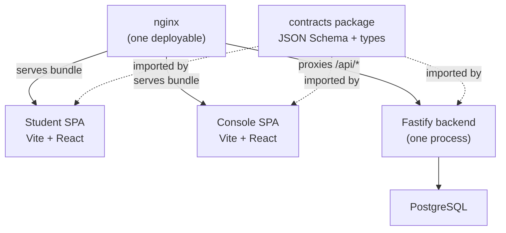
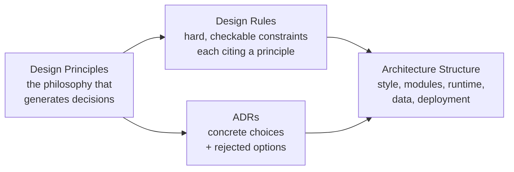
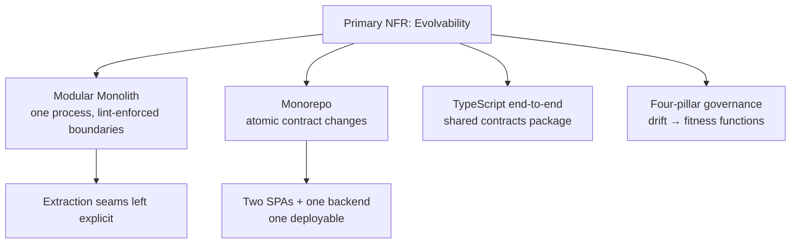

Kiến trúc của Stemolly được xây dựng xoay quanh một mục tiêu cốt lõi: **duy trì chi phí thay đổi ở mức thấp**. MVP-1 là một công cụ kiểm chứng — nó tồn tại để thử nghiệm belief-graph engine (bộ máy đồ thị niềm tin) với người học thực tế, và nhóm nên mặc định rằng mình sẽ sai ở một số chi tiết và sẽ phải điều chỉnh lại dựa trên những gì khám phá được. Mọi thứ trong tài liệu này — từ cách tổ chức monorepo (kho mã đơn), backend chạy trong một tiến trình, lựa chọn ngôn ngữ cho đến mô hình quản trị — đều bắt nguồn từ yêu cầu duy nhất đó.

---

## Khả năng tiến hóa là NFR chính

Non-functional requirement (NFR) (yêu cầu phi chức năng) là những phẩm chất hệ thống bắt buộc phải có ngoài chuyện “tính năng có chạy hay không” — chẳng hạn như tốc độ, bảo mật hoặc khả năng bảo trì. Với Stemolly, NFR quan trọng nhất là **evolvability (khả năng tiến hóa)**: kiến trúc phải rẻ để mở rộng (thêm môn học, chế độ, phương pháp sư phạm) và cũng rẻ để xoay trục khi đang trong giai đoạn kiểm chứng.

Điều này chi phối các quyết định một cách rất cụ thể:

- **engine core** (lõi công cụ) phải giữ nguyên khi phương pháp sư phạm hoặc môn học thay đổi.
- **Pedagogy** (chiến lược sư phạm) phải là chiến lược có thể cắm vào theo từng phiên, không được đóng cứng vào hệ thống.
- **Node identity** (định danh nút) và **graph structure** (cấu trúc đồ thị) phải được chọn sao cho có thể gắn thêm môn học và chương trình học mới mà không cần xây dựng lại.

Tech stack (ngăn xếp công nghệ) không phải là yêu cầu sản phẩm — đó là quyết định kiến trúc, được đưa ra ở đúng cấp độ và với lý do rõ ràng; phần còn lại của trang này sẽ giải thích điều đó.

---

## Nền tảng bạn đang xây trên đó: một monorepo, một deployable

Dự án nằm trong một **pnpm workspace monorepo** và được phát hành như một **deployable** (đơn vị triển khai) duy nhất. Ở thời điểm chạy thực tế, nó trông như sau:

Có **hai SPA** vì ứng dụng Student và Console phục vụ hai nhóm người dùng khác nhau — học viên và đội ngũ nội bộ. Đó là khác biệt ở phía frontend. Còn backend được dùng chung vì domain (miền nghiệp vụ) là dùng chung: Console biên soạn brief mà các phiên Student sẽ tiêu thụ, còn các phiên lại ghi ra evidence (bằng chứng) để Console theo dõi.

Backend cung cấp một API duy nhất với bốn namespace:

| Namespace | Access |
|---|---|
| `/api/student/*` | Bị chặn theo vai trò, chỉ dành cho caller là học viên |
| `/api/console/*` | Bị chặn theo vai trò, chỉ dành cho người dùng console |
| `/api/admin/*` | Bị chặn theo vai trò, chỉ dành cho admin |
| `/api/auth/*` | Không chặn — các route đăng nhập và lời mời chạy trước khi người dùng có vai trò |

**Vì sao không tách thành hai backend hoặc hai deployable?** Cô lập blast radius (phạm vi ảnh hưởng khi sự cố xảy ra) chỉ thực sự có tác dụng nếu cả thông tin truy cập cơ sở dữ liệu cũng được tách. Ở quy mô MVP, bề mặt phơi ra ngoài vốn đã là phần có đặc quyền thấp nhất. Ranh giới để tách trong tương lai vẫn được giữ rõ ràng và có thể trích ra khi một ràng buộc đo được thực sự buộc phải làm — chẳng hạn xuất hiện người dùng Console bên ngoài, hoặc Student cho phép tự đăng ký.

**Vì sao không dùng nhiều repo?** Gói `contracts` dùng chung (JSON Schema cùng các kiểu TypeScript được sinh ra) được import bởi cả hai frontend và server. Monorepo giúp những thay đổi hợp đồng có tần suất cao này diễn ra theo cách atomic (nguyên tử), đồng thời được kiểm tra kiểu trên cả ba nơi tiêu thụ chỉ trong một commit.

---

## Một tiến trình, ranh giới nghiêm ngặt: modular monolith

Backend chạy trong một tiến trình của hệ điều hành. Nó không phải tập hợp các microservices. Nhưng nó cũng không phải một khối bùn lớn khó kiểm soát — đây là một **modular monolith** (khối nguyên khối mô-đun hóa): một tiến trình duy nhất chứa các mô-đun có ranh giới được công cụ thực thi.

Các mô-đun gồm: `engine`, `tutor`, `pedagogy`, `content`, `identity`, `llm`, `judge`, `authoring-ai`, `metering`, `jobs`, và `api`. Các quy tắc rất đơn giản:

- Mô-đun `engine` không import bất cứ thứ gì ở tầng trên.
- Không có import xuyên mô-đun theo kiểu deep import — các mô-đun giao tiếp thông qua những interface (giao diện) đã được định nghĩa.

Những quy tắc này được thực thi trong CI bằng `dependency-cruiser` và `eslint-boundaries`, chứ không trông chờ vào ý thức của từng người. Ngay từ sprint đầu tiên, lint phải có khả năng chặn CI; nếu không, sẽ không có gì ngăn được việc vi phạm ranh giới ở cấp độ kỹ thuật.

**Vì sao không dùng microservices?** Vì ở giai đoạn này, việc phân tán hệ thống đi ngược trực diện với NFR quan trọng nhất.

Có thể hình dung như sau: brief, evidence và report tương tác với nhau ở khắp nơi. Mỗi lần xoay trục đi qua ranh giới mô-đun — ví dụ chuyển một trường dữ liệu từ brief sang session — trong thế giới microservices sẽ biến thành thay đổi đa repo, đa lần triển khai và có version cho contract. Ở quy mô chỉ vài chục học viên, phần chi phí tăng thêm đó không mang lại lợi ích nào đo được, nhưng lại làm giảm đáng kể tính linh hoạt.

Các ranh giới để tách dịch vụ về sau vẫn được giữ minh bạch. Khi xuất hiện một ràng buộc đo được — về quy mô, cô lập hay cấu trúc đội ngũ — một mô-đun có thể được nâng thành service. Còn trước thời điểm đó, hãy giữ chúng trong một tiến trình.

---

## Tech stack: TypeScript xuyên suốt

Mọi lớp của hệ thống đều dùng TypeScript. Đây không phải lựa chọn mặc định — mà là một quyết định có chủ đích vì một lý do rất cụ thể: gói `contracts` nằm đúng ở ranh giới giữa frontend và backend. Dùng chung một ngôn ngữ đồng nghĩa lỗi kiểu ở bất kỳ đâu trên ranh giới đó sẽ làm hỏng cùng một bản build, thay vì chỉ bị phát hiện muộn trong bài kiểm thử tích hợp xuyên ngôn ngữ.

| Layer | Technology |
|---|---|
| Student SPA | Vite + React + TypeScript |
| Console SPA | Vite + React + TypeScript |
| Backend | Fastify + TypeScript |
| Shared contracts | JSON Schema + generated types |
| Database | PostgreSQL (thin SQL layer) |
| Monorepo tooling | pnpm workspaces |

**Vì sao là Fastify chứ không phải Express?** Fastify hỗ trợ sẵn việc kiểm tra JSON Schema theo từng route — đúng với chiến lược contracts mà thiết kế này yêu cầu. Các plugin được đóng gói và gắn theo tiền tố route của nó ánh xạ trực tiếp sang các namespace API bị chặn theo vai trò. Đây là một router tường minh, không có “phép thuật” meta-framework, chính xác là thứ bạn cần khi muốn luồng điều khiển luôn dễ đoán.

**Vì sao không dùng Next.js hoặc Remix?** Cả hai đều che giấu luồng điều khiển và cung cấp SSR, trong khi SSR không mang lại lợi ích gì cho hai SPA bị chặn sau lớp xác thực. Sự mờ đục ở đây là chi phí, không phải tính năng.

**Vì sao không dùng backend Python?** Việc sử dụng LLM trong Stemolly là orchestration (điều phối) qua API, chứ không phải suy luận mô hình cục bộ. Một backend Python sẽ khiến dự án phải tách ngôn ngữ ngay tại ranh giới có mức biến động cao nhất — gói `contracts` — mà không đem lại lợi ích nào về runtime.

**Vì sao không có ORM nặng?** Các bảng append-only (chỉ cho phép thêm) dùng database trigger, và một số truy vấn dùng recursive CTE (biểu thức bảng chung đệ quy). Cả hai đều cần được thể hiện dưới dạng SQL dễ đọc. Một lớp ORM nặng sẽ làm che khuất điều đó.

---

## Giữ cho kiến trúc đi đúng hướng: mô hình quản trị bốn trụ cột

Ý định tốt rất dễ trôi lệch theo thời gian. Mô hình quản trị tồn tại để bảo đảm NFR về evolvability tiếp tục đúng trong quá trình triển khai, chứ không chỉ đúng trên bản thiết kế.

Kiến trúc được mô tả và thực thi thông qua bốn trụ cột:

**ADR** (Architecture Decision Record, bản ghi quyết định kiến trúc) lưu lại các lựa chọn cụ thể cùng những phương án đã bị loại bỏ — bao gồm cả lý do vì sao loại bỏ chúng. Mỗi khi thêm mô-đun, datastore, dịch vụ bên ngoài hoặc ranh giới tiến trình, đều phải có ADR mới.

**Design principles** (nguyên tắc thiết kế) là triết lý sinh ra các quyết định. Chúng không phải là rule — chúng là phần “vì sao” đứng sau các rule.

**Design rules** (quy tắc thiết kế) là các ràng buộc cứng có thể kiểm tra được. Mỗi rule phải chỉ ra principle mà nó đang thực thi. Rule nào không có cách kiểm tra thì không thực sự là rule.

**Architecture structure** (cấu trúc kiến trúc) mô tả phong cách, mô-đun, runtime, dữ liệu và triển khai — tức hình dạng của hệ thống tại từng thời điểm.

Sự trôi lệch được ngăn chặn bằng **fitness functions** (hàm kiểm định kiến trúc): các kiểm tra tự động được sắp từ mạnh đến yếu:

1. **Machine-in-CI** — lint phụ thuộc cho ranh giới mô-đun, danh sách cấm bằng grep để ngăn rò rỉ vendor hoặc domain.
2. **Runtime-enforced** — database trigger cho các bảng append-only, các khẳng định ở runtime trong cổng LLM.
3. **Human process** — rà soát ADR cho các thay đổi mang tính cấu trúc.

Mỗi design rule phải ánh xạ tới ít nhất một fitness function. Nếu bạn không thể tự động hóa việc kiểm tra, thì rule đó được xem là yếu hơn một rule có thể tự động hóa.

**Cross-cutting concerns** (mối quan tâm xuyên cắt) — auth, lỗi, logging, idempotency, config, resilience — được quyết định ngay ở pha kiến trúc (tức ranh giới và bất biến của chúng được cố định), rồi mới được điền chi tiết ở pha thiết kế. Nếu trì hoãn toàn bộ những thứ này, từng mô-đun sẽ tự chọn theo cách riêng, và đó là con đường dẫn tới năm kiểu định dạng lỗi không nhất quán.

---

## Hình dạng tổng quan

Mọi lựa chọn mang tính cấu trúc đều lần ngược về cùng một gốc: MVP-1 phải rẻ để thay đổi. Monolith giúp các lần xoay trục hôm nay diễn ra với chi phí thấp. Các seam (điểm ranh giới) được để lộ rõ để bạn có thể tách thành service khi một ràng buộc thực tế thật sự ép buộc. Việc dùng chung ngôn ngữ giúp ranh giới `contracts` an toàn về kiểu. Và mô hình quản trị giúp các ranh giới đó tiếp tục được giữ đúng khi codebase lớn dần.
