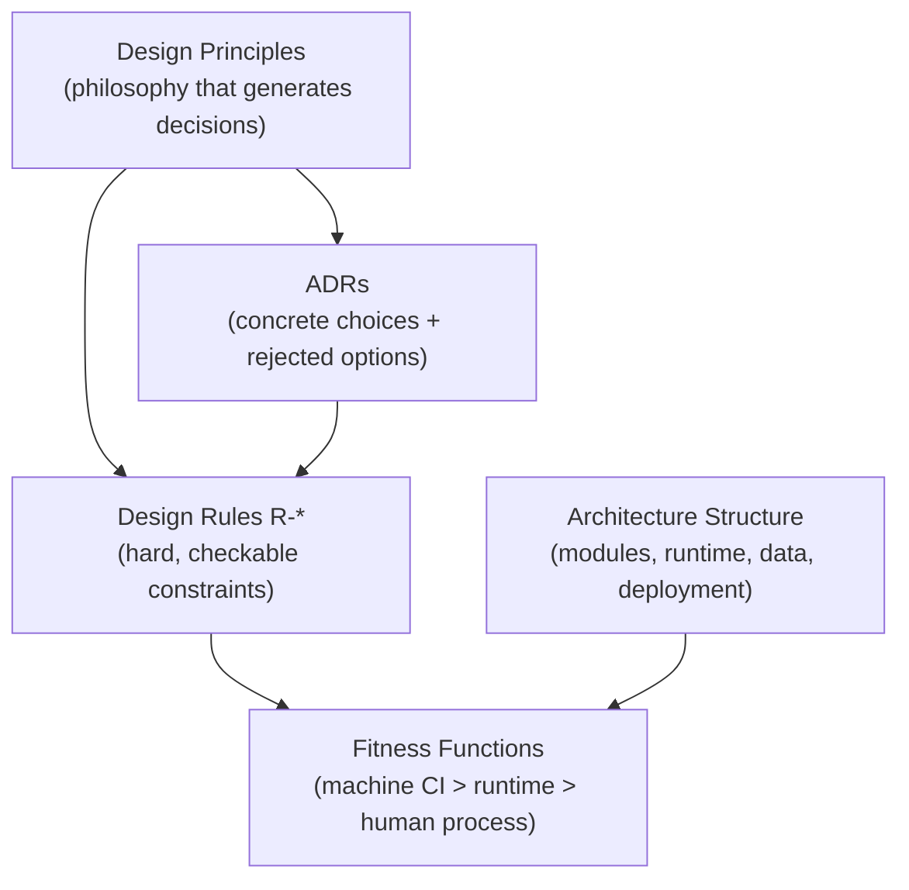
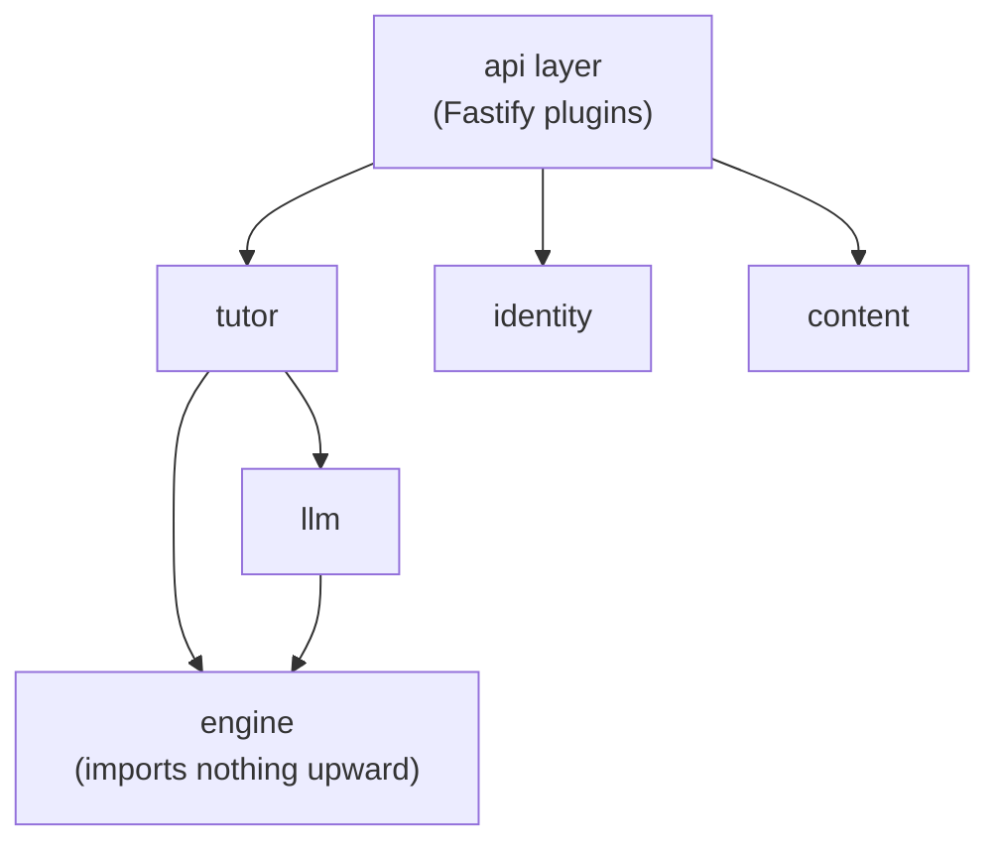
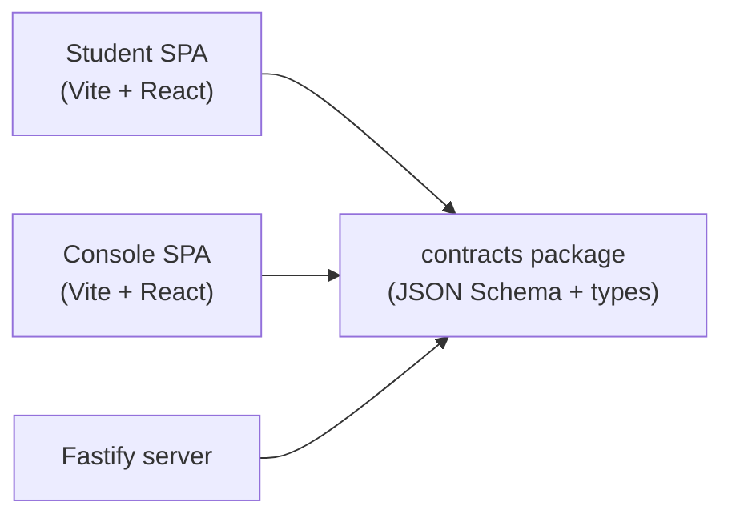
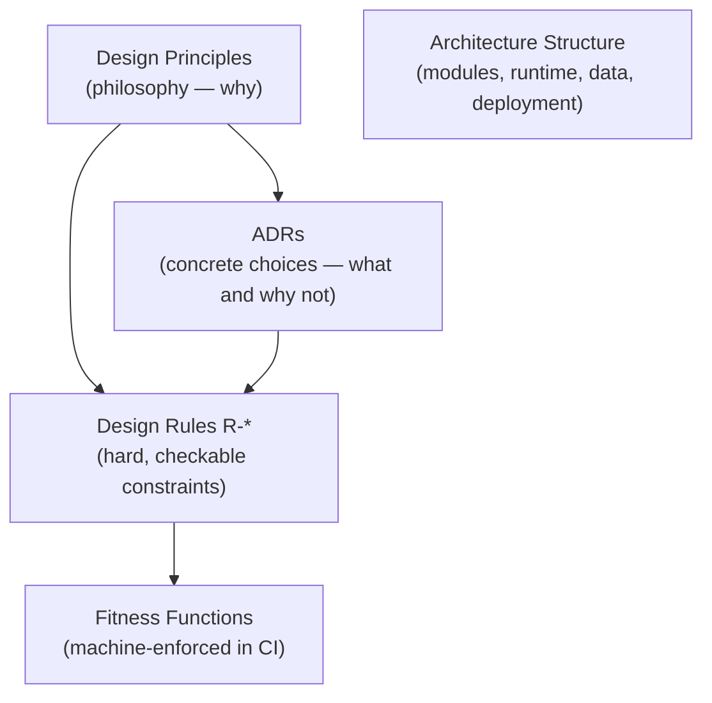

Stemolly được xây để có thể thay đổi với chi phí thấp. Ở giai đoạn đầu, đội ngũ phải có khả năng đi xuyên qua mọi đường ranh của hệ thống — briefs (đề bài), evidence (minh chứng), sessions (phiên làm việc), reports (báo cáo) — chỉ trong một thay đổi duy nhất. Năng lực đó — **evolvability** (khả năng tiến hóa) — là yêu cầu phi chức năng quan trọng nhất, và cũng là lăng kính dùng để đưa ra mọi quyết định cấu trúc lớn bên dưới.

## Một repo, một deployable, một backend

Sản phẩm có hai ứng dụng hướng tới người dùng: ứng dụng **Student** (dành cho học viên) và **Console** nội bộ. Sự tách biệt này chỉ tồn tại ở frontend. Backend được dùng chung vì domain cũng là dùng chung — tác giả trên Console xuất bản briefs để các sessions của Student sử dụng, và chính các sessions đó lại ghi evidence để Console quan sát về sau.

```
┌─────────────────────────────────────────────────────┐
│  monorepo (pnpm workspaces)                         │
│                                                     │
│  apps/student  apps/console  server/  packages/     │
│     Vite+React    Vite+React  Fastify   contracts   │
│        │              │          │          │       │
│        └──────────────┴──────────┴──────────┘       │
│                       │                             │
│              one deployable                         │
│   nginx (both SPA bundles) + server image + Postgres│
└─────────────────────────────────────────────────────┘
```

**Vì sao là một repo duy nhất?** Gói dùng chung `packages/contracts` (JSON Schema cùng các kiểu TypeScript được sinh tự động) được import bởi cả hai frontend *và* server. Nếu tách thành nhiều repo, mỗi lần thay đổi những contract có tần suất biến động cao này sẽ biến thành một bài toán phối hợp version giữa nhiều repo. Dùng monorepo (một kho mã nguồn chung) giữ cho các thay đổi đó mang tính nguyên tử và luôn được kiểm tra kiểu.

**Vì sao chỉ có một deployable?** Tách thành hai deployable (mỗi bên cho một nhóm người dùng) chỉ thực sự giảm blast radius nếu cả thông tin xác thực truy cập cơ sở dữ liệu cũng được tách riêng. Ở quy mô hiện tại, lợi ích đó mới chỉ là giả định; còn chi phí — mỗi lần xoay trục đi qua một seam lại thành thay đổi đa triển khai, có version contract — là có thật và đi ngược evolvability. Ranh giới giữa hai bề mặt logic vẫn được giữ rõ ràng như một extraction seam để sau này có thể tách ra khi các ràng buộc đã được đo đếm (quy mô, kích thước đội ngũ, hoặc khi Console có người dùng bên ngoài) khiến việc tách trở nên đáng giá.

:::note[Phạm vi của “một deployable”]
Quyết định này chỉ áp dụng cho topology web Student/Console. Các nhóm dịch vụ khác — ví dụ bề mặt MCP cho operator/student được thêm ở Sprint 13 (`mcp-operator`, `mcp-student`, `edge`, `migrator`) — vẫn có thể cùng nằm trong `docker-compose.yml` vì sự tiện lợi của monorepo mà không vi phạm quyết định này. Chúng là một deployable độc lập, chỉ tình cờ dùng chung Postgres; quy tắc về topology của web app chưa bao giờ được đặt ra để chi phối nhóm đó.
:::

## Backend: một modular monolith

Server là **một tiến trình duy nhất** với mười một mô-đun nội bộ được phân ranh giới chặt chẽ:

`engine` · `tutor` · `pedagogy` · `content` · `identity` · `llm` · `judge` · `authoring-ai` · `metering` · `jobs` · `api`

"Chặt chẽ" ở đây nghĩa là ranh giới được *cưỡng chế thực thi*, không chỉ mô tả trên giấy. Cấu hình `dependency-cruiser` / `eslint-boundaries` sẽ khiến mọi import xuyên mô-đun trái phép làm CI thất bại ngay từ sprint đầu tiên. Mô-đun `engine` không import gì từ các lớp ở trên; cũng không cho phép import sâu sang mô-đun khác.

Microservices và việc tách vật lý giữa content với student-state đều bị loại vì cùng một lý do như quyết định giữ một deployable: mỗi lần xoay trục chạm qua một đường ranh (briefs↔evidence↔reports tương tác ở khắp nơi) sẽ biến thành thay đổi đa repo, đa triển khai, có version contract. Việc phân tán *ngay bây giờ* đi ngược yêu cầu phi chức năng cốt lõi. Các điểm có thể tách dịch vụ vẫn được giữ lộ rõ để dùng về sau khi có ràng buộc đã được đo đếm buộc phải tách.

## Ngăn xếp công nghệ

Toàn bộ hệ thống dùng TypeScript từ đầu đến cuối. Tóm gọn trong một dòng:

> Hai SPA **Vite + React** → gói `contracts` dùng chung → backend **Fastify** → **PostgreSQL**

**Vì sao Fastify chứ không phải Express?** Khả năng xác thực JSON Schema theo từng route vốn có của Fastify khớp chính xác với chiến lược contracts — schema do gói `contracts` định nghĩa sẽ được cưỡng chế ở ranh giới HTTP mà không cần lớp nối bổ sung. Mô hình plugin đóng gói theo prefix của nó cũng ánh xạ trực tiếp với bốn namespace API bên dưới. Express từng là giả định ban đầu; Fastify được chọn khi mô hình contracts và plugin trở nên rõ ràng.

**Bốn namespace API:**

| Prefix | Truy cập |
|---|---|
| `/api/student/*` | Chặn theo vai trò, mặc định từ chối |
| `/api/console/*` | Chặn theo vai trò, mặc định từ chối |
| `/api/admin/*` | Chặn theo vai trò, mặc định từ chối |
| `/api/auth/*` | Cố ý không chặn — các route trước phiên làm việc (đăng nhập, chấp nhận lời mời) chạy trước khi người gọi có vai trò |

**Các phương án khác bị loại:**
- **Next.js / Remix** — luồng điều khiển bị che khuất; không có lợi ích SSR cho hai SPA đều nằm sau lớp xác thực.
- **Python / FastAPI backend** — làm tách ngôn ngữ tại đường ranh contracts có biến động cao; phần làm việc với LLM ở đây là điều phối API, không phải ML cục bộ.
- **ORM nặng** — bị loại để ưu tiên một lớp SQL mỏng, giúp các trigger append-only và recursive CTE vẫn dễ đọc.

## Quản trị bốn trụ cột

Kiến trúc tốt chỉ bền nếu cấu trúc của nó được duy trì một cách chủ động. Stemolly dùng bốn trụ cột:



- **Design Principles** — phần lý luận phải tạo ra được các quyết định nhất quán trên toàn bộ codebase.
- **ADRs** — các lựa chọn cụ thể, đi kèm những phương án đã bị loại và lý do loại bỏ. Mỗi lần thêm mô-đun, datastore, dịch vụ bên ngoài hoặc ranh giới tiến trình đều cần một ADR.
- **Design Rules (`R-*`)** — các ràng buộc cứng, có thể kiểm tra được. Mỗi rule đều dẫn chiếu tới một principle; mỗi rule đều có ít nhất một fitness function.
- **Fitness Functions** — các kiểm tra tự động, sắp theo thứ tự: máy trong CI trước, rồi đến cưỡng chế lúc runtime, cuối cùng mới là quy trình của con người. Ví dụ: `dependency-lint` cho ranh giới mô-đun, danh sách grep chặn vendor/domain leakage, trigger DB cho các bảng append-only, và các runtime assertion trong cổng LLM.

Các mối quan tâm cắt ngang (auth, errors, logging, idempotency, config, resilience) được chốt từ giai đoạn kiến trúc — xác định rõ đường ranh và bất biến — rồi mới bổ sung chi tiết ở giai đoạn thiết kế. Nếu trì hoãn hoàn toàn, từng mô-đun sẽ tự chọn theo cách riêng, và đó chính là điều tầng quản trị này được tạo ra để ngăn chặn.

## Vệ sinh ADR

Khung quản trị chỉ hoạt động khi chính các ADR cũng đáng tin cậy. Có ba quy tắc để giữ điều đó.

### Phạm vi phải bám theo ranh giới, không phải theo phương tiện truyền tải

ADR ràng buộc những công việc sống lâu hơn sprint đã viết ra nó. Nếu dòng `Scope` nêu tên một hiện vật tạm thời — file PoC, số sprint, hay một phương tiện truyền tải rồi sau này sẽ được thay thế — thì quyết định sẽ âm thầm bị thu hẹp hoặc mất hiệu lực khi hiện vật đó bị loại bỏ.

Cách viết đúng là: gọi tên *ranh giới* rồi liệt kê các carrier hiện tại của nó như những trường hợp cụ thể.

> ✗ "Các file tool MCP của PoC định nghĩa schema hướng về model của engine."  
> ✓ "Ranh giới hướng về model của mô-đun engine — hiện do bề mặt MCP của PoC mang, và sau này do lời gọi trong tiến trình `tutor`→`engine` đảm nhiệm."

Phép thử rất đơn giản: nếu một định danh có thể bị khai tử theo lịch, nó không được xuất hiện trong một tài liệu có tuổi thọ dài hơn chính cái lịch đó.

### ADR chứa vai trò; design rule chứa tên file

Phần thân của một ADR đã được chấp thuận là **bất biến** — khi quyết định thay đổi, phải viết một bản ghi mới để thay thế chứ không sửa trực tiếp. Vì thế, bất kỳ tên file nào xuất hiện trong phần Decision sẽ trở thành một cam kết vĩnh viễn: chỉ cần đổi tên file, ADR đã được chấp thuận lập tức trở thành sai sự thật. Cách sửa lại rất tốn kém (phải làm cả một supersession) cho một việc lẽ ra chỉ là đổi tên hai chiều.

Để tránh điều đó, cần chia lớp rõ ràng: **ADR nêu tên các vai trò và bất biến giữa chúng** ("the driving contract never imports the driven contracts"), còn **design rules (`R-*`) mới nêu tên các file** đang hiện thực những vai trò đó (`core/driving.ts`, `core/driven.ts`). Rules vốn là lớp được chỉnh sửa trong công việc thường nhật mà không đụng vào quyết định gốc.

### Với bản ghi đã chấp thuận thì dùng supersede; với bản nháp chưa commit nhưng có sai sự thật thì sửa tại chỗ

Khi câu chữ của một ADR đã được chấp thuận bị phát hiện là mở rộng quá đà so với chính lập luận của nó, người ta rất dễ muốn sửa ngay câu đang có vấn đề — nhất là khi số lượng trích dẫn khiến việc sửa trông có vẻ rẻ hơn. Chi phí đó là có thật, nhưng vẫn không quyết định được vấn đề: chênh lệch thực sự giữa sửa và supersede chỉ là thêm một file mới, còn lập luận kiểu "đó chỉ là lỗi soạn thảo" thì về sau sẽ luôn có thể bị dùng để công kích bất kỳ bản ghi nào, kể cả bởi một agent chạy không giám sát. Cách duy nhất để bảo vệ kho tư liệu là không dịch chuyển phần thân tài liệu.

Có một ngoại lệ. Một bản nháp *chưa được commit* và *chưa bị bất kỳ tài liệu nào trích dẫn* — được viết ngay trong cùng phiên làm việc — thì vẫn chỉ là bản nháp, chưa phải án lệ. Nếu phần `Evidence` của nó nêu ra một sự kiện có thể kiểm chứng và lại sai, việc supersede sẽ khiến thông tin sai đó tồn tại vĩnh viễn trong kho tư liệu. Trong trường hợp này, hãy sửa trực tiếp, nhưng phải công khai việc sửa, suy luận lại mọi quyết định từng dựa trên dữ kiện sai đó, và ghi lại cả phương án từng bị bác bỏ nhầm.

:::tip[Quy tắc ngón tay cái]
Committed and cited → supersede.  
Uncommitted draft with a false verified claim → correct in place and disclose.
:::

Stemolly được thiết kế để dễ thay đổi. Mục tiêu đó — gọi là *evolvability* — là yêu cầu phi chức năng quan trọng nhất, và nó chi phối mọi quyết định cấu trúc được mô tả trên trang này. Muốn hiểu vì sao kiến trúc có hình dạng như hiện tại, phải bắt đầu từ đó.

## Một Monorepo, Một Deployable

Dự án phục vụ hai nhóm người dùng: học viên và đội ngũ nội bộ (người dùng Console). Đây là hai web app riêng với giao diện riêng, nhưng dùng chung một domain — Console viết briefs để các student sessions tiêu thụ, còn sessions thì ghi evidence để Console theo dõi sau đó. Chỉ khi dữ liệu cũng tách riêng thì việc tách thành hai backend riêng mới hợp lý, nhưng ở đây không phải vậy.

Vì thế cấu trúc là:

```
monorepo
├── apps/student         ← Vite + React SPA
├── apps/console         ← Vite + React SPA
├── packages/contracts   ← shared JSON Schema + generated TypeScript types
└── server               ← one Fastify backend process
```

Cả ba hiện vật runtime — nginx, image của server và Postgres — được phát hành cùng nhau như **một deployable duy nhất**. Cách tổ chức nhiều repo đã bị loại vì gói `contracts` được import bởi cả hai frontend lẫn server; gom mọi thứ vào một repo giúp những thay đổi contract cắt ngang toàn hệ thống vẫn mang tính nguyên tử và được kiểm tra kiểu trong cùng một pull request.

Hai backend riêng (để cô lập blast radius) cũng từng được cân nhắc và vẫn được giữ như một extraction seam. Chúng sẽ đáng làm hơn khi Console có người dùng bên ngoài hoặc khi ứng dụng Student mở đăng ký tự phục vụ — nhưng ở quy mô hiện tại, việc tách ra sẽ không thật sự giảm rủi ro nếu vẫn dùng chung thông tin xác thực cơ sở dữ liệu, trong khi cái giá phải trả cho tính linh hoạt sẽ đến ngay lập tức.

## Backend: một Modular Monolith

Server là **một tiến trình duy nhất** gồm nhiều mô-đun với ranh giới nghiêm ngặt. Không có tách microservices, không có mạng giữa các mô-đun. Các mô-đun gồm:

`engine`, `tutor`, `pedagogy`, `content`, `identity`, `llm`, `judge`, `authoring-ai`, `metering`, `jobs`, `api`

Ranh giới được thực thi bằng **dependency lint** (`dependency-cruiser` + `eslint-boundaries`), chứ không dựa vào mạng. Mô-đun `engine` không import gì từ phía trên; không mô-đun nào được đâm sâu vào mô-đun khác. Kiểm tra lint này phải chặn CI ngay từ sprint đầu tiên — nếu có thể lách qua, toàn bộ mô hình sẽ sụp đổ.



Vì sao không dùng microservices? Các khái niệm cốt lõi của domain — briefs, evidence, reports — tương tác xuyên qua mọi mô-đun. Mỗi lần xoay trục đi qua một đường ranh sẽ biến thành thay đổi đa repo, đa triển khai, có version contract. Ở quy mô hiện tại, **phân tán hệ thống đi ngược mục tiêu evolvability cốt lõi.** Các đường ranh được cố ý giữ cho dễ nhìn thấy để về sau đội ngũ có thể tách dịch vụ khi một ràng buộc đã được đo đếm (lưu lượng, quy mô đội, nhu cầu cô lập) thật sự biện minh cho cái giá đó.

## Bề mặt API: bốn namespace

Backend duy nhất này công bố bốn namespace:

| Namespace | Ai có thể gọi | Có chặn không? |
|---|---|---|
| `/api/student/*` | Ứng dụng Student | ✅ theo vai trò, mặc định từ chối |
| `/api/console/*` | Ứng dụng Console | ✅ theo vai trò, mặc định từ chối |
| `/api/admin/*` | Quản trị viên nội bộ | ✅ theo vai trò, mặc định từ chối |
| `/api/auth/*` | Bất kỳ ai (trước phiên làm việc) | ❌ cố ý không chặn |

Namespace `/api/auth/*` không bị chặn vì các endpoint của nó — đăng nhập, chấp nhận lời mời — chạy trước khi người gọi có vai trò. Mọi namespace còn lại đều mặc định từ chối; yêu cầu với vai trò sai sẽ bị chặn ngay ở cấp prefix trước khi vào bất kỳ handler nào.

## Ngăn xếp: TypeScript từ đầu đến cuối

Mọi lớp đều dùng TypeScript. Gói `contracts` dùng chung là mô liên kết của toàn hệ thống: nó phát hành các định nghĩa JSON Schema và các kiểu TypeScript được sinh tự động, rồi cả hai frontend lẫn server đều import chúng.



**Fastify** được chọn thay cho Express (giả định trước đó) vì hai lý do rất cụ thể: khả năng xác thực JSON Schema theo route vốn có khớp hoàn toàn với cách gói `contracts` hoạt động, và plugin đóng gói theo prefix ánh xạ trực tiếp vào bốn namespace API. Đây là một router minh bạch, không có "ma thuật" của meta-framework.

Các phương án bị loại:

- **Next.js / Remix** — luồng điều khiển bị che khuất; SSR không mang lại lợi ích cho hai ứng dụng đều nằm sau xác thực.
- **Python + FastAPI** — làm tách ngôn ngữ tại đường ranh contracts có biến động cao; việc dùng LLM ở đây là điều phối API, không phải suy luận ML cục bộ.
- **ORM nặng** — bị loại để các DB trigger append-only và recursive CTE vẫn dễ đọc dưới dạng SQL thuần.

## Quản trị: bốn trụ cột

Kiến trúc được giữ trung thực nhờ bốn lớp tài liệu và cơ chế thực thi. Mô hình quản trị này tồn tại chính để đảm bảo mục tiêu evolvability vẫn đúng trong lúc triển khai, chứ không chỉ đúng ở thời điểm thiết kế.



- **Design Principles** — phần triết lý; tức "vì sao" đứng sau mọi quyết định.
- **ADRs** — ghi lại một lựa chọn cụ thể, kèm những gì đã bị loại và lý do loại bỏ. Mỗi lần thêm mô-đun, datastore, dịch vụ bên ngoài hoặc ranh giới tiến trình đều cần ADR.
- **Design Rules (`R-*`)** — các ràng buộc cứng có thể kiểm tra được, mỗi rule đều dẫn chiếu tới một principle. Mỗi rule ánh xạ tới ít nhất một fitness function.
- **Architecture Structure** — hồ sơ sống về các mô-đun, hành vi runtime, mô hình dữ liệu và cách triển khai.

**Fitness functions** là lớp thực thi, được sắp theo mức độ mạnh:

1. **Máy trong CI** (mạnh nhất) — dependency-lint cho ranh giới mô-đun, danh sách grep chặn vendor/domain leakage.
2. **Cưỡng chế lúc runtime** — DB trigger cho bảng append-only, runtime assertion trong cổng LLM.
3. **Quy trình con người** (dự phòng) — rà soát thủ công khi chưa thể tự động hóa.

Các mối quan tâm cắt ngang — auth, errors, logging, idempotency, config, resilience — được quyết định ở pha kiến trúc (chốt đường ranh và bất biến), rồi chỉ bổ sung chi tiết ở pha thiết kế. Nếu để muộn hơn nữa, từng mô-đun sẽ tự chọn khác nhau, tạo ra đúng kiểu bất nhất rất tốn kém để gỡ bỏ về sau.

### Điều gì nên có trong ADR — và điều gì không

Trong dự án này, phần thân của ADR là **bất biến**. Muốn đổi một quyết định thì phải viết ADR mới để thay thế ADR cũ, tuyệt đối không sửa bản gốc. Tính bất biến đó dẫn đến một quy tắc rất rõ về những gì được phép xuất hiện trong phần *Decision* của ADR.

:::caution[Tên file và đường dẫn không thuộc về ADR]
Nếu tên file xuất hiện trong phần Decision của ADR, chỉ cần đổi tên file là bản ghi đã được chấp thuận trở thành sai sự thật theo nghĩa đen. Cách khắc phục duy nhất là supersession — một nghi thức tốn kém cho một việc đổi tên có thể rất bình thường.
:::

Sự phân lớp giúp tránh vấn đề này:

- **ADR nêu tên vai trò và bất biến.** Ví dụ: "the driving contract never imports the driven contracts."
- **Design rules (`R-*`) mới nêu tên file** đang giữ các vai trò đó. Ví dụ: R-28 liệt kê `core/driving.ts`, `core/driven.ts`.

Rules được sửa trong công việc thường nhật — danh sách file của một rule có thể thay đổi mà không cần chạm vào ADR đứng sau nó. Bố cục tiến hóa theo tốc độ của rules; bản ghi quyết định thì vẫn giữ đúng sự thật.

ADR-023 từng minh họa cho thất bại này khi ghi hẳn một cấu trúc thư mục cụ thể vào phần Decision. Bất kỳ lần đổi tên nào về sau cũng mâu thuẫn với một bản ghi đã được chấp thuận, buộc phải tạo supersession. ADR-029 được viết lại theo nguyên tắc ở trên: năm vai trò, không nêu tên file, còn R-28 và R-30 mới mang các đường dẫn.

### Phạm vi ADR: ranh giới, không phải phương tiện truyền tải

ADR ràng buộc công việc sống lâu hơn sprint đã sinh ra nó. Vì thế, dòng `Scope` phải nêu tên một **ranh giới bền vững**, chứ không phải một hiện vật tạm thời rồi sẽ bị thay thế.

Bề mặt MCP của PoC là ví dụ cho một hiện vật tạm thời: hiện tại nó là carrier của ranh giới model-facing của engine, nhưng khi ứng dụng đầy đủ xuất hiện thì nó sẽ được thay bằng lời gọi trong tiến trình `tutor` → `engine`. Phần bền vững là engine và schema của nó. Nếu ADR được giới hạn theo các file MCP, nó sẽ âm thầm mất hiệu lực ngay khi PoC bị bỏ đi.

Cách viết phạm vi đúng là:

> *"Ranh giới model-facing của mô-đun engine, bất kể transport nào đang mang nó: hôm nay là bề mặt MCP tool của PoC, về sau là lời gọi checkpoint-job trong cùng tiến trình."*

Các nhận định rút ra từ một hiện vật tạm thời phải nằm trong phần `Evidence` — lúc đó chúng được hiểu là quan sát về hiện thân hiện tại, chứ không phải giới hạn vĩnh viễn của điều mà quyết định đang chi phối. Quy tắc ngón tay cái là: **nếu một định danh có thể bị khai tử theo lịch, nó không được xuất hiện trong một tài liệu sống lâu hơn chính cái lịch đó.** Ranh giới và năng lực vẫn còn sau một lần viết lại; đường dẫn file vào một lớp vỏ tạm thời thì không.

### Khi nào supersede, khi nào sửa tại chỗ

Tính bất biến cũng có ranh giới riêng, và hiểu rõ ranh giới đó sẽ tránh được hai sai lầm trái ngược: sửa một bản ghi lẽ ra phải supersede, hoặc supersede một bản ghi lẽ ra chỉ cần sửa lại.

**Câu chữ quá rộng trong ADR đã được chấp thuận** — khi một ADR đã được chấp thuận cấm nhiều hơn những gì chính lập luận của nó hậu thuẫn, cách xử lý đúng là supersession, kể cả khi sửa trực tiếp trông có vẻ rẻ hơn nếu chỉ tính số lần bị trích dẫn. Số lượng trích dẫn không phải yếu tố quyết định vì hai lý do. Thứ nhất, một ADR đã được chấp thuận khác có thể đang nêu bản đầu tiên như một `Precedent:` — sửa phần thân sẽ làm dịch chuyển nền tảng của một bản ghi vốn cũng đang có tính ràng buộc. Thứ hai, lập luận "đó chỉ là lỗi soạn thảo" sẽ mãi có thể được đem ra để phản bác bất kỳ bản ghi nào mà sau này ai đó không đồng ý, kể cả bởi một agent chạy không giám sát; cách bảo vệ duy nhất cho toàn bộ kho tư liệu là không dịch chuyển phần thân tài liệu. Bản ghi superseding thực ra còn là hiện vật tốt hơn: nó phát biểu lại quy tắc ở đúng độ hạt vốn được định ra từ đầu, giữ nguyên từng câu còn giá trị, và để lại bản gốc trên đĩa như một phần lịch sử — nơi câu chữ quá rộng giải thích vì sao khả năng từng bị cấm đó chưa bao giờ được xây.

**Các khẳng định đã được kiểm chứng nhưng sai trong một bản nháp chưa commit** — một bản nháp được viết trong cùng phiên, chưa commit và cũng chưa bị tài liệu nào trích dẫn, vẫn chỉ là bản nháp chứ chưa phải án lệ. Nếu supersede nó, khẳng định sai sẽ bị lưu vĩnh viễn trong kho tư liệu, và điều đó còn tệ hơn một bản sửa sạch sẽ đối với người đọc về sau. Những hàng rào để việc này không trở thành lỗ hổng gồm: việc sửa phải được công khai chứ không âm thầm, quyết định dựa trên dữ kiện sai phải được suy luận lại chứ không vá tạm, và phương án từng bị bác bỏ nhầm vì dữ kiện đó phải được ghi vào phần `Rejected options` như nội dung đã từng được soạn trước khi file thực sự được đọc.

:::note[Bài học rút ra]
Nhãn `verified` chỉ đáng tin tới mức mà quá trình xác minh đã thật sự chạm tới. Một khẳng định về việc bề mặt nào được cấu thành bởi những file nào phải được kiểm tra với chính file tạo nên bề mặt đó — không phải với những file chỉ có cái tên gợi ra điều đó.
:::

Hai quy tắc này cùng nhau vạch ra một đường ranh rõ ràng: **commitment và citation là ngưỡng quyết định**. Trước ngưỡng đó, hãy sửa bản ghi cho sạch. Sau ngưỡng đó, hãy supersede.
