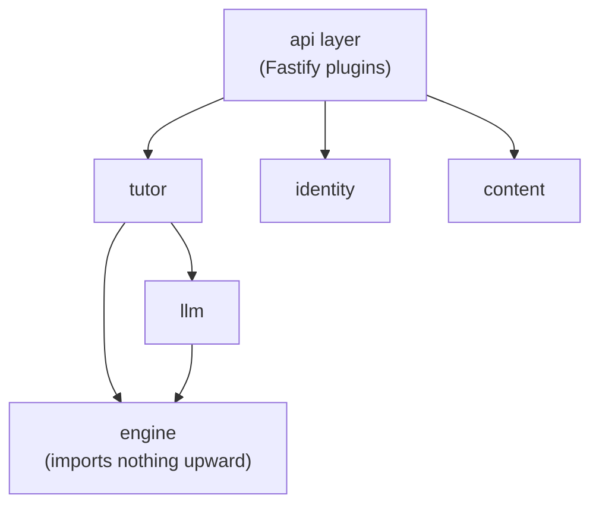
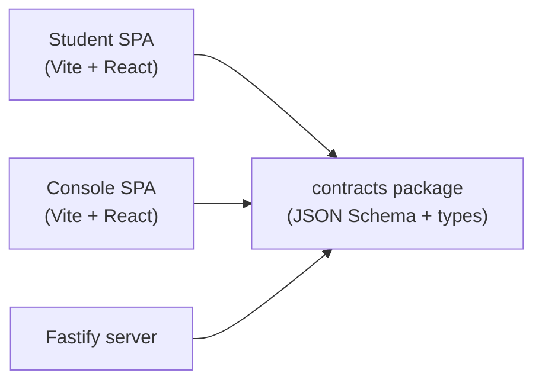
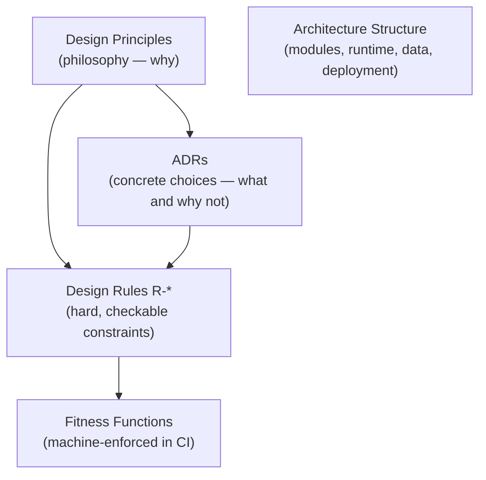

Stemolly được thiết kế để dễ thay đổi. Mục tiêu đó — gọi là *evolvability* (khả năng tiến hóa) — là yêu cầu phi chức năng quan trọng nhất, và nó chi phối mọi lựa chọn cấu trúc được mô tả trên trang này. Muốn hiểu vì sao kiến trúc trông như hiện nay, phải bắt đầu từ điểm đó.

## Một monorepo, một khối triển khai

Dự án phục vụ hai nhóm người dùng: học sinh và đội ngũ nội bộ (người dùng Console). Đây là hai ứng dụng web riêng, có UI riêng, nhưng chúng dùng chung một domain — Console biên soạn các brief mà phiên học của học sinh sẽ sử dụng, còn các phiên học thì ghi evidence để Console quan sát lại sau đó. Tách chúng thành hai backend riêng chỉ hợp lý nếu dữ liệu cũng tách biệt, nhưng thực tế thì không.

Vì thế, cấu trúc là:

```
monorepo
├── apps/student         ← Vite + React SPA
├── apps/console         ← Vite + React SPA
├── packages/contracts   ← shared JSON Schema + generated TypeScript types
└── server               ← one Fastify backend process
```

Cả ba hiện vật chạy thực tế — nginx, server image và Postgres — được phát hành cùng nhau như **một khối triển khai duy nhất**. Phương án multi-repo đã bị loại vì gói `contracts` được cả hai frontend lẫn server cùng import; để mọi thứ trong một repo giúp các thay đổi contract xuyên suốt hệ thống có thể diễn ra một cách nguyên tử và được type-check trong cùng một pull request.

Phương án hai backend (để cô lập blast radius) cũng từng được cân nhắc và vẫn được giữ như một extraction seam (điểm có thể tách ra sau này). Nó chỉ thực sự đáng giá khi Console có người dùng bên ngoài hoặc Student app mở đăng ký tự phục vụ — còn ở quy mô hiện tại, việc tách đôi đó sẽ không thật sự giảm rủi ro nếu vẫn chưa tách cả thông tin xác thực cơ sở dữ liệu, trong khi cái giá phải trả về độ linh hoạt sẽ đến ngay lập tức.

## Backend: một modular monolith

Server là **một tiến trình duy nhất** chứa các module có ranh giới nghiêm ngặt. Không có chia tách microservices, không có mạng giữa các module. Các module là:

`engine`, `tutor`, `pedagogy`, `content`, `identity`, `llm`, `judge`, `authoring-ai`, `metering`, `jobs`, `api`

Ranh giới được cưỡng chế bằng **dependency lint** (`dependency-cruiser` + `eslint-boundaries`), chứ không phải bằng mạng. Module `engine` không import gì từ các lớp ở trên; không module nào chui sâu vào bên trong module khác. Kiểm tra lint này phải chặn CI ngay từ sprint đầu tiên — nếu có thể lách qua, toàn bộ mô hình sẽ sụp đổ.



Vì sao không dùng microservices? Các khái niệm cốt lõi của domain — brief, evidence, report — tương tác xuyên qua mọi module. Bất kỳ thay đổi hướng đi nào băng qua một seam cũng sẽ biến thành một thay đổi nhiều repo, nhiều lần triển khai, có version cho contract. Ở quy mô hiện tại, **phân tán đi ngược lại mục tiêu evolvability quan trọng nhất.** Các seam được cố ý làm cho dễ nhìn thấy để sau này đội ngũ có thể tách dịch vụ khi một ràng buộc đã được đo đếm rõ ràng (lưu lượng, quy mô đội ngũ, nhu cầu cô lập) thật sự biện minh cho chi phí đó.

## Bề mặt API: bốn namespace

Backend duy nhất này phơi ra bốn namespace:

| Namespace | Ai có thể gọi | Có chặn quyền không? |
|---|---|---|
| `/api/student/*` | Student app | ✅ theo vai trò, mặc định từ chối |
| `/api/console/*` | Console app | ✅ theo vai trò, mặc định từ chối |
| `/api/admin/*` | Quản trị viên nội bộ | ✅ theo vai trò, mặc định từ chối |
| `/api/auth/*` | Bất kỳ ai (trước phiên) | ❌ cố ý không chặn |

Namespace `/api/auth/*` không bị chặn vì các endpoint của nó — đăng nhập, chấp nhận lời mời — chạy trước khi bên gọi có vai trò. Tất cả namespace còn lại đều mặc định từ chối; một request đi kèm sai vai trò sẽ bị chặn ngay ở cấp tiền tố trước khi tới bất kỳ handler nào.

## Stack: TypeScript từ đầu đến cuối

Mọi lớp đều dùng TypeScript. Gói `contracts` dùng chung chính là mô liên kết của toàn hệ thống: nó công bố các định nghĩa JSON Schema và các kiểu TypeScript được sinh ra từ đó, rồi được cả hai frontend lẫn server import.



**Fastify** được chọn thay cho Express (một giả định có từ trước) vì hai lý do rất cụ thể: cơ chế xác thực JSON Schema gốc theo từng route khớp chính xác với cách gói `contracts` hoạt động, và plugin đóng gói theo tiền tố của nó ánh xạ trực tiếp vào bốn namespace API. Nó là một router tường minh, không có thứ “ma thuật” nào của meta-framework.

Các phương án thay thế đã bị loại:

- **Next.js / Remix** — luồng điều khiển bị che khuất; không có lợi ích SSR cho hai ứng dụng đều bị chặn sau lớp xác thực.
- **Python + FastAPI** — chia đôi ngôn ngữ ngay trên seam `contracts` có tốc độ thay đổi cao; việc dùng LLM ở đây là điều phối API, không phải suy luận ML cục bộ.
- **Heavy ORMs** — bị loại để các DB trigger append-only và recursive CTE vẫn có thể đọc hiểu như SQL thuần.

## Quản trị: bốn trụ cột

Kiến trúc được giữ cho trung thực nhờ bốn lớp tài liệu hóa và cưỡng chế. Mô hình quản trị này tồn tại chính là để bảo đảm mục tiêu evolvability vẫn đúng trong quá trình triển khai, chứ không chỉ đúng ở thời điểm thiết kế.



- **Design Principles** — tầng triết lý; phần “vì sao” sinh ra mọi quyết định.
- **ADRs** — ghi lại một lựa chọn cụ thể, kèm những gì đã bị loại và lý do loại bỏ. Thêm một module, datastore, dịch vụ ngoài hoặc ranh giới tiến trình đều phải có ADR.
- **Design Rules (`R-*`)** — các ràng buộc cứng, có thể kiểm tra được, mỗi ràng buộc đều viện dẫn một principle. Mỗi rule phải ánh xạ tới ít nhất một fitness function.
- **Architecture Structure** — hồ sơ sống về module, hành vi runtime, mô hình dữ liệu và triển khai.

**Fitness functions** là lớp cưỡng chế, được sắp theo độ mạnh:

1. **Máy trong CI** (mạnh nhất) — dependency-lint cho ranh giới module, danh sách cấm grep cho việc rò rỉ vendor/domain.
2. **Cưỡng chế lúc runtime** — DB trigger cho các bảng append-only, runtime assertion trong LLM gateway.
3. **Quy trình con người** (dự phòng) — review thủ công ở những nơi việc tự động hóa chưa thực tế.

Các mối quan tâm cắt ngang — auth, lỗi, logging, idempotency, cấu hình, resilience — được quyết định ở giai đoạn kiến trúc (chốt seam và các bất biến), rồi chỉ đến giai đoạn thiết kế mới điền vào chi tiết cụ thể. Nếu trì hoãn muộn hơn nữa, từng module riêng lẻ sẽ tự chọn theo cách khác nhau, tạo ra kiểu bất nhất mà sau này rất đắt để gỡ.

### Điều gì thuộc về ADR — và điều gì không

Trong dự án này, phần thân của một ADR là **bất biến**. Muốn thay đổi một quyết định thì phải viết ADR mới để thay thế ADR cũ, tuyệt đối không sửa ADR gốc. Tính bất biến này tạo ra một quy tắc rất rõ về việc điều gì được phép xuất hiện trong phần *Decision* của ADR.

:::caution[Tên file và đường dẫn không thuộc về ADR]
Nếu tên file xuất hiện trong phần Decision của ADR, thì chỉ cần đổi tên file đó là một hồ sơ đã được chấp nhận trở thành sai theo nghĩa đen. Cách khắc phục duy nhất khi đó là supersession — một nghi thức tốn kém cho một việc đôi khi chỉ là đổi tên thường lệ.
:::

Cách phân chia để tránh điều đó:

- **ADR gọi tên vai trò và bất biến.** Ví dụ: “driving contract không bao giờ import driven contracts.”
- **Design rules (`R-*`) gọi tên file** đang giữ các vai trò đó. Ví dụ: R-28 liệt kê `core/driving.ts`, `core/driven.ts`.

Rule có thể được sửa trong công việc thường ngày — danh sách file của một rule có thể thay đổi mà không cần đụng đến ADR mà nó chống lưng. Bố cục có thể tiến hóa với tốc độ của rules; hồ sơ quyết định thì vẫn giữ được tính chân thực.

ADR-023 đã minh họa thất bại này khi ghi thẳng một layout thư mục cụ thể vào phần Decision. Bất kỳ lần đổi tên nào về sau cũng mâu thuẫn với một hồ sơ đã được chấp nhận, buộc phải supersede. ADR-029 thì được viết theo nguyên tắc ở trên: năm vai trò, không tên file, còn R-28 và R-30 mới là nơi giữ các đường dẫn.

### Phạm vi ADR: ranh giới, không phải phương tiện truyền tải

ADR có tính ràng buộc đối với phần việc còn sống lâu hơn sprint đã sinh ra nó. Vì thế, dòng `Scope` của ADR phải gọi tên một **ranh giới bền vững**, chứ không phải một hiện vật tạm thời rồi sẽ bị thay thế.

Bề mặt MCP của PoC là một ví dụ về hiện vật tạm: hiện giờ nó là thứ mang ranh giới engine hướng về phía model, nhưng ứng dụng hoàn chỉnh sau này sẽ thay nó bằng lời gọi nội bộ trong tiến trình `tutor` → `engine`. Phần bền vững là engine và schema của nó. Nếu viết một ADR có phạm vi gắn với các file MCP, thì ADR đó sẽ âm thầm mất hiệu lực ngay khi PoC bị loại bỏ.

Cách viết scope đúng là:

> *"Ranh giới hướng về phía model của engine module, bất kể hiện đang được chuyên chở bằng phương tiện nào: hôm nay là bề mặt công cụ MCP của PoC, sau này là lời gọi checkpoint-job trong cùng tiến trình."*

Những phát hiện rút ra từ một hiện vật tạm thời phải nằm trong phần `Evidence` — khi đó chúng được đọc như quan sát về hiện thân hiện tại, chứ không phải giới hạn vĩnh viễn của cái mà quyết định đang cai quản. Quy tắc ngón tay cái là: **nếu một định danh có thể bị cho nghỉ hưu theo lịch, thì nó không thể xuất hiện trong một tài liệu sống lâu hơn các lịch đó.** Ranh giới và năng lực có thể sống sót qua một lần viết lại; còn đường dẫn file chui vào một lớp vỏ dùng rồi bỏ thì không.

### Khi nào supersede, khi nào sửa ngay tại chỗ

Tính bất biến cũng có ranh giới của nó, và hiểu được ranh giới đó giúp tránh hai sai lầm ngược chiều nhau: sửa một hồ sơ đáng lẽ phải bị supersede, hoặc supersede một hồ sơ đáng lẽ chỉ cần sửa thẳng.

**Câu chữ quá rộng trong một ADR đã được chấp nhận** — khi một ADR đã được chấp nhận cấm nhiều hơn mức mà chính lập luận của nó thực sự hỗ trợ, cách xử lý là supersession ngay cả khi sửa trực tiếp có vẻ rẻ hơn xét về số lượng citation. Số citation không phải yếu tố quyết định, vì hai lý do. Thứ nhất, một ADR đã được chấp nhận khác có thể gọi ADR đầu tiên là `Precedent:` — sửa phần thân của ADR cũ đồng nghĩa dịch chuyển nền đất bên dưới một hồ sơ vốn cũng đang có tính ràng buộc. Thứ hai, lập luận “đó chỉ là lỗi soạn thảo” sẽ vĩnh viễn sẵn sàng được dùng để phản bác bất kỳ hồ sơ nào mà sau này ai đó không đồng ý, kể cả một agent chạy không giám sát; lớp bảo vệ duy nhất của toàn bộ tập hồ sơ là phần thân không được dịch chuyển. Mà bản ghi superseding mới cũng là hiện vật tốt hơn: nó phát biểu lại quy tắc ở đúng độ hạt vốn phải có từ đầu, mang nguyên văn các mệnh đề còn sống sang, và để hồ sơ gốc nằm lại trên đĩa như lịch sử — nơi câu chữ quá rộng kia giải thích vì sao khả năng bị cấm đó chưa từng được xây.

**Các khẳng định đã được “verified” nhưng sai trong một bản nháp chưa commit** — một bản nháp cùng phiên làm việc mà chưa được commit hay bị cái gì khác trích dẫn thì vẫn chỉ là bản nháp, chưa phải “án lệ”. Supersede nó sẽ khiến khẳng định sai bị bảo tồn vĩnh viễn trong tập hồ sơ, và điều đó còn tệ hơn một lần sửa sạch sẽ đối với người đọc về sau. Những rào chắn để việc này không trở thành kẽ hở là: việc sửa phải được công khai chứ không âm thầm, quyết định từng dựa trên sự kiện sai đó phải được suy ra lại chứ không vá chắp, và phương án từng bị loại sai vì sự kiện đó phải được ghi vào phần `Rejected options` như đúng thứ đã được soạn trước khi file thực sự được đọc.

:::note[Bài học từ trường hợp trước]
Nhãn `verified` chỉ đáng tin tới mức mà việc xác minh thực sự chạm tới. Một khẳng định về những file nào hợp thành một surface phải được kiểm tra đối chiếu với chính file đang ghép surface đó — chứ không phải với những file có tên nghe như thể chúng làm việc đó.
:::

Hai quy tắc này cùng nhau vạch ra một ranh giới rõ ràng: **commitment và citation chính là ngưỡng**. Trước ngưỡng đó, hãy sửa hồ sơ một cách sạch sẽ. Sau ngưỡng đó, hãy supersede.
