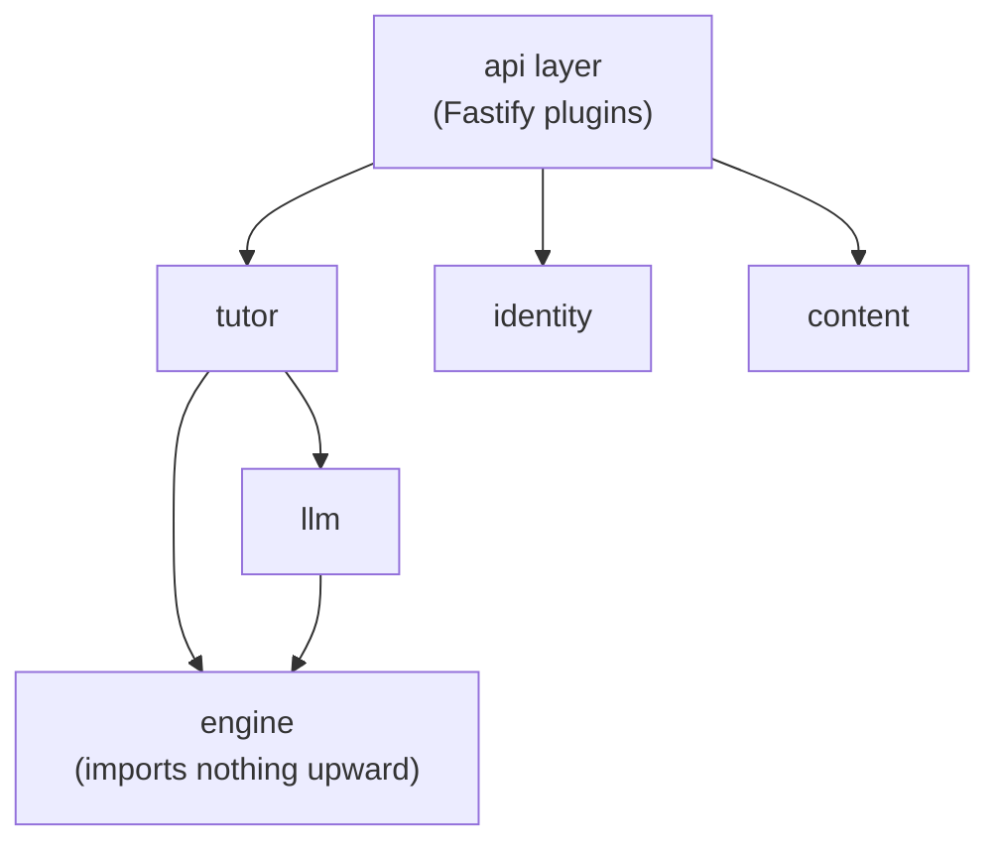
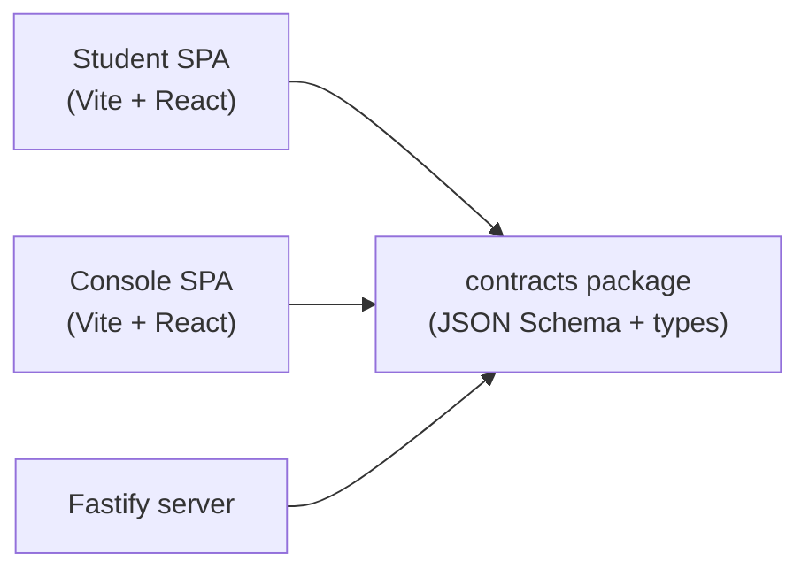
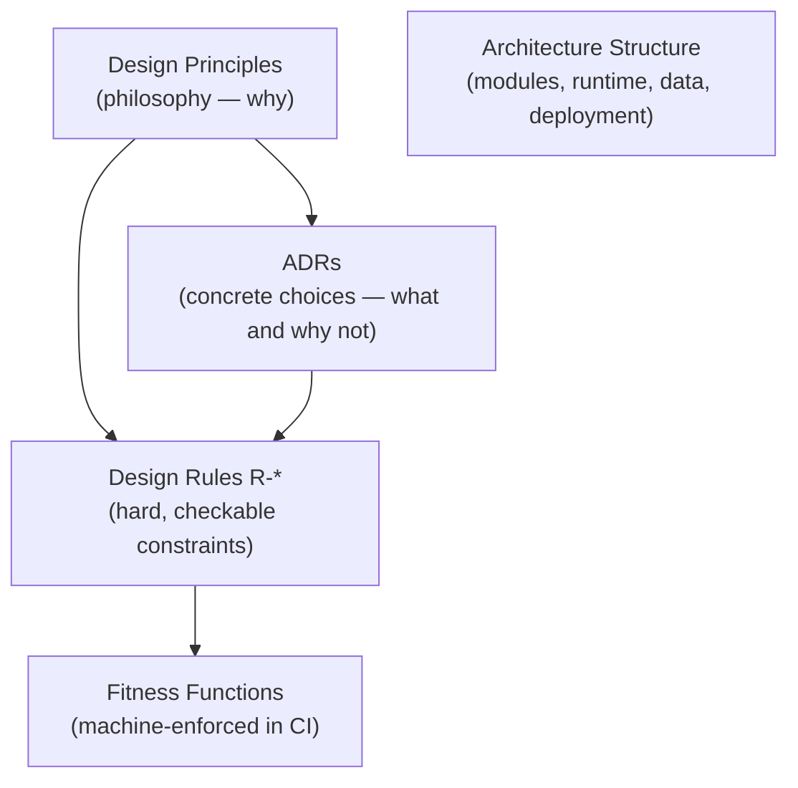

Stemolly được thiết kế để dễ thay đổi. Mục tiêu đó — gọi là *evolvability* (khả năng tiến hóa) — là yêu cầu phi chức năng quan trọng nhất, và nó chi phối mọi lựa chọn về cấu trúc được mô tả trên trang này. Muốn hiểu vì sao kiến trúc lại có hình dạng như hiện nay thì phải bắt đầu từ đó.

## Một Monorepo, Một Deployable

Dự án phục vụ hai nhóm người dùng: học viên và đội ngũ nội bộ (người dùng Console). Đây là hai ứng dụng web riêng, giao diện riêng, nhưng cùng chia sẻ một domain (miền nghiệp vụ): Console soạn các brief mà phiên học của học viên sẽ sử dụng, còn các phiên này lại ghi evidence để Console theo dõi. Chỉ khi dữ liệu cũng tách riêng thì việc chia thành hai backend độc lập mới hợp lý, nhưng thực tế không phải vậy.

Vì thế, cấu trúc là:

```
monorepo
├── apps/student         ← Vite + React SPA
├── apps/console         ← Vite + React SPA
├── packages/contracts   ← shared JSON Schema + generated TypeScript types
└── server               ← one Fastify backend process
```

Cả ba runtime artifact — nginx, server image và Postgres — được đóng gói cùng nhau thành **một deployable** (đơn vị triển khai) duy nhất. Phương án multi-repo đã bị loại vì gói `contracts` được cả hai frontend lẫn server import; giữ mọi thứ trong một repo giúp các thay đổi cắt ngang ở mức contract diễn ra theo kiểu nguyên tử và được kiểm tra kiểu trong cùng một pull request.

Phương án hai backend (để *blast-radius isolation* — cô lập phạm vi ảnh hưởng sự cố) cũng từng được cân nhắc và vẫn được giữ như một *extraction seam* (điểm tách sau này). Nó chỉ thực sự đáng làm khi Console có thêm người dùng bên ngoài hoặc Student mở đăng ký tự phục vụ — nhưng ở quy mô hiện tại, việc tách ra chưa giúp giảm rủi ro nếu vẫn dùng chung thông tin truy cập cơ sở dữ liệu, trong khi chi phí làm chậm khả năng thích ứng thì sẽ xuất hiện ngay.

## Backend: một Modular Monolith

Server là **một process** (tiến trình) duy nhất, bên trong chứa các module có ranh giới nghiêm ngặt. Không có kiểu chia thành microservices, không có giao tiếp mạng giữa các module. Các module gồm:

`engine`, `tutor`, `pedagogy`, `content`, `identity`, `llm`, `judge`, `authoring-ai`, `metering`, `jobs`, `api`

Ranh giới được cưỡng chế bằng **dependency lint** (`dependency-cruiser` + `eslint-boundaries`), chứ không phải bằng mạng. Module `engine` không import gì từ tầng trên; không module nào chọc sâu vào bên trong module khác. Kiểm tra lint này phải đủ sức chặn CI ngay từ sprint đầu tiên — nếu có thể lách qua, toàn bộ mô hình sẽ sụp đổ.



Vì sao không dùng microservices? Các khái niệm cốt lõi của domain — brief, evidence, report — tương tác xuyên qua hầu như mọi module. Bất kỳ cú xoay nào đi qua một ranh giới như vậy đều sẽ biến thành thay đổi nhiều repo, nhiều lần triển khai và phải quản lý version contract. Ở quy mô hiện tại, **phân tán hệ thống đi ngược mục tiêu evolvability quan trọng nhất.** Các seam vẫn được để lộ rõ có chủ đích, để đội ngũ có thể tách thành service sau này khi một ràng buộc đo được (lưu lượng, quy mô đội ngũ, nhu cầu cô lập) thật sự đáng để trả cái giá đó.

## Bề mặt API: Bốn Namespace

Backend duy nhất này lộ ra bốn namespace (không gian API):

| Namespace | Ai có thể gọi | Có chặn quyền không? |
|---|---|---|
| `/api/student/*` | Ứng dụng Student | ✅ giới hạn theo vai trò, mặc định từ chối |
| `/api/console/*` | Ứng dụng Console | ✅ giới hạn theo vai trò, mặc định từ chối |
| `/api/admin/*` | Quản trị viên nội bộ | ✅ giới hạn theo vai trò, mặc định từ chối |
| `/api/auth/*` | Bất kỳ ai (trước khi vào phiên) | ❌ cố ý không chặn |

Namespace `/api/auth/*` không chặn vì các endpoint của nó — đăng nhập, chấp nhận lời mời — chạy trước khi bên gọi có vai trò. Tất cả namespace còn lại đều mặc định từ chối; yêu cầu sai vai trò sẽ bị chặn ngay ở mức prefix trước khi chạm tới bất kỳ handler (bộ xử lý) nào.

## Ngăn xếp: TypeScript Từ Đầu Đến Cuối

Mọi tầng đều dùng TypeScript. Gói `contracts` dùng chung là phần mô liên kết của hệ thống: nó xuất bản các định nghĩa JSON Schema và các kiểu TypeScript được sinh ra, rồi được cả hai frontend và server import.



**Fastify** được chọn thay cho Express (một giả định trước đó) vì hai lý do rất cụ thể: khả năng kiểm tra JSON Schema theo từng route khớp chính xác với cách gói `contracts` vận hành, và các plugin đóng gói theo prefix ánh xạ trực tiếp sang bốn namespace API. Đây là một router tường minh, không có “phép thuật” kiểu meta-framework.

Các phương án đã bị loại:

- **Next.js / Remix** — luồng điều khiển bị che khuất; không có lợi ích SSR cho hai ứng dụng đều nằm sau lớp xác thực.
- **Python + FastAPI** — chia đôi ngôn ngữ ngay tại seam `contracts`, vốn là nơi thay đổi nhiều; ở đây việc dùng LLM là điều phối qua API, không phải suy luận ML cục bộ.
- **Heavy ORMs** — bị loại để các DB trigger cho bảng append-only và các recursive CTE vẫn dễ đọc dưới dạng SQL thuần.

## Quản trị: Bốn Trụ Cột

Kiến trúc chỉ được giữ đúng hướng khi có bốn lớp tài liệu hóa và cưỡng chế hỗ trợ lẫn nhau. Mô hình quản trị này tồn tại chính để bảo đảm mục tiêu evolvability vẫn đúng trong quá trình triển khai, chứ không chỉ ở giai đoạn thiết kế.



- **Design Principles** — phần triết lý; cái “vì sao” sinh ra mọi quyết định.
- **ADRs** — ghi lại một lựa chọn cụ thể, cùng những gì đã bị loại và vì sao. Mỗi khi thêm module, datastore, dịch vụ ngoài hay ranh giới process thì đều cần có ADR.
- **Design Rules (`R-*`)** — các ràng buộc cứng có thể kiểm tra được, mỗi rule đều viện dẫn ít nhất một principle. Mỗi rule phải ánh xạ tới ít nhất một fitness function.
- **Architecture Structure** — hồ sơ sống về module, hành vi runtime, mô hình dữ liệu và cách triển khai.

**Fitness functions** là lớp cưỡng chế, được sắp theo độ mạnh:

1. **Machine in CI** (mạnh nhất) — dependency-lint cho ranh giới module, danh sách chặn bằng grep để ngăn việc lẫn lộn vendor/domain.
2. **Runtime-enforced** — DB trigger cho bảng append-only, các khẳng định ở runtime trong cổng LLM.
3. **Human process** (phương án cuối) — rà soát thủ công ở những chỗ chưa thể tự động hóa.

Các *cross-cutting concerns* (mối quan tâm xuyên cắt) — auth, lỗi, logging, idempotency, config, resilience — được quyết định ngay từ pha kiến trúc (chốt seam và bất biến), rồi chỉ điền chi tiết ở pha thiết kế. Nếu dời chúng muộn hơn nữa, từng module sẽ tự chọn theo cách riêng, tạo ra kiểu bất nhất rất tốn công gỡ lại.

### Điều Gì Thuộc ADR — Và Điều Gì Không

Trong dự án này, phần thân của một ADR là **bất biến**. Muốn thay đổi quyết định thì phải viết ADR mới để thay thế ADR cũ, không bao giờ sửa lại bản gốc. Chính tính bất biến đó tạo ra một quy tắc rất rõ về những gì được phép xuất hiện trong phần *Decision* của ADR.

:::caution[Tên file và đường dẫn không thuộc về ADR]
Nếu một tên file xuất hiện trong phần Decision của ADR, chỉ cần đổi tên file đó là một hồ sơ đã được chấp nhận sẽ trở thành sai theo nghĩa đen. Cách khắc phục duy nhất khi đó là viết ADR thay thế — một thủ tục tốn kém cho điều có khi chỉ là đổi tên thường lệ.
:::

Cách phân chia để tránh vấn đề này là:

- **ADR gọi tên vai trò và bất biến.** Ví dụ: “driving contract không bao giờ import driven contracts.”
- **Design rules (`R-*`) gọi tên file** đang giữ các vai trò đó. Ví dụ: R-28 liệt kê `core/driving.ts`, `core/driven.ts`.

Rule được chỉnh sửa trong công việc thường ngày — danh sách file trong một rule có thể thay đổi mà không cần đụng tới ADR phía sau nó. Bố cục có thể tiến hóa theo nhịp của rule; hồ sơ quyết định thì vẫn trung thực.

ADR-023 từng cho thấy thất bại của cách làm ngược lại khi ghi một cấu trúc thư mục cụ thể vào phần Decision. Chỉ cần đổi tên về sau là đã mâu thuẫn với một hồ sơ đã được chấp nhận, và buộc phải viết ADR thay thế. ADR-029 được viết theo nguyên tắc ở trên: năm vai trò, không nêu tên file, còn R-28 và R-30 mới là nơi mang các đường dẫn.

### Phạm Vi ADR: Ranh Giới, Không Phải Cách Vận Chuyển

ADR có tính ràng buộc với phần việc còn tồn tại lâu hơn sprint đã sinh ra nó. Vì vậy, dòng `Scope` phải gọi tên một **ranh giới bền vững**, chứ không phải một hiện vật tạm thời rồi sẽ bị thay thế.

Bề mặt MCP của PoC là ví dụ cho một hiện vật tạm thời như vậy: hiện tại nó là lớp mang ranh giới engine hướng ra phía model, nhưng trong ứng dụng hoàn chỉnh nó sẽ được thay bằng lời gọi nội bộ `tutor` → `engine`. Thứ bền vững là engine và schema của nó. Nếu ADR được giới hạn theo các file MCP, thì tới khi PoC bị gỡ bỏ, ADR đó cũng âm thầm mất hiệu lực.

Cách viết phạm vi đúng là:

> *"Ranh giới hướng về phía model của module engine, bất kể đang được mang bằng transport nào: bề mặt công cụ MCP trong PoC hôm nay, lời gọi checkpoint-job nội bộ sau này."*

Những kết luận rút ra từ một hiện vật tạm thời nên nằm trong phần `Evidence` — khi đó chúng được đọc như quan sát về thể hiện hiện tại, chứ không phải giới hạn vĩnh viễn của quyết định. Quy tắc kinh nghiệm là: **nếu một định danh có thể bị khai tử theo lịch, nó không thể xuất hiện trong tài liệu sống lâu hơn cái lịch đó.** Ranh giới và năng lực có thể sống sót qua một lần viết lại; đường dẫn file bên trong một lớp vỏ dùng rồi bỏ thì không.
