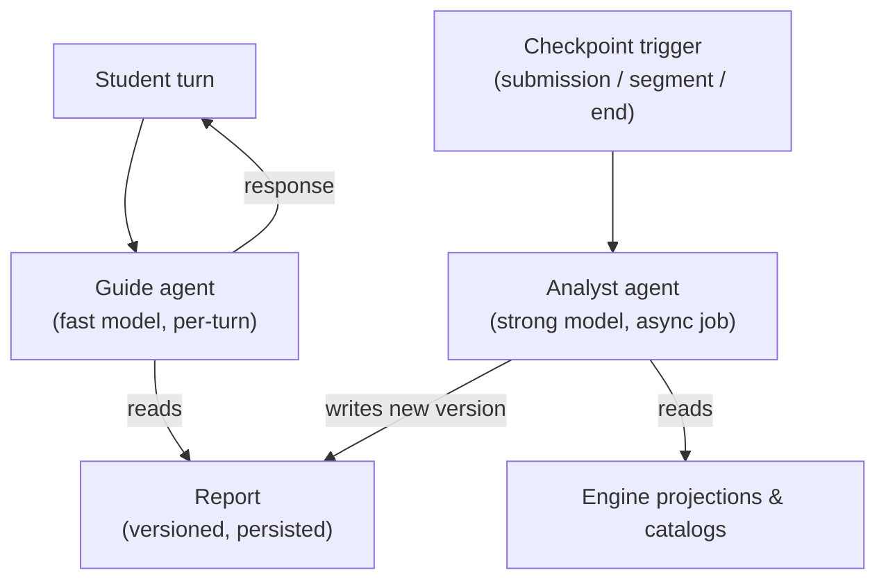
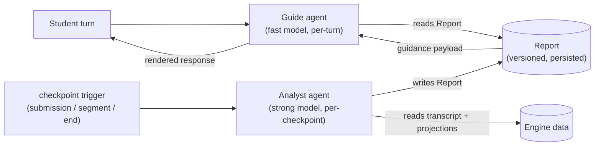

Stemolly không phụ thuộc vào bất kỳ nhà cung cấp LLM nào. Hệ thống định tuyến từng tác vụ tới đúng tầng mô hình — rẻ và nhanh cho việc thường lệ, mạnh và đắt cho suy luận — và mỗi vị trí mô hình đều có thể hoán đổi mà không phải sửa mã của agent (tác tử). Trên lớp có thể thay thế này là hai agent được thiết kế riêng, kết hợp thành gia sư: **Guide** (tác tử hướng dẫn) và **Analyst** (tác tử phân tích). Chúng giao tiếp qua đúng một kênh duy nhất: một tạo phẩm được lưu bền và có đánh phiên bản tên là **Report** (báo cáo).



## Nền tảng @noetaris/harness

Các agent của Stemolly được xây dựng trên **`@noetaris/harness`**, một framework agent bằng TypeScript do chính chúng tôi sở hữu hoàn toàn. Harness mô hình hóa một agent như một đồ thị có hướng gồm nhiều bước, với schema trường có kiểu cho trạng thái. Các dependency — bao gồm cả chính LLM — được inject qua `h.provide()`, còn LLM nằm ở slot `model` có tên, nên có thể thay thế mà không đụng tới logic của agent.

Cách làm trước đây là tự viết adapter cho từng nhà cung cấp và cả một lớp gateway hoàn chỉnh. Giờ cách đó đã được thay bằng harness vì hai lý do:

1. **Cô lập nhà cung cấp.** SDK của các provider (Anthropic, OpenAI, Google, Ollama) giờ nằm trọn trong các gói adapter ngoài repo của chúng tôi (`harness-anthropic`, `harness-openai`, v.v.), tất cả cùng hiện thực interface `LLM` của `harness-types`. Chúng tôi không đụng vào mã của vendor.
2. **Sở hữu tường minh thay vì phụ thuộc vào framework magic.** Harness đơn giản và được kiểm soát hoàn toàn — khác với LangChain hay các framework tương tự, nơi hành vi nảy sinh từ các quy ước ngầm. Cách này phù hợp với nguyên tắc "explicit over magic" của dự án.

Khi đã có harness, module `llm` thu gọn từ một gateway đầy đủ xuống còn một **lớp chính sách mỏng** với bốn nhiệm vụ:

- **Tier registry** (bộ đăng ký tầng) — ánh xạ cặp `(tier, purpose)` sang một mô hình và mức giá cụ thể.
- **Versioned prompt registry** (bộ đăng ký prompt có phiên bản) — lưu và truy xuất mẫu prompt theo phiên bản.
- **Tagged metering** (đo đếm có gắn thẻ) — ghi các dòng `llm_calls` bám theo span của `harness-otel`.
- **Runtime assertions** (kiểm định lúc chạy) — chặn các `purpose` chưa đăng ký hoặc lời gọi sai khuôn dạng.

```
┌─────────────────────────────────────────────┐
│               llm module                    │
│  tier registry → resolveTier(tier, purpose) │
│  prompt registry → versioned templates      │
│  metering wrapper → llm_calls rows (otel)   │
│  runtime assertions → guard rails           │
└────────────────┬────────────────────────────┘
                 │ harness-types LLM interface
     ┌───────────┼───────────┐
     ▼           ▼           ▼
anthropic     openai      ollama
 adapter      adapter     adapter
```

### Một completion đi tới mô hình như thế nào: `agent.run()`

Adapter trước đây điều khiển một completion bằng cách gọi trực tiếp `model.invoke()`, rồi tự nối tay vòng đời observer (`bindObserver()`, `onRunStart`, `onRunEnd`). Đó chỉ là cách lách tạm thời — nó buộc phải giả lập một `RunContext` mà đáng ra harness phải tự tạo.

Khi đọc chính mã nguồn `create-agent.ts` và `loop-executor.ts` của harness, chúng tôi nhận ra không cần cách vòng đó. Giờ adapter bọc mỗi completion trong một lời gọi **`agent.run()` một nút**. Harness tự động gọi `bindObserver()` trên mọi resource slot và điều phối `onRunStart`/`onRunEnd` ở mọi đường thoát — kể cả khi lỗi. Nhờ vậy, span của `harness-otel` được mở dưới một root-span thật của lần chạy, thay vì một root-span dựng giả.

Có một điểm tinh tế cần lưu ý: `agent.run()` **không bao giờ reject** khi một bước gặp lỗi. Nếu một bước ném lỗi, kết quả sẽ resolve thành `{ signal: '$error', state: { $error } }`. Adapter sẽ rẽ nhánh theo `outcome.signal` rồi ném lại `outcome.state.$error` để giữ đúng hợp đồng promise reject của `LLMPort.complete()` mà bên gọi đang kỳ vọng. Còn lỗi ở khâu dựng harness (ví dụ `NoNextStepError`) thì vẫn reject — và nên như vậy, vì đó là bug.

---

## Gia sư hai agent: Guide và Analyst

Trải nghiệm gia sư được vận hành bởi **hai agent chạy ở hai chế độ khác nhau**.

Hãy hình dung một trung tâm gia sư: giữa các buổi học, một giáo viên chuyên môn sâu sẽ phân tích kỹ bài làm của học sinh, rồi chuyển hướng dẫn có cấu trúc cho người gia sư trực tiếp đứng lớp. Stemolly vận hành theo đúng mô hình đó.



### Guide — agent tuyến đầu tốc độ cao

**Guide** chạy trên một mô hình nhẹ, nhanh và song ngữ. Nó được kích hoạt ở mọi lượt của học sinh và chịu trách nhiệm:

- Trả lời bằng ngôn ngữ của học sinh.
- Kết xuất lesson plugin và các tạo phẩm giao diện.
- Xử lý các lượt trao đổi qua lại thường lệ.

Guide **không chẩn đoán hay suy luận**. Nó không bao giờ tự dựng ra một ngộ nhận, không bao giờ cập nhật belief graph, và cũng không bao giờ tự sinh nội dung mà nó đang dạy. Nó trình bày lại điều Analyst đã kết luận; nó không tự quyết định kết luận đó phải là gì.

### Analyst — agent nền mạnh hơn

**Analyst** chạy trên một mô hình mạnh dưới dạng **công việc bất đồng bộ**. Nó chỉ được kích hoạt ở các checkpoint có ý nghĩa — sau khi nộp bài, sau một phân đoạn bài học, hoặc khi kết thúc bài học — chứ không chạy ở mọi lượt. Nó chịu trách nhiệm:

- Chẩn đoán mức độ hiểu của học sinh.
- Ghi các quan sát bằng chứng có kiểu, các mục khớp catalog, probe plan và các dự đoán vào belief graph.
- Đưa ra quyết định sư phạm (Guide nên làm gì tiếp theo).
- Tạo các tạo phẩm theo ngôn ngữ nội dung khi cần (ví dụ một câu tiếng Anh đã được sửa cho bài tập IELTS).

Vì Analyst chạy ngoài lượt hội thoại, chi phí của nó không làm tăng độ trễ đối thoại. Đây chính là hạt nhân trong mô hình chi phí và độ trễ của Stemolly: phần việc đắt đỏ chạy ít lần, còn phần việc rẻ gánh phần lớn lưu lượng.

### Ghi chú về tên gọi

Trong các tài liệu cũ, hai agent này được gọi là **Interface** (phía trước) và **Expert** (phía sau). Các tên đó đã bị thay vì "Interface" va chạm với quá nhiều nghĩa khác trong hệ thống — interface của plugin, hợp đồng API, hay chính bề mặt UI. Tên chuẩn hiện nay là **Guide** và **Analyst**. Đây cũng là các giá trị `agentRole` enum dùng trong metering và trong định tuyến tier/purpose (`role=guide`, `role=analyst`).

---

## Guide và Analyst giao tiếp với nhau thế nào: Report

**Report** là kênh duy nhất giữa Analyst và Guide. Không có kênh phụ nào khác. Đây là một ràng buộc có chủ ý.

Report có các đặc tính sau:
- **Có phiên bản** — mang `schemaVersion` và được kiểm tra ở biên API.
- **Được lưu bền trước khi dùng** — Analyst ghi Report vào nơi lưu trữ trước khi Guide đọc nó. Guide luôn đọc từ storage, không bao giờ đọc trực tiếp từ một lời gọi Analyst đang chạy.
- **Là bản ghi suy luận có thể được Observe kiểm tra** — vì Report là một tạo phẩm được lưu, khu vực Observe của Console có thể hiển thị và chấm điểm suy luận của Analyst mà không cần thêm bất kỳ lớp gắn đo nào.

Nếu một công việc checkpoint thất bại hoặc tới muộn, Guide vẫn tiếp tục phục vụ dựa trên **Report trước đó**. Cuộc hội thoại với học sinh vẫn tiếp diễn — hướng dẫn có thể hơi cũ, nhưng không bao giờ bị khựng lại. Công việc đó sẽ được thử lại ở nền.

### Khoảng trống thiết kế đang mở: schema của Report

Các bảo đảm ở mức vỏ bọc nêu trên đã được chốt. Nhưng **schema cụ thể theo từng trường vẫn chưa được thiết kế**.

Những trường còn cần được định nghĩa gồm có:

- **Guidance payload** — tập chỉ dẫn có cấu trúc mà Guide thực sự đọc là gì.
- **Contingent guidance** — các nhánh kiểu "nếu học sinh thử X thì làm Y". Điểm này quan trọng vì giữa hai checkpoint, Guide có thể phải phục vụ nhiều lượt chỉ từ một Report; nó cần đủ thông tin để xử lý các tình huống rẽ nhánh mà không phải gọi lại Analyst.
- Các trường **probe-plan** và **prediction**.

:::caution[Nhiệm vụ mở quan trọng nhất]
Nếu schema không biểu đạt được contingent guidance một cách đủ tốt, sẽ xuất hiện áp lực phải chạy Analyst ở mọi lượt — và như vậy sẽ làm sụp đổ mô hình chi phí mà cách tách hai agent này được tạo ra để bảo vệ. Tính đến giữa tháng 7 năm 2026, `app/packages/contracts/src` mới chỉ có `error-envelope.ts`; schema của Report vẫn chưa được mã hóa.
:::

---

## Ngôn ngữ suy luận là theo từng miền, không cố định bằng tiếng Anh

Analyst không phải lúc nào cũng suy luận bằng tiếng Anh. Quy tắc là: **dùng ngôn ngữ nào tránh được một vòng dịch qua lại làm mất mát trên chính bài làm của học sinh**.

- Với các miền nội dung bằng tiếng Anh (IELTS writing, SAT), Analyst làm việc trực tiếp bằng tiếng Anh.
- Với các miền có nội dung không phải tiếng Anh (Toán lớp 11 bằng tiếng Việt), nếu ép dùng tiếng Anh thì sẽ phải dịch lập luận tiếng Việt của học sinh sang tiếng Anh để Analyst xử lý, rồi lại dịch ngược kết quả về — tức bọc thêm một bước dịch gây hao hụt đúng quanh phần bằng chứng dùng để phát hiện ngộ nhận. Vì vậy Analyst sẽ suy luận bằng ngôn ngữ của nội dung.

Ngôn ngữ suy luận là một **cấu hình theo từng miền** trên Analyst, mặc định là ngôn ngữ của nội dung. Lợi thế hiệu năng được cho là của tiếng Anh trong LLM là nhỏ, và với toán học (vốn chủ yếu mang tính ký hiệu), lợi thế đó không bù nổi chi phí dịch thuật.

Có một quy tắc nhất quán áp dụng bất kể ngôn ngữ suy luận là gì: **ID nút của belief graph luôn là tiếng Anh chuẩn hóa**, vì các ID đó phải trung tính ngôn ngữ để đồ thị hoạt động xuyên miền.

---

## Định tuyến theo tier và purpose: `resolveTier()`

Mọi lời gọi LLM đều đi qua `resolveTier(tier, purpose)` trước khi một mô hình được khởi tạo. Hàm này là nơi duy nhất có thẩm quyền ánh xạ một cặp `(tier, purpose)` sang một model ID cụ thể cùng mức giá tính phí.

`resolveTier()` là **câu lệnh đầu tiên** trong `createLlmProviderAdapter.complete()` của `adapter.ts`. Nếu `purpose` chưa được đăng ký, lời gọi sẽ ném lỗi ngay lập tức — trước khi bất kỳ mô hình nào được gọi và trước khi bất kỳ dòng metering nào được ghi. Trước đây, một `purpose` chưa đăng ký vẫn có thể âm thầm gọi mô hình và ghi một dòng tính phí theo bất kỳ mức giá nào tình cờ nằm trong bảng tra phẳng; bảng đó nay đã bị gỡ bỏ.

`modelConfig.model` sau khi được phân giải sẽ được truyền như tham số thứ hai bắt buộc vào `resolveHarnessModel(config, modelId)`, hàm chỉ biết cách dựng đối tượng có thể gọi được cho từng provider cụ thể. Hai trách nhiệm này được tách riêng: `resolveTier` quyết định *mô hình nào* và *mức giá nào*; `resolveHarnessModel` quyết định *dựng nó ra sao*.

### Giữ cho registry dễ bảo trì

Tier registry hiện nằm trong `llm/domain/tiers.ts` cùng với logic `resolveTier` và `computeCost`. Ba phần này được dự đoán là thay đổi với nhịp khác nhau: dữ liệu registry thay đổi thường xuyên (purpose mới, mô hình mới, mức giá cập nhật); logic phân giải thì hiếm khi đổi. Đặt chung chúng với nhau khiến người bảo trì chỉ muốn sửa một mức giá cũng phải đọc qua cả logic ném lỗi mà họ không cần.

Cách sửa dự kiến (đang được theo dõi ở issue #30) là tách chúng thành các tệp riêng:
- `tier-types.ts` — các kiểu dùng chung `Tier` và `ModelConfig` (không logic, không dữ liệu).
- `tier-registry.ts` — bảng dữ liệu `TIER_REGISTRY`, import từ `tier-types.ts`.
- `tiers.ts` (hoặc tương đương) — logic `resolveTier`/`computeCost`, cũng import từ `tier-types.ts`.

Cách này giữ đồ thị import thành một DAG một chiều: tệp dữ liệu và tệp logic đều không import lẫn nhau. Registry vẫn được giữ ở dạng TypeScript thuần (không dùng YAML hay JSON), một quyết định đã được chốt trong ADR-005 theo nguyên tắc "explicit over magic" và không mở lại.

---

## Kiểm thử không cần LLM thật: quy tắc mock-slot

Vì harness phơi bày LLM dưới dạng một slot `model` có thể hoán đổi, mọi kiểm thử tự động đều dùng **LLM giả lập có tính tất định** (hoặc adapter Ollama cục bộ miễn phí). Không có kiểm thử tự động nào được phép gọi một provider thật. Đây là quy tắc cứng.

Việc phân tách như sau:

| Level | What it proves | How |
|-------|---------------|-----|
| Level 0 | The plumbing works (routing, metering, error handling) | Mock/local slot + `@noetaris/harness-testing` |
| Level 1 | The belief model is true (diagnosis quality, groundedness) | Offline evaluation harness, real Claude adapter |

Một bài kiểm tra fitness-function trong CI sẽ khẳng định rằng `NODE_ENV=test` không bao giờ được phân giải sang provider vendor thật. Việc chuyển bất kỳ agent nào từ mock sang Claude thật chỉ là thay đổi một dòng ở slot — chính cơ chế này biến tính độc lập với LLM thành điều cụ thể, chứ không chỉ là mục tiêu đẹp đẽ.

---

## Khả năng quan sát vận hành là một mối quan tâm riêng

Stemolly có **hai nhiệm vụ quan sát khác nhau** và chúng tuyệt đối không được lẫn với nhau.

**Khả năng quan sát để thẩm định** ("engine có đúng không?") kiểm tra xem belief model có chính xác hay không — độ chính xác groundedness, tính hợp lệ dự đoán, khả năng soi belief graph. Đây là một năng lực chức năng được hiện thực trong khu Observe của Console.

**Khả năng quan sát vận hành** ("hệ thống có khỏe và có chi trả nổi không?") là một yêu cầu phi chức năng. Nó bao gồm:

- **Chi phí** — mức chi LLM và số token theo từng lượt, từng phiên, từng học sinh, từng bài học và từng miền, có tách theo tier mô hình và theo agent role (`guide` / `analyst`).
- **Hiệu năng LLM** — độ trễ theo từng agent role, tỷ lệ lỗi/hết thời gian/thử lại, mức hiển thị của định tuyến mô hình, thông lượng.
- **Tín hiệu độ tin cậy** — lỗi lưu bền, vi phạm guardrail.

Việc tách theo agent role quan trọng vì một lý do cụ thể: cách chia hai agent này được xây trên giả định rằng Analyst (đắt) chạy ít, còn Guide (rẻ) gánh phần lớn lưu lượng. Giả định đó chỉ có thể được kiểm chứng nếu theo dõi chi phí và độ trễ theo từng agent role. Nếu các con số này bắt đầu lệch đi — chẳng hạn lời gọi Analyst xuất hiện quá thường xuyên — đó là tín hiệu sớm cho thấy thiết kế schema của Report không đứng vững trong cách dùng thực tế.
