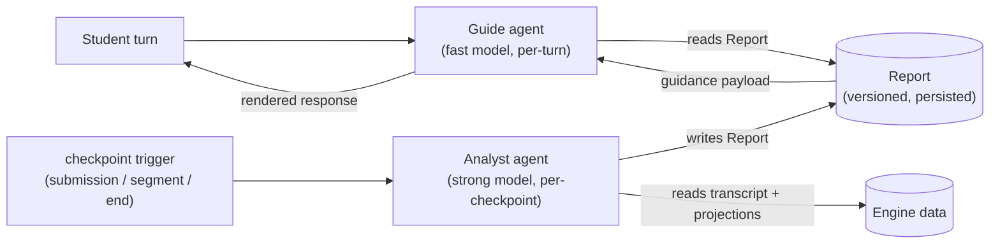

Stemolly không phụ thuộc vào bất kỳ nhà cung cấp AI nào. Hệ thống dùng đồng thời nhiều LLM (mô hình ngôn ngữ lớn), mỗi mô hình được ghép với đúng công việc của nó: các model rẻ, nhanh xử lý những lượt hội thoại số lượng lớn; các model mạnh hơn (và đắt hơn) đảm nhận phần suy luận vốn diễn ra ít hơn nhiều. Không phần nào trong codebase được phép giả định một vendor (nhà cung cấp) cụ thể — Claude, GPT, Gemini hay model chạy cục bộ đều có thể thay thế cho nhau. Các agent (tác nhân) đứng sau trải nghiệm gia sư được đặt trên chính lớp model có thể hoán đổi này.

Trang này giải thích lớp nền mà các agent đó được xây trên, thiết kế hai agent là trái tim của hệ thống gia sư, cách các agent giao tiếp với nhau, và những quyết định vận hành giúp hệ thống vẫn có thể kiểm thử, định tuyến và quan sát được.

---

## Lớp nền @noetaris/harness

Các agent của Stemolly được xây trên **`@noetaris/harness`**, một framework agent TypeScript do chính chúng tôi sở hữu hoàn toàn. Harness mô hình hóa một agent như một đồ thị có hướng gồm nhiều bước, với một field schema (lược đồ trường) có kiểu cho state (trạng thái). Các dependency (phụ thuộc) — bao gồm cả chính LLM — được đưa vào bằng `h.provide()`, và LLM là một slot (khe) `model` có tên, có thể thay thế mà không cần đụng vào logic của agent.

Cách tiếp cận trước đây là tự viết adapter (bộ điều hợp) cho từng provider và cả một lớp gateway đầy đủ. Sau đó, hướng này được thay bằng harness vì hai lý do:

1. **Giam phạm vi vendor.** Các SDK của provider (Anthropic, OpenAI, Google, Ollama) nay nằm trọn trong các gói adapter ở ngoài repo của chúng tôi (`harness-anthropic`, `harness-openai`, v.v.), tất cả cùng triển khai interface `LLM` của `harness-types`. Chúng tôi không đụng vào code của vendor.
2. **Chủ động kiểm soát thay vì dựa vào framework magic.** Harness đơn giản, minh bạch và được kiểm soát hoàn toàn — khác với LangChain hay các framework tương tự, nơi hành vi phát sinh từ các quy ước ngầm. Điều này phù hợp với nguyên tắc "explicit over magic" của dự án.

Khi đã có harness, module `llm` co lại thành một **lớp chính sách mỏng** với bốn nhiệm vụ:

- **Tier registry** — ánh xạ cặp `(tier, purpose)` sang một model và mức giá cụ thể.
- **Versioned prompt registry** — lưu và truy xuất prompt template theo phiên bản.
- **Tagged metering** — ghi các dòng `llm_calls` dựa trên các span của `harness-otel`.
- **Runtime assertions** — chặn các `purpose` chưa đăng ký hoặc các lời gọi sai định dạng.

```
┌─────────────────────────────────────────────┐
│               llm module                    │
│  tier registry → resolveTier(tier, purpose) │
│  prompt registry → versioned templates      │
│  metering wrapper → llm_calls rows (otel)   │
│  runtime assertions → guard rails           │
└────────────────┬────────────────────────────┘
                 │ harness-types LLM interface
     ┌───────────┼───────────┐
     ▼           ▼           ▼
anthropic     openai      ollama
 adapter      adapter     adapter
```

### Một lần completion tới model như thế nào: `agent.run()`

Adapter trước đây điều khiển một lần completion bằng cách gọi trực tiếp `model.invoke()`, rồi tự nối tay toàn bộ vòng đời observer (`bindObserver()`, `onRunStart`, `onRunEnd`). Đó chỉ là một cách lách — nó đòi hỏi phải giả lập một `RunContext` mà lẽ ra harness phải tự tạo.

Khi đọc source của chính harness trong `create-agent.ts` và `loop-executor.ts`, chúng tôi nhận ra cách lách đó là không cần thiết. Giờ đây, adapter bọc mỗi lần completion trong một lời gọi **`agent.run()` chỉ có một node**. Harness sẽ tự động gọi `bindObserver()` cho mọi resource slot và tự điều khiển `onRunStart`/`onRunEnd` trên mọi đường thoát — kể cả khi lỗi. Điều đó có nghĩa là span của `harness-otel` được mở bên dưới một run root-span (span gốc của lần chạy) thật, thay vì một cái được dựng giả.

Có một điểm tinh tế cần lưu ý: `agent.run()` **không bao giờ reject** khi một bước gặp lỗi. Nếu một bước ném lỗi, lời gọi vẫn resolve thành `{ signal: '$error', state: { $error } }`. Adapter sẽ rẽ nhánh theo `outcome.signal` rồi ném lại `outcome.state.$error` để giữ nguyên hợp đồng promise-reject của `LLMPort.complete()` mà các caller (bên gọi) đang kỳ vọng. Các lỗi ở khâu dựng harness (ví dụ `NoNextStepError`) thì vẫn reject — và nên như vậy, vì đó là bug.

---

## Hệ gia sư hai agent: Guide và Analyst

Trải nghiệm gia sư được vận hành bởi **hai agent hoạt động ở hai chế độ khác nhau**.

Hãy hình dung một trung tâm gia sư: một giáo viên chuyên môn sâu phân tích kỹ bài làm của học sinh giữa các buổi, rồi chuyển hướng dẫn có cấu trúc cho người gia sư tuyến đầu, người sẽ điều hành buổi học thực tế. Stemolly đi theo đúng mô hình đó.



### Guide — agent tuyến đầu, tốc độ cao

**Guide** chạy trên một model nhẹ, nhanh và song ngữ. Nó được kích hoạt ở mọi lượt của học sinh và chịu trách nhiệm:

- Trả lời bằng ngôn ngữ của học sinh.
- Kết xuất lesson plugin và các UI artifact (đối tượng giao diện).
- Xử lý các trao đổi qua lại thường nhật.

Guide **không chẩn đoán hay suy luận**. Nó không tự bịa ra misconception (ngộ nhận), không cập nhật belief graph (đồ thị niềm tin), và cũng không tự tạo ra nội dung mà nó đang dạy. Nó chỉ trình bày điều Analyst đã kết luận; nó không quyết định kết luận đó phải là gì.

### Analyst — agent nền, mạnh hơn

**Analyst** chạy trên một model mạnh dưới dạng **asynchronous job** (tác vụ bất đồng bộ). Nó chỉ được kích hoạt ở những checkpoint có ý nghĩa — sau một bài nộp, sau một đoạn bài học, hoặc ở cuối bài học — chứ không chạy ở mọi lượt. Nó chịu trách nhiệm:

- Chẩn đoán mức độ hiểu của học sinh.
- Ghi các evidence observation (quan sát bằng chứng) có kiểu, các catalog match, một probe plan (kế hoạch thăm dò), và các prediction (dự đoán) vào belief graph.
- Đưa ra quyết định sư phạm (Guide nên làm gì tiếp theo).
- Tạo các artifact thuộc ngôn ngữ nội dung khi cần (ví dụ một câu tiếng Anh đã được sửa cho bài tập IELTS).

Vì Analyst chạy ngoài luồng hội thoại trực tiếp, chi phí của nó không làm tăng độ trễ của cuộc trò chuyện. Đây là cốt lõi trong mô hình chi phí và độ trễ của Stemolly: phần việc đắt chỉ chạy hiếm, còn phần việc rẻ gánh phần lớn lưu lượng.

### Ghi chú về tên gọi

Trong các tài liệu cũ, hai agent này được gọi là **Interface** (phía trước) và **Expert** (phía sau). Các tên đó đã bị thay vì "Interface" đụng với quá nhiều nghĩa khác trong hệ thống — plugin interface, API contract, bề mặt UI. Tên chuẩn hiện nay là **Guide** và **Analyst**. Đây cũng là các giá trị của enum `agentRole` dùng trong metering và trong định tuyến tier/purpose (`role=guide`, `role=analyst`).

---

## Guide và Analyst giao tiếp với nhau như thế nào: Report

**Report** là kênh duy nhất giữa Analyst và Guide. Không có side channel (kênh phụ) nào khác. Đây là một ràng buộc có chủ đích.

Report có các đặc tính sau:
- **Được phiên bản hóa** — mang `schemaVersion` và được kiểm tra ở ranh giới API.
- **Được lưu trước khi dùng** — Analyst ghi Report vào nơi lưu trữ trước khi Guide đọc nó. Guide luôn đọc từ lưu trữ, không bao giờ đọc từ một lời gọi Analyst đang chạy trực tiếp.
- **Là bản ghi suy luận có thể soi bằng Observe** — vì Report là một artifact được lưu lại, khu vực Observe trong Console có thể hiển thị và chấm điểm phần suy luận của Analyst mà không cần thêm công cụ ghi đo nào khác.

Nếu một checkpoint job bị lỗi hoặc đến muộn, Guide sẽ tiếp tục phục vụ bằng **Report trước đó**. Cuộc hội thoại với học sinh vẫn tiếp diễn — hướng dẫn có thể hơi cũ, nhưng không bao giờ bị khựng lại. Tác vụ sẽ được thử lại ở nền.

### Khoảng trống thiết kế còn mở: schema của Report

Những đảm bảo ở cấp lớp vỏ như trên đã được chốt. Tuy nhiên, **schema cụ thể tới từng trường vẫn chưa được thiết kế**.

Các trường còn cần định nghĩa bao gồm:

- **Guidance payload** — phần hướng dẫn có cấu trúc mà Guide thực sự đọc.
- **Contingent guidance** — các nhánh kiểu "nếu học sinh thử X thì làm Y". Điểm này quan trọng vì Guide có thể phải xử lý nhiều lượt liên tiếp chỉ từ một Report giữa hai checkpoint; nó cần đủ thông tin để đi qua các tình huống rẽ nhánh mà không phải gọi lại Analyst.
- Các trường **probe-plan** và **prediction**.

Phần này được đánh dấu ngay trong tự đánh giá của chính thiết kế là **nhiệm vụ còn mở có tính sống còn nhất** của kiến trúc. Nếu schema không biểu đạt tốt được contingent guidance, áp lực chạy Analyst ở mọi lượt sẽ tăng lên — và điều đó sẽ làm sụp mô hình chi phí mà việc tách hai agent vốn được tạo ra để bảo vệ. Tính đến giữa tháng 7 năm 2026, `app/packages/contracts/src` mới chỉ có `error-envelope.ts`; schema của Report vẫn chưa được mã hóa.

---

## Ngôn ngữ suy luận phụ thuộc miền, không cố định là tiếng Anh

Analyst không phải lúc nào cũng suy luận bằng tiếng Anh. Quy tắc là: **dùng ngôn ngữ nào giúp tránh một vòng dịch qua lại gây mất mát trên chính bài làm của học sinh**.

- Với các miền nội dung bằng tiếng Anh (IELTS writing, SAT), Analyst làm việc trực tiếp bằng tiếng Anh.
- Với các miền nội dung không phải tiếng Anh (Toán 11 tiếng Việt), nếu ép dùng tiếng Anh thì sẽ phải dịch suy luận tiếng Việt của học sinh sang tiếng Anh để Analyst xử lý, rồi lại dịch ngược kết quả về — tức là chèn một bước dịch dễ mất mát quanh đúng phần evidence nuôi cho việc phát hiện misconception. Vì vậy Analyst sẽ suy luận bằng ngôn ngữ của nội dung.

Ngôn ngữ suy luận là một **cấu hình theo từng miền** trên Analyst, với mặc định là ngôn ngữ của nội dung. Lợi thế hiệu năng vốn được giả định của LLM khi làm việc bằng tiếng Anh là nhỏ, và với toán học (vốn chủ yếu mang tính ký hiệu), nó không bù nổi chi phí dịch thuật.

Có một quy tắc thống nhất áp dụng bất kể Analyst suy luận bằng ngôn ngữ nào: **ID của node trong belief graph luôn là tiếng Anh chuẩn hóa**, vì các ID này phải trung lập ngôn ngữ để đồ thị có thể hoạt động xuyên miền.

---

## Định tuyến theo tier và purpose: `resolveTier()`

Mọi lời gọi LLM đều đi qua `resolveTier(tier, purpose)` trước khi một model được dựng lên. Đây là nơi có thẩm quyền duy nhất để ánh xạ một cặp `(tier, purpose)` sang một model ID cụ thể cùng mức giá tương ứng.

`resolveTier()` là **câu lệnh đầu tiên** trong `adapter.ts` của `createLlmProviderAdapter.complete()`. Nếu `purpose` chưa được đăng ký, lời gọi sẽ ném lỗi ngay lập tức — trước khi bất kỳ model nào được chạy và trước khi bất kỳ dòng metering nào được ghi. Trước đây, một `purpose` chưa đăng ký vẫn có thể âm thầm gọi model và ghi một dòng tính phí theo bất kỳ mức giá nào tình cờ nằm trong bảng tra cứu đã được làm phẳng; bảng đó nay đã bị loại bỏ.

`modelConfig.model` sau khi được phân giải sẽ được truyền vào làm tham số thứ hai, bắt buộc, cho `resolveHarnessModel(config, modelId)`, nơi chỉ biết cách dựng đối tượng có thể gọi được cho một provider nhất định. Hai trách nhiệm này được tách biệt rõ: `resolveTier` quyết định *dùng model nào và giá nào*; `resolveHarnessModel` quyết định *dựng nó ra sao*.

### Giữ cho registry dễ bảo trì

Hiện tại, tier registry nằm trong `llm/domain/tiers.ts`, chung với logic `resolveTier` và `computeCost`. Dự kiến ba phần này sẽ thay đổi với tốc độ khác nhau: dữ liệu registry thay đổi thường xuyên (purpose mới, model mới, giá cập nhật); còn logic phân giải thay đổi hiếm hơn. Trộn chúng vào một chỗ khiến người bảo trì chỉ muốn sửa một mức giá cũng phải đọc qua phần logic ném lỗi không liên quan.

Cách sửa dự kiến (được theo dõi ở issue #30) là tách chúng thành các file riêng:
- `tier-types.ts` — các kiểu dùng chung `Tier` và `ModelConfig` (không logic, không dữ liệu).
- `tier-registry.ts` — bảng dữ liệu `TIER_REGISTRY`, import từ `tier-types.ts`.
- `tiers.ts` (hoặc tên tương đương) — phần logic `resolveTier`/`computeCost`, cũng import từ `tier-types.ts`.

Cách này giữ đồ thị import ở dạng DAG một chiều: file dữ liệu và file logic không import lẫn nhau. Registry vẫn sẽ được giữ dưới dạng TypeScript thuần (không phải YAML hay JSON), một quyết định đã được chốt trong ADR-005 theo nguyên tắc "explicit over magic" và không mở lại.

---

## Kiểm thử mà không cần LLM thật: quy tắc mock-slot

Vì harness phơi LLM ra dưới dạng một slot `model` có thể thay thế, mọi bài kiểm thử tự động đều dùng **LLM mock có tính xác định** (hoặc adapter Ollama cục bộ miễn phí). Không bài kiểm thử tự động nào được phép gọi provider thật. Đây là quy tắc cứng.

Việc phân tầng như sau:

| Cấp | Nó chứng minh điều gì | Bằng cách nào |
|-------|---------------|-----|
| Level 0 | Phần đường ống hoạt động (định tuyến, ghi đo, xử lý lỗi) | Mock/local slot + `@noetaris/harness-testing` |
| Level 1 | Mô hình niềm tin là đúng (chất lượng chẩn đoán, groundedness) | Bộ khung đánh giá offline, adapter Claude thật |

Một bài kiểm tra fitness-function trong CI khẳng định rằng `NODE_ENV=test` không bao giờ được phân giải sang provider vendor thật. Chuyển bất kỳ agent nào từ mock sang Claude thật chỉ là thay một dòng ở slot — chính cơ chế này biến tính độc lập với LLM từ khẩu hiệu thành điều cụ thể.

---

## Khả năng quan sát vận hành là một mối quan tâm riêng

Stemolly có **hai nhiệm vụ quan sát khác nhau** và không được phép nhầm lẫn chúng với nhau.

**Khả năng quan sát phục vụ kiểm chứng** ("engine có đúng không?") kiểm tra xem mô hình niềm tin có chính xác không — groundedness precision, predictive validity, và khả năng soi belief graph. Đây là năng lực chức năng được hiện thực trong khu vực Observe của Console.

**Khả năng quan sát vận hành** ("hệ thống có khỏe và có chi phí chấp nhận được không?") là một yêu cầu phi chức năng. Nó bao gồm:

- **Chi phí** — mức chi LLM và số token theo từng lượt, từng phiên, từng học sinh, từng bài học và từng miền, được tách theo model tier và theo agent role (`guide` / `analyst`).
- **Hiệu năng LLM** — độ trễ theo từng agent role, tỷ lệ lỗi/timeout/retry, khả năng quan sát định tuyến model, thông lượng.
- **Tín hiệu độ tin cậy** — lỗi lưu trữ, vi phạm guardrail.

Việc tách theo agent role đặc biệt quan trọng vì một lý do cụ thể: mô hình hai agent được xây trên giả định rằng Analyst (đắt) chạy hiếm, còn Guide (rẻ) gánh phần lớn lưu lượng. Giả định đó chỉ có thể được kiểm chứng nếu theo dõi chi phí và độ trễ theo từng agent role. Nếu các con số này lệch đi — chẳng hạn lời gọi Analyst bắt đầu xuất hiện quá thường xuyên — đó là tín hiệu sớm cho thấy thiết kế schema của Report không còn đứng vững dưới sử dụng thực tế.
