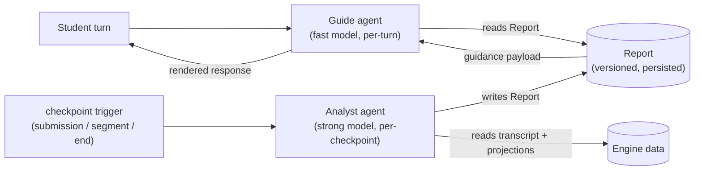

Stemolly không bị ràng buộc vào một nhà cung cấp AI duy nhất. Hệ thống dùng đồng thời nhiều LLM (mô hình ngôn ngữ lớn), mỗi model được ghép với đúng việc: model rẻ và nhanh xử lý các lượt hội thoại có khối lượng lớn; model mạnh hơn (và đắt hơn) đảm nhiệm phần suy luận vốn chỉ chạy thưa hơn nhiều. Không phần nào trong codebase được phép giả định một vendor (nhà cung cấp) cụ thể — Claude, GPT, Gemini hay model cục bộ đều có thể thay thế cho nhau. Các agent (tác tử) vận hành trải nghiệm gia sư nằm phía trên lớp model có thể hoán đổi này.

Trang này giải thích lớp nền mà các agent đó được xây dựng trên đó, thiết kế hai agent ở trung tâm của hệ gia sư, cách chúng trao đổi với nhau, và các quyết định vận hành giúp hệ thống vẫn dễ kiểm thử, dễ định tuyến và dễ quan sát.

---

## Lớp nền `@noetaris/harness`

Các agent của Stemolly được xây dựng trên **`@noetaris/harness`**, một agent framework (khung tác tử) TypeScript do chính chúng tôi sở hữu trọn vẹn. Harness biểu diễn một agent như một directed graph (đồ thị có hướng) gồm nhiều bước, với field schema (lược đồ trường) có kiểu cho state (trạng thái). Các dependency (phụ thuộc) — bao gồm cả chính LLM — được đưa vào qua `h.provide()`, và LLM là một `model` slot được đặt tên, có thể thay thế mà không cần chạm vào logic của agent.

Trước đây, cách làm là tự viết các adapter (bộ điều hợp) cho từng provider (nhà cung cấp), rồi dựng thêm cả một gateway layer hoàn chỉnh. Cách đó đã được thay bằng harness vì hai lý do:

1. **Vendor confinement.** SDK của các provider (Anthropic, OpenAI, Google, Ollama) giờ nằm hoàn toàn trong các gói adapter ngoài repo của chúng tôi (`harness-anthropic`, `harness-openai`, v.v.), và tất cả đều hiện thực cùng giao diện `LLM` của `harness-types`. Chúng tôi không đụng vào mã của vendor.
2. **Explicit ownership over framework magic.** Harness thẳng thắn, dễ hiểu và được kiểm soát hoàn toàn — khác với LangChain hay các framework tương tự, nơi hành vi nảy sinh từ những quy ước ngầm. Điều này khớp với nguyên tắc "explicit over magic" của dự án.

Khi đã có harness, module `llm` thu gọn từ một gateway đầy đủ thành một **lớp policy (chính sách) mỏng** với bốn nhiệm vụ:

- **Tier registry** (bảng đăng ký tier) — ánh xạ các cặp `(tier, purpose)` sang một model và đơn giá cụ thể.
- **Versioned prompt registry** (bảng đăng ký prompt có phiên bản) — lưu và lấy các mẫu prompt theo phiên bản.
- **Tagged metering** (đo đếm có gắn nhãn) — ghi các dòng `llm_calls` bám trên các span của `harness-otel`.
- **Runtime assertions** (kiểm tra ràng buộc lúc chạy) — chặn các purpose chưa đăng ký hoặc lời gọi sai khuôn dạng.

```
┌─────────────────────────────────────────────┐
│               llm module                    │
│  tier registry → resolveTier(tier, purpose) │
│  prompt registry → versioned templates      │
│  metering wrapper → llm_calls rows (otel)   │
│  runtime assertions → guard rails           │
└────────────────┬────────────────────────────┘
                 │ harness-types LLM interface
     ┌───────────┼───────────┐
     ▼           ▼           ▼
anthropic     openai      ollama
 adapter      adapter     adapter
```

### Cách một completion đi tới model: `agent.run()`

Adapter trước đây điều khiển một completion bằng cách gọi thẳng `model.invoke()`, rồi tự nối các lời gọi vòng đời của observer (`bindObserver()`, `onRunStart`, `onRunEnd`). Đó chỉ là một cách lách tạm — nó buộc phải giả lập một `RunContext` mà lẽ ra harness phải tự tạo.

Khi đọc chính mã nguồn `create-agent.ts` và `loop-executor.ts` của harness, chúng tôi nhận ra cách lách đó là không cần thiết. Giờ đây, adapter bọc mỗi completion trong một lời gọi **`agent.run()` chỉ có một node**. Harness tự động gọi `bindObserver()` trên mọi resource slot và điều khiển `onRunStart`/`onRunEnd` ở mọi đường thoát — kể cả khi thất bại. Nhờ vậy, span của `harness-otel` được mở dưới một root-span thật của run thay vì một root-span dựng tạm.

Có một điểm tinh tế cần lưu ý: `agent.run()` **không bao giờ reject** khi một step lỗi. Một step ném lỗi sẽ resolve thành `{ signal: '$error', state: { $error } }`. Adapter sẽ rẽ nhánh theo `outcome.signal` rồi ném lại `outcome.state.$error` để giữ nguyên hợp đồng promise-reject của `LLMPort.complete()` mà bên gọi đang trông đợi. Các lỗi khi dựng harness (ví dụ `NoNextStepError`) thì vẫn reject — và nên như vậy, vì đó là bug.

---

## Hệ gia sư hai agent: Guide và Analyst

Trải nghiệm gia sư được vận hành bởi **hai agent làm việc theo hai chế độ khác nhau**.

Hãy hình dung một trung tâm gia sư: một giáo viên chuyên môn sâu sẽ phân tích kỹ bài làm của học viên giữa các buổi học, rồi chuyển hướng dẫn có cấu trúc cho người đứng lớp trực tiếp điều hành buổi học. Stemolly đi theo đúng mô hình đó.



### Guide — agent tuyến đầu, chạy nhanh

**Guide** chạy trên một model nhẹ, nhanh và song ngữ. Nó được kích hoạt ở mọi lượt của học viên, và chịu trách nhiệm:

- Trả lời bằng ngôn ngữ của học viên.
- Kết xuất lesson plugin và các thành phần giao diện.
- Xử lý những trao đổi qua lại thường nhật.

Guide **không chẩn đoán hay suy luận**. Nó không bao giờ tự nghĩ ra một ngộ nhận, không bao giờ cập nhật belief graph (đồ thị niềm tin), và cũng không tự tạo ra nội dung mà nó đang dạy. Nó chỉ trình bày điều mà Analyst đã kết luận; nó không quyết định kết luận đó phải là gì.

### Analyst — agent nền, chạy mạnh

**Analyst** chạy trên một model mạnh dưới dạng **asynchronous job (tác vụ bất đồng bộ)**. Nó chỉ kích hoạt tại các checkpoint (mốc kiểm tra) có ý nghĩa — sau một bài nộp, sau một phân đoạn bài học, hoặc khi kết thúc bài học — chứ không chạy ở mọi lượt. Nó chịu trách nhiệm:

- Chẩn đoán mức độ hiểu của học viên.
- Ghi vào belief graph các quan sát bằng chứng đã định kiểu, các mục khớp với catalog, probe plan và các dự đoán.
- Ra quyết định sư phạm (Guide nên làm gì tiếp theo).
- Tạo ra các hiện vật ở ngôn ngữ nội dung khi cần (ví dụ một câu tiếng Anh đã sửa cho bài tập IELTS).

Vì Analyst chạy ngoài lượt hội thoại, chi phí của nó không cộng vào độ trễ đối thoại. Đây là cốt lõi trong mô hình chi phí và độ trễ của Stemolly: phần việc đắt tiền chạy hiếm, phần việc rẻ gánh khối lượng lớn.

### Ghi chú về tên gọi

Trong các tài liệu cũ, hai agent này được gọi là **Interface** (phía trước) và **Expert** (phía sau). Những tên đó đã được thay vì "Interface" đụng với quá nhiều nghĩa khác trong hệ thống — plugin interface, API contract, hay chính bề mặt UI. Tên chuẩn hiện nay là **Guide** và **Analyst**. Chúng là các giá trị enum `agentRole` được dùng trong metering và trong định tuyến tier/purpose (`role=guide`, `role=analyst`).

---

## Guide và Analyst trao đổi với nhau thế nào: Report

**Report** là kênh duy nhất giữa Analyst và Guide. Không có side channel (kênh phụ) nào khác. Đây là một ràng buộc có chủ đích.

Report có các đặc tính sau:
- **Có phiên bản** — mang `schemaVersion` và được kiểm tra ở ranh giới API.
- **Được lưu trước khi dùng** — Analyst ghi Report vào nơi lưu trữ trước khi Guide đọc nó. Guide luôn đọc từ nơi lưu trữ, không bao giờ đọc trực tiếp từ một lời gọi Analyst đang chạy.
- **Là bản ghi suy luận có thể kiểm tra trong Observe** — vì Report là một hiện vật được lưu, khu vực Observe của Console có thể hiển thị và chấm điểm suy luận của Analyst mà không cần thêm công cụ ghi đo nào khác.

Nếu một checkpoint job thất bại hoặc đến trễ, Guide vẫn tiếp tục phục vụ dựa trên **Report trước đó**. Cuộc hội thoại với học viên vẫn tiếp diễn — với hướng dẫn hơi cũ một chút, nhưng không bao giờ bị khựng lại. Tác vụ sẽ được thử lại ở nền.

### Khoảng trống thiết kế còn mở: schema của Report

Các bảo đảm ở cấp độ envelope nêu trên đã được chốt. Nhưng **schema cụ thể đến từng trường của Report thì vẫn chưa được thiết kế**.

Những trường còn cần định nghĩa gồm:

- **Guidance payload** — chính xác thì Guide sẽ đọc loại chỉ dẫn có cấu trúc nào.
- **Contingent guidance** — các nhánh kiểu "nếu học viên thử X thì làm Y". Điều này quan trọng vì Guide có thể phải phục vụ vài lượt dựa trên cùng một Report giữa các checkpoint; nó cần đủ thông tin để xử lý các tình huống rẽ nhánh mà không phải gọi lại Analyst.
- Các trường **probe-plan** và **prediction**.

Trong phần tự rà soát của chính bản thiết kế, đây được đánh dấu là **nhiệm vụ mở gánh tải nhiều nhất** trong toàn bộ kiến trúc. Nếu schema không diễn đạt tốt contingent guidance, hệ thống sẽ chịu áp lực phải chạy Analyst ở mọi lượt — và như vậy sẽ làm sụp đổ mô hình chi phí mà việc tách hai agent được tạo ra để bảo vệ. Tính đến giữa tháng 7 năm 2026, `app/packages/contracts/src` mới chỉ có `error-envelope.ts`; schema của Report vẫn chưa được mã hóa.

---

## Ngôn ngữ suy luận được quyết định theo từng domain, không bị cố định là tiếng Anh

Analyst không phải lúc nào cũng suy luận bằng tiếng Anh. Quy tắc là: **dùng ngôn ngữ nào giúp tránh một vòng dịch qua lại gây mất mát trên chính bài làm của học viên**.

- Với các domain nội dung bằng tiếng Anh (IELTS writing, SAT), Analyst làm việc trực tiếp bằng tiếng Anh.
- Với các domain nội dung không phải tiếng Anh (Toán K11 tiếng Việt), nếu ép dùng tiếng Anh thì sẽ phải dịch lập luận tiếng Việt của học viên sang tiếng Anh để Analyst xử lý, rồi dịch kết quả ngược trở lại — tức là chèn một bước dịch dễ mất mát đúng vào phần bằng chứng dùng để phát hiện ngộ nhận. Vì thế Analyst sẽ suy luận bằng chính ngôn ngữ của nội dung.

Ngôn ngữ suy luận là một **cấu hình theo từng domain** trên Analyst, với giá trị mặc định là ngôn ngữ của nội dung. Lợi thế hiệu năng mà người ta thường gán cho tiếng Anh trong LLM là nhỏ, và với toán học (vốn chủ yếu mang tính ký hiệu), nó không bù nổi chi phí dịch.

Có một quy tắc nhất quán áp dụng bất kể ngôn ngữ suy luận là gì: **ID của các node trong belief graph luôn dùng tiếng Anh chuẩn hóa**, vì các ID đó cần trung lập ngôn ngữ để đồ thị hoạt động xuyên domain.

---

## Định tuyến theo tier và purpose: `resolveTier()`

Mọi lời gọi LLM đều đi qua `resolveTier(tier, purpose)` trước khi một model được dựng lên. Hàm này là nơi duy nhất có thẩm quyền ánh xạ một cặp `(tier, purpose)` — tức cấp và mục đích — sang một model ID và đơn giá thanh toán cụ thể.

`resolveTier()` là **câu lệnh đầu tiên** trong `createLlmProviderAdapter.complete()` của `adapter.ts`. Nếu `purpose` chưa được đăng ký, lời gọi sẽ ném lỗi ngay lập tức — trước khi bất kỳ model nào được gọi và trước khi bất kỳ dòng metering nào được ghi. Trước đây, một purpose chưa đăng ký vẫn có thể âm thầm gọi model và ghi một dòng thanh toán theo bất kỳ đơn giá nào tình cờ nằm trong một bảng tra cứu đã được làm phẳng; bảng đó nay đã bị loại bỏ.

`modelConfig.model` sau khi phân giải sẽ được truyền như tham số thứ hai bắt buộc vào `resolveHarnessModel(config, modelId)`, hàm chỉ biết cách dựng đối tượng có thể gọi được cho một provider cụ thể. Hai trách nhiệm này được tách bạch: `resolveTier` quyết định *dùng model nào* và *đơn giá nào*; `resolveHarnessModel` quyết định *dựng nó ra sao*.

### Giữ cho registry vẫn dễ bảo trì

Tier registry hiện nằm trong `llm/domain/tiers.ts` cùng với logic `resolveTier` và `computeCost`. Chúng được kỳ vọng sẽ thay đổi với tốc độ khác nhau: dữ liệu registry đổi thường xuyên (purpose mới, model mới, đơn giá cập nhật); còn logic phân giải thì hiếm khi đổi. Trộn chúng lại với nhau khiến người bảo trì chỉ muốn sửa một đơn giá cũng phải đọc qua cả phần logic ném lỗi mà họ không cần.

Cách sửa dự kiến (được theo dõi ở issue #30) là tách chúng ra thành các file riêng:
- `tier-types.ts` — các kiểu dùng chung `Tier` và `ModelConfig` (không có logic, không có dữ liệu).
- `tier-registry.ts` — bảng dữ liệu `TIER_REGISTRY`, import từ `tier-types.ts`.
- `tiers.ts` (hoặc tên tương đương) — logic `resolveTier`/`computeCost`, cũng import từ `tier-types.ts`.

Như vậy, đồ thị import sẽ là một DAG một chiều: file dữ liệu và file logic không import lẫn nhau. Registry tiếp tục được giữ ở TypeScript thuần (không phải YAML hay JSON), một quyết định đã được chốt trong ADR-005 dưới nguyên tắc "explicit over magic" và không mở lại.

---

## Kiểm thử mà không cần LLM thật: quy tắc mock-slot

Vì harness phơi LLM ra dưới dạng một `model` slot có thể hoán đổi, mọi bài kiểm thử tự động đều dùng **mock LLM (LLM giả lập) tất định** — hoặc adapter Ollama cục bộ miễn phí. Không có bài kiểm thử tự động nào được phép gọi provider thật. Đây là một quy tắc cứng.

Phần tách bạch như sau:

| Cấp độ | Điều nó chứng minh | Cách làm |
|-------|---------------|-----|
| Cấp 0 | Hệ thống dây nối hoạt động (định tuyến, metering, xử lý lỗi) | Slot giả lập/cục bộ + `@noetaris/harness-testing` |
| Cấp 1 | Mô hình niềm tin là đúng (chất lượng chẩn đoán, groundedness) | Bộ khung đánh giá offline, adapter Claude thật |

Một bài kiểm tra fitness-function trong CI sẽ khẳng định rằng `NODE_ENV=test` không bao giờ phân giải sang provider vendor thật. Việc chuyển bất kỳ agent nào từ mock sang Claude thật chỉ là thay đổi một dòng ở slot — cũng chính là cơ chế biến tính độc lập với LLM thành điều cụ thể chứ không chỉ là mục tiêu trên giấy.

---

## Operational observability là một mối quan tâm riêng

Stemolly có **hai công việc observability riêng biệt** và chúng tuyệt đối không được lẫn với nhau.

**Validation observability** ("engine có đúng không?") kiểm tra xem mô hình niềm tin có chính xác hay không — groundedness precision, predictive validity, khả năng soi belief graph. Đây là một năng lực chức năng được hiện thực trong khu vực Observe của Console.

**Operational observability** ("hệ thống có khỏe và có đủ rẻ không?") là một yêu cầu phi chức năng. Nó bao quát:

- **Chi phí** — mức chi LLM và số token theo từng lượt, từng phiên, từng học viên, từng bài học và từng domain, có tách theo model tier và theo agent role (`guide` / `analyst`).
- **Hiệu năng LLM** — độ trễ theo từng agent role, tỷ lệ lỗi/timeout/thử lại, khả năng nhìn thấy việc định tuyến model, thông lượng.
- **Tín hiệu độ tin cậy** — lỗi lưu trữ, vi phạm guardrail.

Việc tách theo agent role quan trọng vì một lý do rất cụ thể: mô hình hai agent được xây trên giả định rằng Analyst (đắt) chạy hiếm, còn Guide (rẻ) gánh phần lớn lưu lượng. Giả định đó chỉ có thể được kiểm chứng bằng cách theo dõi chi phí và độ trễ tách theo agent role. Nếu các con số này bắt đầu lệch đi — nếu lời gọi Analyst xuất hiện quá thường xuyên — đó là tín hiệu sớm cho thấy thiết kế schema của Report không đứng vững dưới cách dùng thực tế.
