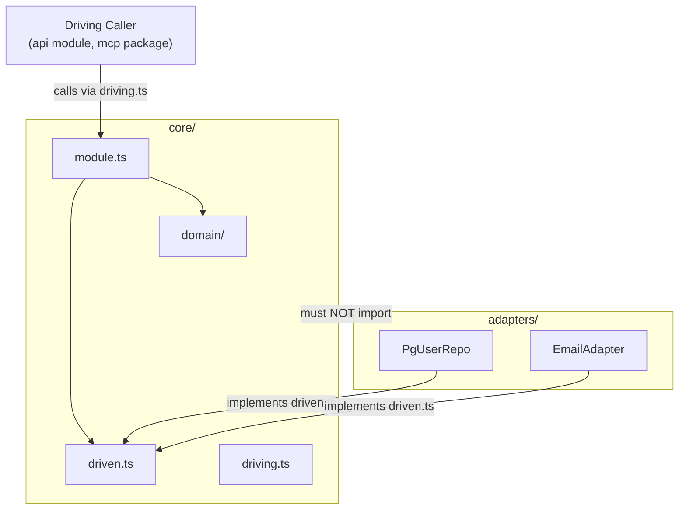

Mọi backend module (mô-đun backend) trong codebase (toàn bộ mã nguồn) này đều theo cùng một bố cục nội bộ: một **core ring** (vòng lõi) chứa toàn bộ business logic (logic nghiệp vụ), một **adapter ring** (vòng adapter) bao quanh với các hiện thực cụ thể, và một điểm vào công khai duy nhất. Hình dạng này xuất phát từ hexagonal architecture (kiến trúc lục giác), còn gọi là ports-and-adapters (cổng và adapter), nhưng tên gọi cụ thể, đường dẫn thư mục và cơ chế cưỡng chế đều là quyết định riêng của dự án — không phải quy ước hexagonal chung. Trang này giải thích từng lớp, vì sao nó có hình dạng như vậy, và những quy tắc giúp giữ nguyên cấu trúc đó.

## Bố cục hai vòng

Mỗi module (`engine`, `tutor`, `llm`, `identity`, v.v.) có cấu trúc trên đĩa như sau:

```
<module>/
  core/
    driving.ts    ← driving contract (điều bên gọi có thể yêu cầu module này làm)
    driven.ts     ← driven contracts (điều module này cần hạ tầng cung cấp)
    module.ts     ← orchestration — nối domain + driven contracts lại với nhau
    domain/       ← quy tắc thuần, projection, value type; không có I/O
  adapters/
    pg-*.ts       ← driven adapters: repo Postgres, dịch vụ bên ngoài, v.v.
  index.ts        ← public entry point; chỉ re-export
```

**Core ring** — tức mọi thứ nằm dưới `<module>/core/` — là phần bên trong của hình lục giác. Nó chứa các quy tắc domain, các interface mà module cung cấp ra ngoài (`driving.ts`), và các interface mà module *cần từ* hạ tầng (`driven.ts`). Điều quan trọng là không gì bên trong core ring được import bất cứ thứ gì từ `adapters/`. Chính quy tắc duy nhất đó tạo nên ranh giới hexagonal.

**Adapter ring** chứa các hiện thực cụ thể của driven contracts: Postgres repository, file-system binding, client cho dịch vụ bên thứ ba. Adapters phụ thuộc *hướng vào trong* core (chúng hiện thực một interface được định nghĩa trong `driven.ts`); còn core thì không bao giờ vươn *ra ngoài* tới chúng.



### Vì sao dùng một thư mục thay vì liệt kê file

Các phiên bản trước của quy tắc này xác định core như một danh sách file cụ thể (`domain/`, `ports.ts`, `module.ts`). Cách đó khiến việc cưỡng chế trở nên mong manh — cứ mỗi lần thêm file mới vào core thì lại phải cập nhật thủ công một quy tắc dependency-cruiser. Gom toàn bộ core vào một thư mục (`<module>/core/`) biến việc kiểm tra thành một mẫu đường dẫn duy nhất: bất kỳ thứ gì nằm dưới `core/` đều không được import bất kỳ thứ gì dưới `adapters/`. Nhờ đó, cả những file chưa được viết ra cũng tự động được bao phủ.

### Cách đặt tên: driving.ts và driven.ts

Trước đây các file contract (hợp đồng giao diện) được gọi là `api.ts` và `ports.ts`. Cả hai tên này đều không thể hiện hướng. `api` còn bị trùng với tên của module `api` ở cấp cao nhất. `ports.ts` thì gợi cảm giác là "toàn bộ các port", nhưng thực ra chỉ chứa nửa outbound.

Tên mới dùng lại đúng bộ từ vựng mà các quy tắc và ADR đã dùng — "driving surface" và "driven ports" — nên cả codebase chỉ còn một cặp từ thống nhất. Cái giá thực tế là `driving.ts` và `driven.ts` chỉ khác nhau ba ký tự nên dễ bị nhìn nhầm. Nhưng cái giá đó có giới hạn: một quy tắc dependency-cruiser cấm hai file này import lẫn nhau, nên nếu chọn nhầm thì CI sẽ báo lỗi ngay.

### domain/ có thể tự do import driven.ts

Một cách hiểu sai thường gặp về hexagonal architecture là `domain/` không được import bất cứ thứ gì bên ngoài chính nó, kể cả các port interface trong `driven.ts`. Dự án này không chọn cách đó. Driven contracts nằm *bên trong* hình lục giác — chúng là một phần của core ring — nên `domain/` được phép import `core/driven.ts`. Thứ mà `domain/` tuyệt đối không được import là `adapters/`.

Cấm `domain/ → driven.ts` là phong cách functional core / imperative shell (lõi hàm / vỏ mệnh lệnh) nghiêm ngặt hơn. Đó là một lựa chọn hợp lệ, nhưng không phải lựa chọn ở đây.

## Quy tắc leaf-adapter

Việc tách core/adapters quyết định code nằm ở đâu. Một quy tắc thứ hai quyết định adapter *là gì*:

> Một driven adapter hiện thực **chính xác một** driven contract, không giữ bất kỳ port nào khác làm dependency, và không chứa quyết định nào đáng ra có thể viết mà không cần I/O.

Hãy xem adapter như một lớp chuyển dịch mỏng — nó nói ngôn ngữ của một hệ thống bên ngoài (SQL, HTTP, đường dẫn file) và không hơn thế. Orchestration (điều phối) — quyết định *gọi adapter nào* và theo thứ tự nào — thuộc về `module.ts`. Các quy tắc domain thuộc về `domain/`. Một adapter bắt đầu tích lũy logic là adapter đã nhận thêm một vai trò vốn phải nằm ở nơi khác.

Quy tắc này được ghi lại cùng với quy tắc cấm core import adapters là có lý do: chỉ ghi lại quy tắc thứ nhất chính là cách đã khiến quy tắc thứ hai bị trôi đi. Module `identity` tuân thủ cả hai và là implementation (cách hiện thực) tham chiếu. `metering` từng vi phạm mệnh đề thứ nhất — import adapter của chính nó vào core — cho tới khi được sửa.

### Vì sao adapter ring chỉ chứa driven adapters

Thư mục `adapters/` chỉ chứa driven adapters (adapter outbound). Không có driving adapters (adapter inbound) nào nằm bên trong một module. Phía driving nằm hoàn toàn bên ngoài module: các route Fastify của module `api` cho ứng dụng, hoặc package `mcp/` trong workspace cho engine PoC.

Điều này đúng ở cả bốn module đã có nội dung thực và đã đúng ngay từ module đầu tiên, nhưng mãi gần đây mới được viết thành tài liệu. Cái giá của việc không nói rõ là: một người quen với hexagonal architecture mở `adapters/`, chỉ thấy repository, rồi kết luận bố cục còn thiếu. Thực ra không thiếu — sự bất đối xứng đó là cấu trúc cố hữu và nhất quán. Nó xuất phát từ topology (cấu trúc tổng thể) của monolith: phía driving luôn là một module khác hoặc một package khác, chứ không bao giờ là một thư mục lồng bên trong module đang được điều khiển.

## Cưỡng chế: dependency-cruiser và ESLint

Hai công cụ riêng biệt được dùng để cưỡng chế hai invariant (bất biến) riêng biệt, vì không công cụ nào kiểm tra được phần việc của công cụ kia.

### dependency-cruiser (quy tắc ở mức file)

`app/.dependency-cruiser.cjs` là kiến trúc ở dạng máy đọc được của dự án này. Theo đúng định nghĩa, một PR thay đổi một cạnh phụ thuộc được phép chính là một thay đổi kiến trúc và phải viện dẫn ADR tương ứng.

Config này mã hóa bốn nhóm quy tắc:

| Quy tắc | Nội dung kiểm tra |
|---|---|
| `engine-no-upward-deps` | Lõi domain không import gì từ orchestration hoặc các module biên |
| `declared-edges-only` | Mọi import liên mô-đun chưa khai báo đều là lỗi |
| `no-deep-cross-module-imports` | Chỉ được chạm tới một module thông qua `index.ts` của nó |
| `core-no-adapters-import` | Không gì dưới `<module>/core/` được import `<module>/adapters/` |

Trong CI, nó chạy dưới tên `depcruise:check`. Config này chỉ có ý nghĩa nếu nó thực sự báo lỗi khi có vi phạm — cổng CI đã được xác minh bằng cách cố ý cấy một import bị cấm và xác nhận build chuyển sang màu đỏ.

#### Những gì dependency-cruiser không kiểm tra được

`dependency-cruiser` suy luận ở mức file: nó chỉ thấy file A import file B, không hơn. Quy tắc leaf-adapter — "adapter này chỉ giữ đúng một port" — lại là một quy tắc ở mức symbol granularity (độ hạt theo ký hiệu). Mọi adapter đều import cùng một file `driven.ts` một cách hợp lệ, bất kể chúng đang giữ bao nhiêu port làm dependency. Một lần chạy `depcruise` sạch không thể phân biệt một leaf adapter với một adapter đang âm thầm giữ ba port. Trong ba issue liên tiếp, một lần chạy `depcruise` sạch đã bị hiểu thành bằng chứng ranh giới vẫn khỏe mạnh, dù trên thực tế nó không bao giờ có thể phát hiện lỗi đó.

Có một kỹ thuật có thể đẩy một mối quan tâm ở mức symbol xuống mức file: đặt hai phía vào hai file riêng. Khi `driving.ts` và `driven.ts` là hai file tách biệt, câu "hai contract này không được phản chiếu lẫn nhau" sẽ trở thành "hai file này không được import lẫn nhau" — một quy tắc mà công cụ dựa trên đường dẫn có thể diễn đạt. Quy tắc import qua lại này được triển khai bằng hai mục `from`/`to` (mỗi chiều một mục), vì một mục đơn chỉ kiểm tra được một chiều.

### Quy tắc ESLint AST G-21 (cưỡng chế leaf-adapter)

Vì dependency-cruiser không diễn đạt được quy tắc leaf-adapter, quy tắc này được cưỡng chế bằng một quy tắc ESLint `no-restricted-syntax` (G-21) áp dụng cho `server/src/*/adapters/**/*.ts`. Quy tắc này đánh dấu mọi class property, constructor parameter property, hoặc trường trong deps-interface có tên kiểu kết thúc bằng `Port`, `Repository`, hoặc `Store`. Việc hiện thực một port là một node `TSClassImplements` nên không bị chạm tới — adapter vẫn có thể khai báo interface mà nó đáp ứng; nó chỉ không được *giữ* một port làm dependency.

G-21 có một điểm mù đã được nêu rõ: nó dựa vào quy ước hậu tố đặt tên. Một kiểu port được đặt tên ngoài ba hậu tố đó sẽ vô hình với nó. Vì vậy, quy ước đặt tên ở đây là thứ gánh tải, không chỉ là chuyện hình thức.

## Các bẫy của ESLint Flat Config

Dự án dùng ESLint flat config (cấu hình phẳng của ESLint) qua `eslint.config.js`. Trong quá trình phát triển đã có hai lỗi liên quan tác động tới các block `no-restricted-syntax`, và bạn nên biết về chúng.

### Tùy chọn cũ âm thầm quay lại khi override chỉ đổi severity

Khi một block config phía sau đặt một rule thành giá trị không chứa option nào — ví dụ `['error']` hoặc `['error', ...[]]` khi phần spread rỗng — cơ chế merge của config-array trong ESLint *không xóa* các option của block trước. Nó giữ lại các option cũ và chỉ thay severity. Block phía sau trông có vẻ đã override rule, nhưng thực ra lại âm thầm nhận lại các selector từ block trước.

Điều này từng xảy ra ở `engine-poc/mcp/eslint.config.js` khi một override tính giá trị `no-restricted-syntax` của nó bằng cách lấy danh sách gốc trừ đi một selector; đúng lúc đó danh sách còn lại rỗng, nên biểu thức co về dạng chỉ còn severity và vô tình nhận lại chính selector mà nó đang muốn bỏ.

**Cách sửa:** loại file đó khỏi block trước bằng `ignores: ['path/to/file.ts']` thay vì trông đợi một block phía sau override nó. Như vậy sẽ không có lần merge chéo block nào diễn ra nữa.

### ignores loại trừ khỏi cả block, không chỉ một selector

Cách sửa ở trên cũng có cái giá riêng. Trong ESLint flat config, `ignores` hoạt động ở cấp block: nó loại các file khớp khỏi *mọi* rule mà block đó đặt ra, chứ không chỉ khỏi một selector trong một rule tổng hợp. Nếu một block dùng chung gộp nhiều selector `no-restricted-syntax` với nhau, việc thêm một file vào `ignores` của block đó để miễn cho nó khỏi một selector sẽ âm thầm miễn luôn khỏi tất cả selector còn lại.

Điều này từng xảy ra trong `app/eslint.config.js`: một mục `ignores` được thêm vào vì một selector, rồi về sau lại âm thầm làm rơi mất selector thứ hai được thêm vào cùng block đó — và lỗi này đã lọt qua hai vòng review.

**Cách sửa:** đừng bao giờ nới rộng `ignores` của một block dùng chung chỉ để miễn trừ cho một selector. Thay vào đó, giữ nguyên `ignores` của block dùng chung và thêm một block riêng ở cuối cho các file cần được xử lý khác đi, rồi khai báo lại những selector nào vẫn phải tiếp tục áp dụng ở đó.

## `index.ts` chỉ dùng làm barrel

`index.ts` của mọi module chỉ được chứa các lệnh re-export — không được định nghĩa schema, class, interface hay factory function trực tiếp trong đó. Mọi implementation phải nằm trong các file đồng cấp riêng, rồi để `index.ts` re-export lại. Quy tắc này được phát hiện như một khoảng trống ở buổi review Sprint 1, khi nhiều module (`contracts`, `errors`, `logger`, `persistence`, `metering`, `llm`, và các module khác) bị phát hiện đang định nghĩa logic thực sự trực tiếp trong `index.ts`.

```ts
// ✅ correct — index.ts is a barrel
export { createLlmGateway } from './gateway';
export type { LlmPort } from './core/driven';

// ❌ wrong — logic defined inline in index.ts
export function createLlmGateway(deps: Deps) { … }
```

Quy tắc này được áp dụng nghiêm ngặt: kể cả module factory function cũng nằm trong phạm vi. Ngoại lệ gồm entry point của tiến trình `server/src/index.ts` và các stub barrel rỗng làm placeholder. Quy tắc được cưỡng chế bằng một CI fitness function.

## Composition Root: Wiring factory tường minh

Khi khởi động, public factory (hàm khởi tạo công khai) của từng module — ví dụ `createLlmGateway(deps)`, `createMeteringModule(deps)` — được nối với nhau thủ công trong một composition root (điểm ghép nối trung tâm) duy nhất là `server/src/composition.ts`. Dự án không dùng DI container (bộ chứa tiêm phụ thuộc) với cơ chế auto-wiring dựa trên decorator hoặc reflection.

Lý do cũng là nguyên tắc "tường minh hơn là ma thuật" đã dẫn dắt nhiều quyết định khác trong codebase này: một container che giấu đồ thị phụ thuộc đúng ở nơi mà kỷ luật ranh giới của modular monolith cần nó phải hiện ra rõ nhất. Khi đọc `composition.ts`, bạn thấy toàn bộ wiring ở một chỗ. Còn khi auto-wiring lắp ráp mọi thứ một cách vô hình, việc vi phạm ranh giới sẽ không để lại hậu quả nhìn thấy được cho tới khi có thứ hỏng ở runtime.

## Vị trí đặt test

Ranh giới core/adapters cũng áp dụng cho file test. Một kiểm tra dựa trên đường dẫn không thể phân biệt file test với file source, và cũng không nên phân biệt — vì ngoại lệ đó sẽ trở thành chính lỗ thủng trong ranh giới.

Một integration test (kiểm thử tích hợp) tạo ra các đối tượng adapter thật (ví dụ một `PgUserRepository` chạy với cơ sở dữ liệu thật) không thể nằm trong `core/` — vì nó sẽ import từ `adapters/`, và như vậy sẽ vi phạm quy tắc `core-no-adapters-import`. Vì thế, unit test và integration test của cùng một đối tượng sẽ tách ra:

- `core/module.test.ts` — sống cùng file mà nó kiểm thử, bên trong core ring
- `module.integration.test.ts` — nằm ngoài core ring, cùng cấp với `adapters/`

Vitest vốn đã tách hai hậu tố này thành các lượt chạy khác nhau, nên cách chia này đi theo một đường ranh sẵn có, chứ không tạo ra một đường ranh mới.

## Ngoại lệ của module persistence

Module `persistence` là một pure adapter module (mô-đun adapter thuần), không có phân lớp hexagonal bên trong. Phần scaffold `domain/`, `ports.ts` và `adapters/` của nó đã bị xóa, chỉ để lại `pool.ts` và một `index.ts` để re-export.

Lập luận mang tính quyết định là: công việc duy nhất của module này là tạo một `pg.Pool` và chuyển nó cho các module khác. Không ai có thể chỉ ra công việc tương lai nào sẽ làm đầy `persistence/domain/`. Một stub comment kiểu *"intentionally empty until a later issue adds real business rules"* chỉ là một lời hứa sai — nó bảo mọi người đọc về sau chờ một thứ vốn sẽ không bao giờ đến.

Điều này rõ ràng **không** phải tiền lệ để xóa stub ở những nơi khác. Vẫn còn khoảng ba mươi file placeholder trên các module khác (`engine`, `tutor`, `pedagogy`, v.v.), nơi business logic tương ứng thực sự sẽ xuất hiện ở một sprint sau — những stub đó vẫn được giữ lại. Việc xóa ở `persistence` là một cánh cửa hai chiều: nếu sau này thật sự xuất hiện một port đúng nghĩa, thư mục đó có thể quay lại chỉ trong một commit.

:::note
`persistence` cùng với `api` và `jobs` nằm trong ngoại lệ đã được tài liệu hóa về việc không cần có thư mục `domain/`. Mệnh đề "barrel rỗng được miễn R-24" trong quy tắc `index.ts` chỉ dùng làm barrel vẫn còn hiệu lực và vẫn cần thiết cho 27 placeholder stub còn lại ở các module khác.
:::
