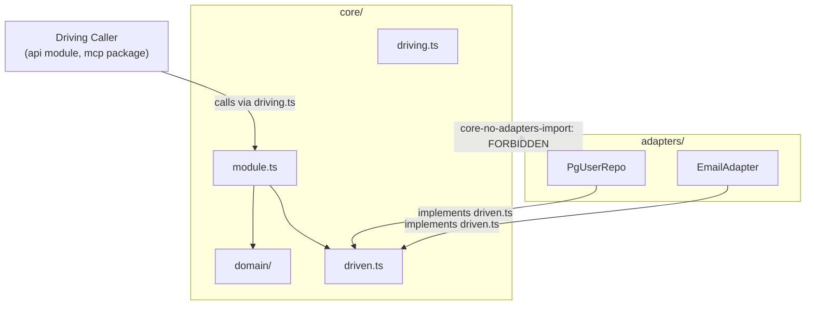

Mỗi backend module (mô-đun backend) trong Stemolly đều có cùng một hình dạng nội bộ: một **core ring** (vòng lõi) được bảo vệ, chứa business logic (logic nghiệp vụ) thuần túy, và một **adapter ring** (vòng adapter) bên ngoài, chứa các hiện thực I/O cụ thể. Trang này giải thích bố cục đó, các quy tắc giữ cho nó vận hành đúng, và vì sao chúng được thiết kế như vậy.

## Bố cục hai vòng

Mỗi module (ví dụ `engine`, `tutor`, `llm`, `identity`) được chia thành hai vòng.

```
<module>/
├── core/           ← inner ring: pure logic, no I/O
│   ├── driving.ts  ← driving contract (how callers invoke this module)
│   ├── driven.ts   ← driven contracts (interfaces the module needs from infrastructure)
│   ├── module.ts   ← orchestration: wires domain logic with driven ports
│   └── domain/     ← pure rules and domain types
├── adapters/       ← outer ring: concrete implementations (Postgres repos, harness bindings, etc.)
└── index.ts        ← the only file other modules may import
```

Core ring nằm gọn trong một thư mục — `<module>/core/` — vì một lý do rất cụ thể: khả năng cưỡng chế. Khi core là một thư mục duy nhất, quy tắc "chỉ được đi vào trong" chỉ còn là một mẫu đường dẫn. Trước đây, core được mô tả như một danh sách file (`domain/`, `ports.ts`, `module.ts`), nên phải viết một quy tắc dependency-cruiser (công cụ kiểm tra đồ thị phụ thuộc) cho từng file, tự bảo trì bằng tay, và lại hỏng mỗi khi có thêm file core mới. Khi gom thành một thư mục, quy tắc đó tự động bao phủ cả những file core chưa tồn tại.

## Bất biến chỉ-hướng-vào-trong

Quy tắc quan trọng nhất là: **không có gì trong core ring được import từ adapter ring**. Adapters được khởi tạo trong `composition.ts` rồi tiêm vào trong, chứ không bao giờ bị core kéo vào.

Quy tắc này có hai nửa phải được nêu cùng nhau, vì trước đây chỉ ghi lại một nửa đã khiến nửa còn lại bị trôi đi.

**Nửa 1 — core không bao giờ import adapters.** Điều này được thể hiện bằng quy tắc dependency-cruiser `core-no-adapters-import`. Trước đây, quy tắc hẹp hơn là `domain-no-adapters-import` chỉ bao phủ `domain/`; file điều phối module là `module.ts` nằm ngoài phạm vi đó và có thể tự do import adapters — đúng điều `metering` đã làm mà vẫn qua hết mọi cổng kiểm tra. Mệnh đề `from` của quy tắc sau đó được mở rộng thành `^src/(<module>)/core/`, nên giờ nó bao trùm mọi file core.

**Nửa 2 — một adapter là một leaf (lá).** Một driven adapter hiện thực đúng một port, không giữ port nào khác làm dependency, và không chứa quyết định nào lẽ ra có thể viết mà không cần I/O. Việc orchestration (điều phối) qua nhiều port thuộc về `module.ts`; các business rule (quy tắc nghiệp vụ) thuộc về `domain/`. Module `identity` tuân thủ cả hai nửa và là cách hiện thực tham chiếu.

:::note
Tính đến lần kiểm tra gần nhất, module `metering` vẫn còn vi phạm Nửa 1 — nó import adapter của chính nó bên trong `module.ts`. Hãy dùng `identity` làm tham chiếu, đừng dùng `metering`.
:::



### Vì sao Nửa 2 không thể dùng dependency-cruiser

Mọi adapter đều import cùng một file `driven.ts` một cách hoàn toàn hợp lệ — để khai báo port mà nó hiện thực. Vì vậy, trường hợp vi phạm (giữ *hai* port) và trường hợp đúng (giữ một port) trông giống hệt nhau dưới góc nhìn của một công cụ đồ thị import ở mức file. Dependency-cruiser không thể phân biệt hai trường hợp đó.

Cách khắc phục là dùng quy tắc ESLint `no-restricted-syntax` (G-21), áp dụng cho `server/src/*/adapters/**/*.ts`. Quy tắc này đánh dấu mọi class property, constructor parameter, hoặc trường trong deps-interface có tên kiểu kết thúc bằng `Port`, `Repository`, hoặc `Store`. Một adapter vẫn có thể *implement* một port interface — đó là node `TSClassImplements` và không bị đụng tới.

Vì vậy, quy ước đặt tên với hậu tố `Port` / `Repository` / `Store` là thứ **gánh tải thực sự**. Một kiểu port được đặt tên ngoài các hậu tố đó sẽ vô hình với G-21. Đây là một điểm mù đã được nêu rõ, không phải sơ suất.

### Một sắc thái cần lưu ý: domain/ được phép import driven.ts

`core/domain/` được phép tự do import `core/driven.ts`. Điều này đôi khi khiến những người quen với biến thể chặt hơn của hexagonal architecture (kiến trúc lục giác), gọi là "functional core / imperative shell", thấy bất ngờ, vì trong biến thể đó code domain hoàn toàn không được đụng tới port interface. Nhưng đó là một lựa chọn khác, chặt hơn, mà Stemolly chủ ý không áp dụng. Trong ports-and-adapters (cổng và adapter) theo nghĩa chuẩn, port interface định nghĩa những gì core cần — chúng nằm *bên trong* hình lục giác, không phải ở bên ngoài.

Hệ quả thực tế là các kiểu record dùng chung được khai báo một lần trong `domain/` rồi được `driven.ts` import ra ngoài. Nếu lặp lại cùng một kiểu ở cả hai file, bạn sẽ tạo ra một đường nối chỉ type-check (kiểm tra kiểu) được do ngẫu nhiên, mà không có gì phát hiện độ lệch khi một phía thay đổi.

## Tên file contract: driving.ts và driven.ts

Hai file contract được đặt tên là `core/driving.ts` và `core/driven.ts`. Chúng thay thế cho `api.ts` và `ports.ts`.

- `ports.ts` gợi cảm giác là "toàn bộ các port" nhưng thực ra chỉ chứa nửa đi ra ngoài.
- `api.ts` bị trùng với chính tên của module `api`.
- `inbound.ts` / `outbound.ts` đã được cân nhắc rồi loại bỏ — bộ ADR và tập quy tắc hiện đã dùng nhất quán "driving surface" và "driven ports", nên thêm một cặp từ khác chỉ khiến một khái niệm có tới hai bộ từ vựng.

Cái giá đã biết là `driving.ts` và `driven.ts` chỉ khác nhau ba ký tự nên rất dễ đọc nhầm. Nhưng cái giá đó có giới hạn: một quy tắc dependency-cruiser cấm hai file này import lẫn nhau, nên nếu lấy nhầm file thì CI sẽ hỏng ngay.

Việc tách driving contract và driven contracts thành hai file riêng còn phục vụ cho cưỡng chế. Quy tắc "hai thứ này không được phản chiếu lẫn nhau" được biến thành "hai file này không được import lẫn nhau" — đúng kiểu quy tắc mà công cụ dựa trên đường dẫn có thể diễn đạt dưới dạng một cặp đường dẫn bị cấm theo hai chiều.

## Driven adapters luôn là outbound

Thư mục `<module>/adapters/` chỉ chứa **driven (outbound) adapters** — repository Postgres, email dạng file, binding cho LLM harness. Phía driving (inbound) không bao giờ được đặt ở đây. Nó nằm ở Fastify routes của module `api` cho ứng dụng, hoặc ở package workspace `mcp/` cho bản proof-of-concept của engine.

Điều này nhất quán ở mọi module đã có nội dung thật (`identity`, `metering`, `llm`, `engine`) và đã đúng từ module đầu tiên. Chỉ là mãi gần đây nó mới được viết ra. Cái giá của việc để điều này không thành văn là: một người hiểu hexagonal architecture mở một module, thấy một thư mục tên `adapters/`, sẽ kỳ vọng cả hai phía đều ở đó; khi chỉ thấy repository, họ kết luận là còn thiếu gì đó. Thực ra thư mục ấy không thiếu gì cả. Sự bất đối xứng đó là cấu trúc. Không có kiểm tra CI nào cho điều này — không gì có thể tự động phân biệt driving adapter với driven adapter — nên nó vẫn phải được giữ bằng review.

## Quy tắc barrel cho index.ts

`index.ts` của mọi module phải chỉ chứa **các câu lệnh re-export**. Không được định nghĩa schema, class, interface có logic, hay factory function ngay trong đó. Mọi phần hiện thực phải nằm ở các file `.ts` đồng cấp riêng; `index.ts` chỉ việc re-export chúng.

Quyết định này được đưa ra sau khi một buổi review Sprint 1 phát hiện nhiều module (`contracts`, `errors`, `logger`, `persistence`, `metering`, `llm`, `api`) đang đặt logic thật trực tiếp trong `index.ts`. Quy tắc này được cưỡng chế bằng một CI fitness function.

```ts
// ✅ correct — index.ts is a re-export barrel
export { createLlmGateway } from './gateway';
export type { LlmPort } from './core/driven';

// ❌ wrong — logic defined inline in index.ts
export function createLlmGateway(deps: Deps) { /* ... */ }
```

Có hai ngoại lệ:
- Entry point của tiến trình là `server/src/index.ts`.
- Các stub barrel rỗng trong những module mà code thật sẽ được bổ sung ở sprint sau — chúng giữ chỗ đã dành trước và được miễn trong khi các stub đó vẫn còn là lời hứa chính xác.

## Cưỡng chế: dependency-cruiser như bản ghi kiến trúc

`app/.dependency-cruiser.cjs` là bản kiến trúc máy-đọc-được của dự án. Nếu thay đổi một cạnh được phép trong file đó thì theo đúng định nghĩa, đó là thay đổi kiến trúc và phải viện dẫn một ADR.

Config này mã hóa:

| Rule | Nội dung kiểm tra |
|---|---|
| `engine-no-upward-deps` (R-1) | Lõi domain không import gì từ orchestration hay các module biên |
| `declared-edges-only` | Mọi import xuyên mô-đun chưa được khai báo đều là lỗi |
| `no-deep-cross-module-imports` (R-3) | Chỉ được đi vào một module qua `index.ts` của nó |
| `core-no-adapters-import` | Không gì bên dưới `<module>/core/` được import từ `<module>/adapters/` |

Config này chạy trong CI qua `depcruise:check`. Trường hợp phủ định — CI chuyển đỏ khi cố tình tạo một vi phạm — chính là bằng chứng cho thấy từng cổng kiểm tra thật sự có lực cắn.

### Những gì dependency-cruiser không kiểm tra được

Dependency-cruiser suy luận ở độ hạt cấp file. Quy tắc leaf-adapter (Nửa 2 ở trên) lại là quy tắc ở độ hạt cấp symbol (ký hiệu): mọi adapter đều import cùng một `driven.ts`, bất kể nó đang giữ bao nhiêu port. Trong ba issue liên tiếp, một lần chạy `depcruise` sạch đã bị đọc như bằng chứng rằng ranh giới mô-đun vẫn khỏe mạnh, trong khi thật ra nó không bao giờ có khả năng phát hiện ra lỗi đó.

Có một kỹ thuật có thể biến một quy tắc ở độ hạt symbol thành quy tắc ở độ hạt file: đặt hai phía vào hai file riêng. Một khi `driving.ts` và `driven.ts` đã là hai file tách biệt, câu "hai contract này không được phản chiếu lẫn nhau" trở thành "hai file này không được import lẫn nhau" — một quy tắc mà công cụ dựa trên đường dẫn có thể cưỡng chế. Quy tắc import lẫn nhau này được triển khai thành hai mục `from`/`to`, mỗi chiều một mục, vì một mục đơn chỉ kiểm tra được một chiều.

## Trường hợp đặc biệt: mô-đun adapter thuần

Một số module hoàn toàn không có phân lớp hexagonal bên trong. `domain/`, `ports.ts`, và `adapters/index.ts` của module `persistence` đã bị xóa, chỉ còn lại `pool.ts` và một `index.ts` chỉ để re-export. Sứ mệnh của module này là dựng một database connection pool rồi chuyển nó cho các module khác — không có domain logic nào cần bảo vệ.

Lập luận mang tính quyết định là không ai có thể gọi tên phần việc tương lai nào sẽ lấp đầy `persistence/domain/`. Một dòng chú thích stub kiểu *"intentionally empty until a later issue adds real business rules"* là một lời hứa sai, khiến mọi người đọc đều chờ một thứ vốn sẽ không bao giờ tới.

Các module `api` và `jobs` cũng được miễn trừ một cách tường minh khỏi yêu cầu phải có thư mục `domain/` — sứ mệnh của chúng là "không có domain logic."

:::caution
Đây **không** phải tiền lệ để xóa stub ở nơi khác. Vẫn còn khoảng ba mươi file placeholder trải trên mười module khác (`engine`, `content`, `pedagogy`, `tutor`, `judge`, …). Với các module đó, các stub là lời hứa thật: code thật của chúng sẽ xuất hiện ở các sprint sau.
:::

## Integration test nằm ở đâu

Quy tắc chỉ-hướng-vào-trong áp dụng cho mọi file bên dưới `core/` — kể cả file test. Kiểm tra dựa trên đường dẫn không thể miễn trừ cho test, và cũng không nên miễn trừ; chính ngoại lệ đó sẽ trở thành lỗ thủng.

Một integration test (kiểm thử tích hợp) nối các `Pg*Repository` thật vào một cơ sở dữ liệu thật thì không thể đặt bên trong `core/`. Nó sẽ import từ `adapters/`, và như vậy là vi phạm quy tắc một cách hoàn toàn chính xác.

Unit test và integration test của cùng một đối tượng vì thế phải tách đường:

- `core/module.test.ts` — ở cạnh `module.ts`, bên trong `core/`
- `module.integration.test.ts` — nằm ngoài `core/`, cùng cấp với thư mục `adapters/`

Cấu hình Vitest của dự án vốn đã tách hai hậu tố này thành hai lượt chạy test khác nhau, nên cách chia này đi theo một đường nối đã có sẵn.

## Những bẫy của ESLint flat config

Các quy tắc `no-restricted-syntax` dùng để cưỡng chế G-21 và các quy tắc khác được viết trong ESLint flat config. Có hai cái bẫy không hiển nhiên, và mỗi cái đều từng gây ra lỗi thật.

### Kế thừa option một cách âm thầm khi override chỉ đổi severity

Khi một block config về sau đặt một rule về dạng chỉ còn severity — ví dụ `['error']`, hoặc `['error', ...someEmptyArray]` — bộ gộp config-array vẫn giữ lại option của block trước thay vì xóa đi. Chỉ severity là bị thay. Một block về sau chỉ thật sự thay hẳn block trước nếu chính nó cũng mang theo option riêng.

Điều này từng khiến một override trong `engine-poc/mcp/eslint.config.js` âm thầm kế thừa lại selector mà nó đang cố tắt, làm cho override mất tác dụng hoàn toàn. Cách sửa an toàn là loại file đó khỏi block trước bằng `ignores`, thay vì trông cậy vào một block về sau sẽ xóa rule.

### ignores miễn trừ cả block, không chỉ một selector

`ignores` hoạt động ở cấp block. Thêm một file vào `ignores` của một block nghĩa là loại nó khỏi mọi selector nằm trong giá trị rule tổng hợp của block đó — không chỉ khỏi selector mà bạn định miễn.

Chính điều này đã gây rắc rối ba lần trong cùng một issue. Việc thêm `**/*.test.ts` vào một mục `ignores` chỉ để miễn test file khỏi một selector mới đã âm thầm làm rơi luôn các selector có sẵn khỏi những test file đó. Trường hợp thứ ba còn lọt qua cả hai vòng review và chỉ bị phát hiện ở vòng review ngoài.

**Cách sửa:** đừng bao giờ nới `ignores` của một block dùng chung chỉ để xử lý ngoại lệ cho một selector. Thay vào đó, hãy thêm một block riêng ở cuối, chỉ áp dụng cho những file cần cách đối xử khác, rồi viết lại tường minh các selector vẫn phải tiếp tục áp dụng ở đó.

## Đặt tên port: theo năng lực, không theo cơ chế

Hình dạng của một driven port phải diễn đạt được **điều core cần từ hạ tầng**, chứ không phải cách một nhà cung cấp cụ thể phơi bày nó. Có hai hướng sai thường gặp.

**Phản chiếu driving surface** sẽ biến một bước điều phối thành một phương thức repository — port bị nặn theo API của bên gọi thay vì theo năng lực của hạ tầng.

**Phản chiếu cơ chế của nhà cung cấp** sẽ khóa port vào một hiện thực duy nhất mà vẫn mang dáng vẻ trừu tượng. Ví dụ điển hình là blob storage: một phương thức port tên `presign(key)` sao chép thẳng thuật ngữ của S3. Một adapter cho filesystem không thể hiện thực nó một cách trung thực. Nhưng một phương thức tên `urlFor(key, ttlSeconds)` — "một URL mà client có thể tải đối tượng này trong một khoảng thời gian hữu hạn" — thì adapter nào cũng có thể đáp ứng: adapter object store bằng cách presign, adapter cục bộ bằng cách trả về proxy route của chính ứng dụng.

Lợi ích thu được là cơ chế trở thành một lựa chọn cục bộ và đến muộn. Kiểu rò rỉ này — một phương thức port mà ngữ nghĩa của nó chỉ có đúng một nhà cung cấp đáp ứng được — là thứ dependency-cruiser không thể nhìn ra. Nó vẫn phải được giữ bằng review.

## Wiring lúc khởi động: factory tường minh, không dùng DI container

Các module phơi ra public factory function (ví dụ `createLlmGateway(deps)`, `createMeteringModule(deps)`). Composition root của server gọi tay các hàm này để nối toàn bộ hệ thống lại với nhau. Không có dependency-injection container.

Điều này nhất quán với nguyên tắc "tường minh hơn ma thuật" của dự án: cơ chế auto-wiring của một DI container che khuất đồ thị phụ thuộc đúng ở nơi mà kỷ luật ranh giới của modular monolith cần nó phải hiện ra rõ nhất.

Một quy ước đặt tên liên quan nữa: các mã định danh quản trị như `ADR-021` hay `R-14` chỉ thuộc về docblock trong code, không bao giờ nên xuất hiện trong runtime error message hoặc log line. Những chuỗi đó được đọc bởi operator và agent, những người không nắm bộ tài liệu thiết kế, và các mã định danh ấy sẽ âm thầm mục ruỗng khi quyết định bị thay thế.
