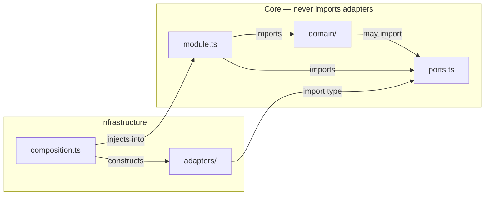

# Cấu trúc Module

Mọi backend module (mô-đun backend) trong server đều theo cùng một cấu trúc nội bộ. Business logic (logic nghiệp vụ) nằm trong `domain/`, các dependency interface (giao diện phụ thuộc) nằm trong `ports.ts`, các concrete implementation (triển khai cụ thể) — như database hay harness bindings — nằm trong `adapters/`, còn public surface (bề mặt API công khai) nằm trong `index.ts`. Đây là cách áp dụng hexagonal architecture (kiến trúc lục giác) ở cấp vi mô: mỗi module là một "hình lục giác" nhỏ riêng, với ranh giới rõ ràng giữa phần lõi định nghĩa hành vi và các adapter giao tiếp với hạ tầng.

Cấu trúc này được thiết lập trong đợt làm nền móng backend-pattern-foundation, với các module `llm` và `metering` là ví dụ chạy được đầu tiên.

---

## Cấu trúc Chuẩn Gồm Bốn Phần

```
server/src/<module>/
├── domain/          ← business logic: projections, rules, value objects
├── ports.ts         ← interfaces the core needs from infrastructure
├── adapters/        ← concrete implementations (Postgres repos, harness calls, …)
├── module.ts        ← orchestration / application wiring
└── index.ts         ← re-exports only — the module's public surface
```

Mỗi phần có nhiệm vụ riêng rất rõ:

- **`domain/`** chứa phần code thuần túy xoay quanh bài toán. Không gọi database, không HTTP, không I/O. Chỉ có hàm thuần và kiểu dữ liệu.
- **`ports.ts`** khai báo các interface mà `domain/` và `module.ts` cần từ thế giới bên ngoài — như `LessonRepository`, `LlmGateway`, v.v. Có thể hình dung đây là ổ cắm để phần hạ tầng kết nối vào.
- **`adapters/`** chứa các "phích cắm" đó — mỗi file ứng với một công nghệ cụ thể triển khai một port.
- **`module.ts`** làm phần orchestration (điều phối): nhận các adapter đã được khởi tạo và nối dây sẵn, gọi các hàm trong `domain/`, rồi phối hợp công việc qua các port.
- **`index.ts`** chỉ re-export API công khai của module. Không làm gì khác.

Các edge module (mô-đun biên) có nhiệm vụ thuần túy là routing hoặc scheduling — `api` và `jobs` — được miễn rõ ràng khỏi việc phải có thư mục `domain/`, vì bản chất công việc của chúng là không chứa logic miền nghiệp vụ.

---

## Quy tắc Chỉ Hướng Vào Trong

Phần core (lõi) của một module — `domain/`, `ports.ts`, và `module.ts` — **không bao giờ được import từ `adapters/`** trong chính module đó. Adapter phải được khởi tạo ở nơi khác rồi inject vào; phần core không tự với tới chúng.



Có một điểm cần nhấn mạnh: **`domain/` hoàn toàn có thể import `ports.ts`**. Ports là các interface do phần core định nghĩa — chúng nằm bên trong ranh giới của hình lục giác, không phải bên ngoài. Cấm `domain/ → ports.ts` là một biến thể chặt hơn có tên functional core / imperative shell (lõi hàm / vỏ mệnh lệnh); dự án này không chọn dạng chặt hơn đó.

Từ đây kéo theo một hệ quả quan trọng: các shared record type (kiểu bản ghi dùng chung), ví dụ shape của `Lesson`, được khai báo một lần trong `domain/` rồi `ports.ts` import ra ngoài. Nếu khai báo cùng một shape ở cả hai lớp, việc type-checking chỉ thành công nhờ structural equivalence (tương đương cấu trúc) của TypeScript — đó là sự trùng hợp chứ không phải một ràng buộc. Chỉ cần một bên thay đổi, sẽ không có gì phát hiện ra độ lệch.

---

## Adapter Là Các Lá

Nửa còn lại của bất biến này nói về việc một adapter được phép là gì. Một adapter phải là một **leaf (nút lá)**:

1. Nó triển khai **chính xác một port**.
2. Nó **không giữ bất kỳ port nào khác** như một dependency — không có field trong constructor mang kiểu `*Port`, `*Repository`, hay `*Store`.
3. Nó **không chứa quyết định nào** mà có thể viết được mà không cần I/O. Nếu logic có thể biểu diễn bằng code thuần, thì nó thuộc về `domain/`.

Phần orchestration — chẳng hạn gọi hai repository rồi gộp kết quả của chúng — thuộc về `module.ts`. Các rule (quy tắc) chi phối miền nghiệp vụ — như "không bao giờ hạ cấp một catalog item khi reseed" — thuộc về `domain/`. Nếu một adapter bắt đầu điều phối qua nhiều port, nó đang ôm lấy trách nhiệm vốn phải nằm trong core, và sẽ khó thay thế hơn khi hạ tầng thay đổi.

Hai mệnh đề này — "core không bao giờ import adapter" và "adapter là lá" — được ghi lại cùng nhau trong ADR-023, vì nếu chỉ ghi mệnh đề đầu thì mệnh đề sau rất dễ lệch đi mà không ai nhận ra. Module `identity` tuân thủ cả hai và được dùng làm implementation tham chiếu.

---

## Barrel File: Chỉ Dùng Để Re-Export

Mọi `index.ts` đều là một **barrel (file tổng hợp re-export)** — tức file chỉ re-export từ các file cùng cấp. Không khai báo schema, không định nghĩa class, không viết factory function trực tiếp trong đó. Toàn bộ implementation thực sự phải nằm trong các file `.ts` riêng, rồi `index.ts` chỉ việc re-export lại.

```ts
// ✅ Correct: index.ts re-exports only
export { createLlmGateway } from './llm-gateway';
export type { LlmPort } from './ports';

// ❌ Wrong: implementation inline in index.ts
export function createLlmGateway(deps: Deps): LlmPort {
  return { … };
}
```

Quy tắc này được mã hóa thành chuẩn sau khi phát hiện một số module — gồm `contracts`, `errors`, `logger`, `persistence`, `metering`, và `llm` — đang đặt logic thật trực tiếp trong `index.ts`. Riêng entry point tiến trình `server/src/index.ts` và các stub placeholder rỗng được miễn trừ rõ ràng.

---

## Dependency-Cruiser: Kiến trúc Có Thể Đọc Được Bằng Máy

File `app/.dependency-cruiser.cjs` chính là **module architecture (kiến trúc module) có thể đọc được bằng máy**. Nó mã hóa đồ thị import liên module được phép (ví dụ `tutor → engine, content, pedagogy, llm`; `engine → nothing`) cùng bốn nhóm quy tắc:

| Rule | Nội dung nó thực thi |
|------|----------------------|
| `engine-no-upward-deps` | Phần lõi domain không được import gì từ các module điều phối/biên |
| `declared-edges-only` | Một module chỉ được import từ các module nằm trong danh sách cạnh được phép của nó |
| `no-deep-cross-module-imports` | Một module chỉ được truy cập thông qua `index.ts` của nó |
| `domain-no-adapters-import` | `domain/` của một module không được import `adapters/` của chính nó |

Vì file cấu hình này **chính là** kiến trúc, nên bất kỳ PR nào thay đổi một cạnh được phép đều mặc nhiên là thay đổi kiến trúc và phải dẫn chiếu tới một ADR. Cổng kiểm tra này chạy trong CI với tên `depcruise:check`, và đã được chứng minh là hoạt động thật bằng cách cố tình kích hoạt từng kiểu vi phạm quy tắc trong một lần chạy thử.

### Điều dependency-cruiser không nhìn thấy được

Dependency-cruiser suy luận ở mức độ chi tiết của file import. Mọi adapter trong một module đều import `ports.ts` một cách hợp lệ — đúng ra chúng phải làm vậy. Vi phạm quy tắc leaf-adapter tồn tại ở mức symbol (ký hiệu): một adapter giữ hai field có kiểu là port nhưng chỉ import cùng một file `ports.ts` thì trông vẫn hoàn toàn sạch dưới góc nhìn của dependency-cruiser. Trong ba issue liên tiếp, một lần chạy `depcruise` thành công đã bị xem như bằng chứng rằng ranh giới module vẫn khỏe mạnh, trong khi thực tế công cụ đó không bao giờ có khả năng phát hiện đúng lỗi ấy.

Đó là lý do quy tắc leaf-adapter cần một cơ chế thực thi riêng.

---

## Thực Thi Quy tắc Leaf: G-21

Fitness function (hàm đo độ phù hợp kiến trúc) **G-21** là một quy tắc ESLint `no-restricted-syntax` được áp dụng cho `server/src/*/adapters/**/*.ts`. Nó đánh dấu mọi class property, constructor parameter property, hoặc field trong dependency interface có tên kiểu kết thúc bằng `Port`, `Repository`, hoặc `Store`.

```ts
// G-21 flags this in an adapter class:
constructor(
  private readonly lessonRepo: LessonRepository,  // ❌ holds a port
  private readonly catalog: CatalogPort,           // ❌ holds a port
) {}

// This is fine — implementing a port is allowed:
class PostgresLessonRepository implements LessonRepository { … } // ✅
```

G-21 có một blind spot (điểm mù) đã được nêu rõ: nó dựa vào quy ước đặt tên. Một kiểu port nếu được đặt tên mà không dùng một trong ba hậu tố (`Port`, `Repository`, `Store`) thì công cụ sẽ không nhìn thấy. Vì thế, quy ước đặt tên ở đây là thứ **gánh tải thực sự** cho cơ chế này — nó khiến quy tắc hoạt động được — chứ không phải sở thích mang tính thẩm mỹ.

---

## Composition Root: Factory Tường Minh, Không Dùng DI Container

Quá trình bootstrap của server nối dây mọi module với nhau thủ công trong một composition root, bằng cách gọi các factory function tường minh:

```ts
// composition.ts (sketch)
const pool = createPool(config.db);
const llm = createLlmGateway({ httpClient });
const metering = createMeteringModule({ db: pool });
const engine = createEngineModule({ llm, metering, db: pool });
```

Không decorator, không reflection, không auto-wiring. Mỗi factory — `createLlmGateway(deps)`, `createMeteringModule(deps)` — chỉ là một hàm thường: nhận dependencies của nó và trả về API công khai của module.

Đây là một lựa chọn có chủ đích: DI container sẽ che giấu đồ thị phụ thuộc vào bên trong metadata, đúng chỗ mà kỷ luật ranh giới của modular monolith cần phải nhìn thấy nó rõ nhất. Cùng lối nghĩ "ưu tiên tường minh hơn phép thuật" này đã dẫn đến hai quyết định trước đó — dùng harness tự xây thay vì LangChain, và dùng Fastify thay vì Next.js — nên phần này tiếp tục nhất quán với nguyên tắc chung của toàn dự án.

---

## Ghi chú về Module `persistence`

Module `persistence` không đi theo cấu trúc bốn phần ở trên. Bộ khung `domain/`, `ports.ts`, và `adapters/` của nó đã bị xóa trong Sprint 3. Toàn bộ nhiệm vụ của module này chỉ là tạo một `pg.Pool` rồi chuyển nó cho các module khác; không ai chỉ ra được công việc tương lai nào có thể khiến `persistence/domain/` thật sự có nội dung.

Bộ khung ban đầu có một comment stub: *"intentionally empty until a later issue adds real business rules."* Comment đó là một lời hứa sai — nó khiến mọi người đọc sau này chờ đợi thứ sẽ không bao giờ xuất hiện. Xóa nó đi là xóa luôn sự đánh lạc hướng đó. Hiện tại module chỉ còn `pool.ts` và một `index.ts` chỉ làm re-export.

**Đây không phải tiền lệ chung.** Hiện vẫn có khoảng ba mươi stub placeholder trải trên mười module khác — `engine`, `content`, `pedagogy`, `tutor`, và các module khác — và ở những chỗ đó, comment stub là đúng: code thật của chúng sẽ xuất hiện ở các sprint sau, nên các stub vẫn được giữ lại. Việc xóa bộ khung của `persistence` là một lần dọn dẹp cá biệt cho riêng một module, không phải thay đổi chính sách.
