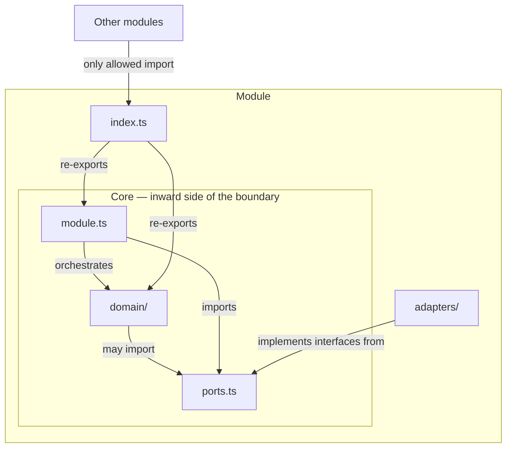

Mọi module backend (phía máy chủ) trong server đều có cùng một cấu trúc nội bộ. Logic nghiệp vụ nằm trong `domain/`, các interface phụ thuộc của nó được khai báo ở `ports.ts`, các phần hiện thực cụ thể (repo Postgres, harness binding) nằm trong `adapters/`, và một barrel `index.ts` là tệp duy nhất mà module khác được phép import. Đây là hexagonal architecture (kiến trúc lục giác), còn gọi là *ports and adapters* (cổng và bộ chuyển đổi), được áp dụng ở cấp module.

Các quy tắc dưới đây không phải để tham khảo. Chúng được máy kiểm tra trong CI (tích hợp liên tục), và nếu muốn thay đổi một quan hệ import được phép thì phải có ADR.

---

## Cấu tạo của một module

Đây là bố cục chuẩn cho một module có `domain/`, chẳng hạn như `engine` hoặc `llm`:

```
server/src/<module>/
├── domain/          ← business logic: projections, rules, value objects
├── ports.ts         ← interfaces the core needs from infrastructure
├── adapters/        ← concrete implementations (Postgres repos, harness bindings, …)
├── module.ts        ← orchestration and application wiring
└── index.ts         ← re-exports only — the module's public surface
```

Hãy hình dung module được chia làm hai vùng, ngăn cách bởi một ranh giới cứng:



Mỗi phần có một vai trò rất rõ:

- **`domain/`** chứa phần mã chỉ nói về bài toán. Không gọi cơ sở dữ liệu, không HTTP, không I/O — chỉ có pure functions (hàm thuần) và kiểu dữ liệu.
- **`ports.ts`** khai báo các interface mà `domain/` và `module.ts` cần từ thế giới bên ngoài — như `LessonRepository`, `LlmGateway`, v.v. Có thể hình dung nó như một ổ cắm để phần hạ tầng cắm vào.
- **`adapters/`** chứa các đầu nối — mỗi tệp ứng với một công nghệ cụ thể hiện thực một port. Một adapter là một **leaf** (nút lá) — phần này sẽ nói kỹ hơn ở dưới.
- **`module.ts`** làm nhiệm vụ điều phối: nhận các adapter đã được dựng sẵn, gọi các hàm trong `domain/`, rồi phối hợp qua nhiều port.
- **`index.ts`** chỉ re-export API công khai. Không hơn.

---

## Ranh giới giữa core và adapter

**Core — gồm `domain/`, `ports.ts`, và `module.ts` — tuyệt đối không được import từ `adapters/` trong cùng module.** Adapter được khởi tạo trong `composition.ts` rồi inject (tiêm phụ thuộc) vào; core không tự với tới chúng.

Đó là mệnh đề đầu tiên của ADR-023. Điều này quan trọng vì chiều phụ thuộc quyết định bên nào kiểm soát bên nào. Adapter phụ thuộc vào các port interface do *core* định nghĩa; nếu core import adapter thì mũi tên phụ thuộc bị đảo chiều, và core sẽ bị ràng buộc vào hạ tầng.

Có một điểm cần nói rõ: **`domain/` được phép import `ports.ts` một cách tự do**. Port là interface do chính core định nghĩa — chúng nằm bên trong ranh giới của hình lục giác, chứ không ở bên ngoài. Nếu cấm `domain/ → ports.ts` thì đó sẽ là một mẫu kiến trúc khác, gọi là *functional core / imperative shell* (lõi hàm / vỏ mệnh lệnh), và dự án này không chọn hướng đó.

Hệ quả thứ hai là các kiểu record dùng chung — ví dụ cấu trúc `Lesson` — chỉ được khai báo một lần trong `domain/`, rồi để `ports.ts` import ra ngoài. Nếu khai báo cùng một cấu trúc ở cả hai lớp, type-checker (bộ kiểm tra kiểu) chỉ tình cờ thấy chúng tương thích nhờ TypeScript dùng structural typing (định kiểu theo cấu trúc). Chỉ cần một bên thay đổi là sự lệch nhau ấy sẽ không có gì bắt được.

:::caution[Một sai lầm cũ cần biết]
Một rule `dependency-cruiser` thời kỳ đầu có tên `domain-no-adapters-import` chỉ mã hóa một phiên bản hẹp của quy tắc này: mệnh đề `from` của nó chỉ giới hạn trong `domain/`, nên một tệp ở gốc module như `module.ts` vẫn có thể import adapter của chính nó mà mọi cổng kiểm tra vẫn xanh. Module `identity` từng làm đúng như vậy trước khi rule được mở rộng để bao trùm toàn bộ core — `domain/`, `ports.ts`, và `module.ts`.
:::

---

## Adapter là các nút lá

Mệnh đề thứ hai của ADR-023 nói về việc một adapter được phép *là gì*. Một adapter phải là một **leaf**:

1. Nó hiện thực **đúng một port**.
2. Nó **không giữ thêm bất kỳ port nào khác** như một phụ thuộc constructor — tức không có field nào mang kiểu `*Port`, `*Repository`, hoặc `*Store`.
3. Nó **không chứa quyết định nào** có thể viết mà không cần I/O. Nếu logic có thể diễn đạt bằng mã thuần, nó phải nằm trong `domain/`.

Việc điều phối — ví dụ gọi hai repository rồi hợp nhất kết quả — thuộc về `module.ts`. Các quy tắc nghiệp vụ — chẳng hạn "không bao giờ hạ cấp một mục catalog khi reseed" — thuộc về `domain/`. Một adapter mà bắt đầu phối hợp qua nhiều port sẽ hấp thụ trách nhiệm đáng lẽ phải ở trong core, và cũng khó thay thế hơn khi công nghệ bên dưới thay đổi.

Hai mệnh đề này được ghi chung trong ADR-023 vì nếu chỉ ghi mệnh đề đầu tiên thì mệnh đề thứ hai rất dễ trôi đi mà không ai nhận ra. Module `engine` tuân thủ mệnh đề 1 nhưng vi phạm mệnh đề 2. Module `metering` thì ngược lại — nó import adapter của chính nó vào `module.ts`. Hiện nay module `identity` đáp ứng cả hai mệnh đề và được nêu đích danh làm cách hiện thực tham chiếu cho các đợt review sau này.

---

## `index.ts` chỉ dùng làm barrel

Mọi `index.ts` đều là một **barrel** (tệp gom tái xuất) — tức một tệp chỉ re-export từ các tệp cùng cấp. Không được định nghĩa inline schema, class hay factory function.

```ts
// ✅ Correct — index.ts re-exports only
export { createLlmGateway } from './llm-gateway';
export type { LlmPort } from './ports';

// ❌ Wrong — implementation defined directly in index.ts
export function createLlmGateway(deps: Deps): LlmPort {
  // ...
}
```

Quy tắc này được thêm vào sau khi một đợt review Sprint 1 phát hiện nhiều module — trong đó có `contracts`, `errors`, `logger`, `persistence`, `metering`, và `llm` — đang đặt logic thật trực tiếp trong các tệp `index.ts`. Riêng điểm vào tiến trình `server/src/index.ts` và các stub rỗng dùng làm chỗ giữ chỗ thì được miễn trừ rõ ràng.

---

## Composition root: factory tường minh, không dùng DI container

Khi bootstrap (khởi động) server, mọi module được nối dây thủ công tại một composition root, bằng cách gọi các factory function tường minh:

```ts
// composition.ts (simplified)
const pool = createPool(config.db);
const llm = createLlmGateway({ httpClient });
const metering = createMeteringModule({ db: pool });
const engine = createEngineModule({ llm, metering, db: pool });
```

Không dùng decorator, không reflection, không auto-wiring. Mỗi factory — `createLlmGateway(deps)`, `createMeteringModule(deps)` — chỉ là một hàm thường: nhận dependencies của nó rồi trả về API công khai của module.

Đây là một lựa chọn có chủ đích: DI container (bộ chứa tiêm phụ thuộc) che giấu dependency graph (đồ thị phụ thuộc) vào trong metadata, đúng chỗ mà kỷ luật ranh giới của modular monolith (nguyên khối mô-đun) lại cần nó phải hiện ra rõ ràng. Cùng một nguyên tắc "tường minh hơn phép màu" trước đó đã dẫn tới việc chọn harness nội bộ thay vì LangChain, và chọn Fastify thay vì Next.js — composition root chỉ tiếp tục đi theo đúng mẫu nhất quán đó.

---

## Ranh giới được thực thi như thế nào

Có hai công cụ cùng làm việc này. Chúng hoạt động ở các mức hạt khác nhau và bao phủ những khía cạnh khác nhau.

### dependency-cruiser — ranh giới ở cấp tệp (G-1)

`app/.dependency-cruiser.cjs` là **kiến trúc module ở dạng máy đọc được**. Theo định nghĩa, một PR thay đổi quan hệ cho phép trong tệp này là một thay đổi kiến trúc, nên phải dẫn chiếu tới một ADR (quy tắc quản trị G-11). Tệp này được chạy trong CI dưới tên `depcruise:check`.

Các rule liên quan đến cấu trúc module gồm:

| Rule | Rule kiểm tra gì |
|------|-------------------|
| `engine-no-upward-deps` | Domain core không import gì từ orchestration hay các edge module (R-1) |
| `declared-edges-only` | Một module chỉ được import từ các module nằm trong danh sách cạnh cho phép của nó |
| `no-deep-cross-module-imports` | Chỉ có thể đi vào một module thông qua `index.ts` của nó (R-3) |
| `domain-no-adapters-import` | Toàn bộ core của module không import `adapters/` của chính nó |

### ESLint — kiểm tra leaf ở cấp symbol (G-21)

`dependency-cruiser` hoạt động ở mức độ chi tiết của file import. Nó không thể phát hiện vi phạm leaf-adapter: mọi adapter đều import cùng một tệp `ports.ts` một cách hợp lệ, nên với công cụ này, một adapter giữ hai field có kiểu là port vẫn trông hoàn toàn sạch. Chỉ khi nhìn vào các *symbol* mà một class giữ làm phụ thuộc constructor thì vi phạm mới lộ ra — và trong ba issue liên tiếp, một lần chạy `depcruise` sạch đã bị hiểu nhầm là bằng chứng cho thấy ranh giới vẫn khỏe mạnh, dù trên thực tế công cụ đó không bao giờ có khả năng phát hiện lỗi này.

Fitness function (hàm đánh giá kiến trúc) **G-21** lấp chỗ trống đó. Đây là một rule ESLint `no-restricted-syntax`, được áp dụng cho `server/src/*/adapters/**/*.ts`, nhằm gắn cờ mọi class property, constructor parameter, hoặc field trong dependency interface có tên kiểu kết thúc bằng `Port`, `Repository`, hoặc `Store`. Việc hiện thực một port thì được phép — điều không được phép là *giữ* một port như phụ thuộc.

```ts
// G-21 flags this:
constructor(
  private readonly lessonRepo: LessonRepository, // ❌ holds a port
  private readonly catalog: CatalogPort,          // ❌ holds a port
) {}

// G-21 permits this:
class PostgresLessonRepo implements LessonRepository { … } // ✅
```

:::note[Điểm mù đã được nêu rõ của G-21]
G-21 dựa vào hậu tố tên `Port` / `Repository` / `Store`. Một kiểu port có tên không kết thúc bằng một trong ba hậu tố đó sẽ vô hình với rule này. Quy ước đặt tên ở đây là **thành phần chịu tải**, không phải chuyện hình thức — nếu bạn thêm một port interface mới, tên của nó bắt buộc phải kết thúc bằng một trong các hậu tố ấy thì rule mới bao phủ được.
:::

---

## Khi một module không có thư mục `domain/`

Không phải module nào cũng cần một bộ khung hexagonal đầy đủ. **Các module thuần adapter — `api`, `jobs`, và `persistence` — không có thư mục `domain/`.** Vai trò của chúng là kết nối, không phải suy luận.

`persistence` là ví dụ rõ nhất. Toàn bộ công việc của nó chỉ là khởi tạo một `pg.Pool` rồi đưa nó cho các module khác. Trong Sprint 3, bộ khung ban đầu gồm `persistence/domain/`, `persistence/ports.ts`, và `persistence/adapters/` đã bị xóa. Không ai có thể chỉ ra loại công việc nào rồi sẽ thực sự lấp đầy phần đó. Dòng chú thích stub *"intentionally empty until a later issue adds real business rules"* là một lời hứa sai — nó bảo mọi người đọc sau này hãy chờ một thứ vốn dĩ chẳng bao giờ tới. Giờ đây module này chỉ còn `pool.ts` và một barrel `index.ts`.

**Đây không phải một tiền lệ chung.** Hiện vẫn có khoảng ba mươi stub giữ chỗ rải khắp các module như `engine`, `content`, `pedagogy`, và `tutor`. Với những chỗ đó, stub thực sự là phần đất dành sẵn cho mã sẽ đến trong các sprint sau — chú thích là đúng, nên stub vẫn được giữ lại.

---

## Quy ước: dẫn chiếu rule đặt trong docblock, không đặt trong thông báo lỗi

Khi bạn viết một điểm `throw` để thực thi quy tắc cấu trúc module, hãy đưa *nội dung* của quy tắc vào thông báo, còn *mã định danh* của quy tắc thì để trong docblock (khối chú thích tài liệu) phía trên đoạn mã.

```ts
// ✅ Correct
/**
 * @see ADR-023 — core must not import adapters
 */
throw new Error('dependency must be injected, not imported directly');

// ❌ Wrong
throw new Error('ADR-023: dependency must be injected, not imported directly');
```

Một định danh như `ADR-023` khi xuất hiện trong log hoặc API response sẽ đi tới operator hay một service gọi sang — mà cả hai đều không cầm sẵn tài liệu đó. Hơn nữa, định danh ấy còn có thể mục rữa âm thầm: ADR vốn được thiết kế để có thể bị thay thế, nên một dẫn chiếu nhúng sẵn cuối cùng có thể trỏ tới một quyết định không còn hiệu lực, và sẽ chẳng có bài test nào phát hiện ra độ lệch ấy. Hãy để phần giải thích có thể hành động được nằm trong thông báo; còn dẫn chiếu thì đặt ở chỗ các maintainer thực sự đọc.
