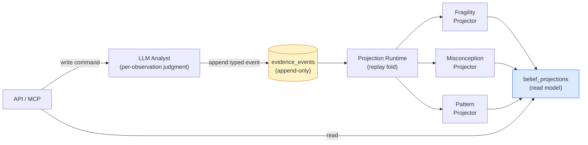
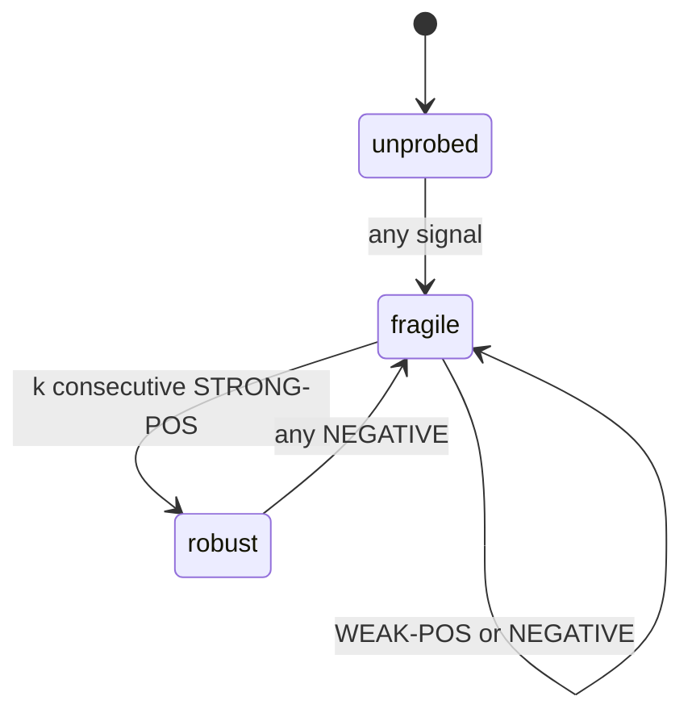
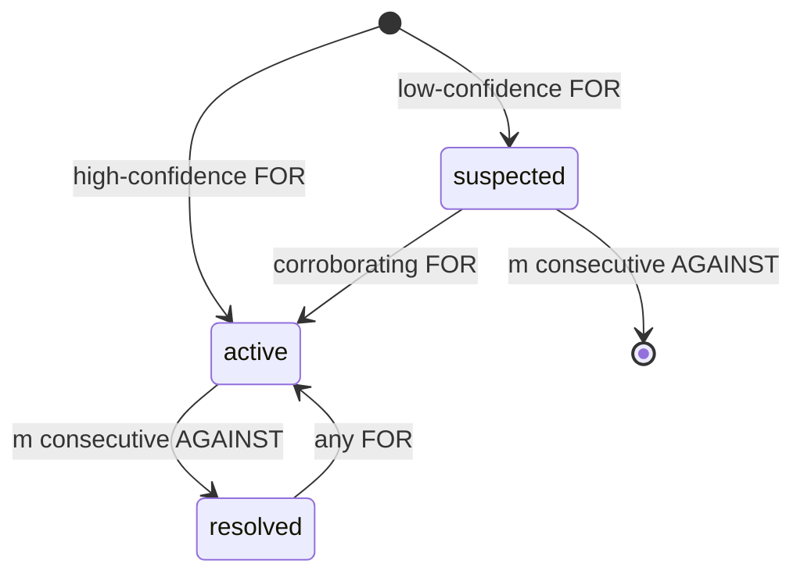
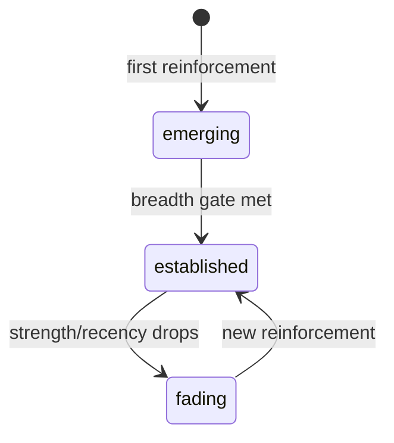
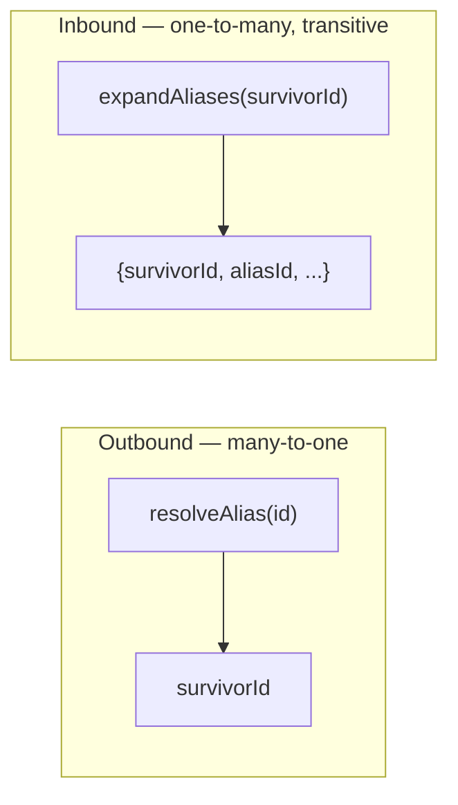

Engine của Stemolly suy ra **belief state** (trạng thái niềm tin) của một học sinh — các em đang giữ những **misconception** (ngộ nhận) nào, mức độ hiểu biết của các em mong manh đến đâu, các em bộc lộ những **reasoning habit** (thói quen lập luận) nào — từ một hồ sơ quan sát vĩnh viễn, dạng **append-only** (chỉ thêm vào). Không có belief nào từng được ghi trực tiếp; mọi belief đều được *tính ra* từ hồ sơ đó. Trang này giải thích cơ chế ấy: log nuôi toàn bộ hệ thống, schema định hình nó, ba **projector** (bộ chiếu suy diễn) tạo ra từng lớp belief, và những khoảng trống còn phải lấp.

---

## Kiến trúc: CQRS trên một Append-Only Log

Engine đi theo mô hình `event-sourcing-lite`. Chỉ dữ liệu quan sát học sinh là được event-sourced; còn content, identity, và session dùng CRUD thông thường. Tính chất trung tâm ở đây là: **evidence log là nguồn chân lý duy nhất, và toàn bộ belief state là một phép chiếu xác định, có thể dựng lại từ log đó.**



Trong `domain/` của engine, hệ thống được tách thành **command side** (phía lệnh) gồm `graph`, `catalog`, `evidence` — nơi xác thực và ghi thêm các quan sát có kiểu — và **derive side** (phía suy diễn) gồm `projections/` — nơi replay log thành belief state. Hai phía này **không bao giờ gọi trực tiếp lẫn nhau**. Chúng chỉ gặp nhau qua append-only log đã được lưu bền vững.

Chính sự tách biệt này làm cho quy trình `truncate → replay → identical state` trở nên đáng tin. Nếu đường ghi và đường suy diễn có thể gọi lẫn nhau, replay sẽ lệch khỏi lần chạy thật ban đầu, và log sẽ không còn là nguồn chân lý duy nhất nữa.

Đổi lại, hệ thống có khả năng tiến hóa. Khi mô hình belief hóa ra sai — điều *được chờ đợi* ở một công cụ mới — ta viết lại projection code rồi replay trên dữ liệu cohort đã được giữ lại, thay vì đánh mất nó. Sai không quá đắt. Replay log là một thao tác được hỗ trợ và đã có kiểm thử.

---

## Schema của Evidence

### Envelope và Payload: Gom phần bất khả đảo ngược vào một chỗ

Mỗi evidence event được chia thành hai vùng có tính đảo ngược đối nghịch nhau (ADR-021).

| Vùng | Dạng | Tính đảo ngược | Nội dung nên nằm ở đây |
|------|------|----------------|-------------------------|
| **Envelope** | Các cột có kiểu trên bảng append-only | Cánh cửa một chiều — schema không thể đổi và các dòng cũ không thể mọc thêm cột | Những trường mà fold **dựa vào để khóa hoặc gán trọng số**, hoặc các truy vấn audit **cần join vào** |
| **Payload** | Cột JSONB | Có thể đảo ngược — projection code mới có thể diễn giải lại payload cũ khi replay | Mọi thứ còn lại |

Kinh nghiệm áp dụng là: **"nếu còn phân vân, hãy để vào payload."** Các cột envelope gồm `student`, `node_id`, `type`, `scaffold_stamp`, `checkpoint_id`, `session`, `brief_snapshot`, `ts`, `seq`, và các cột của idempotency key. Cách này dồn toàn bộ phần bất khả đảo ngược vào một tập nhỏ được cân nhắc kỹ — đặc biệt quan trọng vì đây là cánh cửa một chiều trên dữ liệu thật, không thể thay thế của một học sinh.

### Ba loại quan sát

Trường `type` chỉ có đúng ba giá trị. Mỗi giá trị đều gọi tên **một quan sát về tư duy**, chứ không phải một hành động sư phạm hay khái niệm miền nội dung:

- **`misconception_evidence`** — `catalogRef`, `polarity: for|against`, `confidence`, `excerpt`. Ghi lại "Tôi thấy bằng chứng cho niềm tin sai này."
- **`probe_outcome`** — `outcome: correct|incorrect|partial`, `confidence`, `excerpt`. Ghi lại việc sự hiểu biết có đứng vững dưới kiểm tra hay không.
- **`pattern_evidence`** — `patternRef`, `confidence`, `excerpt`. Ghi lại một thói quen lập luận đang bộc lộ.

Ba loại này khớp một-một với ba projector. Chúng đã được kiểm chứng bằng tám ca tutoring mang tính đối kháng trong Math (Socratic) và Language (Correct/Reinforce); không cần loại thứ tư.

Các type này tuyệt đối không được gọi tên cơ chế sư phạm (`socratic_hint`, `correction_issued`) hay chi tiết miền nội dung. Nếu làm vậy, một mode giảng dạy sẽ bị đóng cứng vào dữ liệu vĩnh viễn, không thể replay. Nội dung miền phải nằm trọn trong `catalogRef`/`patternRef` và payload.

### Quy tắc về độ cao trừu tượng: LLM ghi gì, engine suy ra gì

Có một ranh giới rất rõ giữa phần LLM ghi và phần engine tính:

- **LLM ghi** một **per-observation judgment** (đánh giá ở cấp từng quan sát) — một phán đoán ngữ nghĩa về đúng một khoảnh khắc: "Ở đây tôi thấy bằng chứng cho misconception X, độ tin cậy cao."
- **Engine suy ra** **cross-observation state** (trạng thái xuyên nhiều quan sát) — phần ghi sổ cơ học của activation, fragility, và propagation trên nhiều phán đoán như vậy.

Chỉ lưu raw text là không đủ (engine không thể chạy một LLM). Còn ghi trực tiếp belief state thì lại phá vỡ bất biến append-only. Mỗi event phải là một **sự kiện tự thân đầy đủ** trỏ tới các catalog ID ổn định, chứ không phải belief state ở thời điểm ghi.

Analyst có thể *đọc* belief state hiện tại như ngữ cảnh — chẳng hạn để nhận ra rằng một lời giải sạch là bằng chứng phủ định có ý nghĩa — nhưng tuyệt đối *không được phát lại chính trạng thái đã lưu ấy dưới dạng event*. Nếu lại bắn ra cùng một belief ở mỗi checkpoint, hệ thống sẽ đếm trùng bằng chứng, làm phình log, và ghi một kết luận thay vì một quan sát. Bất kỳ "conclusion" event nào mà ý nghĩa của nó phụ thuộc vào belief state tại lúc ghi đều làm hỏng replay và phải bị loại bỏ.

**Thực thi ở ranh giới ghi:** evidence validator bác mọi payload có chứa tên trường của belief state (`fragility`, `mastery`, `activation`, `beliefState`, `misconceptionState`, `stability`). Từng có phương án dùng allowlist đầy đủ cho payload theo từng type, nhưng đã bị loại bỏ — chưa có consumer nào chốt rõ payload hợp lệ thật sự gồm những gì, nên đóng băng schema vào thời điểm hiểu biết còn ít nhất là quá sớm. Denylist chặn đúng rủi ro cụ thể mà chưa ép hệ thống vào một shape cố định.

:::caution[Vẫn còn một trần chắn]
Một trường của belief state dưới *một tên chưa nằm trong danh sách* vẫn có thể lọt qua. Denylist phải luôn được cập nhật. Về sau nên xem lại để chuyển sang allowlist khi đã có consumer thật sự chốt payload hợp lệ gồm những gì.
:::

### Gom các lần thử: `checkpoint_id`

Nhiều event có thể cùng mô tả một lần học sinh thử làm bài. Ví dụ, một lần tự sửa sai sẽ tạo ra cả `misconception_evidence(for)` lẫn `probe_outcome(correct)`. Các belief fold phải gom những event cùng một lần thử trước khi diễn giải chúng, vì câu chuyện sẽ khác nhau tùy chúng thuộc checkpoint nào:

- **Cùng checkpoint:** `for` + `correct` → chao đảo nhưng hồi lại → weak-positive, concept vẫn fragile.
- **Khác checkpoint:** `for` ở một lần thử, `correct` ở lần sau → cải thiện thật sự qua nhiều lần thử.

`session_id` thì quá rộng (một session có thể có nhiều lần thử); còn độ gần nhau về timestamp thì không có ranh giới sạch. `checkpoint_id` là một cột envelope đóng dấu cho batch được tạo ra bởi một lần chạy Analyst — tức một lần học sinh thử làm — ngay từ cấu trúc. Phía suy diễn xử lý các checkpoint theo thứ tự `(min event ts, checkpoint_id)` để giữ replay có tính xác định.

---

## Idempotency Key: Một câu chuyện còn tiếp diễn

Khóa duy nhất trên `evidence_events` đã trải qua ba vòng thiết kế, mỗi vòng đều sửa một lỗi toàn vẹn dữ liệu có thật trên bảng append-only, nơi sai lầm là vĩnh viễn.

### Vấn đề của positional key

Ràng buộc ban đầu là `(checkpoint_job_id, segment, observation_index)`. `observation_index` là vị trí trong một thứ tự sắp xếp theo danh tính ngữ nghĩa. Chỉ cần chèn hoặc bỏ một quan sát, mọi index phía sau đều bị lệch. Khi chạy lại cùng job nhưng tập quan sát đã đổi, `ON CONFLICT DO NOTHING` sẽ giữ lại dòng đang chiếm chỗ trong DB và âm thầm bỏ dòng mới — hoặc nhân đôi một dòng khác — mà không trả lỗi và cũng không ai kiểm tra số dòng. Batch trông như thành công trong khi log đã hỏng.

### ADR-022: Các khóa mang phạm vi theo danh tính

Bản sửa thay ràng buộc dựa theo vị trí bằng `(checkpoint_id, segment, node_id, type, ref, occurrence)`.

- `occurrence` có phạm vi riêng trong từng nhóm danh tính, nên thêm hay bớt một quan sát chỉ mở hoặc đóng nhóm của chính nó, không đẩy lệch khóa của dòng nào khác.
- `ref` (`catalogRef` hoặc `patternRef`) được nâng từ JSONB thành một cột nullable riêng để có thể tham gia vào ràng buộc.
- Ràng buộc được neo theo **checkpoint**, không phải theo job — checkpoint mới là đơn vị mà các fold xem là nguyên tử.

`observation_index` được giải phóng khỏi vai trò định danh — đổi tên thành `occurrence` như bộ đếm trong từng nhóm danh tính — và một cột `seq` mới được thêm riêng để mang thứ tự phát ra thực sự.

### ADR-026: Student ID là cột dẫn đầu

Khóa ở ADR-022 đã bỏ sót `student_id`. Nếu hai học sinh tạo ra cùng một shape quan sát dưới cùng `checkpoint_id`, chúng sẽ va vào nhau — một dòng được lưu, một dòng bị bỏ, lời gọi vẫn báo thành công, còn phần mất mát thì không thể phát hiện cũng không thể sửa. Điều này đã được xác minh trên Postgres 16 thật.

Phía đọc vốn dĩ luôn được scope theo học sinh (`WHERE student_id = $1`), rồi chỉ nhóm theo checkpoint bên trong tập đó. Chỉ riêng ràng buộc phía ghi mới đối xử `checkpoint_id` như một định danh toàn cục. Sự bất đối xứng ấy trong cùng một module đã không bị nhận ra vì lỗi chỉ xuất hiện khi có hơn một học sinh.

**ADR-026** thêm `student_id` làm cột đầu tiên trong khóa. Ràng buộc đầy đủ hiện là:

```
UNIQUE (student_id, checkpoint_id, segment, node_id, type, ref, occurrence) NULLS NOT DISTINCT
```

Điều duy nhất các fold cần là tính duy nhất của `checkpoint_id` trong phạm vi từng học sinh. Tính duy nhất xuyên học sinh vốn là một lời hứa mạnh hơn mức bất kỳ phần nào cần, mà cũng chẳng có phần nào thực thi.

### `NULLS NOT DISTINCT` cho các cột nullable

`node_id` và `ref` đều là nullable. Trong SQL chuẩn, `NULL = NULL` cho ra `UNKNOWN`, không phải `TRUE`, nên một ràng buộc `UNIQUE` thông thường sẽ xem hai dòng có NULL ở cùng cột khóa là *khác nhau* và không bao giờ khử trùng. Với `UNIQUE` thường, mỗi lần retry một checkpoint sẽ nhân đôi mọi event `probe_outcome` — loại event vốn có thể hợp lệ khi không mang `ref` — một cách vĩnh viễn trên bảng append-only, khiến fragility fold bị nhân đôi trọng số.

`UNIQUE NULLS NOT DISTINCT` (Postgres 15+) so sánh theo ngữ nghĩa `IS NOT DISTINCT FROM`, nên hai giá trị NULL được tính là bằng nhau. Trong miền bài toán này, `ref = NULL` nghĩa là "loại quan sát này không có ref" — một sự thật xác định, chứ không phải một giá trị chưa biết — nên đây là một bản sửa đúng về mặt ngữ nghĩa, không phải mẹo lách.

### Thứ tự phát ra: Một cột `seq` chuyên dụng

Truy vấn đọc cho projection ban đầu dùng `ORDER BY ts, id`. Nó xử lý được lỗ hổng về tính xác định của replay (các lần đọc lặp lại giờ cho cùng kết quả), nhưng lại không sắp theo đúng thứ tự quan sát thật. `ts` được điền từ `now()` tại lúc insert — giống hệt nhau cho mọi dòng trong một câu lệnh `appendCheckpointBatch` — nên việc sắp xếp rốt cuộc rơi xuống UUID ngẫu nhiên. Fold trở nên xác định đối với một thứ tự *tùy tiện*: một hoán vị ngẫu nhiên bị đóng băng ở lúc insert, và sai vĩnh viễn.

Điều này quan trọng vì misconception fold nhạy với thứ tự (xem phần dưới). Một misconception `active` gặp chuỗi `[for, against, against]` thì sẽ được giải quyết; cùng các event đó nhưng dưới dạng `[against, against, for]` thì vẫn để nó ở `active`.

Bản sửa thêm cột `seq bigserial NOT NULL`. Postgres tự gán `seq` từ sequence của nó — tăng đơn điệu trên toàn bảng, không cần gì từ phía gọi. Truy vấn đọc cho projection giờ chỉ sắp theo `seq`.

`seq` **cố ý không nằm trong bộ khóa duy nhất**. Nhờ vậy retry idempotency và ordering mới tương thích: một lần retry phải tái tạo cùng identity key để va vào dòng cũ, còn bộ đếm do DB gán thì không bao giờ tái tạo lại. Các khoảng hở trong giá trị `seq` là điều bình thường (retry dở dang vẫn tiêu thụ số sequence cho các dòng bị bỏ) và vô hại — `seq` dùng để sắp thứ tự, không dùng để định danh.

:::note[Nguyên tắc tổng quát]
Một sort key ổn định và một sort key có ý nghĩa là hai yêu cầu khác nhau. Thỏa được yêu cầu thứ nhất rất dễ bị ngộ nhận là đã thỏa yêu cầu thứ hai. Replay determinism chỉ đòi hỏi các lần đọc lặp lại phải đồng ý với nhau — mà bất kỳ thứ tự toàn phần nào cũng làm được, kể cả một thứ tự ngẫu nhiên.
:::

---

## Ba projector

Mỗi projector là một deterministic fold trên luồng event đã được nhóm theo checkpoint. Cả ba đều có thể đảo ngược: viết lại code, replay log, nhận belief state mới. Các núm hiệu chỉnh (`k`, `m`, `d`, ngưỡng) được để lại để tinh chỉnh trên dữ liệu thật.

### Fragility: Sự nhất quán theo thời gian

**Trạng thái:** `unprobed` → `fragile` → `robust`

Fragility được suy ra bằng một **two-stage fold** (fold hai tầng) trên các event `probe_outcome` cho một concept node nhất định.

**Tầng 1 — net từng checkpoint thành một tín hiệu:**

| Tín hiệu | Ý nghĩa |
|----------|---------|
| `STRONG-POS` | Trả lời đúng, không trợ giúp, độ tin cậy cao |
| `WEAK-POS` | Trả lời đúng nhưng có scaffold, độ tin cậy thấp, hoặc tự sửa được |
| `NEGATIVE` | Trả lời sai, hoặc đang có một misconception active |

`scaffold_stamp` ở envelope và `confidence` quyết định tín hiệu nào được áp dụng.

**Tầng 2 — điều khiển FSM:**



Một probe đúng duy nhất vẫn chưa lên được `robust` — ngay cả một lần làm đúng sạch sẽ từ đầu cũng chỉ đi tới `fragile`. `robust` đòi hỏi `k` lần `STRONG-POS` liên tiếp mà không có `NEGATIVE` chen vào (mặc định `k = 2`). Một `WEAK-POS` sẽ làm đứt chuỗi. Một `NEGATIVE` khiến `robust → fragile` ngay lập tức — một concept vốn robust mà vẫn gãy chính là tín hiệu rủi ro ẩn.

Chính cơ chế chặn này làm cho fragility mang nghĩa "đứng vững dưới probing thật sự", chứ không phải "cuối cùng cũng làm đúng."

### Misconception: Kích hoạt nhanh, giải quyết chậm

**Trạng thái:** `suspected` → `active` → `resolved`

Misconception projector suy ra một instance theo từng `(student, node, catalogRef)` mà **tính bất đối xứng của nó ngược với fragility**.



**Kích hoạt diễn ra nhanh, nhưng có chặn bằng confidence.** Chỉ một event `FOR` với confidence cao là đủ đi thẳng tới `active` — một niềm tin sai có thể là thật chỉ từ một quan sát rõ ràng. Một `FOR` với confidence thấp thì rơi vào `suspected` và cần được củng cố thêm.

**Giải quyết diễn ra chậm, cần tích lũy.** `active → resolved` cần `m` event `AGAINST` liên tiếp mà không có `FOR` chen vào (mặc định `m = 2`). Nếu về sau có một `FOR`, việc tái kích hoạt diễn ra rất nhạy.

Tính bất đối xứng này phản ánh chi phí sai lầm. False positive làm hại groundedness precision (thước đo headline), nên activation bị chặn bởi confidence. Còn giải quyết quá sớm sẽ bỏ sót một misconception vẫn còn sống, nên resolution được giữ theo hướng bảo thủ.

Instance này được khóa theo **home node** của mục catalog (không phải node nơi nó nổi lên), nhờ đó tránh bị nhân đôi xuyên node. Một instance chỉ được tin ở mức headline khi nó vừa `active` **và** trạng thái catalog là `seeded` hoặc `approved` — hai cổng tin cậy trực giao.

**Cổng trạng thái catalog chỉ nằm ở thời điểm đọc.** Khi một operator phê duyệt một mục catalog candidate, việc nâng cấp sang mức được tin xảy ra ngay lập tức — không cần replay, chỉ cần đổi trạng thái qua CRUD. Fold không bao giờ nhìn thấy trạng thái catalog; phần join diễn ra ở lúc đọc. Nhờ đó fold vẫn giữ được tính xác định.

**Propagation là phép duyệt ở thời điểm đọc, không phải trạng thái được lưu.** Tác động của một root misconception lên các concept downstream không được ghi vào chính các node downstream đó. Phần nhìn "đang rủi ro vì một belief ở thượng nguồn" được tính bằng cách lần ngược các cạnh prerequisite khi đọc. Phương án materialize propagation đã bị bác bỏ vì chỉ một cạnh mới hoặc một misconception ở thượng nguồn mới cũng sẽ phải fan-out để viết lại rất nhiều dòng, và replay sẽ phải tái tạo chính xác fan-out đó.

### Reasoning patterns: Tích lũy xuyên node

**Trạng thái (suy ra ở thời điểm đọc):** `emerging` → `established` ↔ `fading`



Pattern projector được khóa theo `(student, patternRef)` — **xuyên node**, khác với các fold fragility và misconception vốn theo từng node. Một pattern là một xu hướng mà trạng thái của nó thay đổi theo thời gian ngay cả khi không có bằng chứng mới, nên fold chỉ lưu **các accumulator tối thiểu**:

- Tập các concept node phân biệt mà pattern đã xuất hiện trên đó
- Reinforcement points `(checkpoint, confidence)`
- Checkpoint reinforced đầu tiên và cuối cùng

**Strength** (có trọng số theo độ gần đây), **scope** (`|distinct_nodes|`), **status**, và **valence** đều được suy ra ở thời điểm đọc từ các accumulator này.

Việc net ở tầng 1 chỉ reinforcement một pattern tối đa một lần trong mỗi checkpoint (net confidence = max) và hợp nhất tất cả concept node mà checkpoint đó tham chiếu vào tập breadth.

**Việc thăng hạng lên `established`** đòi hỏi một breadth gate: được reinforcement ở ≥ `d` checkpoint phân biệt trải trên ≥ `d` concept phân biệt. Nhờ vậy, cả một hành vi chỉ đặc thù cho một concept lẫn một lần thử giàu dữ liệu nhưng đa concept đều không bị nâng thành một thói quen xuyên suốt. Sau đó, strength và recency điều khiển chuyển đổi `established ↔ fading`.

**Valence** (`helpful` / `harmful`) nằm dưới dạng một cột nullable trên `pattern_catalog` (misconception thì mặc định là harmful, nên `misconception_catalog` không có cột tương ứng). Lớp overlay của belief state đọc nó từ mục catalog đã match. Chính valence mới tách được một thói quen đáng củng cố khỏi một thói quen cần bị ngắt lại — một client chỉ đọc `status` và `strength` mà thiếu valence sẽ không biết một pattern đã established là tin vui hay tin xấu.

**Patterns là ngoại lệ có chủ ý đối với độ bám của belief.** Một misconception không tự biến mất; một niềm tin sai là một sự thật tiềm ẩn, vẫn đúng cho tới khi có bằng chứng phủ định. Còn một thói quen thì chỉ mạnh chừng nào nó còn được luyện gần đây — nên pattern sẽ *fade* nếu không được reinforcement, thay vì tồn tại nguyên vẹn mãi. Fading được đo theo **evidence-time** (khoảng cách checkpoint), với "hiện tại" được định nghĩa là checkpoint mới nhất trong log. Phương án làm fading theo lịch thời gian thực đã bị bác bỏ: nếu đưa đồng hồ tường vào, trạng thái suy ra sẽ không còn tái lập được khi replay trên cùng một log.

---

## Điểm chung của cả ba: Promotion gate và quy tắc trung thực

Mỗi fold chỉ đưa ra một khẳng định mạnh khi đã đi qua một promotion gate. **Hình dạng của từng gate khớp đúng với loại khẳng định mà lớp đó đưa ra**:

| Lớp | Điều nó khẳng định | Gate |
|-----|--------------------|------|
| Fragility | Sự nhất quán theo thời gian | Lặp lại — `k` checkpoint strong-positive liên tiếp |
| Misconception | Một niềm tin sai cụ thể | Confidence — một quan sát rõ ràng là có thể đủ để xác lập |
| Pattern | Một thói quen xuyên suốt | Breadth — được thấy trên nhiều concept phân biệt |

Các gate này cùng chia sẻ một nguyên tắc: một lớp không được khẳng định quá mức khi chưa có đúng loại bằng chứng mà lời khẳng định đó đòi hỏi.

**Tầng nền dưới mọi gate: không có bằng chứng thì không được sinh ra instance nào.** Mọi trạng thái trong từ vựng của cả ba lớp đều khẳng định rằng đã quan sát thấy *điều gì đó*. `suspected` nghĩa là "đã quan sát một lần, nhưng yếu." `emerging` nghĩa là "đã được reinforcement ít nhất một lần." Không trạng thái nào có một từ để chỉ "chưa biết gì cả." Nếu một fold trả về bất kỳ trạng thái nào cho một học sinh mà nó không hề có bằng chứng, thì bản thân fold ấy đang đưa ra một khẳng định.

Điều này từng bị vi phạm trong thực tế. Misconception fold đã ép một sentinel nội bộ `unseen` thành `suspected` ở đầu ra, khiến adapter không phân biệt được "chưa từng quan sát" với "nghi ngờ yếu." Kết quả là mỗi lần đọc đều trả về một entry cho mọi misconception đã approved trong catalog — một học sinh mới xuất hiện như thể đang bị nghi ngờ yếu ở tất cả chúng. Bản sửa là: `foldMisconception` trả về `MisconceptionState | null`, và adapter bỏ qua `null`. Pattern fold thì không cần sửa — một danh sách `reinforcements` rỗng vốn đã biểu thị sự vắng mặt.

**Chỉ misconception fold là nhạy với thứ tự.** Tầng 1 của fragility net bằng cách quét xem có tín hiệu negative nào không — nên thứ tự không ảnh hưởng kết quả. Pattern fold lấy max confidence rồi union các node ID — cả hai đều độc lập với thứ tự. Misconception fold thì đếm số event `AGAINST` *liên tiếp* và reset khi gặp `FOR`. Vì vậy, nếu ordering trong event pipeline thay đổi, misconception fold là nơi đầu tiên cần kiểm tra.

---

## Read model của graph và danh tính concept

### Gộp alias: Giải quyết ở thời điểm đọc (ADR-024)

Khi gọi `mergeNodes(survivorId, aliasId)`, hệ thống chỉ ghi đúng một cột: `nodes.merged_into` trên dòng alias. Không remap cạnh, không cập nhật dòng catalog, không đụng vào dòng evidence nào. Việc giải quyết diễn ra ở thời điểm đọc trong phần core của module — lớp duy nhất có thể chạm nhiều hơn một port.

Giải quyết ở thời điểm đọc không chỉ là một lựa chọn; nó là bắt buộc. `evidence_events` là append-only theo trigger của cơ sở dữ liệu, nên `node_id` tuyệt đối không thể bị viết lại. Bất kỳ phương án nào còn remap cạnh và dòng catalog ngay lúc merge cũng sẽ bổ sung thêm một cơ chế thứ hai lên trên cơ chế vốn vẫn bắt buộc phải có — và sẽ phá hủy thông tin cần thiết để un-merge.

Evidence được ghi với raw node ID sẽ được resolve ở thời điểm fold. Danh tính của dòng vẫn ổn định dưới khóa có phạm vi theo danh tính, còn việc merge sẽ hợp nhất lịch sử của học sinh theo hướng hồi tố mà không cần migration dữ liệu.

**Cần hai thao tác ngược chiều nhau:**



`resolveAlias` áp dụng cho mọi node ID *đi ra* khỏi engine, và cho `node_id` / `home_node_id` tại lúc fold và match. `expandAliases` áp dụng cho mọi node ID *đi vào* một truy vấn trên bảng đang lưu các ID lịch sử.

Hướng ngược mới là phần ít hiển nhiên. Sau khi E → F, các prerequisite của F vẫn nằm trên các cạnh được lưu dưới dạng `from_node_id = E`. Resolve đầu vào truy vấn thành F không làm thay đổi gì — bản thân F không có cạnh riêng. Recursive CTE phải seed từ tập `{F, E}` và match bằng `= ANY(...)` ở cả seed lẫn recursive join. Nếu một alias chỉ được chạm tới ở giữa chuỗi, phép duyệt sẽ đứt ngay tại bước đó.

:::caution[Khoảng trống hiệu năng còn mở]
`getMergeMap()` đang quét tuần tự toàn bộ bảng node ở mỗi lần gọi (`WHERE merged_into IS NOT NULL`, không có index trên `merged_into`). Với 50.000 node mà chỉ 20 node đã merge: cần 658 lần đọc buffer thay vì 3 nếu có partial index. Một lời gọi `getBeliefState` cũng lại fetch map này cho từng node trong bộ lọc của nó, không có tái sử dụng trong cùng request. Một partial index (`ON engine.nodes (merged_into) WHERE merged_into IS NOT NULL`) sẽ đưa việc này về index scan. Hiện vẫn chưa được thêm.
:::

### Xác thực loại cạnh (ADR-025)

`engine.edges.type` mang hai loại từ vựng. Một là các quan hệ **structural** mà code của engine có rẽ nhánh theo (`prereq`; một quan hệ taxonomy đã được ghi trong charter nhưng chưa xây). Hai là các quan hệ **domain** mà engine không bao giờ diễn giải. Quy tắc trung lập miền của engine chỉ chi phối loại thứ hai — `prereq` là quan hệ cấu trúc của đồ thị, không phải một môn học hay phương pháp dạy.

Engine khai báo các quan hệ mà nó diễn giải trong `STRUCTURAL_EDGE_TYPES` ở `domain/graph/edge.ts` và chấp nhận mọi thứ khác như dữ liệu opaque. Việc xác thực ở ranh giới module chỉ kiểm tra định dạng: một regex duy nhất `/^[a-z][a-z0-9-]*$/` loại `'Prereq'` và `'prereq '` ngay khi gọi, còn `'motivates'` hay `'contrasts-with'` thì đi qua nguyên vẹn. Không dùng CHECK constraint — CHECK sẽ khóa cột này trước các quan hệ domain có thể có trong tương lai. Phần traversal lọc theo hằng số đã khai báo chứ không dựa vào một literal trần.

Có một chỗ hụt: `'prerequisite'` là một slug đúng định dạng nhưng lại là một từ khác với `'prereq'`, nên nó sẽ được lưu như một cạnh domain và không bao giờ bị duyệt. Không có quy tắc định dạng nào bắt được một từ đồng nghĩa như vậy.

*(Một lưu ý về cách đặt tên: `misconception_catalog` và `pattern_catalog` thoạt nhìn có vẻ vi phạm quy tắc trung lập miền của engine. Thực ra không phải — "misconception" và "pattern" là từ vựng ở cấp engine do chính dự án định nghĩa, không phải nội dung của môn học. Phân biệt nằm ở schema so với data: không có cột nào gọi tên một môn học hay phương pháp dạy, còn các dòng catalog thì gọi tên các khái niệm thật, và đó chính là nơi nội dung miền nên nằm.)*

---

## Các khoảng trống còn mở

### Thiếu xác thực `ref` ở ranh giới ghi

Các event `misconception_evidence` và `pattern_evidence` mang một `catalogRef` hoặc `patternRef` mà fold sẽ join với slug trong catalog. Analyst không bao giờ tự bịa ra một ref — nó hoặc tìm một mục có sẵn, hoặc tạo một candidate, rồi nhận lại slug để dẫn chiếu. Thiết kế đã nói rất rõ: không có checkpoint nào mà `misconception_evidence` lại hợp lệ khi mang `ref` rỗng.

Envelope validation hiện không ép điều này. Nó có kiểm tra `type` và payload denylist, nhưng `catalogRef`/`patternRef` vẫn là tùy chọn trong type definition và không có trường nào bị bắt buộc theo type. Một event với ref rỗng vẫn được lưu, không match được gì trong fold, và bị phớt lờ mãi mãi — trên một bảng append-only.

Chặn ở ranh giới ghi an toàn hơn chấp nhận: `appendCheckpointBatch` là all-or-nothing, nên nếu throw thì đó là một lỗi sạch, có thể phục hồi — Analyst chỉ cần đề xuất candidate rồi retry. Chấp nhận ref rỗng mới là thứ khiến quan sát bị mất vĩnh viễn.

### Candidate trong catalog không thể bị bác bỏ

Từ vựng trạng thái của catalog là `seeded | approved | candidate`. Chuyển trạng thái duy nhất được phép là `candidate → approved`. Bộ công cụ cho operator có `approve_candidate` nhưng không có động tác ngược lại để bác bỏ. Nếu một operator đánh giá một candidate được đề xuất là sai, họ không có hành động nào khả dụng — nó sẽ nằm ở `candidate` mãi mãi.

Nửa an toàn là: một candidate vĩnh viễn sẽ không bao giờ xuất hiện trong belief state, vì phần đọc chỉ fetch các mục `seeded`/`approved`. Nửa nguy hiểm là: `matchCatalog` khi không lọc theo trạng thái vẫn trả về candidate, nên lần Analyst tiếp theo sẽ tìm thấy nó và tái sử dụng slug đó. Evidence cứ thế tích lũy vào một khái niệm vốn đã bị đánh giá là sai, trên một append-only log, trong khi quyết định bác bỏ ấy chẳng được ghi lại ở đâu.

Kịch bản xấu nhất: một lần approved nhầm về sau sẽ ngay lập tức kích hoạt hồi tố mọi quan sát từng neo vào slug đó chỉ trong một lần đọc — không cần replay, chỉ bằng một lần đổi trạng thái qua CRUD — làm lộ ra một misconception đã tồn tại lâu và được củng cố dày đặc, dù nó từng bị bác từ nhiều tháng trước.

Một trạng thái cuối `rejected` là hình dạng sạch nhất hiện có. Evidence neo vào đó đơn giản là sẽ không bao giờ được fold (chính là kết quả an toàn đã có sẵn). Xóa hẳn dòng catalog thì ngược lại sẽ làm mất audit trail và để lại evidence treo, vì `ref` là một slug chứ không phải foreign key.

### `getBeliefState` thuộc về core, không phải repository

Tài liệu thiết kế của engine đã khai báo bề mặt driving port (những gì phía gọi sẽ dùng) nhưng lại không khai báo driven surface (những gì core cần từ hạ tầng). Khoảng im lặng đó khiến phần hiện thực tự lấp chỗ trống bằng cách sao chép tên driving port sang tên interface của repository. Với hầu hết thao tác — "lưu cái này / lấy cái kia" — sự sao chép ấy vô hại. Nhưng nó vỡ ra ở `getBeliefState`, vì đây là một phép tính trên ba nguồn, chứ không phải một lần đọc từ store.

Chỉ vì được đặt tên là một phương thức repository mà nó đã trở thành repository theo nghĩa khai báo. Từ đó repository buộc phải chạy các fold, rồi cần cả catalog entry lẫn prerequisite, và vì vậy lại phải cầm thêm hai port khác — khoảng 130 dòng luật suy diễn belief rốt cuộc nằm cạnh SQL. Các review chỉ đối chiếu tên với bản thiết kế và thấy khớp, nên việc phân loại sai đã lọt qua ba vòng review liên tiếp. Chỉ khi so bốn adapter với nhau cùng lúc thì lỗi này mới lộ ra.

---

## Các trang liên quan

- Để hiểu fragility, misconceptions, và patterns *có nghĩa gì*, xem [Thiết kế mô hình tư duy](./mental-model.md).
- Để biết cách tính đúng đắn của engine được kiểm chứng bằng các fitness function ra sao, xem [Kiểm chứng engine](./engine-validation.md).
