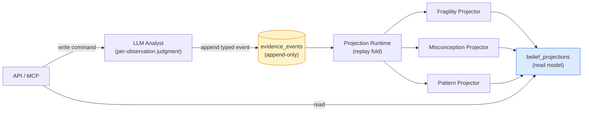
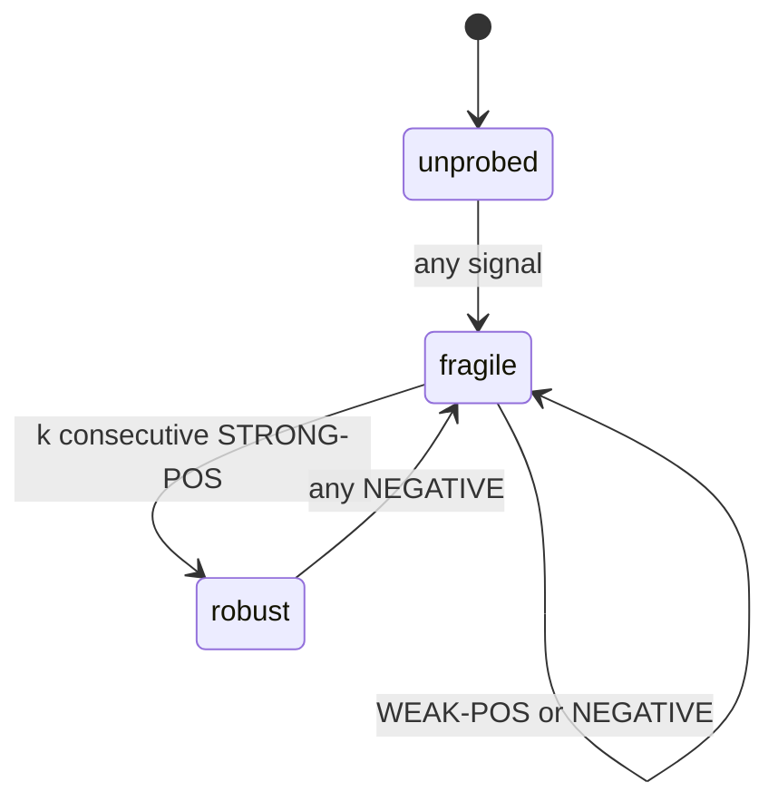
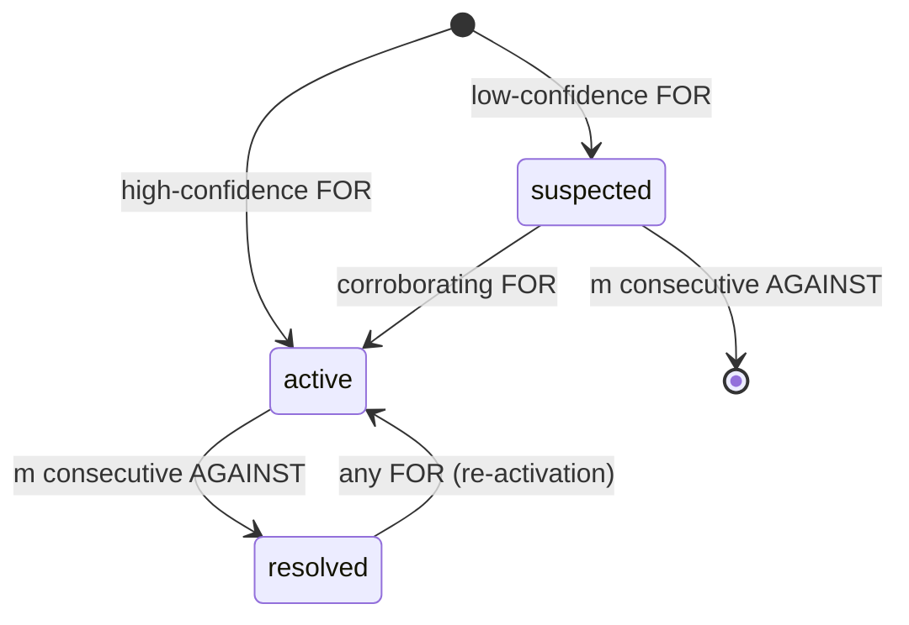

# Triển khai Engine

Engine của Stemolly suy ra `belief state` (trạng thái niềm tin) của học sinh — các `misconception` (ngộ nhận) mà các em đang có, mức độ mong manh trong hiểu biết, và những `reasoning pattern` (mẫu thói quen suy luận) mà các em thể hiện — từ một bản ghi quan sát vĩnh viễn theo kiểu `append-only` (chỉ cho phép ghi nối thêm). Không có niềm tin nào được ghi trực tiếp; mọi niềm tin đều được *tính ra* từ bản ghi đó. Trang này giải thích toàn bộ luồng tính toán ấy: `log` cung cấp đầu vào, ba `projector` (bộ chiếu) tạo nên từng lớp niềm tin, các bất biến mà chúng phải tuân thủ, và những khoảng trống đã biết vẫn còn bỏ ngỏ.

---

## Kiến trúc trong một hình

Engine đi theo mô hình `event-sourcing-lite` (biến thể gọn của event sourcing). Chỉ dữ liệu quan sát học sinh mới được `event-sourced` (lưu theo chuỗi sự kiện); còn nội dung, định danh và phiên làm việc dùng CRUD thông thường. Tính chất cốt lõi là **`evidence log` (nhật ký bằng chứng) là nguồn sự thật duy nhất**, còn toàn bộ `belief state` là một `projection` (phép chiếu) tất định, có thể dựng lại từ nó.

**Phía lệnh** (`graph`, `catalog`, `evidence`) kiểm tra hợp lệ rồi ghi nối thêm các quan sát có kiểu. **Phía truy vấn/suy diễn** (`projections/`) `replay` (phát lại) các quan sát đó thành `belief state`. Hai phía này **không bao giờ gọi trực tiếp lẫn nhau** — chúng chỉ gặp nhau qua `log` đã được lưu bền vững. Chính sự tách biệt chặt chẽ này khiến quy trình `truncate → replay → identical state` lành mạnh: nếu đường ghi thêm và đường suy diễn có thể gọi lẫn nhau, một lần `replay` sẽ lệch khỏi lần chạy trực tiếp ban đầu.

Đổi lại, hệ thống có khả năng tiến hóa. Khi mô hình niềm tin hóa ra sai — và với một công cụ mới thì đây mới là trường hợp *được kỳ vọng* — mã `projection` được viết lại rồi `replay` trên dữ liệu cohort đã bảo toàn, thay vì làm mất chúng. Sai thì vẫn rẻ. `Replay` `log` là một thao tác được hỗ trợ và có kiểm thử.

---

## Evidence Log

### Envelope và Payload

Mỗi `evidence event` được chia thành hai vùng với mức độ đảo ngược trái ngược nhau (ADR-021).

| Vùng | Dạng | Khả năng đảo ngược | Quy tắc |
|------|------|---------------|------|
| **Envelope** | Các cột có kiểu trên bảng `append-only` | Cửa một chiều — lược đồ của bảng `append-only` không thể thay đổi và các dòng cũ không thể mọc thêm cột | Chỉ chứa những trường mà `fold` **dùng để khóa hoặc tính trọng số**, hoặc mà truy vấn kiểm toán **cần `join`** |
| **Payload** | Cột JSONB | Có thể đảo ngược — mã `projection` mới có thể diễn giải lại `payload` cũ khi `replay` | Mọi thứ còn lại |

Kinh nghiệm thực hành là: **"khi phân vân, hãy để vào payload."** Các cột `envelope` là: `student`, `node`, `type`, `scaffold_stamp`, `checkpoint_id`, `session`, `brief_snapshot`, `ts`, và `idempotency_key`. Cách này dồn toàn bộ phần không thể đảo ngược vào một tập nhỏ, có chủ ý, đồng thời giữ cho các chi tiết dễ thay đổi vẫn có chi phí sai thấp — đặc biệt quan trọng vì đây là cánh cửa một chiều trên dữ liệu thật, không thể thay thế, của học sinh.

### Ba loại Event

Trường `type` của evidence chỉ có đúng ba giá trị. Mỗi giá trị đều gọi tên **một quan sát về tư duy**, chứ không phải một hành động sư phạm:

- **`misconception_evidence`** — payload: `catalogRef`, `polarity: for|against`, `confidence`, `excerpt`. Ghi lại: "Tôi đã thấy bằng chứng cho niềm tin sai này."
- **`probe_outcome`** — payload: `outcome: correct|incorrect|partial`, `confidence`, `excerpt`. Ghi lại liệu sự hiểu có đứng vững khi bị kiểm tra hay không.
- **`pattern_evidence`** — payload: `patternRef`, `confidence`, `excerpt`. Ghi lại một thói quen suy luận đang được thể hiện.

Ba loại này ánh xạ một-một với ba `projector`. Chúng đã được kiểm chứng bằng tám ca kèm cặp đối kháng trong Toán (Socratic) và Ngôn ngữ (Correct/Reinforce) mà không cần đến loại thứ tư nào.

Các `type` này **không bao giờ được** gọi tên cơ chế sư phạm (`socratic_hint`, `correction_issued`) hay chi tiết theo miền. Nếu làm vậy, một cách dạy học cụ thể sẽ bị đóng cứng vào dữ liệu vĩnh viễn, không thể `replay`, và phá vỡ tính trung lập của engine đối với miền lẫn phương pháp sư phạm. Nội dung theo miền nằm hoàn toàn trong `catalogRef`/`patternRef` và `payload`.

### Quy tắc Altitude

Có một ranh giới rõ giữa thứ LLM ghi ra và thứ engine tính ra.

- **LLM ghi**: một phán đoán trên từng quan sát — quyết định ngữ nghĩa về một khoảnh khắc ("Ở đây tôi thấy bằng chứng cho misconception X, độ tin cậy cao").
- **Engine suy ra**: trạng thái xuyên qua nhiều quan sát — phần ghi sổ cơ học của kích hoạt, độ mong manh và lan truyền trên nhiều phán đoán như thế.

Mỗi event phải là một **sự kiện tự thân đầy đủ** tham chiếu đến các ID catalog ổn định, chứ không phải đến `belief state` tại thời điểm ghi. Analyst có thể *đọc* `belief state` hiện tại để lấy ngữ cảnh (ví dụ: quyết định rằng một lời giải sạch là bằng chứng phản bác có ý nghĩa), nhưng *không bao giờ được phát lại chính trạng thái đã lưu đó thành event*. Nếu bắn lại một niềm tin ở mọi checkpoint, hệ thống sẽ đếm đôi bằng chứng, làm phình `log`, và ghi lại một kết luận thay vì một quan sát.

Quy tắc này được cưỡng chế ở ranh giới ghi. Bộ kiểm tra evidence từ chối mọi `payload` chứa tên trường của `belief state` (`fragility`, `mastery`, `activation`, `beliefState`, `misconceptionState`, `stability`). Một `allowlist` đầy đủ cho từng loại `payload` đã từng được cân nhắc rồi bị loại bỏ — hiện chưa có consumer nào cố định chính xác `payload` hợp lệ phải chứa gì, nên đóng băng lược đồ vào lúc hiểu biết còn ít nhất là quá sớm. `Denylist` chặn đúng rủi ro cụ thể (từ vựng của chính `fold` rò ngược về đầu vào của nó) mà không khóa hệ thống vào một hình dạng nhất định.

### Gom nhóm lần làm: `checkpoint_id`

Nhiều event có thể cùng mô tả một lần học sinh làm bài. Chẳng hạn, một lần tự sửa có thể sinh ra cả `misconception_evidence(for)` lẫn `probe_outcome(correct)`. Các `belief fold` phải gom các event của cùng một lần làm trước khi diễn giải chúng, vì câu chuyện tổng thể mới là thứ quan trọng:

- **Cùng checkpoint**: `for` + `correct` → lảo đảo nhưng hồi lại → tín hiệu dương yếu, khái niệm vẫn còn mong manh.
- **Khác checkpoint**: `for` ở một lần làm, `correct` ở lần sau → thật sự đã tiến bộ qua các lần làm.

`session_id` thì quá rộng (một phiên có nhiều lần làm); còn độ gần về thời gian không có ranh giới sạch. `checkpoint_id` là một cột `envelope` đóng dấu batch do một lần chạy Analyst tạo ra — tức một lần học sinh làm bài — theo đúng cấu trúc. Phía suy diễn xử lý các checkpoint theo thứ tự `(min event ts, checkpoint_id)` để giữ cho `replay` mang tính tất định.

### Idempotency Key — Từ theo-vị-trí sang theo-phạm-vi-định-danh (ADR-022)

Ràng buộc duy nhất ban đầu là `(checkpoint_job_id, segment, observation_index)`. Nó có một lỗi tinh vi: `observation_index` là vị trí trong một thứ tự theo định danh ngữ nghĩa. Chỉ cần chèn hoặc xóa một quan sát là mọi chỉ số phía sau đều bị dịch. Khi chạy lại cùng một job nhưng thay đổi một quan sát, `ON CONFLICT DO NOTHING` sẽ giữ lại dòng đã có và âm thầm bỏ qua dòng mới, hoặc nhân đôi một dòng khác — mà không trả ra lỗi nào.

Vì `evidence_events` là `append-only` nhờ trigger trong cơ sở dữ liệu, một dòng bị mất hay bị trùng đều không bao giờ sửa lại được — chỉ có thể bị lấn át bởi bằng chứng về sau. Mọi lần dựng lại đều sẽ `replay` đúng trạng thái đã bị hỏng đó.

**ADR-022** (phương án giải quyết) thay ràng buộc trên bằng `(checkpoint_id, segment, node_id, type, ref, occurrence)`. `occurrence` được neo trong chính nhóm định danh của nó, nên một quan sát mới chèn vào chỉ mở nhóm riêng ở vị trí 0 chứ không làm dịch khóa của dòng nào khác. `ref` (`catalogRef` hoặc `patternRef`) được nâng từ `payload` JSONB thành một cột text nullable riêng để có thể tham gia ràng buộc. `observation_index` được giải phóng khỏi vai trò định danh và giờ chỉ còn ghi thứ tự phát ra thực sự của quan sát, điều vốn quan trọng với `misconception fold` (xem bên dưới).

Ràng buộc được neo theo **checkpoint**, không phải theo job, vì checkpoint mới là đơn vị mà các `belief fold` coi là nguyên tử. Một lần chạy lại dưới job ID mới giờ sẽ va chạm đúng chỗ thay vì nhân đôi cả batch.

---

## Ba Projector

Mỗi `projector` là một `fold` tất định trên dòng event đã được gom theo checkpoint. Cả ba đều có thể đảo ngược: viết lại mã, `replay` `log`, nhận về `belief state` mới. Các núm hiệu chỉnh (`k`, `m`, `d`, ngưỡng) được để mở để tinh chỉnh trên dữ liệu thật.

### Fragility: Tính nhất quán theo thời gian

**Trạng thái:** `unprobed` → `fragile` → `robust`

`Fragility` được suy ra bằng một **`fold` hai tầng** trên các event `probe_outcome` của một concept node.

**Tầng 1 — quy mỗi checkpoint về một tín hiệu** (theo từng node):
- `STRONG-POS` — đúng, không trợ giúp, độ tin cậy cao
- `WEAK-POS` — đúng nhưng có giàn giáo, độ tin cậy thấp, hoặc tự sửa được
- `NEGATIVE` — sai, hoặc đang có một misconception còn active

Cột `envelope` `scaffold_stamp` cùng với giá trị confidence quyết định tín hiệu nào được áp dụng.

**Tầng 2 — điều khiển FSM**:

Một lần probe đúng không bao giờ đủ để lên `robust` — kể cả lần probe đầu tiên rất sạch thì cũng chỉ đi tới `fragile`. `Robust` chỉ đạt được khi có `k` `STRONG-POS` liên tiếp mà không bị chen bởi `NEGATIVE` (mặc định `k = 2`). Một `WEAK-POS` sẽ reset chuỗi. Một `NEGATIVE` làm `robust → fragile` ngay lập tức — một khái niệm tưởng đã robust mà vẫn thất bại chính là tín hiệu rủi ro ẩn. Bộ đếm nhỏ `strong_streak` được lưu cùng enum trong `projection` đã lưu.

Chính cơ chế chặn theo scaffold và confidence này khiến `fragility` mang nghĩa "đứng vững dưới kiểm tra thật" thay vì "cuối cùng cũng làm đúng."

### Misconception: Kích hoạt nhanh khi đủ chắc, gỡ bỏ thận trọng

**Trạng thái:** `suspected` → `active` → `resolved`

`Misconception projector` suy ra một instance theo từng bộ `(student, node, catalogRef)`, với **độ bất đối xứng ngược lại fragility**.

**Kích hoạt diễn ra nhanh, nhưng bị chặn bởi confidence**: chỉ cần một event `FOR` có confidence cao là đi thẳng tới `active` (một niềm tin sai có thể được xác lập từ một quan sát rõ ràng); còn `FOR` confidence thấp sẽ rơi vào `suspected` và cần thêm bằng chứng củng cố.

**Gỡ bỏ diễn ra chậm, đòi hỏi tích lũy**: để đi từ `active → resolved`, cần `m` event `AGAINST` liên tiếp mà không có `FOR` chen vào (mặc định `m = 2`). Việc tái kích hoạt khi có `FOR` về sau rất nhạy — nó phản chiếu logic thoái lui của fragility.

Sự bất đối xứng này được biện minh bởi chi phí sai số. `False positive` làm giảm độ chính xác về groundedness của hệ thống (thước đo headline), nên việc kích hoạt phải bị chặn bởi confidence. Còn gỡ bỏ quá sớm thì lại từ bỏ một misconception vẫn còn sống, nên quá trình gỡ bỏ phải bảo thủ.

Instance được khóa theo **home node** của mục catalog (không phải node nơi nó lộ ra), nhờ vậy tránh bị trùng xuyên node. Nó chỉ được tin ở mức headline khi instance là `active` **và** trạng thái catalog là `seeded` hoặc `approved` — hai cổng tin cậy độc lập. Cổng trạng thái catalog được đánh giá ở **thời điểm đọc dưới dạng `join`** giữa trạng thái instance × trạng thái catalog hiện tại, chứ không được nướng cứng vào `fold`. Vì vậy, khi người vận hành phê duyệt một mục catalog ứng viên mà evidence hiện có đã tham chiếu tới, việc nâng cấp lên mức trusted có hiệu lực **ngay lập tức mà không cần replay** — chỉ là một lần đổi trạng thái CRUD trên dòng catalog.

**Lan truyền ở thời điểm đọc**: tác động của một misconception gốc lên các khái niệm phía sau không được lưu trên chính các node phía sau ấy. Góc nhìn "node phía sau này đang có rủi ro" được tính khi đọc, bằng cách đi ngược các cạnh tiên quyết để tìm những niềm tin active ở thượng nguồn. Việc vật chất hóa sự lan truyền xuống các node hạ lưu đã bị loại bỏ vì chỉ cần thêm một cạnh mới hoặc một misconception mới ở thượng nguồn là sẽ lan ra và phải ghi lại rất nhiều dòng, còn `replay` thì phải tái tạo chính xác sự lan truyền đó. Các `projector` theo node nhờ vậy vẫn là những hàm tất định gọn sạch.

### Reasoning Pattern: Tích lũy xuyên node

**Trạng thái (suy ra ở thời điểm đọc):** `emerging` → `established` ↔ `fading`

`Pattern projector` được khóa theo `(student, patternRef)` — **xuyên node**, khác với các `fold` fragility và misconception vốn theo từng node. Một pattern là một xu hướng mà trạng thái của nó thay đổi theo thời gian ngay cả khi không có evidence mới, nên `fold` chỉ lưu **các bộ tích lũy tối thiểu**:
- Tập các concept node phân biệt mà pattern đã xuất hiện trên đó
- Các điểm củng cố `(checkpoint, confidence)`
- Checkpoint được củng cố đầu tiên và cuối cùng

`Strength` (có trọng số theo độ mới), `scope` (`|distinct_nodes|`), `status` và `valence` đều được suy ra ở thời điểm đọc.

Giai đoạn net tầng 1 củng cố một pattern tối đa một lần cho mỗi checkpoint (net confidence = confidence lớn nhất) và hợp nhất toàn bộ concept node mà checkpoint đó tham chiếu vào tập độ rộng.

Việc **thăng lên `established`** đòi hỏi một cổng duy nhất về độ rộng: được củng cố ở ≥ `d` checkpoint phân biệt trải trên ≥ `d` concept phân biệt. Điều này ngăn không cho một hành vi chỉ gắn với một concept, hoặc một lần làm giàu nội dung trên nhiều concept nhưng chỉ xảy ra một lần, bị nâng nhầm thành một thói quen xuyên suốt. Khi đã established, `strength` và độ mới quyết định chuyển dịch `established ↔ fading`.

Pattern là **ngoại lệ có chủ ý** đối với tính bám dính của niềm tin (xem bên dưới). Một misconception không tự biến mất; một niềm tin sai là sự kiện tiềm ẩn vẫn còn đúng cho đến khi bị phản chứng. Nhưng một thói quen thì chỉ mạnh bằng mức nó còn được thực hành gần đây — vì vậy pattern sẽ mờ dần nếu không được củng cố, thay vì tồn tại mãi không đổi.

**Fading dùng thời gian của evidence, không dùng đồng hồ thực.** "Bây giờ" được định nghĩa là checkpoint mới nhất trong `log`; mức mờ dần được đo bằng khoảng cách checkpoint. Pattern của một tài khoản ngủ yên sẽ không tự mờ đi (đây là điều chấp nhận được cho PoC). Cách làm dựa trên thời gian lịch đã bị loại vì một đầu vào là đồng hồ thực sẽ khiến trạng thái suy ra không còn tái lập được — cùng một `evidence log` sẽ cho đáp án khác nhau ở các thời điểm thật khác nhau, phá vỡ tính tất định của `replay`.

### Các quy tắc trung thực — Điểm thống nhất giữa ba fold

Mỗi `fold` chỉ suy ra một khẳng định mạnh khi đi qua một cổng thăng cấp, và **hình dạng của từng cổng khớp với đúng điều mà lớp đó khẳng định**:

| Lớp | Khẳng định | Hình dạng cổng |
|-------|-------|------------|
| Fragility | Tính nhất quán theo thời gian | Lặp lại (`k` strong-positive liên tiếp) |
| Misconception | Một niềm tin sai cụ thể | Confidence (một quan sát rõ ràng là đủ) |
| Pattern | Một thói quen xuyên suốt | Độ rộng (xuất hiện trên nhiều concept phân biệt) |

Nằm dưới cả ba cổng thăng cấp ấy là thêm một quy tắc: **không có evidence thì không được tạo ra instance nào cả**. Mọi trạng thái trong từ vựng của cả ba lớp đều đã hàm ý rằng đã quan sát được điều gì đó — `suspected` nghĩa là "đã quan sát một lần, nhưng yếu", `emerging` nghĩa là "đã được củng cố ít nhất một lần". Không có trạng thái nào mang nghĩa "chưa biết gì". Một `fold` trả về bất kỳ trạng thái nào cho một học sinh mà nó chưa từng thấy nói về tức là đang đưa ra khẳng định mà không có bằng chứng.

Điều này đã từng bị vi phạm trong thực tế. `Misconception fold` theo dõi đúng một sentinel nội bộ `unseen`, nhưng ở bước trả kết quả lại gộp nó thành `suspected`. Adapter khi đó không còn tín hiệu nào để phân biệt "chưa từng quan sát" với "nghi ngờ yếu", nên mỗi lần đọc đều trả về một entry cho mọi misconception đã approved trong catalog — một học sinh hoàn toàn mới trông như đang bị nghi ngờ yếu với mọi misconception đã ghi nhận, và mức nhiễu tăng theo kích thước catalog. Cách sửa là biến sự vắng mặt thành giá trị trả về hạng nhất: `foldMisconception` trả về `MisconceptionState | null`, còn adapter bỏ qua `null`. `Pattern fold` thì không cần đổi chữ ký vì danh sách `reinforcements` rỗng vốn đã báo hiệu sự vắng mặt.

---

## Các bất biến chính

**Belief có tính bám dính.** Một checkpoint không sinh ra event nào về một concept nhất định thì sẽ giữ nguyên belief của concept đó đúng như trước. Không có bằng chứng không có nghĩa là bằng chứng phủ định. Analyst đọc `belief state` đã lưu như *ngữ cảnh* nhưng không bao giờ được phát lại nó thành event — nếu làm vậy sẽ đếm đôi, làm phình `log`, và ghi lại một kết luận thay vì một quan sát. (Điều này áp dụng cho misconceptions và fragility; pattern là ngoại lệ vì chúng có thể mờ dần.)

**Misconception fold là fold duy nhất nhạy với thứ tự.** Tầng 1 của fragility net bằng cách quét xem có tín hiệu âm nào hay không — nên kết quả không đổi theo thứ tự event. Pattern fold net bằng cách lấy confidence lớn nhất và hợp nhất các node ID — cả hai đều độc lập với thứ tự. Nhưng misconception fold thì lại đếm các event `AGAINST` *liên tiếp*, và reset nếu gặp bất kỳ `FOR` nào. Một misconception đang `active` nếu gặp `[for, against, against]` trong một checkpoint thì sẽ được gỡ; nhưng cũng chính ba event đó nếu là `[against, against, for]` thì vẫn để nó ở `active`. Vì vậy, thứ tự event bên trong một checkpoint thật sự quan trọng.

Lượt đọc projection hiện tại sắp xếp theo `ORDER BY ts, id`. Cách này đóng được lỗ hổng về tính tất định của `replay` (nhiều lần đọc lặp lại giờ sẽ đồng nhất), nhưng không sắp xếp theo trình tự quan sát thực sự. `ts` được điền bằng `now()` tại thời điểm insert — giống nhau cho mọi dòng trong một câu lệnh `appendCheckpointBatch` — nên thứ tự sắp xếp thực tế rơi xuống UUID ngẫu nhiên. Kết quả là `fold` trở nên tất định quanh một thứ tự *tùy tiện*. Cách sửa là dùng `ORDER BY ts, segment, observation_index`, vì ADR-022 đã giải phóng `observation_index` khỏi vai trò định danh để nó chỉ còn ghi thứ tự phát ra thực sự.

---

## Các vấn đề còn mở và khoảng trống của lược đồ

### Gộp bí danh node — Chưa có gì xử lý

`mergeNodes(survivorId, aliasId)` chỉ ghi đúng một cột — `nodes.merged_into` — và không có đường đọc hay ghi nào khác tra cứu cột này. `getPrerequisites` không resolve node đầu vào qua `merged_into`; các cột `home_node_id` của bảng catalog cũng không được resolve; cả evidence repository lẫn projection repository đều không tham chiếu `merged_into`. Sau khi gộp node E vào node sống sót F: `getPrerequisites(F)` không trả gì; `matchCatalog(F)` không tìm ra entry nào; evidence của học sinh vẫn bám vào E và `belief state` bị xé đôi giữa một khái niệm và chính trạng thái nghỉ hưu của nó.

**ADR-024** chốt nguyên tắc xử lý resolve. `mergeNodes` tiếp tục chỉ ghi một cột. Việc resolve diễn ra ở thời điểm đọc, trong phần lõi của module — nơi duy nhất có thể chạm vào nhiều hơn một port. Không adapter nào được phép tự resolve thứ gì. `evidence_events` là `append-only` nhờ trigger của cơ sở dữ liệu và không bao giờ có thể viết lại `node_id`, nên việc resolve ở thời điểm đọc là bắt buộc trong mọi trường hợp.

Việc resolve alias cần hai thao tác trái chiều:

- **`resolveAlias(id) → survivorId`** — nhiều-về-một; áp dụng cho mọi node ID *đi ra khỏi* engine, và cho `node_id` của evidence cùng `home_node_id` của catalog tại thời điểm fold và match.
- **`expandAliases(survivorId) → Set<id>`** — một-về-nhiều, có tính bắc cầu; áp dụng cho mọi node ID *đi vào* một truy vấn trên bảng đang lưu các ID lịch sử.

Chiều ngược là phần ít hiển nhiên hơn. Sau E → F, các prerequisite của F nằm trên những cạnh được lưu dưới dạng `from_node_id = E`, nên nếu chỉ resolve đầu vào truy vấn theo chiều thuận thì cũng không giúp được gì. `CTE` đệ quy phải khởi tạo trên *tập* `{F, E}` và match bằng `= ANY(...)` cả ở hạt giống lẫn ở bước `join` đệ quy — nếu không, chỉ cần giữa đường gặp một alias là cả hành trình sẽ gãy ngay tại đó.

### Kiểm tra loại cạnh — Lỗi im lặng

`engine.edges.type` là `text` thuần, không có ràng buộc CHECK. Toàn bộ cơ chế duyệt đồ thị chỉ lọc theo literal `type = 'prereq'`. Một cạnh được seed là `'prerequisite'`, `'Prereq'` hay `'prereq '` vẫn được cả cơ sở dữ liệu lẫn trình biên dịch TypeScript chấp nhận, nhưng rồi lặng lẽ không bao giờ được duyệt — khái niệm trông như không có tiên quyết nào, không lỗi và cũng chẳng có dòng log nào.

**ADR-025** chỉ ra rằng `edges.type` đang mang hai lớp từ vựng chung một cột: các quan hệ **cấu trúc** mà mã của engine có rẽ nhánh dựa vào (`prereq`; một quan hệ taxonomy đã được hoạch định nhưng chưa xây), và các quan hệ **theo miền** mà engine không hề tự diễn giải. R-5 chỉ chi phối nửa theo miền — `prereq` là quan hệ cấu trúc của đồ thị, không phải môn học hay phương pháp sư phạm. Engine khai báo các quan hệ mà nó tự diễn giải thành một hằng `STRUCTURAL_EDGE_TYPES` trong `domain/graph/edge.ts` và coi mọi thứ còn lại là opaque. Việc kiểm tra ở ranh giới module chỉ là kiểm tra định dạng: một regex duy nhất `/^[a-z][a-z0-9-]*$/` loại `'Prereq'` và `'prereq '` ngay tại thời điểm gọi, còn `'motivates'` hay `'contrasts-with'` thì đi qua nguyên trạng. Không dùng CHECK constraint — vì CHECK sẽ đóng cột này lại trước các quan hệ theo miền trong tương lai.

*(Vẫn còn sót một trường hợp: `'prerequisite'` là một slug hợp lệ về mặt hình thức và lại là một từ khác với `'prereq'`, nên nó sẽ được lưu như một cạnh theo miền và không bao giờ được duyệt. Không có quy tắc định dạng nào bắt được kiểu đồng nghĩa này.)*

**Một lưu ý bên lề về tên bảng catalog**: các bảng của engine có tên là `misconception_catalog` và `pattern_catalog`. Nhìn lướt thì chúng giống vi phạm R-5 — R-5 cấm lược đồ của engine gọi tên môn học, ngôn ngữ hay phương pháp sư phạm. Nhưng xem kỹ thì không sao: "misconception" và "pattern" là từ vựng cấp engine của chính dự án, không phải nội dung theo môn học. Khác biệt ở đây là lược đồ so với dữ liệu — không có tên *cột* nào gọi tên môn học hay cách dạy, trong khi các *dòng* catalog dĩ nhiên sẽ gọi tên những khái niệm thật, và đó chính là nơi R-5 muốn nội dung theo miền nằm vào. Lập luận tương tự cũng áp dụng cho `nodes.slug`, nơi các giá trị sẽ gọi tên những khái niệm như `equivalent-fractions` — cột slug là một khóa tự nhiên để seed idempotent, còn nội dung bên trong nó là dữ liệu. Điều này đáng nhớ vì các tên ấy sẽ khiến mọi reviewer tương lai phải nghi ngờ ngay từ cái nhìn đầu tiên.

### Pattern Valence — Đã thiết kế nhưng chưa xây

Cả hai bảng catalog được tạo ra từ một bộ cột dùng chung (`id`, `home_node_id`, `status`, `slug`, `label`, `description`, timestamps). `Pattern catalog` không có cột `valence`. Thiết kế nói rằng `valence` được đọc từ entry catalog tại lúc overlay, nên `PatternInstanceView.valence` đang bị hard-code thành `null` trên mọi pattern được trả về.

`Valence` là thứ phân tách một thói quen đáng được củng cố với một thói quen cần bị ngắt. Không có nó, một consumer đọc `status` và `strength` sẽ không biết một pattern đã established là tín hiệu tốt hay xấu. Cách sửa cần thêm một cột chỉ trên bảng pattern — còn misconception thì mặc định đã có hại theo định nghĩa, nên misconception catalog không cần cột này. Bộ cột dùng chung trong migration ban đầu không thể đơn giản nới rộng; bảng pattern cần có `addColumns` riêng. Khoảng trống này đã được nhận ra trước khi adapter được viết; kiểu view được khai báo nullable như một giải pháp tạm, và có một bài kiểm thử khóa chặt hành vi `null` hiện tại để nó không bị hiểu nhầm là tai nạn.

### Phân loại Port — `getBeliefState` không phải phương thức repository

Tài liệu thiết kế của engine đã khai báo bề mặt `driving port` (những gì caller bên ngoài gọi vào) nhưng không khai báo bề mặt `driven` (những gì phần lõi cần từ hạ tầng). Bản dựng đã lấp chỗ trống này bằng cách nhân bản tên của `driving port` thành tên interface repository. Với đa số thao tác — "lưu cái này / lấy cái kia" — chuyện đó vô hại. Nó hỏng ở `getBeliefState`, vì đây là một phép tính trên ba nguồn chứ không phải một lượt đọc từ nơi lưu trữ.

Chỉ riêng việc đặt tên nó là một phương thức repository đã biến nó thành như vậy về mặt khai báo. Repository khi ấy buộc phải chạy các `fold`, nên nó cần entry catalog và prerequisite, tức là phải giữ thêm hai port khác. Khoảng 130 dòng quy tắc suy luận belief thế là nằm cạnh SQL. Các lượt review đối chiếu tên với tài liệu thiết kế và thấy khớp, nên sự phân loại sai này lọt qua ba vòng review liên tiếp — nó chỉ lộ ra khi so sánh cả bốn adapter cùng lúc.

---

## Các trang liên quan

- Để xem mô hình niềm tin định nghĩa fragility, misconceptions và patterns *có nghĩa gì*, hãy xem [Mô hình tinh thần](./mental-model.md).
- Để xem cách tính đúng đắn của engine được kiểm chứng bằng các fitness function, hãy xem [Kiểm chứng Engine](./engine-validation.md).
