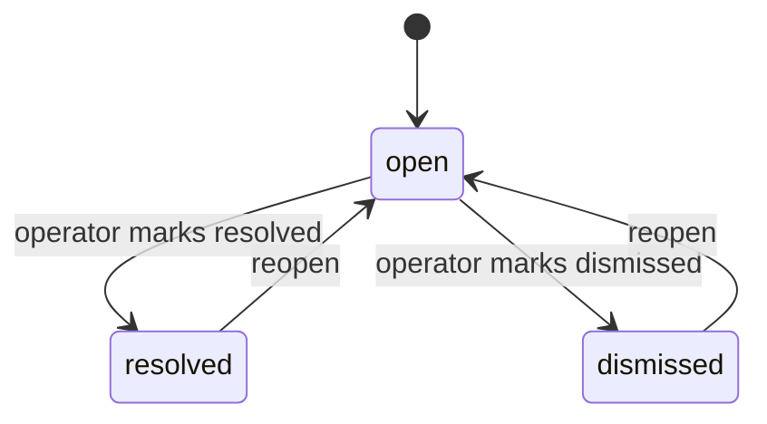
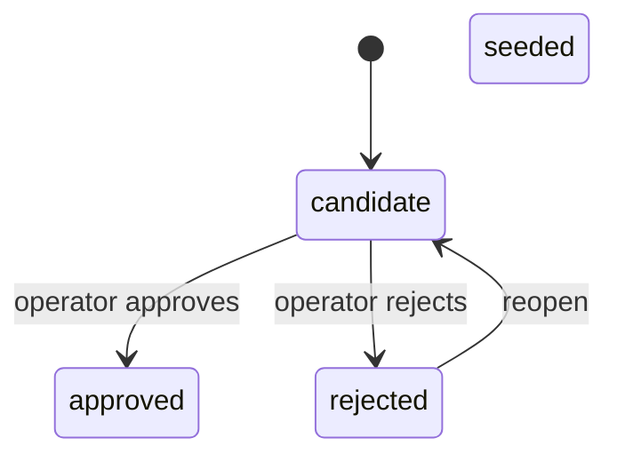

Mọi misconception (ngộ nhận) và reasoning pattern (mẫu hình lập luận) mà engine có thể nhận ra đều tồn tại dưới dạng một hàng trong catalog (danh mục), và hàng đó mang theo một trust status (trạng thái độ tin cậy). Trang này giải thích cách status đó thay đổi, và vì sao việc đổi nó không bao giờ đòi hỏi phải đụng vào dữ liệu belief (niềm tin) bên dưới.

## Vị trí của cổng phê duyệt thủ công

"AI drafts, human approves" nghe như một quy tắc duy nhất, nhưng engine thực thi nó ở hai vị trí khác nhau tùy theo từng artifact.

**Với graph nodes (nút đồ thị) và edges (cạnh)**, cổng này nằm *trước* khi ghi. `engine.nodes` và `engine.edges` không có status column (cột trạng thái) — `seedNode` và `seedEdge` là các idempotent upserts (thao tác upsert lặp lại vẫn cho cùng kết quả) và được ghi nhận là đáng tin cậy ngay khi được gọi. Vì vậy, operator phải đọc danh sách được draft trong cuộc hội thoại rồi mới gọi `seed_node`. Khái niệm đó tồn tại trong transcript (bản ghi hội thoại) như một bản nháp cho tới khi con người nói đồng ý.

**Với catalog entries**, cổng này nằm *sau* khi ghi. Vì các bảng catalog mang bốn status với ba transition hợp lệ, một entry có thể được lưu dưới dạng `candidate` rồi mới được đánh giá sau đó, thông qua `approve_candidate`, `reject_candidate` và `reopen_candidate`.

Phương án thêm status column vào `engine.nodes` để làm cho hai bên đối xứng đã bị bác bỏ. Một node tự nó không làm gì cho tới khi có evidence bám vào; một display name sai thì sửa bằng cách seed lại cùng slug; còn một identity sai thì sửa bằng `mergeNodes`. Cột đó sẽ chỉ thêm một cổng kiểm soát vốn đã có sẵn miễn phí trong luồng hội thoại, trong khi lại phải trả giá bằng một migration và một ADR.

:::caution
Khi đọc bất cứ chỗ nào nói rằng node được "seeded as candidates", hãy cẩn thận: với graph, điều đó có nghĩa là *được draft trong transcript và hoàn toàn chưa được persist cho tới khi được phê duyệt* — chứ không phải đã được persist trong trạng thái candidate. Chỉ catalog mới có trạng thái candidate để persist vào.
:::

## Báo cáo các khái niệm chưa được seed: concept gaps

Khi một tutoring session gặp một khái niệm mà chưa ai seed, session sẽ không ghi gì cho khái niệm đó và sẽ báo lại sự thiếu hụt này thay vì tự tạo ra một node. Những báo cáo đó cần có nơi đích đến — nếu không, tín hiệu này chỉ là một câu trong cửa sổ chat và sẽ biến mất khi session kết thúc.

`engine.concept_gaps` lưu các báo cáo đó: mỗi báo cáo một hàng, với foreign key (khóa ngoại) trỏ tới study anchor (mốc học tập) còn thiếu, khái niệm được lưu dưới dạng free text (văn bản tự do), và một status mà operator có thể chỉnh sửa:

`resolved` và `dismissed` được giữ tách biệt một cách có chủ ý. Một trường hợp seed thiếu thật sự và một khái niệm được cố ý giữ ngoài graph là hai phép đo khác nhau; gộp chúng lại sẽ làm sai lệch rate (tỷ lệ).

**Tỷ lệ của các báo cáo này là phép đo duy nhất cho biết việc seeding tốt đến đâu** — đó cũng chính là lý do đã nêu khiến việc tạo node không được đặt trên session path ngay từ đầu. Nếu không có một nơi lưu bền vững, rate này sẽ không thể biết được.

Hai giới hạn đã được xây sẵn và được chấp nhận. Không có gì có thể kiểm tra rằng một session có thực sự *báo* một gap hay không, nên số đếm này chỉ là cận dưới chứ không phải tỷ lệ thật. Và vì khái niệm được lưu dưới dạng free text, bảng này đếm số báo cáo chứ không đếm các khái niệm phân biệt.

:::note
Kênh giao tiếp hiện có từ session tới operator — đề xuất một catalog candidate — không thể được tái sử dụng ở đây. Việc đề xuất một candidate đòi hỏi phải có home node slug phân giải được, nên một khái niệm chưa có node không thể đi theo con đường đó. Về mặt cấu trúc, cơ chế gap đóng lại đúng với trường hợp này, và đó là lý do tồn tại một bảng riêng.
:::

## Trust được đọc trực tiếp, không được nướng sẵn vào fold

Việc một misconception đã được ghi nhận có được tính vào bức tranh tổng thể về một học sinh hay không phụ thuộc vào hai yếu tố độc lập: state của chính folded instance (`active` so với `suspected`), và status hiện tại của catalog entry (`seeded`/`approved` hay vẫn còn là `candidate`). Nửa kiểm tra liên quan đến catalog status này được cố ý đánh giá **ở thời điểm đọc, dưới dạng một phép join (nối)**, thay vì được nướng sẵn vào chính fold (quá trình gộp trạng thái).

Hệ quả là tức thì và hữu ích: khi operator phê duyệt một candidate entry mà evidence hiện có của học sinh đã trỏ tới, evidence đó trở thành đáng tin cậy ngay tại thời điểm status đổi — chỉ là một lần cập nhật status bình thường, không cần replay hay rebuild. Việc giữ cho bản thân fold không biết gì về catalog status cũng chính là điều giúp replay có tính xác định: đầu ra của một fold chỉ phụ thuộc vào evidence log, chứ không bao giờ phụ thuộc vào một quyết định của operator được đưa ra về sau.

## Reject và reopen: có thể sửa lại, không phải điểm cuối

Catalog entries cũng có thể bị reject, và một entry đã reject có thể được reopen. Các transition hợp lệ tạo thành đúng ba cạnh:

`approved` chỉ có đúng một cạnh đi vào, từ `candidate` — việc reopen một entry đã reject luôn đưa nó về trạng thái *chưa được phán quyết*, chứ không bao giờ trả thẳng về trạng thái đáng tin cậy, nên việc phê duyệt lại vẫn phải đi qua đúng cổng như mọi lần nâng cấp khác. Một entry do con người tự viết (`seeded`) thì hoàn toàn không có transition đi ra nào được mô hình hóa; việc cho nó ngừng sử dụng là một vấn đề riêng.

Rejection được cố ý thiết kế là **có thể sửa lại thay vì là chung cuộc**. Hình dạng ban đầu có vẻ gọn gàng nhất là reject một chiều, nhưng rồi điều đó lộ ra là nguy hiểm: một lần reject nhầm dưới một status kết thúc sẽ không thể cứu vãn và cũng diễn ra trong im lặng, vì một catalog slug là duy nhất và evidence đang trỏ tới nó không thể bị sửa hay chuyển đi sau khi đã được ghi. Vì trust được kiểm tra trực tiếp ở thời điểm đọc chứ không có state nướng sẵn nào, việc hoàn tác một lần reject không tốn gì hơn ngoài một lần đổi status — mọi quan sát lịch sử gắn với entry đó sẽ được nhặt lại ngay ở lần đọc kế tiếp. Nếu làm cho rejection trở thành vĩnh viễn, hệ thống sẽ tự vứt đi tính đảo ngược mà thiết kế vốn đã trả chi phí để có được ở những chỗ khác.

Một hệ quả của việc "reopen trả về trạng thái chưa được phán quyết, chứ không trả về trạng thái đáng tin cậy" rất dễ bị hiểu ngược: reopen một entry đã reject **không** tự động khiến evidence của nó được tính trở lại. Belief-state read chỉ tin các entry có status là `seeded` hoặc `approved`, nên một entry đã reopen vẫn tiếp tục bị loại ra đúng như khi còn bị reject — cho tới khi operator thực sự phê duyệt nó. Điều được đảm bảo hẹp hơn nhưng vẫn rất quan trọng: dấu vết evidence gắn với entry đó sống sót hoàn toàn nguyên vẹn qua vòng reject-rồi-reopen, và bắt đầu fold đúng trở lại ngay khi việc phê duyệt cuối cùng cấp trust, không cần rebuild.

## Slug là duy nhất theo kind, không phải trên toàn bộ catalog

Catalog thực ra là hai bảng — một cho misconceptions, một cho patterns — và mỗi bảng tự khai báo tính duy nhất trên `slug`. Vì vậy, cùng một chuỗi slug hoàn toàn có thể tồn tại hợp lệ một lần với tư cách misconception và một lần với tư cách pattern, như hai entry hoàn toàn độc lập với id, status và lịch sử khác nhau. Do đó, tra cứu chỉ bằng slug buộc phải đoán nó đang nói tới bảng nào, và kết quả sẽ âm thầm trả lời về kind nào tình cờ có hàng khớp trước — một câu trả lời đúng cho sai câu hỏi. Đây là chỗ rất dễ nhầm theo lối suy luận tương tự, vì node slugs lại hành xử khác: nodes nằm trong một bảng duy nhất với một ràng buộc duy nhất, nên chỉ riêng node slug đã xác định hẳn một node. Mang trực giác đó sang catalog sẽ tạo ra đoạn mã trông có vẻ đúng nhưng lại hỏi sai điều cần hỏi.

## Chặn việc đề xuất lại đè lên một entry đã reject

Slug của một catalog entry đã reject không được phép bị tái sử dụng một cách âm thầm nếu ai đó đề xuất một entry mới dưới cùng tên — điều đó sẽ ghi đè nội dung của entry trong khi vẫn để nó ở trạng thái reject, rồi trả về một tham chiếu tới thứ trông như một khái niệm đã chết. Quy tắc này được cố ý thể hiện đồng thời ở hai nơi: một kiểm tra tường minh trong core logic (logic lõi) của module, và một mệnh đề `WHERE status <> 'rejected'` tương ứng được gắn ngay trong chính thao tác ghi vào cơ sở dữ liệu.

Hai bản sao đó được đặt ra để làm hai việc khác nhau một cách có chủ ý. Kiểm tra ở core nêu ra **quy tắc** — đó là nơi người đọc tìm đến để hiểu điều gì bị cấm, và cũng là thứ tạo ra lỗi hiển thị cho bên gọi. Mệnh đề ở cơ sở dữ liệu thì khép lại một **timing window (khoảng hở thời điểm)** hẹp hơn: nếu không có nó, một lần reject xảy ra chen vào giữa lúc core kiểm tra và lúc ghi thật xuống vẫn có thể lọt qua. Phương án xóa phần kiểm tra phía core và chỉ dựa vào mệnh đề ở cơ sở dữ liệu cũng đã được cân nhắc — đó là thay đổi nhỏ hơn, và hành vi vẫn sẽ đúng — nhưng đã bị bác bỏ vì như vậy quy tắc sẽ không còn được diễn đạt ở nơi nào người đọc có thể thấy ngoài một mẩu logic cơ sở dữ liệu, trái với nguyên tắc đang được giữ rằng các quy tắc của engine phải đọc hiểu được mà không cần đọc SQL.

Bản thân hàng rào bảo vệ đó ban đầu cũng có một lỗi về phạm vi: phần kiểm tra phía core đi tìm status của entry bằng cách quét cả hai bảng catalog theo một thứ tự cố định, thay vì đúng bảng mà kind của entry thực sự nằm trong đó, nên về nguyên tắc phần đọc và phần ghi có thể đang hỏi về hai hàng khác nhau. Bản sửa đưa cả kiểm tra status lẫn thao tác insert đi qua cùng một helper chọn bảng dùng chung, để hai bên không còn có thể lệch nhau nữa — chúng trả lời cùng một câu hỏi qua cùng một hàm, thay vì chỉ tình cờ khớp nhau.
