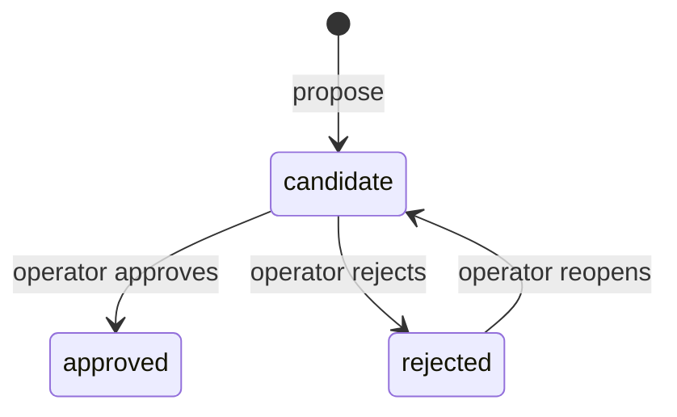
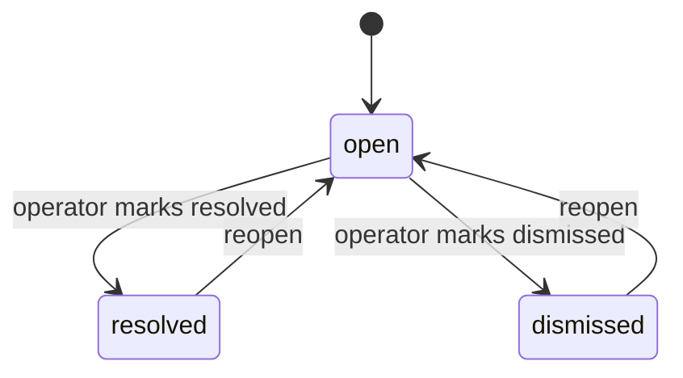
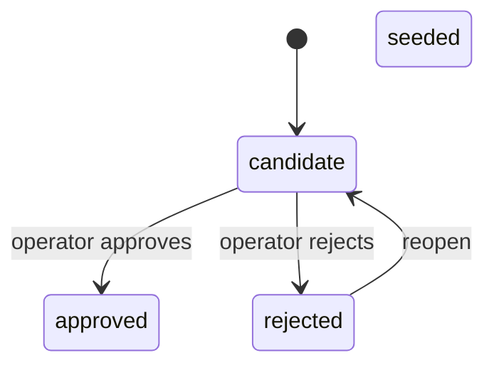

Engine duy trì hai bảng catalog (bảng danh mục) — `engine.misconception_catalog` và `engine.pattern_catalog`. Dù các tên này nghe có vẻ thiên về sư phạm, đây là vocabulary (hệ thuật ngữ) ở cấp engine của dự án chứ không phải chỗ domain bị rò vào. Cách đặt tên này đã được chốt: "misconception" và "pattern" là những thuật ngữ dự án dùng xuyên suốt trong engine, không phải thứ được mang sang từ một môn học cụ thể.

Một catalog entry (mục catalog) là thứ mà `catalogRef` và `patternRef` trong một evidence event (sự kiện bằng chứng) trỏ tới. Việc định nghĩa catalog entry cho đúng là rất quan trọng: các hàng evidence neo vào đó trong một bảng append-only, nên chỉ cần một entry bị đổi tên, bị xóa hoặc được gán sai trust thì belief state (trạng thái niềm tin) sẽ bị làm hỏng vĩnh viễn.

## Bốn trạng thái

Mỗi catalog entry mang một trong bốn trạng thái, và chỉ có đúng ba transition (chuyển trạng thái) hợp lệ:

`seeded` không có transition đi ra nào — một entry được viết tay không thể bị cho ngừng dùng thông qua đồ thị này. Có đúng một pure function (hàm thuần) trong lớp domain giữ đồ thị chuyển trạng thái này, và đó là nơi duy nhất nó tồn tại.

**Vì sao rejection có thể sửa lại chứ không phải là điểm cuối?** Nếu reject nhầm mà đó lại là trạng thái kết thúc thì sẽ không thể cứu được: slug là duy nhất, evidence log chặn `UPDATE`/`DELETE`, và việc đề xuất lại trên chính slug đó cũng bị chặn. Mọi quan sát đã neo vào đó sẽ âm thầm không còn được tính nữa. Vì trust được đánh giá ở read time (thời điểm đọc) và không cần replay, hoàn tác một lần reject chỉ tốn một lần lật cột trạng thái, và ở lần đọc kế tiếp mọi quan sát lịch sử sẽ được khôi phục.

## Trust được đánh giá ở thời điểm đọc

Một misconception instance (thể hiện của misconception) chỉ được trust ở mức headline khi **cả hai** điều kiện đều đúng:
1. Trạng thái instance sau khi fold (gộp) là `active`.
2. Trạng thái của catalog entry là `seeded` hoặc `approved`.

Phần kiểm tra trạng thái catalog này là một phép join ở thời điểm đọc, chứ không được nướng sẵn vào fold. Điều đó có nghĩa là:
- Khi một candidate entry mà evidence hiện có đã trỏ tới được phê duyệt, nó lập tức được nâng lên thành trusted **ngay tức thì, không cần replay** — chỉ là một lần đổi trạng thái CRUD.
- Khi một entry bị reject, nó sẽ biến mất khỏi belief state ở lần đọc kế tiếp.

Việc giữ cho fold độc lập với trạng thái catalog cũng giúp bảo toàn replay có tính tất định — đầu ra của fold là một pure function của riêng event log.

## Reopen không khôi phục trust

Khi reopen một entry đã reject, nó quay về `candidate`, không quay về `approved`. Phần đọc belief state chỉ fold các entry có trạng thái `seeded` hoặc `approved`, nên một entry vừa reopen vẫn tiếp tục bị loại ra — đúng như lúc nó còn bị reject, và cũng đúng như trước khi có ai đưa ra phán quyết.

Evidence neo vào entry đó chỉ bắt đầu được tính khi một operator phê duyệt nó. Cách này hẹp hơn cách hiểu tự nhiên của câu "reopen sẽ khôi phục entry", nhưng đó mới là điều mà đồ thị chuyển trạng thái và cặp trusted-status trong fold thực sự đảm bảo.

## Tính duy nhất của slug là theo kind

Catalog slug chỉ duy nhất *trong từng bảng*, chứ không phải trên cả hai bảng. Cùng một chuỗi slug hoàn toàn có thể tồn tại hợp lệ vừa như một misconception entry vừa như một pattern entry — hai hàng độc lập, với id, trạng thái và lịch sử khác nhau.

Vì vậy, mọi thao tác lookup theo slug chỉ có ý nghĩa khi đi kèm với kind. Một helper chỉ nhận mỗi slug buộc phải đoán bảng, mà đoán như vậy nghĩa là nó sẽ trả lời về kind nào tình cờ có hàng trước. Node slug thì khác (duy nhất trên toàn cục), nên trực giác từ việc lookup node slug không thể bê nguyên sang catalog.

## Cổng phê duyệt của con người

Với catalog entry, approval gate (cổng phê duyệt) nằm **sau** thao tác ghi. Một entry được persist dưới dạng `candidate` rồi mới được đánh giá qua `approve_candidate`/`reject_candidate`/`reopen_candidate`. Làm được vậy là vì vòng đời bốn trạng thái này biểu diễn được cơ chế kiểm duyệt sau khi ghi.

Đối chiếu với nodes và edges: `engine.nodes` và `engine.edges` không có cột trạng thái. `seedNode`/`seedEdge` là các idempotent upserts (upsert lặp lại vẫn cho cùng kết quả) và được ghi nhận là trusted ngay khi được gọi. Với graph, approval gate phải nằm **trước** thao tác ghi — operator đọc danh sách bản nháp trong cuộc hội thoại, rồi mới gọi `seed_node`.

Sự bất đối xứng này là có chủ ý. Phương án thêm cột trạng thái cho `nodes` đã bị bác bỏ: một node tự nó là thứ trơ cho tới khi có evidence treo lên, display name sai thì sửa bằng cách seed lại, còn identity sai thì sửa bằng `mergeNodes`. Cổng kiểm duyệt thực ra đã có sẵn miễn phí rồi.

## Cơ chế chặn re-propose

Việc đề xuất lại trên một slug đã reject sẽ ném lỗi thay vì âm thầm upsert. Trước khi có cơ chế chặn này, thao tác re-propose sẽ ghi lại label của entry nhưng vẫn để nó ở trạng thái rejected, rồi trả về một tham chiếu tới một khái niệm đã chết.

Cơ chế chặn này được cố ý thể hiện ở hai nơi:
- **Module core:** một kiểm tra tường minh rồi ném lỗi. Đây là nơi *quy tắc* được đặt ra — có thể đọc hiểu mà không cần đọc SQL.
- **Adapter SQL:** `ON CONFLICT ... WHERE status <> 'rejected'`. Chỗ này bịt một time-of-check-to-time-of-use window (khoảng hở giữa lúc kiểm tra và lúc sử dụng), nơi một lần reject đồng thời có thể chen vào sau khi core đã kiểm tra nhưng trước khi thao tác ghi diễn ra.

Hai chỗ này không thừa nhau. Kiểm tra ở core tạo ra lỗi hiển thị cho bên gọi; mệnh đề SQL xử lý race (điều kiện tranh chấp). Phương án xóa phần kiểm tra phía core từng được cân nhắc (vì đó là thay đổi nhỏ hơn) rồi bị bác bỏ — nó sẽ khiến quy tắc chỉ còn được diễn đạt bên trong adapter.

## Pattern valence

`engine.pattern_catalog` có một cột `valence` cho phép null (`helpful` / `harmful`). Cột này được thêm bằng một migration (di trú lược đồ) nhắm đúng vào một bảng. `misconception_catalog` thì không có thêm gì — misconception mặc định là harmful theo định nghĩa.

Valence là nội dung chứ không phải trust, nên một lần re-seed có tính idempotent vẫn có thể cập nhật nó (quy tắc never-downgrade chỉ loại trừ `status`). Ở ranh giới phía consumer, valence là thứ phân biệt một thói quen nên được củng cố với một thói quen nên bị ngắt lại. Một client chỉ đọc trạng thái và strength của pattern mà không có valence thì sẽ không biết một pattern đã hình thành là tin tốt hay tin xấu.

## `engine.edges.type` — structural hay domain

`engine.edges.type` chứa hai hệ vocabulary. Các quan hệ **structural** mà chính mã của engine có phân nhánh xử lý (`prereq`, và một quan hệ taxonomy đã được phê chuẩn nhưng chưa xây dựng). Và các quan hệ **domain** mà engine không bao giờ diễn giải. Lệnh cấm của R-5 đối với tên miền chuyên ngành trong lược đồ engine chỉ áp dụng cho nhóm thứ hai.

Cách tiếp cận hiện tại (ADR-025): engine khai báo các quan hệ mà nó tự diễn giải dưới dạng hằng `STRUCTURAL_EDGE_TYPES` trong `domain/graph/edge.ts`, và chấp nhận mọi thứ còn lại như dữ liệu opaque (mù nghĩa). Mức validation (kiểm tra hợp lệ) chỉ là kiểm tra định dạng: regex `/^[a-z][a-z0-9-]*$/` được áp vào lệnh seed edge. Điều này sẽ chặn `'Prereq'` hoặc `'prereq '` một cách dứt khoát, và cho `'motivates'` đi qua nguyên vẹn. Không có ràng buộc DB `CHECK`, vì một `CHECK` sẽ khóa cứng cột này khỏi các quan hệ domain.

:::caution
`'prerequisite'` là một slug đúng định dạng nên vẫn qua được kiểm tra định dạng — nhưng nó là một từ khác với `'prereq'` và sẽ được lưu như một domain edge mà hệ thống không bao giờ duyệt qua. Không có quy tắc định dạng nào bắt được chuyện dùng từ đồng nghĩa.
:::

Mọi misconception và reasoning pattern mà engine có thể nhận ra đều tồn tại dưới dạng một hàng trong catalog, và hàng đó mang theo một trust status (trạng thái độ tin cậy). Trang này giải thích trạng thái đó di chuyển ra sao, và vì sao việc đổi nó không bao giờ đòi hỏi phải chạm vào dữ liệu belief bên dưới.

## Cổng phê duyệt của con người nằm ở đâu

"AI drafts, human approves" nghe như một quy tắc duy nhất, nhưng engine áp nó ở hai vị trí khác nhau tùy theo loại artifact.

**Với graph nodes (nút đồ thị) và edges (cạnh)**, cổng này nằm *trước* thao tác ghi. `engine.nodes` và `engine.edges` không có cột trạng thái — `seedNode` và `seedEdge` là các idempotent upserts và được xem là trusted ngay khi được gọi. Vì vậy operator phải đọc danh sách đã được draft trong cuộc hội thoại rồi mới gọi `seed_node`. Khái niệm đó tồn tại trong transcript (bản ghi hội thoại) như một bản nháp cho tới khi con người đồng ý.

**Với catalog entries**, cổng này nằm *sau* thao tác ghi. Vì các bảng catalog có bốn trạng thái với ba transition hợp lệ, một entry có thể được persist ở trạng thái `candidate` rồi được phán xét về sau, thông qua `approve_candidate`, `reject_candidate` và `reopen_candidate`.

Phương án thêm cột trạng thái vào `engine.nodes` để làm cho hai bên đối xứng đã bị bác bỏ. Một node tự nó là thứ trơ cho tới khi có evidence treo lên; display name sai thì sửa bằng cách seed lại cùng slug; còn identity sai thì sửa bằng `mergeNodes`. Cột đó sẽ thêm một cổng kiểm duyệt vốn đã có sẵn miễn phí trong luồng hội thoại, nhưng lại phải trả giá bằng một migration và một ADR.

:::caution
Khi gặp câu nào nói node được "seeded as candidates", hãy cẩn thận: với graph, điều đó có nghĩa là *được draft trong transcript và hoàn toàn chưa được persist cho tới khi được phê duyệt* — chứ không phải đã được persist trong trạng thái candidate. Chỉ catalog mới có một trạng thái candidate để persist vào.
:::

## Báo cáo các khái niệm chưa được seed: concept gaps

Khi một tutoring session gặp một khái niệm mà chưa ai seed, session sẽ không ghi gì cho khái niệm đó và thay vào đó sẽ báo lại chỗ thiếu hụt này, chứ không tự bịa ra một node. Những báo cáo đó cần có nơi đi đến — nếu không, tín hiệu này chỉ là một câu trong cửa sổ chat rồi biến mất khi session kết thúc.

`engine.concept_gaps` chứa các báo cáo đó: mỗi báo cáo là một hàng, với một foreign key (khóa ngoại) trỏ tới study anchor đang bị thiếu, phần khái niệm được lưu dưới dạng free text (văn bản tự do), và một trạng thái mà operator có thể chỉnh:

`resolved` và `dismissed` được giữ tách biệt một cách có chủ ý. Một trường hợp thật sự seed thiếu và một khái niệm được cố ý để ngoài graph là hai phép đo khác nhau; trộn chúng vào nhau sẽ làm hỏng rate (tỷ lệ).

**Tỷ lệ của các báo cáo này là phép đo duy nhất cho biết việc seeding tốt đến đâu** — đó cũng là lý do đã được nêu để giữ việc tạo node ra khỏi session path ngay từ đầu. Nếu không có nơi lưu bền vững, rate đó sẽ không thể biết được.

Hai giới hạn đã được xây sẵn và được chấp nhận. Không có gì kiểm tra được rằng một session có thật sự *báo* một gap hay không, nên con số này là cận dưới chứ không phải tỷ lệ thật. Và vì khái niệm được lưu dưới dạng free text, bảng này đếm số báo cáo chứ không đếm số khái niệm phân biệt.

### An toàn đồng thời cho các lần chuyển trạng thái

Hai operator (hoặc hai request song song) có thể cùng lúc thử chuyển trạng thái của cùng một gap theo hai hướng ngược nhau — một bên đánh dấu resolved, bên kia đánh dấu dismissed. Nếu không có cơ chế chặn, lần ghi sau sẽ âm thầm thắng, và một transition sẽ bị mất. Engine khép chỗ này bằng compare-and-swap: mọi lệnh `updateGapStatus` đều phải cung cấp `expectedCurrentStatus`, và thao tác update chỉ chạy nếu trạng thái đang lưu thực sự khớp. Nếu không khớp, lời gọi sẽ ném lỗi ngay thay vì dựng lên một phản hồi thành công cho một lần ghi vốn không xảy ra.

Một lookup `findGapById` chuyên dụng cũng được thêm vào cùng với đó, để bên gọi có thể xem trạng thái hiện tại của một gap trước khi chuyển trạng thái mà không phải quét toàn bộ bảng.

### Lọc concept gaps theo trạng thái

`listConceptGaps` coi `statuses: []` do bên gọi truyền vào (một mảng rỗng tường minh) là điều kiện khớp-không-gì-cả — tức là không trả về hàng nào — thay vì gộp nó vào cùng hành vi với trường `statuses` *bị bỏ qua* (nghĩa là khớp mọi trạng thái). Sự phân biệt này rất quan trọng khi bên gọi tính bộ lọc trạng thái ở runtime và kết quả là một danh sách rỗng: ý định lúc đó là "không có gì khớp các tiêu chí này", chứ không phải "đưa hết mọi thứ cho tôi".

:::note
Kênh sẵn có để session giao tiếp với operator — đề xuất một catalog candidate — không thể tái sử dụng ở đây. Việc đề xuất candidate đòi hỏi phải có home node slug phân giải được, nên một khái niệm chưa có node không thể đi theo con đường đó. Về mặt cấu trúc, cơ chế gap đóng lại đúng ngay trường hợp này, và đó là lý do phải có một bảng riêng.
:::

## Trust là thứ được đọc trực tiếp, không được nướng sẵn vào fold

Việc một misconception đã được ghi nhận có được tính vào bức tranh tổng quan về học sinh hay không phụ thuộc vào hai thứ độc lập: trạng thái của chính instance sau khi fold (`active` so với `suspected`), và trạng thái hiện tại của catalog entry (`seeded`/`approved` hay vẫn còn là `candidate`). Một nửa kiểm tra liên quan đến trạng thái catalog này được cố ý đánh giá **ngay ở thời điểm đọc, bằng một phép join**, thay vì được nướng sẵn vào bản thân fold.

Hệ quả vừa tức thì vừa hữu ích: khi operator phê duyệt một candidate entry mà evidence hiện có của học sinh đã trỏ tới, evidence đó trở thành trusted ngay lúc trạng thái được lật — chỉ là một lần cập nhật trạng thái bình thường, không cần replay hay rebuild. Việc giữ cho bản thân fold không nhìn thấy trạng thái catalog cũng chính là thứ giữ cho replay có tính tất định: đầu ra của fold chỉ phụ thuộc vào evidence log, không bao giờ phụ thuộc vào một quyết định mà operator đưa ra về sau.

## Reject và reopen: có thể sửa lại, không phải điểm cuối

Catalog entry cũng có thể bị reject, và một entry đã reject có thể được reopen. Các transition hợp lệ tạo thành đúng ba cạnh:

`approved` chỉ có đúng một cạnh đi vào, từ `candidate` — reopen một entry đã reject luôn đưa nó về trạng thái *chưa được phán quyết*, chứ không bao giờ nhảy thẳng về trusted, nên muốn phê duyệt lại vẫn phải đi qua đúng cổng như mọi lần thăng hạng khác. Một entry được viết tay (`seeded`) thì hoàn toàn không có transition đi ra nào trong mô hình này; việc cho nó ngừng dùng là một vấn đề riêng.

Rejection được cố ý thiết kế là **có thể sửa lại chứ không phải chung cuộc**. Hình dạng ban đầu có vẻ gọn nhất là reject một chiều, nhưng rồi điều đó hóa ra lại nguy hiểm: một lần reject nhầm dưới một trạng thái kết thúc sẽ vừa không thể cứu vừa diễn ra trong im lặng, vì catalog slug là duy nhất và evidence đang trỏ vào đó thì không thể bị sửa hay chuyển đi sau khi đã được ghi. Vì trust được kiểm tra trực tiếp ở thời điểm đọc chứ không có trạng thái nướng sẵn, việc hoàn tác một lần reject không tốn gì hơn ngoài một lần đổi trạng thái — mọi quan sát lịch sử neo vào entry đó sẽ được nhặt lại ngay ở lần đọc kế tiếp. Nếu biến rejection thành vĩnh viễn, thiết kế sẽ tự đánh mất khả năng đảo ngược mà nó vốn đã trả chi phí để có ở nơi khác.

Có một hệ quả của việc "reopen trả về trạng thái chưa được phán quyết, không trả về trạng thái trusted" rất dễ bị hiểu ngược: reopen một entry đã reject **không** tự nó làm evidence của entry đó được tính trở lại. Phần đọc belief state chỉ trust các entry có trạng thái `seeded` hoặc `approved`, nên một entry đã reopen vẫn tiếp tục bị loại ra, y hệt lúc bị reject — cho đến khi operator thực sự phê duyệt nó. Điều được đảm bảo hẹp hơn nhưng vẫn rất thật: toàn bộ dấu vết evidence neo vào entry đó sống sót nguyên vẹn qua một vòng reject-rồi-reopen, và sẽ bắt đầu fold đúng trở lại ngay khi việc phê duyệt cuối cùng cấp trust, không cần rebuild.

## Slug là duy nhất theo kind, không phải trên toàn bộ catalog

Catalog thực ra là hai bảng — một cho misconceptions, một cho patterns — và mỗi bảng tự khai báo tính duy nhất trên `slug`. Vì vậy, cùng một chuỗi slug hoàn toàn có thể tồn tại hợp lệ một lần như misconception và một lần như pattern, như hai entry hoàn toàn độc lập với id, trạng thái và lịch sử khác nhau. Do đó, một lần lookup chỉ theo slug sẽ buộc phải đoán nó đang nói tới bảng nào, và như vậy sẽ âm thầm trả lời về kind nào tình cờ có hàng khớp trước — một câu trả lời đúng cho sai câu hỏi. Đây là chỗ rất dễ nhầm nếu suy theo phép tương tự, vì node slugs lại hoạt động khác: nodes nằm trong một bảng duy nhất với một ràng buộc duy nhất, nên riêng node slug đã xác định hẳn một node. Mang trực giác đó sang catalog sẽ tạo ra đoạn mã đọc có vẻ đúng nhưng lại hỏi sai thứ cần hỏi.

## Chặn việc đề xuất lại lên một entry đã reject

Slug của một catalog entry đã reject không được phép bị tái sử dụng một cách âm thầm nếu ai đó đề xuất một entry mới dưới cùng cái tên — như vậy sẽ ghi lại nội dung của entry trong khi vẫn để nó ở trạng thái reject, rồi trả về một tham chiếu tới thứ trông như một khái niệm đã chết. Quy tắc này được cố ý diễn đạt đồng thời ở hai nơi: một kiểm tra tường minh trong core logic của module, và một mệnh đề `WHERE status <> 'rejected'` tương ứng được xây thẳng vào chính thao tác ghi xuống cơ sở dữ liệu.

Hai bản sao này được đặt ra để làm hai việc khác nhau. Kiểm tra ở core nêu **quy tắc** — đó là nơi người đọc tìm để biết điều gì bị cấm, và cũng là thứ tạo ra lỗi hiển thị cho bên gọi. Mệnh đề ở cơ sở dữ liệu thì khép lại một **khoảng hở thời điểm** hẹp hơn: nếu không có nó, một lần reject chen vào giữa lúc core kiểm tra và lúc ghi thật vẫn có thể lọt qua. Phương án xóa kiểm tra phía core và chỉ dựa vào mệnh đề ở cơ sở dữ liệu đã từng được cân nhắc — vì nó là thay đổi nhỏ hơn, và hành vi vẫn sẽ đúng — nhưng đã bị bác bỏ vì như vậy quy tắc sẽ chỉ còn được diễn đạt ở nơi người đọc khó tìm thấy, nằm trong một mẩu logic cơ sở dữ liệu, trái với nguyên tắc đang giữ rằng các quy tắc của engine phải đọc hiểu được mà không cần đọc SQL.

Cơ chế chặn này lúc đầu còn có một lỗi về phạm vi: phần kiểm tra phía core đi tìm trạng thái của entry bằng cách quét cả hai bảng catalog theo một thứ tự cố định, thay vì đúng bảng mà kind của entry thực sự thuộc về, nên về nguyên tắc phần đọc và phần ghi có thể đang hỏi về hai hàng khác nhau. Bản sửa đưa cả kiểm tra trạng thái lẫn thao tác insert đi qua cùng một helper chọn bảng dùng chung, để hai bên không còn có thể trôi lệch nữa — chúng trả lời cùng một câu hỏi qua cùng một hàm, thay vì chỉ tình cờ khớp nhau.
