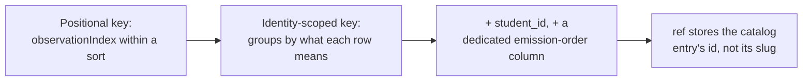

Engine coi mọi quan sát về một học sinh là một dữ kiện vĩnh viễn, append-only (chỉ nối thêm). Các belief (trạng thái suy luận) — fragility, misconception, reasoning pattern — luôn được tính lại từ các dữ kiện đó, chứ không bao giờ lưu trực tiếp. Vì vậy, khi mô hình belief sai, bạn chỉ cần viết lại phần tính toán rồi replay log; không làm mất bất kỳ dữ liệu học sinh nào.

Chỉ lớp quan sát học sinh mới dùng event-sourced (ghi sự kiện). Nội dung, phiên làm việc và danh tính vẫn dùng CRUD thông thường. Nhờ vậy, mức độ phức tạp luôn tương xứng với rủi ro thực sự.

## Tách `envelope` và `payload`

Mỗi evidence event có hai vùng với quy tắc thay đổi trái ngược nhau.

`envelope` là tập các cột có kiểu trên bảng `evidence_events`. Trên một bảng append-only, các cột này gần như không thể mở rộng hay đổi lược đồ một cách sạch sẽ, nên mỗi cột chỉ xứng đáng tồn tại nếu một belief fold dùng nó để khóa hoặc gán trọng số, hoặc nếu audit trail cần join qua nó.

`payload` là một cột JSONB. Mã projection mới có thể diễn giải lại payload cũ khi replay, nên vùng này có thể đảo ngược được. Quy tắc cốt lõi là: **khi còn phân vân, hãy đặt nó vào payload.**

Các cột envelope gồm `student_id`, `node_id` (một uuid), `type`, `scaffold_stamp`, `checkpoint_id`, `session_id`, `brief_snapshot_id`, `ts`, `seq`, `segment`, `occurrence` và `ref`.

## Ba loại observation

`type` của evidence chỉ có đúng ba giá trị. Chúng ánh xạ một-một với ba projector của lớp belief.

| Type | Payload carries | Maps to |
|---|---|---|
| `misconception_evidence` | `catalogRef`, `polarity: for\|against`, `confidence`, `excerpt` | Misconception projector |
| `probe_outcome` | `outcome: correct\|incorrect\|partial`, `confidence`, `excerpt` | Fragility projector |
| `pattern_evidence` | `patternRef`, `confidence`, `excerpt` | Pattern projector |

Các loại này phải gọi tên **quan sát về cách tư duy**. Chúng tuyệt đối không được gọi theo cơ chế sư phạm (không có `socratic_hint`) hay chi tiết miền bài học. Phần đặc thù miền nằm trong giá trị `catalogRef`/`patternRef` và payload — không nằm ở tên type. Ba loại này đã được kiểm chứng qua tám ca dạy học đối kháng (Math Socratic + Language Correct/Reinforce) mà không cần loại thứ tư.

## Quy tắc `altitude`

LLM ghi lại các phán đoán theo từng quan sát. Engine suy ra trạng thái bắc qua nhiều quan sát. Ranh giới này là phần chịu lực của toàn hệ thống.

Analyst ghi: *"Tôi thấy bằng chứng của misconception X ở đây, độ tin cậy cao."*  
Engine tính ra: *"Misconception này hiện đang active, dựa trên ba quan sát như vậy."*

Mỗi event phải là một **sự kiện tự đứng vững** — nó tham chiếu tới catalog id ổn định, chứ không tới belief state ở thời điểm ghi. Analyst có thể dùng belief state hiện tại làm ngữ cảnh, nhưng quan sát mà nó ghi ra phải tự đứng riêng. Bất kỳ event kiểu "kết luận" nào mà ý nghĩa phụ thuộc vào belief state lúc ghi đều phá vỡ replay và phải bị từ chối.

Ở biên ghi, quy tắc này được thực thi bằng một denylist (danh sách cấm) trên payload: mọi quan sát có JSONB mang các tên trường như `fragility`, `mastery`, `activation`, `beliefState` hoặc `misconceptionState` đều bị từ chối. Một allowlist (danh sách cho phép) đầy đủ theo từng type đã từng được cân nhắc rồi bác bỏ — hiện chưa có gì tiêu thụ hình dạng hợp lệ của payload, nên allowlist sẽ đóng băng lược đồ vào đúng thời điểm hiểu biết còn ít nhất. Denylist chặn đúng rủi ro cụ thể: từ vựng của fold rò ngược vào chính đầu vào của nó.

:::caution
Vì bảng là append-only, một dòng bị nhiễm bẩn sẽ không bao giờ được sửa, chỉ có thể bị lấn át bởi bằng chứng về sau. Denylist phải luôn được cập nhật.
:::

## Gom nhóm theo checkpoint

`checkpoint_id` đóng dấu cho cả lô evidence event được sinh ra từ một lần Analyst chạy — tức một lượt làm bài của học sinh. Nếu không có nó, hai câu chuyện khác nhau sẽ sụp xuống thành cùng một tập raw event:

- **Tự sửa lỗi:** có một `for` và một `correct` trong *cùng một* checkpoint → chao đảo rồi tự hồi phục → vẫn bị xem là fragile.
- **Hồi phục muộn:** có một `for` ở một checkpoint và một `correct` ở checkpoint *sau đó* → đã sai rồi thật sự tiến bộ.

Cả `session_id` (quá rộng) lẫn timestamp proximity (không có ranh giới sạch) đều không thể vẽ chiếc hộp quanh một lượt làm bài. `checkpoint_id` làm được điều đó ngay từ thiết kế.

Vì nhiều quan sát của cùng một lượt làm bài được ghi trong một batch, **thời điểm ghi evidence tách rời khỏi thời điểm event thực sự xảy ra**. Mỗi quan sát trong batch mang `scaffold_stamp` riêng. Điều này có nghĩa là checkpoint không cần bắn ra giữa chừng — bắn ở ranh giới cam kết (nộp câu trả lời, đóng phiên) sẽ an toàn và chính xác hơn, vì một bước sai mà học sinh tự sửa chỉ vài giây sau đó không nên trở thành hồ sơ vĩnh viễn.

## Khóa idempotency — quá trình tiến hóa

Đây là khu vực thay đổi nhiều nhất của lược đồ. Mỗi vòng lặp đều sửa một lỗi thật đã được phát hiện.

**Vấn đề của khóa theo vị trí.** Một thiết kế ban đầu dùng `(checkpoint_job_id, segment, observation_index)`. Khi một job được replay với tập quan sát đã thay đổi — chẳng hạn chèn thêm một quan sát mới — thì mọi chỉ số sau vị trí chèn đều bị lệch. Khi đó `ON CONFLICT DO NOTHING` sẽ giữ nhầm dòng cũ và loại bỏ dòng mới, trong khi lời gọi vẫn báo thành công. Bảng evidence chặn `UPDATE` và `DELETE` bằng trigger, nên mất mát này là vĩnh viễn.

**Khóa theo phạm vi định danh (ADR-022 → ADR-026).** Khóa hiện tại là:
```
UNIQUE (student_id, checkpoint_id, segment, node_id, type, ref, occurrence)
NULLS NOT DISTINCT
```
`occurrence` đếm trong từng nhóm định danh `(node_id, type, ref)`, nên thêm hoặc bớt một quan sát chỉ mở hoặc đóng đúng nhóm của nó, không làm lệch khóa của dòng nào khác.

`student_id` được thêm vào ở ADR-026 sau một lỗi cụ thể: hai học sinh dùng cùng định dạng `checkpoint_id` (ví dụ `lesson-1-checkpoint-1`) dưới khóa trước ADR-026 đã va chạm với nhau, khiến quan sát của một học sinh bị loại bỏ trong im lặng.

**Bắt buộc phải có `NULLS NOT DISTINCT`.** `probe_outcome` không mang `ref` — nó không có tham chiếu catalog. Nếu không có `NULLS NOT DISTINCT`, SQL chuẩn xem `NULL = NULL` là không xác định, nên hai probe outcome trên cùng một node sẽ không bao giờ va chạm và một checkpoint được retry sẽ nhân bản vĩnh viễn mọi probe observation.

**Thứ tự phát sinh: cột `seq`.** Lượt đọc projection sắp xếp theo `seq`, một `bigserial` do Postgres gán. Cột này cố ý **không** nằm trong khóa duy nhất — chính điều đó làm cho idempotency khi retry và việc sắp thứ tự tương thích với nhau. Một batch được retry sẽ tái tạo cùng các cột khóa để va chạm, nhưng giá trị chuỗi do DB cấp thì không bao giờ lặp lại. Khoảng trống trong `seq` là điều được chờ đợi và vô hại: retry một phần sẽ tiêu tốn giá trị chuỗi cho các dòng bị loại.

> Khóa sắp xếp ổn định và khóa sắp xếp có ý nghĩa là hai yêu cầu khác nhau. Bất kỳ tổng thứ tự nào cũng khiến một fold trở nên quyết định được — kể cả một thứ tự ngẫu nhiên.

## Độ ổn định của tham chiếu catalog

`evidence_events.ref` lưu **uuid** của mục catalog, không phải slug của nó. Điều này được đổi trong ADR-033 sau một lỗi rất cụ thể: khi `ref` lưu slug, việc đổi tên slug của một mục catalog sẽ âm thầm làm mồ côi mọi dòng evidence cũ đang trỏ tới tên cũ, vì phép join của fold không còn tìm thấy gì nữa. Bảng evidence là append-only, nên sẽ không có dòng nào được trỏ lại.

Việc resolve diễn ra trong `core/module.ts` qua `CatalogRepository.findIdsBySlugs(slugs, kind)`, có phân biệt theo kind (slug chỉ là duy nhất trong từng bảng, không phải toàn cục). Cả batch hoặc được resolve hết, hoặc bị từ chối hết — một `ref` không resolve được sẽ ném lỗi trước khi bất kỳ dòng nào được ghi.

Không có cột FK, vì một cột `ref` duy nhất không thể tham chiếu đồng thời tới cả bảng misconception catalog lẫn pattern catalog. Tính toàn vẹn tham chiếu ở đây đến hoàn toàn từ bước resolve lúc ghi.

:::note
Analyst không bao giờ tự bịa ra `ref`. Nó hoặc tìm mục sẵn có qua `match_catalog`, hoặc tạo mục mới qua `propose_catalog_candidate`. Một `misconception_evidence` hoặc `pattern_evidence` có ref rỗng là vi phạm giao thức: nó sẽ được lưu trong im lặng và rồi không bao giờ fold được thành gì cả — hiện biên ghi vẫn chưa cưỡng chế điều này.
:::

## Kiểm toán evidence cho operator

ADR-040 thêm một lượt đọc evidence trail: operator chọn một belief, rồi đọc các dòng evidence đứng sau belief đó, được thu hẹp bằng đúng bộ lọc mà lượt đọc belief vốn đã dùng. Điều này không cần lược đồ mới — cổng evidence-query đã trả về đầy đủ từng dòng cùng scaffold stamp, checkpoint id, session id và payload.

`evidence_events.session_id` được điền theo một **quy ước đặt tên do con người viết ra** để trỏ tới một cuộc hội thoại có thể truy xuất. Engine không tạo ra cũng không xác thực nó. Đây là một thiếu sót đã biết: bước cuối từ một dòng evidence tới chính transcript thực tế là thứ không thể cưỡng chế chỉ từ phía engine. Ứng dụng Student bù khoảng trống đó bằng cách lưu raw board artifact cạnh bản chép lời như một receipt. Nếu không có receipt này, một dòng evidence sinh ra từ việc đọc sai sẽ không thể bị phản bác — artifact không thể được tranh luận lại.


Mọi belief mà engine nắm về một học sinh đều bắt đầu từ một thứ duy nhất: một bản ghi quan sát vĩnh viễn, append-only. Không có gì về misconception, fragility hay reasoning pattern của học sinh được ghi trực tiếp — tất cả luôn được tính theo yêu cầu từ log của những gì đã được quan sát. Trang này trình bày cách log đó được định hình, và chuỗi lỗi thực tế đã khiến nó được tôi cứng thành một nền tảng đủ an toàn để xây lên trên.

## Vì sao dùng append-only, và nó mang lại điều gì

Engine coi các bản ghi evidence và prediction là nguồn chân lý duy nhất, với tính append-only được cưỡng chế ngay bởi cơ sở dữ liệu chứ không chỉ bởi mã ứng dụng. Mọi thứ khác — misconception instance, trạng thái fragility, reasoning pattern — đều là một projection (phép chiếu): giá trị được tính bằng cách replay log, chứ không phải giá trị lưu rồi chỉnh sửa.

Lợi ích ở đây rất cụ thể: mô hình belief mà engine triển khai là một công cụ kiểm chứng, và nó được kỳ vọng sẽ sai ở nhiều chỗ khi dữ liệu học sinh thật đi vào. Vì các quan sát thô được giữ lại vĩnh viễn, sửa một mô hình belief sai nghĩa là viết lại mã suy diễn rồi replay trên cùng log đó — chứ không phải làm mất lịch sử của cả cohort. Xóa trạng thái suy diễn và dựng lại từ log là thao tác được hỗ trợ và đã có kiểm thử.

Miền bài toán được tách dọc theo ranh giới này thành một write side (phía ghi) và một read side (phía đọc), với quy tắc chịu lực là chúng không bao giờ gọi trực tiếp sang nhau — chúng chỉ gặp nhau qua log:

- `evidence` — kiểm tra hợp lệ và append các quan sát đã được gán kiểu (write side).
- `projections` — một replay engine cộng với một projector cho mỗi lớp belief (read side).
- `graph` và `catalog` — bản đồ khái niệm và sổ đăng ký misconception/pattern, cả hai đều được read side tham chiếu.

Chính sự tách biệt này khiến câu "xóa projections, replay log, nhận lại trạng thái y hệt" thực sự đúng. Nếu đường ghi có thể gọi vào logic suy diễn, replay có thể lệch khỏi những gì đã sống ở thời điểm đó.

## Một evidence event chứa những gì

Mỗi evidence event tách thành hai vùng với khả năng đảo ngược trái ngược nhau.

`envelope` là tập các cột có kiểu trên bảng append-only — `student`, `node` (tùy chọn), `type`, `scaffold_stamp`, `checkpoint_id`, `session`, `brief_snapshot`, `ts` và một khóa idempotency. Vì bảng là append-only, một cột envelope gần như là cánh cửa một chiều: khi đã chọn rồi thì không thể đổi sạch sẽ nữa, và các dòng cũ cũng không bao giờ mọc thêm được cột mới.

`payload` là một khối JSON linh hoạt — có thể đảo ngược, vì mã projector trong tương lai có thể diễn giải một payload cũ theo cách khác khi replay. Quy tắc để quyết định một trường nên nằm ở vùng nào được cố ý giữ thật đơn giản: một trường chỉ xứng đáng có cột envelope nếu projector dùng nó để khóa hoặc gán trọng số, hoặc audit trail cần join qua nó. Mọi thứ khác đi vào payload — "khi còn lưỡng lự, hãy cho vào payload".

Có đúng ba loại observation, và chúng ánh xạ một-một tới ba lớp belief:

```json
// misconception_evidence
{ "catalogRef": "cross-multiply-error", "polarity": "for", "confidence": "high", "excerpt": "..." }

// probe_outcome
{ "outcome": "correct", "confidence": "high", "excerpt": "..." }

// pattern_evidence
{ "patternRef": "skips-verification", "confidence": "medium", "excerpt": "..." }
```

Những cái tên này được cố ý dùng để mô tả **quan sát về cách tư duy**, chứ không bao giờ mô tả cơ chế sư phạm hay nội dung môn học — không `socratic_hint`, không `correction_issued`. Nếu đưa một bước dạy học hay một môn học cụ thể vào từ vựng này, bạn sẽ khóa cứng một mode vào dữ liệu vĩnh viễn và nhạy với replay. Mọi thứ đặc thù miền nằm trong giá trị `catalogRef` / `patternRef` và payload tự do, chứ không nằm trong chính tên type.

### Quy tắc `altitude`

Ranh giới giữa những gì model ghi ra và những gì engine tính ra được vẽ theo "altitude": model ghi lại một **phán đoán theo từng quan sát** — đánh giá ở một thời điểm, kiểu "Tôi thấy bằng chứng của misconception này ở đây, độ tin cậy cao" — còn engine suy ra **trạng thái bắc qua nhiều quan sát**, tức phần ghi sổ cơ học của activation, fragility và lan truyền qua nhiều phán đoán như vậy. Hãy hình dung model như một nhân chứng đơn lẻ chỉ báo lại điều nó thấy, còn engine như điều tra viên đối chiếu nhiều lời khai theo thời gian — nhân chứng không được quyền đồng thời tuyên luôn kết luận.

Mỗi event phải tự đứng được như một dữ kiện không phụ thuộc vào belief state ở đúng khoảnh khắc nó được ghi. Model có thể nhìn belief state hiện tại để quyết định điều gì đáng báo cáo, nhưng nó tuyệt đối không được ghi ngược state đó trở lại thành event — nếu làm vậy, ý nghĩa của một dòng đã lưu sẽ phụ thuộc vào thời điểm nó được ghi, và như thế sẽ phá vỡ bảo đảm rằng replay cùng một log thì luôn cho ra cùng một đáp án.

Quy tắc này được thực thi rất cụ thể tại biên ghi: một quan sát đi vào sẽ bị từ chối nếu payload của nó chứa bất kỳ tên trường nào trong danh sách cố định các trường belief-state (`fragility`, `mastery`, `activation`, `beliefState`, `misconceptionState`, `stability`). Một allowlist đầy đủ theo từng trường đã được cân nhắc rồi bác bỏ, vì hiện chưa có thành phần hạ nguồn nào tiêu thụ hình dạng hợp lệ của payload — dùng allowlist lúc này chẳng khác nào bịa ra rồi đóng băng một lược đồ trước khi thực sự có ai cần. Denylist chặn đúng rủi ro cụ thể (từ vựng riêng của projector rò ngược vào đầu vào của nó) mà không cam kết quá sớm.

:::caution
Denylist chỉ chặn các tên trường đang nằm trong danh sách. Một trường belief-state dùng tên khác mà chưa được liệt kê vẫn sẽ lọt qua nguyên vẹn — và vì bảng là append-only, một dòng bị nhiễm bẩn như vậy sẽ không bao giờ được sửa, chỉ có thể bị lấn át bởi bằng chứng về sau. Danh sách này phải luôn được cập nhật cho tới khi xuất hiện một payload consumer thực sự đủ lý do để thay nó bằng allowlist.
:::

### Gom nhóm một lượt làm bài: `checkpoint_id`

`checkpoint_id` đóng dấu lên mọi event được sinh ra từ một lần model chạy — tức một lượt làm bài của học sinh. Nó tồn tại vì một lượt làm bài đơn lẻ có thể sinh ra nhiều hơn một event (ví dụ, một lần tự sửa sẽ sinh cả tín hiệu misconception dạng "for" lẫn probe outcome dạng "correct"), và mã suy diễn belief cần gom các event cùng lượt làm bài trước khi diễn giải chúng.

Nếu thiếu nó, hai câu chuyện rất khác nhau sẽ sụp về cùng một tập raw event: một học sinh loạng choạng nhưng tự hồi phục ngay trong cùng một lượt làm bài (tín hiệu yếu, nên vẫn phải để fragile) sẽ trông hệt như một học sinh thất bại ở một lượt rồi thật sự tiến bộ ở lượt sau (phục hồi thật), trừ phi engine biết event nào thuộc cùng một lượt. Cả session id ở phạm vi rộng hơn (quá thô — chứa nhiều lượt làm bài) lẫn timestamp proximity (không có ranh giới sạch) đều không thể vẽ chiếc hộp đó; `checkpoint_id` làm được điều này ngay từ cấu trúc.

## Gia cố khóa duy nhất: chuỗi bản sửa nối tiếp nhau

Bảng evidence cần một khóa duy nhất để việc giao lại cùng một batch quan sát (trường hợp rất thường vì cơ chế giao job là at-least-once) không tạo ra bản sao. Để làm đúng khóa này đã phải qua nhiều vòng, và mỗi vòng lại lộ ra một kiểu hỏng sắc hơn vòng trước.



**Khóa theo vị trí không sống sót nổi khi tập quan sát thay đổi.** Khóa đầu tiên dựa vào vị trí của một dòng trong một batch đã sắp xếp. Nhưng vị trí sẽ đổi nếu hình dạng batch đổi — chỉ cần chèn thêm hoặc bỏ đi một quan sát là mọi chỉ số phía sau đều lệch. Khi chạy lại cùng job nhưng báo cáo một tập quan sát hơi khác, một quan sát mới thật sự có thể va vào một quan sát cũ đã nằm sẵn ở vị trí đó, khiến cái mới bị rơi âm thầm còn cái cũ bị giữ lại — trong khi lời gọi vẫn báo thành công, vì không có gì so sánh giữa thứ đã ghi với thứ đã gửi. Cách sửa là khóa các dòng theo ý nghĩa thực của chúng — học sinh, checkpoint, node, type và tham chiếu — thay vì theo vị trí của chúng trong danh sách.

**Khóa theo định danh vẫn cần đúng các cột.** Ngay cả sau khi đã khóa theo ý nghĩa thay vì theo vị trí, khóa này ban đầu vẫn thiếu `student_id`. Vì `checkpoint_id` là chuỗi opaque do phía gọi cung cấp, engine không tự cấp phát và cũng không đòi hỏi phải là duy nhất, nên hai học sinh khác nhau nhưng tạo ra cùng hình dạng quan sát dưới một checkpoint id đặt tự nhiên (như `lesson-checkpoint-3`) vẫn có thể va chạm — quan sát của một học sinh bị loại bỏ trong im lặng, còn lời gọi vẫn báo thành công. Cách sửa là đưa `student_id` thành cột đứng đầu của khóa duy nhất.

**Các cột khóa có thể rỗng cần `NULLS NOT DISTINCT`.** Hai cột trong khóa — node và tham chiếu catalog — có thể hợp lệ ở trạng thái `NULL` (`probe_outcome` thuần túy thì hoàn toàn không có tham chiếu catalog). SQL chuẩn coi `NULL = NULL` là không xác định, không phải đúng, nên ràng buộc `UNIQUE` thông thường sẽ không bao giờ bắt được một dòng trùng mà cả hai bản đều hợp lệ ở `NULL` — cứ mỗi lần retry `probe_outcome` là lại nhân bản mãi. Tùy chọn `NULLS NOT DISTINCT` của Postgres, được thêm từ Postgres 15, sửa điều này bằng cách xem hai `NULL` là bằng nhau cho mục đích kiểm tra duy nhất; đó mới chính là nghĩa đúng của một `NULL` tham chiếu trong ngữ cảnh này (kiểu event này không có tham chiếu) chứ không phải nghĩa SQL thường giả định (giá trị chưa biết).

**Định danh và thứ tự phát sinh là hai việc khác nhau, nên cần hai cột khác nhau.** Bộ đếm theo định danh của khóa ban đầu còn bị tái sử dụng để mang luôn thứ tự thật mà các quan sát được phát ra trong batch — nhưng bộ đếm nội bộ của batch và trình tự thật mà các dòng được ghi xuống không phải là một, và việc gộp hai thứ đó lại đã khiến lượt đọc nhạy thứ tự (xem trang projectors để biết fold nào quan tâm tới thứ tự) sắp xếp theo sai giá trị. Lược đồ hiện tại dùng hai cột tách riêng: bộ đếm theo định danh mà khóa duy nhất so sánh, và một số thứ tự tăng dần do cơ sở dữ liệu cấp chỉ dùng cho việc sắp xếp lúc đọc, cố ý bị loại khỏi khóa duy nhất — vì một batch được retry phải tái tạo cùng khóa định danh để được nhận ra là trùng lặp, còn bộ đếm do cơ sở dữ liệu cấp thì không bao giờ sinh lại cùng một giá trị hai lần. Khoảng trống trong chuỗi số này (do retry một phần) là điều bình thường và vô hại, vì nó chỉ dùng để sắp thứ tự, không dùng để đếm hay nhận diện.

**Một giá trị thì chỉ nên có một nơi tính ra nó.** Giá trị tham chiếu catalog đóng hai vai trong khóa này — vừa là một trong các cột được so sánh, vừa là một phần của nhóm mà bộ đếm theo định danh dựa vào. Đã có thời gian nó được tính độc lập ở hai file khác nhau. Hai cách tính tình cờ cho cùng kết quả, nhưng không có gì buộc chúng phải luôn như vậy; nếu một ngày chúng lệch nhau, hai quan sát khác nhau có thể âm thầm dùng chung một khóa (mất một bản) hoặc khóa của một quan sát có thể âm thầm thay đổi giữa lần ghi đầu và lần retry (tạo bản sao) — cả hai đều là vĩnh viễn trên một bảng append-only. Cách sửa là dồn việc này vào một hàm duy nhất, cố ý không export, để cả hai nơi cùng gọi; về cấu trúc, khi đó chỉ còn một cách để tính nó.

**Tham chiếu dựa trên slug khiến việc đổi tên làm mồ côi evidence cũ.** Cho tới gần đây, tham chiếu catalog của một evidence event lưu *slug* của mục catalog mà nó trỏ tới, và mã suy diễn belief so khớp theo slug đó. Khi đổi tên slug của một mục catalog — một thao tác vận hành bình thường — mọi quan sát trước đó đang trỏ tới tên cũ sẽ bị mồ côi trong im lặng: phép so khớp không tìm thấy gì, dòng đó không bao giờ sửa được, và cũng không bài kiểm thử nào bắt được, vì replay vẫn là hàm thuần của đầu vào; chỉ là một trong các đầu vào ấy đã âm thầm đổi chỗ. Điều này nay đã được sửa: cột tham chiếu lưu permanent id của mục catalog thay vào đó, được resolve một lần ngay lúc ghi. Giờ đây, hoặc cả batch được resolve xong, hoặc bị từ chối toàn bộ — nếu có bất kỳ tham chiếu nào không khớp với mục catalog thật, sẽ không có gì được ghi, và phía gọi phải đề xuất mục đó trước rồi mới retry. Cách này cũng khép nốt một lỗ hổng liên quan khác: trước đây chẳng có gì kiểm tra xem một tham chiếu có thật sự trỏ tới mục catalog có tồn tại hay không, nên evidence có thể neo vào hư vô và rồi fold thành hư vô mãi mãi, mà không ai nhận ra.

:::caution
Vẫn còn một lỗ hổng về tham chiếu catalog chưa được đóng. Hiện tại không có gì *bắt buộc* một loại observation vốn cần tham chiếu phải thật sự mang tham chiếu đó — một observation vẫn có thể được lưu với tham chiếu thiếu và rồi đơn giản là không bao giờ khớp với bất cứ thứ gì trong fold, một cách âm thầm và vĩnh viễn, vì bước resolve lúc ghi chỉ kiểm tra tham chiếu nếu nó có mặt, chứ không kiểm tra xem lẽ ra nó có bắt buộc phải có hay không.
:::

## Lần ngược từ belief về evidence của nó

Khi operator muốn xác minh rằng một belief đã được ghi lại thật sự có nền tảng từ tương tác thật, engine cung cấp một bước trung gian: một lượt đọc trả về các dòng evidence của học sinh, được thu hẹp bằng đúng giá trị bộ lọc mà lượt đọc belief vừa dùng. Vì lượt đọc belief và lượt đọc evidence dùng cùng một kiểu filter, giá trị đã có sẵn từ bước tìm belief có thể thu hẹp trail trực tiếp, không cần dịch qua lớp trung gian nào.

Điều này không tốn thay đổi lược đồ. Cổng evidence-query vốn đã trả về mọi dòng cùng scaffold stamp, checkpoint id, session id và payload. Việc lọc và ánh xạ slug ở chiều ra diễn ra trong lớp orchestration, không cần cổng, bảng hay migration mới.

Audit này cố ý bị giữ tách khỏi bề mặt dành cho học sinh. Một session không có lý do gì để tự xem lại lịch sử scaffolding của chính nó, và các giá trị payload thô sẽ mời gọi model suy luận về cách nó từng được hướng dẫn trước đó.

Bước thứ ba của audit — đọc xem thực tế đã nói gì — hiện không có cơ chế. Transcript nằm bên trong các phiên Claude và không bao giờ đi vào engine, nên `evidence_events.session_id` chỉ mang một **quy ước do con người viết ra để đặt tên cho một cuộc hội thoại có thể truy xuất**, chứ không phải định danh do hệ thống sinh ra. Engine không tạo ra cũng không xác thực nó.

:::caution
Đây là một thiếu sót đã biết. Phần chịu lực của groundedness check — xác nhận rằng các quan sát đã ghi thật sự khớp với hội thoại ngoài đời — là thứ không thể cưỡng chế từ bên trong engine. Giá trị `session_id` do con người nhập vào và sẽ không bao giờ sửa lại được một khi trên dòng đó đã có evidence thật, vì bảng là append-only. Lớp ứng dụng khép khoảng trống này bằng cách lưu transcript thành artifact thật, nhưng bản proof-of-concept thì chưa làm được. Cũng có thêm hai giới hạn nữa được chấp nhận có chủ đích: không lưu review verdict nào, nên con số của một lần spot-check không thể tái lập chỉ từ dữ liệu; và lượt đọc này cũng không phân biệt được một belief được chống lưng bởi một quan sát yếu với một belief được chống lưng bởi mười quan sát.
:::
