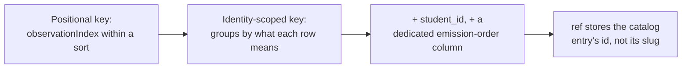

Mọi niềm tin mà engine có về một học sinh đều bắt đầu từ một thứ duy nhất: một bản ghi quan sát vĩnh viễn, chỉ ghi thêm. Không có gì về hiểu sai, độ mong manh hay kiểu lập luận của học sinh được ghi trực tiếp — tất cả luôn được tính toán theo nhu cầu từ nhật ký những gì đã được quan sát. Trang này trình bày cấu trúc của nhật ký đó, cùng chuỗi lỗi có thật đã buộc nó phải trở nên đủ chắc chắn để làm nền tảng xây dựng.

## Vì sao là append-only, và nó mang lại điều gì

Engine xem các bản ghi bằng chứng và dự đoán của mình là single source of truth (nguồn sự thật duy nhất), được chính cơ sở dữ liệu cưỡng chế ở dạng append-only (chỉ ghi thêm), chứ không chỉ dựa vào mã ứng dụng. Mọi thứ khác — các trường hợp hiểu sai, trạng thái mong manh, các kiểu lập luận — đều là **projection** (phép chiếu): một giá trị được tính bằng cách phát lại nhật ký, chứ không phải giá trị được lưu rồi chỉnh sửa sau đó.

Lợi ích nhận được rất cụ thể: mô hình niềm tin mà engine này triển khai là một công cụ kiểm chứng, và người ta mặc định rằng nó sẽ sai ở một số điểm khi dữ liệu học sinh thực tế bắt đầu đổ vào. Vì các quan sát thô được giữ lại vĩnh viễn, sửa một mô hình niềm tin sai nghĩa là viết lại mã suy diễn và phát lại nó trên chính cùng nhật ký đó — chứ không phải đánh mất lịch sử của cả nhóm học sinh. Việc xóa phần trạng thái suy ra rồi dựng lại từ nhật ký là một thao tác được hỗ trợ và đã có kiểm thử.

Miền nghiệp vụ được tách theo ranh giới đó thành **write side** (phía ghi) và **read side** (phía đọc), và nguyên tắc cốt lõi là chúng không bao giờ gọi trực tiếp lẫn nhau — chúng chỉ gặp nhau qua nhật ký:

- `evidence` — kiểm tra và ghi thêm các quan sát đã được định kiểu (write side).
- `projections` — một bộ máy phát lại cùng một projector (bộ chiếu) cho mỗi tầng niềm tin (read side).
- `graph` và `catalog` — bản đồ khái niệm và sổ đăng ký hiểu sai/mẫu hình, cả hai đều được read side tra cứu.

Sự tách biệt này chính là điều khiến tuyên bố "xóa projections, phát lại nhật ký, thu được trạng thái y hệt" thực sự đúng. Nếu luồng ghi có thể gọi vào logic suy diễn, kết quả phát lại có thể lệch khỏi những gì đã xảy ra khi hệ thống đang chạy thật.

## Một sự kiện bằng chứng chứa gì

Mỗi sự kiện bằng chứng được chia thành hai vùng với mức độ đảo ngược trái ngược nhau.

Phần **envelope** (phong bì) là một tập cột đã định kiểu trên bảng chỉ ghi thêm — `student`, `node` (tùy chọn), `type`, `scaffold_stamp`, `checkpoint_id`, `session`, `brief_snapshot`, `ts`, và một khóa idempotency. Vì bảng là append-only, một cột trong envelope về thực chất là cánh cửa một chiều: một khi đã chọn thì không thể thay đổi gọn gàng, và các dòng cũ cũng không bao giờ có thể mọc thêm cột mới.

Phần **payload** (tải dữ liệu) là một khối JSON linh hoạt — có thể diễn giải lại, vì mã projector trong tương lai có thể hiểu một payload cũ theo cách khác khi phát lại. Quy tắc để quyết định một trường thuộc vùng nào được cố ý giữ rất đơn giản: một trường chỉ xứng đáng có cột ở envelope nếu projector khóa hoặc gán trọng số dựa trên nó, hoặc nếu luồng kiểm toán cần nối dữ liệu theo nó. Mọi thứ còn lại đi vào payload — "nếu còn phân vân, để vào payload".

Có đúng ba loại quan sát, và chúng ánh xạ một-một với ba tầng niềm tin:

```json
// misconception_evidence
{ "catalogRef": "cross-multiply-error", "polarity": "for", "confidence": "high", "excerpt": "..." }

// probe_outcome
{ "outcome": "correct", "confidence": "high", "excerpt": "..." }

// pattern_evidence
{ "patternRef": "skips-verification", "confidence": "medium", "excerpt": "..." }
```

Các tên này được cố ý dùng để mô tả **quan sát về tư duy**, tuyệt đối không mô tả cơ chế sư phạm hay nội dung môn học — không có `socratic_hint`, cũng không có `correction_issued`. Nếu đưa một động tác dạy học hay một môn học vào từ vựng này, hệ thống sẽ vô tình đóng băng một chế độ vào dữ liệu vĩnh viễn, nhạy với phát lại. Mọi thứ đặc thù miền đều nằm ở các giá trị `catalogRef` / `patternRef` và phần payload tự do, chứ không nằm trong chính tên loại.

### Quy tắc về "độ cao"

Ranh giới giữa phần mô hình ghi ra và phần engine tự tính được đặt ở "độ cao": mô hình ghi lại một **phán đoán trên từng quan sát** — tức nhận định về một thời điểm cụ thể, như "tôi thấy bằng chứng của hiểu sai này ở đây, độ tin cậy cao" — còn engine suy ra **trạng thái xuyên nhiều quan sát**, tức phần hạch toán cơ học của kích hoạt, độ mong manh và lan truyền qua nhiều phán đoán như vậy. Hãy hình dung mô hình như một nhân chứng chỉ kể lại điều mình thấy, còn engine là điều tra viên đối chiếu lời khai của nhiều nhân chứng theo thời gian — nhân chứng không được quyền đồng thời công bố luôn kết luận.

Mỗi sự kiện phải tự đứng vững như một sự kiện thực tế không phụ thuộc vào trạng thái niềm tin ở thời điểm nó được ghi ra. Mô hình có thể nhìn vào trạng thái niềm tin hiện tại để quyết định điều gì đáng báo cáo, nhưng tuyệt đối không được ghi ngược trạng thái đó thành một sự kiện — nếu làm vậy thì ý nghĩa của một dòng đã lưu sẽ phụ thuộc vào thời điểm nó được viết, phá vỡ cam kết rằng phát lại cùng một nhật ký thì luôn cho ra cùng một kết quả.

Quy tắc này được cưỡng chế cụ thể ở ranh giới ghi: một quan sát đi vào sẽ bị từ chối nếu payload của nó chứa bất kỳ tên trường nào trong danh sách cố định các trường trạng thái niềm tin (`fragility`, `mastery`, `activation`, `beliefState`, `misconceptionState`, `stability`). Đã từng cân nhắc một allowlist (danh sách cho phép) đầy đủ theo từng trường rồi loại bỏ, vì hiện chưa có thành phần hạ nguồn nào thực sự tiêu thụ hình dạng hợp lệ của payload — dùng allowlist ở giai đoạn này sẽ đồng nghĩa với việc tự bịa ra rồi đóng cứng một lược đồ trước khi thực sự có ai cần đến. denylist (danh sách cấm) chặn đúng rủi ro cụ thể cần chặn — từ vựng riêng của projector rò ngược trở lại đầu vào của chính nó — mà không ràng buộc quá sớm.

:::caution
denylist chỉ chặn đúng các tên trường có trong danh sách. Một trường trạng thái niềm tin dùng tên khác không có trong danh sách vẫn đi qua nguyên vẹn — và vì bảng là append-only, một dòng đã bị lẫn dữ liệu như vậy sẽ không bao giờ được sửa, chỉ có thể bị các bằng chứng về sau làm giảm tác động. Danh sách này phải luôn được cập nhật cho đến khi có một bộ tiêu thụ payload thực sự đủ lý do để thay nó bằng allowlist.
:::

### Gom một lần thử: checkpoint_id

`checkpoint_id` được đóng dấu lên mọi sự kiện sinh ra từ một lần chạy mô hình — tức một lần học sinh thử làm. Nó tồn tại vì một lần thử có thể tạo ra hơn một sự kiện (ví dụ một lần tự sửa sẽ sinh cả tín hiệu hiểu sai dạng "for" lẫn một probe outcome là "correct"), và phần mã suy ra niềm tin cần nhóm các sự kiện cùng một lần thử lại với nhau trước khi diễn giải.

Nếu không có nó, hai câu chuyện rất khác nhau sẽ bị ép thành cùng một tập sự kiện thô: một học sinh chao đảo nhưng tự hồi phục ngay trong cùng một lần thử (tín hiệu yếu, nên vẫn phải được xem là mong manh) sẽ trông y hệt một học sinh làm sai ở một lần thử rồi thật sự tiến bộ ở lần sau (một sự phục hồi thực sự), trừ khi engine biết sự kiện nào thuộc về cùng một lần thử. Cả `session id` rộng hơn (quá thô — chứa nhiều lần thử) lẫn độ gần nhau về thời gian (không có ranh giới rõ ràng) đều không vẽ ra được chiếc hộp đó; `checkpoint_id` làm được điều này ngay từ thiết kế.

## Làm chắc khóa duy nhất: một chuỗi bản sửa lỗi

Bảng bằng chứng cần có một khóa duy nhất để việc gửi lại cùng một lô quan sát (chuyện rất bình thường, vì cơ chế giao việc là at-least-once — ít nhất một lần) không tạo ra bản ghi trùng lặp. Việc xác định đúng khóa này phải qua nhiều vòng chỉnh sửa, và mỗi vòng lại lộ ra một kiểu lỗi nghiêm trọng hơn vòng trước.



**Khóa theo vị trí không sống sót khi tập quan sát thay đổi.** Phiên bản khóa đầu tiên dựa vào vị trí của một dòng trong một lô đã được sắp xếp. Nhưng vị trí sẽ đổi nếu hình dạng của lô thay đổi — chỉ cần chèn thêm hoặc bỏ đi một quan sát thì mọi chỉ số đứng sau nó đều xê dịch. Một lần chạy lại của cùng tác vụ nhưng báo về tập quan sát hơi khác có thể làm một quan sát mới thực sự va chạm với một quan sát cũ đã được lưu ở vị trí đó, khiến quan sát mới bị loại âm thầm còn quan sát cũ thì bị nhân đôi — trong khi lời gọi vẫn báo thành công, vì không có gì đối chiếu thứ đã ghi với thứ đã gửi. Cách sửa là khóa từng dòng theo đúng ý nghĩa của nó — học sinh, checkpoint, node, type và reference — thay vì theo vị trí của nó trong danh sách.

**Khóa theo danh tính vẫn cần đúng các cột.** Ngay cả sau khi đổi sang khóa theo ý nghĩa thay vì vị trí, ban đầu khóa vẫn thiếu `student_id`. Vì `checkpoint_id` là một chuỗi mờ do bên gọi cung cấp, engine không tự sinh ra cũng không hề yêu cầu tính duy nhất, nên hai học sinh khác nhau tạo ra cùng một kiểu quan sát dưới một checkpoint id được đặt tự nhiên (ví dụ `lesson-checkpoint-3`) vẫn có thể va chạm — bằng chứng của một học sinh bị loại âm thầm, nhưng lời gọi vẫn báo thành công. Cách sửa là đưa `student_id` thành cột đứng đầu trong khóa duy nhất.

**Các cột khóa có thể rỗng cần `NULLS NOT DISTINCT`.** Hai cột trong khóa — node và catalog reference — có thể hợp lệ ở trạng thái `NULL` (một probe outcome thuần túy thì hoàn toàn không có catalog reference). SQL chuẩn xem `NULL = NULL` là không xác định, chứ không phải đúng, nên một ràng buộc `UNIQUE` thông thường sẽ không bao giờ chặn được một dòng trùng trong trường hợp cả hai bản sao đều hợp lệ ở trạng thái `NULL` — mọi lần thử lại của probe outcome sẽ cứ nhân đôi mãi. Tùy chọn `NULLS NOT DISTINCT` của Postgres, được thêm từ Postgres 15, xử lý đúng điểm này bằng cách xem hai giá trị `NULL` là bằng nhau cho mục đích kiểm tra tính duy nhất; điều này khớp với ý nghĩa của một reference `NULL` trong ngữ cảnh ở đây (loại sự kiện này không có reference), thay vì giả định thông thường của SQL (giá trị chưa biết).

**Danh tính và thứ tự phát ra là hai việc khác nhau, nên cần hai cột khác nhau.** Bộ đếm theo từng danh tính trong khóa ban đầu còn bị tận dụng để mang luôn thứ tự thật mà các quan sát được phát ra trong một lô — nhưng bộ đếm nội bộ của lô và chuỗi thứ tự thực mà các dòng được ghi xuống không phải là một, và việc trộn hai vai trò này khiến phần đọc nhạy với thứ tự (xem trang projectors để biết những phép gộp nào quan tâm đến thứ tự) cuối cùng lại sắp xếp theo sai giá trị. Lược đồ hiện tại mang hai cột tách biệt: bộ đếm danh tính mà khóa duy nhất dùng để so sánh, và một số thứ tự tăng dần do cơ sở dữ liệu cấp, chỉ dùng khi sắp xếp lúc đọc và cố ý không đưa vào khóa duy nhất — vì một lô được thử lại phải tái tạo đúng cùng khóa danh tính thì mới được nhận ra là bản trùng, còn bộ đếm do cơ sở dữ liệu cấp thì không bao giờ lặp lại cùng giá trị hai lần. Các khoảng hở trong dãy số này (do thử lại từng phần) là điều được chấp nhận và vô hại, vì nó chỉ dùng để sắp xếp, không bao giờ dùng để đếm hay định danh.

**Một giá trị chỉ nên có một nơi tính ra nó.** Giá trị catalog reference giữ hai vai trò trong khóa này — nó là một trong các cột được so sánh, và cũng là một phần của nhóm mà bộ đếm theo danh tính dựa vào. Có thời điểm giá trị này được tính độc lập ở hai tệp khác nhau. Hai phép tính đó tình cờ cho cùng kết quả, nhưng không có gì bảo đảm rằng chúng sẽ luôn như vậy; nếu một ngày chúng lệch nhau, hai quan sát khác nhau có thể âm thầm dùng chung một khóa (làm mất một quan sát), hoặc khóa của một quan sát có thể âm thầm đổi giữa lần ghi đầu tiên và lần thử lại (tạo ra bản trùng) — cả hai đều là lỗi vĩnh viễn trên một bảng append-only. Cách sửa là gom việc này về một hàm duy nhất, có chủ ý không export, để cả hai nơi cùng gọi, nhờ đó về mặt cấu trúc chỉ còn một cách để tính ra nó.

**Reference dựa trên slug có thể khiến bằng chứng cũ thành mồ côi khi đổi tên.** Cho đến gần đây, catalog reference của một sự kiện bằng chứng lưu *slug* của mục catalog mà nó trỏ tới, còn phần mã suy ra niềm tin thì đối chiếu theo slug đó. Nếu đổi slug của một mục catalog — một thao tác hoàn toàn bình thường của người vận hành — toàn bộ quan sát trong quá khứ trỏ vào tên cũ sẽ ngay lập tức thành mồ côi trong im lặng: phép đối chiếu không tìm thấy gì, dòng đó không bao giờ sửa được, và không bài kiểm thử nào bắt được lỗi này, vì phát lại vẫn là một hàm thuần của đầu vào; chỉ có điều một trong những đầu vào đó đã âm thầm dịch chuyển. Việc này nay đã được sửa: cột reference lưu id vĩnh viễn của mục catalog thay vào đó, được resolve đúng một lần ở thời điểm ghi. Giờ đây một lô hoặc được resolve đầy đủ, hoặc bị từ chối toàn bộ — nếu có bất kỳ reference nào không khớp với một mục catalog có thật, sẽ không có gì được ghi, và bên gọi phải đề xuất mục đó trước khi thử lại. Điều này cũng khép lại một lỗ hổng thứ hai có liên quan: trước đây không có gì kiểm tra liệu một reference có thực sự trỏ tới một mục catalog có thật hay không, nên bằng chứng có thể neo vào hư vô và mãi mãi bị gộp thành hư vô mà không ai nhận ra.

:::caution
Vẫn còn một khoảng trống liên quan đến catalog reference chưa được khép lại. Hiện chưa có gì *bắt buộc* một loại quan sát vốn cần reference phải thật sự mang reference đó — một quan sát vẫn có thể được lưu với reference bị thiếu rồi đơn giản là không bao giờ khớp với gì trong quá trình fold, âm thầm và vĩnh viễn, vì bước resolve lúc ghi chỉ kiểm tra reference nếu nó có mặt, chứ không kiểm tra liệu đáng ra nó có phải tồn tại hay không.
:::

## Kiểm toán niềm tin lần ngược về bằng chứng

Khi người vận hành muốn xác minh rằng một niềm tin đã được ghi nhận thực sự có cơ sở từ tương tác thật, engine cung cấp một bước trung gian: một truy vấn đọc trả về các dòng bằng chứng của một học sinh, được thu hẹp bằng đúng cùng giá trị bộ lọc mà truy vấn đọc niềm tin vừa dùng. Vì truy vấn đọc niềm tin và truy vấn đọc bằng chứng dùng chung cùng một kiểu bộ lọc, giá trị đã có sẵn từ bước tìm niềm tin có thể thu hẹp đường lần vết ngay lập tức, không cần chuyển đổi gì.

Việc này không đòi hỏi thay đổi lược đồ. Cổng truy vấn bằng chứng hiện tại đã trả về mọi dòng kèm scaffold stamp, checkpoint id, session id và payload. Phần lọc và ánh xạ slug ở chiều đi ra được xử lý trong lớp điều phối, không cần cổng mới, bảng mới hay migration mới.

Hoạt động kiểm toán được cố ý giữ khỏi bề mặt dành cho học sinh. Một phiên học không có lý do gì để tự xem lại lịch sử scaffolding của chính nó, và các giá trị payload thô lại dễ khiến mô hình suy luận về cách nó từng được dẫn dắt trước đó.

Bước thứ ba của quy trình kiểm toán — đọc lại chính xác điều đã được nói ra — thì hiện không có cơ chế hỗ trợ. Bản ghi hội thoại nằm bên trong các phiên Claude và không bao giờ đi vào engine, nên `evidence_events.session_id` mang một **quy ước do con người tự đặt để đặt tên cho một cuộc hội thoại có thể truy xuất**, chứ không phải một định danh do hệ thống sinh ra. Engine không tạo ra giá trị này, cũng không kiểm tra nó.

:::caution
Đây là một thiếu sót đã được biết rõ. Nửa quan trọng nhất của kiểm tra groundedness (mức độ bám vào bằng chứng thực) — xác nhận rằng các quan sát đã ghi thực sự khớp với hội thoại ngoài đời — không thể được cưỡng chế từ bên trong engine. Giá trị `session_id` do con người nhập vào, và một khi trên dòng đó đã có bằng chứng thật thì nó không bao giờ sửa lại được, vì bảng là append-only. Lớp ứng dụng khép lỗ hổng này bằng cách lưu transcript thành hiện vật thực sự, nhưng bản proof-of-concept thì không làm được. Còn hai giới hạn nữa cũng được chấp nhận có chủ đích: không có kết luận rà soát nào được lưu lại, nên con số của một lần spot-check không thể tái lập chỉ từ dữ liệu; và phần đọc cũng không phân biệt được niềm tin chỉ được chống lưng bởi một quan sát yếu với niềm tin được chống lưng bởi mười quan sát.
:::
