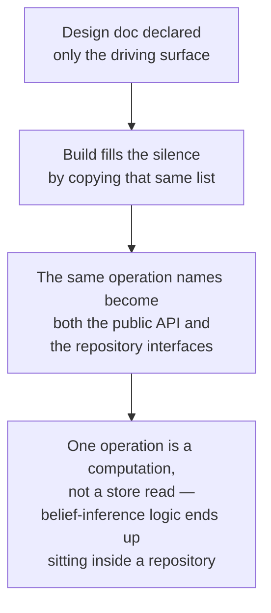

Engine tuân theo hình dạng mô-đun hexagonal (lục giác): một core (lõi) được bao quanh bởi các port (cổng), tách nó khỏi phía gọi vào ở một bên và khỏi hạ tầng của chính nó ở bên còn lại. Phần lớn cấu trúc này là quy ước chuẩn của dự án, nhưng khi xây dựng riêng mô-đun này đã lộ ra vài bài học gắn với chính lịch sử của nó, đáng để giữ lại cho về sau.

## Danh sách driven-port bị thiếu

Một mô-đun hexagonal cần hai danh sách port riêng biệt: bề mặt **driving** mà phía gọi sử dụng, và bề mặt **driven** mà core cần từ hạ tầng của chính nó. Tài liệu thiết kế ban đầu của engine chỉ khai báo danh sách thứ nhất, được ghi rất rõ là "những gì phía gọi được phép gọi", và hoàn toàn không khai báo danh sách thứ hai.

Phần triển khai đã lấp khoảng trống đó theo cách duy nhất mà nó có thể: sao chép danh sách driving để dùng luôn làm danh sách driven, khiến factory (bộ dựng) của mô-đun co lại thành một tập các lệnh chuyển tiếp một dòng từ lời gọi công khai sang các phương thức repository (kho lưu trữ) cùng tên. Với đa số thao tác, điều này vô hại, vì kiểu như "lưu cái này" hay "lấy cái kia" thật sự đều là thao tác cơ sở dữ liệu ở cả hai phía. Nó chỉ hỏng ở thao tác tính toán trạng thái niềm tin của học sinh, vì đó là một phép tính dựa trên nhiều nguồn chứ không phải một lần đọc kho lưu trữ — khi đã đặt tên nó thành một phương thức của repository thì theo định nghĩa nó buộc phải là như vậy, và mọi thứ từ đó trôi luôn mà không cần thêm quyết định nào khác: repository phải tự chạy logic dẫn xuất, nên nó cũng cần truy cập cả catalog entries (mục catalog) lẫn prerequisites (điều kiện tiên quyết), và cuối cùng chứa khoảng một trăm dòng quy tắc belief-inference (suy luận niềm tin) nằm cạnh SQL thuần.

Đây cũng là điều đáng nhớ như một bài học về review (rà soát): mọi lần review đều đối chiếu phần triển khai với *tên gọi* trong thiết kế, và các tên đó khớp nhau hoàn toàn qua nhiều hạng mục công việc liên tiếp — nhưng không ai kiểm tra việc một thao tác thuộc phía driving hay phía driven. Khiếm khuyết này chỉ lộ ra khi đặt toàn bộ các adapter cạnh nhau để so sánh, tức một góc nhìn ở cấp toàn mô-đun mà kiểu review theo từng thay đổi nhỏ gần như không bao giờ có.

## Những cặp kiểu song sinh mà quy tắc chống trùng lặp không nhìn thấy

Các contract (hợp đồng) hướng model và hướng repository trong engine có vài cặp kiểu dữ liệu giống nhau từng trường một, chỉ khác đúng một trường — dạng hướng model gọi một concept (khái niệm) bằng slug, còn dạng song sinh hướng repository gọi nó bằng id, bám sát ranh giới slug đã mô tả ở trang về node identity (định danh nút).

Quy tắc của dự án chống việc nhân đôi một shape (cấu trúc) dùng chung được đặt ra chính để chặn kiểu sao chép như thế này — nhưng bước kiểm tra tự động thực thi quy tắc đó lại dựa vào import, chứ không dựa vào cấu trúc. Hai định nghĩa kiểu dữ liệu có cấu trúc giống hệt nhau nhưng không import gì từ nhau vẫn vượt qua kiểm tra một cách sạch sẽ, nên nó không thể phân biệt một cặp song sinh thật sự cần thiết (trường hợp này đúng là như vậy, vì ranh giới slug-với-id khiến hai phía thực sự là hai shape khác nhau) với một bản sao chép-dán vô tình.

Điều này cần được ghi lại thay vì gạt đi, vì mô-đun này là bản triển khai tham chiếu để các mô-đun khác noi theo — một người mới nếu thấy trong mô-đun mẫu có nhiều cặp kiểu dữ liệu gần như giống hệt nhau thì hoàn toàn có thể hiểu đó là giấy phép cho việc nhân đôi thay vì chia sẻ. Nửa tích cực của quy tắc (một shape thật sự dùng chung thì phải đặt một lần trong domain layer) vẫn phải do người review thực thi ở đây; không có kiểm tra tự động nào thay thế cho phán đoán đó.

## Một cột, hai bộ từ vựng

Các edge (cạnh) của engine — những liên kết giữa các concept, như prerequisites — có cột `type` nhưng thực ra lại chứa hai bộ từ vựng khác nhau dùng chung một trường: các kiểu quan hệ **structural** mà chính mã của engine sẽ rẽ nhánh theo (hiện tại chỉ có "prerequisite"), và các kiểu quan hệ **domain** mà engine hoàn toàn không tự diễn giải. Nếu xem đây là một bộ từ vựng duy nhất, thì mọi ràng buộc dự kiến đặt lên nó đều sẽ có vẻ như đang làm rò rỉ tri thức miền vào schema (lược đồ), điều mà quy tắc của dự án cấm — nhưng trên thực tế quy tắc đó chỉ chi phối nửa structural.

Cách sửa là khai báo tập nhỏ các kiểu quan hệ structural mà engine thật sự diễn giải thành một hằng số trong mã domain, rồi chỉ kiểm tra mọi giá trị loại cạnh ở mức định dạng — một mẫu chữ thường kèm dấu gạch nối đơn thuần — còn mọi giá trị khác đều được chấp nhận như dữ liệu mờ đục. Cố ý không có ràng buộc ở mức cơ sở dữ liệu để giới hạn các giá trị này, vì một ràng buộc cứng sẽ khép cột đó lại trước các quan hệ domain phát sinh trong tương lai mà schema vốn phải mở ra để đón nhận. Mã traversal (duyệt) lọc theo hằng số đã khai báo thay vì theo chuỗi ký tự thô, nên nếu sau này bổ sung một quan hệ structural mới thì đó vẫn là thay đổi nhỏ và gói gọn.

Có một khoảng hở được chấp nhận và ghi nhận lại, chứ không bị che đi: bước kiểm tra định dạng sẽ bắt được lỗi gõ sai kiểu viết hoa-thường hoặc thừa thiếu khoảng đệm, nhưng không thể bắt được *từ đồng nghĩa* — một từ khác nhưng vẫn đúng định dạng, ví dụ dùng từ đầy đủ ở nơi engine chỉ nhận dạng dạng viết tắt, sẽ được lưu lại y như một edge domain thông thường và đơn giản là không bao giờ được duyệt tới, mà không có lỗi nào xuất hiện ở đâu cả. Muốn bắt trường hợp đó thì phải liệt kê trọn bộ từ vựng, trong khi mục tiêu của việc giữ cột này mở chính là để tránh điều đó. Đây là một quyết định chứ không phải một sơ suất; cột catalog-status (trạng thái catalog) ở bên cạnh lại chọn hướng ngược lại chính vì tập trạng thái của nó thật sự nhỏ, khép kín và biết trước, còn edge types thì không.

## Tên bảng catalog là từ vựng được chấp thuận, không phải rò rỉ miền

Quy tắc của dự án cấm schema của engine nêu tên một môn học, ngôn ngữ hay phương pháp dạy cụ thể — tính biến thiên chỉ được phép đi vào qua dữ liệu có kiểu, chứ không bao giờ qua tên bảng hay tên cột. Nếu chỉ đọc lướt ở mức grep, các bảng catalog của engine — được đặt tên theo misconceptions và reasoning patterns — trông đúng như một kiểu vi phạm như vậy, vì cả hai đều là từ ngữ sư phạm.

Điểm phân biệt để hóa giải chuyện này nằm ở chỗ khác nhau giữa **schema** và **data**. Không có cột nào trong bất kỳ bảng nào của engine nêu tên một môn học hay phương pháp cụ thể; các từ "misconception" và "pattern" là từ vựng ở cấp engine của chính dự án, chứ không phải phần rò ra từ một môn học riêng lẻ nào — hai từ này vốn đã được dùng như thuật ngữ chung của dự án ở nơi khác, và bộ từ vựng observation-type (kiểu quan sát) cũng đã xem các tham chiếu catalog là định danh hạng nhất. Còn việc *các hàng dữ liệu* trong những bảng đó chứa gì lại là chuyện hoàn toàn khác, và việc các hàng nêu tên các concept thực tế chính là nơi nội dung đặc thù theo môn học phải tồn tại. Lập luận tương tự cũng áp dụng cho slug của node, nơi giá trị thực tế quả thật sẽ gọi tên những concept như `equivalent-fractions` — cột đó tồn tại như một khóa tra cứu ổn định cho việc seeding (nạp dữ liệu khởi tạo), còn nội dung của nó là data chứ không phải schema.

Điều này đáng được viết ra vì tên các bảng đó về sau vẫn sẽ tiếp tục trông giống một vi phạm với bất kỳ ai rà soát migration để tìm từ cấm — bước kiểm tra tự động đang thực thi một phần quy tắc này chỉ canh các tên môn học cụ thể, chứ không canh hai từ này, nên phán đoán riêng này chỉ tồn tại ở phần review thủ công của quy trình.
