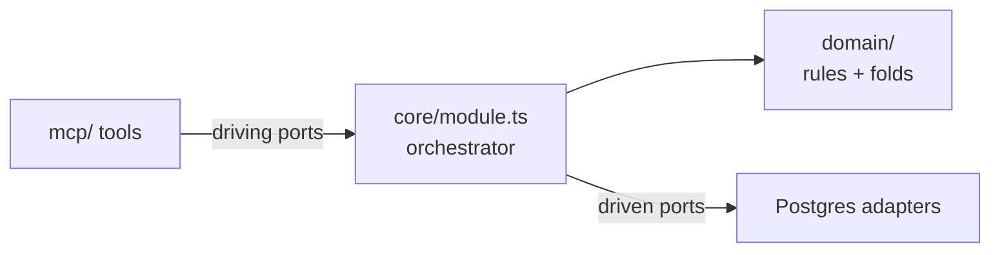

Engine là một hexagonal module (mô-đun lục giác): một domain core (lõi miền) được bao quanh bởi các infrastructure adapters (adapter hạ tầng). Core chứa toàn bộ các quy tắc; adapters chỉ chứa I/O. Ranh giới giữa chúng được giữ bằng leaf-adapter invariant (bất biến adapter lá) — một adapter không được chứa bất kỳ quyết định nào có thể diễn đạt mà không cần làm I/O.

## Phân chia giữa driving và driven

Một hexagonal module có hai nhóm port:

- **Driving ports** (bề mặt đầu vào) — những gì bên gọi sẽ gọi vào. Với engine, đó là `core/driving.ts`, nơi các thao tác được MCP tools gọi đến.
- **Driven ports** (bề mặt đầu ra) — những gì core cần từ hạ tầng. Với engine, đó là các repository interfaces (giao diện repository) trong `core/driven.ts`.

`core/module.ts` là nơi duy nhất được phép gọi nhiều hơn một port. Đây là seam (điểm nối) nơi slug resolution, envelope validation, occurrence-key assignment và alias resolution đều diễn ra — một lần cho mỗi lời gọi, trước khi bất kỳ adapter nào được gọi.

## Thiết kế đã sai ở đâu

Tài liệu thiết kế của engine chỉ khai báo bề mặt driving port — được gắn nhãn rất rõ là "những gì `mcp/` được phép gọi" — và hoàn toàn không khai báo phía driven. Phần triển khai đã lấp chỗ trống đó bằng cách sao chép chính danh sách driving, nên cùng chín tên thao tác trở thành cả public API (API công khai) của module lẫn bốn repository interfaces. Factory (bộ dựng) của module vì thế co lại thành chín lệnh chuyển tiếp một dòng.

Với tám trong số chín thao tác đó, việc sao chép này là vô hại: kiểu "lưu cái này / lấy cái kia" đúng là thao tác cơ sở dữ liệu. Nó hỏng ở `getBeliefState`, vì đây là một phép tính dựa trên ba nguồn chứ không phải một lần đọc store (kho lưu trữ). Khi đặt tên nó thành một phương thức repository, tuyên bố đó tự biến nó thành như vậy — khoảng 130 dòng quy tắc belief inference (suy luận niềm tin) cuối cùng bị đẩy vào bên trong SQL.

Đây cũng là lý do mọi lần review đều đã thông qua. Review kiểm tra phần triển khai dựa trên *tên gọi* trong thiết kế, và các tên đó khớp chính xác qua ba issue liên tiếp. Còn việc phân loại — driving hay driven — thì chưa từng là một thuộc tính được kiểm tra.

## `module.ts` điều phối những gì

`core/module.ts` xử lý, và chỉ mình nó xử lý:

- **Slug resolution** (`resolveSlugs`) — mọi lần chuyển từ slug sang uuid cho cả thao tác evidence lẫn graph.
- **Forward alias resolution** — mọi id trả về từ `resolveSlugs` đều phải được forward-resolve qua merge map trước khi dùng.
- **Occurrence-key assignment** (`assignOccurrenceKeys`) — gom các observation thành các bộ nhận dạng trước khi repository chèn dữ liệu.
- **Envelope validation** — kiểm tra denylist của altitude-rule và enum ba kiểu.
- **Belief fold orchestration** — gọi ba projector, hợp nhất kết quả của chúng, rồi dựng read model.

Trước issue #114, `PgEvidenceRepository.appendCheckpointBatch` tự thực hiện slug resolution, envelope validation và occurrence-key assignment ở bên trong. Việc chuyển orchestration này sang `module.ts` có nghĩa là repository giờ đây nhận `KeyedObservation[]` — đã được resolve trước, đã được gán key trước. Mọi đoạn mã gọi repository trực tiếp bằng dạng raw observation cũ giờ sẽ không còn type-check được nữa. Điểm gọi đúng là `EngineModuleApi.appendCheckpointBatch`.

## Leaf-adapter invariant trong thực tế

Quy tắc "một adapter không được chứa quyết định nào có thể diễn đạt mà không cần I/O" đã xuất hiện rất cụ thể trong guard chống catalog re-propose:

- **Module core** có một bước check-and-throw rõ ràng. Đây là nơi *quy tắc* nằm.
- **Adapter SQL** có `ON CONFLICT ... WHERE status <> 'rejected'`. Phần này chỉ tồn tại để khép cửa sổ race condition.

Phương án xóa phần kiểm tra phía core đã được cân nhắc rồi bác bỏ. Nếu chỉ giữ guard trong SQL, quy tắc sẽ bị diễn đạt bên trong một adapter và trở nên vô hình nếu không đọc SQL — trái với invariant và cũng trái với nguyên tắc rằng các quy tắc của engine phải có thể đọc ra từ riêng TypeScript.

## Các cặp kiểu gần như song sinh

Driving contract và driven contracts giữ bốn cặp kiểu có cấu trúc giống hệt nhau, chỉ khác đúng một trường — shape hướng model dùng `homeNodeSlug`, còn bản song sinh hướng repository dùng `homeNodeId`. `ProposeCandidateInput / ResolvedProposeCandidate` và `CandidateRef / ResolvedCandidateRef` là hai trường hợp rõ nhất.

Đây không phải là vi phạm: ranh giới slug-với-uuid khiến chúng thực sự là hai shape khác nhau. Nhưng quy tắc CI thực thi R-30 ("một shape mà cả hai phía cùng cần thì phải nằm trong domain layer, không bao giờ bị nhân đôi") kiểm tra imports, chứ không kiểm tra tính đồng nhất về cấu trúc. Hai interface giống nhau từng trường mà không import gì từ nhau vẫn qua được. Quy tắc đó không thể phân biệt một cặp song sinh hợp lệ với một bản copy-paste.

Điều này được ghi lại vì engine là implementation (bản triển khai) tham chiếu mà các module khác sẽ sao theo. Người đọc nhìn thấy bốn cặp gần như bản sao có thể hiểu đó là giấy phép cho việc clone thay vì chia sẻ. Nửa tích cực của R-30 — đặt shape dùng chung vào domain layer — hiện vẫn chỉ được review của con người thực thi.

## R-5 và cách đặt tên bảng catalog

R-5 cấm schema của engine gọi tên một domain, subject, language hay pedagogy cụ thể. Các bảng catalog được đặt tên là `misconception_catalog` và `pattern_catalog`, nghe như những từ mang tính sư phạm. Phán quyết ở bước review schema: chúng vẫn đạt.

"Misconception" và "pattern" là từ vựng cấp engine của chính dự án. Không có *cột* nào trong bất kỳ bảng engine nào gọi tên một môn học hay một phương pháp; còn *các hàng* trong catalog thì gọi tên các concept thực, và đó chính xác là nơi R-5 muốn nội dung miền nằm vào. Bước lint deny-list thực thi một phần R-5 kiểm tra tên môn học, chứ không kiểm tra hai từ này, nên phán quyết đó hiện chỉ tồn tại ở phần review thủ công.
