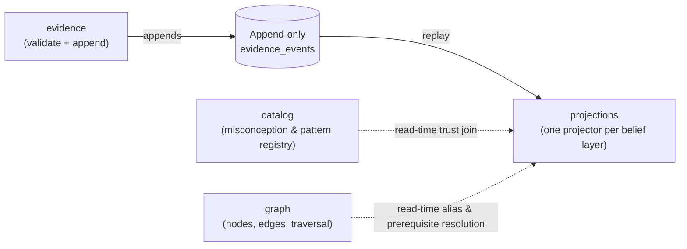

Toàn bộ nhiệm vụ của engine là biến hành vi quan sát được ở học sinh thành một bức tranh đáng tin cậy về điều mà học sinh tin là đúng — mà vẫn không bao giờ đánh mất khả năng thay đổi cách nó tính ra bức tranh đó. Engine làm điều này bằng một lựa chọn cấu trúc lớn: ghi lại các quan sát một cách vĩnh viễn, và coi mọi thứ engine “biết” về một học sinh là thứ luôn được tính mới từ các bản ghi đó, chứ không phải thứ được lưu sẵn rồi chỉnh sửa trực tiếp.

Chính lựa chọn đó định hình mọi phần còn lại ở đây. Mục này đi qua năm phần của câu chuyện:

- **[Event Log và Evidence Schema](/vi/engine/engine-impl/event-sourcing-evidence/)** — vì sao các quan sát là append-only (chỉ nối thêm), một evidence event (sự kiện bằng chứng) thực sự chứa những gì, và chuỗi chỉnh sửa về tính toàn vẹn đã làm nó vững chắc hơn ra sao khi quá trình sử dụng thực tế bộc lộ các khoảng trống.
- **[Ba Belief Projector](/vi/engine/engine-impl/projectors/)** — cách engine suy ra fragility (độ mong manh), misconception (ngộ nhận) và reasoning pattern (mẫu hình lập luận) từ cùng một log, với mỗi loại nằm sau cơ chế promotion gate (cổng thăng cấp) riêng của nó.
- **[Định danh Node và Alias-Merge](/vi/engine/engine-impl/node-identity-alias-merge/)** — ba cái tên mà một khái niệm mang theo, điều gì xảy ra khi hai khái niệm hóa ra là cùng một khái niệm, và nỗ lực kéo dài để làm cho việc hợp nhất đó đúng ở mọi nơi.
- **[Vòng đời Catalog Entry](/vi/engine/engine-impl/catalog-lifecycle/)** — cách một mục misconception hoặc reasoning-pattern di chuyển giữa candidate (ứng viên), approved (được duyệt) và rejected (bị loại), và vì sao trạng thái đó có thể đổi mà không cần rebuild (dựng lại).
- **[Cấu trúc Hexagonal: Những bài học riêng của Engine](/vi/engine/engine-impl/hexagonal-structure/)** — một vài bài học sắc nét, rất riêng của engine, về việc từ vựng domain (miền nghiệp vụ) được phép tồn tại ở đâu và ranh giới port (cổng giao tiếp) của module (mô-đun) đã đi sai ở đâu.

Ở trung tâm của cả năm phần là một sự tách đôi: một **write side** chỉ làm đúng một việc là nối thêm các quan sát có kiểu, và một **read side** suy ra mọi thứ còn lại bằng cách phát lại chúng. Hai phía này không bao giờ gọi trực tiếp lẫn nhau.

Vì write side không biết gì về cách belief được tính toán, phần mã suy diễn có thể được viết lại và toàn bộ log có thể được phát lại để tạo ra một trạng thái belief mới, nhất quán — điều đặc biệt quan trọng với một hệ thống mà mô hình belief được kỳ vọng là sẽ sai ở giai đoạn đầu và có thể sửa với chi phí thấp về sau.
