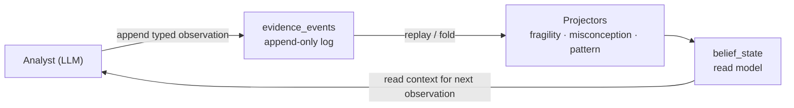

Engine (bộ máy suy luận) là lõi lập luận của Stemolly. Nó ghi lại mọi quan sát về một học sinh dưới dạng event (sự kiện) bất biến, rồi từ nhật ký đó suy ra các belief (nhận định) — fragility (độ mong manh), misconceptions (ngộ nhận), reasoning patterns (mẫu hình lập luận) — dưới dạng projections (phép chiếu) có thể dựng lại. Trang này là bản đồ dẫn tới các trang đi sâu hơn trong mục này.

## Bức tranh tổng thể

Kiến trúc của engine dựa trên một nguyên tắc: **evidence events (sự kiện bằng chứng) mới là nguồn chân lý; beliefs chỉ được suy ra, không bao giờ lưu trực tiếp.** Khi mô hình belief hóa ra chưa đúng — điều được dự liệu ở giai đoạn này — ta sẽ viết lại mã projection và chạy lại trên nhật ký không đổi, thay vì làm mất dữ liệu thật của học sinh.

Phía command (append) và phía query (fold) không bao giờ gọi lẫn nhau — chúng chỉ gặp nhau thông qua log đã được lưu bền vững.

## Các trang trong mục này

| Trang | Nội dung |
|---|---|
| [Event Sourcing & Evidence Schema](./event-sourcing-evidence) | Nền tảng append-only (chỉ ghi thêm), cách tách envelope/payload (phần bao/gói dữ liệu), thiết kế idempotency key (khóa chống ghi trùng), quy tắc altitude (mức tầng) |
| [Projectors & Promotion Gates](./projectors) | Ba phép fold ở lớp belief — fragility FSM (máy trạng thái hữu hạn cho độ mong manh), misconception FSM (máy trạng thái hữu hạn cho ngộ nhận), pattern accumulator (bộ tích lũy mẫu hình) — và cách mỗi cơ chế đạt ngưỡng để đưa ra khẳng định mạnh |
| [Node Identity & Alias Merge](./node-identity-alias-merge) | Mô hình node với ba định danh, khả năng thay đổi của slug (chuỗi định danh thân thiện), phân giải alias (bí danh), và tính đúng đắn khi merge (hợp nhất) |
| [Catalog Lifecycle](./catalog-lifecycle) | Các catalog của misconception và pattern, luồng candidate → approved, cơ chế rejection (loại bỏ), mức độ tin cậy tại thời điểm đọc |
| [Study Anchors & Assignment Briefs](./study-anchor-briefs) | Thực thể study anchor do engine sở hữu, các contract (ràng buộc) cho brief answer (câu trả lời ngắn), và kênh concept-gaps (lỗ hổng khái niệm) |
| [Hexagonal Module Structure](./hexagonal-structure) | Cách tách driving port (cổng vào) và driven port (cổng ra), điều phối trong `module.ts`, và kỷ luật với adapter (bộ chuyển tiếp) |
