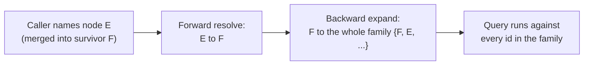
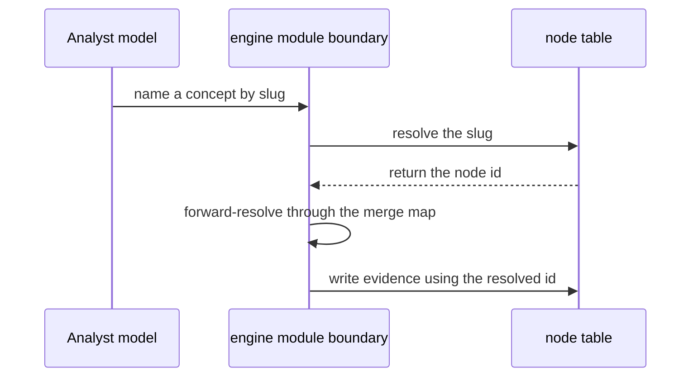

Trong engine, một khái niệm được gọi là một "node". Mỗi node mang ba loại tên khác nhau, phục vụ ba kiểu người đọc khác nhau, và không loại nào có thể bị bỏ đi hoặc gộp vào loại khác:

| Định danh | Ổn định? | Có ý nghĩa? | Dành cho ai |
|---|---|---|---|
| `id` (uuid) | Có — không bao giờ đổi | Không — không mang ý nghĩa | Cơ sở dữ liệu, và mọi khóa ngoại |
| `slug` (ví dụ `fraction-equivalence`) | Có | Có | Các tác nhân không phải con người nhưng xử lý ngôn ngữ: prompt (lời nhắc), seed file (tệp seed), log (nhật ký) |
| `display_name` (bản đồ văn bản theo từng locale) | Không — có thể được diễn đạt lại hoặc dịch bất cứ lúc nào | Có | Con người, bằng chính ngôn ngữ của họ |

Uuid ổn định nhưng không có ý nghĩa; tên hiển thị có ý nghĩa nhưng dễ thay đổi; chỉ `slug` là vừa ổn định vừa có ý nghĩa, và đó chính là thứ một tác nhân không thuộc lớp cơ sở dữ liệu nhưng có xử lý ngôn ngữ, như model (mô hình), cần dùng. Gộp bất kỳ hai loại nào cũng phải trả một giá cụ thể: nếu lấy slug làm khóa chính thì sẽ phá vỡ cam kết rằng id không bao giờ mang nghĩa, vì khi đổi tên một khái niệm bạn sẽ phải viết lại mọi tham chiếu đến nó, nếu không thì sẽ bỏ rơi evidence (dữ liệu quan sát) cũ; nếu bỏ slug thì phần code đối diện model lại phải quay về dùng một uuid mà không ai đọc hay kiểm tra được; nếu bỏ tên đã bản địa hóa thì con người sẽ không còn gì dễ đọc, và model làm việc bằng ngôn ngữ khác tiếng Anh cũng vậy. Chính sự tách ba ngả này cũng là lý do các tên do tác giả viết (tên node, nhãn mục catalog) được lưu trực tiếp dưới dạng locale map (bản đồ theo locale) trong từng dòng dữ liệu, thay vì đưa vào file dịch phía frontend (giao diện người dùng) — tập tên này còn tiếp tục tăng sau khi deploy, khi tác giả duyệt thêm nội dung mới, nên file dịch tạo ở thời điểm build sẽ luôn lỗi thời.

## Slug có thể thay đổi — chỉ uuid mới bền vững

Trên thực tế, slug trông có vẻ ổn định, nhưng nó cùng một loại với `display_name`: một khóa hiển thị có thể thay đổi. Điều này quan trọng ở mọi nơi cần ghi nhớ *đó là node nào* — **tham chiếu bền vững duy nhất đến một node là uuid của nó**, và chỉ `core/module.ts` mới được phép biến uuid đó trở lại thành slug hiện tại.

Điểm này được chốt không phải bằng quy ước mà từ một câu hỏi thiết kế rất cụ thể. Một artifact (đối tượng) mới — study anchor (neo học tập) — cần lưu tham chiếu đến node. Câu trả lời đã quyết định mọi thứ: vì slug có thể bị đổi tên, nếu anchor chỉ lưu slug thì bất kỳ sự kiện đổi tên nào cũng sẽ làm nó thành mồ côi. Vì vậy anchor lưu id, và chỉ có thể được đọc thông qua engine.

Hai trường hợp lệch trôi này diễn ra khác nhau, và chỉ một trường hợp là an toàn:

- Sau một lần **merge**, một slug đã lưu vẫn còn dùng được — dòng dữ liệu bị gộp đi vẫn giữ slug của nó, và `resolveSlugs` sẽ tìm ra rồi chuyển tiếp sang thực thể sống sót.
- Sau một lần **rename**, một slug đã lưu sẽ không còn phân giải được nữa, và `appendCheckpointBatch` sẽ ném lỗi rồi loại bỏ toàn bộ observations (quan sát) của checkpoint đó, thay vì âm thầm gắn chúng vào một node sai hoặc không tồn tại.

Phương án sát nút còn lại là tuyên bố slug là *immutable* (bất biến), nhưng nó thua ở một điểm: một slug gọi *sai khái niệm* không phải là lỗi bề ngoài, và khi đó cách sửa duy nhất sẽ là seed một node mới rồi merge — tức là ghi nhận vĩnh viễn rằng hai cái là cùng một khái niệm, trong khi thực tế chỉ là một sai sót. Thao tác đổi tên được cố ý không xây dựng; ràng buộc đối với các tham chiếu đã lưu vẫn có hiệu lực ngay cả khi không có nó. Phần mà engine không thể tự cưỡng chế là slug được viết trong file, trong skill prompt, hoặc trong transcript — và chính đó lại là những nơi nó dễ xuất hiện nhất.

## Tìm một slug đã có: chỉ tra cứu có giới hạn

Một lần ingest (nạp dữ liệu) thứ hai — bao phủ các khái niệm mà lần đầu đã seed rồi — tạo ra một vấn đề thực tế. Anchor phải mang đúng các slug hiện có đó, được viết chính xác tuyệt đối, nếu không `appendCheckpointBatch` sẽ ném lỗi. Nhưng cả `resolveSlugs` lẫn `lookupSlugs` đều không thể cung cấp chúng: cả hai đều yêu cầu phía gọi phải có sẵn tham chiếu từ trước. Trong khi đó, `seedNode` là một upsert idempotent trên `slug`, nên nếu viết cùng một khái niệm bằng một cách khác ở lần thứ hai, hệ thống sẽ lặng lẽ tạo ra node thứ hai và vĩnh viễn tách evidence của khái niệm đó làm đôi, trong một bảng mà trigger đã chặn `UPDATE` và `DELETE`.

Lời giải là `GraphRepository.matchNodes(terms, limit?)`, dựa trên `pg_trgm` (phần mở rộng so khớp tương đồng trigram của PostgreSQL) áp dụng cho `slug` và các giá trị JSON trong `display_name`. Nó trả về `{ slug, displayName, score }`, với các kết quả đã được phân giải bí danh trong `core/module.ts`, và chỉ được đưa ra ngoài dưới dạng công cụ `match_nodes` trên bộ công cụ MCP của **operator** (người vận hành) — tuyệt đối không xuất hiện trên bề mặt student (người học).

Ba đặc tính khiến đây thực sự là một ranh giới cứng chứ không chỉ là quy ước:

1. Đối số `terms` rỗng sẽ ném lỗi — không thể gọi công cụ này nếu không nêu rõ bạn đang tìm gì.
2. Engine tự giữ một trần `limit` tối đa mà phía gọi không thể vượt qua.
3. Một ngưỡng tương đồng tối thiểu trong SQL đảm bảo rằng một từ không giống gì cả thì sẽ không trả về gì.

Chỉ có giới hạn số dòng cho mỗi lần gọi thì chưa đủ: phía gọi vẫn có thể lặp đi lặp lại cùng một kiểu đọc với các từ khóa khác nhau và tích lũy toàn bộ đồ thị, từng trang một. Thứ thực sự chặn điều đó là ngưỡng mức độ liên quan — nếu lặp với những từ vô nghĩa thì sẽ không lấy được dòng nào, nên muốn có một tham chiếu, phía gọi phải sẵn biết tương đối mình đang tìm cái gì. Đó chính xác là thuộc tính mà người chuẩn bị dữ liệu ở lần ingest thứ hai đáng lẽ phải có.

Ranh giới mà quy tắc không-liệt-kê ban đầu trong ADR-030 bảo vệ vẫn còn nguyên: *thành viên* của anchor phải đến từ chính tài liệu học, còn phần tra cứu chỉ trả lời "khái niệm này hiện đang được gọi là gì?" — chứ không bao giờ trả lời "ở đây có những khái niệm nào?"

## Study anchor

Study anchor là danh sách khép kín gồm các cặp `{ slug, displayName }` mà một đơn vị học tập đã được chuẩn bị sẵn mang theo. Nó là cách để model của một phiên biết những concept slug nào tồn tại cho phần tài liệu mà nó đang bao phủ — mà không cần bất kỳ cơ chế liệt kê nào trên đồ thị.

Vì slug có thể thay đổi, anchor không thể lưu tên. Vì chỉ `core/module.ts` mới được phép biến id thành slug, một anchor lưu id cũng không thể sống bên ngoài engine. Điều này loại luôn phương án hiển nhiên nhất: một file do operator sở hữu nằm trong repository.

Các bảng anchor trong engine là:

- `engine.study_anchors` — mỗi anchor một dòng, chứa natural key (khóa tự nhiên) dễ đọc cho người chuẩn bị và một nhãn.
- `engine.study_anchor_nodes` — tập thành viên dưới dạng **uuid foreign keys** sang `engine.nodes`.

Khi một anchor được đọc ra, engine sẽ phân giải tiến từng id đã lưu qua bản đồ merge, rồi từ đó lấy slug hiện tại của nó. Một thành viên có node đã bị merge đi sẽ được trả về dưới tên của thực thể sống sót.

Bề mặt ghi có hai thao tác được đặt tên tường minh — không dùng `seed*`, vì anchor không phải một tập mở có thể lớn dần:

- **Create**: ném lỗi nếu đã tồn tại anchor với id đó.
- **Replace members**: thao tác ghi toàn trạng thái, chủ đích thay thế trọn bộ tập thành viên hiện tại.

:::note
Động từ `seed*` trong engine này là một cam kết ngữ nghĩa — mọi thao tác `seed*` đều là upsert idempotent vào một tập mở, đang tăng dần. Anchor là một danh sách khép kín được ghi toàn bộ, nên nếu mượn cùng động từ đó thì sẽ âm thầm đánh lừa bất kỳ ai đã học rằng `seed_node` là thao tác cộng dồn. Tên của thao tác phá hủy phải mang rõ chính sự phá hủy đó.
:::

Có hai thuộc tính cốt lõi về sau cũng không được làm yếu đi. *Thành viên* của anchor vẫn phải đến từ chính tài liệu học, chứ không bao giờ đến từ một truy vấn lên đồ thị — phần tra cứu giúp tìm đúng cách viết không bao giờ được biến thành nơi cung cấp nội dung. Và **không có thao tác liệt kê anchor trên bất kỳ bề mặt nào**: anchor chỉ được đọc bằng một id mà phía gọi đã được cấp sẵn, vì nếu cho liệt kê thì chỉ với một ít lần gọi cũng đủ tái dựng lại toàn bộ đồ thị.

## Khi hai khái niệm hóa ra là một

Đôi khi hai node rốt cuộc lại là cùng một khái niệm, và operator sẽ merge một node vào node kia. Engine ghi nhận phép gộp này bằng đúng một cột duy nhất — trường `merged_into` của node bị loại, trỏ sang thực thể sống sót — và không thay đổi gì khác. Không có cạnh nào, mục catalog nào hay dòng evidence nào bị viết lại.

Quyết định đó xuất phát từ một sự thật cứng: bảng evidence là append-only (chỉ cho phép ghi nối thêm) ở cấp trigger cơ sở dữ liệu, nên một lần merge không bao giờ có thể viết lại id node đã được lưu trong các observation trước đó. Vì việc phân giải merge ở thời điểm đọc là *bắt buộc* đối với evidence dù thế nào đi nữa, nên nếu remap các cạnh và các dòng catalog ngay lúc merge thì cũng chỉ là ghép thêm một cơ chế thứ hai bên cạnh cơ chế vẫn bắt buộc phải tồn tại — và nó còn phá hủy luôn khả năng đảo ngược một lần merge sai, biến một phán đoán có thể thu hồi của operator thành cánh cửa một chiều. Vì vậy toàn bộ engine theo một kỷ luật duy nhất: giữ nguyên các sự kiện thô đúng như lúc chúng được ghi, và chỉ phân giải ai là ai vào đúng thời điểm có thứ gì đó được đọc ra. Đây cũng chính là kỷ luật mà log evidence append-only vốn đã dùng, nay được mở rộng sang định danh node.

Ban đầu, kỷ luật này mới chỉ là ý định chứ chưa thành quy tắc được cưỡng chế — schema hoàn toàn hỗ trợ mô hình "evidence đi theo thực thể sống sót", nhưng thực tế không có đường đọc hay ghi nào thực sự lần theo `merged_into`, nên prerequisite, catalog match và evidence của một khái niệm đã merge đều cứ âm thầm nằm rải giữa id cũ và id mới. Vì lúc đó chưa có triệu chứng nào ở runtime (thao tác merge chưa có bên gọi thực sự), nên lỗ hổng này không bị nhận ra cho tới khi nó được chủ động lần theo và khép lại.

## Hai thao tác, hai hướng ngược nhau

Việc phân giải một định danh đã merge thường hay được nghĩ như một thao tác duy nhất — tra xem id đã bị loại nay sống sót ở đâu — nhưng thực ra engine cần hai thao tác, theo hai hướng đối nhau:

- **Phân giải tiến** (`resolveAlias`): nhiều-về-một, biến bất kỳ id node nào thành thực thể sống sót của nó. Được áp dụng cho mọi id *đi ra khỏi* engine.
- **Mở rộng lùi** (`expandAliases`): một-về-nhiều và có tính bắc cầu, biến một thực thể sống sót thành toàn bộ họ bí danh của nó. Được áp dụng cho mọi id *đi vào* một truy vấn nhằm vào bảng đang lưu các id lịch sử từ trước khi merge.

Bước mở rộng lùi là phần kém hiển nhiên hơn. Sau khi E được merge vào F, các liên kết prerequisite của F thực ra vẫn nằm trên những dòng dữ liệu từng được ghi cho E — bản thân F không có cạnh nào của riêng nó — nên nếu chỉ phân giải tiến sang F rồi dừng ở đó thì sẽ không tìm thấy gì cả. Truy vấn phải mở rộng ngược trở lại toàn bộ họ trước khi chạy, và điều đó phải được làm ở *mọi* bước của một phép duyệt nhiều chặng, chứ không chỉ ở điểm bắt đầu, nếu không phép duyệt sẽ gãy ngay khi đi qua một liên kết có bí danh.

Ghép hai bước này sai thứ tự, hoặc bỏ qua một bước, từng gây ra một lỗi thực tế đã được phát hành: nếu truy vấn trực tiếp bí danh đã bị gộp đi, rồi chạy mở rộng lùi trên riêng `E`, thì kết quả chỉ là `{E}` (không có gì từng merge vào một bí danh), và hệ thống sẽ âm thầm bỏ sót mọi thứ thực ra thuộc về thực thể sống sót cùng các bí danh khác của nó. Cách sửa là luôn phân giải tiến trước, rồi mới mở rộng lùi từ kết quả đó.

## Cả một họ lỗi mà cách ghép này liên tục tạo ra

Để làm đúng nguyên tắc "phân giải tiến, rồi mở rộng lùi" ở mọi điểm đọc — không chỉ điểm đầu tiên — đã cần tới nhiều bản sửa riêng rẽ, vì từng điểm phải được bắt trúng độc lập; sửa chỗ này không tự động sửa chỗ khác.

| Where | What went wrong | The fix |
|---|---|---|
| Kết quả prerequisite | Các id thô, chưa phân giải được trả về cùng `DISTINCT` ở cấp cơ sở dữ liệu, nhưng tính phân biệt đó biến mất khi phía gọi tự phân giải tiến từng id — hai id thô khác nhau có thể cùng phân giải về một thực thể sống sót và xuất hiện trùng lặp | Khử trùng lặp *sau* khi phân giải tiến, không phải trước đó |
| Tự loại trừ chính mình | Bộ lọc tường minh kiểu "loại node đang truy vấn ra khỏi kết quả của chính nó" đã bị bỏ mất khi phần phân giải được chuyển vào core module | Không phải một hồi quy thực sự: một khi phân giải tiến diễn ra trước mở rộng lùi, tập hạt giống ban đầu đã chứa mọi bí danh của node đang truy vấn, nên theo cấu trúc nó không thể xuất hiện trong chính kết quả của mình |
| Đọc theo lô | Lặp qua nhiều node rồi gọi hàm tra cứu độc lập cho từng node sẽ tải lại toàn bộ bản đồ merge ở mỗi vòng | Bộ gọi theo lô sẽ tải bản đồ merge một lần rồi truyền xuống một helper nội bộ dùng chung, thay vì đi qua hàm public theo từng node |
| Bộ lọc belief-state | Một tên khái niệm (slug) do model cung cấp được phân giải thành id, nhưng id đó lại bị dùng thô — không bao giờ phân giải tiến — nên belief state của một khái niệm đã merge bị đọc ra thành "unprobed" dưới tên cũ của nó, từ trước khi merge | Phân giải tiến và khử trùng lặp ngay sau khi biến slug thành id, trước khi dùng nó ở bất kỳ đâu |
| Tra cứu slug | Slug của một node đã bị merge đi không bao giờ bị xóa hay gán lại, nên việc tra cứu nó vẫn thành công và trả về một id node trông như còn sống, nhưng thực ra sai | Tuyệt đối không coi phân giải slug sang id là bước cuối cùng — luôn phải phân giải tiến kết quả nhận được trước khi so sánh, dùng làm khóa, hoặc trả ra ngoài |

Lỗi hồi quy ở phần đọc theo lô đáng được nhắc riêng: đưa một thao tác theo lô đi qua hàm tiện lợi, độc lập theo từng node là điều rất tự nhiên và dễ đọc khi viết code, cho ra kết quả giống hệt và vượt qua mọi bài test — chỉ có số vòng đi-về cơ sở dữ liệu là thay đổi, đúng kiểu khác biệt mà bản thân test hay check sẽ không thể tự phát hiện.

Lỗi belief-state là ví dụ sắc nhất cho thấy kiểu sai này có thể diễn ra lặng lẽ đến mức nào. Hai lỗi riêng biệt, cùng do thiếu bước phân giải tiến, tình cờ lại triệt tiêu nhau ở đúng một chỗ được đem ra kiểm tra — một tập concept "gợi ý" vẫn cho kết quả đúng — nên hai vòng review độc lập đều đánh dấu hành vi nền bên dưới là đúng, dù thực tế không đúng trên chính đường đi mà một thay đổi về sau đã đưa vào.

## Ranh giới đối diện model: chỉ gọi tên bằng slug

Không công cụ nào trong engine dành cho model lại đưa uuid thô của node vào prompt, hoặc nhận uuid như một đối số — model luôn gọi tên khái niệm bằng slug của nó, còn engine sẽ tự phân giải slug đó thành id ngay ở ranh giới của mình, một lần cho mỗi lô, trước khi bất kỳ phần nào khác chạy.

Lý do là slug sai và uuid sai thất bại theo hai kiểu hoàn toàn khác nhau. Một slug sai sẽ không khớp dòng nào và hỏng một cách lộ liễu; cơ chế retry at-least-once (thử lại ít nhất một lần) vốn có đã xử lý an toàn được trường hợp này. Nhưng một uuid sai — ví dụ model đảo nhầm một chữ số — lại có thể ghi thành công vào *nhầm* khái niệm, một cách âm thầm và vĩnh viễn, vì trigger trên bảng evidence chặn việc sửa lại. Chính sự bất đối xứng đó là toàn bộ lý do khiến slug trở thành thứ duy nhất model được nhìn thấy hoặc ghi ra.

Điều này kéo theo một câu hỏi khởi tạo: làm sao model có thể biết slug của một khái niệm mà nó chưa từng có evidence nào trước đó? Không công cụ nào trong bốn công cụ đối diện model trả về id hoặc slug của một khái niệm chưa từng gặp — tất cả đều nhận tham chiếu tới khái niệm như một *đầu vào* mà phía gọi phải có sẵn, còn công cụ duy nhất *có* thể trả về một định danh node mới thì lại thuộc vai trò operator, không bao giờ có mặt trong tiến trình dành cho student. Nếu suy ra danh sách các khái niệm có thể gọi tên từ registry của misconception/pattern thì cũng chỉ bao phủ những khái niệm đã có catalog entry gắn vào, nên bản thân nó vẫn chưa đủ.

Phương án được chọn là không bao giờ suy ra danh sách đó từ engine ngay từ đầu. **Một danh sách khép kín gồm các cặp `{ slug, displayName }` sẽ được soạn sẵn từ trước**, đi kèm cùng loại thông tin mà người chuẩn bị vốn đã phải cung cấp khi tạo node, mỗi danh sách ứng với một đơn vị học tập đã chuẩn bị (là một assignment trong proof-of-concept hiện tại; sẽ là lesson brief khi đã có đầy đủ bề mặt biên soạn). Đổi lại, engine không có thêm bất kỳ cách nào để tự liệt kê đồ thị của chính nó — không có công cụ "list all nodes", không có gì quét theo tag — hai chỗ giao cắt duy nhất giữa slug và id vẫn chỉ là phân giải các tham chiếu do chính phía gọi đưa vào, chứ không bao giờ sinh ra tham chiếu mới. Công cụ liệt kê toàn đồ thị đã được cân nhắc rồi bác bỏ tới hai lần, cùng vì một lý do nền tảng như nhau: nó sẽ đưa slug của mọi node vào ngữ cảnh của model, chính là kiểu phơi bày vô hạn mà cách tiếp cận danh sách khép kín này được tạo ra để tránh.

:::caution
Một lỗ hổng trong danh sách khép kín này vẫn còn tồn tại ngay cả sau khi sửa như trên. Hai trong ba loại observation yêu cầu một tham chiếu đến catalog, vì vậy chỉ có thể gọi tên những khái niệm đã có catalog entry — nhưng loại thứ ba, probe outcome thuần, lại gọi trực tiếp một node và hoàn toàn không mang tham chiếu catalog nào. Một khái niệm đã được seed nhưng không có misconception nào được đưa vào catalog sẽ không bao giờ được trao cho phiên làm việc theo cách này, nên nó cũng không bao giờ có thể nhận probe outcome. Lỗi này diễn ra âm thầm và nhìn y hệt dữ liệu bị thiếu thông thường: độ mong manh của khái niệm đó sẽ mãi được đọc thành "unprobed", không thể phân biệt với việc chưa từng được kiểm tra lần nào, dù trên thực tế học sinh đã được probe nhưng observation không có nơi nào để gắn vào.
:::

## Bề mặt operator cũng phải theo cùng kỷ luật đó

Quy tắc slug ở trên từng có một ngoại lệ: công việc do một operator là con người thực hiện trong Console, một trang web vốn đã giữ sẵn uuid trong state của nó sau khi người dùng bấm vào một node. Proof-of-concept này không có Console. Thay vào đó, operator điều khiển sáu hàm engine để tạo và chỉnh sửa node — `seedNode`, `seedEdge`, `seedCatalog`, cùng ba chuyển trạng thái catalog-candidate — thông qua một seed skill dựa trên Claude. Vì trong luồng này không hề có trang web nào đang giữ uuid sẵn, lý do để có ngoại lệ đó không còn áp dụng, và quy tắc chỉ-dùng-slug được mở rộng để bao trùm cả bề mặt operator này theo cả hai chiều: đầu vào lẫn đầu ra.

Cụ thể, `seedEdge` nhận `fromNodeSlug`/`toNodeSlug` thay vì id node, `seedCatalog` nhận `homeNodeSlug`, còn `seedCatalog` cùng ba thao tác chuyển trạng thái candidate trả về một mục có hình dạng theo slug thay vì mang uuid. Mọi phần phân giải vẫn diễn ra ở một chỗ duy nhất, chính là cùng ranh giới module được dùng cho các công cụ đối diện student — không repository hay adapter nào bên dưới đường ranh đó phải thay đổi, và cũng không có uuid nào đi qua nó.

Việc bao luôn cả *đầu ra*, chứ không chỉ đầu vào, là một mở rộng có chủ đích so với kế hoạch ban đầu vốn hẹp hơn. Nếu chỉ nhìn vào những chỗ operator có thể bị dẫn tới việc *ghi* nhầm uuid thì mới chạm tới hai trên sáu thao tác và đáng lẽ đã dừng ở đó. Nhưng `seedNode` — hàm tạo node — lại trả về hai uuid thô và hoàn toàn không trả slug. Đầu ra chính là cách uuid rơi vào tay operator ngay từ đầu, sẵn sàng để bị sao chép vào một lần gọi về sau như thể đó là một tham chiếu hợp lệ; nếu chỉ sửa phía đầu vào thì con đường sao chép ấy vẫn còn mở toang.

Có hai thứ được cố ý giữ theo hướng uuid. `mergeNodes` và `getPrerequisites` không hề đến được tay model nào — merge là một phán đoán của con người, không phải thứ nên được kích hoạt từ một slug — nên mối nguy mà quy tắc slug dùng để ngăn chặn không áp dụng cho chúng. Id của catalog entry hiện tại cũng tạm thời được giữ nguyên: rủi ro sao chép sai với loại định danh này cũng có tồn tại, chỉ là chưa được xử lý, với kế hoạch sẽ xem xét lại nếu từng có trường hợp một catalog entry sai được duyệt theo cách này, hoặc khi một bề mặt thứ hai bắt đầu truyền qua truyền lại các catalog id.
