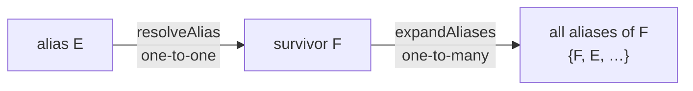
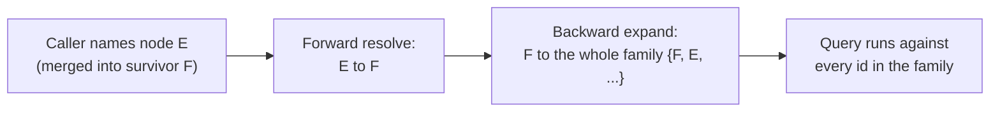
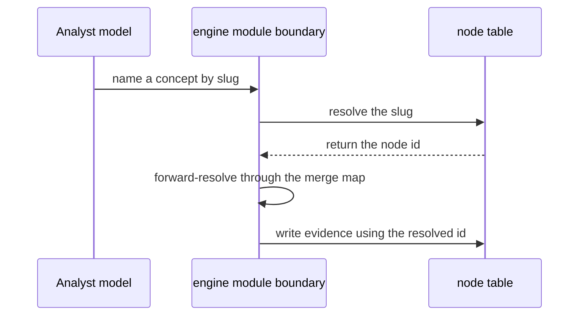

Mỗi khái niệm trong engine tồn tại dưới dạng một hàng trong `engine.nodes`. Mỗi hàng mang ba cái tên, và mỗi tên phục vụ một kiểu người đọc khác nhau. Làm đúng chỗ này rất quan trọng, vì các sự kiện evidence tham chiếu nút bằng uuid trong một bảng append-only (chỉ ghi thêm) — một tham chiếu sai hoặc cũ thì về sau không thể sửa lại.

## Ba định danh, ba nhóm người đọc

| Cột | Ai đọc | Bền vững? | Có ý nghĩa? |
|---|---|---|---|
| `id` (uuid) | Cơ sở dữ liệu, các phép join trong code | ✅ Có | ❌ Không |
| `slug` (ví dụ `fraction-equivalence`) | Prompt, seed file, log | ❌ Không (có thể thay đổi) | ✅ Có |
| `display_name` (bản đồ locale JSONB) | Con người, giao diện đã bản địa hóa | ❌ Không (dễ biến động) | ✅ Có |

Uuid (mã định danh duy nhất) là danh tính của nút — mờ nghĩa, không bao giờ đổi. `Slug` là một display key (khóa hiển thị) có thể thay đổi: người đọc không phải con người vẫn đọc được, nhưng nó không phải tham chiếu bền vững. `Display_name` là một locale map (bản đồ locale) (`{"en": "…", "vi": "…"}`) có thể diễn đạt lại hoặc dịch lại bất kỳ lúc nào.

**Không có cột nào vừa "bền vững" vừa "có ý nghĩa".** Bên gọi nào cần nhớ một nút cụ thể thì phải lưu uuid, rồi khi đọc mới phân giải slug hiện tại từ đó — nơi duy nhất được phép làm phép chuyển này là `core/module.ts`.

### Vì sao slug có thể thay đổi (ADR-036)

Tính có thể thay đổi của slug được chốt bởi một lựa chọn thiết kế rất cụ thể: một artifact (tạo vật) mới — study anchor (mốc học tập) — cần giữ tham chiếu đến nút. Nếu slug là bền vững, anchor có thể giữ tên và nằm trong một file. Nhưng vì không phải vậy, anchor buộc phải giữ uuid và sống bên trong engine.

Hai trường hợp trôi lệch này cho kết quả khác nhau:
- **Sau một lần merge:** một slug đã lưu vẫn dùng được — hàng đã bị gộp đi vẫn giữ slug đó và `resolveSlugs` sẽ tìm ra, rồi phân giải xuôi sang thực thể sống sót.
- **Sau một lần rename:** một slug đã lưu sẽ không phân giải được gì, và `appendCheckpointBatch` sẽ ném lỗi trước khi ghi — toàn bộ observations của một checkpoint sẽ bị loại bỏ.

Phương án tuyên bố slug là immutable đã từng được cân nhắc rồi bác bỏ. Một slug gọi *nhầm khái niệm* không phải lỗi hình thức. Nếu slug không được đổi, cách sửa duy nhất sẽ là seed một nút mới rồi merge, tức là ghi nhận vĩnh viễn rằng hai khái niệm từng là một, trong khi thực ra chỉ có một cái là sai.

:::caution
Engine không thể kiểm tra các slug được viết vào skill prompt, transcript hay file. Ngoại lệ là assignment brief, vì nó được kiểm tra đối chiếu với kết quả đọc `get_study_anchor` đang hoạt động khi phiên bắt đầu.
:::

### Bản địa hóa

Phần chữ do tác giả viết (`display_name`, `label`/`description` của catalog) được lưu ngay trong hàng dưới dạng locale map JSONB. Sau khi deploy, tập này còn tiếp tục lớn lên khi tác giả phê duyệt nút mới lúc runtime, nên file dịch phía frontend không thể phục vụ nó — tập khóa không hề biết trước ở thời điểm build. Còn phần UI chrome (chữ trên nút bấm, thông báo lỗi) do lập trình viên viết thì nên nằm trong file dịch; hiện trong repo vẫn chưa có chỗ nào dùng kiểu đó.

## Gộp hai nút

Khi hai nút được seed riêng rẽ hóa ra lại là cùng một khái niệm, operator (người vận hành) sẽ gọi `merge_nodes`. Theo chủ đích, phần ghi là tối giản: `mergeNodes(survivorSlug, aliasSlug)` chỉ đặt `nodes.merged_into` trên hàng alias (bí danh) và không làm gì thêm. Không cạnh nào được remap, không hàng catalog nào đổi, không hàng evidence nào bị đụng tới.

**Đây là đúng đắn, không phải giải pháp tắt.** `evidence_events` là append-only do trigger của cơ sở dữ liệu cưỡng chế — một lần merge không bao giờ có thể viết lại `node_id`. Vì thế, phân giải ở thời điểm đọc là bắt buộc dù chọn cách nào. Remap cạnh và hàng catalog ngay lúc merge chỉ tạo thêm một cơ chế thứ hai song song với cơ chế vốn đã bắt buộc, đồng thời phá hủy thông tin cần để hoàn tác một lần merge — biến một phán đoán có thể đảo ngược của operator thành cánh cửa một chiều.

Evidence được ghi bằng `node_id` thô rồi phân giải xuôi sang survivor ở thời điểm fold. Lịch sử của người học nhờ vậy được hợp nhất hồi tố mà không cần migration dữ liệu nào mỗi khi có merge.

## Phân giải alias: hai hướng

Sau khi gộp E vào F, engine cần hai thao tác đi theo hai hướng ngược nhau:



**`resolveAlias(id)`** ánh xạ mọi id alias đã nghỉ hưu sang survivor của nó. Dùng cho mọi `node_id` *đi ra khỏi* engine và cho `node_id` của evidence ở thời điểm fold.

**`expandAliases(survivorId)`** ánh xạ một survivor sang toàn bộ tập alias của nó. Dùng cho mọi `node_id` *đi vào* một truy vấn nhắm tới bảng đang lưu id lịch sử.

Hướng ngược là phần kém hiển nhiên hơn. Sau khi E được merge vào F, các cạnh prerequisite của F vẫn được lưu dưới dạng `from_node_id = E`. Một truy vấn khởi đầu từ F sẽ không tìm thấy gì. Trước khi chạy, truy vấn phải mở rộng thành `{F, E}`.

### Thứ tự hợp thành rất quan trọng

Hai thao tác này phải được hợp thành theo đúng thứ tự: `expandAliases(resolveAlias(id, mergeMap), mergeMap)`.

Chỉ áp dụng `expandAliases` từng là một lỗi thật đã lên production. Nếu id được hỏi đến bản thân nó lại là một alias đã bị gộp đi, thì `expandAliases(E)` chỉ trả về `{E}` — chẳng có gì từng merge *vào* một alias, nên lần đi ngược sẽ không tìm thấy gì ở phía survivor. Phân giải xuôi trước sẽ đưa ta tới `F`, rồi mở rộng từ đó mới cho ra cả họ đầy đủ.

### Phân giải xuôi phải đi sau phân giải slug

Một nút đã bị gộp đi vẫn giữ slug của nó. `nodes.merged_into` được ghi khi merge, nhưng hàng đó không bao giờ bị xóa. `resolveSlugs` chạy một truy vấn tra cứu thuần `WHERE slug = ANY($1)` mà không lọc `merged_into` — vì thế, phân giải một slug của nút đã bị gộp đi **vẫn thành công** và trả về id alias.

Quy tắc là: `resolveSlugs` không bao giờ được là bước cuối cùng. Mọi id mà nó trả về đều phải được phân giải xuôi qua merge map trước khi đem so sánh, dùng làm khóa trong map, hoặc trả ngược ra ngoài.

Đây là đường đi thực tế chứ không phải tình huống góc. Một model còn giữ brief cũ sẽ thường xuyên gọi một khái niệm bằng slug mà sau đó đã bị merge. Phân giải xuôi có chi phí rẻ ở mọi nơi merge map đã sẵn trong tay — và tại các điểm vào đọc của module, nó chỉ được lấy một lần cho mỗi lần gọi.

### Khử trùng lặp sau phân giải xuôi

Truy vấn prerequisite closure trả về các id thô, trước merge, và dùng `SELECT DISTINCT`. Nhưng sau khi phân giải xuôi từng id trả về, tính phân biệt ấy biến mất: hai id khác nhau cùng phân giải về một survivor sẽ xuất hiện hai lần. Bên gọi phải khử trùng lặp *sau* khi phân giải:

```typescript
[...new Set(rows.map((id) => resolveAlias(id, mergeMap)))]
```

Việc khử trùng lặp này trông như dọn dẹp cho đẹp; thực ra nó là phần chịu lực. Có lần nó đã bị bỏ đi khi logic phân giải alias chuyển module, và việc lặp chỉ bị phát hiện nhờ đọc đối chiếu code cũ với code mới.

## Khoảng trống còn mở: prerequisite và catalog sau merge

`getPrerequisites` và `matchCatalog` hiện vẫn chưa phân giải các `node_id` đã bị gộp đi ở đầu vào. Sau khi merge E vào F:
- `getPrerequisites(F)` không trả về gì (các cạnh đang được lưu dưới E).
- `matchCatalog(F)` không tìm thấy mục nào.

Khoảng trống này từng ngủ yên khi `mergeNodes` chưa có bên gọi thực sự. Nó trở thành lỗi sống khi `merge_nodes` được đăng ký làm công cụ MCP trong ADR-041. Một lần merge do operator thực hiện trên dữ liệu đã tích lũy giờ chỉ còn cách một lần gọi là có thể phơi bày nó.

Phần evidence của khoảng trống này đã được khép lại — cơ chế phân giải xuôi lúc đọc trong ADR-024 đã xử lý nó. Phần đồ thị giờ cần một quyết định thật: hoặc remap cạnh ở thời điểm merge, hoặc phân giải tại mọi điểm vào đọc của đồ thị.

## Bề mặt thao tác mang hình dạng slug

Mọi tham chiếu nút mà model nhìn thấy đều là slug, không bao giờ là uuid. Engine phân giải slug sang uuid tại `core/module.ts` và không làm điều đó ở đâu khác. Tính bất đối xứng của lỗi nằm ở đây:

- Một **slug** sai gần như luôn phân giải ra rỗng và thất bại ồn ào trước khi có ghi nào xảy ra.
- Một **uuid** sai có thể vẫn khớp với *sai khái niệm*, một cách im lặng và vĩnh viễn.

ADR-027 áp dụng nguyên tắc này cho bề mặt student. ADR-031 áp dụng nó cho bề mặt operator (cả sáu thao tác đều gọi nút bằng slug theo cả hai chiều). ADR-041 mở rộng tiếp sang `mergeNodes`, vốn từng bị giữ ở dạng nhận uuid với giả định "không model nào chạm tới" — giả định đó vỡ ra khi `match_nodes` đem tới cho bề mặt operator một công cụ mà bước kế tiếp tự nhiên chính là một lời gọi merge do model dẫn dắt.

`getPrerequisites` vẫn là phần khoét ngoại lệ duy nhất dùng uuid, vì nó không nằm trên bề mặt MCP.

## Tra cứu mờ an toàn: `match_nodes`

Engine cấm việc liệt kê vô hạn đồ thị khái niệm. `match_nodes` (ADR-035) là một ngoại lệ có biên: nó nhận các search term không rỗng và trả về các kết quả `{ slug, displayName, score }`, được hậu thuẫn bởi độ tương tự `pg_trgm`, với một ngưỡng liên quan đủ để một từ linh tinh sẽ không trả về gì.

Giới hạn số kết quả cho mỗi lần gọi không đủ để chặn năng lực này — các lần gọi vẫn có thể lặp lại. Thứ thực sự chặn nó là ngưỡng: cách duy nhất để gom dần các tham chiếu là bạn phải vốn đã biết khá rõ mình đang tìm gì.

Đây là công cụ chỉ dành cho operator. Bộ công cụ của student không có bất kỳ dạng tra cứu nào. Thành viên của anchor vẫn đến từ tài liệu học; phần tra cứu chỉ trả lời "khái niệm này hiện đang được gọi là gì?" — không bao giờ là "ở đây có những khái niệm nào?"


Một khái niệm trong engine được gọi là một "node". Mỗi node mang ba cái tên khác nhau, cho ba kiểu người đọc khác nhau, và không tên nào có thể bị bỏ đi hay gộp vào tên khác:

| Định danh | Ổn định? | Có ý nghĩa? | Dành cho ai |
|---|---|---|---|
| `id` (uuid) | Có — không bao giờ đổi | Không — không mang nghĩa | Cơ sở dữ liệu, và mọi khóa ngoại |
| `slug` (ví dụ `fraction-equivalence`) | Có | Có | Những bên đọc không phải con người nhưng xử lý ngôn ngữ: prompt, seed file, log |
| `display_name` (bản đồ văn bản theo từng locale) | Không — có thể diễn đạt lại hoặc dịch bất kỳ lúc nào | Có | Con người, bằng chính ngôn ngữ của họ |

Uuid ổn định nhưng vô nghĩa; display name có ý nghĩa nhưng dễ biến động; slug là cái duy nhất vừa ổn định vừa có ý nghĩa, và đó chính là thứ một bên gọi xử lý ngôn ngữ nhưng không thuộc lớp cơ sở dữ liệu, như model, cần đến. Gộp bất kỳ hai loại nào cũng mất đi một thứ rất cụ thể: nếu lấy slug làm khóa chính thì sẽ phá vỡ lời hứa rằng id không bao giờ mang nghĩa, vì đổi tên một khái niệm khi đó sẽ buộc phải viết lại mọi tham chiếu tới nó, nếu không evidence cũ sẽ bị bỏ rơi; nếu bỏ slug thì phần code đối diện model lại phải quay về một uuid mà không ai đọc hay kiểm chứng nổi; nếu bỏ tên bản địa hóa thì sẽ không còn gì dễ đọc cho con người, hoặc cho model đang làm việc bằng ngôn ngữ khác tiếng Anh. Sự tách ba ngả này cũng là lý do các tên do tác giả viết (tên node, nhãn mục catalog) được lưu trực tiếp dưới dạng locale map trong từng hàng, thay vì bỏ vào file dịch phía frontend — tập tên này còn tăng thêm sau khi deploy, khi tác giả phê duyệt nội dung mới, nên một file dịch ở thời điểm build sẽ luôn cũ.

## Slug có thể thay đổi — chỉ uuid mới bền vững

Trên thực tế slug trông có vẻ ổn định, nhưng nó cùng lớp với `display_name`: một khóa hiển thị có thể thay đổi. Điều này quan trọng ở mọi nơi cần ghi nhớ *đó là node nào* — **tham chiếu bền vững duy nhất tới một node là uuid của nó**, và chỉ `core/module.ts` mới được phép đổi uuid đó ngược lại thành slug hiện tại.

Điểm này được chốt không phải bằng quy ước mà bằng một câu hỏi thiết kế rất cụ thể. Một artifact mới — study anchor — cần giữ tham chiếu tới node. Câu trả lời quyết định mọi thứ: vì slug có thể bị rename, một anchor chỉ lưu slug sẽ bị mồ côi sau bất kỳ lần rename nào. Vì vậy anchor lưu id, và chỉ có thể được đọc qua engine.

Hai trường hợp trôi lệch này diễn ra khác nhau, và chỉ một trường hợp là an toàn:

- Sau một lần **merge**, một slug đã lưu vẫn dùng được — hàng bị gộp đi vẫn giữ slug của nó, `resolveSlugs` tìm được nó rồi chuyển tiếp sang survivor.
- Sau một lần **rename**, một slug đã lưu sẽ không phân giải được gì, và `appendCheckpointBatch` sẽ ném lỗi và loại bỏ toàn bộ observations của checkpoint đó, thay vì lặng lẽ gắn chúng vào một node sai hoặc không tồn tại.

Phương án sát nhất là tuyên bố slug là *immutable*, nhưng nó thua ở đúng một điểm: một slug gọi *nhầm khái niệm* không phải chuyện bề ngoài, và khi đó cách sửa duy nhất sẽ là seed một nút mới rồi merge — tức là ghi nhận vĩnh viễn hai cái là một khái niệm, trong khi thực ra chỉ có một cái bị sai. Thao tác rename được cố ý không xây; ràng buộc trên các tham chiếu đã lưu vẫn còn nguyên ngay cả khi thiếu nó. Phần mà engine không thể tự cưỡng chế là slug được viết vào file, skill prompt hoặc transcript — đúng những nơi nó dễ xuất hiện nhất.

## Tìm một slug đã tồn tại: chỉ tra cứu có giới hạn

Một đợt ingest thứ hai — bao phủ những khái niệm mà đợt đầu đã seed rồi — tạo ra một vấn đề rất thực tế. Anchor phải mang đúng các slug đã có đó, được viết khớp tuyệt đối, nếu không `appendCheckpointBatch` sẽ ném lỗi. Nhưng cả `resolveSlugs` lẫn `lookupSlugs` đều không thể cung cấp chúng: cả hai đều đòi phía gọi phải sẵn có tham chiếu. Trong khi đó, `seedNode` là một upsert idempotent trên `slug`, nên cách viết thứ hai của cùng một khái niệm sẽ lặng lẽ tạo ra nút thứ hai và vĩnh viễn tách evidence của khái niệm đó ra làm hai, trong một bảng mà trigger đã chặn `UPDATE` và `DELETE`.

Lời giải là `GraphRepository.matchNodes(terms, limit?)`, dựa trên `pg_trgm` (phần mở rộng so khớp trigram của PostgreSQL) áp dụng lên `slug` và các giá trị JSON của `display_name`. Nó trả về `{ slug, displayName, score }`, với các kết quả đã được phân giải alias trong `core/module.ts`, và chỉ được đưa ra ngoài như công cụ `match_nodes` trên bộ công cụ MCP của **operator** — không bao giờ xuất hiện trên bề mặt student.

Ba thuộc tính khiến đây là một giới hạn thật sự chứ không chỉ là quy ước:

1. Đối số `terms` rỗng sẽ ném lỗi — không thể gọi công cụ này mà không nêu bạn đang tìm gì.
2. Engine tự giữ một trần `limit` tối đa mà phía gọi không thể vượt qua.
3. Một ngưỡng tương đồng tối thiểu trong SQL bảo đảm rằng một từ không giống gì cả thì không trả về gì.

Chỉ chặn số hàng cho mỗi lần gọi thì chưa giải quyết được gì: phía gọi vẫn có thể lặp lại cùng kiểu đọc với các term khác nhau và gom toàn bộ đồ thị từng trang một. Thứ thực sự ngăn chuyện đó là ngưỡng mức độ liên quan — thử các term rác sẽ không đổi lấy hàng nào, nên muốn có một tham chiếu thì phía gọi phải vốn đã biết tương đối mình đang tìm gì. Đó chính xác là thuộc tính mà người chuẩn bị cho đợt ingest thứ hai đáng lẽ phải có.

Ranh giới mà quy tắc cấm-liệt-kê ban đầu trong ADR-030 muốn bảo vệ vẫn còn nguyên: *thành viên* của anchor đến từ chính tài liệu, còn phần tra cứu chỉ trả lời "khái niệm này hiện được gọi là gì?" — chứ không phải "ở đây có những khái niệm nào?"

## Study anchor

Study anchor là danh sách khép kín gồm các cặp `{ slug, displayName }` mà một đơn vị học tập đã được chuẩn bị mang theo. Đó là cách để model của một phiên biết những concept slug nào tồn tại cho phần tài liệu mà nó đang bao phủ — mà không cần bất kỳ cách liệt kê nào trên đồ thị.

Vì slug có thể thay đổi nên anchor không thể lưu tên. Vì chỉ `core/module.ts` mới được phép biến id thành slug, một anchor lưu id cũng không thể sống bên ngoài engine. Điều này loại bỏ ngay phương án hiển nhiên nhất: một file trong repository do operator sở hữu.

Các bảng anchor của engine là:

- `engine.study_anchors` — mỗi anchor một hàng, có natural key dễ đọc cho người chuẩn bị và một nhãn.
- `engine.study_anchor_nodes` — tập thành viên dưới dạng **uuid foreign key** tới `engine.nodes`.

Khi đọc một anchor, engine sẽ phân giải xuôi từng id đã lưu qua merge map, rồi từ đó lấy slug hiện tại của nó. Một thành viên có node đã bị gộp đi sẽ được phục vụ dưới tên của survivor.

Bề mặt ghi gồm hai thao tác được đặt tên tường minh — không dùng `seed*`, vì anchor không phải tập mở có thể lớn dần:

- **Create**: ném lỗi nếu đã tồn tại anchor với id đó.
- **Replace members**: ghi toàn trạng thái, thay thế tường minh tập thành viên hiện tại.

:::note
Động từ `seed*` là một lời hứa ngữ nghĩa trong engine này — mọi thao tác `seed*` đều là upsert idempotent vào một tập mở, đang lớn dần. Anchor là danh sách đóng được ghi trọn gói, nên mượn cùng một động từ sẽ lặng lẽ đánh lừa bất kỳ bên gọi nào đã học rằng `seed_node` là phép cộng dồn. Thao tác có tính phá hủy phải mang sự phá hủy ngay trong tên của nó.
:::

Hai thuộc tính chịu lực ở đây không được suy yếu về sau. *Thành viên* của anchor vẫn phải đến từ tài liệu học, không bao giờ từ một truy vấn trên đồ thị — phần tra cứu giúp viết đúng chính tả không bao giờ được biến thành công cụ cung cấp nội dung. Và **không có thao tác liệt kê anchor trên bất kỳ bề mặt nào**: anchor được đọc bằng id mà bên gọi đã được cấp sẵn, vì nếu cho phép liệt kê chúng thì chỉ cần vài lần gọi là có thể ráp lại toàn bộ đồ thị.

## Khi hai khái niệm hóa ra là một

Đôi khi hai nút hóa ra đang gọi cùng một khái niệm, và operator sẽ merge một cái vào cái còn lại. Engine ghi nhận lần merge này bằng cách chỉ ghi đúng một cột — trường `merged_into` của nút bị loại, trỏ sang survivor — và không đổi gì khác. Không cạnh nào, không mục catalog nào, không hàng evidence nào bị viết lại.

Quyết định đó đi ra từ một thực tế cứng: bảng evidence là append-only do trigger ở cơ sở dữ liệu, nên merge không bao giờ có thể viết lại `node_id` đã lưu trên các observations trong quá khứ. Một khi việc phân giải merge ở thời điểm đọc đã *bắt buộc* đối với evidence dù theo cách nào, thì remap cạnh và hàng catalog ở thời điểm merge chỉ là gắn thêm một cơ chế thứ hai bên cạnh cơ chế vẫn không thể thiếu — và đồng thời còn phá hủy khả năng đảo ngược một lần merge sai, biến một phán đoán có thể sửa của operator thành cánh cửa một chiều. Vì thế toàn bộ engine tuân theo một kỷ luật duy nhất: giữ nguyên các dữ kiện thô như đã được ghi, và chỉ phân giải ai là ai vào đúng lúc có thứ gì đó được đọc ra. Đây cũng chính là kỷ luật mà log evidence append-only đã dùng sẵn, nay được mở rộng sang định danh nút.

Lúc ban đầu, kỷ luật này mới chỉ là ý định chứ chưa phải quy tắc được cưỡng chế — schema hoàn toàn hỗ trợ ý tưởng "evidence đi theo survivor", nhưng chưa có đường đọc hay ghi nào thực sự đi qua `merged_into`, nên prerequisite, catalog match và evidence của một khái niệm đã merge đều lặng lẽ nằm rải ra trên cả id cũ lẫn id mới. Vì lúc ấy chưa có triệu chứng lúc runtime (thao tác merge chưa có bên gọi thật), khoảng trống này đã không bị chú ý cho tới khi người ta chủ động lần theo nó và khép lại.

## Hai thao tác, hai hướng ngược nhau

Người ta thường nghĩ việc phân giải một định danh đã merge là một thao tác duy nhất — tìm survivor của một id đã nghỉ hưu — nhưng engine thực ra cần hai thao tác đi theo hai hướng ngược nhau:

- **Phân giải xuôi** (`resolveAlias`): many-to-one, biến mọi id nút thành survivor của nó. Áp dụng cho mọi id *đi ra khỏi* engine.
- **Mở rộng ngược** (`expandAliases`): one-to-many và bắc cầu, biến một survivor thành toàn bộ họ alias của nó. Áp dụng cho mọi id *đi vào* một truy vấn chạy trên bảng còn lưu các id lịch sử, trước merge.



Bước đi ngược là phần kém hiển nhiên hơn. Sau khi E được merge vào F, các liên kết prerequisite của F vẫn được lưu trên những hàng từng ghi cho E — F không có cạnh nào của riêng mình — nên nếu chỉ phân giải xuôi sang F rồi dừng lại thì sẽ không thấy gì. Truy vấn phải nở ngược ra thành cả họ trước khi chạy, và nó phải làm điều này ở *mọi* bước nhảy trong một phép duyệt nhiều tầng, chứ không chỉ ở điểm xuất phát, nếu không đường đi sẽ gãy ngay khi đi qua một liên kết đã có alias.

Ghép sai thứ tự hai bước này, hoặc bỏ sót một bước, từng tạo ra một lỗi thật đã được phát hành: nếu truy vấn trực tiếp alias đã bị gộp đi, thì mở rộng ngược trên `E` một mình chỉ trả về `{E}` (không có gì từng merge vào alias cả), và như vậy sẽ lặng lẽ bỏ sót mọi thứ thực ra thuộc về survivor cùng các alias khác của nó. Cách sửa là luôn phân giải xuôi trước, rồi mới mở rộng ngược từ kết quả đó.

## Họ lỗi mà cách hợp thành này liên tục sinh ra

Làm đúng "phân giải xuôi, rồi mở rộng ngược" ở mọi điểm đọc — chứ không chỉ ở điểm đầu tiên — đã cần tới nhiều lần sửa riêng lẻ, vì mỗi chỗ phải được bắt đúng tại chỗ; sửa một nơi không tự động sửa các nơi khác.

| Ở đâu | Đã sai như thế nào | Cách sửa |
|---|---|---|
| Kết quả prerequisite | Các id thô, chưa phân giải, quay về cùng với `DISTINCT` ở cấp cơ sở dữ liệu, nhưng tính phân biệt đó biến mất khi bên gọi phân giải xuôi từng id — hai id thô khác nhau có thể cùng phân giải về một survivor và xuất hiện thành bản sao | Khử trùng lặp *sau* khi phân giải xuôi, không phải trước |
| Tự loại trừ chính nó | Bộ lọc tường minh "loại nút được hỏi ra khỏi kết quả của chính nó" bị mất khi logic phân giải được dời vào core module | Thực ra không phải hồi quy: một khi đã phân giải xuôi trước rồi mở rộng ngược sau, tập hạt giống đã chứa mọi alias của nút được hỏi, nên theo cấu trúc nó không thể xuất hiện trong kết quả của chính nó |
| Đọc theo lô | Lặp qua nhiều nút rồi gọi hàm tra cứu độc lập cho từng nút sẽ khiến toàn bộ merge map bị lấy lại mỗi lần | Bên gọi theo lô lấy merge map đúng một lần rồi truyền xuống helper nội bộ dùng chung, thay vì đi qua hàm công khai theo từng nút |
| Bộ lọc belief state | Một tên khái niệm do model cung cấp (slug) đã được phân giải thành id, nhưng id đó lại bị dùng nguyên xi — không hề phân giải xuôi — nên khi đọc belief state của một khái niệm đã merge thì nó hiện thành "unprobed" dưới tên cũ trước merge | Phân giải xuôi và khử trùng lặp ngay sau khi phân giải slug thành id, trước khi dùng nó ở bất kỳ đâu |
| Tra cứu slug | Slug của một nút đã bị gộp đi không bao giờ bị xóa hay gán lại, nên tra cứu nó vẫn thành công và trả về một id nút trông như còn sống nhưng thực ra sai | Xem việc phân giải slug sang id là không bao giờ kết thúc ở đó — luôn phân giải xuôi giá trị trả về trước khi so sánh, dùng làm khóa, hoặc trả ngược ra ngoài |

Lỗi hồi quy ở đường đọc theo lô đáng được nêu riêng: dẫn một batch qua hàm công khai tiện tay dành cho từng nút là cách viết tự nhiên, dễ đọc, cho ra kết quả y hệt, và vượt qua mọi bài test — thứ duy nhất thay đổi là số vòng khứ hồi xuống cơ sở dữ liệu, mà đó lại chính là kiểu chuyện chẳng có test hay kiểm tra nào tự phát hiện.

Lỗi belief state là ví dụ sắc nhất cho việc chuyện này có thể hỏng im lặng đến mức nào. Hai khiếm khuyết riêng biệt, cùng bắt nguồn từ việc thiếu bước phân giải xuôi, đã vô tình triệt tiêu nhau ở đúng chỗ duy nhất chúng được kiểm tra — một tập khái niệm "hint" vẫn tình cờ cho ra kết quả đúng — khiến hai vòng review độc lập đều đánh dấu hành vi nền là đúng, trong khi trên chính đường đi mà một thay đổi sau này đã mở ra thì nó lại sai.

## Ranh giới đối diện model: chỉ gọi tên bằng slug

Không công cụ nào của engine ở phía model từng đưa uuid thô của nút vào prompt, cũng không nhận nó làm tham số — model luôn gọi tên khái niệm bằng slug, và engine sẽ phân giải slug đó thành id ngay tại ranh giới của mình, một lần cho mỗi batch, trước khi bất kỳ thứ gì khác chạy.



Lý do là slug sai và uuid sai thất bại theo hai cách rất khác nhau. Một slug sai sẽ không khớp hàng nào và vỡ ra ồn ào, điều mà cơ chế retry at-least-once vốn đã xử lý an toàn. Còn một uuid sai — ví dụ model đảo nhầm một chữ số — lại có thể thành công trên *sai* khái niệm, một cách lặng lẽ và vĩnh viễn, vì bảng evidence chặn việc sửa bằng trigger. Chính tính bất đối xứng đó là toàn bộ lập luận cho việc khiến slug trở thành thứ duy nhất model từng nhìn thấy hoặc ghi xuống.

Điều này kéo theo một câu hỏi khởi động: làm sao model biết được slug của một khái niệm mà nó chưa từng có evidence trước đó? Không công cụ nào trong bốn công cụ đối diện model trả về id hay slug của một khái niệm chưa gặp — tất cả đều nhận tham chiếu khái niệm làm *đầu vào* mà bên gọi phải có sẵn, còn công cụ duy nhất *thật sự* trả về một định danh nút mới thì lại thuộc vai trò operator, không bao giờ có mặt trong tiến trình hướng student. Suy ra từ registry về misconception/pattern để lấy danh sách các khái niệm có thể gọi tên cũng chỉ bao phủ những khái niệm đã gắn sẵn một mục catalog, nên tự nó vẫn chưa đủ.

Lời giải được chọn là không bao giờ suy ra danh sách đó từ engine. Thay vào đó, **một danh sách khép kín các cặp `{ slug, displayName }` được tác giả chuẩn bị từ đầu**, kèm với đúng loại thông tin mà người chuẩn bị vốn đã phải cung cấp khi tạo nút, mỗi danh sách gắn với một đơn vị học tập đã được chuẩn bị (trong proof-of-concept hiện tại là assignment; về sau, khi có bề mặt soạn thảo đầy đủ, sẽ là lesson brief). Đổi lại, engine vẫn không có cách nào để tự liệt kê đồ thị của chính nó — không có công cụ "list all nodes", không có gì quét theo tag — hai điểm giao nhau slug/id duy nhất vẫn chỉ là phân giải các tham chiếu mà chính bên gọi đã mang vào, chứ không tạo thêm tham chiếu mới. Công cụ liệt kê toàn đồ thị đã được cân nhắc rồi bác bỏ hai lần, cùng vì một lý do gốc: nó sẽ đưa slug của mọi nút vào ngữ cảnh của model, chính là kiểu lộ bày không giới hạn mà cách tiếp cận danh sách khép kín được dựng lên để tránh.

:::caution
Vẫn còn một khoảng trống trong danh sách khép kín này ngay cả sau khi sửa xong chỗ trên. Hai trong ba loại observation cần tham chiếu catalog, nên chỉ có thể gọi tên một khái niệm đã sẵn có catalog entry — nhưng loại thứ ba, kết quả probe thuần, gọi thẳng một node và hoàn toàn không mang tham chiếu catalog nào. Một khái niệm được seed mà không có misconception nào được đưa vào catalog sẽ không bao giờ được trao cho một phiên theo cách này, nên cũng không bao giờ nhận được probe outcome. Lỗi này im lặng và trông hệt như dữ liệu thiếu thông thường: độ mong manh của khái niệm đó sẽ mãi hiện là "unprobed", không thể phân biệt với việc chưa từng được kiểm tra, dù trên thực tế người học đã bị probe nhưng observation không có chỗ nào để bám vào.
:::

## Bề mặt operator cũng phải theo cùng kỷ luật

Quy tắc slug ở trên từng có một ngoại lệ: công việc do operator con người làm trong Console, một trang web vốn đã giữ uuid trong state nội bộ ngay sau khi ai đó bấm vào một nút. Nhưng proof-of-concept này không có Console. Thay vào đó, operator điều khiển sáu hàm của engine để tạo và sửa nút — `seedNode`, `seedEdge`, `seedCatalog`, cùng ba bước chuyển trạng thái catalog-candidate — thông qua một seed skill dựa trên Claude. Vì trên đường đi này không hề có trang web nào đang giữ uuid sẵn trong tay, lý do tồn tại ngoại lệ đó không còn áp dụng, và quy tắc chỉ-dùng-slug được mở rộng để bao trùm cả bề mặt operator theo cả hai chiều: tham số đưa vào, và kết quả trả ra.

Cụ thể, `seedEdge` nhận `fromNodeSlug`/`toNodeSlug` thay vì id nút, `seedCatalog` nhận `homeNodeSlug`, còn `seedCatalog` cùng ba thao tác chuyển trạng thái candidate thì trả về một entry mang hình dạng slug thay vì mang uuid. Toàn bộ việc phân giải vẫn xảy ra ở một nơi, chính ranh giới module từng dùng cho các công cụ phía student — không repository hay adapter nào bên dưới đường cắt đó phải thay đổi, và cũng không uuid nào được đi xuyên qua nó.

Việc bao phủ cả *đầu ra*, chứ không chỉ đầu vào, là một sự nới rộng có chủ đích so với một kế hoạch trước đó hẹp hơn. Nếu chỉ nhìn vào chỗ operator có thể bị khiến *ghi* một uuid sai thì sẽ chỉ chặn được hai trong sáu thao tác rồi dừng ở đó. Nhưng `seedNode` — hàm tạo nút — lại đang trả về hai uuid thô và không có slug nào cả. Đầu ra chính là cách một uuid rơi vào tay operator ngay từ đầu, sẵn sàng bị chép sang một lời gọi sau như thể đó là tham chiếu hợp lệ; nếu chỉ sửa phía đầu vào thì con đường sao chép đó vẫn mở toang.

**`mergeNodes` đã được đưa vào bề mặt chỉ-dùng-slug.** Những gì viết ở trên là đúng ở thời điểm quy tắc operator chỉ-dùng-slug lần đầu được chốt: `mergeNodes` và `getPrerequisites` khi đó đều nhận uuid, dựa trên giả định rằng không model nào chạm tới chúng — merge là phán đoán của con người, còn `getPrerequisites` là truy vấn đồ thị nội bộ. Giả định đó vỡ đối với `mergeNodes` khi `match_nodes` (công cụ tra cứu khái niệm có biên) được thêm vào bộ công cụ MCP của operator: bước kế tiếp tự nhiên sau khi tìm thấy một bản trùng qua `match_nodes` là giải quyết nó bằng merge, và giờ một seed skill do model dẫn dắt có thể làm điều đó. Một khi công cụ đã nằm trong tầm với của model thì rủi ro uuid sai lại có hiệu lực, nên `mergeNodes` nay nhận `survivorSlug`/`aliasSlug`, được phân giải trong `core/module.ts` hệt như sáu thao tác kia. Adapter và logic ghi merge không đổi — chỉ hợp đồng điều khiển và ranh giới module trở nên hiểu slug.

`getPrerequisites` là ngoại lệ duy nhất còn lại: nó không nằm trên MCP và không model nào chạm tới. Các id của catalog entry cũng tạm thời được giữ nguyên.

:::caution
Merge vẫn là thao tác không thể đảo ngược. Một cặp slug `survivor`/`alias` sai sẽ tạo ra lỗi hợp nhất evidence không thể gỡ — tách một lần merge ngược trở lại không phải thao tác được hỗ trợ. Ranh giới slug chỉ thay đổi *kiểu thất bại* chứ không xóa rủi ro: một slug sai gần như luôn không phân giải được gì và vỡ ra ồn ào trước khi có ghi nào, còn một uuid sai có thể lặng lẽ gọi nhầm nút. Nhưng "vỡ ra ồn ào" vẫn có nghĩa là merge đã không xảy ra, mà bản thân điều đó cũng có thể thành vấn đề nếu nó diễn ra giữa chừng của một phiên.
:::

## Khoảng trống còn mở: `getPrerequisites` và phân giải catalog sau merge

Giờ engine đã có một điểm vào thật trong production đi tới `mergeNodes`: công cụ MCP `merge_nodes` đi qua `main.ts → mcp-server.ts → operator.ts → EngineModuleApi.mergeNodes`. Điều đó có nghĩa là lần merge đầu tiên do operator thực hiện trên dữ liệu đã tích lũy chỉ còn cách một lời gọi.

Một khoảng trống từng ngủ yên nay đã sống dậy. `getPrerequisites` không phân giải các id nút đã merge — nó duyệt đồ thị prerequisite bằng chính id thô được đưa vào, nên nếu một nút đã bị merge đi thì prerequisite của nó sẽ không còn đi tới được từ id của survivor. Tương tự, các lần tra cứu `home_node_id` trong `matchCatalog` cũng không phân giải id đã merge. Nửa phía evidence của khoảng trống này đã được khép lại khi ADR-024 thêm bước phân giải xuôi ở thời điểm đọc vào phép fold evidence — mọi evidence đã lưu nay đều được hợp nhất đúng về survivor trên mỗi projection. Nhưng nửa phía đồ thị (`getPrerequisites`) và nửa phía catalog (`matchCatalog`) đã được chủ ý để nguyên khi `mergeNodes` gia nhập bề mặt MCP, vì chúng đòi một quyết định thật chứ không chỉ là đổi hình dạng cơ học của hợp đồng.

Việc hoãn sửa projection thì rẻ: belief là các projection có thể dựng lại từ log, nên chỉ cần thêm phân giải vào fold rồi rebuild là có thể hợp nhất hồi tố mọi sự kiện lịch sử. Nhưng nửa đồ thị và nửa catalog thì cần một quyết định thật, vì cạnh và home node của catalog là trạng thái có thể thay đổi chứ không phải projection — hoặc remap chúng ở thời điểm merge, hoặc phân giải ở mọi điểm vào đọc.
