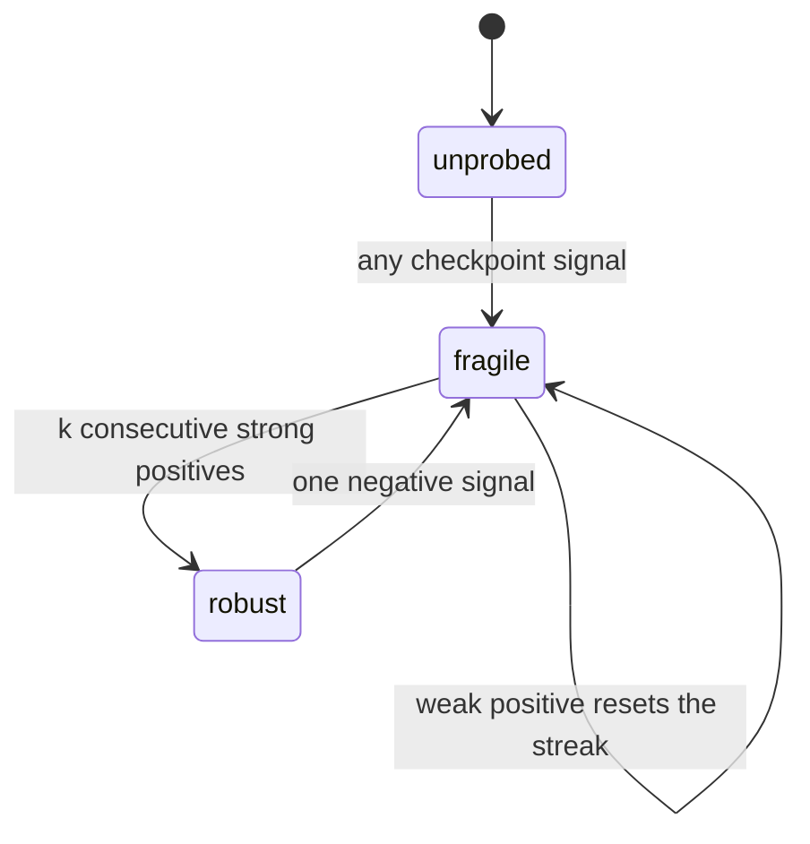
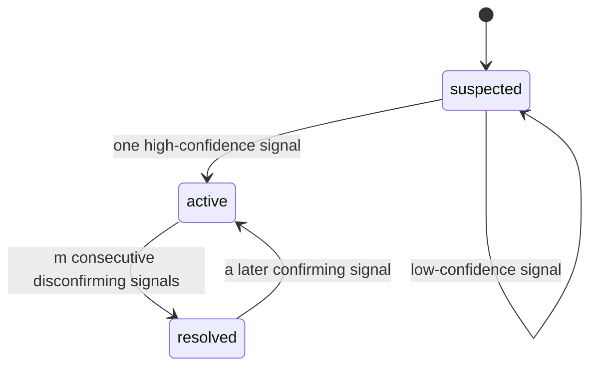
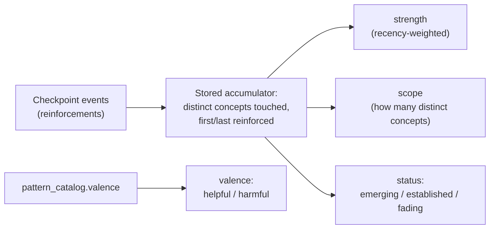

Ba lớp niềm tin được tính từ cùng một **evidence log** (nhật ký bằng chứng): **fragility** (một concept có đứng vững khi bị thử thách hay không), **misconceptions** (học sinh có đang giữ một niềm tin sai cụ thể hay không) và **reasoning patterns** (học sinh có bộc lộ một thói quen suy luận mang tính xuyên suốt hay không). Cả ba đều đọc cùng một luồng quan sát được nhóm theo checkpoint, nhưng mỗi lớp lại rút ra một kiểu khẳng định khác nhau — và engine cố ý đặt cho mỗi lớp một ngưỡng riêng để được phép đưa ra khẳng định đó.

## Cùng một cơ chế, nhưng quy tắc trung thực khác nhau

Cổng thăng cấp của mỗi lớp được quyết định bởi đúng điều mà lớp đó đang khẳng định, chứ không theo một mặc định dùng chung. Fragility khẳng định về **tính nhất quán theo thời gian**, nên trạng thái mạnh nhất của nó chỉ có thể đạt được nhờ lặp lại. Một misconception khẳng định về **một niềm tin sai cụ thể**, mà chỉ một quan sát rõ ràng cũng có thể xác lập, nên nó có thể kích hoạt chỉ từ một tín hiệu có độ tin cậy cao. Một reasoning pattern khẳng định về **một thói quen xuyên suốt**, nên nó cần **độ phủ rộng** — phải được thấy ở nhiều concept khác nhau, chứ không phải lặp đi lặp lại nhiều lần trên một concept duy nhất. Không lớp gộp nào trong ba lớp được phép khẳng định quá mức nếu chưa có đúng loại bằng chứng mà khẳng định của nó đòi hỏi — cũng chính là nguyên tắc nền tảng của câu “một concept chưa được thăm dò thì không bao giờ robust”, chỉ là được áp dụng theo ba cách khác nhau.

| Layer | Điều nó khẳng định | Điều khiến nó được thăng cấp |
|---|---|---|
| Fragility | Concept này vẫn đứng vững qua nhiều lần bị thăm dò | Sự lặp lại — nhiều câu trả lời đúng mạnh, liên tiếp, không cần trợ giúp |
| Misconception | Học sinh đang giữ niềm tin sai cụ thể này | Một quan sát rõ ràng, độ tin cậy cao |
| Reasoning pattern | Học sinh thể hiện thói quen này qua nhiều chủ đề | Độ phủ rộng — pattern xuất hiện trên nhiều concept khác nhau |

## Fragility: đạt tới robust chậm, đánh mất thì nhanh

Fragility đi qua ba trạng thái — `unprobed`, `fragile`, `robust` — bằng một quy trình hai bước. Trước hết, toàn bộ sự kiện của một checkpoint đối với một node được gộp thành một tín hiệu duy nhất: dương tính mạnh (đúng, không cần trợ giúp, độ tin cậy cao), dương tính yếu (đúng nhưng có scaffolding, độ tin cậy thấp hoặc tự sửa được), hoặc âm tính (sai, hoặc có một misconception đang tồn tại). Sau đó, tín hiệu đó điều khiển state machine.

Chỉ một câu trả lời đúng thì không bao giờ đủ để đạt `robust` — ngay cả một lần làm đúng sạch sẽ ngay từ đầu cũng chỉ đưa concept lên `fragile`. `robust` đòi hỏi `k` checkpoint dương tính mạnh liên tiếp, không có âm tính xen giữa (mặc định là 2, và đây là một núm hiệu chỉnh vẫn để mở cho dữ liệu thực tế). Một dương tính yếu sẽ làm chuỗi bị đặt lại. Việc thoái lui được thiết kế để rất nhạy: chỉ một âm tính cũng kéo một concept từ `robust` rơi thẳng về `fragile`, vì một concept từng được cho là vững mà lại thất bại chính là loại tín hiệu rủi ro ẩn mà lớp này được tạo ra để bắt lấy. Chính cách gộp có xét tới scaffolding và độ tin cậy này khiến fragility mang nghĩa “đứng vững khi bị thăm dò”, chứ không chỉ là “cuối cùng cũng làm đúng”.

## Misconceptions: kích hoạt nhanh, giải quyết chậm

Lớp misconception có sự bất đối xứng theo chiều ngược lại. Mỗi tổ hợp `(student, concept, misconception)` đi qua các trạng thái `suspected`, `active`, `resolved`.

Việc kích hoạt diễn ra nhanh và bị chặn bởi độ tin cậy: chỉ một quan sát rõ ràng, có độ tin cậy cao, đã đủ để gọi một misconception là `active`, vì chuyện học sinh thực sự đang giữ một niềm tin sai cụ thể hoàn toàn có thể đúng chỉ từ một khoảnh khắc rõ ràng duy nhất. Một tín hiệu độ tin cậy thấp chỉ lên được tới `suspected` và cần thêm xác nhận. Ngược lại, việc giải quyết thì chậm và đòi hỏi tích lũy — để đi từ `active` sang `resolved`, cần nhiều quan sát phủ định liên tiếp (mặc định là 2), không có quan sát khẳng định nào chen vào giữa; và một quan sát khẳng định xuất hiện sau đó sẽ kích hoạt lại nó với mức nhạy tương tự như cách fragility bị thoái lui.

Sự bất đối xứng này đi thẳng từ cái giá của việc gọi sai theo từng hướng: ở đây, một false positive sẽ làm hỏng chỉ số độ chính xác quan trọng nhất, nên bước kích hoạt phải được canh chặt; còn nếu tuyên bố quá sớm rằng một misconception còn sống đã được giải quyết, thì đó là bỏ mặc một vấn đề thật sự chưa được xử lý, nên bước giải quyết phải bảo thủ. Một instance chỉ được xem là đủ tin cậy để đưa vào báo cáo khi nó vừa là `active` **và** mục catalog mà nó trỏ tới đã được phê duyệt (thay vì vẫn còn là candidate) — hai phép kiểm tra độc lập, và cả hai đều phải đạt.

## Reasoning patterns: lớp niềm tin duy nhất có thể mờ dần

Reasoning patterns được thiết kế để hành xử khác hẳn hai lớp còn lại. Một pattern được định danh theo kiểu xuyên node, trên `(student, pattern)` chứ không theo từng concept; và thay vì lưu trực tiếp một trạng thái, engine chỉ lưu các bộ tích lũy nhỏ — pattern này đã xuất hiện trên những concept riêng biệt nào, và vào lúc nào — rồi mỗi lần đọc mới suy ra lại toàn bộ phần còn lại.

Một pattern được nâng lên `established` nhờ một **breadth gate** (cổng độ phủ rộng) duy nhất — được củng cố qua đủ nhiều checkpoint riêng biệt trải trên đủ nhiều concept riêng biệt — và đó chính là thứ ngăn cả một thói quen hẹp duy nhất lẫn một lần làm bài đa concept đặc biệt phong phú bị hiểu nhầm thành một xu hướng xuyên suốt thật sự. Sau đó, strength và recency chỉ còn dùng để điều khiển dao động `established ↔ fading`.

Việc mờ dần được đo theo **evidence-time** (thời gian bằng chứng), chứ không theo thời gian lịch: “bây giờ” được định nghĩa là checkpoint mới nhất trong log, và một pattern mờ dần theo đơn vị khoảng cách checkpoint khi học sinh làm các việc khác mà không bộc lộ nó. Cách này giúp cùng một evidence log luôn cho ra cùng một câu trả lời khi replay — nếu cho mờ dần theo đồng hồ thực, thì trạng thái suy ra sẽ âm thầm thay đổi ngay cả khi không có bằng chứng mới nào. Một hệ quả được chấp nhận là pattern của một tài khoản ngủ yên sẽ không bao giờ mờ dần, và engine xem điều đó là ổn trong bối cảnh chỉ có một học sinh đang sử dụng tích cực.

Việc một pattern đáng để củng cố hay đáng để ngắt lại — tức **valence** (sắc thái giá trị) của nó, tốt hay hại — được đọc từ trusted catalog entry đã khớp, chứ hoàn toàn không do phép gộp tính ra. Nó tồn tại như một cột thực sự ở phía pattern của catalog mà thôi; một misconception mặc định đã là harmful, nên không cần cột tương đương. Valence là nội dung, không phải mức độ tin cậy, nên một lần catalog re-seed idempotent vẫn được phép cập nhật nó dù trạng thái phê duyệt của catalog thì tuyệt đối không được hạ cấp theo cách đó. Điểm này trở nên quan trọng ngay tại lúc một client thực sự hiển thị pattern cho ai đó xem: chỉ strength và status thôi không thể cho người hướng dẫn biết một pattern đã established là tin tốt hay một vấn đề.

## Những quy tắc mà mọi phép gộp đều phải tuân theo

Một vài bất biến áp dụng xuyên qua cả ba lớp, và chúng tồn tại để ngăn một phép gộp khẳng định nhiều hơn những gì bằng chứng thực sự hỗ trợ.

**Belief có tính bám dính, trừ patterns.** Một checkpoint không tạo ra bằng chứng mới về một belief thì belief đó phải được giữ nguyên đúng như cũ — không bao giờ được coi việc thiếu bằng chứng là bằng chứng cho bất cứ điều gì. Điều này đúng với misconceptions và fragility: một niềm tin sai không tự lành, và một mức nắm bắt mong manh không tự nhiên trở thành vững chắc, nên cả hai đều tồn tại cho tới khi có bằng chứng mới làm thay đổi chúng. Reasoning patterns là ngoại lệ được chủ ý cho phép, vì cường độ hiện tại của một thói quen thật sự phản ánh hành vi gần đây — nên thay vì giữ nguyên trạng thái đã lưu cho tới khi bị tác động, lớp pattern sẽ mờ dần nếu không được củng cố thêm. Đó cũng là lý do model tạo ra quan sát chỉ được phép đọc belief state đã lưu như ngữ cảnh để quyết định nên báo cáo điều gì — chứ không bao giờ được phát lại chính belief state đã lưu đó như một sự kiện mới, vì làm vậy sẽ tính đúp bằng chứng và âm thầm biến một quan sát thành một kết luận.

**Không có bằng chứng thì tuyệt đối không được trông giống một belief dương tính.** Mọi giá trị trong mọi bộ từ vựng belief đều đã mang nghĩa “đã quan sát thấy điều gì đó” — không có từ nào trong cả ba bộ từ vựng mang nghĩa “chưa biết gì cả”. Từng có một vi phạm kiểu này mà vẫn xanh xuyên suốt cả bộ test: phép gộp misconception theo dõi đúng một dấu mốc nội bộ “chưa từng quan sát”, nhưng rồi lại làm sụp nó thành trạng thái thật yếu nhất ở đầu ra, khiến mọi học sinh hoàn toàn mới đều trông như đang bị nghi ngờ nhẹ đối với mọi misconception đã được ghi nhận trong toàn bộ catalog; độ nhiễu tăng theo kích thước catalog chứ không theo bất kỳ điều gì học sinh thật sự đã làm. Bản sửa chữa biến “hoàn toàn không có instance nào” thành một kiểu câu trả lời hạng nhất, có thể phân biệt rõ, để phía đọc có thể bỏ qua hoàn toàn.

**Chỉ phép gộp misconception mới quan tâm tới thứ tự bên trong một checkpoint.** Fragility gộp một checkpoint bằng cách quét xem có âm tính đầu tiên hay không, hoặc nếu không thì đánh dấu dương tính mạnh/yếu — trong cả hai trường hợp đều không phụ thuộc thứ tự. Pattern fold gộp bằng cách lấy độ tin cậy tối đa và hợp tập hợp — cũng không phụ thuộc thứ tự. Misconception fold là ngoại lệ: nó đếm các quan sát phủ định *liên tiếp* để đi tới giải quyết, và sẽ đặt lại khi có bất kỳ quan sát khẳng định nào chen giữa, nên chuỗi thứ tự là điều mang tải ý nghĩa. Cụ thể, một checkpoint mang `[confirm, disconfirm, disconfirm]` sẽ giải quyết misconception, trong khi đúng ba sự kiện ấy nhưng theo thứ tự `[disconfirm, disconfirm, confirm]` thì nó vẫn để misconception ở trạng thái active — khác biệt chính là giữa việc nói với gia sư rằng học sinh đã vượt qua nó, và nói với gia sư rằng vẫn cần tiếp tục can thiệp. Đó cũng chính là lý do mọi bug trong cách sắp thứ tự sự kiện bên trong một checkpoint sẽ lộ ra đầu tiên, và rõ nhất, ở misconception fold.

**Propagation được tính ở lúc đọc, không bao giờ được lưu.** Khi một concept thượng nguồn có một misconception đang active, thì mọi concept phụ thuộc vào nó đều ở trạng thái “at risk” — nhưng sự thật này không bao giờ được ghi lên belief đã lưu của chính concept hạ nguồn đó. Nó được tính lúc đọc, bằng cách đi ngược các liên kết prerequisite lên trên để tìm một belief đang active ở thượng nguồn. Phương án lưu nó trên mọi node hạ nguồn đã bị bác bỏ, vì chỉ cần một liên kết prerequisite mới, hoặc một misconception thượng nguồn mới, là sẽ phải fan-out và viết lại rất nhiều dòng — và khi replay, hệ thống sẽ lại phải tái tạo chính xác đợt fan-out đó. Giữ cho mỗi phép gộp là một hàm sạch của bằng chứng riêng của đúng một concept giúp mọi belief luôn chỉ nằm ở một nơi; việc duyệt đồ thị chỉ dùng để phát hiện một belief đã tồn tại, chứ không bao giờ bịa ra một belief mới.
