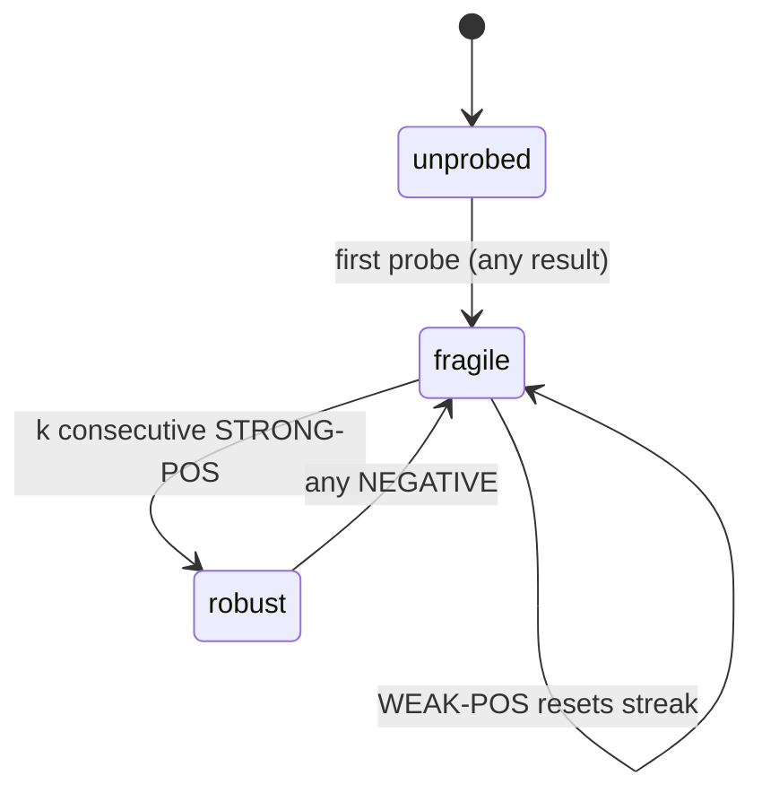
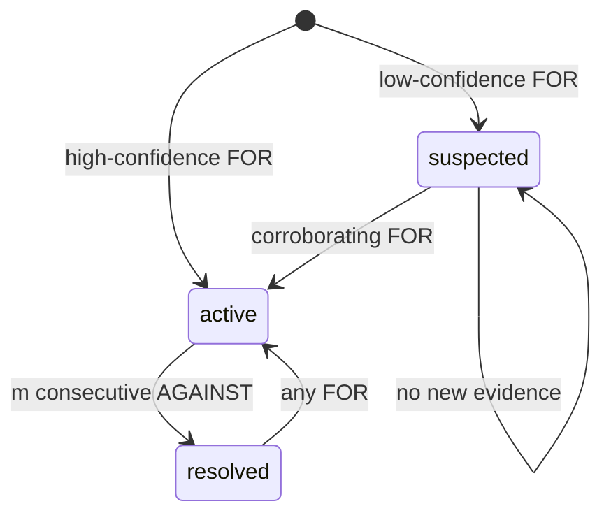
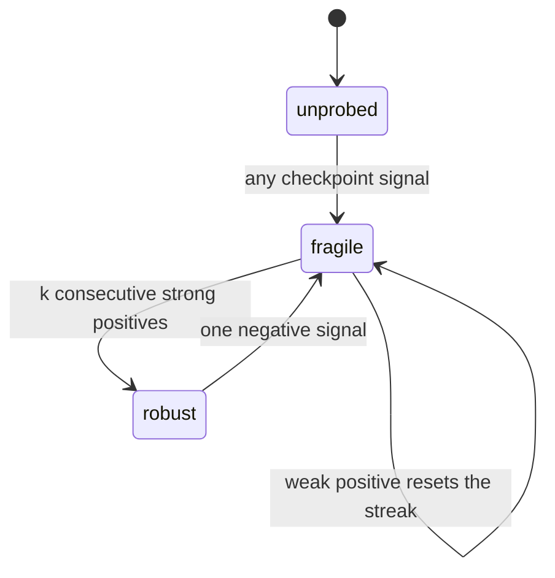
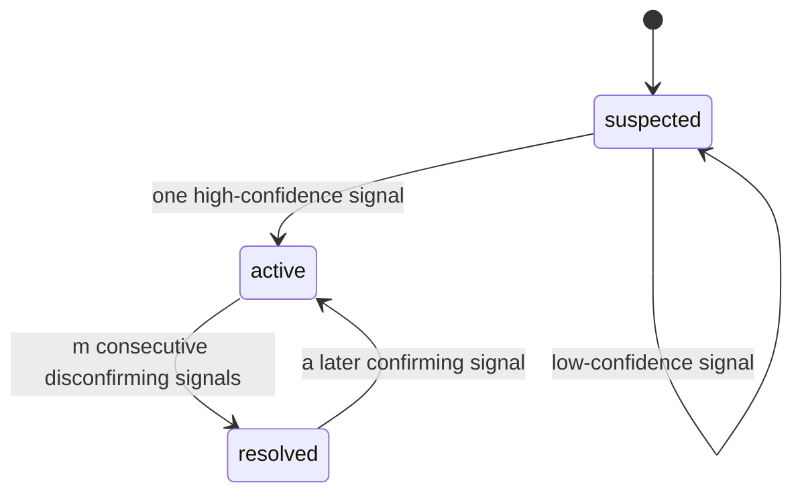
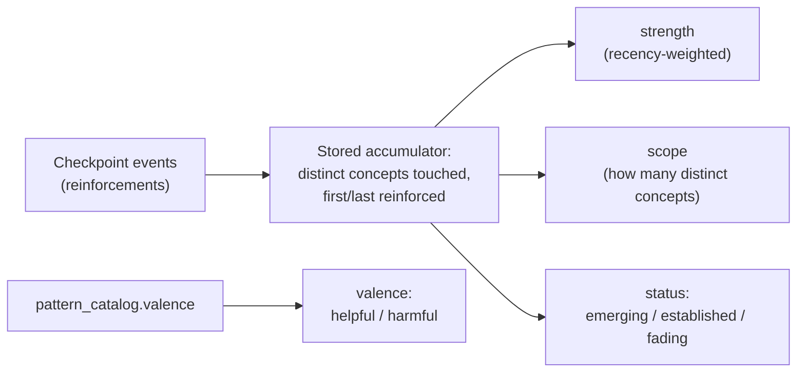

Engine suy ra ba loại niềm tin độc lập từ cùng một evidence log (nhật ký bằng chứng). Mỗi tầng niềm tin có projector (hàm gộp) riêng, state machine (máy trạng thái) riêng và promotion gate (cổng thăng hạng) riêng. Những cổng này khác nhau là có chủ đích: mỗi cổng được định hình theo đúng kiểu khẳng định mà tầng đó đưa ra.

> Hãy xem promotion gate như một quy tắc trung thực: *"Bạn chỉ được phép khẳng định X khi đã có đúng loại bằng chứng mà X đòi hỏi."*

Mỗi fold đều là một **reversible projection** (phép chiếu có thể đảo ngược). Chỉ cần viết lại logic của fold rồi phát lại log là có thể tạo ra trạng thái niềm tin đã được sửa đúng. Các tham số hiệu chỉnh (`k`, `m`, thresholds) được cố ý để mở vì chỉ khi có dữ liệu thực tế mới biết giá trị nào là phù hợp.

## Cách các belief fold hoạt động

Cả ba projector cùng tiêu thụ một event stream (luồng sự kiện) được nhóm theo checkpoint (mốc kiểm tra). Fold xử lý các checkpoint theo thứ tự `(min event ts, checkpoint_id)`, nhờ đó việc replay luôn mang tính xác định.

**Belief có tính bám dính.** Không có bằng chứng không đồng nghĩa với bằng chứng phủ định. Nếu một checkpoint không tạo ra event nào cho một node, niềm tin của node đó giữ nguyên. Analyst đọc trạng thái niềm tin đã lưu làm ngữ cảnh nhưng không bao giờ phát lại nó thành event — nếu làm vậy sẽ đếm bằng chứng hai lần và ghi lại một kết luận thay vì một quan sát. (Reasoning patterns là ngoại lệ có chủ đích: chúng phai dần theo thời gian.)

**Không có bằng chứng → không có instance.** Mọi giá trị trong từ vựng của từng tầng đều đã hàm ý rằng đã có điều gì đó được quan sát. `suspected` nghĩa là một misconception đã được thấy một lần, ở mức yếu. `emerging` nghĩa là một pattern đã được củng cố ít nhất một lần. Trả về bất kỳ trạng thái nào cho một học sinh không có bằng chứng đều là một lời khẳng định, nên fold trả về `null` — không có instance.

---

## Fragility (độ mong manh): tính nhất quán theo thời gian

Fragility theo dõi xem hiểu biết của học sinh có trụ vững qua nhiều lần thăm dò lặp lại hay không. Nó có ba trạng thái: `unprobed`, `fragile` và `robust`.

**Giai đoạn 1 — Gộp tín hiệu của checkpoint.** Fold quét các event của một node trong checkpoint và tạo ra một tín hiệu:
- `STRONG-POS` — đúng, không trợ giúp, độ tin cậy cao.
- `WEAK-POS` — đúng nhưng có scaffold (hỗ trợ đệm), hoặc độ tin cậy thấp, hoặc tự sửa được.
- `NEGATIVE` — sai, hoặc có một misconception đang tồn tại.

`scaffold_stamp` và `confidence` (độ tin cậy) quyết định event rơi vào nhóm nào.

**Giai đoạn 2 — Điều khiển FSM.** Một `NEGATIVE` sẽ lập tức làm `robust → fragile`. Chỉ khi có `k` lần `STRONG-POS` liên tiếp, không bị chèn bởi `NEGATIVE`, mới đạt `robust` (mặc định `k = 2`). Một `WEAK-POS` sẽ đặt lại chuỗi liên tiếp. Một câu trả lời đúng duy nhất không bao giờ đủ để đạt `robust` — ngay cả lần thăm dò đầu tiên hoàn toàn sạch cũng chỉ đi tới `fragile`.

Việc tụt về `fragile` được thiết kế để nhạy có chủ đích. Một khái niệm vốn `robust` mà lại thất bại chính là tín hiệu rủi ro ẩn.

**Vì sao cần lặp lại?** Fragility khẳng định tính nhất quán theo thời gian. Một quan sát duy nhất không thể xác lập điều đó.

**Mù với thứ tự.** Việc gộp tín hiệu ở Giai đoạn 1 của fragility không phụ thuộc thứ tự. Tín hiệu sau khi gộp là như nhau dù các event tới theo thứ tự nào trong một checkpoint.

---

## Misconception (ngộ nhận): một niềm tin sai cụ thể

Projector của misconception suy ra một instance theo từng bộ `(student, node, catalogRef)` thông qua một FSM 3 trạng thái.

**Kích hoạt nhanh, nhưng bị chặn bởi confidence.** Chỉ một `FOR` có confidence cao là đi thẳng tới `active`. Một niềm tin sai có thể được xác lập chỉ từ một quan sát rõ ràng. Một `FOR` confidence thấp sẽ đưa về `suspected` và cần thêm sự củng cố.

**Giải quyết chậm.** `active → resolved` cần `m` lần `AGAINST` liên tiếp mà không có `FOR` chen vào (mặc định `m = 2`). Việc tái kích hoạt khi có `FOR` về sau cũng nhạy tương tự — phản chiếu cách fragility thoái lui.

**Vì sao bất đối xứng?** False positive làm giảm groundedness precision (chỉ số tiêu đề). Giải quyết quá sớm sẽ bỏ mặc một misconception còn đang tồn tại. Chi phí của hai kiểu sai này không hề ngang nhau.

Instance được khóa theo **home node** (node gốc) của mục catalog, chứ không theo surfacing node (node bề mặt), để tránh trùng lặp xuyên node. Nó chỉ được tin cậy ở mức tiêu đề khi vừa `active` vừa có trạng thái catalog là `seeded` hoặc `approved` — hai cổng tin cậy trực giao, được đánh giá ở thời điểm đọc.

**Nhạy với thứ tự.** Khác với fragility, fold của misconception đếm các event `AGAINST` *liên tiếp* để đi tới `resolved`. Vì vậy, thứ tự event trong một checkpoint là điều quan trọng. Một misconception `active` gặp `[FOR, AGAINST, AGAINST]` thì sẽ được giải quyết, còn `[AGAINST, AGAINST, FOR]` thì không. Đây là fold cần kiểm tra đầu tiên bất cứ khi nào cách sắp xếp thứ tự event trong pipeline (chuỗi xử lý) thay đổi.

---

## Reasoning patterns (mẫu hình suy luận): một thói quen xuyên suốt

Projector của pattern là một accumulator (bộ tích lũy) được khóa theo `(student, patternRef)` — xuyên node, khác với hai fold fragility và misconception vốn theo từng node.

Pattern là một xu hướng có trọng số theo độ gần đây. Trạng thái của nó thay đổi theo thời gian ngay cả khi không có bằng chứng mới, nên fold chỉ lưu các bộ tích lũy tối thiểu và suy ra phần hiển thị tại thời điểm đọc.

**Các bộ tích lũy được lưu:**
- Tập các concept node phân biệt mà pattern đã xuất hiện trên đó.
- Điểm reinforcement (củng cố) `(checkpoint, confidence)`.
- Các checkpoint đầu tiên/cuối cùng được reinforcement.

**Được suy ra tại thời điểm đọc:**
- `strength` — có trọng số theo độ gần đây dựa trên khoảng cách checkpoint.
- `scope` — số lượng node phân biệt.
- `status` — `emerging`, `established` hoặc `fading`.
- `valence` — lấy từ mục catalog (`helpful` / `harmful` / null).

**Gộp tín hiệu ở Giai đoạn 1** chỉ reinforcement một pattern nhiều nhất một lần trên mỗi checkpoint: confidence sau khi gộp = max, tập breadth = hợp của mọi concept được tham chiếu trong checkpoint đó.

**Establishment gate** (promotion gate): được reinforcement trên ≥ `d` checkpoint phân biệt, trải trên ≥ `d` concept phân biệt. Điều này ngăn một lần làm bài giàu ngữ cảnh nhưng đơn lẻ, có nhiều concept, bị nâng thành một pattern xuyên suốt. Sau đó, `strength` và độ gần đây mới chi phối chuyển dịch `established ↔ fading`.

**Vì sao cần breadth?** Một reasoning pattern khẳng định một thói quen xuyên suốt. Bằng chứng từ chỉ một concept không thể xác lập điều đó.

**Fading diễn ra theo evidence-time.** "Hiện tại" là checkpoint mới nhất trong log, không phải thời gian đồng hồ. Một pattern phai dần khi học sinh làm các việc khác mà không thể hiện nó. Pattern của một tài khoản ngủ yên sẽ không phai — điều này được chấp nhận cho PoC. Cơ chế phai theo thời gian lịch bị bác bỏ vì sẽ làm trạng thái suy ra trở nên không thể tái lập; nó không thể được đưa vào kiểm tra replay-equality.

**Valence là fold-blind (fold không quan tâm).** Tính hữu ích hay có hại là metadata trực giao của mục catalog. Fold tích lũy pattern mà không quan tâm đó là loại nào. Phần tiêu thụ dữ liệu mới hành động theo valence.

**Pattern không bao giờ resolve.** Chúng chỉ phai dần rồi có thể tái xuất hiện.

---

## Nguyên tắc promotion-gate

Mỗi cổng được quyết định bởi đúng điều mà tầng đó thực sự khẳng định:

| Tầng | Điều được khẳng định | Loại cổng |
|---|---|---|
| Fragility | Giữ được tính nhất quán | Repetition — `k` strong-positive liên tiếp |
| Misconception | Tồn tại một niềm tin sai cụ thể | Confidence — một quan sát confidence cao |
| Pattern | Một thói quen xuyên suốt | Breadth — được thấy trên `d` concept phân biệt |

Ba fold cùng dùng chung cơ chế gộp theo checkpoint nhưng có chủ đích giữ các điều kiện thăng hạng khác nhau. Một tầng không được phép khẳng định quá mức khi chưa có đúng loại bằng chứng mà điều nó khẳng định đòi hỏi.

---

## Lan truyền được tính khi đọc, không lưu trữ

Một misconception ở gốc ảnh hưởng tới mọi concept phía hạ lưu sẽ **không được lưu trên các node hạ lưu**. Belief projector chỉ ghi các sự kiện cục bộ, theo từng node. Góc nhìn "node hạ lưu này đang có rủi ro vì một misconception ở thượng nguồn" được tính tại thời điểm đọc bằng cách lần ngược các cạnh prerequisite lên trên.

Phương án bị loại bỏ — hiện thực hóa sự lan truyền lên các node hạ lưu — bị bác bỏ vì chỉ cần một cạnh mới hoặc một misconception thượng nguồn mới là phải fan-out (lan tỏa hàng loạt) và ghi lại rất nhiều hàng. Replay khi đó cũng phải tái tạo chính xác fan-out ấy. Giữ projector theo từng node giúp mỗi fold vẫn là một hàm xác định, gọn gàng.

Ba tầng niềm tin được tính từ cùng một evidence log: **fragility** (một concept có trụ vững khi bị ép kiểm tra hay không), **misconceptions** (học sinh có giữ một niềm tin sai cụ thể hay không) và **reasoning patterns** (học sinh có thể hiện một thói quen xuyên suốt hay không). Cả ba cùng đọc một luồng quan sát được nhóm theo checkpoint, nhưng mỗi tầng suy ra một kiểu khẳng định khác nhau — và engine cố ý đặt cho mỗi tầng một ngưỡng khác nhau để được phép đưa ra khẳng định đó.

## Cùng một cơ chế, nhưng khác quy tắc trung thực

Promotion gate của mỗi tầng được định hình bởi đúng điều mà tầng đó thực sự khẳng định, chứ không theo một mặc định dùng chung. Fragility khẳng định **tính nhất quán theo thời gian**, nên trạng thái mạnh nhất của nó chỉ đạt được nhờ sự lặp lại. Một misconception khẳng định **một niềm tin sai cụ thể**, mà một quan sát rõ ràng đã có thể xác lập, nên nó có thể kích hoạt chỉ từ một tín hiệu confidence cao. Một reasoning pattern khẳng định **một thói quen xuyên suốt**, nên nó cần **breadth** — phải xuất hiện trên nhiều concept khác nhau, chứ không phải lặp đi lặp lại nhiều lần trên một concept. Không fold nào trong ba fold được phép khẳng định quá mức khi chưa có đúng loại bằng chứng mà điều nó khẳng định đòi hỏi — cùng một nguyên tắc nền tảng với câu "một concept chưa từng được thăm dò thì không bao giờ là robust", chỉ là được áp dụng theo ba cách khác nhau.

| Tầng | Điều nó khẳng định | Điều khiến nó được thăng hạng |
|---|---|---|
| Fragility | Concept này trụ vững qua nhiều lần bị thăm dò | Repetition — nhiều câu trả lời đúng mạnh, liên tiếp, không cần trợ giúp |
| Misconception | Học sinh giữ niềm tin sai cụ thể này | Một quan sát rõ ràng, confidence cao |
| Reasoning pattern | Học sinh thể hiện thói quen này qua nhiều chủ đề | Breadth — pattern xuất hiện trên nhiều concept phân biệt |

## Fragility: đạt `robust` chậm, mất đi thì nhanh

Fragility đi qua ba trạng thái — `unprobed`, `fragile`, `robust` — bằng một quy trình hai giai đoạn. Trước hết, các event của một node trong mỗi checkpoint được gộp thành một tín hiệu: positive mạnh (đúng, không trợ giúp, confidence cao), positive yếu (đúng nhưng có scaffold, confidence thấp hoặc tự sửa được), hoặc negative (sai, hoặc có một misconception đang tồn tại). Sau đó, tín hiệu đó điều khiển state machine.

Một câu trả lời đúng duy nhất không bao giờ đủ để đạt `robust` — ngay cả lần thử đầu tiên hoàn toàn sạch cũng chỉ đạt `fragile`. `robust` đòi hỏi `k` checkpoint strong-positive liên tiếp mà không có negative chen vào giữa (mặc định là 2, và đây là một tham số hiệu chỉnh còn để mở cho dữ liệu thực). Một positive yếu sẽ đặt lại chuỗi liên tiếp. Việc thoái lui được thiết kế để cực kỳ nhạy: chỉ một negative là đủ kéo một concept `robust` rơi thẳng về `fragile`, vì một concept từng được cho là vững mà sau đó lại thất bại chính là tín hiệu rủi ro ẩn mà tầng này tồn tại để bắt lấy. Chính cách gộp tín hiệu có xét đến scaffold và confidence này khiến fragility mang nghĩa "trụ vững khi bị thăm dò", chứ không chỉ là "cuối cùng cũng làm đúng".

## Misconceptions: kích hoạt nhanh, giải quyết chậm

Tầng misconception là một dạng bất đối xứng ngược lại. Mỗi tổ hợp `(student, concept, misconception)` đi qua `suspected`, `active`, `resolved`.

Việc kích hoạt diễn ra nhanh và bị chặn bởi confidence: một quan sát rõ ràng, confidence cao là đủ để gọi một misconception là `active`, vì việc học sinh giữ một niềm tin sai cụ thể hoàn toàn có thể đúng chỉ từ một khoảnh khắc rõ ràng duy nhất. Một tín hiệu confidence thấp chỉ đạt tới `suspected` và cần thêm xác nhận. Ngược lại, việc giải quyết diễn ra chậm và cần sự tích lũy — để đi từ `active` sang `resolved` cần nhiều quan sát phủ định liên tiếp (mặc định là 2) mà không có gì xác nhận chen vào giữa; và nếu về sau lại xuất hiện một quan sát xác nhận, nó sẽ tái kích hoạt cũng nhạy không kém cách fragility thoái lui.

Sự bất đối xứng này đi thẳng từ cái giá của việc gọi sai theo mỗi hướng: false positive ở đây sẽ làm hỏng chỉ số độ chính xác tiêu đề, nên việc kích hoạt được canh gác chặt; còn nếu tuyên bố một misconception còn sống đã được giải quyết quá sớm thì sẽ bỏ rơi một vấn đề thật vẫn chưa được xử lý, nên việc giải quyết phải bảo thủ. Một instance chỉ được xem là đủ đáng tin để báo cáo khi nó đang `active` **và** mục catalog mà nó trỏ tới đã được phê duyệt (thay vì vẫn chỉ là ứng viên) — hai kiểm tra độc lập đều phải vượt qua.

## Reasoning patterns: tầng niềm tin duy nhất có thể phai dần

Reasoning patterns được thiết kế để hành xử khác hai tầng còn lại. Một pattern được khóa xuyên node, theo `(student, pattern)` chứ không theo từng concept; và thay vì lưu trực tiếp trạng thái, engine chỉ lưu các bộ tích lũy nhỏ — pattern đã xuất hiện trên những concept phân biệt nào, và vào lúc nào — rồi suy ra mọi thứ khác mới tinh mỗi lần đọc.

Một pattern được nâng lên `established` bằng một **breadth gate** duy nhất — được reinforcement trên đủ số checkpoint phân biệt và trải trên đủ số concept phân biệt — và chính điều này ngăn cả một thói quen hẹp đơn lẻ lẫn một lần làm bài nhiều concept nhưng bất thường khỏi bị nhầm thành một xu hướng xuyên suốt thật sự. Sau đó, `strength` và độ gần đây chỉ còn chi phối nhịp dao động `established ↔ fading` về sau.

Fading được đo theo **evidence-time**, không theo thời gian lịch: "hiện tại" được định nghĩa là checkpoint mới nhất của log, và một pattern phai dần theo đơn vị khoảng cách checkpoint khi học sinh làm việc khác mà không thể hiện nó. Cách này đảm bảo cùng một evidence log luôn cho ra cùng một kết quả khi replay — nếu phai theo đồng hồ thực, trạng thái suy ra sẽ âm thầm đổi dù không hề có bằng chứng mới. Một hệ quả được chấp nhận: pattern của tài khoản ngủ yên sẽ không bao giờ phai, và với engine điều đó là chấp nhận được cho một học sinh đơn lẻ đang sử dụng chủ động.

Việc một pattern đáng để củng cố hay đáng để ngắt lại — tức **valence** của nó, hữu ích hay có hại — được đọc từ mục catalog đáng tin đã khớp, chứ hoàn toàn không do fold tính ra. Nó tồn tại như một cột thực sự ở phía pattern của catalog; còn misconception thì mặc định là harmful theo định nghĩa, nên không cần cột tương ứng. Valence là nội dung, không phải độ tin cậy, nên một lần re-seed catalog theo kiểu idempotent được phép cập nhật nó dù trạng thái phê duyệt của catalog tuyệt đối không được hạ cấp theo cách đó. Điều này quan trọng ở đúng thời điểm client thực sự hiển thị một pattern cho ai đó: chỉ `strength` và `status` thôi không thể cho người hướng dẫn biết một pattern đã `established` là tin vui hay là vấn đề.

## Những quy tắc mọi fold đều phải tuân theo

Có một vài bất biến áp dụng xuyên suốt cả ba tầng, và chúng tồn tại để ngăn fold khẳng định nhiều hơn những gì bằng chứng thực sự hỗ trợ.

**Belief có tính bám dính, trừ pattern.** Một checkpoint không tạo ra bằng chứng mới về một belief thì để nguyên belief đó như cũ — sự vắng mặt của bằng chứng không bao giờ bị xem là bằng chứng của bất kỳ điều gì. Điều này đúng với misconception và fragility: một niềm tin sai không tự lành lại, và một mức nắm vững mong manh cũng không tự nhiên trở nên vững chắc, nên cả hai cùng tồn tại cho đến khi bằng chứng mới làm chúng đổi trạng thái. Reasoning patterns là ngoại lệ có chủ đích, vì sức mạnh hiện thời của một thói quen thật sự phản ánh hành vi gần đây — nên thay vì giữ nguyên trạng thái lưu trữ cho đến khi có tác động, tầng pattern sẽ phai khi không được reinforcement. Đây cũng là lý do mô hình tạo ra quan sát chỉ được phép đọc trạng thái niềm tin đã lưu làm ngữ cảnh để quyết định nên báo cáo điều gì — tuyệt đối không được phát lại chính trạng thái đã lưu đó thành một event mới, vì làm thế sẽ đếm bằng chứng hai lần và lặng lẽ biến một quan sát thành một kết luận.

**Không có bằng chứng thì tuyệt đối không được trông như một belief dương tính.** Mọi giá trị trong mọi bộ từ vựng belief đều đã mang nghĩa "đã quan sát thấy điều gì đó" — không có từ nào trong cả ba bộ từ vựng mang nghĩa "chưa biết gì cả". Điều này từng bị vi phạm theo một cách vẫn qua xanh cả bộ test: fold của misconception theo dõi đúng một dấu mốc nội bộ "chưa từng quan sát", nhưng khi xuất kết quả lại ép nó về trạng thái thật yếu nhất, khiến mọi học sinh hoàn toàn mới đều trông như đang bị nghi ngờ nhẹ về mọi misconception đã được ghi trong catalog, với mức nhiễu tăng theo kích thước catalog chứ không liên quan gì đến việc học sinh đó đã thực sự làm gì. Bản sửa biến "hoàn toàn không có instance" thành một câu trả lời hạng nhất, có thể phân biệt rõ ràng để phía đọc bỏ qua hoàn toàn.

**Chỉ fold của misconception quan tâm tới thứ tự bên trong một checkpoint.** Fragility gộp một checkpoint bằng cách quét để tìm tín hiệu negative đầu tiên, hoặc nếu không thì đánh dấu positive mạnh/yếu — theo cách nào cũng không phụ thuộc thứ tự. Fold của pattern gộp bằng cách lấy confidence lớn nhất và hợp các tập — cũng không phụ thuộc thứ tự. Fold của misconception là ngoại lệ: nó đếm các quan sát phủ định *liên tiếp* để đi tới giải quyết, và sẽ đặt lại nếu có bất kỳ quan sát xác nhận nào xen giữa, nên chuỗi thứ tự thực sự gánh nghĩa. Cụ thể, một checkpoint mang `[confirm, disconfirm, disconfirm]` sẽ giải quyết misconception, còn đúng ba event đó nhưng theo thứ tự `[disconfirm, disconfirm, confirm]` thì vẫn để nó `active` — tức khác biệt giữa việc nói với gia sư rằng học sinh đã vượt qua nó và nói rằng gia sư vẫn nên tiếp tục can thiệp. Đó chính là lý do bất kỳ lỗi nào trong cách sắp xếp event bên trong một checkpoint sẽ lộ ra đầu tiên, và rõ nhất, ở fold của misconception.

**Propagation được tính khi đọc, không bao giờ lưu trữ.** Khi một concept thượng nguồn có misconception đang `active`, mọi concept phụ thuộc vào nó đều "có rủi ro" — nhưng thực tế này không bao giờ được ghi vào belief đã lưu của chính concept hạ lưu đó. Nó được tính khi đọc, bằng cách lần ngược các liên kết prerequisite lên trên để tìm một belief đang `active` ở thượng nguồn. Phương án ghi nó lên mọi node hạ lưu đã bị bác bỏ vì chỉ cần thêm một liên kết prerequisite mới, hoặc một misconception thượng nguồn mới, là phải fan-out và ghi lại rất nhiều hàng — và khi replay cũng phải tái tạo chính xác fan-out đó. Giữ mỗi fold như một hàm sạch của riêng bằng chứng thuộc về một concept giúp mọi belief chỉ nằm ở đúng một chỗ; việc duyệt đồ thị chỉ khám phá ra một belief đã tồn tại, chứ không bao giờ phát minh ra một belief mới.
