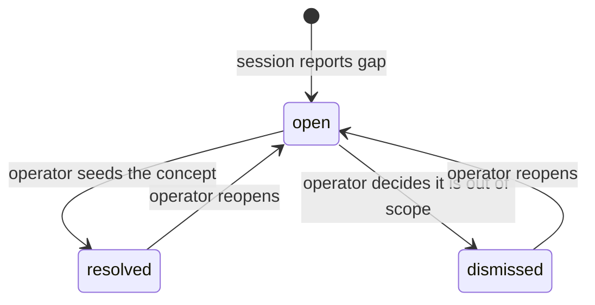
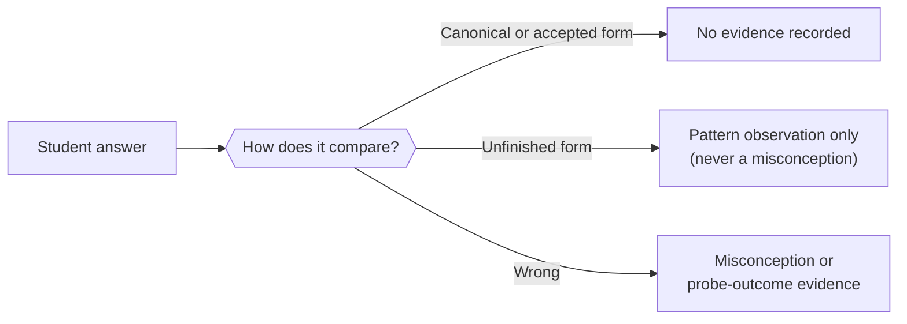

Một tutoring session (phiên kèm học) cần biết những khái niệm nào "nằm trong phạm vi". Nghe có vẻ đơn giản, nhưng nó đụng tới ba ràng buộc khó: slug là thứ có thể đổi được, chỉ `core/module.ts` mới được phép resolve node id sang slug, và một session gặp phải khái niệm chưa được seed thì không có chỗ nào để ghi lại lần bỏ sót đó. Trang này giải thích cách hệ thống giải quyết những vấn đề ấy.

## Study anchor (ADR-037)

Một **study anchor** (mốc học tập) là một thực thể do engine sở hữu, dùng để giữ tập các concept node (nút khái niệm) cho một đơn vị học liệu. Nó nằm trong hai bảng:
- `engine.study_anchors` — khóa tự nhiên dễ đọc của anchor và một nhãn.
- `engine.study_anchor_nodes` — các hàng thành viên dưới dạng **uuid foreign key** trỏ tới `engine.nodes`.

Vì slug có thể thay đổi, anchor lưu uuid chứ không lưu tên. Khi đọc anchor, hệ thống sẽ forward-resolve từng uuid đã lưu qua merge map rồi sang slug **hiện tại**, nên một thành viên có node đã bị merge đi vẫn sẽ được phục vụ dưới tên của node còn sống.

Cách làm dựa trên file anchor là phương án thay thế dễ thấy nhất, nhưng bị loại vì hai lý do: slug có thể đổi nên một file chứa tên sẽ bị lệch sau mỗi lần đổi tên; và chỉ `core/module.ts` mới được phép resolve id sang slug nên file đó cũng không thể được đọc ở nơi khác.

### Thao tác ghi

Có hai thao tác ghi, và không thao tác nào mang tên `seed*` — trong engine này, động từ `seed*` luôn mang nghĩa upsert tăng dần, chỉ thêm vào, tức đúng ngược lại với cách ghi của anchor.

- **Create:** tạo anchor và throw nếu id đã tồn tại. Hàng anchor và các thành viên của nó được ghi trong cùng một CTE nguyên tử, nên nếu lỗi một phần thì cả hai cùng rollback.
- **Set members:** thao tác ghi thay thế toàn bộ, thay trọn tập thành viên hiện có. Đây cũng là điểm kết thúc của báo cáo về unseeded concept từ một session — sau khi operator seed các node còn thiếu, anchor sẽ được cập nhật.

Việc chỉnh lại tập thành viên không phải ngoại lệ hiếm gặp. Đó là con đường bình thường để duy trì một anchor qua nhiều lần ingestion.

### Hành vi khi đọc

`getStudyAnchor(id, lang)` sẽ fallback từ locale được yêu cầu sang tiếng Anh, rồi sang raw slug, thay vì throw khi thiếu bản dịch. Bên gọi sẽ không bao giờ nhận lỗi chỉ vì một node nào đó chưa được dịch xong.

`getStudyAnchor` sẽ throw nếu anchor id được đưa vào không tồn tại, thay vì gộp trường hợp đó vào cùng kiểu phản hồi thành viên rỗng vốn được trả về cho một anchor trống hợp lệ. Nếu coi anchor không tồn tại giống hệt anchor rỗng thì lỗi của bên gọi sẽ bị che mất.

### Không có thao tác liệt kê

Không có thao tác liệt kê anchor trên bất kỳ bề mặt nào. Anchor chỉ được đọc bằng id mà bên gọi đã được cấp. Nếu cho phép liệt kê toàn bộ anchor thì chỉ cần một số ít lời gọi là có thể ráp lại được cả graph.

### Cách anchor id đi vào evidence

`append_evidence` nhận một tham số tùy chọn `briefSnapshotId` rõ ràng — không phải giá trị config được tiêm vào. Lý do là hiện không có subsystem theo dõi session nào để resolve "anchor đang có hiệu lực" từ config: khác với student id hay display language (những thứ không đổi trong một tiến trình MCP nhất định), anchor nào đang được dùng lại thay đổi theo từng session và từng checkpoint.

## Theo dõi concept gap (ADR-038)

Khi một session gặp một khái niệm mà chưa ai seed, nó phải ghi lại sự thiếu sót đó — nếu không, tín hiệu cho biết việc seeding còn thiếu sẽ biến mất ngay khi session kết thúc.

**Kênh sẵn có trước đây không phục vụ được nhu cầu này.** `propose_catalog_candidate` đòi hỏi phải có home node slug resolve được. Một khái niệm chưa có node thì thậm chí không thể làm home của một proposal. Kênh duy nhất đang có từ session sang operator về mặt cấu trúc lại đóng kín đúng với trường hợp này.

ADR-038 thêm `engine.concept_gaps`: mỗi báo cáo là một hàng, mang foreign key tới anchor đang thiếu, khái niệm được lưu dưới dạng free text, và một status để operator chuyển trạng thái.

`resolved` và `dismissed` phải được giữ tách biệt — một lần seed thiếu thật sự và một khái niệm được cố ý giữ ngoài phạm vi là hai phép đo khác nhau.

**Tần suất của các báo cáo này là phép đo duy nhất cho biết việc seeding tốt đến đâu.** Đó chính là lý do đã nêu để không đặt việc tạo node lên session path. Nếu không có nơi đích, tín hiệu mà thiết kế đã bỏ công tạo ra sẽ bị mất.

Hai giới hạn là vốn có và được chấp nhận:
- Không có gì kiểm tra được rằng một session *thực sự có báo* một gap hay không, nên số đếm chỉ là cận dưới.
- Vì khái niệm được lưu ở dạng free text, bảng này đếm số báo cáo chứ không đếm số khái niệm.

### An toàn khi có đồng thời

Các lần chuyển status của concept gap dùng compare-and-swap guard: `UPDATE ... WHERE id = $1 AND status = $3`. Nếu thiếu guard này, hai lần chuyển trạng thái đồng thời trên cùng một gap có thể âm thầm ghi đè lẫn nhau. Khi guard báo xung đột (không có hàng nào khớp), thao tác sẽ throw thay vì trả về một view thành công giả tạo.

`listConceptGaps` coi bộ lọc tường minh `statuses: []` là không khớp gì cả, khác với trường hợp bỏ hẳn bộ lọc. Một mảng rỗng được truyền vào với ý nghĩa "không muốn kết quả nào" thì không được trả về toàn bộ gap.

## Answer contract cho assignment brief

Một **brief** (bản tóm lược) là tập sự kiện mà Analyst (mô-đun phân tích) cần biết về một bài tập tại thời điểm session chạy. Nó ghi lại đáp án đúng là gì và các đáp án đó liên hệ với nhau ra sao — chứ không ghi cách dạy.

### Accepted và unfinished answers

Trường answer của một brief phân biệt hai kiểu "đúng về mặt kỹ thuật":

- **Dạng `accepted`** — tương đương về mặt toán học với đáp án chuẩn (ví dụ `2/4` so với `1/2`). Nếu khớp với dạng accepted thì không ghi evidence nào.
- **Dạng `unfinished`** — đúng nhưng còn thiếu một bước bắt buộc (ví dụ chỉ cho một nghiệm trong khi bài toán có hai nghiệm). Nếu khớp với dạng unfinished thì cùng lắm chỉ ghi một pattern observation (quan sát về mẫu hình thói quen còn dang dở), tuyệt đối không ghi misconception.

Nếu gộp cả hai vào cùng một phán đoán, hệ thống có nguy cơ ghi "không hiểu khái niệm" vào một evidence log chỉ ghi thêm cho một học sinh thực ra chỉ thiếu đúng một bước. Phân biệt này cũng tổng quát được: trong Vật lý, sai đơn vị là misconception; sai chữ số có nghĩa lại là "unfinished" — cùng một bề mặt lỗi, nhưng trọng lượng bằng chứng trái ngược.

### Khả năng kiểm tra bằng CAS theo từng đáp án

Không phải đáp án nào cũng kiểm tra được bằng computer algebra system (hệ đại số máy tính, CAS) — `AD ⊥ BC` thì không; `x = ±√2` thì có. Ở bước ingestion, hệ thống khai báo một `answerKind` cho từng đáp án (`value` / `expression` / `set` / `inequality` thì đủ điều kiện dùng CAS; `geometric-relation` / `description` / `proof` thì không).

Tại thời điểm session, Analyst đọc `kind` như dữ liệu, chứ không phải như chỉ thị phải gọi công cụ nào. Một đáp án có hình dạng expression cho biết *có thể* kiểm tra; một đáp án có hình dạng câu chữ cho biết là không thể. Brief nói đáp án là gì; còn mỗi logic sư phạm sẽ tự quyết định phải làm gì với hình dạng đó.

### Phụ thuộc giữa các bài

Một bài trong brief có thể khai báo `dependsOn`: các bài trước đó mà kết quả của nó dựa vào. Điều này ngăn việc đếm trùng: nếu lỗi ở bài 3 chỉ là hệ quả từ việc làm sai bài 2, thì không có misconception mới nào ở bài 3 cả.

Nó cũng định hình thứ tự của buổi review session — Guide (mô-đun hướng dẫn) có thể hỏi "em có nghĩ đáp án bài 3 của mình đúng không?" thay vì đi từng bài theo thứ tự trên trang. Nếu học sinh tự sửa được dưới cú gợi mở đó, bằng chứng ấy mạnh hơn nhiều so với việc bị sửa trực tiếp.

### Rủi ro đã biết: answer key sai

Ngay cả sau bước xác minh giải hai lần với CAS và review của operator, answer key của một brief vẫn có thể sai. Hiện chưa có kênh nào để một session báo ngược điều này trở lại. Một học sinh trả lời đúng có thể bị ghi nhận là sai trong nhật ký chỉ ghi thêm, và sự lệch đó biến mất khi session kết thúc.

Đây đã được ghi nhận là một mục backlog. Cách sửa tự nhiên nhất sẽ phản chiếu kênh concept gap (một hàng do session nộp, với phán quyết của operator có thể chỉnh lại). Nó đang được hoãn vì workflow ingestion khiến trường hợp này hiếm, nên rủi ro được xem là phần dư.

### Quyền giữ answer key

Trong PoC dùng file bundle, answer key đi cùng brief đến tận phía học sinh. Khi đó điều này được chấp nhận vì chưa có server để giữ lại key. Khi Student app tồn tại, key sẽ được giữ ở phía server — phục vụ trong cùng tiến trình cho tutor module, chứ không đưa ra bề mặt dành cho học sinh.

Lý do chấp nhận tách như vậy là **chất lượng bằng chứng, không phải bảo mật**: nếu học sinh đọc được answer key, một đáp án đúng sẽ trở nên mơ hồ giữa "tự giải ra" và "đã nhìn đáp án", và mọi `probe_outcome` đều suy yếu. Cái giá chấp nhận là Guide giờ giữ key ngay trong context của chính nó, nên nếu hàng rào bảo vệ thất bại thì key có thể rò qua hội thoại.

Ở đây có hai mối quan tâm gặp nhau: engine cần nói cho một session model biết những khái niệm nào nằm trong phạm vi của một đơn vị học tập nhất định, và session model cũng cần biết một đáp án đúng trông như thế nào đối với một bài cụ thể. Cả hai đều là authored artifact (hiện vật do con người biên soạn) — không được tính ra từ evidence log — nhưng cả hai lại nuôi evidence log theo những cách rất cụ thể, nên chúng được engine quản lý thay vì nằm trong các file đứng riêng.

## Study anchor là gì

Study anchor là danh sách các cặp `{ slug, displayName }` đại diện cho những khái niệm mà một đơn vị học tập đã được chuẩn bị sẵn bao phủ. Nhờ đó, session model biết được những concept slug nào tồn tại cho học liệu đang xét, mà không cần bất kỳ thao tác liệt kê nào trên concept graph.

Engine lưu một anchor trong hai bảng:

- `engine.study_anchors` — mỗi anchor một hàng, với khóa tự nhiên dễ đọc và một nhãn.
- `engine.study_anchor_nodes` — thành viên được lưu dưới dạng **uuid foreign key** trỏ tới `engine.nodes`.

Vì slug là một display key có thể thay đổi, anchor không thể lưu trần tên slug — nếu làm vậy, mỗi lần đổi tên khái niệm sẽ làm các thành viên bị mồ côi. Và vì chỉ `core/module.ts` mới được phép biến node id thành current slug, nên một anchor lưu id không thể sống ngoài engine. Phương án hiển nhiên là file do operator quản lý thất bại ở cả hai điểm.

Khi đọc một anchor, hệ thống forward-resolve từng uuid đã lưu qua merge map, rồi ánh xạ từng live id sang current slug của nó. Một thành viên có khái niệm về sau bị merge vào khái niệm khác sẽ tự được phục vụ dưới tên của node còn sống, không cần cập nhật tay.

### Create so với replace members

Bề mặt ghi của anchor gồm hai thao tác được tách biệt rõ ràng, chứ không phải một upsert idempotent duy nhất:

- **Create** — ghi hàng anchor và các hàng thành viên ban đầu của nó trong một câu lệnh nguyên tử, và throw nếu đã có anchor mang id đó. Vì cả hai lần ghi diễn ra trong cùng một CTE, bất kỳ lỗi nào khi chèn thành viên (trùng node id hoặc vi phạm foreign key) cũng sẽ rollback luôn hàng anchor.
- **Replace members** — thao tác ghi toàn trạng thái, thay hẳn tập thành viên hiện tại.

Thao tác ghi này không mang tên `seed*`, vì mọi thao tác `seed*` trong engine này đều là upsert tăng dần, idempotent, vào một tập mở đang lớn dần lên. Còn anchor là một danh sách đóng, được ghi cả khối — mượn cùng động từ đó sẽ âm thầm đánh lừa bất kỳ bên gọi nào đã quen rằng `seedNode` lúc nào cũng là thao tác cộng thêm.

Trước khi ghi, các member id đã resolve sẽ được khử trùng lặp — vì vậy nếu bên gọi truyền cùng một concept slug hai lần (có thể một lần bằng alias slug và một lần bằng slug còn sống), kết quả vẫn chỉ là một hàng thành viên, chứ không thành lỗi duplicate key.

### `getStudyAnchor` xử lý các trường hợp biên ra sao

Có hai hành vi cần biết trước khi gọi:

- **Anchor id không tồn tại sẽ gây throw**, chứ không trả về danh sách thành viên rỗng. Repository báo hiệu "không có anchor ở id này" theo cách khác với "anchor có tồn tại nhưng có 0 thành viên", vì nếu gộp cả hai vào cùng một phản hồi rỗng thì lỗi của bên gọi sẽ bị che khuất.
- **Thiếu bản dịch sẽ không bao giờ gây throw.** Khi resolve `displayName` của từng thành viên, engine fallback từ locale được yêu cầu sang tiếng Anh, rồi sang raw slug, thay vì làm hỏng toàn bộ lần đọc chỉ vì một node thiếu bản dịch ở ngôn ngữ được yêu cầu. Một anchor mới dịch dở dang vẫn đọc được sạch sẽ; chỉ thành viên chưa dịch mới fallback, không phải cả lời gọi.

## Cách anchor id đi vào evidence log

Khi một session chạy dưới một study anchor cụ thể, id của anchor đó sẽ được ghi lên các hàng evidence của từng checkpoint trong cột `brief_snapshot_id`. Nhờ vậy, mọi lần đọc audit evidence về sau đều có một liên kết bền vững quay về đúng anchor đã có hiệu lực lúc các quan sát được tạo ra.

Anchor id đi vào `append_evidence` dưới dạng **tham số tường minh do bên gọi cung cấp** — Analyst truyền nó trong từng lần gọi. Nó không đi theo kiểu tiêm config như student id hay display language (những thứ ổn định suốt vòng đời của một tiến trình MCP đơn lẻ và có thể nướng sẵn từ lúc khởi động). Anchor nào đang "có hiệu lực" có thể thay đổi theo từng session hoặc từng checkpoint, nên kiểu tiêm config không áp dụng được ở đây.

`brief_snapshot_id` là một cột nullable. Một checkpoint được append khi không có anchor nào đang có hiệu lực sẽ lưu `null`, y như trước khi dây nối này được thêm vào. Cột này đã có sẵn trong lược đồ từ công việc trước đó — mọi phần plumbing đều đã tồn tại — nhưng mọi checkpoint vẫn lưu `null` vì giá trị này chưa từng thực sự được luồn qua đường gọi cho đến khi được nối vào một cách tường minh.

## Answer key của brief chứa những gì

Assignment brief là tài liệu do con người biên soạn, ghi lại cho từng bài toán biết đáp án đúng là gì và session review nên diễn giải câu trả lời của học sinh ra sao.

Cấu trúc answer không chỉ nói giá trị mong đợi. Nó còn phân biệt hai nhóm câu trả lời đúng nhưng không ở dạng chuẩn:

- **Accepted forms** — tương đương về mặt toán học với đáp án chuẩn. Ví dụ, `2/4` và `1/2` là cùng một số; một học sinh viết dạng chưa rút gọn thì đơn giản là chưa sai. Khớp với một accepted form sẽ không ghi bất kỳ evidence nào — đó vẫn là cùng một đáp án.
- **Unfinished forms** — đúng về mặt kỹ thuật nhưng còn thiếu một bước bắt buộc. Ví dụ, chỉ cho một nghiệm của phương trình bậc hai có hai nghiệm, hoặc để phân số chưa rút gọn trong khi đề bài yêu cầu dạng tối giản. Một lần khớp unfinished cùng lắm chỉ ghi một pattern observation (thói quen dừng sớm), tuyệt đối không ghi misconception.

Cách tách này ngăn một vấn đề rất cụ thể về chất lượng evidence: nếu dồn tất cả vào một phán đoán duy nhất, hệ thống có thể ghi "không hiểu khái niệm" vào một nhật ký chỉ ghi thêm cho một học sinh thực ra chỉ còn thiếu đúng một bước để hoàn tất. Cùng một hình dạng đó xuất hiện ở nhiều môn — trong Vật lý, sai đơn vị là một misconception thật sự, còn sai chữ số có nghĩa lại thuộc đúng lớp "unfinished" như phân số chưa rút gọn, dù bề mặt lỗi trông giống nhau.

### Việc có áp dụng CAS-checking hay không là một sự kiện, không phải chỉ thị runtime

Không phải đáp án nào cũng kiểm tra được bằng computer algebra system (CAS) — `AD ⊥ BC` (một quan hệ hình học) không parse được thành expression, còn `x = ±√2` thì được. Ở bước ingestion, brief ghi một `answerKind` cho từng đáp án để khai báo nó có đủ điều kiện dùng CAS (`value`, `expression`, `set`, `inequality`) hay không (`geometric-relation`, `description`, `proof`). Analyst đọc điều này ở thời điểm session như một sự kiện cho biết đây là loại đáp án gì, chứ không phải chỉ thị phải gọi một công cụ cụ thể nào.

Quy trình ingestion dùng kind đã khai báo làm cơ sở để tự cross-check công việc của chính nó: một đáp án được khai báo là đủ điều kiện sẽ được parse và kiểm chứng với CAS; một đáp án được khai báo là không đủ điều kiện sẽ chỉ được xác minh bằng việc operator đọc, rồi bị gắn cờ là không có kiểm tra độc lập (vì thế đây là nơi cần ưu tiên review tay cẩn thận). Mọi bất đồng giữa khai báo đó và thứ mà CAS thực sự parse được sẽ bị gắn cờ để operator phân xử.

### Phụ thuộc giữa các bài

Một bài trong brief có thể khai báo `dependsOn`: các bài trước đó mà kết quả của nó dùng lại. Điều này phục vụ hai mục đích. Thứ nhất, nó ngăn một false positive về misconception: nếu lỗi ở bài 3 hoàn toàn do đáp án sai ở bài 2 truyền sang, thì việc ghi thêm một misconception mới cho bài 3 sẽ là đếm trùng cùng một niềm tin nền. Thứ hai, nó định hình cách dạy trong buổi review session — Guide có thể hỏi "em có nghĩ đáp án bài 3 của mình đúng không?" thay vì đi lần lượt theo thứ tự trang, nhờ đó tạo cơ hội để học sinh tự chẩn đoán chuỗi phụ thuộc. Một lần tự sửa như vậy là bằng chứng mạnh hơn việc được nói đáp án trực tiếp.

### Answer key vẫn có thể sai

Ngay cả sau khi đã xác minh bằng cách giải hai lần với CAS và operator review từng lời giải, answer key của brief vẫn có thể chứa lỗi. Nếu điều này xảy ra trong một session thật, hiện chưa có kênh nào để session báo ngược nó về — một học sinh trả lời đúng có thể bị ghi nhận là sai trong evidence log chỉ ghi thêm, và sự lệch đó mất đi khi session kết thúc.

Đây là một khoảng trống đã biết. Nó được cố ý hoãn lại thay vì giải ngay, vì workflow xác minh ở bước ingestion tồn tại chính là để biến trường hợp này thành hiếm gặp, nên rủi ro được xem là phần dư chứ không phải rủi ro chính. Muốn giải nó sẽ cần công việc engine thật sự — một bảng, một driven port, và các công cụ MCP — theo đúng hình dạng của kênh concept gap được mô tả ở trang vòng đời catalog, nhưng dành cho lỗi answer key thay vì node khái niệm bị thiếu. Hiện tại, giả định là operator review kỹ ở bước ingestion sẽ bắt được phần lớn lỗi trước khi một session thật nhìn thấy.

## Hai thuộc tính chịu lực của anchor

Hai ràng buộc sau trên study anchor rất dễ bị nới lỏng và rất quan trọng phải giữ nguyên:

**Thành viên của anchor đến từ học liệu, không đến từ một graph query.** Anchor do con người biên soạn khi đọc học liệu và quyết định khái niệm nào là liên quan. Tra cứu `match_nodes` giúp người chuẩn bị tìm xem một khái niệm đang được gọi bằng slug nào sẵn có, nhưng nó chỉ trả lời câu hỏi "khái niệm này hiện đã được gọi là gì?" — nó tuyệt đối không trả lời "đơn vị này nên gồm những khái niệm nào?" Nếu hai câu hỏi đó bị nhập làm một, anchor sẽ âm thầm bắt đầu phản ánh hình dạng của graph thay vì hình dạng của học liệu.

**Không có thao tác liệt kê anchor trên bất kỳ bề mặt nào.** Anchor được đọc bằng một id mà bên gọi đã được cấp; không có gì trả về toàn bộ anchor hay cho phép tìm kiếm chúng. Nếu có liệt kê anchor, chỉ cần một số ít lời gọi là có thể dựng lại một bản kiểm kê của concept graph mà engine cố ý giữ vô hình.
