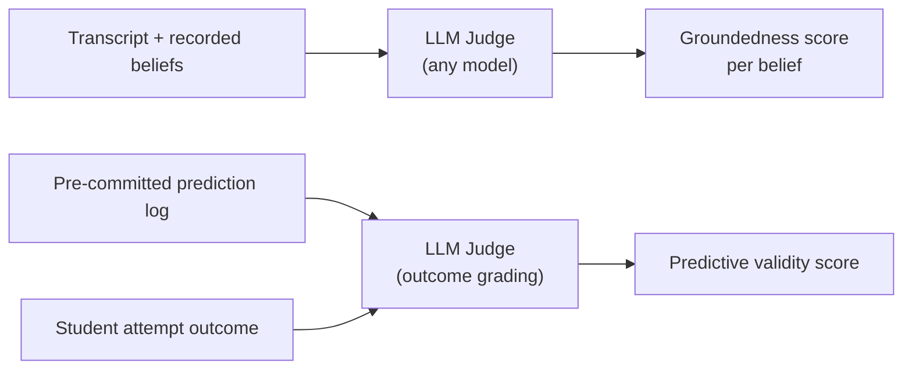
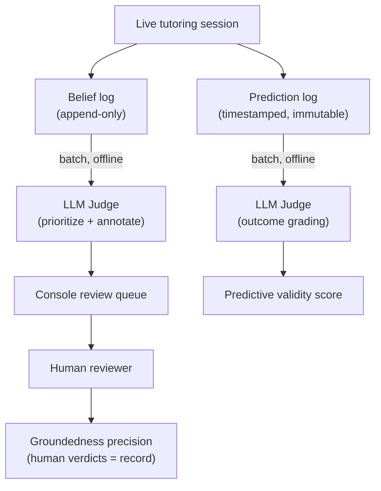

Giá trị của engine dựa trên một tuyên bố rất cụ thể: nó ghi lại *cách* học sinh suy nghĩ, chứ không chỉ *việc* các em đã hoàn thành gì. Muốn chứng minh được điều đó thì không thể chỉ cho thấy phần hạ tầng chạy ổn. Vì thế, việc validation (xác minh) được tách thành hai tầng, và gần như toàn bộ bằng chứng có sức thuyết phục đều nằm ở tầng cao hơn.

## Hai tầng: hạ tầng hoạt động hay mô hình phản ánh sự thật

**Tầng 0 — Hạ tầng chạy đúng.** Belief model (mô hình niềm tin) có được lưu trong một phiên học, nạp lại ở phiên sau, và thật sự được truyền cho AI làm ngữ cảnh hay không? Đây là phép kiểm tra nhị phân có/không. Nó cần thiết, nhưng không chứng minh được gì về giả định cốt lõi — ngay cả một bộ theo dõi hoàn thành chủ đề rất đơn giản cũng có thể vượt qua.

**Tầng 1 — Mô hình là đúng.** Những belief (niềm tin/nhận định) mà engine ghi lại có thật sự khớp với cách học sinh suy nghĩ không? Đây mới là nơi chứa toàn bộ bằng chứng thuyết phục. Tầng 0 chỉ là cổng kiểm tra; niềm tin vào engine phải dựa trên các tín hiệu của Tầng 1.

```
Level 0  ──►  plumbing gate  ──►  passes?
                                      │  yes
                                      ▼
Level 1  ──►  groundedness precision + predictive validity
```

## Hai tín hiệu của Tầng 1

### Groundedness Precision

*Trong số các ngộ nhận mà engine đã ghi lại, có bao nhiêu phần thực sự đúng?*

Lấy mẫu một tập belief đã được ghi nhận, đọc transcript (bản ghi hội thoại) thật, rồi đếm xem bao nhiêu belief thực sự được lời nói của học sinh nâng đỡ. Cách này rẻ — làm được với khoảng 10 học sinh — và là nền tảng ban đầu. Nếu precision kém, thì chưa đáng để theo đuổi các chỉ số còn lại.

**Cẩn thận với bẫy precision.** Một engine gần như không ghi lại gì có thể đạt precision rất cao, vì mỗi belief hiếm hoi và dè dặt đều dễ đúng. Precision luôn phải được báo cáo cùng một thước đo coverage (độ phủ) hoặc volume (khối lượng) — chẳng hạn số belief được ghi lại trên mỗi phiên, hoặc tỷ lệ phiên làm lộ ra ít nhất một belief. Chỉ khi đặt precision cạnh coverage thì con số mới trung thực; còn precision đứng một mình sẽ thưởng cho một engine quá thận trọng.

### Predictive Validity

*Trước khi học sinh thử giải một bài toán mới, engine dự đoán liệu các em có thất bại hay không, và sẽ vấp ở đâu. Dự đoán đó đúng bao nhiêu lần?*

Đây là phép kiểm định có thể bác bỏ mạnh nhất đối với engine. Nó bám đúng vào tuyên bố trung tâm: các mẫu hình suy luận sẽ dự đoán được nơi học sinh bị gãy. Một học sinh trông như đã “xong” nếu chỉ nhìn theo completion metric, nhưng lại bị engine gắn cờ vì một ngộ nhận ẩn, rồi sau đó thật sự thất bại đúng ở chỗ đó — đó cũng chính là **demo case** mà một bộ theo dõi hoàn thành không thể tái hiện.

## Biến predictive validity thành quy trình vận hành được

### Checkpoint và tập anchor

Dự đoán được kích hoạt tại một **novel-problem checkpoint**: thời điểm trong đối thoại kiểu Socratic mà tutor sắp đưa ra một bài toán thật sự mới. Engine khóa dự đoán *trước* khi học sinh nhìn thấy bài toán, rồi mới chấm kết quả sau đó.

Có hai loại checkpoint:

| Loại | Nội dung | Vai trò |
|---|---|---|
| **Authored seed transfer problems** | Các bài toán cố định, giống hệt nhau với mọi học sinh | Tập anchor — giúp chỉ số so sánh được giữa học sinh này với học sinh khác |
| **AI-chosen checkpoints** | Những thời điểm mới do tutor tự sinh ra ngay trong lúc dạy | Mở rộng khối lượng và độ phủ trên toàn bộ belief graph |

Nếu chỉ dùng authored seeds thì chỉ số sẽ sạch và dễ so sánh, nhưng coverage sẽ bị khóa theo công sức biên soạn. AI-chosen checkpoints bổ sung độ phủ rộng; cái giá phải trả là cần một bộ phát hiện đủ tin cậy để biết khi nào tutor “sắp đưa ra một điều gì đó thật sự mới”.

### Độ hạt của dự đoán

Mỗi dự đoán chỉ gắn với đúng một lần thử novel problem và đúng một kết quả của lần thử đó — một sự kiện dự đoán, một lần chấm điểm. Tỷ lệ 1:1 này rất quan trọng: một dự đoán kéo dài cả phiên học có thể khớp với từ 0 đến nhiều kết quả, nên không thể chấm điểm một cách sạch sẽ.

Mỗi sự kiện dự đoán đều ghi lại nó dựa trên cái gì — hoặc là trạng thái mong manh của một node cụ thể trong belief graph, hoặc là một reasoning pattern (mẫu hình suy luận). Một dự đoán dựa trên reasoning pattern là một *standing claim* (khẳng định thường trực), và nó nhận một lần chấm điểm cho mỗi checkpoint phù hợp; vì vậy một tuyên bố rộng, băng qua nhiều khái niệm, vẫn tạo ra được nhiều phép thử cụ thể và có thể bác bỏ.

Để giữ cho chỉ số trung thực (cùng một tinh thần với precision-vs-coverage): chỉ chấm một dự đoán cho mỗi học sinh trên mỗi bài toán phân biệt, **lần thử đầu tiên thôi**. Những lần thử lặp lại trên cùng một seed không được phép làm phình mẫu số.

### Quy tắc chống rò rỉ thông tin

Nếu dự đoán được tạo ra *sau khi* kết quả đã lộ diện, thì chỉ số đó không còn ý nghĩa.

:::caution[Rò rỉ thông tin sẽ làm chỉ số mất giá trị]
Mọi dự đoán đều phải được ghi vào một **immutable, timestamped prediction log** (nhật ký dự đoán bất biến, có đóng dấu thời gian) trước khi học sinh thử làm bài. Việc chấm kết quả chỉ diễn ra nghiêm ngặt ở bước sau, tách biệt. Điều này có nghĩa là mô hình dữ liệu của belief graph cần một prediction log riêng — không thể chỉ dựa vào belief ở trạng thái hiện tại.
:::

## Tự động hóa bằng LLM-as-Judge

Cả hai chỉ số đều có thể được chấm tự động bằng một LLM đóng vai trò judge (bộ chấm), đọc transcript rồi đánh giá đầu ra của engine. Với predictive validity, vai trò của LLM bị giới hạn ở việc chấm kết quả (học sinh thật sự hiểu hay chỉ đoán mò?) — phần lõi của chỉ số vẫn là so sánh khách quan giữa trước và sau, chứ không phải một phán đoán cảm tính. Phù hợp với nguyên tắc Stemolly độc lập với từng LLM cụ thể, judge có thể là bất kỳ LLM nào được chọn theo chi phí và độ khó, chứ không khóa vào một nhà cung cấp cố định.



### Hiệu chuẩn với một tập gold do con người gán nhãn

LLM judge có thể sai. Tệ hơn, nếu cùng một loại mô hình vừa tạo ra belief vừa tự chấm belief đó, chúng có thể cùng chia sẻ những điểm mù giống nhau và vô tình củng cố sai sót cho nhau. Cách khắc phục là dựng một **human-labeled gold set** (tập chuẩn do con người gán nhãn) cỡ khoảng 30–50 belief. Sau đó đo xem LLM judge đồng ý với nhãn do con người gán bao nhiêu lần. Nhờ vậy, “hãy tin điểm số AI đưa ra” được chuyển thành một tỷ lệ đồng thuận có thể đo đếm. Nếu không có hiệu chuẩn, bài toán niềm tin chỉ bị dời chỗ chứ không được giải quyết.

### Pin phiên bản để tái lập kết quả

LLM judge là hệ không tất định. Một điểm số tạo ra hôm nay có thể không còn so sánh được với điểm số của tháng sau nếu model hoặc prompt đã đổi. Để giữ cho các chỉ số còn so sánh được theo thời gian:

- Pin **phiên bản model** và **phiên bản prompt** của judge.
- Dùng **temperature thấp**.
- Ghi lại mỗi lần chạy chỉ số đã dùng những phiên bản nào.

Khi nâng cấp model của judge, hãy chờ đợi việc baseline sẽ dịch chuyển, và cần hiệu chuẩn lại với human gold set trước khi đem so sánh số cũ với số mới.

### Chạy offline — phán quyết của con người mới là chỉ số chính thức

:::caution[Không chấm ngay trên luồng chạy trực tiếp]
Judge **không** chạy trong luồng dạy học trực tiếp. Nếu thêm một lời gọi tới model mạnh ở mọi checkpoint, độ trễ và chi phí đều tăng, đồng thời chỉ số sẽ bị buộc chặt vào luồng production. Toàn bộ việc chấm đều chạy offline.
:::

Module judge chạy dưới dạng các batch job offline:

1. **Sampling** — chọn ra các ngộ nhận đã được ghi nhận và đưa chúng vào hàng chờ review của Console.
2. **Pre-screening** — một tầng LLM khác với tầng Expert đã tạo belief sẽ gắn chú thích và ưu tiên xem mục nào cần con người review trước.
3. **Scoring** — chấm các checkpoint của predictive validity dựa trên những dự đoán đã được cam kết trước.

Ở quy mô MVP, **chỉ số chính thức là phán quyết của con người**. Groundedness precision chỉ tính các verdict do con người đưa ra, vì tuyên bố đang được kiểm tra chính là thứ mà một LLM judge rất dễ chia sẻ cùng điểm mù. Giá trị của judge nằm ở throughput (giúp đẩy những ca đáng xem nhất lên trước) và ở vai trò **regression harness**: chấm lại một mẫu bằng chứng cố định sau mỗi lần đổi prompt, rồi so sánh sai khác để phát hiện hồi quy sớm.


