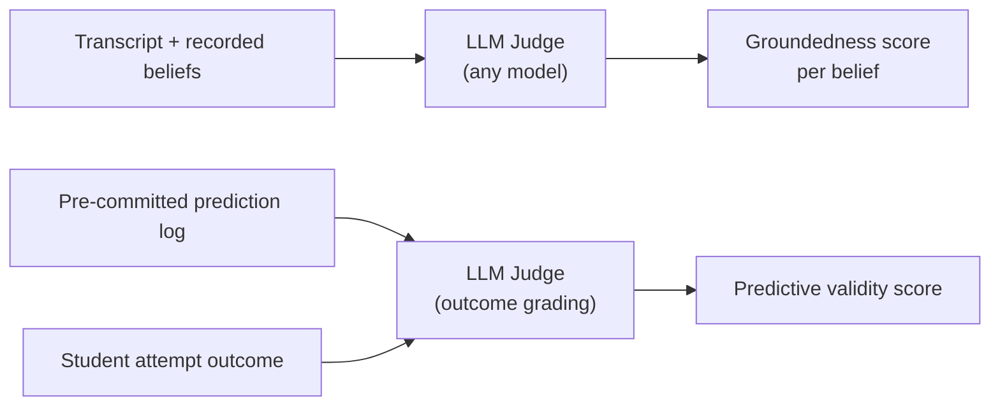
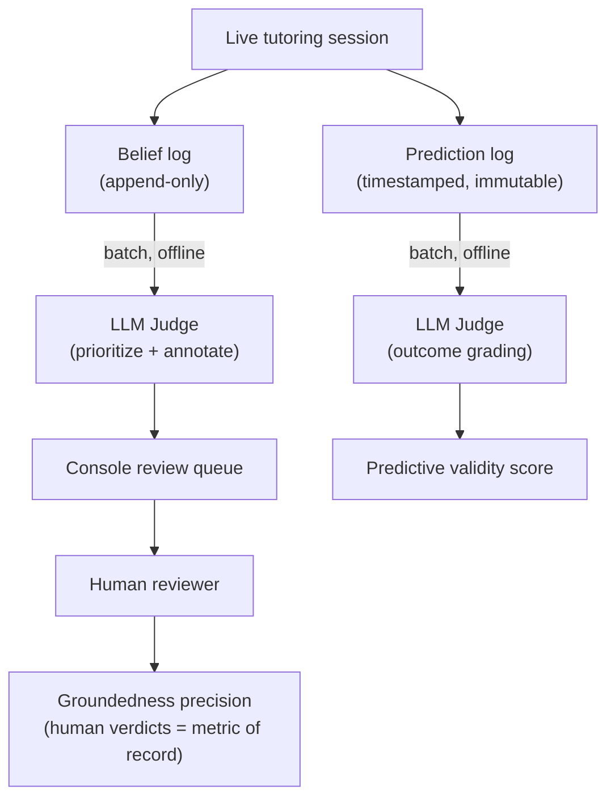

Engine mental-model đưa ra một khẳng định rất mạnh: nó ghi lại *cách học sinh thực sự suy nghĩ*, chứ không chỉ họ đã học qua những chủ đề nào. Chứng minh được điều đó khó hơn tưởng tượng. Trang này giải thích bài toán hai tầng, hai chỉ số được chọn để xử lý nó, những cách các chỉ số đó có thể thất bại, và kỷ luật cần thiết để giữ cho chúng đáng tin cậy.

---

## Hai tầng đúng/sai

Việc kiểm định tách bạch thành hai câu hỏi.

**Tầng 0 — hệ thống nền có chạy đúng không?** Trong một phiên học, engine có lưu mô hình niềm tin của nó không, sang phiên tiếp theo có nạp lại được không, và có thực sự truyền nó cho AI làm ngữ cảnh không? Đây là phép kiểm tra nhị phân có/không. Nó là điều kiện cần, nhưng hầu như chưa chứng minh được gì: ngay cả một bộ theo dõi topic-completion đơn giản cũng có thể vượt qua Tầng 0.

**Tầng 1 — mô hình có phản ánh đúng sự thật không?** Những gì engine ghi lại có thực sự khớp với cách học sinh suy nghĩ không? Đây mới là nơi chứa toàn bộ bằng chứng thuyết phục. Mọi nỗ lực kiểm định nghiêm túc đều phải dựa trên các tín hiệu của Tầng 1; Tầng 0 chỉ nên được dùng như cổng điều kiện tiên quyết.

```
Level 0 (plumbing)   ──── gate ────▶  Level 1 (model is true)
     ✔ save / reload                   ✔ groundedness precision
     ✔ context supplied                ✔ predictive validity
```

---

## Hai chỉ số của Tầng 1

Hai tín hiệu đã được chọn để chứng minh engine ở Tầng 1.

### Groundedness Precision

Lấy mẫu các hiểu lầm mà engine đã ghi nhận. Đọc lại transcript (bản chép hội thoại) thực tế của từng trường hợp. Đo xem: **tỷ lệ nào trong số đó là đúng thật sự?**

Chỉ số groundedness precision (độ chính xác của mức độ bám sát dữ liệu) này rẻ để đo — khoảng 10 học sinh là đã dùng được — và cũng là nền tảng. Nếu groundedness precision thấp, thì những gì khác engine làm đều không còn ý nghĩa. Đây là thứ cần được đo đầu tiên.

### Predictive Validity

Trước khi học sinh thử giải một bài mới, engine phát ra một dự đoán: học sinh này có làm được không, và nếu không thì sẽ vấp ở đâu, vì sao? Sau khi học sinh làm xong, so sánh dự đoán đó với điều thực sự xảy ra.

Predictive validity (tính hiệu lực dự báo) là phép kiểm định phản bác được mạnh nhất hiện có. Nó khớp trực tiếp với tuyên bố cốt lõi: đồ thị niềm tin của engine dự đoán được *học sinh sẽ gãy ở đâu*, chứ không chỉ họ đã đi qua đâu.

Một tín hiệu thứ ba — tìm ra một học sinh trông có vẻ đã "xong" theo completion metric (chỉ số hoàn thành), nhưng engine lại phát hiện đúng một hidden misconception (hiểu lầm ẩn) — chính là **demo case** (ca minh họa). Không thể dựng ra trường hợp này; phải tìm nó trong dữ liệu thật. Nhưng khi nó xuất hiện, đó là mảnh bằng chứng đơn lẻ thuyết phục nhất, vì completion tracker (bộ theo dõi hoàn thành) không thể nhìn thấy nó.

---

## Các dạng thất bại: Gaming và Leakage

Cả hai chỉ số đều có một điểm yếu mang tính cấu trúc. Nếu không có thêm kỷ luật vận hành, thì không chỉ số nào an toàn để báo cáo.

### Gaming Groundedness Precision

Groundedness precision có thể bị đẩy lên tối đa bởi một engine gần như không ghi lại gì cả. Mỗi niềm tin hiếm gặp, dè dặt đều rất dễ ghi đúng, nên precision tăng cao — dù trên thực tế engine hầu như vô dụng.

**Cách khắc phục:** luôn báo cáo precision đi kèm với một thước đo coverage (độ bao phủ) — ví dụ, số niềm tin được ghi lại mỗi phiên, hoặc tỷ lệ phiên học làm lộ ra ít nhất một niềm tin. Precision và coverage đi cùng nhau mới trung thực. Chỉ báo cáo precision thôi sẽ vô tình thưởng cho một engine quá thận trọng.

```
High precision + low coverage  ──▶  caution bias, not quality
High precision + healthy coverage ──▶  genuine accuracy
```

### Leakage trong Predictive Validity

Leakage nghĩa là tạo dự đoán *sau khi* kết quả đã lộ ra. Khi đó chỉ số trở nên vô nghĩa — engine chỉ đang dán nhãn lại lịch sử, chứ không dự đoán tương lai.

**Cách khắc phục:** mọi dự đoán đều phải được ghi vào một **immutable, timestamped log** (nhật ký bất biến có đóng dấu thời gian) trước khi học sinh thử giải bài mới. Bước chấm kết quả phải diễn ra nghiêm ngặt ở phía sau, như một bước riêng biệt. Điều này cũng có nghĩa là mô hình dữ liệu của đồ thị niềm tin cần có prediction log (nhật ký dự đoán) chuyên biệt, chứ không thể chỉ dựa vào belief store (kho niềm tin) của trạng thái hiện tại.

---

## Vận hành hóa Predictive Validity: các Novel-Problem Checkpoint

Một chỉ số cần có điểm kích hoạt cụ thể. Với predictive validity, điểm kích hoạt đó là một **novel-problem checkpoint** (điểm chốt tại bài toán mới) — một thời điểm trong đối thoại Socratic khi engine dừng lại, chốt dự đoán của mình, rồi chỉ sau đó mới để học sinh thử giải bài.

Có hai loại checkpoint:

| Kind | Description | Role |
|---|---|---|
| **Authored seed transfer problems** | Identical problems used across all students | **Anchor set** — makes scores comparable student-to-student |
| **AI-chosen novel moments** | Any genuinely new problem the tutor poses | Adds volume and coverage across the whole graph |

Dùng cả hai là một lựa chọn có chủ đích. Nếu chỉ giới hạn checkpoint vào authored seeds, chỉ số sẽ sạch và dễ so sánh hơn, nhưng độ bao phủ lại bị khóa chặt bởi công sức biên soạn bài. AI-chosen checkpoints mở rộng tín hiệu lên đáng kể — cái giá phải trả là cần có một bộ phát hiện đáng tin cậy cho thời điểm "sắp đặt ra một thứ thực sự mới".

**Prediction granularity — one prediction, one attempt.** Mỗi dự đoán được gắn với đúng một lần thử giải bài mới và một kết quả duy nhất của lần đó. Điều này giữ nguyên quan hệ 1:1 rõ ràng trước/sau mà chỉ số này phụ thuộc vào. Để tránh làm phình số liệu, với mỗi học sinh chỉ tính **lần thử đầu tiên** của từng bài toán riêng biệt. Những lần làm lại cùng một seed sẽ không làm tăng mẫu số.

Mỗi dự đoán mang theo một `basis` — hoặc là trạng thái mong manh của một nút trong đồ thị niềm tin, hoặc là một reasoning pattern (mẫu hình lập luận). Dự đoán theo reasoning pattern là một khẳng định thường trực: nó nhận một lần chấm điểm cho mỗi checkpoint phù hợp, vì thế một niềm tin rộng băng qua nhiều khái niệm vẫn tạo ra được nhiều phép kiểm định cụ thể, có thể bị phản bác.

---

## Tự động hóa các chỉ số: LLM-as-Judge

Việc chấm điểm cả hai chỉ số hoàn toàn bằng tay ở quy mô lớn là không khả thi. Giải pháp là dùng **LLM-as-judge** (LLM đóng vai trò giám khảo): một language model (mô hình ngôn ngữ) đọc transcript và tự động chấm đầu ra của engine.

Phù hợp với thiết kế LLM-agnostic (không phụ thuộc một LLM cụ thể) của Stemolly (xem [phần triển khai engine](./engine-impl.md)), judge có thể là bất kỳ mô hình phù hợp nào được chọn theo chi phí và độ khó — không có nhà cung cấp cố định. Với predictive validity, phần việc của LLM chỉ giới hạn ở chấm kết quả đầu ra (học sinh có thực sự hiểu hay chỉ đoán mò?). Phần cốt lõi của chỉ số — so sánh trước/sau với một dự đoán đã được chốt trước — là khách quan và không cần đến một phán đoán cảm tính.



---

## Kỷ luật vận hành: Calibration, Pinning và Offline Batch

Việc tự động hóa bằng LLM judge cũng kéo theo những rủi ro riêng. Có ba nguyên tắc kỷ luật giúp giữ các chỉ số này đáng tin cậy.

### Calibration dựa trên một Human Gold Set

LLM judge có thể sai. Tệ hơn nữa, nếu cùng một kiểu mô hình vừa tạo ra niềm tin vừa tạo ra điểm số, chúng có thể chia sẻ cùng điểm mù và củng cố sai lầm của nhau.

Cách khắc phục là dùng **human-labeled gold set** (bộ mẫu chuẩn do con người gán nhãn): khoảng 30–50 niềm tin được một người đánh giá gán nhãn. Sau đó đo xem LLM judge đồng ý với các nhãn của con người với tần suất bao nhiêu. Cách này biến yêu cầu "hãy tin vào điểm số của AI" thành một tỷ lệ đồng thuận có thể đo được. Không có calibration, bài toán niềm tin không hề được giải quyết — nó chỉ bị dời sang chỗ khác.

### Pinning cho Model, Prompt và Temperature

LLM là hệ không tất định. Cùng một prompt nếu gửi sang phiên bản mô hình khác — hoặc chỉ cần temperature khác — cũng có thể tạo ra điểm số khác. Một con số được tạo ra hôm nay có thể không còn so sánh được với con số tạo ra tháng sau.

Để giữ các chỉ số có thể so sánh theo thời gian:
- Cố định **phiên bản model** và **phiên bản prompt** của judge.
- Dùng **temperature thấp**.
- Ghi lại những phiên bản nào đã tạo ra từng lần chạy chỉ số.

Khi nâng cấp mô hình judge, hãy giả định đường cơ sở sẽ dịch chuyển. Cần calibration lại với human gold set trước khi đem số cũ và số mới ra so sánh.

### Chạy Offline, không chạy Inline

Judge chạy dưới dạng **offline batch jobs** (tác vụ hàng loạt ngoại tuyến), không bao giờ nằm trên luồng dạy học trực tiếp. Nó lấy mẫu các hiểu lầm đã được ghi nhận đưa vào review queue (hàng đợi rà soát), tiền sàng lọc bằng LLM để ưu tiên và chú giải, rồi chấm các checkpoint của predictive validity dựa trên prediction log đã được chốt trước.

Ở quy mô MVP, **human verdicts là metric of record** (kết luận của con người là thước đo chính thức). Groundedness precision chỉ tính những kết quả đã được con người rà soát, vì chính tuyên bố đang được kiểm định cũng là điều mà một LLM judge rất dễ chia sẻ cùng điểm mù. Giá trị của judge nằm ở throughput (thông lượng: đưa những ca đáng chú ý nhất lên trước) và vai trò **regression harness** (bộ khung kiểm tra hồi quy): chấm lại một mẫu bằng chứng cố định sau mỗi lần đổi prompt rồi so sánh chênh lệch điểm để bắt regression (suy giảm chất lượng) trước khi nó chạm tới môi trường production.

Inline judging — kiểm định đầu ra của engine ngay lúc ghi — đã từng được cân nhắc rồi bị bác bỏ. Cách đó sẽ cộng thêm chi phí và độ trễ của một mô hình mạnh vào mọi checkpoint, đồng thời gắn chặt chỉ số với luồng chạy production theo cách khiến cả hai phía đều khó thay đổi một cách độc lập.



---

## Tóm tắt

Việc kiểm định engine dựa trên hai chỉ số của Tầng 1 — groundedness precision và predictive validity — và mỗi chỉ số đều có một kiểu thất bại riêng cần được chủ động phòng ngừa. Groundedness precision cần đi kèm một chỉ số coverage để chống bị "game". Predictive validity cần một prediction log bất biến để chống leakage. LLM-as-judge giúp tự động hóa việc chấm điểm, nhưng muốn đáng tin thì phải được calibration, pinning và giữ ở chế độ offline. Ở quy mô MVP, kết luận của con người vẫn là ground truth; judge là công cụ tăng tốc và chốt chặn hồi quy, không phải người phân xử tối cao.
