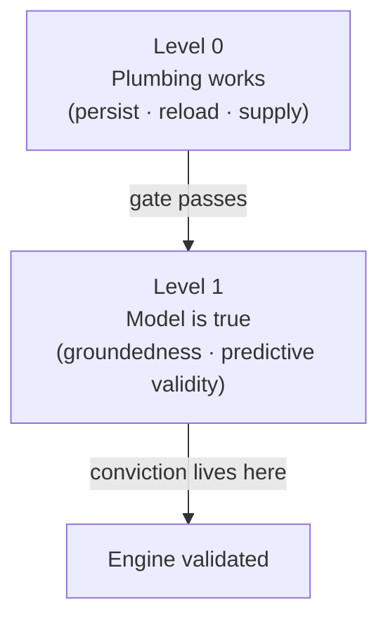
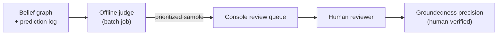

Engine đưa ra một tuyên bố mạnh: nó ghi lại *cách học sinh thực sự suy nghĩ*, chứ không chỉ những chủ đề mà em ấy đã đi qua. Muốn chứng minh được tuyên bố đó thì không thể chỉ kiểm tra xem phần mềm có chạy hay không. Việc validation (kiểm định) được tách thành hai tầng, và sự tin tưởng phải đặt trên tầng khó hơn.

## Hai tầng kiểm định

**Tầng 0 — "plumbing works"** kiểm tra những điều cơ bản: belief model (mô hình niềm tin) có được lưu lại ở cuối phiên học, được nạp lại ở phiên sau, và thực sự tới được AI dưới dạng ngữ cảnh hay không? Đây là phép thử nhị phân có/không. Nó cần thiết, nhưng không chứng minh được gì về canh bạc cốt lõi — một topic-completion tracker (bộ theo dõi hoàn thành chủ đề) đơn giản cũng vượt qua được.

**Tầng 1 — "the model is true"** kiểm tra xem những gì engine đã ghi lại có khớp với cách học sinh thực sự suy nghĩ hay không. Mọi bằng chứng đủ sức thuyết phục đều nằm ở đây. Tầng 0 chỉ là cổng vào; nó không bao giờ tự trở thành lập luận chính.

## Hai tín hiệu của Tầng 1

Hai chỉ số được chọn để chứng minh tính hợp lệ ở Tầng 1.

### Groundedness Precision (độ chính xác theo bằng chứng nền)

Hãy lấy mẫu một số misconception (ngộ nhận) mà engine đã ghi lại. Đọc transcript (bản ghi hội thoại) thật. Đếm xem có bao nhiêu phần trong những belief (nhận định) đã được ghi đó là đúng thật. Đó chính là **groundedness precision** — trong tất cả các belief mà engine đã cam kết ghi nhận, có bao nhiêu cái là có thật?

Chỉ số này đo khá rẻ (khoảng 10 học sinh là đã đủ để bắt đầu) và đóng vai trò nền móng. Nếu precision thấp, thì phần còn lại của chương trình kiểm định không còn nhiều ý nghĩa.

**Coi chừng bẫy "game" chỉ số.** Một engine gần như chẳng bao giờ ghi gì lại có thể đạt precision gần như hoàn hảo — vì những belief hiếm hoi, dè dặt mà nó ghi ra rất dễ đúng. Precision luôn phải được báo cáo cùng với một con số **coverage** (độ phủ): số belief được ghi trên mỗi phiên, hoặc tỷ lệ phiên làm lộ ra ít nhất một belief. Chỉ khi đặt precision cạnh coverage thì tín hiệu mới trung thực; còn precision đứng riêng sẽ thưởng cho một engine quá thận trọng.

### Predictive Validity (độ đúng của năng lực dự báo)

Trước khi học sinh thử một bài toán mới, engine phát ra một dự đoán: *em ấy sẽ làm được hay không, và nếu không thì sẽ vấp ở đâu, vì sao?* Sau khi học sinh làm xong, dự đoán đó được đem so với điều thực sự đã xảy ra.

Đây là phép thử có thể bị bác bỏ mạnh nhất mà engine phải đối mặt. Nó khớp đúng với tuyên bố cốt lõi — rằng các mẫu hình suy luận được ghi lại có thể dự báo chỗ học sinh sẽ gãy — và đây là kiểu tuyên bố mà một completion tracker đơn giản không thể đưa ra.

Điểm kích hoạt một dự đoán là một **novel-problem checkpoint** (điểm kiểm bài toán mới): bất kỳ thời điểm nào trong đối thoại kiểu Socratic mà tutor sắp đưa ra một bài toán thật sự mới. Có hai loại:

- **Authored seed transfer problems** — các bài toán được biên soạn thủ công và giống hệt nhau cho mọi học sinh. Chúng tạo thành *anchor set* (tập neo): vì mọi học sinh đều gặp cùng một bài toán, điểm số có thể so sánh trên toàn cohort (nhóm học sinh).
- **AI-chosen novel moments** — các bài toán mà tutor tạo theo ngữ cảnh ngay trong phiên học. Chúng bổ sung thêm số lượng và mở rộng ra ngoài anchor set.

Mỗi dự đoán chỉ gắn với đúng một lần làm bài. Một dự đoán bao trùm đúng một học sinh × một bài toán × một kết quả — không có kiểu ràng buộc lỏng hơn. Cách này giữ cho phép so sánh trước/sau được sạch và tối đa hóa số điểm dữ liệu theo cặp khi cohort còn nhỏ.

Mỗi dự đoán cũng mang một trường `basis` để nêu rõ điều gì đã dẫn tới nó: fragility state (trạng thái mong manh) của một node trong belief graph (đồ thị niềm tin), hoặc một reasoning pattern (mẫu hình suy luận) trải trên nhiều khái niệm. Một basis dựa trên reasoning pattern sẽ tạo ra *một lần chấm điểm cho mỗi checkpoint phù hợp*, nhờ vậy một tuyên bố rộng, bắc qua nhiều khái niệm vẫn phải kiếm được nhiều phép thử cụ thể có thể bác bỏ, thay vì chỉ có một khẳng định mơ hồ.

:::caution
Mọi dự đoán đều phải được ghi vào một **immutable, timestamped prediction log** (nhật ký dự đoán bất biến, có đóng dấu thời gian) trước khi học sinh nhìn thấy bài toán. Việc chấm kết quả chỉ diễn ra nghiêm ngặt ở bước sau, tách biệt. Nếu dự đoán được tạo ra sau khi kết quả đã lộ, thì chỉ số này vô nghĩa.
:::

### Demo đánh bại baseline (mốc so sánh cơ sở)

Một tín hiệu thứ ba không phải là chỉ số, mà là một màn trình diễn: tìm một học sinh trông như đã "xong" nếu nhìn theo completion metric, nhưng lại bị engine gắn cờ có một misconception ẩn, rồi về sau chính điều đó gây ra một thất bại thật ở bước tiếp theo. Completion tracker không thể nhìn thấy điều này. Chỉ một trường hợp như vậy thôi cũng là minh họa trực diện nhất cho lý do engine tồn tại.

Kế hoạch là chứng minh engine bằng groundedness precision và predictive validity trước, rồi thu hoạch trường hợp này như phần demo.

## LLM-as-Judge (dùng LLM làm giám khảo): Tự động hóa có lan can an toàn

Nếu chấm groundedness precision và predictive validity thủ công cho từng học sinh thì sẽ rất chậm. Cả hai chỉ số đều có thể được tự động hóa bằng cách dùng một LLM để đọc transcript và chấm đầu ra — mô hình **LLM-as-judge**.

Stemolly không phụ thuộc vào một LLM cụ thể, nên judge có thể là bất kỳ model nào được chọn theo chi phí và độ khó của bài toán. Với predictive validity, vai trò của LLM bị giới hạn: nó chấm *kết quả* (học sinh thật sự hiểu hay chỉ đoán mò?), vì phép đối chiếu cốt lõi là khách quan. Với groundedness, LLM đọc một belief đã được ghi lại cùng đoạn transcript liên quan và quyết định xem belief đó có grounded hay không.

### Chạy offline, không nằm trên luồng trực tiếp

Judge chạy dưới dạng **offline batch jobs** (tác vụ lô chạy ngoại tuyến), không bao giờ nằm trên luồng dạy học trực tiếp.

Nó lấy mẫu các belief đã ghi vào một review queue (hàng chờ rà soát), pre-screen (sàng lọc sơ bộ) chúng bằng một LLM rẻ hơn để ưu tiên những ca đáng xem, và chấm các checkpoint của predictive validity dựa trên các dự đoán đã được cam kết từ trước. Phương án chạy judge ngay trong phiên học bị loại bỏ vì nó sẽ cộng thêm chi phí và độ trễ của một model mạnh vào mọi checkpoint, đồng thời buộc chỉ số dính chặt vào flow production.

### Phán quyết của con người mới là chỉ số chính thức

Ở quy mô MVP, **chỉ phán quyết của con người mới được tính** vào groundedness precision. Lý do là có chủ đích: tuyên bố đang bị kiểm tra — "belief này có khớp với điều học sinh thực sự nghĩ không?" — chính là loại câu hỏi mà một language model rất có thể chia sẻ cùng điểm mù với model đã tạo ra belief đó. Để judge tự chấm sản phẩm của "cùng một họ" model thì bài toán niềm tin chỉ bị dời đi chỗ khác, chứ chưa được giải quyết.

Giá trị thực của judge nằm ở **throughput** (thông lượng) và **regression detection** (phát hiện hồi quy):

- Nó ưu tiên mẫu, để người rà soát tập trung thời gian vào những ca đáng quan tâm nhất.
- Nó đóng vai trò một **regression harness** (bộ khung phát hiện hồi quy): chạy lại judge trên một mẫu bằng chứng cố định sau mỗi lần đổi prompt rồi so điểm. Nếu điểm tụt, đó là tín hiệu hồi quy trước khi vấn đề tới tay người rà soát.

### Hiệu chuẩn: Judge có đồng ý với con người không?

Trước khi tin vào cơ chế ưu tiên của judge, hãy đo tỷ lệ đồng thuận của nó với một **human-labeled gold set** (tập chuẩn do con người gán nhãn) nhỏ, khoảng 30–50 belief. Nhờ vậy, câu "hãy tin điểm AI chấm" được đổi thành một con số có thể đo được. Nếu thiếu bước này, bài toán niềm tin chỉ bị chuyển chỗ chứ không được giải quyết.

### Ghim phiên bản: Giữ cho chỉ số còn so sánh được theo thời gian

LLM judge là hệ không tất định. Một điểm số tạo hôm nay có thể không còn so sánh được với điểm số của tháng sau nếu model hoặc prompt bên dưới đã đổi.

Để giữ cho các chỉ số còn so sánh được:

- Ghim **phiên bản model** và **phiên bản prompt** của judge.
- Dùng **temperature thấp** để giảm biến thiên ngẫu nhiên.
- Ghi lại phiên bản nào đã tạo ra từng chỉ số ngay bên cạnh điểm số đó.
- Khi nâng cấp model của judge, hãy giả định rằng baseline sẽ dịch chuyển và hiệu chuẩn lại với human gold set trước khi so số mới với số cũ.

## Toàn vẹn bằng chứng: Giữ cho tín hiệu sạch

Các tín hiệu kiểm định chỉ tốt bằng chính chất lượng bằng chứng nuôi chúng. Có ba kiểu hỏng có thể âm thầm làm bẩn bằng chứng trước cả khi nó tới tay judge.

### Prediction Leakage (rò rỉ dự đoán)

Predictive validity trở nên vô nghĩa nếu dự đoán được ghi *sau khi* kết quả đã lộ ra. Mọi dự đoán đều phải được ghi vào một **immutable, timestamped prediction log** trước khi học sinh thấy bài toán. Việc chấm kết quả chỉ diễn ra nghiêm ngặt ở bước sau, tách biệt.

### Diagram Transcription Bias (độ lệch khi chép lại hình vẽ)

Khi học sinh nộp một hình vẽ tay, việc nhờ vision model chép lại sẽ tạo ra thứ văn bản trôi chảy, nghe có vẻ hợp lý — mà "hợp lý" ở đây lại có nghĩa là bị kéo về cách dựng hình mà model vốn kỳ vọng. Một học sinh đặt chân đường vuông góc *ra ngoài* đoạn thẳng (lỗi kinh điển với tam giác tù) sẽ bị chép thành một câu nghe như đúng, nhưng âm thầm làm rơi mất đúng chi tiết đang là ngộ nhận.

Điều này còn tệ hơn mất dữ liệu thông thường: phần bị mất lại lệch có hệ thống *ngược* với mục đích của engine. Engine tồn tại để ghi lại cách học sinh thực sự nghĩ, còn quá trình chuẩn hóa lại xóa đi chính những lỗi đó.

Một geometry-description schema (lược đồ mô tả hình học) có cấu trúc từng được cân nhắc rồi bị loại: nó quá đặc thù cho miền toán hình, vô dụng với sơ đồ vật lý hay một miền ngôn ngữ, và ngay cả khi bắt model điền theo schema thì nó vẫn sẽ chuẩn hóa về phía kiểu điền mà nó cho là "đúng".

Hướng giải quyết được chấp nhận là: khi bước chép lại không thể đọc hình một cách đáng tin cậy, nó sẽ từ chối và yêu cầu học sinh tự mô tả cách dựng của mình. Phần mô tả do chính học sinh viết ra thường mang tính chẩn đoán cao hơn bất kỳ bản chép lại nào. Nếu lời em kể mâu thuẫn với chính sản phẩm em đã vẽ, thì khoảng cách đó tự nó đã là một tín hiệu misconception — mạnh hơn từng nguồn riêng lẻ.

### Session-Gap Fabrication (ngụy tạo do khoảng trống phiên học)

Một khoảng trống hai mươi lăm phút trong phiên học vì học sinh đi ăn tối giống hệt ở mức byte với một khoảng trống hai mươi lăm phút vì em ấy bị bí. Khi thời lượng được đưa vào engine như bằng chứng của sự chật vật, một khoảng vắng mặt không có nhãn không chỉ làm tín hiệu kém đi — nó còn bịa ra tín hiệu: một quan sát fragility có nguồn gốc từ bữa ăn, rồi bị ghi vào append-only log mà không hề có thao tác rút lại.

Lời giải là gán kiểu cho mọi khoảng trống:

| Gap type | Treatment |
|---|---|
| `idle` | Học sinh vẫn hiện diện nhưng không nhập gì — có giá trị chẩn đoán, được đưa vào engine |
| `paused` | Học sinh bấm tạm dừng — bị loại khỏi bằng chứng |
| `away` | Tự động tạm dừng sau timeout, chưa rõ nguyên nhân — tạm giữ lại cho tới khi hỏi học sinh lúc em quay lại |

Từ đó kéo theo hai hệ quả. **Nút pause** không phải tính năng tiện ích — nó là cơ chế bảo toàn tính toàn vẹn của bằng chứng. **Chốt chặn auto-`away`** cũng quan trọng không kém, vì một học sinh bị gọi đi giữa lúc đang làm bài thường sẽ quên bấm bất cứ thứ gì. Một thiết kế trông cậy vào việc em phải nhớ làm điều đó thì vẫn chưa giải được vấn đề.

:::note
Mẫu "hỏi thay vì đoán" xuất hiện trong cả ba trường hợp ở trên. Khi hệ thống không thể đọc đầu vào một cách đáng tin cậy — một hình vẽ, một khoảng trống phiên học, hay một trạng thái bảng mơ hồ — nó sẽ từ chối và hỏi học sinh. Hỏi gần như không tốn gì, và trong bối cảnh Socratic thì nhiều khi đó còn là một động tác dạy học chứ không phải sự ngắt quãng.
:::
