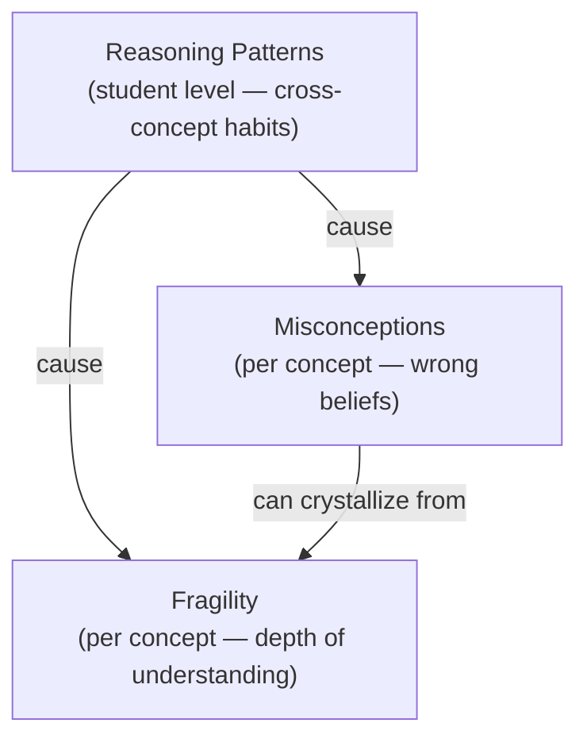
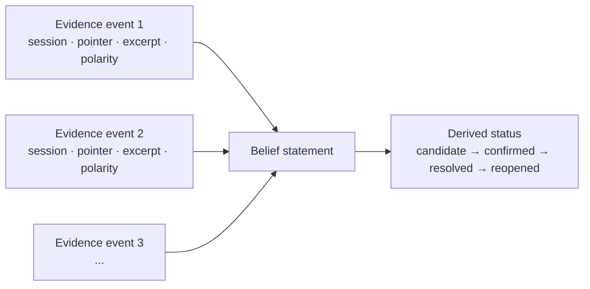
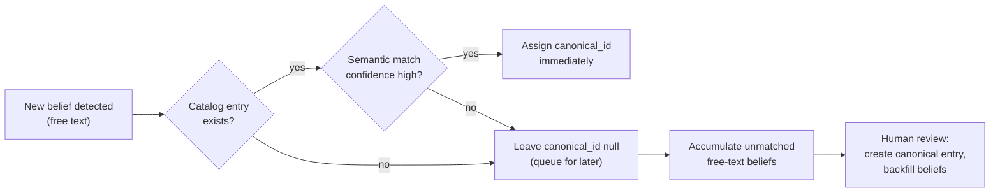
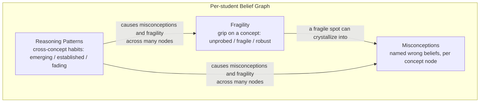
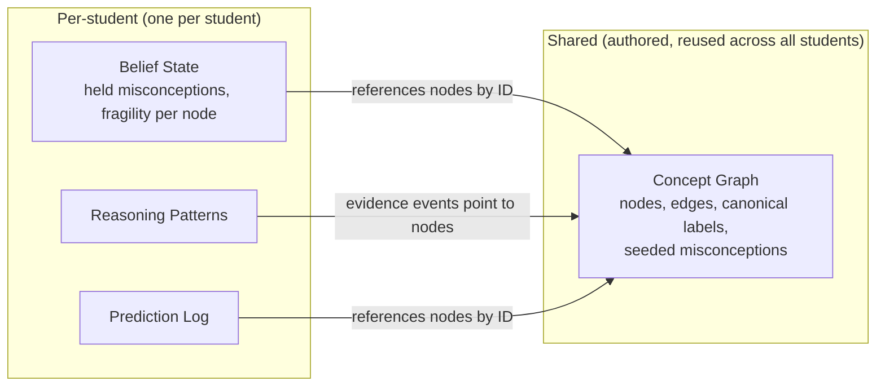

Mọi tutoring system (hệ thống gia sư) đều theo dõi xem học sinh trả lời câu hỏi đúng hay không. Stemolly theo dõi một tầng sâu hơn: *học sinh thực sự tin điều gì*, niềm tin đó vững đến đâu, và những thói quen tư duy nào gây ra lỗi trên nhiều chủ đề cùng lúc. Trang này giải thích data model (mô hình dữ liệu) giúp điều đó trở thành hiện thực — ba lớp riêng biệt, một graph thống nhất cho mỗi học sinh, tất cả đều được dựng từ evidence được lưu giữ qua nhiều phiên học.

## Ba lớp hiểu biết

Mental model không phải là một điểm số. Nó là một graph gồm ba lớp chồng lên nhau, mỗi lớp trả lời một câu hỏi khác nhau về cách học sinh suy nghĩ.

| Lớp | Nó nắm bắt điều gì | Nó nằm ở đâu |
|---|---|---|
| **Misconceptions** | Các niềm tin sai cụ thể, có tên | Trên từng concept node, cho từng học sinh |
| **Fragility** | Mức độ sâu thực sự đằng sau các câu trả lời đúng | Trên từng concept node, cho từng học sinh |
| **Reasoning patterns** | Các thói quen xuyên chủ đề gây ra lỗi | Ở cấp học sinh, trải trên mọi concept |

Ba lớp này không tách rời nhau. Một fragility probe — hỏi *vì sao điều này đúng?* trong một ngữ cảnh lạ — thường sẽ làm lộ ra một misconception cụ thể. Và cả fragility lẫn misconceptions nhiều khi đều lần về cùng một reasoning pattern: một học sinh không bao giờ tự kiểm tra bài làm sẽ có kiến thức mong manh ở nhiều mảng cùng lúc.

### Misconceptions

Một misconception là một niềm tin sai cụ thể, được ghi lại dưới dạng một phát biểu gắn với phiên học nơi nó được quan sát lần đầu — ví dụ, *"believes (a+b)² = a² + b²"*. Nó chỉ được đánh dấu là đã giải quyết khi học sinh thể hiện được lập luận đúng một cách tự nhiên trong một ngữ cảnh **mới**. Trả lời đúng một câu quen thuộc là chưa đủ; việc giải quyết phải cho thấy học sinh có thể chuyển được khái niệm sang tình huống khác.

### Fragility

Fragility đo xem các câu trả lời đúng có phản ánh hiểu biết thật hay chỉ là nhận dạng bề mặt. Một học sinh vẫn có thể đạt điểm tốt nhờ nhận ra kiểu đề quen thuộc mà không hề hiểu *vì sao* một phương pháp lại hiệu quả. Fragility có ba trạng thái suy ra từ evidence:

- **Unprobed** — làm đúng dạng quen thuộc, nhưng chưa từng bị thử độ bền. Chưa biết mức hiểu thực sự.
- **Fragile** — đã thử độ bền và bị gãy. Học sinh không chuyển được sang ngữ cảnh mới hoặc không giải thích được lập luận của mình.
- **Robust** — đã thử độ bền và đứng vững. Chuyển được sang ngữ cảnh mới và tự giải thích được *vì sao*.

Quy tắc cốt lõi là: **unprobed tuyệt đối không được xem là robust.** Một học sinh chỉ mới làm những bài dễ và quen nhìn bề ngoài sẽ giống hệt một học sinh thực sự hiểu bài cho tới khi được kiểm tra sâu hơn. Engine phải chủ động tạo ra những thời điểm thăm dò; thiếu bằng chứng không phải là bằng chứng của sự thành thạo.

Fragility cũng được suy ra từ các evidence event, giống như misconceptions. Một điểm mong manh về sau có thể kết tinh thành một misconception có tên khi tích lũy đủ bằng chứng.

### Reasoning Patterns

Một reasoning pattern nằm sâu hơn mọi misconception trong thứ bậc chẩn đoán. Nó mô tả *cách* học sinh tiếp cận vấn đề — các thói quen như "quay lại đoán rồi thử khi bị bí" hoặc "bỏ cuộc khi hình thức bề mặt thay đổi" — chứ không phải *đang học chủ đề nào*. Vì cùng một thói quen có thể lộ ra trong đại số, đọc hiểu và các môn khác, pattern được lưu ở cấp học sinh, không gắn trên một concept node nào.

Điều này quan trọng cho việc dự đoán. Fragility dự đoán chỗ gãy ở một concept cụ thể. Reasoning pattern dự đoán chỗ gãy *theo kiểu tình huống*, bất kể chủ đề — nên engine có thể cảnh báo nguy cơ trên một chủ đề mà học sinh còn chưa bắt đầu.

:::note
Một pattern không bao giờ được "giải quyết" theo kiểu của misconception. Nó là một **xu hướng**: mạnh lên hoặc yếu đi theo thời gian và đi qua các trạng thái *emerging → established → fading*. Một lần quan sát đơn lẻ không bao giờ đủ; pattern chỉ đạt mức *established* sau nhiều lần quan sát trên các concept khác nhau — cùng một nguyên tắc trung thực như "unprobed không phải robust".
:::

Mỗi pattern còn mang một **valence** — tích cực hoặc tiêu cực. Những thói quen tốt (tự kiểm tra đáp án, tự hỏi *vì sao* trước khi áp dụng quy tắc) cũng là các pattern đáng được ghi nhận và củng cố, chứ không chỉ có điểm yếu cần sửa.

---

## Beliefs được lưu theo mô hình event-sourced

Mỗi belief trong graph — dù là một misconception hay một trạng thái fragility — đều được lưu dưới dạng **một phát biểu cộng với một danh sách append-only các evidence event**. Trạng thái hiện tại và độ tin cậy được *tính ra* từ các event đó, chứ không bao giờ được ghi trực tiếp. Đây là chủ ý thiết kế.

Mỗi evidence event mang theo:
- **Session ID** và một transcript pointer ổn định
- Một **frozen excerpt** ngắn (để kiểm tra lại bởi con người)
- Một **polarity** — event này *ủng hộ* hay *mâu thuẫn* với belief?

Hình dạng dữ liệu này mang lại cùng lúc bốn đặc tính:

1. **Auditable** — người rà soát có thể đọc đúng đoạn trích đã kích hoạt việc cập nhật belief.
2. **Resolvable** — một event mâu thuẫn sẽ đảo trạng thái suy ra sang *resolved*.
3. **Reopenable** — một event ủng hộ xuất hiện về sau sẽ mở nó lại. Không có gì bị xóa.
4. **Grounded** — mọi belief đều được chống lưng bởi bằng chứng tương tác cụ thể, không bao giờ là phỏng đoán của AI.

Reasoning patterns cũng dùng cùng khuôn event-sourced này, nhưng bằng chứng của chúng tích lũy qua nhiều phiên học và nhiều concept node, nhờ đó engine suy ra được phạm vi của pattern.

---

## Định danh misconception: hybrid catalog

Khi engine phát hiện một misconception, nó gặp một bài toán đặt tên: mô tả dạng văn bản tự do sẽ khác nhau giữa các học sinh, nên cùng một niềm tin sai có thể bị ghi bằng hàng chục cách diễn đạt khác nhau. Không có định danh chung thì không thể tổng hợp kiểu "có bao nhiêu học sinh đang có misconception này".

Stemolly dùng một **hybrid approach**:

1. **Record first** — belief luôn được ghi ngay bằng văn bản tự do, để không bỏ sót điều gì.
2. **Match if possible** — nếu đã có một mục canonical trong catalog cho concept này, engine sẽ thử semantic match và gán `canonical_id`. Nếu độ tin cậy cao thì liên kết ngay; nếu không thì để `canonical_id` là null.
3. **Promote later** — các belief dạng tự do chưa khớp sẽ tiếp tục tích lũy. Khi đủ nhiều mục cùng mô tả một misconception, con người sẽ rà soát, tạo canonical entry và backfill cho các belief đã khớp.

Catalog **khởi đầu là rỗng**. Những belief ban đầu hoàn toàn là văn bản tự do. Các canonical entry lớn dần lên từ dữ liệu học sinh thật, chứ không đến từ việc biên soạn sẵn từ trước. Cách này tránh được kiểu thất bại của một catalog cố định vốn mù trước những misconception mới mà tác giả không lường trước.

:::caution
Auto-match chỉ chạy với các catalog entry đã được con người phê duyệt. Nếu tạo entry mới từ một kết quả khớp thiếu chắc chắn thì các số liệu tổng hợp phía sau có thể bị sai lệch. Vì vậy, *promotion* (tạo canonical entry mới) cần con người phê duyệt trong giai đoạn MVP.
:::

Reasoning patterns cũng dùng cùng mô hình hybrid này nhưng **nghiêng mạnh hơn về catalog**. Tập hợp các reasoning pattern có thể có là nhỏ và tương đối ổn định — không giống sự đa dạng gần như vô tận của misconceptions — nên pattern hầu như luôn được ghép với một catalog entry có sẵn; văn bản tự do chỉ dùng cho các thói quen mới hiếm gặp.

---

## Một graph cho mỗi học sinh, trải trên mọi lĩnh vực

Mỗi học sinh có **một belief graph thống nhất** bao phủ mọi domain — Toán, Ngôn ngữ và các lĩnh vực khác — chứ không phải một graph riêng cho từng môn. Điều này là bắt buộc vì reasoning patterns có tính cắt ngang: một thói quen nông xuất hiện trong cả đại số lẫn đọc hiểu vẫn là một pattern trong cùng một model.

Hai thứ khác nhau cùng được gọi là "graph":

| | Mô tả | Dùng chung hay theo từng học sinh? |
|---|---|---|
| **Concept graph** | Các node được biên soạn, cạnh tiên quyết, nhãn canonical, misconceptions được gieo sẵn | Dùng chung cho mọi học sinh |
| **Per-student belief state** | Những misconception học sinh này đang có, fragility trên từng node, các evidence event | Theo từng học sinh; tham chiếu concept node bằng ID |

Concept graph là địa hình. Belief state của từng học sinh là vị trí của các em trên địa hình đó.

### Concept node trung tính ngôn ngữ

Định danh của một concept là một **ID trung tính ngôn ngữ**, không phải tên ở bất kỳ ngôn ngữ nào. Nhãn canonical là tiếng Anh (lingua franca cho việc đặt tên concept), còn tên hiển thị được lưu như một bản đồ bản địa hóa ngay trên dòng dữ liệu của node. Nhờ vậy, khái niệm toán học "factoring a quadratic" vẫn là cùng một node dù được dạy trong chương trình K11 tiếng Việt hay khóa SAT tiếng Anh — một node duy nhất, một nơi duy nhất để toàn bộ evidence từ mọi curriculum cùng tích lũy.

Nếu tách concept theo ngôn ngữ, hiểu biết của học sinh sẽ bị chia silo và tín hiệu chuyển giao xuyên chương trình mà belief graph được tạo ra để nắm bắt sẽ biến mất. Các misconception toán học như *(a+b)² = a²+b²* mang tính ký hiệu và về bản chất là trung tính ngôn ngữ.

### Domain và curriculum overlay

Các domain (Toán, Ngôn ngữ...) là các subgraph gần như tách biệt, hầu như không có prerequisite edge bắc qua domain. Chúng được phân vùng bên trong cùng một kho dữ liệu bằng domain tag trên từng node. Các curriculum (K11, SAT-Math, IELTS) là các **overlay** — chúng ánh xạ các concept riêng của curriculum vào các shared node, theo quan hệ nhiều-về-một khi mức độ chi tiết khác nhau, với việc ghép cặp được con người kiểm duyệt dựa trên đề xuất của AI.

Các lớp cắt ngang — reasoning patterns và prediction log — được lưu trên thực thể học sinh, không nằm trong graph, vì chúng không có một node duy nhất để cư trú.

---

## Điều học sinh thấy (và không thấy)

Trong MVP, belief graph **không có màn hình dành cho học sinh**. Nó chạy nền như bộ máy cung cấp ngữ cảnh cho Socratic AI. Giá trị mà học sinh cảm nhận đến từ chất lượng của chính bài học — cảm giác hiểu ra vấn đề, hoàn thành bài tập, có thêm insight — chứ không phải từ việc tự xem graph của mình.

Graph chỉ hiển thị trong **khu Observe của Console**, nơi đội Stemolly theo dõi để xác nhận engine đang hoạt động đúng. Việc cho học sinh nhìn thấy belief graph của chính mình được để lại cho sau này; đó là bài toán về UX và hiển thị, không phải điều kiện kỹ thuật tiên quyết của sản phẩm cốt lõi.

---

## Vì sao beliefs phải được lưu bền vững

Mental model phải được nạp ở đầu mỗi phiên học và tiếp tục được mang theo về sau. Nếu reset theo từng phiên, sản phẩm sẽ mất đi giá trị cốt lõi: khả năng theo dõi cách tư duy của học sinh *tiến hóa* theo thời gian và quay lại các misconception chưa được xử lý sau nhiều tuần. Nếu một học sinh đã giải quyết được một misconception ở một phiên nhưng sau đó thoái lui — một evidence event ủng hộ mới kích hoạt lại nó — thì hệ thống tuyệt đối không được làm mất thông tin đó.

Khẳng định cốt lõi của Stemolly là nó có thể nhìn ra *cách học sinh suy nghĩ*, chứ không chỉ nhìn đáp án các em tạo ra. Khẳng định đó sống hoàn toàn trong **belief graph** — một model bền vững theo từng học sinh, được bồi đắp qua nhiều phiên học. Graph có ba lớp: **misconceptions** (các niềm tin sai cụ thể), **fragility** (mức độ nông hay sâu thực sự của các câu trả lời đúng), và **reasoning patterns** (các thói quen sâu cắt ngang giữa các môn). Kết hợp lại, chúng cho phép Socratic AI đặt đúng câu hỏi vào đúng thời điểm, và cho phép cả đội quan sát chính xác cách tư duy của học sinh thay đổi. Nếu không có sự lưu bền vững qua các phiên học, không điều nào trong số này có thể xảy ra — reset model sau mỗi phiên sẽ phá hủy giá trị cốt lõi của sản phẩm.

## Lớp 1 — Misconceptions

Một **misconception** là một niềm tin sai cụ thể, có tên, mà một học sinh đang có về một concept. Ví dụ: *believes (a+b)² = a²+b²*. Nó được gắn với phiên học nơi nó được quan sát lần đầu. Việc giải quyết một misconception đòi hỏi nhiều hơn một đáp án đúng — học sinh phải thể hiện được lập luận đúng một cách tự nhiên trong một ngữ cảnh *mới*, vì một học sinh vẫn có thể cho ra đáp án đúng bằng ghi nhớ máy móc mà không thật sự hiểu.

### Cách beliefs được lưu — event sourcing

Mỗi misconception được lưu dưới dạng một phát biểu cộng với một **append-only list của evidence event**. Trạng thái hiện tại được *suy ra* từ các event đó; nó không bao giờ được ghi trực tiếp. Mỗi event ghi lại:

- phiên học mà nó đến từ
- một stable pointer vào transcript
- một frozen excerpt ngắn (để kiểm tra)
- một polarity — event này *ủng hộ* hay *mâu thuẫn* với belief?

Thiết kế này giúp beliefs luôn có thể kiểm toán, luôn có bằng chứng chống lưng, và luôn có thể được mở lại. Nếu một học sinh đã giải quyết xong một misconception nhưng về sau lại bộc lộ niềm tin sai đó, một supporting event mới sẽ tự động bỏ trạng thái đã giải quyết. Không có gì bị xóa. Vòng đời là: **candidate → confirmed → resolved → reopened**.

### Định danh misconception — mô hình hybrid

Việc nhận diện "cùng một misconception" giữa các học sinh khó hơn vẻ ngoài rất nhiều. Hai học sinh có thể cùng mang một niềm tin sai nhưng diễn đạt bằng những câu hoàn toàn khác nhau. Có hai lựa chọn cực đoan — chỉ dùng văn bản tự do (linh hoạt nhưng không thể tổng hợp) và dùng một catalog cố định dựng sẵn (dễ đếm nhưng mù với các misconception mới). Stemolly dùng mô hình **hybrid**:

1. Engine luôn ghi niềm tin sai ở dạng **free text** trước tiên. Không điều gì bị mất.
2. Mỗi belief cũng mang một `canonical_id` có thể null để liên kết nó với một mục trong **shared catalog** khi có sẵn.
3. MVP bắt đầu với một **catalog rỗng**. Canonical entry sẽ được tạo về sau, từ các mẫu lặp lại trong dữ liệu học sinh thực.

Catalog phát triển qua hai bước riêng:

- **Auto-match** — khi một belief mới được ghi lại và đã có sẵn catalog entry phù hợp, engine sẽ thử semantic match. Nếu độ tin cậy cao, nó gán `canonical_id` ngay; nếu không thì để null.
- **Promote** — các belief dạng tự do chưa khớp sẽ tiếp tục tích lũy. Khi nhiều belief tụ quanh cùng một ý sai, một người trong nhóm sẽ rà soát và phê duyệt việc tạo một catalog entry mới, rồi back-fill các belief hiện có bằng ID đó.

Auto-match chạy ngay từ ngày đầu vì việc ghép vào một entry đã được con người phê duyệt là an toàn. Promote thì làm thủ công trong MVP — nhóm đã sẵn đọc transcript, khối lượng còn nhỏ, và một lần gộp sai sẽ làm hỏng mọi số liệu phía sau. Về sau, LLM có thể đề xuất các cụm, nhưng một người trong Console vẫn luôn là bên phê duyệt. Console cần một **hàng đợi rà soát "unmatched misconceptions"** để phục vụ quy trình này.

## Lớp 2 — Fragility

**Fragility** trả lời một câu hỏi khác với misconceptions: không phải *niềm tin này có sai không?* mà là *niềm tin đúng này có sâu hay chỉ là bề mặt?*

Một học sinh luôn trả lời đúng vẫn có thể chỉ đang pattern-matching — áp dụng một quy tắc bề mặt đã học thuộc mà không hiểu vì sao nó hiệu quả. Fragility tách khỏi mastery score chính vì một học sinh điểm cao vẫn có thể mong manh.

Fragility là **thuộc tính về độ bám của một học sinh trên một concept node**. Nó có ba trạng thái suy ra:

| Trạng thái | Ý nghĩa |
|---|---|
| **Unprobed** | Làm đúng dạng quen thuộc nhưng chưa từng bị thử độ bền — chưa biết thực sự hiểu tới đâu |
| **Fragile** | Đã thử độ bền và bị gãy — thất bại ở bài chuyển ngữ cảnh hoặc không giải thích được vì sao |
| **Robust** | Đã thử độ bền và đứng vững — chuyển được sang ngữ cảnh mới và tự giải thích được vì sao |

Quy tắc cốt lõi là: **unprobed tuyệt đối không được xem là robust.** Một người chỉ khớp mẫu và một người thực sự hiểu bài trông hoàn toàn giống nhau cho đến khi một trong hai được thăm dò. Thiếu bằng chứng thăm dò có nghĩa là *unprobed*, không phải *robust*. AI phải chủ động khơi ra fragility — bằng cách áp dụng khái niệm vào ngữ cảnh bất ngờ, hoặc hỏi "vì sao điều này đúng?" — trước khi engine có thể kết luận rằng điều gì đó là robust.

Fragility và misconceptions nuôi lẫn nhau. Một điểm mong manh bị thăm dò rồi gãy có thể kết tinh thành một misconception có tên. Vì vậy, hai lớp này không độc lập.

## Lớp 3 — Reasoning Patterns

Một **reasoning pattern** nằm *bên dưới* misconceptions và fragility trong hệ thứ bậc chẩn đoán. Chỉ một pattern — ví dụ *quay sang đoán rồi thử khi bị bí* hoặc *bỏ cuộc khi hình thức bề mặt thay đổi* — có thể tạo ra cả niềm tin sai lẫn hiểu biết nông trên nhiều concept node cùng lúc. Bởi vậy, sửa một pattern có thể giúp trên nhiều chủ đề cùng lúc, và đó là lý do lớp này tồn tại riêng.

Reasoning patterns là **domain-general**: cùng một thói quen sẽ trông như nhau dù học sinh đang làm đại số hay đọc hiểu. Chúng thuộc về học sinh như một tổng thể, không thuộc về riêng một concept nào.

### Xu hướng, không phải công tắc

Khác với misconception (được giải quyết như một công tắc tắt đi), reasoning pattern là một *thói quen* — thứ mà học sinh làm nhiều hơn hoặc ít hơn theo thời gian. Vì thế, nó được mô hình hóa như một **xu hướng**:

- một **strength** có trọng số theo độ gần đây (học sinh thể hiện hành vi này nhất quán đến mức nào)
- một **status** suy ra: *emerging*, *established* hoặc *fading* — không bao giờ là *resolved*, chỉ có yếu đi

Một lần xuất hiện không tạo thành pattern. Pattern chỉ đạt mức *established* sau nhiều lần quan sát trên các concept khác nhau. Quy tắc trung thực này là họ hàng với nguyên tắc "unprobed không phải robust" của fragility — một điểm dữ liệu không chứng minh được gì cả.

Mỗi pattern cũng mang một **valence**: *productive* hoặc *unproductive*. Những thói quen tốt (tự kiểm tra đáp án, tự hỏi vì sao trước khi áp dụng quy tắc) là các pattern đáng được ghi nhận và củng cố, chứ không chỉ là điểm yếu cần sửa.

### Định danh — hybrid nghiêng về catalog

Vì tập hợp các reasoning pattern có thể có là nhỏ và ổn định hơn nhiều — khác với sự phong phú gần như vô tận của các misconception gắn với nội dung — nên định danh cho pattern dựa nặng vào một **canonical catalog** dựng sẵn. Văn bản tự do chỉ thỉnh thoảng mới dùng, để bắt lấy một pattern mới hiếm gặp. Điều này đối lập với trường hợp misconception, nơi văn bản tự do là hình thức chính còn việc khớp catalog chỉ là thứ cấp.

### Dự đoán xuyên môn

Fragility dự đoán chỗ gãy ở *một concept cụ thể*. Reasoning pattern dự đoán chỗ gãy theo *kiểu tình huống*, bất kể chủ đề. Ví dụ, một học sinh có pattern *established* là bỏ cuộc khi hình thức bề mặt thay đổi sẽ có khả năng gặp khó với bất kỳ bài toán nào trông lạ — kể cả trong một môn mà em còn chưa bắt đầu. Khả năng dự đoán xuyên môn này là một trong những minh chứng mạnh nhất cho giá trị của belief graph so với một bộ theo dõi hoàn thành đơn giản.

Dù pattern được lưu ở cấp học sinh, mỗi evidence event vẫn ghi lại nó đến từ concept nào. Nhờ vậy, phạm vi của pattern — có tính toàn cục hay chỉ khu trú ở một mảng môn học — được rút ra từ bằng chứng tích lũy, chứ không bị tuyên bố trước.

## Graph được lưu như thế nào

### Một graph cho mỗi học sinh, trải trên mọi môn

Mỗi học sinh có một belief graph thống nhất bao phủ mọi domain — Toán, Ngôn ngữ, v.v. — chứ không có graph riêng cho từng môn. Điều này là bắt buộc vì reasoning patterns có tính domain-general và vốn đã sống ở cấp học sinh. Một thói quen nông xuất hiện cả trong đại số lẫn đọc hiểu vẫn là một pattern trong cùng một model. Nếu tách graph theo môn, tín hiệu đó sẽ bị chia silo.

### Cấu trúc concept dùng chung vs. belief state theo từng học sinh

Hai thứ đều được gọi là "graph", nhưng chúng khác nhau:

- **Concept graph** là cấu trúc dùng chung đã được biên soạn: các node với cạnh tiên quyết, nhãn canonical và seeded misconceptions. Nó gọn nhẹ và tái sử dụng được cho mọi học sinh.
- **Per-student belief state** (học sinh *này* đang có misconception nào, fragility trên từng node ra sao) tham chiếu concept node bằng ID. Nó không được lưu ngay trên graph node.
- Mọi phần cắt ngang — reasoning patterns và prediction log — được lưu trên thực thể học sinh, không nằm trong graph. Một reasoning pattern không có một node duy nhất để đặt vào; ép nó vào graph sẽ buộc phải nhân bản trên mọi concept mà nó chạm tới.

Trong cùng một kho dữ liệu, các domain được phân vùng bằng một tag `domain/subject` trên từng node. Các curriculum (K11, SAT-Math, IELTS) là các **overlay** — chúng ánh xạ các curriculum concept vào shared node, theo quan hệ nhiều-về-một khi độ chi tiết khác nhau, với việc ghép cặp được con người xác nhận dựa trên đề xuất của AI.

### Định danh concept trung tính ngôn ngữ

Định danh của một concept node là một **ID trung tính ngôn ngữ**, không phải tên ở bất kỳ ngôn ngữ nào. Nhãn canonical là tiếng Anh; tên hiển thị được bản địa hóa cho Console. Cách này giữ nguyên một node cho mỗi concept bất kể nó được dạy bằng ngôn ngữ nào. Khái niệm toán học "factoring a quadratic" vẫn là cùng một node dù được dạy trong lớp K11 tiếng Việt hay khóa SAT tiếng Anh. Nếu lưu các node riêng theo từng ngôn ngữ cho cùng một concept, hiểu biết của học sinh sẽ bị chia silo và tín hiệu chuyển giao xuyên curriculum mà belief graph được tạo ra để nắm bắt sẽ biến mất.

## Trong MVP — chỉ ở backend

Trong MVP, belief graph chạy hoàn toàn ở nền. Không có màn hình nào hiển thị cho học sinh. Học sinh cảm nhận engine thông qua chất lượng của chính cuộc đối thoại Socratic — cảm giác được hiểu đúng, được làm đúng bài vào đúng thời điểm — chứ không phải bằng cách nhìn vào graph của mình.

Graph chỉ hiển thị trong **khu Observe của Console**. Ở MVP-1, người dùng chính là đội Stemolly, những người dùng nó để xác nhận engine đang hoạt động chính xác. Việc hiển thị graph cho học sinh được để lại cho sau và được xem là một mối quan tâm về UX, không phải ràng buộc kỹ thuật.

Để biết chi tiết về cách engine cập nhật graph trong một phiên học, xem [Triển khai Engine](./engine-impl/). Còn cách độ chính xác của graph được kiểm tra, xem [Kiểm định Engine](./engine-validation.md).
