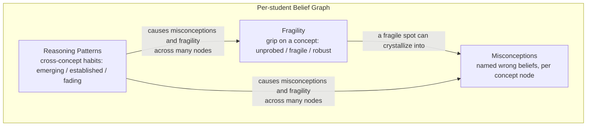
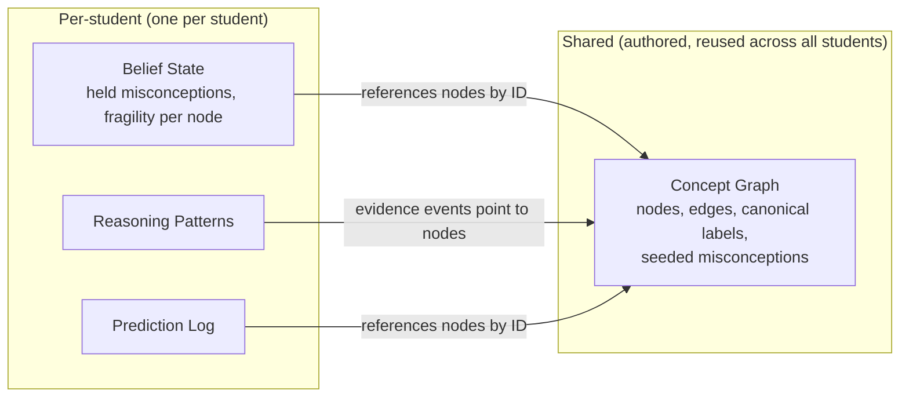

# Thiết kế mô hình tư duy

Tuyên bố cốt lõi của Stemolly là hệ thống có thể nhìn ra *cách một học sinh tư duy*, chứ không chỉ những đáp án các em đưa ra. Tuyên bố đó nằm trọn trong **belief graph** (đồ thị niềm tin) — một mô hình bền vững cho từng học sinh, được bồi đắp qua nhiều phiên học. Đồ thị này có ba lớp: **misconceptions** (những niềm tin sai cụ thể), **fragility** (độ nông sâu thực sự của những câu trả lời đúng), và **reasoning patterns** (các thói quen lập luận xuyên suốt nhiều môn). Kết hợp lại, chúng giúp Socratic AI đặt đúng câu hỏi vào đúng thời điểm, đồng thời cho phép đội ngũ quan sát chính xác cách tư duy của một học sinh thay đổi theo thời gian. Nếu không có tính bền vững qua nhiều phiên, toàn bộ điều này sẽ không thể xảy ra — đặt lại mô hình sau mỗi phiên sẽ xóa bỏ giá trị cốt lõi của sản phẩm.

## Lớp 1 — Misconceptions

Một **misconception** là một niềm tin sai cụ thể, có tên gọi rõ ràng, mà một học sinh nắm giữ về một concept (khái niệm). Ví dụ: *believes (a+b)² = a²+b²*. Nó được gắn với phiên học nơi nó lần đầu được quan sát thấy. Để giải quyết một misconception, chỉ trả lời đúng là chưa đủ — học sinh phải thể hiện được lập luận đúng mà không cần gợi ý trong một ngữ cảnh *mới*, vì một em vẫn có thể cho ra đáp án đúng nhờ học thuộc mà không thật sự hiểu.

### Cách lưu belief — event sourcing (ghi nhận theo chuỗi sự kiện)

Mỗi misconception được lưu dưới dạng một phát biểu đi kèm với **append-only list of evidence events** (danh sách sự kiện bằng chứng chỉ thêm vào). Trạng thái hiện tại được *suy ra* từ các sự kiện đó; nó không bao giờ được ghi trực tiếp. Mỗi sự kiện ghi lại:

- phiên học mà nó xuất phát từ đó
- một con trỏ ổn định vào transcript
- một đoạn trích ngắn được cố định lại (để audit)
- một polarity — sự kiện này *ủng hộ* hay *mâu thuẫn* với belief?

Thiết kế này đảm bảo belief luôn có thể audit, luôn có bằng chứng hậu thuẫn, và luôn có thể mở lại. Nếu một học sinh đã giải quyết xong một misconception nhưng sau đó lại bộc lộ niềm tin sai ấy, một sự kiện ủng hộ mới sẽ tự động khiến nó không còn được xem là đã giải quyết. Không có gì bị xóa. Vòng đời diễn ra theo chuỗi: **candidate → confirmed → resolved → reopened**.

### Định danh misconception — mô hình lai

Việc nhận diện "cùng một misconception" giữa các học sinh khó hơn vẻ ngoài rất nhiều. Hai học sinh có thể giữ đúng cùng một niềm tin sai nhưng diễn đạt bằng những lời hoàn toàn khác nhau. Có hai lựa chọn cực đoan — hoàn toàn dùng free text (văn bản tự do; linh hoạt nhưng gần như không thể tổng hợp) và dùng một catalog (danh mục) cố định được dựng sẵn (dễ đếm nhưng mù trước các misconception mới). Stemolly dùng một **hybrid**:

1. Engine luôn ghi niềm tin sai dưới dạng **free text** trước tiên. Không điều gì bị đánh mất.
2. Mỗi belief cũng mang một `canonical_id` có thể để trống, liên kết nó với một mục trong **shared catalog** khi đã có.
3. MVP khởi đầu với một **empty catalog**. Các mục canonical chỉ được tạo về sau, từ những mẫu hình quan sát được trong dữ liệu học sinh thực tế.

Catalog được mở rộng qua hai bước tách biệt:

- **Auto-match** — khi một belief mới được ghi nhận và đã có sẵn một mục phù hợp trong catalog, engine sẽ thử so khớp theo ngữ nghĩa. Nếu độ tin cậy cao, nó gán `canonical_id` ngay; nếu không, trường này được để trống.
- **Promote** — các belief free-text chưa khớp sẽ tích lũy dần. Khi nhiều belief bắt đầu tụ quanh cùng một ý sai, một người trong đội ngũ sẽ xem lại và phê duyệt việc tạo mục catalog mới, rồi điền ngược id đó vào các belief hiện có.

Auto-match chạy ngay từ ngày đầu vì so khớp với một mục đã được con người duyệt là an toàn. Promote được làm thủ công trong MVP — đội ngũ vốn đã đọc transcript, sản lượng còn nhỏ, và một lần gộp sai sẽ làm hỏng mọi thống kê phía sau. Về sau, một LLM có thể đề xuất các cụm, nhưng luôn phải có con người trong Console phê duyệt. Console cần một **"unmatched misconceptions" review queue** cho quy trình này.

## Lớp 2 — Fragility

**Fragility** trả lời một câu hỏi khác với misconceptions: không phải *niềm tin này có sai không?* mà là *niềm tin đúng này sâu hay nông?*

Một học sinh luôn trả lời đúng vẫn có thể chỉ đang pattern-matching (khớp mẫu) — áp một quy tắc bề mặt đã học thuộc mà không hiểu vì sao nó đúng. Fragility được tách riêng khỏi mastery score (điểm thành thạo) chính vì một học sinh điểm cao vẫn có thể fragile.

Fragility là **thuộc tính về độ nắm chắc của một học sinh với một concept node**. Nó có ba trạng thái được suy ra:

| Trạng thái | Ý nghĩa |
|---|---|
| **Unprobed** | Làm đúng với dạng quen thuộc, nhưng chưa từng bị stress-tested — mức độ hiểu vẫn chưa rõ |
| **Fragile** | Đã bị stress-tested và bị vỡ — thất bại ở transfer tasks hoặc không giải thích được vì sao |
| **Robust** | Đã bị stress-tested và vẫn đứng vững — chuyển được sang ngữ cảnh mới và tự giải thích được vì sao |

Quy tắc cốt lõi phải giữ là: **unprobed tuyệt đối không được xem như robust.** Một em pattern-matching và một em thật sự hiểu sẽ trông giống hệt nhau cho đến khi một trong hai em bị kiểm tra sâu. Thiếu bằng chứng từ probe nghĩa là *unprobed*, không phải *robust*. AI phải chủ động khơi ra fragility — bằng cách yêu cầu áp dụng concept vào ngữ cảnh bất ngờ, hoặc hỏi "vì sao cách này đúng?" — trước khi engine có thể kết luận điều gì là robust.

Fragility và misconceptions nuôi lẫn nhau. Một điểm fragile khi bị probe rồi gãy có thể kết tinh thành một misconception có tên rõ ràng. Vì thế hai lớp này không độc lập với nhau.

## Lớp 3 — Reasoning Patterns

Một **reasoning pattern** nằm *bên dưới* misconceptions và fragility trong hệ phân cấp chẩn đoán. Một pattern duy nhất — chẳng hạn *reverts to guess-and-check when stuck* hoặc *gives up when the surface form changes* — có thể gây ra niềm tin sai và hiểu nông ở rất nhiều concept node cùng lúc. Vì vậy, sửa được một pattern có thể giúp trên nhiều chủ đề cùng lúc, và đó là lý do lớp này tồn tại tách riêng.

Reasoning patterns là **domain-general** (xuyên lĩnh vực): cùng một thói quen sẽ trông giống nhau dù học sinh đang làm đại số hay đọc hiểu. Chúng thuộc về cả học sinh, chứ không gắn với riêng concept nào.

### Tendency (xu hướng), không phải công tắc

Khác với một misconception (được giải quyết như một công tắc tắt đi), một reasoning pattern là một *thói quen* — thứ mà học sinh thể hiện nhiều hoặc ít hơn theo thời gian. Vì vậy nó được mô hình hóa như một **tendency**:

- một **strength** (độ mạnh) được tính có trọng số theo độ gần đây (mức độ học sinh thể hiện hành vi đó một cách nhất quán đến đâu)
- một **status** (trạng thái) được suy ra: *emerging*, *established*, hoặc *fading* — không bao giờ là *resolved*, chỉ là yếu đi

Một lần quan sát đơn lẻ chưa tạo thành pattern. Một pattern chỉ đạt đến mức *established* sau nhiều lần quan sát trên các concept khác nhau. Quy tắc trung thực này là họ hàng với nguyên tắc "unprobed is not robust" của fragility — một điểm dữ liệu đơn lẻ không chứng minh được gì.

Mỗi pattern cũng có một **valence** (khuynh hướng giá trị): *productive* hoặc *unproductive*. Những thói quen tốt (tự kiểm tra lại đáp án, hỏi vì sao trước khi áp dụng một quy tắc) cũng là pattern đáng được ghi nhận và củng cố, chứ không chỉ có điểm yếu cần sửa.

### Định danh — mô hình lai nghiêng về catalog

Vì tập reasoning patterns có thể có là nhỏ và ổn định — khác với sự đa dạng gần như vô hạn của các misconception gắn với nội dung cụ thể — nên việc định danh pattern nghiêng mạnh về một **pre-made canonical catalog**. Chỉ thỉnh thoảng mới dùng free text, nhằm bắt các pattern mới hiếm gặp. Điều này đối lập với trường hợp misconception, nơi free text là dạng chính còn việc so khớp catalog chỉ là thứ yếu.

### Dự đoán xuyên môn

Fragility dự đoán một lần gãy ở *một concept cụ thể*. Một reasoning pattern dự đoán một lần gãy theo *kiểu tình huống*, bất kể chủ đề. Ví dụ, một học sinh có pattern *established* là bỏ cuộc khi hình thức bề mặt thay đổi thì nhiều khả năng sẽ gặp khó với bất kỳ bài toán nào trông lạ — kể cả ở một môn các em còn chưa học. Khả năng dự đoán xuyên môn này là một trong những màn trình diễn rõ nhất cho giá trị của belief graph so với một completion tracker (bộ theo dõi hoàn thành) đơn giản.

Dù pattern được lưu ở cấp học sinh, mỗi evidence event vẫn ghi lại concept mà nó xuất phát từ đó. Điều này khiến phạm vi của pattern — toàn cục hay chỉ khu trú trong một mảng môn học — dần hiện ra từ bằng chứng tích lũy, thay vì bị khai báo sẵn ngay từ đầu.

## Cách đồ thị được lưu trữ

### Một đồ thị cho mỗi học sinh, xuyên suốt mọi môn

Mỗi học sinh có một belief graph thống nhất bao trùm mọi lĩnh vực — Mathematics, Language, v.v. — chứ không phải một đồ thị riêng cho từng môn. Điều này là bắt buộc vì reasoning patterns là domain-general và vốn đã nằm ở cấp học sinh. Một thói quen nông xuất hiện ở cả đại số lẫn đọc hiểu là một pattern duy nhất trên một mô hình duy nhất. Nếu tách đồ thị theo môn, tín hiệu đó sẽ bị chia silo.

### Cấu trúc concept dùng chung vs. belief state theo từng học sinh

Có hai thứ đều được gọi là "graph", nhưng chúng khác nhau:

- **Concept graph** là cấu trúc dùng chung do đội ngũ biên soạn: các node với các cạnh tiên quyết, canonical labels, và seeded misconceptions. Nó gọn nhẹ và có thể tái sử dụng cho mọi học sinh.
- **Per-student belief state** (những misconception mà *học sinh này* đang giữ, cùng fragility theo từng node) tham chiếu đến các concept node bằng ID. Nó không được lưu ngay trên chính graph node.
- Mọi thứ mang tính cắt ngang — reasoning patterns và prediction log — đều được lưu trên học sinh, không nằm trong graph. Một reasoning pattern không có một node đơn lẻ nào để "ở" trên đó; nếu lưu nó trong graph thì sẽ buộc phải nhân bản ra mọi concept mà nó chạm tới.

Trong cùng một kho lưu trữ, các domain được phân vùng bằng một thẻ `domain/subject` trên mỗi node. Các curriculum (K11, SAT-Math, IELTS) là **overlays** — chúng ánh xạ các concept của chương trình học lên các node dùng chung, có thể là nhiều-về-một khi độ chi tiết khác nhau, và được con người ghép nối dựa trên đề xuất của AI.

### Định danh concept trung lập ngôn ngữ

Danh tính của một concept node là một **language-neutral ID** (ID trung lập ngôn ngữ), không phải tên bằng bất kỳ ngôn ngữ nào. Canonical label là tiếng Anh; display names được bản địa hóa cho Console. Cách này giữ lại một node duy nhất cho mỗi concept bất kể nó được dạy bằng ngôn ngữ nào. Khái niệm toán học "factoring a quadratic" vẫn là cùng một node dù được dạy trong lớp K11 tiếng Việt hay khóa SAT tiếng Anh. Nếu lưu các node tách riêng theo ngôn ngữ cho cùng một concept, hệ thống sẽ chia silo phần hiểu biết của học sinh và phá hỏng tín hiệu chuyển giao xuyên chương trình học mà belief graph được tạo ra để nắm bắt.

## Trong MVP — Chỉ ở Backend

Trong MVP, belief graph vận hành hoàn toàn ở hậu trường. Không có màn hình nào được hiển thị cho học sinh. Học sinh trải nghiệm engine thông qua chính chất lượng của cuộc đối thoại Socratic — cảm giác được hiểu đúng, được giải đúng bài toán vào đúng thời điểm — chứ không phải bằng cách nhìn vào graph của mình.

Graph chỉ hiển thị trong **Observe area** của Console. Ở MVP-1, nhóm người dùng chính là đội ngũ Stemolly, những người dùng nó để xác nhận engine đang hoạt động đúng. Việc hiển thị graph cho học sinh được để lại cho giai đoạn sau và được xem là một bài toán UX về sau, không phải một ràng buộc kỹ thuật.

Để biết chi tiết về cách engine cập nhật graph trong một phiên, xem [Triển khai Engine](./engine-impl.md). Để biết cách kiểm tra độ chính xác của graph, xem [Kiểm định Engine](./engine-validation.md).
