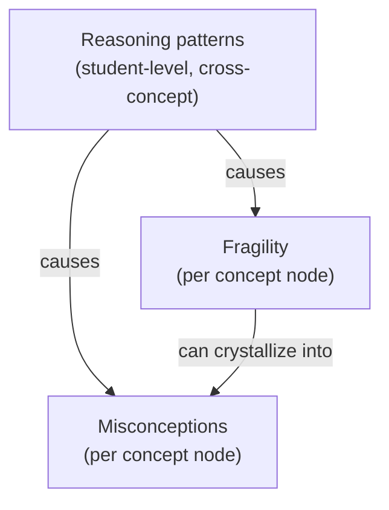
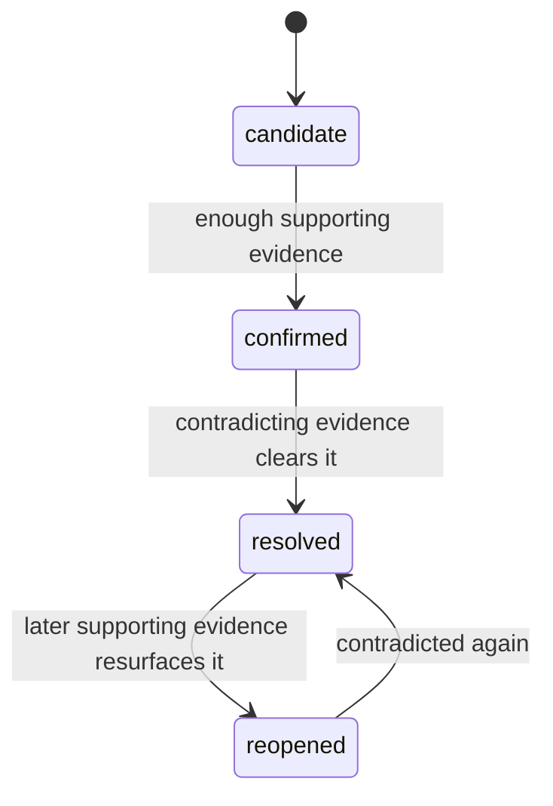
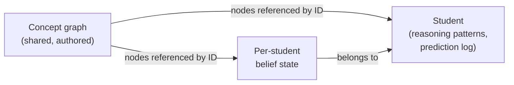

AI kiểu Socrates của Stemolly không chỉ theo dõi học sinh đã hoàn thành những gì. Nó xây dựng một **mental model** (mô hình nhận thức) sống động — một bức tranh có cấu trúc về cách học sinh đó suy nghĩ — và mang nó theo xuyên suốt mọi phiên học. Trang này giải thích mental model được thiết kế như thế nào, vì sao từng phần lại có hình dạng như vậy, và dữ liệu thực tế trông ra sao.

## Ba lớp, không phải một con số duy nhất

Mental model của một học sinh gồm ba lớp tách biệt. Kết hợp lại, chúng trả lời được câu hỏi mà một điểm số hoàn thành không thể trả lời: *học sinh này thực sự hiểu, hay chỉ đang pattern-matching (khớp mẫu)?*

**Misconceptions** (những niềm tin sai cụ thể) là các niềm tin sai đã được gọi tên — ví dụ, "believes (a+b)² = a²+b²". Mỗi misconception được gắn với phiên học nơi nó lần đầu được quan sát thấy. Một misconception chỉ được xem là đã được xử lý khi học sinh thể hiện được cách lập luận đúng, không cần gợi ý, trong một ngữ cảnh *mới* — chứ không chỉ trong đúng kiểu bài mà nó bị phát hiện.

**Fragility** (độ mong manh) là một thuộc tính của mức độ nắm chắc một khái niệm của học sinh. Học sinh có thể làm đúng nhờ nhận ra một mẫu quen thuộc mà không hiểu vì sao nó đúng. Fragility phơi bày khoảng trống đó. Nó có ba trạng thái suy ra:

| State | Meaning |
|---|---|
| `unprobed` | Làm đúng với dạng quen thuộc nhưng chưa từng bị kiểm tra sức bền — chưa biết có thật sự hiểu hay không |
| `fragile` | Đã bị kiểm tra sức bền và bị vỡ — không chuyển được sang ngữ cảnh khác hoặc không giải thích được vì sao |
| `robust` | Đã bị kiểm tra sức bền và vẫn đứng vững — chuyển được sang ngữ cảnh khác và tự giải thích được |

Nguyên tắc cốt lõi là: **`unprobed` tuyệt đối không được xem như `robust`.** Một pattern-matcher trông giống hệt người thật sự hiểu cho đến khi **engine** (bộ máy) thực sự thăm dò. Không có bằng chứng từ việc thăm dò nghĩa là chưa biết, không phải là an toàn.

**Reasoning patterns** (mẫu lập luận) nằm sâu hơn một lớp so với misconceptions. Chúng mô tả cách học sinh tiếp cận bài toán — ví dụ, "always reverts to guess-and-check" hoặc "gives up when the surface form looks unfamiliar" — chứ không phải học sinh đang học chủ đề nào. Vì pattern là một thói quen chứ không phải một câu trả lời sai đơn lẻ, nó cắt ngang mọi chủ đề. Sửa được một pattern có thể gỡ nút thắt cho học sinh trên nhiều khái niệm cùng lúc.

:::tip[Vì sao reasoning patterns quan trọng với dự đoán]
Fragility dự đoán rắc rối trên một khái niệm cụ thể. Reasoning pattern dự đoán rắc rối theo *loại tình huống*, bất kể chủ đề nào — nhờ đó engine có thể đoán trước khó khăn ở cả những khái niệm mà học sinh còn chưa bắt đầu.
:::

## Beliefs được lưu theo chuỗi sự kiện

Mọi **belief** (niềm tin) — dù là một misconception, một trạng thái fragility hay một reasoning pattern — đều được lưu dưới dạng **statement plus an append-only list of evidence events** (một phát biểu kèm danh sách sự kiện bằng chứng chỉ thêm vào). Trạng thái hiện tại và độ tin cậy được *suy ra* từ các sự kiện đó; chúng không bao giờ được ghi trực tiếp.

Mỗi evidence event mang theo:
- session ID và một con trỏ ổn định vào bản ghi cuộc trò chuyện
- một đoạn trích ngắn được đóng băng (để con người kiểm tra)
- một cực tính: **supports** hoặc **contradicts** belief
- dấu thời gian

Cấu trúc này giải quyết nhiều vấn đề cùng lúc. Vì không có gì bị xóa, một misconception đã được xử lý có thể được *mở lại* nếu bằng chứng về sau cho thấy học sinh tái phạm. Các con trỏ vào transcript cho phép đội ngũ kiểm tra xem các phát hiện của AI có thật sự bám vào điều học sinh đã nói hay không. Và trạng thái của bất kỳ belief nào cũng đi theo một vòng đời rõ ràng:

Fragility cũng đi theo cùng mẫu bằng chứng đó: các chuyển trạng thái `unprobed → fragile → robust` cũng được suy ra từ sự kiện, không được ghi trực tiếp.

## Cách định danh misconception hoạt động

Khi engine phát hiện một misconception, nó đối mặt với một bài toán đặt tên: hai học sinh có thể mô tả cùng một niềm tin sai bằng những cách khác nhau. Nếu chỉ lưu văn bản tự do thì không thể tổng hợp được (vì cách diễn đạt khác nhau); còn nếu dựng sẵn một **taxonomy** (hệ phân loại) hoàn chỉnh ngay từ đầu thì sẽ mù trước các misconception mới mà tác giả nội dung chưa từng lường trước.

Giải pháp là một **hybrid identity model** (mô hình định danh lai): engine luôn ghi lại belief trước hết dưới dạng **free text** (văn bản tự do), để không bao giờ bỏ sót gì, rồi sau đó có thể liên kết nó với một **canonical catalog entry** (mục chuẩn trong danh mục) thông qua trường `canonical_id`. MVP bắt đầu với một catalog rỗng — `canonical_id` sẽ là null cho mọi belief ban đầu. Các mục chuẩn sẽ được tạo sau, từ dữ liệu học sinh thật.

Catalog phát triển qua hai thời điểm tách biệt:

1. **Match** — khi một belief mới được ghi nhận và đã có sẵn một mục tương ứng trong catalog, engine sẽ thử so khớp ngữ nghĩa. Nếu độ tin cậy cao, nó gán `canonical_id` ngay; nếu không thì để null.
2. **Promote** — các belief dạng free-text chưa khớp sẽ tích lũy dần. Khi có nhiều belief cùng mô tả một misconception, con người sẽ tạo một mục chuẩn và điền ngược vào các belief hiện có. Ở MVP, bước promote này làm thủ công; về sau, một **LLM clustering job** (tác vụ gom cụm bằng LLM) có thể *đề xuất* các nhóm, nhưng luôn phải có con người trong Console phê duyệt trước khi bất kỳ lần gộp nào được thực hiện.

Lý do bước promote phải có chốt chặn con người: một lần gộp tự động sai sẽ làm nhiễm bẩn mọi số đếm phía sau vốn dùng mục chuẩn đó làm khóa.

## Reasoning patterns có định danh khác

Reasoning patterns cũng dùng cùng cách tiếp cận lai, nhưng nghiêng mạnh hơn nhiều về một **pre-made catalog** (danh mục dựng sẵn). Lý do là tập các reasoning pattern khả dĩ thì nhỏ và ổn định — các thói quen như "guesses instead of reasoning" hay "never self-checks" được nhận ra trên mọi môn với cùng một cách gọi. Free text chỉ dành cho trường hợp hiếm khi xuất hiện một pattern mới mà catalog chưa bao phủ.

Một pattern cũng được mô hình hóa khác với misconception. Nó là một **tendency** (xu hướng) — một thói quen mà học sinh thể hiện ít hay nhiều lần — chứ không phải một công tắc bật/tắt. Vì vậy, hình dạng của nó là:

- một **strength** (độ mạnh) có trọng số theo độ gần đây của quan sát
- một **status** (trạng thái) suy ra: `emerging → established → fading` — không bao giờ là "resolved", chỉ là yếu đi

Một lần quan sát đơn lẻ chưa phải là pattern. Nó chỉ đạt `established` sau nhiều lần quan sát trên *những khái niệm khác nhau* — một nguyên tắc trung thực phản chiếu đúng tinh thần của fragility: "unprobed is not robust."

Mỗi pattern cũng có một **valence** (chiều hướng): `productive` hoặc `unproductive`. Những thói quen tốt — tự nhiên kiểm tra lại đáp án, hỏi *vì sao* trước khi áp dụng một quy tắc — cũng là những pattern đáng được ghi nhận và củng cố, chứ không chỉ các điểm yếu cần sửa.

## Một đồ thị hợp nhất cho mỗi học sinh

Mỗi học sinh có một **belief graph** (đồ thị niềm tin) duy nhất bao trùm mọi miền kiến thức (Toán, Ngôn ngữ, v.v.), chứ không phải một đồ thị riêng cho từng môn. Điều này là bắt buộc vì reasoning patterns và **prediction log** (nhật ký dự đoán) vốn đã cắt ngang nhiều miền: một thói quen nông xuất hiện cả trong đại số lẫn đọc hiểu vẫn là một pattern trên cùng một **model** (mô hình). Thiết kế tách riêng đồ thị theo từng môn sẽ không bao giờ nhìn ra được tín hiệu đó.

Hai thứ cùng mang nhãn "graph":

- **Concept graph** (đồ thị khái niệm) là phần dùng chung và do tác giả nội dung tạo ra: các node, các cạnh tiên quyết, nhãn chuẩn và các misconception được gieo sẵn. Nó bám vào nội dung; không có trạng thái cắt ngang nào sống ở đây.
- **Per-student belief state** (trạng thái niềm tin theo từng học sinh) là dữ liệu riêng của từng học sinh — học sinh này đang giữ misconception nào, fragility trên từng node ra sao, bằng chứng nào đã có — và nó *tham chiếu* đến các concept node bằng ID. Nó không được lưu ngay trên shared graph node.
- **Cross-cutting layers** (các lớp cắt ngang) — reasoning patterns và prediction log — được lưu trên student, vì chúng trải qua nhiều node và sẽ phải bị nhân bản trên mọi node mà chúng chạm tới nếu bị đặt vào graph.

Các domain (Toán, Ngôn ngữ) là những đồ thị con gần như tách rời bên trong cùng một kho lưu trữ, được phân vùng bằng thẻ domain/subject trên mỗi node. Các curriculum (K11, SAT-Math, IELTS) là các lớp phủ ánh xạ lên những node dùng chung, nên cùng một concept node sẽ được tái sử dụng qua nhiều curriculum thay vì bị nhân đôi.

## Định danh khái niệm trung lập ngôn ngữ

Concept node dùng **language-neutral IDs** (ID trung lập ngôn ngữ). **Canonical label** (nhãn chuẩn) là tiếng Anh — một ngôn ngữ chung để đặt tên khái niệm — còn các tên hiển thị đã bản địa hóa được lưu trong một **jsonb locale map** (bảng ánh xạ locale dạng jsonb) ngay trên chính dòng dữ liệu của node. Cách này giữ đúng một node cho mỗi khái niệm bất kể nó được dạy bằng ngôn ngữ nào — khái niệm "factoring a quadratic" vẫn là cùng một node trong một khóa K11 tiếng Việt và một khóa SAT tiếng Anh.

Nếu lưu các node tách riêng theo từng ngôn ngữ cho cùng một khái niệm, sự hiểu biết của học sinh sẽ bị chia cắt và tín hiệu chuyển giao xuyên chương trình học — thứ mà graph được tạo ra để nắm bắt — sẽ bị phá hủy. Các misconception toán học như (a+b)²=a²+b² mang tính ký hiệu, nên trung lập ngôn ngữ và được chia sẻ trên mọi locale.

## Học sinh thấy gì (trong MVP)

Belief graph là một **backend engine** (bộ máy phía backend) trong giai đoạn MVP. Học sinh không nhìn thấy graph của chính mình. Các em cảm nhận giá trị của nó thông qua các bài học — cảm giác hiểu bài, giải được bài toán và hoàn thành bài tập. Graph chỉ xuất hiện trong khu vực Observe của Console, nơi đội ngũ Stemolly dùng nó để xác nhận engine đang hoạt động đúng. Việc hiển thị graph cho học sinh được để lại cho sau; đó là một mối quan tâm về UX, không phải một rào cản kỹ thuật.

:::note[Giá trị cốt lõi nằm ở persistence (khả năng duy trì xuyên phiên)]
Mental model — misconceptions, fragility, reasoning patterns — được lưu lại và mang theo qua các phiên học riêng biệt. Nếu reset nó sau mỗi phiên, giá trị của sản phẩm sẽ bị phá hủy: khả năng theo dõi cách tư duy của học sinh tiến hóa theo thời gian và quay lại xử lý những misconception chưa được giải quyết.
:::
