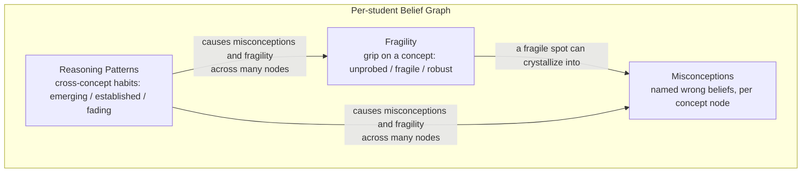
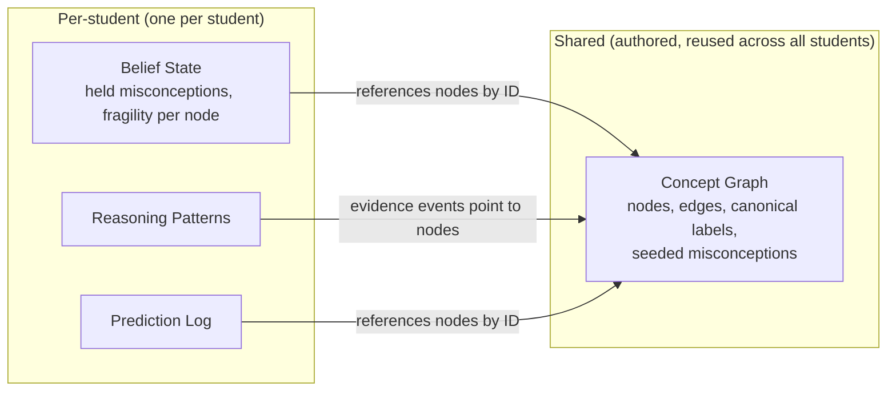

Điểm khẳng định cốt lõi của Stemolly là hệ thống có thể nhìn ra *cách một học sinh suy nghĩ*, chứ không chỉ nhìn vào đáp án các em đưa ra. Toàn bộ khẳng định đó nằm trong **belief graph** (đồ thị niềm tin) — một mô hình bền vững cho từng học sinh, được tích lũy qua nhiều phiên học. Đồ thị này có ba tầng: **misconceptions** (những ngộ nhận sai cụ thể), **fragility** (mức độ nông hay sâu của một câu trả lời đúng), và **reasoning patterns** (các kiểu lập luận, tức thói quen tư duy xuyên suốt nhiều môn). Kết hợp lại, chúng giúp Socratic AI đặt đúng câu hỏi vào đúng thời điểm, đồng thời cho đội ngũ thấy chính xác tư duy của học sinh thay đổi ra sao theo thời gian. Nếu không duy trì được dữ liệu qua nhiều phiên, toàn bộ cơ chế này sẽ không thể tồn tại — cứ đặt lại mô hình sau mỗi phiên thì giá trị cốt lõi của sản phẩm cũng mất đi.

## Tầng 1 — Misconceptions

Một **misconception** là một niềm tin sai cụ thể, được đặt tên, mà một học sinh giữ về một khái niệm. Ví dụ: *believes (a+b)² = a²+b²*. Nó được gắn với phiên học nơi hệ thống quan sát thấy lần đầu. Để một misconception được xem là đã xử lý, chỉ trả lời đúng là chưa đủ — học sinh phải tự thể hiện được cách suy luận đúng trong một bối cảnh *mới*, vì các em hoàn toàn có thể cho ra đáp án đúng nhờ học thuộc mà không hiểu thật.

### Cách lưu niềm tin — event sourcing (lưu theo chuỗi sự kiện)

Mỗi misconception được lưu dưới dạng một mệnh đề, kèm theo **append-only list of evidence events** (danh sách sự kiện bằng chứng chỉ được nối thêm). Trạng thái hiện tại được *suy ra* từ các sự kiện đó, chứ không bao giờ được ghi trực tiếp. Mỗi sự kiện lưu:

- phiên mà nó xuất phát
- một con trỏ ổn định tới transcript
- một đoạn trích ngắn được giữ nguyên để audit
- polarity — tức sự kiện này *ủng hộ* hay *mâu thuẫn* với niềm tin đó

Thiết kế này giúp mọi niềm tin đều có thể kiểm tra lại, luôn có bằng chứng đi kèm và luôn có thể được mở lại. Nếu một học sinh từng vượt qua một misconception nhưng sau đó lại bộc lộ niềm tin sai đó, chỉ cần có thêm một sự kiện ủng hộ mới là trạng thái sẽ tự động bị mở lại. Không có gì bị xóa. Vòng đời vận hành theo chuỗi: **candidate → confirmed → resolved → reopened**.

### Định danh misconception — mô hình lai

Việc xác định đâu là "cùng một misconception" giữa nhiều học sinh khó hơn vẻ ngoài của nó. Hai học sinh có thể cùng giữ một niềm tin sai, nhưng diễn đạt bằng những câu chữ hoàn toàn khác nhau. Có hai lựa chọn cực đoan — chỉ dùng free text thuần túy (linh hoạt nhưng gần như không thể tổng hợp) hoặc dùng một danh mục cố định dựng sẵn (dễ thống kê nhưng không nhận ra ngộ nhận mới). Stemolly dùng một **mô hình lai**:

1. Engine luôn ghi niềm tin sai dưới dạng **free text** (văn bản tự do) trước tiên. Không thông tin nào bị mất.
2. Mỗi niềm tin cũng mang một `canonical_id` có thể để trống, dùng để liên kết với một mục trong **shared catalog** (danh mục dùng chung) khi đã có mục phù hợp.
3. MVP khởi đầu với **empty catalog** (danh mục rỗng). Các mục chuẩn chỉ được tạo về sau, dựa trên các mẫu lặp lại trong dữ liệu học sinh thật.

Catalog phát triển qua hai bước tách biệt:

- **Auto-match** — khi một niềm tin mới được ghi nhận và catalog đã có một mục phù hợp, engine sẽ thử đối sánh ngữ nghĩa. Nếu độ tin cậy cao, hệ thống gán `canonical_id` ngay; nếu không, nó để giá trị này là null.
- **Promote** — các niềm tin free-text chưa khớp sẽ tiếp tục tích lũy. Khi một nhóm niềm tin bắt đầu hội tụ quanh cùng một ý sai, một người trong đội ngũ sẽ xem xét và phê duyệt việc tạo mục catalog mới, rồi back-fill (điền bổ sung ngược) id đó vào các niềm tin đã có.

Auto-match chạy ngay từ ngày đầu vì việc ghép với một mục đã được con người phê duyệt là tương đối an toàn. Promote thì làm thủ công trong MVP — đội ngũ vốn đã đọc transcript, khối lượng còn nhỏ, và chỉ một lần gộp nhầm cũng có thể làm sai toàn bộ các thống kê phía sau. Về sau, một LLM có thể đề xuất các cụm, nhưng trong Console vẫn luôn phải có người phê duyệt. Vì vậy, Console cần một **hàng đợi rà soát "unmatched misconceptions"** cho quy trình này.

## Tầng 2 — Fragility

**Fragility** trả lời một câu hỏi khác với misconceptions: không phải *niềm tin này có sai không?* mà là *niềm tin đúng này thực sự sâu hay chỉ hời hợt?*

Một học sinh luôn trả lời đúng vẫn có thể chỉ đang pattern-matching (khớp mẫu) — áp dụng một quy tắc bề mặt đã ghi nhớ mà không hiểu vì sao nó đúng. Fragility được tách riêng khỏi mastery score (điểm thành thạo) chính vì một học sinh điểm cao vẫn có thể rất mong manh.

Fragility là **thuộc tính thể hiện độ bám của một học sinh trên một concept node** (nút khái niệm). Nó có ba trạng thái được suy ra:

| Trạng thái | Ý nghĩa |
|---|---|
| **Unprobed** | Trả lời đúng ở dạng quen thuộc, nhưng chưa từng bị kiểm tra độ bền — mức độ hiểu vẫn chưa rõ |
| **Fragile** | Đã bị kiểm tra và bị vỡ ra — thất bại ở bài chuyển giao hoặc không giải thích được vì sao |
| **Robust** | Đã bị kiểm tra và vẫn đứng vững — chuyển được sang ngữ cảnh mới và tự giải thích được vì sao |

Quy tắc cốt lõi ở đây là: **unprobed tuyệt đối không bao giờ được xem là robust.** Một người chỉ pattern-match và một người hiểu thật sẽ trông giống hệt nhau cho tới khi bị kiểm tra. Không có bằng chứng kiểm tra thì trạng thái phải là *unprobed*, không phải *robust*. AI buộc phải chủ động khơi lộ fragility — bằng cách đưa khái niệm vào ngữ cảnh bất ngờ, hoặc hỏi "vì sao cách này hiệu quả?" — trước khi engine được phép gọi bất kỳ điều gì là robust.

Fragility và misconceptions tác động qua lại lẫn nhau. Một điểm mong manh khi bị kiểm tra và sụp xuống có thể kết tinh thành một misconception được gọi tên rõ ràng. Vì vậy, hai tầng này không hề độc lập.

## Tầng 3 — Reasoning Patterns

Một **reasoning pattern** nằm *bên dưới* misconceptions và fragility trong thứ bậc chẩn đoán. Chỉ một pattern — chẳng hạn *quay về guess-and-check khi bị bí* hoặc *bỏ cuộc khi hình thức bề mặt thay đổi* — cũng có thể tạo ra niềm tin sai và sự hiểu nông trên nhiều concept node cùng lúc. Vì vậy, sửa một pattern có thể giúp ở nhiều chủ đề đồng thời; đó chính là lý do tầng này tồn tại riêng.

Reasoning patterns mang tính **domain-general** (xuyên lĩnh vực): cùng một thói quen sẽ trông giống nhau dù học sinh đang làm đại số hay đọc hiểu. Chúng thuộc về bản thân học sinh như một tổng thể, chứ không gắn với riêng khái niệm nào.

### Đây là khuynh hướng, không phải công tắc

Khác với một misconception (có thể được xử lý như một công tắc bật/tắt), reasoning pattern là một *thói quen* — thứ học sinh bộc lộ nhiều hơn hoặc ít hơn theo thời gian. Vì thế, nó được mô hình hóa như một **tendency** (khuynh hướng):

- một **strength** có trọng số theo độ mới của dữ liệu (học sinh thể hiện hành vi đó nhất quán đến mức nào)
- một **status** suy ra: *emerging*, *established*, hoặc *fading* — không bao giờ là *resolved*, chỉ có thể yếu dần đi

Một lần quan sát đơn lẻ chưa đủ để gọi là pattern. Chỉ khi có nhiều lần quan sát trên các khái niệm khác nhau, pattern đó mới đạt đến mức *established*. Quy tắc trung thực này là anh em gần với quy tắc "unprobed không phải robust" của fragility — một điểm dữ liệu đơn lẻ không chứng minh được gì.

Mỗi pattern cũng có một **valence** (chiều hướng): *productive* hoặc *unproductive*. Những thói quen tốt — như tự kiểm tra đáp án hay hỏi vì sao trước khi áp dụng quy tắc — cũng là những pattern đáng được ghi nhận và củng cố, chứ không chỉ có các điểm yếu cần sửa.

### Định danh — mô hình lai nghiêng về catalog

Vì tập các reasoning patterns có thể có là nhỏ và khá ổn định — khác với vô vàn misconception gắn với nội dung cụ thể — nên cách định danh cho patterns nghiêng nhiều về một **canonical catalog** dựng sẵn. Free text chỉ thỉnh thoảng mới dùng để bắt một pattern mới hiếm gặp. Điều này trái ngược với trường hợp misconception, nơi free text là dạng chính còn việc đối chiếu catalog chỉ đóng vai trò phụ.

### Dự đoán xuyên môn học

Fragility dự đoán điểm đứt ở *một khái niệm cụ thể*. Còn reasoning pattern dự đoán điểm đứt theo *kiểu tình huống*, bất kể chủ đề là gì. Ví dụ, một học sinh có pattern *established* là bỏ cuộc khi hình thức bề mặt thay đổi thì rất có thể sẽ gặp khó với bất kỳ bài toán nào trông lạ — kể cả trong một môn mà các em còn chưa bắt đầu học. Khả năng dự đoán xuyên môn này là một trong những minh chứng mạnh nhất cho giá trị của belief graph so với một bộ theo dõi hoàn thành đơn giản.

Dù pattern được lưu ở cấp độ học sinh, mỗi evidence event vẫn ghi lại nó đến từ khái niệm nào. Nhờ vậy, phạm vi của pattern — là toàn cục hay chỉ cục bộ trong một mảng môn học — sẽ dần hiện ra từ bằng chứng tích lũy, thay vì bị tuyên bố sẵn ngay từ đầu.

## Cách Graph Được Lưu Trữ

### Một graph cho mỗi học sinh, xuyên mọi môn học

Mỗi học sinh có một belief graph thống nhất bao phủ mọi lĩnh vực — Mathematics, Language, v.v. — chứ không phải một graph riêng cho từng môn. Điều này là bắt buộc vì reasoning patterns mang tính domain-general và vốn đã nằm ở cấp độ học sinh. Một thói quen hời hợt xuất hiện cả trong đại số lẫn đọc hiểu phải được xem là một pattern duy nhất trên cùng một mô hình. Nếu tách graph theo từng môn, tín hiệu đó sẽ bị chia cắt.

### Cấu trúc khái niệm dùng chung vs. trạng thái niềm tin của từng học sinh

Có hai thứ đều được gọi là "graph", nhưng thực chất chúng khác nhau:

- **concept graph** là cấu trúc dùng chung do con người biên soạn: các node, các cạnh tiên quyết, nhãn chuẩn và seeded misconceptions. Nó gọn và có thể tái sử dụng cho mọi học sinh.
- **per-student belief state** (học sinh *này* đang giữ những misconception nào, fragility trên từng node ra sao) tham chiếu tới các concept node bằng ID. Nó không được lưu trực tiếp trên chính node của graph.
- Mọi thứ mang tính xuyên cắt — reasoning patterns và prediction log — đều được lưu ở phía học sinh, không nằm trong graph. Một reasoning pattern không có một node duy nhất để "ở"; nếu nhét nó vào graph thì sẽ buộc phải nhân bản nó trên mọi khái niệm mà nó chạm tới.

Trong cùng một kho lưu trữ, các domain được phân vùng bằng thẻ `domain/subject` trên từng node. Các curriculum (K11, SAT-Math, IELTS) là những **overlay** (lớp phủ) — chúng ánh xạ các khái niệm của chương trình học lên các shared node, theo quan hệ nhiều-về-một khi độ hạt khác nhau, và việc ghép này do con người quyết định dựa trên đề xuất của AI.

### Định danh khái niệm trung lập với ngôn ngữ

Danh tính của một concept node là một **language-neutral ID** (ID trung lập với ngôn ngữ), không phải một cái tên trong bất kỳ ngôn ngữ cụ thể nào. Canonical label là tiếng Anh; còn tên hiển thị sẽ được bản địa hóa cho Console. Cách này bảo đảm mỗi khái niệm chỉ có một node duy nhất, bất kể nó được dạy bằng ngôn ngữ nào. Khái niệm toán học "phân tích một tam thức bậc hai thành nhân tử" vẫn là cùng một node, dù được dạy trong lớp K11 bằng tiếng Việt hay trong khóa SAT bằng tiếng Anh. Nếu lưu các node tách riêng theo từng ngôn ngữ cho cùng một khái niệm, hiểu biết của học sinh sẽ bị chia silo và tín hiệu chuyển giao xuyên curriculum — thứ mà belief graph được tạo ra để nắm bắt — sẽ bị phá hủy.

## Trong MVP — Chỉ Ở Backend

Trong MVP, belief graph vận hành hoàn toàn ở hậu trường. Sẽ không có màn hình nào hiển thị cho học sinh. Các em trải nghiệm engine thông qua chất lượng của chính cuộc hội thoại Socratic — cảm giác được thấu hiểu, được dẫn đến đúng bài toán vào đúng thời điểm — chứ không phải bằng cách nhìn vào graph của bản thân.

Graph chỉ hiện trong **khu vực Observe của Console**. Ở MVP-1, đối tượng sử dụng chính là đội ngũ Stemolly, những người dùng nó để xác nhận rằng engine đang hoạt động đúng. Việc hiển thị graph cho học sinh được để lại cho giai đoạn sau và được xem là một bài toán UX về sau, không phải một ràng buộc kỹ thuật hiện tại.

Để biết chi tiết cách engine cập nhật graph trong một phiên, xem [Triển khai Engine](./engine-impl.md). Để biết graph được kiểm tra độ chính xác ra sao, xem [Kiểm định Engine](./engine-validation.md).
